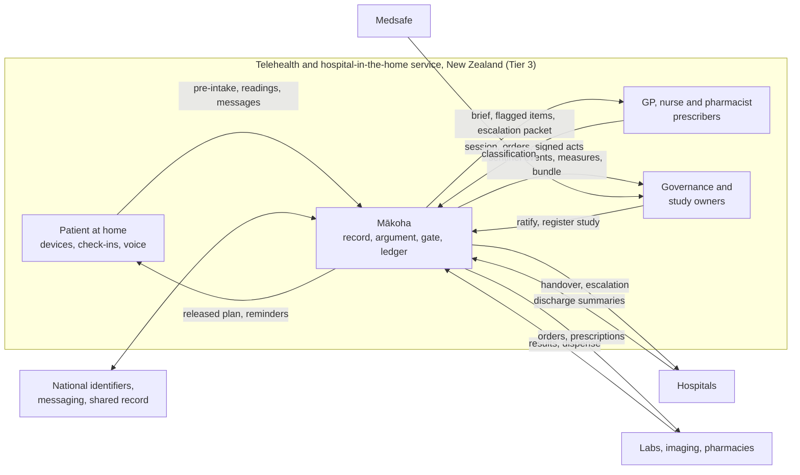

# Concept of Operations

Organisation-level view of how a telehealth and hospital-in-the-home service operates once Mākoha exists. Derived from the PRD (01-prd.md, final v1.0) and, where cited, the Mākoha Design Compendium (`docs/ref/makoha-design-compendium.md`). System-level behaviour belongs to phase 3. Identifiers minted here: SIT- (operational situations), STK- (stakeholders), POL- (policies), RSK- (operational risks), EXT- (external systems), CCR- (change requests raised by this document; CR- remains the PRD's family).

## 1. Mission and need

Derived from PRD section 2 and G-01 to G-10.

A telehealth and hospital-in-the-home service run by general practitioners with nurse and pharmacist prescribers needs to see a patient it may never have met in person, prepared, with the whole record reasoned over rather than re-read; to supervise patients at home as closely as a ward would; and to accrue evidence of its own safety and efficacy while it operates. Today's systems store the free text that holds most of the record's meaning but cannot reason over it, so preparation is re-reading, safety checks fire on coded fields only, deterioration is spotted per contact rather than as a trajectory, and audit or research means a separate project over sampled paper.

The need is a record that turns language into provenanced facts, lets machines propose decisions only as gated arguments with typed uncertainty, and makes every decision replayable, so that operations and prospective study are the same activity over the same ledger (PRD G-10, section 8.1).

## 2. How the job is done today

Stated 25 Sep 2026: the job is done today as a standard encounter or episode of care. Mākoha augments that encounter and episode; it does not replace the clinical process, the roles or the sequence. The walk-through is therefore the ordinary one: booking, pre-consultation history, consultation, orders and prescriptions, follow-up, inbound results and correspondence, and for HITH the admission to the episode, scheduled visits and monitoring, escalation and discharge.

Where it hurts, as stated: some patients are slow at, or less able to, text. Typed pre-intake, check-ins and messages exclude them. The stated solution is real-time voice-to-voice interaction for the patient face. OpenAI's GPT-Live-1 (API released 10 September 2026: full-duplex, listens and speaks at once, handles interruptions and backchannels, delegates reasoning and tool calls to a backend text model) was the first example named; on 25 Sep 2026 it was ruled that the voice model is self-hosted with content-hash-pinned weights so Laws 5 and 7 hold, examples including Fish Audio (PRD CST-13, CAP-20). The capability is class 3, which is why the first release is the Tier 3 profile (CCR-02, approved).

## 3. What changes: the desired operation as a delta

Derived from Volume 1A.3 (lifecycle: before, during, after, between, population), 1A.4 (setting profiles) and PRD section 8.2. Only what changes is named.

| Moment | Today (per PRD section 2) | With Mākoha |
| --- | --- | --- |
| Before the session | Clinician re-reads the record | A consult-prep brief of released arguments is ready before the session joins, within a reading budget; for telehealth, a pre-intake agent has already gathered structured grounds from the patient as a rejectable argument |
| During the session | Notes typed after; checks on coded fields | Ambient capture produces session facts; a flagged "consider" differential with next-best questions; prescribing checked against the reconciled medication story before signing |
| After the session | Follow-ups remembered or lost | Signed plan yields tasks with owners and due dates; coding proposals with span evidence; patient-register summary delivered after sign-off |
| Between contacts (HITH) | Deterioration noticed per visit | Device streams and check-ins re-score risk after every fact change; one trajectory; escalation packet carries the argument, not a phone summary |
| Inbound | Letters, results and messages read in arrival order | Classified, matched to the originating order, routed by urgency; discrepancies surfaced before a clinician opens the letter |
| Scope of practice | Nurse and pharmacist prescribers phone the GP | Profile applied at evaluation time; out-of-scope predicate creates an escalation packet with full context |
| Governance and research | Audit by sampling; studies as projects | Sentinel events, audits and prospective studies are queries over the ledger; a study is a sealed envelope with enrolment on phenotype match |

## 4. Stakeholders

Users derived from PRD section 3; non-users derived from PRD sections 9, 10 and 13 and Volume 2A.3. Rows marked proposed are not in upstream.

| Id | Stakeholder | Stake | User? |
| --- | --- | --- | --- |
| STK-01 | General practitioners operating telehealth and HITH | Prepared sessions; safe prescribing; supervising physician for HITH episodes | Yes |
| STK-02 | Nurse prescribers | Protocol pathways within formulary; escalation with context | Yes |
| STK-03 | Pharmacist prescribers | Reconciled medication history; medication review; red-flag routing | Yes |
| STK-04 | Patients and carers | Pre-intake, check-ins, device readings, results and plan in their own words; consent | Yes |
| STK-05 | Practice governance (clinical governance role) | Ratifies loss matrices, templates, thresholds; reviews sentinel events; owns the evaluation register | Yes |
| STK-06 | Study owners and clinical researchers | Register studies, enrol on match, read endpoints, receive consented extracts | Yes |
| STK-07 | Medsafe (New Zealand), then the TGA (Australia), possibly the FDA (United States) (OCR-01) | New Zealand: WAND notification by the sponsor and post-market obligations; Australia: device classification for the Tier 3 profile (D-11); United States: classification as a compliance item; regulator bundle for each | No |
| STK-08 | Compliance role | Terminology licence (D-07); obligations register; device confirmation | No |
| STK-09 | Architecture role | Owns D-01, D-03, D-06, D-08 | No |
| STK-10 | Hospitals discharging into HITH and receiving escalations | Send discharge summaries; receive handover and escalation packets | No |
| STK-11 | Laboratories, imaging providers, pharmacies | Receive orders; return results and dispense records | No |
| STK-12 | Health and Disability Ethics Committees (HDEC) and, for out-of-scope studies, an institutional ethics committee | Confirmed 25 Sep 2026 as low-friction. Mandated, not merely good practice, when a study is health and disability research within HDEC scope: intervention studies, and observational studies that use identifiable information without consent or carry other elevated risk. Audits and quality-improvement studies evaluating current or slightly changed practice are out of HDEC scope but still require ethics review by an institutional or independent committee under the NEAC National Ethical Standards (2019). Each study in SIT-07 is classified at registration | No |
| STK-13 | {{TBD: payer or funder of the service (deferred)}} | | No |

## 5. Operational environment

Derived from PRD sections 8.1 and 9, Volume 3A groups F, J and 3.2. External system names are as the compendium gives them; New Zealand instances are not yet named.

| Aspect | Description |
| --- | --- |
| Settings | Telehealth (video and phone sessions bound to encounters) and hospital in the home (episodes of care with scheduled visits, device streams, escalation rules) |
| Organisational unit | Deferred 25 Sep 2026 |
| Jurisdiction | New Zealand first (Medsafe), Australia second (TGA); site agnostic |
| Regulatory posture | Tier 3 profile (general-purpose assistant): class-2 outputs flagged only; class-3 outputs through review queues only, never a control; permitted-prompt whitelist as signed configuration (D-06). In New Zealand today there is no pre-market approval for medical devices under the Medicines Act 1981: a New Zealand sponsor notifies the device in Medsafe's WAND database within 30 days, holds evidence that it is safe for its intended purpose, and meets post-market obligations (complaints, adverse events, recalls, changes). The Medical Products Bill, to replace the Medicines Act, will regulate software as a medical device including AI used for a therapeutic purpose, with an internationally aligned definition that excludes general clinical software and general-use AI; Cabinet agreed further policy on 7 April 2026; the Government intends to introduce the bill in 2026 with commencement around 2030 and a longer transition for many devices. This is the closing window in CST-12. See CCR-03 |
| Physical | Clinicians remote; patients at home with connected devices (BP, glucose, SpO2, weight, wearables, HITH equipment); edge node possible on a practice server or in a browser |

| Id | External system (Volume 3A) | Direction | New Zealand instance |
| --- | --- | --- | --- |
| EXT-01 | National patient and provider identifiers | Lookup | National Health Index (NHI; new AAA11A# format issued from 1 July 2026) and Health Provider Index (HPI: Practitioner, Organisation, Facility, PractitionerRole), Health New Zealand \| Te Whatu Ora |
| EXT-02 | Secure clinical messaging network | Both | HealthLink (results, referrals, clinical documents, discharge summaries). GP2GP record transfer runs over it and is being stabilised then replaced by API-based transfer |
| EXT-03 | Shared national record | Both | Hira, Health New Zealand's national health information platform and API marketplace; NZ International Patient Summary (HISO 10099) as the exchange standard; regional clinical data repositories such as TestSafe (Northern region, on Sysmex Éclair) |
| EXT-04 | Electronic prescribing and dispense records | Both | New Zealand ePrescription Service (NZePS), via the Connected Health programme |
| EXT-05 | Laboratory and imaging result feeds | Inbound | Community and hospital laboratories and radiology via HealthLink; regional repositories (TestSafe) where available |
| EXT-06 | Hospital discharge summaries | Inbound | via EXT-02 or EXT-03 |
| EXT-07 | Terminology edition (national SNOMED CT edition) | Pinned | New Zealand edition (D-07); {{TBD: confirm release cadence and licence holder (deferred)}} |
| EXT-08 | Video session provider (WebRTC), SMS and email gateways | Both | Vendors deferred 25 Sep 2026. The voice agent is not an external system: it is a self-hosted sidecar (PRD CAP-20, CST-13) |
| EXT-09 | Home device gateways | Inbound | Vendors deferred 25 Sep 2026 |
| EXT-10 | Identity providers per face (professional registration, consumer identity) | Auth | Professional: HPI-bound registration (Medical Council, Nursing Council, Pharmacy Council). Consumer: {{TBD: national consumer health identity, unconfirmed by search (deferred)}} |
| EXT-11 | Billing | Both | Private billing in New Zealand: invoices, payments, receipts; no claiming gateway in the first release (OCR-03); Australian claiming channels return with the TGA release |
| EXT-12 | Independent append-only log for Merkle anchoring (D-08) | Outbound | Provider open |

## 6. Operational situations

Derived from Volume 1A.3 operations, the discharge acceptance episode in Volume 2A.4 and PRD section 8.2. Each has a trigger, actors and outcome so phase 3 can refine it into scenarios.

| Id | Situation | Kind | Trigger | Actors | Outcome |
| --- | --- | --- | --- | --- | --- |
| SIT-01 | Telehealth consultation with an unfamiliar patient | Routine | Appointment booked | Patient, pre-intake agent, GP or prescriber | Pre-intake argument and brief ready before join; session facts captured; flagged differential considered; prescriptions checked; tasks and patient summary signed |
| SIT-02 | HITH daily supervision | Routine | Episode active; scheduled check-in or device reading | Patient, devices, HITH nurse, supervising GP | Facts posted; risk re-scored after every change; next-day visit plan as tasks; daily summary queued for sign |
| SIT-03 | Deterioration at home | Urgent | Sustained device threshold breach or symptom check-in | Patient, HITH team, supervising GP, hospital | Critical-lane event; flagged deterioration argument; escalation packet with brief, facts, open attempts and acts; same-day action or "no longer fits home care" argument |
| SIT-04 | Post-discharge medication discrepancy | Exception | Discharge summary filed; patient reports a different dose | Inbound pipeline, pharmacist prescriber, patient | Disagreement row exists before any clinician opens the letter; pharmacist call task within 48 h; reconciled list before next prescribing check |
| SIT-05 | Inbound item that cannot be matched | Exception | Result or letter with low patient or order match weight | Inbound pipeline, reconciliation queue, staff | Never auto-filed; reconciliation queue; unfiled items past configured age escalate |
| SIT-06 | Prescriber reaches the edge of scope | Exception | Out-of-scope predicate fires or medication outside formulary | Nurse or pharmacist prescriber, GP | Order held; escalation packet created with argument ids; GP acts on the same graph without re-telling |
| SIT-07 | Prospective study alongside operations | Routine (governance) | Governance registers a study; cohort phenotype matches | Study owner, governance, patients (consent), evaluator | Sealed envelope; enrolment on match with consent scope; endpoints as validated Measures at window end |
| SIT-08 | Onboarding a service or site | Onboarding | New organisation, prescriber or patient cohort joins | Compliance, governance, architecture, staff | Profiles and scope fragments compiled; identities bound; baselines for MET-01 to MET-11 captured at cut-over |
| SIT-09 | Engine drift or retirement | Exception | Drift monitor breach on a class-2 engine | Governance, architecture | Engine pin retired; its claim types fall back to class 1; sentinel entry; no silent degradation |

## 7. Policies and constraints

Derived from PRD sections 5, 9 and 10 and Volume 2.1, 11.4. These bound how the service may be operated; phase 5 turns them into requirements.

| Id | Policy | Source |
| --- | --- | --- |
| POL-01 | No autonomous prescribing; no order acted on without a signing clinician | NG-01 |
| POL-02 | Only the evaluator assigns released, flagged or held; machine outputs are proposals until gated | PRD section 5, Law 4 |
| POL-03 | A held argument is invisible to every face; a flagged one is visible to clinician and governance only; a patient sees a released argument only after sign-off | Volume 2.1 |
| POL-04 | Scope of practice is a signed profile fragment applied at evaluation time; escalation carries the full context packet | PRD section 3; Volume 1A.4 |
| POL-05 | Consent gates secondary use, research export and contact for eligibility; withdrawal propagates as an event | Volume 2A.1; 3A.10 |
| POL-06 | Break-glass access requires a reason, writes an act and a sentinel entry | CST-07 |
| POL-07 | Loss matrices, templates and thresholds are ratified by clinical governance before use; provisional templates may reach flagged but never released | CST-09, CST-10 |
| POL-08 | Studies are registered as sealed envelopes before their window; a changed plan is a new envelope | Volume 10.4 |
| POL-09 | A New Zealand sponsor is appointed and the device notified in WAND, with safety evidence held, before the Tier 3 profile operates in New Zealand; TGA classification confirmed before Australia | CST-03 |
| POL-10 | No online learning in production; no fusion of probabilities across engines; no composite ranking of patients or clinicians | NG-02, NG-03, NG-05 |
| POL-11 | Privacy: Privacy Act 2020 and Health Information Privacy Code 2020; Telecommunications Information Privacy Code 2020 for telehealth traffic | Search 25 Sep 2026 |
| POL-12 | Practice: Health Practitioners Competence Assurance Act 2003; Health and Disability Commissioner's Code of Health and Disability Services Consumers' Rights; Medical Council of New Zealand Statement on Telehealth (same standard of care as in person, within the modality's limits; registration, examination and prescribing expectations); RNZCGP position statement on telehealth in primary care | Search 25 Sep 2026 |
| POL-13 | Prescribing: Medicines Act 1981 and Medicines Regulations 1984 (regulations 40 and 41 on prescriptions, with a current waiver on 41); Misuse of Drugs Regulations 1977; Medicines (Designated Prescriber: Registered Nurses) Regulations 2016 with the gazetted specified-medicines list and Nursing Council guidance (August 2024); pharmacist prescriber regulations {{TBD: exact instrument not confirmed by search (deferred)}} | Search 25 Sep 2026 |
| POL-14 | Devices: Medicines (Database of Medical Devices) Regulations 2003 (WAND notification by a New Zealand sponsor); the Medical Products Bill once enacted | Search 25 Sep 2026 |
| POL-15 | Research: NEAC National Ethical Standards for Health and Disability Research and Quality Improvement (2019); HDEC standard operating procedures for scope | Search 25 Sep 2026 |

## 8. Operational risks and mitigation concepts

Derived from the ten laws (PRD section 5), Volume 9.6, 3.4, 10 and PRD section 12.

| Id | Risk | For whom | Mitigation concept | Source |
| --- | --- | --- | --- | --- |
| RSK-01 | Alert fatigue: clinicians ignore flagged items | Clinicians, patients | Attention budget per encounter under a governed suppression policy; suppressed items reachable and counted | Law 9 |
| RSK-02 | Wrong-patient or wrong-order match on inbound | Patients | Probabilistic matcher with pinned weights; below threshold goes to reconciliation queue, never guessed | Volume 3.4 |
| RSK-03 | A class-2 engine degrades unnoticed | Patients | Drift monitor per engine per subgroup; breach retires the pin; claim types fall back to class 1 | Volume 1A.7 |
| RSK-04 | Home device miscalibrated or unknown | HITH patients | Device identity and calibration status stored; unknown calibration imposes a reliability floor | TH-04 |
| RSK-05 | Escalation loses context between prescriber and GP | Patients, prescribers | Escalation packet is a signed bundle of brief, facts, open attempts and acts | Volume 1A.4 |
| RSK-06 | Legislation receives royal assent before launch | The programme | Bill tracked against milestone exits; launch scope kept small | CST-12 |
| RSK-07 | Loss matrices not ratified in time for the first-release claim types | The programme | Ratification is an M9 exit gate; placeholders never reach a Tier 3 release build | CST-10 |
| RSK-08 | Study evidence contaminates training or knowledge | Research integrity, patients | Evaluation firewall; zone labels; compiler gate 1 rejects evaluation-zone provenance | Law 10 |
| RSK-09 | Patients slow at or unable to text are excluded from pre-intake, check-ins and messaging | Patients | Real-time voice-to-voice patient interaction (PRD CAP-20); voice answers stored as questionnaire responses with dialogue spans, as typed ones are; no recording without consent | Stated 25 Sep 2026 |
| RSK-11 | A class-3 voice or text output reaches a patient as advice | Patients | Bounded loop: class-3 outputs go to a review queue only and are never a control; the patient face renders released, signed arguments only | Law 4; Volume 7.5; POL-03 |
| RSK-10 | Organisation-specific operational risks (staffing, home connectivity, digital access) | Deferred 25 Sep 2026 | To be added when stated | |

## 9. Operational Concept Graphic

Mermaid is the source of truth. Actors, the capability as one node, external systems, the environment as the enclosing subgraph, principal flows labelled.

## 10. Change requests to upstream

The PRD is final. All four were approved and applied to 01-prd.md on 25 Sep 2026; `docpipe update` run afterwards.

| Id | Target | Item | Change |
| --- | --- | --- | --- |
| CCR-01 | 01-prd.md | Section 8.2, operation 1 row and the consequence paragraph; section 3 telehealth row | The pre-intake conversational agent runs under the Volume 7.5 bounded generative loop (Volume 2A.1, 3A.11 J2, POR-03), which is class 3 and excluded from the Tier 2 build. The PRD places "the telehealth pre-intake summary as a rejectable argument" in the Tier 2 first release. Correct to: typed or form-based pre-intake questionnaires (class 1) in Tier 2; the conversational pre-intake agent in Tier 3 |
| CCR-02 | 01-prd.md | Section 7 (CAP-20), section 8.1, 8.2, CST-13, RSK-09 here | Add real-time voice-to-voice patient interaction for pre-intake, check-ins and messages for patients slow at or unable to text. A generative voice model is class 3 under Law 4 and Volume 7.5, so the capability belongs to the Tier 3 profile. Ruled: first release is Tier 3 so voice ships from day one; the voice model is self-hosted with pinned weights, not a vendor API (examples: Fish Audio) |
| CCR-03 | 01-prd.md | CST-03, CST-12, section 12 | In New Zealand today there is no device classification or pre-market approval to confirm (Medicines Act 1981): the obligation is WAND notification by a New Zealand sponsor with evidence of safety for intended purpose and post-market duties. Reword CST-03 for New Zealand to "sponsor appointed, WAND notification lodged, safety evidence held", keeping the decision-support classification for the TGA and for the Medical Products Bill once enacted. Reword CST-12: the window closes at commencement of the Medical Products Bill, planned around 2030 after introduction in 2026, with a transition period |
| CCR-04 | Compendium (via CR-01) | Volume 7.4 | "pre-intake question" is used as a claim type and is in neither vocabulary list; add to the union |

## 11. Assumptions

| Assumption | Confidence | How it would be checked |
| --- | --- | --- |
| The operating organisation can staff HITH with a nurse-led team under GP supervision across the launch cohort | Deferred 25 Sep 2026 | Staffing plan at SIT-08 |
| Patients in the launch cohort have connectivity and devices adequate for daily check-ins | Deferred 25 Sep 2026 | Digital-access screening at enrolment |
| New Zealand national systems (EXT-01 to EXT-05) expose interfaces the compendium's adapters can implement | Medium | Named in section 5 from public sources, not yet from integration documentation; confirmed in phase 4 |
| The Medical Products Bill commences around 2030, so a Tier 3 launch under the current WAND-notification regime is achievable | Medium | Bill progress tracked at every milestone exit (RSK-06) |

## 12. Open questions

- [x] Current-operations walk-through: standard encounter and episode of care, augmented (section 2)
- [ ] Operating organisation and structure (section 5) {{TBD: operating organisation (deferred)}}
- [x] New Zealand names for EXT-01 to EXT-05 from public sources; EXT-08, EXT-09 vendors and consumer identity deferred
- [x] HDEC confirmed and its mandate stated (STK-12); payer or funder deferred (STK-13)
- [x] New Zealand law and standards (POL-11 to POL-15); pharmacist prescriber instrument unconfirmed
- [ ] Organisation-seen operational risks deferred (RSK-10)
- [x] CCR-01 to CCR-04 approved and applied; first release is Tier 3
- [x] Voice engine: self-hosted, weights content-hash pinned; examples include Fish Audio (PRD CST-13)
