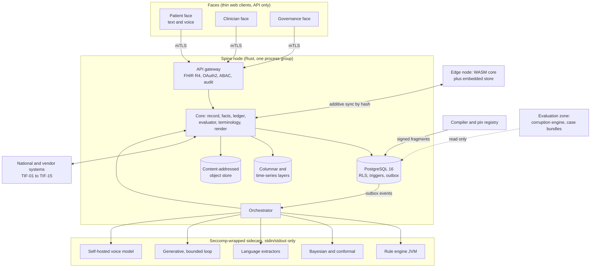

# Technical Specifications

How Mākoha is built to deliver the Operations Concept (03-opscon.md, final v1.0) within the PRD (01-prd.md, final v1.0). The Mākoha Design Compendium (`docs/ref/makoha-design-compendium.md`) is the authoritative build specification for types, schema, state machines, algorithms and tests; this document maps it to the OpsCon and fixes what the compendium leaves open. Where the compendium gives a number, it is the default the first release ships with, and every behaviour-governing number is a signed, versioned configuration value, never a code literal. Identifiers minted here: COMP- (components), TIF- (technical interfaces), TECH- (stack rows), TGT- (engineering targets), STD- (standards mapping), DEC- (design decisions), TCR- (change requests raised by this document).

## 1. Architecture overview

Derived from Volume 1.5, 11.3 and 3A.1. The OpsCon boundary (section 1 there) is the architecture boundary: one spine node per deployment, sidecars in separate sandboxed processes, three thin faces, an evaluation zone with read-only access to the ledger, and optional edge nodes.

Three regulatory profiles are produced from one workspace by Cargo features (`tier1`, `tier2`, `tier3`) with a signed manifest per build; the first release is `tier3` (PRD section 8.1).

## 2. Components

Derived from Volume 3A.1 (workspace), 7.3 (engine families), 9, 10 and the OpsCon scenarios. Every OpsCon scenario step is served by at least one component; the last column names the scenarios.

| Id | Component | Responsibility | Technology | Serves |
| --- | --- | --- | --- | --- |
| COMP-01 | `core-types` | Fixed6, Pin, Code, effective time, provenance, consent, type-state markers; non-coercible signal types | Rust crate, `#![forbid(unsafe_code)]` | All |
| COMP-02 | `record`, `events` | FHIR R4 resource store with versions, provenance, compartments; transactional outbox; durable filtered subscriptions with two lanes | Rust; PostgreSQL 16 | All |
| COMP-03 | `facts` | Fact graph with span links, disagreement rows, per-patient in-memory graph | Rust | SCN-01 to SCN-05 |
| COMP-04 | `terminology` | In-process mirror of the pinned SNOMED CT New Zealand edition; lookup, expand, subsumes, validate, translate; tiered graph | Rust; embedded analytical DB rebuilt per pin, read-only at runtime | SCN-01, SCN-04 |
| COMP-05 | `identity` | Master identity, probabilistic matcher with pinned weights, merge and unmerge acts, NHI and HPI client | Rust | SCN-01, SCN-05, SCN-08 |
| COMP-06 | `orders`, `medications`, `results` | Order state machine (drafted to reconciled, overdue flag), prescribing-check request builder, e-prescription conformance, results inbox and actioning | Rust | SCN-01, SCN-04, SCN-05, SCN-06 |
| COMP-07 | `inbound`, `correspondence`, `national-record` | Channel adapters (HL7 v2, secure messaging, national record, device, portal, scan and OCR, email); five-step inbound pipeline; letters, referrals, secure message delivery; shared record view and upload | Rust; OCR extractor sidecar | SCN-03 to SCN-05 |
| COMP-08 | `scheduling`, `billing`, `admin` | Appointments, sessions, waiting room; private billing (fee schedules, invoices, receipts, debtors); users, roles, MFA, providers, configuration, audit queries | Rust | SCN-01, SCN-08; ROL-15 |
| COMP-09 | `clinical`, `recalls`, `immunisation`, `reporting` | Notes, histories, problems, care plans, calculators; recall register and reminder runs; declarative views, registers, measures, extraction, studies module with sealed envelopes | Rust; columnar layer | SCN-02, SCN-07 |
| COMP-10 | `comms`, `portal-api`, `telehealth` | Consented communications with automated label; portal routes, forms, results release, pre-intake agent host, engagement loops; video and phone sessions, remote-monitoring intake, HITH episodes | Rust; WebRTC provider adapter; device gateway adapters | SCN-01 to SCN-04 |
| COMP-11 | `evaluator` | Five fixed stages, check catalogue, loss-matrix thresholds, three verdict classes, anti-combiner; pure; fixed-point only; `cargo deny` bans float-math crates | Rust | Every attempt |
| COMP-12 | `orchestrator` | Resolves the eight pins, gathers typed signals, calls engines, enforces claim-type and verdict-class declarations, passes drafts to the evaluator, appends attempts; bounded generative loop with class-2 testers | Rust | SCN-01 to SCN-04, SCN-09 |
| COMP-13 | Compiler and pin registry | Eleven gates; content registry; effective dates; retirement flag; only principal that may insert into `pin_registry` and `generic_argument` | Rust; PostgreSQL grants | SCN-07 to SCN-09 |
| COMP-14 | `render` and attention layer | Three register templates and element maps; render-invariance property; view-authorisation function; consult-prep brief within reading budget; suppression records; disposition line | Rust | SCN-01 to SCN-03 |
| COMP-15 | Rule engine sidecar | Class-1 evaluation of compiled fragments (prescribing checks, red flags, routing, recalls, phenotypes, eligibility) | JVM in seccomp sandbox rule language and runtime deferred 25 Sep 2026 | SCN-01 to SCN-07 |
| COMP-16 | Bayesian and conformal sidecar | Class-2 differential and risk engines wrapped in conformal prediction; validation report in pin | Python or model runtime in seccomp sandbox | SCN-01 to SCN-03 |
| COMP-17 | Language extractor sidecars | NER, assertion, relation, mapping, temporal, classification, adverse-event, SDOH, patient-voice, OCR, de-identification (CAP-01 to CAP-06, CAP-09 to CAP-11, CAP-14, CAP-16) | Model runtime in seccomp sandbox; frozen weights pinned (class W) | SCN-01, SCN-04, SCN-05 |
| COMP-18 | Generative sidecar | `gen-summary`, `gen-qa`, suggested responses, pre-intake dialogue text; class 3; only inside the bounded loop | Model runtime in seccomp sandbox; base model pinned (class M); prompts and policy pinned (class P) | SCN-01, SCN-04 |
| COMP-19 | Voice sidecar (CAP-20) | Full-duplex speech-to-speech for the patient face; self-hosted; weights pinned; writes nothing itself; transcript with spans handed to COMP-10 | Self-hosted model in seccomp sandbox, GPU model selection deferred to M9 | SCN-01, SCN-04 |
| COMP-20 | Evaluation zone | Corruption engine, case bundles, sealed-envelope analysis, drift monitor; read-only on the ledger; no write path to pins or training | Separate process and database role | SCN-07, SCN-09 |
| COMP-21 | `api-gateway` | FHIR R4 REST, subscribe, bulk export; OAuth2 and SMART launch; ABAC per request; one AuditEvent per request; agent tool interface from CapabilityStatement; mTLS to faces | Rust | All |
| COMP-22 | `ops`, `migration`, `media` | Event-log backup to a second region, point-in-time restore, edge sync, print rendering; importers and exporters; content-addressed object store client | Rust; object store | SCN-08, SCN-10 |
| COMP-23 | Edge node | Core compiled to WASM plus embedded store; local pins; additive sync | Rust to WASM; browser or practice server | SCN-10 |
| COMP-24 | Faces | Patient (text and voice), clinician, governance web clients; stateless renderers over authorised reads; submitters of signed acts | Web interfaces (stated 25 Sep 2026): browser clients over the gateway API; web framework {{TBD: chosen at M7 (deferred)}} | All |

## 3. Technical interfaces

Each OpsCon interface IF-01 to IF-15 is realised here. Derived from Volume 3A.1 (gateway), 3A.7, 3A.11, 3.6, 10.7.

| Id | Realises | Protocol and contract | Auth | Versioning |
| --- | --- | --- | --- | --- |
| TIF-01 | IF-01 NHI and HPI | Health New Zealand identity APIs through the Hira marketplace, reached by API (stated 25 Sep 2026); endpoint and conformance detail from onboarding; new NHI format AAA11A# accepted from 1 July 2026 | OAuth2 client credentials issued by Health New Zealand | Per Health NZ API version; adapter trait per version |
| TIF-02 | IF-02 HealthLink | National secure-messaging specification: signed and encrypted clinical documents (CDA-based and PDF with structured header; FHIR document bundle where supported); transport and application acknowledgements stored | Provider certificate in HSM; recipient certificate from directory | Adapter trait per network version |
| TIF-03 | IF-03 Hira and NZIPS | FHIR R4 document retrieval and upload; NZ International Patient Summary (HISO 10099) for shared health summary and event summary; NZ base profiles applied | OAuth2 via Hira | Per Hira API version |
| TIF-04 | IF-04 NZePS | New Zealand ePrescription Service conformance; prescription submit, dispense record retrieval | Per NZePS onboarding | Per NZePS version |
| TIF-05 | IF-05 results | HL7 v2 ORU over HealthLink and direct feeds; matched to orders by identifier then probabilistic matcher | As TIF-02 | HL7 v2.x profile per sender |
| TIF-06 | IF-06 hospitals | Discharge summaries inbound via TIF-02 or TIF-03; handover and escalation outbound via TIF-02 | As TIF-02 | As TIF-02 |
| TIF-07 | IF-07 terminology | SNOMED CT New Zealand edition release files imported by the compiler as pin class S; FHIR terminology operations exposed internally | Licence recorded in obligations register | Edition date is the pin |
| TIF-08 | IF-08 patient channels | SMS and email gateway adapter traits (two-way, short-code parsing, webhooks); portal messaging over TIF-13; print batch | Gateway API keys in hardware-backed store | Adapter per vendor |
| TIF-09 | IF-09 video and phone | WebRTC provider adapter trait; short-lived join tokens; recording only with a consent resource; audio chunks to the transcription pipeline | Join token bound to encounter and principal | Adapter per vendor |
| TIF-10 | IF-10 devices | Device gateway ingest (`POST /devices/streams`): device identity, calibration status, sampling rate; time-series store; promotion rules as pinned fragments | Device credentials per gateway | Per gateway vendor |
| TIF-11 | IF-11 identity | OAuth2 and OpenID Connect per face; SMART app launch for embedded apps; professional tokens carry HPI, registration and scope profile; TOTP MFA for clinician and governance faces; argon2id password hashing; consumer identity with proofing level (provider deferred 25 Sep 2026) | OIDC | Per provider |
| TIF-12 | IF-12 regulator bundle | Signed archive: arguments, attempts, acts, conflicts in window; every pin with bytes or signed locator; replay report; corruption campaign report; coverage declarations; obligations extract; manifest with sha256 per file; governance-key signature; published offline verifier | Governance signing key | Bundle format version in manifest |
| TIF-13 | Faces to gateway | FHIR R4 REST plus subscribe and bulk export; view-authorisation function on every argument read (404 for held, 403 for flagged to patient) | mTLS plus OAuth2 bearer | API version in path; CapabilityStatement published |
| TIF-14 | IF-13 Merkle anchor | Periodic ledger root published to an independent append-only log; receipt stored | Provider credentials | Per provider (D-08 open) |
| TIF-15 | IF-14 private billing | Invoice, receipt and payment records; payment provider adapter trait | Provider API keys | Adapter per vendor |
| TIF-16 | IF-15 Ketryx | Export of requirements (phase 5 ids), risks, verification evidence and acceptance-test results with lineage; import of standards clauses and controlled targets (MET-02, MET-06); exchange by the Ketryx API and its Model Context Protocol (MCP) server (stated 25 Sep 2026), so that this document set and its agents read and write Ketryx items directly | Ketryx credentials; MCP server authorisation | Per Ketryx API version |
| TIF-17 | Sidecar boundary | stdin and stdout only; JSON Schema for `ArgumentDraft` and for each extractor output validated at the process boundary; no network namespace | Process identity; seccomp profile per sidecar | Harness protocol version pinned |
| TIF-18 | Edge sync | Additive sync of resource versions by hash; conflicts to disagreement rows; queued national transactions flush in order | mTLS with node certificate | Sync protocol version |

## 4. Data model, storage, retention and migration

Derived from Volume 1A.1 (Fact), 4 (argument types), 5.7, 8.1 (ledger DDL), 3A.1 (storage layers), 3A.12 and OpsCon section 6.

| Entity (OpsCon DAT-) | Model | Storage | Retention |
| --- | --- | --- | --- |
| Fact (DAT-01) | `Fact` struct: fact id (sha256), patient, subject code (pinned edition), predicate from a closed register, object, assertion, time anchor, source span (document version plus byte range), extractor pin, reliability (Fixed6 signal), consent | `fact` and `fact_disagreement` tables; in-memory per-patient graph | Never deleted; superseded |
| Argument draft, attempt, actual argument (DAT-02) | Six elements as types; six-signal qualifier in Fixed6 with no cross-kind operations; type-state lifecycle draft to actual; canonical serialisation and JSON Schema; attempt id = sha256(request hash plus evaluator pin) | `attempt`, `argument`, `conflict_record` in the ledger schema; per-patient hash chain by trigger; RLS as second enforcement of the view rule | Never deleted |
| Act (DAT-03), Order (DAT-04), Task, Communication, Appointment (DAT-05), QuestionnaireResponse and Observation (DAT-06), Consent (DAT-07) | FHIR R4 resources with the New Zealand base profile; every write carries provenance (author or model pin, source method, reason) | `resource` table, versioned; outbox row in the same transaction | Never deleted; tombstones only |
| Pin, fragment, template, threshold set, loss matrix, profile (DAT-08) | `pin_registry` (pin, class S R K I W F M P U, locator, effective dates, signature, retired flag); `generic_argument` | Ledger; content-addressed store for artefact bytes | Never deleted; retired flag |
| StudyDefinition, sealed envelope, enrolment, MeasureReport, evaluation register (DAT-09) | As Volume 3A.10 and 10.4 | Ledger and reporting store | Never deleted |
| AuditEvent, SuppressionRecord, sentinel entry, drift record (DAT-10) | One AuditEvent per request | Ledger | Never deleted |

Storage layers: relational (PostgreSQL 16) as source of truth for resources, ledger and indexes; columnar layer for views, registers and cohort queries rebuilt by event replay; time-series layer for device streams; content-addressed object store for originals (documents, images, audio); in-memory fact graph per active patient. Retention: statutory minimum of ten years from last treatment (OpsCon section 6) is exceeded by never-delete; archival by window with Merkle anchor. Migration: importers for incumbent formats with lineage on every migrated resource; unstructured legacy content stored as originals and extracted through the inbound pipeline; exporters as bulk FHIR, CSV and NDJSON. Multi-tenancy: tenant and project scoping on every resource; one deployment may serve many services.

## 5. Stack

Every row carries a pin or an explicit TBD. Reasons from Volume 11.3 and D-01 unless stated.

| Id | Item | Pin | Reason |
| --- | --- | --- | --- |
| TECH-01 | Rust toolchain for core, gateway, compiler, render, edge and build tooling | Stable channel, exact version pinned in `rust-toolchain.toml` at M1 (Rust as the tooling, stated 25 Sep 2026; version deferred) | Memory safety without a runtime; `forbid(unsafe_code)` in evaluator and argument crates; compiles to WASM for the edge node (D-01) |
| TECH-02 | PostgreSQL | 16 | Row-level security, triggers for the hash chain, transactional outbox; insert-only ledger schema |
| TECH-03 | Columnar analytics engine and time-series store | engines deferred 25 Sep 2026 | Rebuilt from events; not sources of truth |
| TECH-04 | Object store | provider deferred 25 Sep 2026; content addressed by sha256 | Immutable originals; hash recorded in the resource |
| TECH-05 | Rule engine runtime | JVM rule language and runtime deferred 25 Sep 2026 | Compiled fragments execute deterministically in an intermediate form (gate 10) |
| TECH-06 | Model runtime for extractors, Bayesian and conformal, generative | runtime deferred 25 Sep 2026 | Frozen weights pinned as class W; base model as class M |
| TECH-07 | Voice model | Self-hosted; candidate Fish Audio model and version deferred to M9 | CST-13: weights content-hash pinned; no vendor API |
| TECH-08 | Sandbox | seccomp profiles per sidecar; no network namespace; stdin and stdout only | Law 7; PUR-01 |
| TECH-09 | Identity | OAuth2 and OpenID Connect; SMART app launch; TOTP; argon2id | Volume 3A.1 access control |
| TECH-10 | Interoperability | FHIR R4 with New Zealand base profiles; HL7 v2 for results; CDA and PDF for secure messaging; NZIPS | National systems (TIF-01 to TIF-05) |
| TECH-11 | Terminology | SNOMED CT New Zealand edition, date-pinned | D-07 |
| TECH-12 | Cryptography | sha256 content addressing; signatures by compiler, ratifier and governance keys in a hardware-backed store; mTLS; store-level encryption | Laws 5 and 6; CST-06, CST-08 |
| TECH-13 | Faces | Web interfaces; framework {{TBD: web framework, chosen at M7 (deferred)}} | Stated 25 Sep 2026; thin, API-only, stateless; the edge node alone uses the Rust core compiled to WASM |
| TECH-14 | Packaging and orchestration | Container images with digests; `docker compose` for single-node bring-up; production orchestrator deferred 25 Sep 2026 | One-command bring-up (Volume 3A.1); signed manifest lists images |
| TECH-15 | Hosting and data residency | cloud or on-premises, region and New Zealand data residency deferred 25 Sep 2026 | Health information sovereignty |

## 6. Security and privacy

Derived from Volume 11.4, 3A.1, 2.1, 8.3, PRD CST-06 to CST-08, ConOps POL-03, POL-06, POL-11.

| Item | Specification |
| --- | --- |
| Identity | Per-face identity provider; professional tokens bind HPI number, registration and scope-of-practice profile; consumer identity with proofing level; delegate scope via RelatedPerson; agents receive scoped client tokens that can write only QuestionnaireResponse and patient-reported Observation |
| Authorisation | Attribute-based per request (actor, patient compartment, resource type, consent state, care relationship, purpose) compiled also to row-level security; the single view-authorisation function for arguments (held 404 to all; flagged 403 to patients; released to patients only after sign-off) implemented once in the core and enforced a second time by RLS |
| Classification | Zone labels on artefacts (production, evaluation); compiler gate 1 rejects evaluation-zone provenance; tenant scoping on every resource |
| Encryption | mTLS between faces and gateway; signed events on the outbox relay; store-level encryption at rest; per-patient hash chain and Merkle anchor detect tampering independently of encryption; secure messages signed and encrypted per the national specification |
| Audit | One AuditEvent per request including model inferences with purpose; patient access report from the same table; every print, export and transmit audited; break-glass requires reason, writes an act, raises a sentinel entry |
| Secrets | No clinical behaviour depends on any secret; only transport and signing keys, held in a hardware-backed store; gateway API keys likewise |
| Supply chain | SBOM (SPDX) per build; crate and image digests in the signed manifest; reproducible build check on CI; `cargo deny` for dependency and float-math policy |
| Sandboxing | Sidecars killed on any denied syscall; custom operation scripts sandboxed with no file, network or clock access |
| Privacy | Consent scopes gate secondary use, research export, agent contact and each communication channel; withdrawal is an event honoured within 100 ms by subscribers; de-identification with type-level exclusion of identifier fields from export types; quiet hours and opt-out keywords for messaging |

## 7. Engineering targets

Each OpsCon expectation PERF-01 to PERF-12 has a number and a measurement method. Derived from Volume 3.7, 1A.3, 3A.1 and 3A.12. All run on every build against the 10,000-patient synthetic practice unless stated.

| Id | Target | Number | Measurement |
| --- | --- | --- | --- |
| TGT-01 | Brief assembly (PERF-01) | Under 3 s from cached projections, p95 | Performance suite; brief-before-session rate from ledger events (MET-08) |
| TGT-02 | Red-flag propagation (PERF-02) | Critical-lane event within 100 ms of the answer, p99 | Event timestamps: answer commit to event delivery |
| TGT-03 | Voice turn latency (PERF-02) | end-of-utterance to first audio out, p95, on the chosen model and hardware; number deferred to M9 | Sidecar timing log on a scripted dialogue set |
| TGT-04 | Session facts and differential (PERF-03) | Facts within 2 s of utterance p95; differential update under 500 ms p95 | Transcript timestamps to fact commit; attempt timing |
| TGT-05 | Prescribing check (PERF-04) | Under 200 ms p95 | Synchronous evaluator call timing |
| TGT-06 | Post-session drafts (PERF-05) | Under 10 s p95 | Session end event to draft commit |
| TGT-07 | Device promotion and re-score (PERF-06) | Critical event within 100 ms of promotion p99; re-score within 10 s of fact commit p95; one attempt per 30 s burst | Event timestamps; attempt count per burst |
| TGT-08 | Inbound extraction and routing (PERF-07) | Under 5 s p95; unrouted items older than 24 h = 0 | Intake to route timestamps; nightly queue age report |
| TGT-09 | Task creation (PERF-08) | Under 1 s of sign act p95 | Act to task commit |
| TGT-10 | Nightly runs and cohort queries (PERF-09) | Register and recall run under 30 min for 10,000 patients; cohort query over a year under 2 s | Job duration; query timing |
| TGT-11 | Store and event budgets (PERF-10) | Write under 10 ms p99; search under 50 ms; terminology lookup under 1 ms; commit-to-subscriber under 100 ms p99; over 25,000 writes/s sustained 60 s with 10 writers | Performance suite |
| TGT-12 | Offline endurance and sync (PERF-11) | Edge node operates 8 h offline; queued transactions flush in order on reconnect | Outage drill |
| TGT-13 | Availability, RPO, RTO (PERF-12) | deferred with PERF-12; RPO 0 for the ledger is implied by synchronous outbox commit and continuous shipping; RTO deferred | Failover drill; weekly restore drill report |
| TGT-14 | Replay fidelity | Every replayed attempt reproduces its verdict byte for byte; regulator bundle replays 1% of attempts identically | Replay report per bundle |
| TGT-15 | Purity | Two-process harness byte-compares engine outputs on at least 50 fixtures per claim type and 1,000 corruption-engine inputs | Registration gate |
| TGT-16 | Render invariance | No register omits, adds or reorders a rebuttal or qualifier signal | Property test |

## 8. Deployment, environments, CI/CD and rollback

Derived from Volume 11.1, 11.5, 3A.1 and 3A.12.

| Aspect | Specification |
| --- | --- |
| Profiles | Build-time Cargo features `tier1`, `tier2`, `tier3`; signed `manifest.json` with build hash, profile, features, crate list with hashes, sidecar image digests, SBOM, seccomp profiles, pin classes present; the node attests its manifest at start-up and refuses to serve on mismatch |
| Environments | development, evaluation zone, staging with the synthetic practice, production; count and separation deferred 25 Sep 2026 |
| CI | On every build: unit and compile-fail tests, purity harness, performance suite on the synthetic practice, render-invariance property, compiler gate fixtures, reproducible-build check, SBOM; CI provider deferred 25 Sep 2026 |
| Delivery order | M1 argument and fixed-point crates, M2 evaluator, M3 ledger, M4 compiler and registry, M5 spine functions (all Volume 3A modules; parity suite), M6 Tier 1 engines, M7 faces and rendering, M8 governance, M9 Tier 2 and Tier 3 engines including the generative loop and the voice sidecar; each gated by the acceptance tests of the volumes it completes |
| Knowledge changes | Compiler submissions only; any pin change replays the sentinel decision set before admission; effective-from dates |
| Rollback | Builds: redeploy the previous signed manifest; ledger unaffected. Knowledge: retire the pin and reinstate the prior fragment version with a new effective-from; no deletion. Data: point-in-time restore from the event log with ledger chain verification |
| Backup | Continuous event-log and object-store shipping to a second region with per-tenant keys; weekly automated restore drill with hash comparison |
| Edge | Same core compiled to WASM with an embedded store; local pins refreshed on sync |

## 9. Standards and compliance mapping

Every regulatory constraint from the PRD and every ConOps policy appears here. Rows marked proposed are the Ketryx standards list from the OpsCon, pending compliance confirmation.

| Id | Standard, regulation or constraint | Where addressed |
| --- | --- | --- |
| STD-01 | Medicines Act 1981; Medicines (Database of Medical Devices) Regulations 2003: New Zealand sponsor, WAND notification, safety evidence, post-market obligations (CST-03, POL-14) | Obligations register (COMP-09 reporting, Volume 10.8); regulator bundle TIF-12; manifest attestation |
| STD-02 | Medical Products Bill, software as a medical device including AI (CST-12) | Tier profiles and manifest (section 8); Ketryx standards capture TIF-16 |
| STD-03 | TGA classification per tier (D-11, CST-03) and possibly FDA (OCR-01) | Ketryx TIF-16; profile manifests |
| STD-04 | Privacy Act 2020; Health Information Privacy Code 2020; Telecommunications Information Privacy Code 2020 (POL-11) | Section 6: consent scopes, audit, access report, encryption, tenant scoping; retention section 4 |
| STD-05 | Health (Retention of Health Information) Regulations 1996 | Section 4 retention |
| STD-06 | Health Practitioners Competence Assurance Act 2003; HDC Code of Rights; Medical Council telehealth statement; RNZCGP telehealth position (POL-12) | Professional identity binding TIF-11; scope profiles; consent for recording TIF-09 |
| STD-07 | Medicines Regulations 1984 (regulations 40 and 41); Misuse of Drugs Regulations 1977; Medicines (Designated Prescriber: Registered Nurses) Regulations 2016; pharmacist prescriber regulations (POL-13) | Scope fragments and formulary as signed profiles (COMP-13, COMP-15); e-prescription conformance COMP-06; controlled-drug register |
| STD-08 | NEAC National Ethical Standards 2019; HDEC scope (POL-15) | Study registration with ethics classification (COMP-09; OpsCon SCN-07) |
| STD-09 | SNOMED CT New Zealand edition licence (D-07, CST-04) | Obligations register; TIF-07 |
| STD-10 | National secure-messaging specification; HL7 v2; FHIR R4 New Zealand base; NZIPS HISO 10099; NZePS conformance | TIF-02 to TIF-05, TIF-10 |
| STD-11 | IEC 62304 software life-cycle (proposed) | Ketryx TIF-16; CI section 8; delivery order |
| STD-12 | ISO 14971 risk management (proposed) | ConOps risks, OpsCon must-nevers, Volume 10 corruption engine; Ketryx |
| STD-13 | ISO 13485 quality management (proposed) | Ketryx; obligations register |
| STD-14 | IEC 62366-1 usability engineering (proposed) | Faces, attention budget, patient register grade-8 rule; Ketryx |
| STD-15 | ISO 27001 information security and IEC 81001-5-1 health software security (proposed) | Section 6; supply chain |
| STD-16 | Rust core, forbid unsafe, float ban (CST-01); build-time profiles with signed manifest (CST-02); sandboxed sidecars (CST-05); PostgreSQL 16 with RLS and insert-only ledger (CST-06); identity, mTLS, break-glass (CST-07); no clinical behaviour on secrets (CST-08); provisional templates flagged only (CST-09); loss-matrix ratification (CST-10); WASM edge (CST-11); self-hosted pinned voice (CST-13) | Sections 2, 5, 6, 8; DEC-01 to DEC-05 |

## 10. Design decisions

Compendium decisions D-01 to D-11 are carried as given (PRD section 10). Decisions taken in this set are listed with alternatives, reason and reversibility.

| Id | Decision | Alternatives considered | Reason | Reversible? |
| --- | --- | --- | --- | --- |
| DEC-01 | First release is the Tier 3 profile (PRD 8.1) | Tier 1; Tier 2 with typed pre-intake only | Voice interaction for patients who cannot text must ship from day one; voice is class 3 | Yes: profiles are build-time features; a Tier 2 build is the same workspace |
| DEC-02 | Voice model self-hosted with content-hash-pinned weights (CST-13) | Vendor API (GPT-Live-1) with model id as pin | Laws 5 and 7: a hosted model cannot be pinned or purity-tested; replay would not reproduce | Yes at the sidecar boundary; the transcript contract is the same |
| DEC-03 | Mākoha is the system of record including scheduling and private billing (OpsCon section 1) | Beside an incumbent PMS | One ledger, one audit; billing items are encounter-linked | Costly to reverse once migrated |
| DEC-04 | New Zealand first under the WAND-notification regime, before the Medical Products Bill commences | Australia first under TGA classification | Closing regulatory window; small launch alongside prospective studies (G-10) | Yes: jurisdiction is configuration and obligations, not code |
| DEC-05 | Edge node capability retained in the first release for outage operation (MOD-03) | Cloud-only with degraded read-only mode | HITH and telehealth continue through outages; prescriptions on paper | Yes; feature is a build of the same core |
| DEC-06 | Ketryx as the regulatory traceability system (TIF-16) | Traceability kept in this document set only | Greenfield standards capture for TGA and possibly FDA applications | Yes; exchange is export and import |
| DEC-07 | Rule engine language and runtime | Deferred 25 Sep 2026 | | |

## 11. Change requests to upstream

None yet.

## 12. Assumptions

| Assumption | Confidence | How it would be checked |
| --- | --- | --- |
| Health New Zealand exposes NHI, HPI, Hira and NZePS APIs that a Rust adapter can implement without a vendor intermediary | Medium | Hira marketplace onboarding in M5 |
| A self-hosted speech-to-speech model can meet a conversational turn latency on affordable GPU hardware with pinned weights | Low | TGT-03 measured on the candidate in M9 |
| The JVM rule engine can be made deterministic and sandboxed as Volume 7.1 requires | Medium | Purity harness in M6 |
| The Ketryx proposed standards list is complete for a Tier 3 SaMD | Low | Compliance review |

## 13. Open questions

- [x] Rust as the tooling for core, edge and build; version pinned at M1. Faces are web interfaces; framework chosen at M7 (deferred)
- [ ] Columnar and time-series engines, object store, model runtime, production orchestrator, CI provider (deferred)
- [ ] Rule engine language and runtime (COMP-15, DEC-07; deferred)
- [ ] Voice model selection and turn-latency target (COMP-19, TGT-03; deferred to M9)
- [ ] Hosting and New Zealand data residency (TECH-15; deferred)
- [ ] Environments count and separation (section 8; deferred)
- [x] NHI and HPI by Hira API; Ketryx by API and MCP; consumer identity provider deferred
- [ ] Availability, RPO and RTO numbers (TGT-13; deferred with PERF-12)
