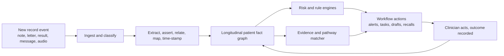
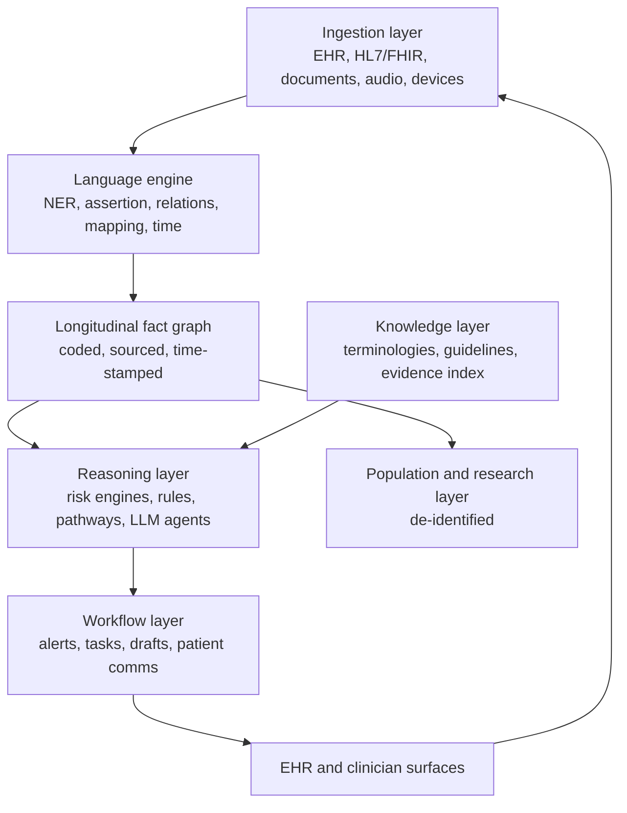

# Clinical Language Platform for Primary Care — Moonshot Concept

Sep 25, 2026 · @Ken Lee

## The premise: most of what matters is written, not coded

The decisive facts in a patient's record live in free text: the reason for the visit, the examination, the reasoning, the plan, the letter back from the specialist, the discharge summary. Structured fields capture a fraction of it. Every dashboard, recall list and risk score built only on coded data is therefore built on a fraction of the truth.

The concept reviewed here starts from that gap. A clinical language platform reads the whole record as a clinician would, turns the narrative into structured, coded, time-stamped facts, and puts those facts to work in real time: surfacing risk, closing gaps, matching to evidence, drafting what comes next. The source concept proved this in psychiatry and oncology, where staging, prognosis and mental-state observations exist almost exclusively in notes. Primary care is the same problem at far larger scale.

Primary care is also where the payoff is largest. A GP consultation is short, the record is long, the patient is unselected, and the same clinician is responsible for prevention, diagnosis, prescribing, coordination and follow-up. A platform that reads for the clinician, remembers for the clinician and reasons alongside the clinician changes what a fifteen-minute consultation can achieve.

## What the source concepts describe

Stripped of branding, the two resources describe one product idea: a real-time, language-native clinical decision support platform. It ingests every document type a health service produces, extracts and normalises the clinical facts inside them, links those facts through time, and feeds them to predictive and rule-based engines that return decisions inside the clinical workflow.

The first concept is the decision-support application. It was built for psychiatry and oncology because those specialties keep their critical data in narrative: cancer stage and prognosis, mental-state examination, suicidality and risk observations. It reads structured data, unstructured notes, images and high-frequency waveform data, generates per-patient risk stratification, and was extended into predictive engines for readmission, sepsis, clinical deterioration and severe malnutrition, in both inpatient and outpatient settings. Its defining characteristic is that the NLP does not sit in a research pipeline; it is embedded in the workflow and returns results while the clinician is still acting.

The second concept is the language engine underneath: a library of clinical NLP capabilities that any such application composes from. Its core tasks are named-entity recognition (conditions, medications, procedures, anatomy, tests and results), assertion status (present, absent, possible, hypothetical, historical, family), relation extraction (drug to dose, drug to indication, finding to site, test to result), entity resolution and terminology mapping (mapping mentions to standard code systems), temporal extraction (onset, duration, sequence, progression), document classification and clinical phenotyping. Layered on those are de-identification across text, tables, FHIR, PDF, DICOM and whole-slide images; adverse-event detection; social-determinants extraction; patient-voice and sentiment analysis; clinical-trial matching; summarisation; and question answering over the record. Domain packs exist for oncology, radiology and biomarkers, and the whole stack is designed to bridge structured and unstructured data into a single longitudinal patient profile that an EHR can consume.

Read together, the two concepts are a stack: a language engine that turns text into facts, and a decision layer that turns facts into action, joined by the record.

## Capability catalogue

Every capability below is a reusable concept, described by what it does to the record and what it makes possible in primary care. They compose: a recall list is phenotyping plus temporal reasoning plus assertion status; a prescribing check is relation extraction plus terminology mapping plus an interaction engine.

| Capability | What it does | What it unlocks in primary care |
| --- | --- | --- |
| Clinical entity recognition | Finds conditions, symptoms, medications, doses, procedures, tests, results, anatomy, devices and allergies in any text | A problem list and medication list that reflect the notes, not just what someone remembered to code |
| Assertion status | Classifies each mention as present, absent, possible, hypothetical, historical, or about a family member | "No chest pain" and "mother had breast cancer" stop polluting risk scores and recall lists |
| Relation extraction | Links drug to dose, route and frequency; finding to body site; test to value; condition to treatment; symptom to duration | Reconstructs what was actually prescribed and why, even when only written in the plan |
| Terminology mapping and entity resolution | Maps mentions to standard code systems for diagnoses, procedures, medications and observations; resolves the same concept across documents | One coded, interoperable longitudinal record; automatic coding for claims, registers and quality indicators |
| Temporal extraction | Anchors every fact to onset, duration, sequence and recency; builds a timeline | Progression tracking, "how long has this been going on", overdue-for-review logic |
| Document classification and routing | Recognises letter, discharge summary, pathology, imaging report, referral, care plan, patient message | Inbound correspondence triaged and filed before a human opens it |
| Clinical phenotyping | Identifies patients matching a clinical definition from narrative plus structured data | Cohorts for chronic-disease registers, care-plan eligibility, screening and immunisation gaps |
| Risk stratification | Runs predictive engines over the extracted facts and returns a per-patient score with the evidence behind it | Deterioration, readmission, sepsis, malnutrition, frailty, mental-health crisis, non-attendance |
| Adverse-event and safety-signal detection | Detects drug reactions, complications and near-misses described in notes | Pharmacovigilance from the practice up; safer deprescribing |
| Social determinants extraction | Captures housing, employment, transport, carer load, literacy, isolation, financial stress from narrative | Care plans that account for the person, not just the disease; equity reporting |
| Patient-voice and sentiment analysis | Reads the patient's own words in messages, questionnaires and transcripts for tone, distress and priorities | Earlier detection of decline, disengagement or unmet need |
| Summarisation | Condenses a long record, a hospital stay or a year of notes into a clinical summary | Pre-visit brief in seconds; handover between clinicians; transfer of care |
| Question answering over the record | Answers a natural-language question with the facts and their source passages | "When was the last eGFR and what was it?" answered inline during the consultation |
| De-identification | Removes or masks identifiers in text, tables, FHIR, PDF, DICOM and slide images | Research, audit, model evaluation and secondary use without exposing patients |
| Trial and pathway matching | Compares extracted criteria against trial eligibility and guideline pathways | Patients offered trials and programmes they qualify for; guideline adherence measured from the record |
| Multimodal ingestion | Reads scanned documents, faxes, images and waveform data alongside text | The paper and PDF backlog becomes part of the record |
| Domain packs | Specialty-tuned models for oncology, radiology, biomarkers, mental health and more | Depth where primary care meets specialty care: cancer survivorship, imaging follow-up, genomics |
| Workflow embedding | Delivers outputs inside the clinical system at the moment of decision, with an audit trail | Decision support that is used rather than ignored |

## Runtime operations

The platform runs continuously, not on demand. Every new document, message, result or transcript is an event; each event triggers extraction, updates the patient's longitudinal fact graph, re-scores risk, and fires whatever workflow the change warrants. The clinician sees the consequence, not the machinery.

Read left to right: every event flows through one pipeline into one patient graph, which feeds both the risk engines and the evidence matcher, and every clinician action feeds back as new evidence.

### Before the encounter

The platform reads the whole record overnight and again when the appointment is booked. It produces a one-screen brief: active problems with their last status, current medications reconciled against the notes, results since last visit with any out-of-range trend, open referrals and letters, care-plan items due, screening and immunisation gaps, and anything the patient wrote in a pre-visit questionnaire or message. Where a hospital discharge or specialist letter arrived, it is summarised and its actions extracted into tasks. The brief answers "what do I need to know before I open the door".

### During the encounter

Ambient capture transcribes the consultation; extraction runs on the live transcript. As the history unfolds, the platform assembles a working differential grounded in the record and the presentation, surfaces the two or three questions that would most change it, and shows the relevant guideline pathway with the patient's own values already filled in. When a medication is mentioned, it checks dose, interactions, renal and hepatic function, pregnancy, allergies and existing therapy in the same moment. When a test is ordered, it checks whether the result already exists. Question answering over the record is available as a side channel: ask in plain language, get the fact and the passage it came from. At the end, the note, the coded problem list, the orders, the referral letter and the patient's plain-language summary are drafted for review and signature.

### After the encounter

The signed note is re-extracted so the fact graph reflects what was decided, not what was said. Coding is finalised for billing, registers and quality indicators. Follow-up items become tracked tasks: results to chase, referrals to confirm, reviews to book, a safety-net check at a set interval. The patient's summary and plan are delivered to them in their language and reading level, with the questions the platform predicts they will have.

### Between encounters

Every inbound document is read, classified, summarised and turned into actions before a human opens it. Results are reconciled against what was ordered and against previous values; abnormal trends are escalated with the context that makes them interpretable. Patient messages are triaged by clinical urgency and emotional tone. Risk engines re-run as facts change, so a patient who is quietly deteriorating across three unrelated contacts is surfaced as one trajectory. Trial, programme and care-plan eligibility is re-evaluated as the record evolves.

### At population level

The same fact graph, de-identified, drives the practice and service view: registers built from narrative rather than incomplete coding; recall lists that exclude the resolved and the deceased; quality indicators measured from what was actually done; safety signals aggregated across prescribers; equity views by social determinant; and outcome feedback that shows which pathways changed what. Capacity planning uses predicted demand, not last year's appointment book.

### Runtime operations, enumerated

| Operation | Trigger | Output |
| --- | --- | --- |
| Record pre-read and brief | Appointment booked; day-before batch | One-screen brief with sources |
| Ambient transcription and live extraction | Consultation starts | Structured facts as they are spoken |
| Working differential and next-best-question | New symptom or finding in transcript | Ranked differential with what would change it |
| Prescribing check | Medication mentioned or ordered | Dose, interaction, contraindication and monitoring check |
| Order rationalisation | Test ordered | Existing result, guideline interval, cost-aware alternative |
| Inline record Q&A | Clinician asks | Answer plus source passage |
| Note, orders, letters and patient summary drafting | Consultation ends | Drafts for review; coded problem list |
| Post-signature re-extraction and coding | Note signed | Fact graph updated; codes finalised |
| Follow-up task generation | Plan contains a future action | Tracked task with due date and owner |
| Inbound document triage | Document arrives | Classified, summarised, actions extracted, routed |
| Result reconciliation | Result arrives | Matched to order, trended, escalated if needed |
| Message triage | Patient message arrives | Urgency and tone score; suggested response |
| Continuous risk re-scoring | Any fact changes | Updated score with evidence; alert if threshold crossed |
| Eligibility matching | Any fact changes | Trial, programme and care-plan candidacy |
| Register and recall maintenance | Nightly | Registers rebuilt from narrative and codes |
| Quality and safety analytics | Nightly and on demand | Indicators, safety signals, equity views |
| De-identified export | Scheduled or requested | Research and audit datasets |

## Workflows by setting

One platform, one patient graph, five front doors. Each setting uses the same capabilities weighted differently, and because the graph is shared, a decision made in one setting is visible in the next.

### General practice

The GP is the integrator, so the GP workflow is the full lifecycle above. The distinctive gains are the pre-visit brief, the live differential with next-best-question, and the drafted note and letters. Chronic-disease management shifts from remembering to reviewing: the platform tells the GP which care-plan items are due, which targets are off, and which patients on the register have not been seen. Correspondence handling, historically hours of unpaid reading per week, becomes review of extracted actions.

### Nurse prescribers

Nurse prescribers work within defined scopes and formularies, often in chronic-disease, wound, sexual-health and immunisation clinics. The platform enforces scope as a helpful constraint rather than a barrier: it shows the formulary-eligible options, the protocol step the patient is at, the monitoring due, and when the presentation falls outside scope and warrants escalation. Because the same graph feeds the GP, escalation carries the full context rather than a phone summary. Structured protocols (titration schedules, wound-care pathways, contraceptive initiation) become live checklists populated from the record.

### Pharmacist prescribers

Pharmacist-led prescribing for minor ailments, repeat management and medication review depends on knowing the whole medication story, which is exactly what relation extraction and temporal reasoning reconstruct. The platform assembles a reconciled medication history across GP notes, hospital discharge, dispensing records and the patient's own account; flags interactions, duplications, dose drift and adherence gaps; and drafts the medication review with recommendations linked to evidence. For minor-ailment prescribing it runs the same protocol logic as for nurse prescribers, with red-flag detection that routes the patient to a GP or emergency care. Deprescribing candidates are surfaced from the safety-signal engine.

### Telehealth services

Telehealth clinicians often see patients they have never met, with a record they have not read, in a consultation shorter than face-to-face. The pre-visit brief is the equalizer: within seconds the clinician has the same grounding as the regular GP. Ambient capture works over the call. Message-based telehealth benefits most from message triage and patient-voice analysis, which sort a queue by clinical urgency and distress rather than arrival time. Because no examination is possible, the platform's next-best-question logic and red-flag detection carry more weight, and its record of what was asked and answered supports safe hand-back to the usual provider.

### Hospital in the home

Hospital-in-the-home teams manage acute patients at home with visiting nurses, remote monitoring and a supervising physician. This is where the source concept's deterioration, sepsis and readmission engines apply directly. The platform ingests nursing visit notes, vital-sign streams, device data and the patient's messages, and re-scores deterioration risk after every contact. It generates the visit plan for the next day, drafts the daily physician summary, flags when the trajectory no longer fits home care, and prepares the discharge-to-GP handover with the actions extracted. The GP receives the episode as a structured summary, not a fax.

### One graph across settings

| Setting | Weighted capabilities | Distinctive output |
| --- | --- | --- |
| General practice | Full lifecycle; pre-visit brief; differential; drafting; correspondence triage | Complete consultation, coded and followed up |
| Nurse prescriber | Protocol logic; scope and formulary; monitoring; escalation with context | Live protocol checklist and safe escalation |
| Pharmacist prescriber | Medication reconciliation; interaction and safety engine; deprescribing | Medication review with evidence-linked recommendations |
| Telehealth | Pre-visit brief; message triage; patient-voice; red flags; hand-back | Grounded consultation for an unfamiliar patient |
| Hospital in the home | Deterioration, sepsis and readmission engines; multimodal ingestion; handover | Daily risk trajectory and structured discharge to GP |

## Platform architecture concept

The architecture is a set of layers with one contract between them: every fact carries its source passage, its code, its time, its assertion status and its confidence. Everything above the fact graph reasons only over facts that satisfy that contract, which is what makes the outputs explainable and auditable by construction.

Read top to bottom: data enters, becomes facts, facts are reasoned over against knowledge, and the result lands in the workflow; the loop closes as new actions become new data.

**Ingestion layer.** Event-driven connectors to the clinical system, messaging interfaces, document stores, ambient audio and remote monitoring devices. Every arrival is an event with provenance. Scanned and faxed documents pass through OCR and layout analysis so the paper backlog is first-class input.

**Language engine.** The extraction pipeline from the capability catalogue, run as composable stages with per-stage confidence. Specialty and locale packs (local drug terminology, local guideline vocabularies, local spelling and abbreviations) are swapped in by configuration, not retraining. Large language models sit alongside the extraction models for summarisation, drafting and question answering, always grounded in the fact graph and always citing the passage.

**Longitudinal fact graph.** The single source of clinical truth per patient: entities, relations and events, each mapped to standard terminologies, each anchored in time, each linked to its source document and span. It reconciles the same fact from multiple sources and records disagreement rather than hiding it. It is the object every other layer reads and writes.

**Knowledge layer.** Terminology services, guideline pathways expressed as executable logic, a drug and interaction knowledge base, and an evidence index built from the published literature and updated continuously. Every recommendation the reasoning layer makes links to the guideline clause or the study it rests on, so the clinician can read the grounds and the regulator can verify them.

**Reasoning layer.** Predictive engines (deterioration, readmission, sepsis, malnutrition, frailty, crisis, non-attendance), rule engines (prescribing safety, screening intervals, care-plan logic), pathway matchers and agentic workflows that plan multi-step actions such as "reconcile this discharge summary and prepare the follow-up". Each engine publishes its inputs, its output, its confidence and its evidence into the audit log.

**Workflow layer.** Turns reasoning into things a person does: an alert with a threshold and an owner, a task with a due date, a draft awaiting signature, a patient message in plain language. It manages alert fatigue explicitly, tuning thresholds per role and setting and suppressing what the clinician has already acted on.

**Clinician and patient surfaces.** Embedded panels inside the existing clinical system, a conversational interface for record Q&A, ambient capture in the room and on the call, and a patient channel for summaries, questions and messages. No separate portal to log into.

**Population and research layer.** The de-identification engine produces research-grade datasets from the fact graph; registers, quality indicators, safety signals and equity analytics run over them. The same layer runs model evaluation, so every model is measured against the population it serves.

**Cross-cutting: audit, identity, consent.** Every read, extraction, inference and action is logged with actor, time, inputs and evidence. Consent state is a fact in the graph and gates every downstream use. Role-based access mirrors clinical scope, so a pharmacist prescriber and a GP see the same graph through different apertures.

## Translatable benefits

The benefit is not that the machine reads faster. It is that the whole record is finally in play at every decision, for every clinician, in every setting, and that what happens next is tracked until it is done.

**For the clinician.** Reading time moves from the record to the patient. Documentation, coding, letters and follow-up tasks are drafted rather than typed. The differential is grounded in the full history rather than the last three visits. Prescribing checks arrive at the moment of prescribing with the patient's own renal function and drug list applied. Correspondence is pre-read. The after-hours inbox shrinks to review and sign. Clinicians in unfamiliar settings, locums, telehealth and after-hours services, start every consultation grounded.

**For the patient.** Nothing in the record is forgotten because it was written in prose. A trend across three unrelated contacts is seen as one trajectory. Screening, immunisation and chronic-disease reviews are offered because the record says they are due, not because someone noticed. The plan arrives in plain language with the questions already anticipated. Trials and programmes are offered to those who qualify. Care at home is supervised with hospital-grade deterioration detection.

**For the practice and service.** Registers, recalls and quality indicators reflect what was actually done, and are maintained without manual audit. Coding is complete, so funding follows activity. Alert fatigue is managed, not inflicted. Nurse and pharmacist prescribers work at the top of scope with safe escalation, expanding capacity without expanding risk. Inbound documents and messages are triaged by urgency, so the queue is worked in the right order. Hospital-in-the-home episodes hand back cleanly.

**For the system.** Primary care becomes a continuous, coded, evidence-linked longitudinal dataset rather than a set of siloed narratives. Safety signals are aggregated across prescribers and settings. Equity gaps become measurable from social-determinant data that already existed in the notes. Guideline adherence is measured from the record, not surveys. Research and evaluation run on de-identified data that is complete, not just the coded fraction. Capacity is planned from predicted demand.

| Benefit | Mechanism | How it is measured |
| --- | --- | --- |
| Less documentation time per consultation | Ambient capture, drafting, coding | Minutes of note-writing per encounter; after-hours record time |
| Fewer missed follow-ups | Task generation, result reconciliation, recall from narrative | Open-loop rate; time from result to action |
| Safer prescribing | Real-time checks on reconciled medication history | Interaction and dose alerts acted on; adverse events detected |
| Earlier detection of deterioration | Continuous risk re-scoring across contacts | Lead time to escalation; unplanned admissions |
| Complete registers and quality data | Phenotyping from narrative plus codes | Register completeness versus manual audit |
| Better use of advanced-practice prescribers | Scope-aware protocol logic and contextual escalation | Share of encounters completed within scope; escalation quality |
| Grounded telehealth and locum care | Pre-visit brief and record Q&A | Clinician-rated preparedness; re-contact rate |
| Equity visibility | Social-determinant extraction | Outcome gaps by determinant, tracked over time |

## The gates that make it real

Three gates turn the concept into something a regulator approves and a clinician trusts. They are build requirements, stated once here, not caveats to thread through every feature.

**Evidence linkage.** Every recommendation, score and draft carries the passage in the record it came from and the guideline clause or published study it rests on. The evidence index is built from the literature and refreshed continuously, so the platform's grounds are always checkable against what is published. This is what makes the output referenceable rather than merely plausible, and it is what regulators ask for first.

**Evaluation.** Each extraction model, risk engine and drafting workflow is measured on the population it serves, against clinician-adjudicated ground truth, before it goes live and continuously afterwards. The de-identification layer makes that possible without exposing patients. Performance is reported by role, setting and patient subgroup, so a model that works for GP notes but not for nursing visit notes is caught and fixed. Drift is monitored as a runtime signal, and an engine that degrades is retired automatically.

**Governance.** Clinical ownership of every rule, threshold and pathway, with named reviewers and version history. Consent as a fact in the graph that gates every use. Audit logs complete enough to reconstruct any decision. Role-based access mirroring clinical scope. Alert thresholds tuned per setting, with fatigue measured and managed. A clinical safety case per deployed capability, maintained as the capability evolves.

Built this way, the gates become accelerators: the evaluation harness and the evidence index are the same assets that let new capabilities ship quickly and safely once the first one is through.

## Moonshot horizon

The five-year picture is a primary care system in which the record reads itself, reasons alongside every clinician, and closes every loop it opens.

In that system, no clinician opens a consultation unprepared, in any setting, with any patient. No fact written in prose is ever lost to a code that was never entered. Every prescription is checked against the whole medication story. Every result, letter and message is read, understood and actioned before a human sees it, and the human sees it in the right order. Deterioration is detected across contacts and settings as one trajectory. Nurse and pharmacist prescribers work at the top of scope with a supervising GP who receives context, not phone calls. Hospital in the home is supervised with the same vigilance as a ward. Patients receive their plan in their own words and their questions answered before they think to ask.

At population level, primary care becomes the most complete longitudinal health dataset a health system owns: coded, sourced, time-stamped, de-identifiable, and generated as a by-product of care rather than a separate data-entry burden. Registers, quality, safety, equity and research run over it continuously. Guidelines are measured against practice and practice against outcomes, and the evidence index closes that loop back into the reasoning layer.

The moonshot is not a smarter alert. It is a primary care system with a working memory, a shared reasoning layer across every front door, and a feedback loop from action to outcome to evidence. The source concepts proved the mechanism in two specialties. Primary care is where it scales.
