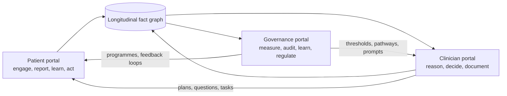
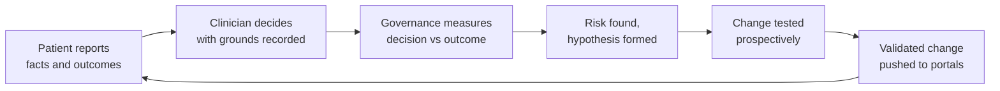

# Three portals: patient, clinician, governance

Sep 25, 2026 · @Ken Lee

## One graph, three apertures

The platform has one longitudinal fact graph per patient and three portals that look into it, each with its own identity, access model, vocabulary and purpose. The patient sees their own story and acts on it. The clinician sees the reasoning surface and decides. Governance sees the system: every decision, every deviation, every outcome, across every patient and user.

The portals are separate because their users are separate, but they are not silos. The patient's answers enrich the record the clinician reads. The clinician's decisions, and the evidence behind them, become the audit trail governance measures. Governance findings change thresholds, pathways and prompts that both the other portals run on. That circulation is the improvement methodology; the portals are its three stations.

Read left to right: the patient feeds the graph, the clinician reasons over it, governance measures it, and governance's findings flow back into what the other two portals do.

| Portal | Identity and access | Primary object | Core question it answers |
| --- | --- | --- | --- |
| Patient | Patient or authorised carer; consent-scoped view of own record | My story, my plan, my next step | "What is happening to me and what do I do next?" |
| Clinician | Registered clinician or prescriber; role and scope-bound | The reasoning surface over one patient | "What is going on, what should I do, and on what grounds?" |
| Governance | Administrator, clinical governance lead, auditor, regulator; de-identified by default, re-identifiable under authority | The system: decisions, deviations, outcomes | "Is care safe, effective and improving, and can I prove it?" |

## The Patient portal

The patient portal turns the patient from the subject of the record into a contributor to it and the first beneficiary of it. Its purpose is engagement that produces evidence: every interaction either adds a fact the clinician needs or delivers a step the patient can take, and outcomes are measured so the loop can be tuned.

### Agentic pre-intake

Before any appointment, a conversational agent opens a structured but natural intake. It starts from what the record already knows, so it never asks what is already documented. It asks in the patient's language and reading level, adapts follow-up questions to the answers (onset, character, severity, what makes it better or worse, what the patient is worried about), and captures the patient's own words alongside the structured extraction. It reconciles the medication list by asking what is actually being taken, including over-the-counter and complementary products, and how. It screens with validated instruments where the presentation warrants (mood, alcohol, falls, function) and scores them. It captures social context: transport, work, carers, cost pressure, housing. The output is a pre-intake summary in the fact graph, tagged as patient-reported, with red flags escalated before the appointment rather than discovered in it.

### Ongoing engagement between visits

The agent stays present after the visit. It delivers the plan in plain language, checks understanding, and answers questions grounded in the patient's own record and the guideline the clinician used. It runs symptom check-ins at intervals set by the plan (post-medication start, post-discharge, chronic-disease review cycles) and escalates when answers cross a threshold. It captures home readings from devices or manual entry (blood pressure, glucose, weight, peak flow, mood) and trends them. It reminds, reschedules and closes loops: the result is back, the referral is booked, the review is due. It collects patient-reported outcome and experience measures at the right moments, so outcomes are measured by the person living them.

### Health literacy and shared decision-making

Every recommendation the clinician makes can be unpacked for the patient: what it is, why it applies to them, what the evidence says, what the alternatives are, and what to watch for. Decision aids are generated from the patient's own values and risk figures rather than population averages. The patient can record their preferences and goals, which become facts in the graph the clinician sees at the next decision.

### Consent, transparency and control

The patient sees who accessed their record and why. They control which parts are shared with which service, whether their de-identified data supports research, and whether they wish to be approached for trials or programmes they match. Every automated message they receive says it was automated and how to reach a person.

### Evidence-driven loops that improve outcomes

| Loop | What the patient does | What the system learns | What improves |
| --- | --- | --- | --- |
| Pre-intake | Answers adaptive intake; reconciles medications | A structured, patient-verified history before the visit | Diagnostic accuracy; consultation time spent on decisions rather than history |
| Post-visit understanding | Reads the plan; answers a comprehension check | Whether the plan was understood | Adherence; fewer avoidable re-contacts |
| Symptom and device check-ins | Reports symptoms and readings on schedule | Trajectory between visits | Earlier escalation; fewer unplanned presentations |
| Medication start and titration | Reports effects and side effects at set intervals | Real-world tolerance and adherence | Safer titration; earlier deprescribing of what does not work |
| Post-discharge | Completes daily check-ins for the set window | Deterioration or recovery signal at home | Readmission avoided or expedited when needed |
| Outcome and experience measures | Completes validated measures at milestones | Outcome by pathway, clinician and cohort | Pathways tuned on patient-reported results |
| Preferences and goals | Records what matters to them | Values that shape decisions | Shared decisions that are actually shared |
| Screening and prevention | Responds to eligibility prompts; books | Uptake by cohort and channel | Coverage of screening and immunisation gaps |

The value to health outcomes comes from the loops being closed, not from the messages being sent. Each loop has a measured endpoint, and governance can see which loops are working for which cohorts and which are not.

## The Clinician portal

The clinician portal is a reasoning surface, not a dashboard. Its purpose is to make the clinician's judgement better informed, better grounded and better recorded, and to do that inside the consultation rather than around it. Everything it shows carries its source in the record and its grounds in the evidence.

### How NLP and agentic engagement enrich the record

The record the clinician opens is richer than the one they would have written alone, for three reasons. First, the language engine has already read every note, letter, result and discharge summary, extracted the facts, resolved them to codes, placed them in time and reconciled contradictions, so the problem list, medication list and timeline reflect the whole narrative rather than the coded fraction. Second, the patient's agentic pre-intake has added a patient-verified history, a reconciled medication list, validated screening scores and social context before the door opens, all tagged as patient-reported so provenance is never in doubt. Third, the ongoing engagement loop has added between-visit facts: symptom trajectories, home readings, tolerance of a new medication, whether the plan was understood. The clinician starts from a record that is complete, current and sourced, and the patient benefits because nothing they said or reported is lost.

### The pre-visit brief

One screen, generated on booking and refreshed at check-in: reason for visit in the patient's words; active problems with last status and trend; medications reconciled across sources with discrepancies flagged; results since last visit, trended, with out-of-range values in context; open loops (referrals, results awaited, care-plan items due, screening gaps); what the pre-intake surfaced, including red flags and validated scores; and what the patient said matters to them. Every line links to its source passage.

### Augmented reasoning in the consultation

Ambient capture transcribes; the language engine extracts as the history unfolds. The portal maintains a working differential grounded in the presentation and the full record, ranked and revised as facts arrive, with the discriminating features made explicit: which findings support each candidate, which count against it, and which are absent but would matter. It proposes the two or three next-best questions or examinations that would most change the ranking, which is the mechanism by which the clinician's own diagnostic reasoning is sharpened rather than replaced. It shows the guideline pathway relevant to the leading candidate with the patient's own values already filled in, and where the pathway and the patient diverge (frailty, multimorbidity, preference) it says so. The clinician can ask the record anything in plain language and get the fact and the passage. Where the evidence is thin or contested, the portal says that too, with the studies.

### Prescribing and ordering support

When a medication is spoken or typed, the check runs on the reconciled list: dose against renal and hepatic function, age and weight; interactions across everything the patient actually takes; allergies and prior adverse events extracted from narrative; duplication and therapeutic class overlap; pregnancy and lactation; monitoring due. For nurse and pharmacist prescribers the same surface shows scope and formulary, protocol step, and when escalation is warranted, and escalation carries the whole context. When a test is ordered it checks whether the result already exists, whether the interval is met, and what the guideline actually recommends.

### Documentation, coding and closing loops

At the end of the consultation the note, coded problem list, orders, referral letter and patient summary are drafted for review and signature, with each drafted statement traceable to the transcript or the record. Follow-up items in the plan become tracked tasks with owners and dates. Correspondence that arrives later is pre-read, summarised and turned into actions the clinician approves rather than discovers. The inbox becomes a review queue ordered by clinical urgency.

### Augmenting the clinician's knowledge over time

The portal is also a learning surface. Each consultation can end with a short, optional reflection: the leading differential, what the clinician chose, and what the outcome later showed. Aggregated privately for the clinician, this becomes a personal calibration view: where their diagnostic confidence matches outcomes and where it does not, which pathways they deviate from and whether the deviations were justified, which conditions they under- or over-investigate. Evidence updates relevant to their own patients are surfaced as they are published, linked to the patients they affect. Continuing professional development is generated from their actual practice rather than a generic curriculum, and the record of it is available for their own portfolio.

### How the enriched record returns to the patient

Because the clinician's decisions are recorded with grounds, the patient portal can explain them. Because the plan is structured, the engagement agent can follow it up. Because outcomes are measured, the next decision is better informed. The clinician's aperture and the patient's aperture look at the same graph, which is why enriching one enriches the other.

| Clinician need | What the portal does | Grounding |
| --- | --- | --- |
| Know the patient before the door opens | Pre-visit brief from whole record plus pre-intake | Every line links to a source passage |
| Reason well under time pressure | Live differential, discriminators, next-best question | Record facts plus evidence index |
| Prescribe safely | Checks on the reconciled medication history | Drug knowledge base plus patient's own function and history |
| Follow the guideline where it fits, deviate where it should | Pathway with patient values filled in; divergence flagged | Guideline clause plus patient-specific facts |
| Document without typing | Drafted note, codes, letters, summary | Transcript and record spans |
| Never lose a follow-up | Tasks with owners and dates; inbox by urgency | Plan extraction plus inbound document triage |
| Get better at the job | Personal calibration, outcome feedback, evidence updates | Own decisions versus outcomes over time |

## The Governance portal

The governance portal is the instrument of clinical excellence: what is not measured cannot be improved, and what is not analysed for risk repeats its mistakes. It exists so that administrators, clinical governance leads, auditors and regulators can see the system as it actually behaves, prove it, and change it. It works over the same fact graph as the other two portals, de-identified by default and re-identifiable only under recorded authority.

### Measurement: the enduring point of record

Every decision the platform supports is logged as a structured event: who, when, what was shown, what evidence it rested on, what the clinician did, and what happened next. Every extraction carries its source span and confidence. Every model and rule carries its version. The result is a point of record that does not depend on anyone's memory or on a retrospective chart audit, because the audit trail is generated by care itself. Quality indicators are computed from what was actually done in the narrative, not only from what was coded, so the denominator is the whole population and the numerator is the truth.

### Risk analysis: finding what would otherwise repeat

The portal runs continuous risk surveillance across the service. Prescribing safety signals aggregate across prescribers: interaction alerts overridden, dose outliers, monitoring not done, adverse events extracted from notes that were never formally reported. Diagnostic risk surfaces as patterns: presentations that returned within a set window with a different diagnosis, results that were abnormal and not actioned, referrals that were never completed. Deterioration risk shows where escalation lagged the trajectory. Each signal links to the cases behind it, and each case to its record and its evidence, so a governance lead moves from signal to root cause in minutes.

### Sentinel events and incident learning

When a sentinel or adverse event is reported, the portal assembles the timeline automatically from the fact graph: every contact, decision, alert, override, message and result in sequence, with what was known at each point. Contributing factors are proposed from the record (a missed result, an unreconciled medication, an unread letter, an alert suppressed by fatigue) for the review panel to confirm or reject. Similar cases across the service are found by phenotype, so a single incident becomes a pattern search. Actions from the review (a new rule, a changed threshold, a pathway edit, a training need) are tracked to completion and their effect measured, closing the incident loop rather than filing it.

### Auditing users and groups

Compliance auditing is built in rather than sampled. For any clinician, group, role or site: adherence to pathways with justified versus unjustified deviation; documentation completeness and coding accuracy against the narrative; response times to results, referrals and messages; alert acceptance and override rates with reasons; scope compliance for nurse and pharmacist prescribers; access patterns to records, including any access without a care relationship. Peer comparison is risk-adjusted, so a clinician with a sicker list is not penalised for it. Every metric drills to the cases, and every case to its source. The same view supports credentialing, revalidation and scope-of-practice reviews with evidence rather than assertion.

### Patient engagement and feedback

The patient portal's loops report into governance: pre-intake completion, plan comprehension, check-in adherence, patient-reported outcomes and experience by pathway and cohort, complaints and compliments classified by theme from free text, and equity views by social determinant. Governance can see which engagement loops improve outcomes for which populations and redesign the ones that do not.

### Configuring prospective studies and QA/QI cycles

The portal is a study builder. A governance lead defines a cohort by phenotype (from narrative and codes), an intervention (a new pathway, prompt, threshold or engagement loop), the comparison (a matched cohort, a stepped roll-out or a period), and the endpoints (clinical, process, patient-reported). The platform enrols prospectively as patients match, collects endpoints from the graph and the patient portal, and reports as data accrues. Plan-do-study-act cycles run the same way at smaller scale. Every QA/QI measure is validated against its definition, its denominator and its data lineage before it is trusted, and revalidated when a model or pathway changes.

### Reporting

Regulatory, accreditation and funder reports are generated from the point of record on demand, with lineage from every figure to the events that produced it. Ad hoc questions are answered in plain language over the de-identified graph. Board-level views show safety, effectiveness, experience, equity and efficiency on one page with drill-through.

### Transparent, explainable AI

Every model, rule and pathway in the platform is registered with its purpose, its version, its training and evaluation population, its performance by subgroup, its known limitations and its clinical owner. Every output it produces can be reconstructed: the inputs it saw, the evidence it cited, the confidence it carried, and what the human did with it. Drift is monitored as a runtime signal and a degrading model is retired automatically. A regulator can audit the algorithm as readily as the clinician, and the record of algorithmic decisions is as enduring as the record of human ones.

### Research and evaluation as a built-in method

The third element is the one that makes the other two improve. Because outcomes are measured, evidence is linked and studies are configurable, the service runs a standing evaluation programme rather than periodic audits: every pathway, prompt and engagement loop has an owner, a hypothesis, an endpoint and a review date. Findings feed back as changes to thresholds, pathways and prompts in the clinician portal and to loops in the patient portal, and the effect of each change is measured in turn. The de-identified graph supports external research under consent, so the service contributes to the evidence base it draws on.

| Governance function | What the portal provides | The question it settles |
| --- | --- | --- |
| Enduring point of record | Every decision, extraction and action logged with source and version | "What was known, shown and done, and when?" |
| Risk surveillance | Continuous prescribing, diagnostic, deterioration and access signals with drill-through | "Where will the next error come from?" |
| Sentinel event review | Auto-assembled timeline, proposed contributing factors, pattern search, tracked actions | "Why did this happen and will it happen again?" |
| User and group audit | Risk-adjusted adherence, documentation, responsiveness, scope and access metrics | "Is each clinician practising safely within scope?" |
| Patient engagement and feedback | Loop performance, outcomes and experience by cohort; complaint themes | "Are patients engaged and is it helping them?" |
| Prospective studies and QA/QI | Cohort, intervention, comparison and endpoint builder with prospective enrolment | "Does this change improve care, and for whom?" |
| Reporting | On-demand regulatory, accreditation and board reports with lineage | "Can we prove it?" |
| Explainable AI | Model registry, per-output reconstruction, subgroup performance, drift retirement | "Can the algorithm be audited like a clinician?" |
| Research and evaluation | Standing evaluation programme; consented de-identified research | "Is the system learning, and is it contributing?" |

## Three scenarios, one episode

A 68-year-old with type 2 diabetes, chronic kidney disease and heart failure is discharged from hospital after a fluid overload admission. The same episode looks different through each portal.

### Through the patient portal

The day after discharge the agent introduces itself, confirms the medication changes in plain language and asks what is actually in the pill organiser. It finds the patient is still taking the old diuretic dose because the discharge letter said one thing and the box says another. It flags this to the practice before anyone has read the letter. Daily check-ins ask about weight, breathlessness, ankle swelling and dizziness; a connected scale sends weight. On day five, weight is up two kilograms and breathlessness is worse at night; the agent escalates and books a same-day review, explaining why. The patient records that staying out of hospital and keeping their independence matter most. After the review, the revised plan arrives in their words, with a comprehension check. At four weeks they complete an outcome and experience measure.

### Through the clinician portal

The discharge summary is pre-read before the GP opens it: medication changes extracted and reconciled against the practice list and the patient's own report, the discrepancy flagged with both sources shown, the follow-up actions (bloods at one week, review at two, cardiology at six) turned into tasks. The pre-visit brief for the day-five review shows the weight and symptom trajectory, the latest renal function trended, the reconciled medication list with the diuretic discrepancy resolved, and the patient's stated goals. In the room the differential is grounded in the whole record; the pathway is shown with the patient's eGFR and potassium filled in; the diuretic adjustment is checked against renal function and everything else the patient takes. The note, the coded problems, the pathology order and the message to the patient are drafted for signature. The GP's calibration view later records that this early escalation prevented a readmission, and the evidence update on heart failure in chronic kidney disease is linked to this patient when it is published.

### Through the governance portal

The discharge medication discrepancy is logged as a near-miss, extracted from the record rather than reported by anyone. The portal shows it is the fourth such discrepancy from the same hospital ward this quarter and assembles the four timelines side by side. The governance lead raises it with the hospital with the evidence attached, configures a prospective study measuring discrepancy rate before and after the hospital changes its discharge template, and adds a rule that any discharge with a diuretic change triggers a pharmacist call within 48 hours. The post-discharge engagement loop's performance for heart-failure patients is reviewed: completion is high, escalation lead time is two days, readmissions in the cohort are down against the prior period. The quarterly accreditation report on transitions of care is generated with lineage to every case. The deterioration model's performance in patients over 65 with chronic kidney disease is checked and found within tolerance, and the check is recorded.

## How the loops close

The three portals are three stations on one improvement cycle. The patient contributes facts and outcomes. The clinician makes grounded decisions and records them with their grounds. Governance measures decisions against outcomes, finds risk, tests changes prospectively and pushes the validated changes back into the rules, pathways, prompts and engagement loops the other portals run on. Then the cycle runs again, and the effect of the change is measured.

Read around the loop: every step produces the evidence the next step needs, and no step depends on retrospective audit.

This is the constructive improvement methodology built into the system rather than bolted onto it. It requires nothing of anyone beyond doing their job in their own portal: the patient answering, the clinician deciding, governance reviewing. The measurement, the risk analysis and the evidence linkage are by-products of care, which is the only way they are ever sustained.
