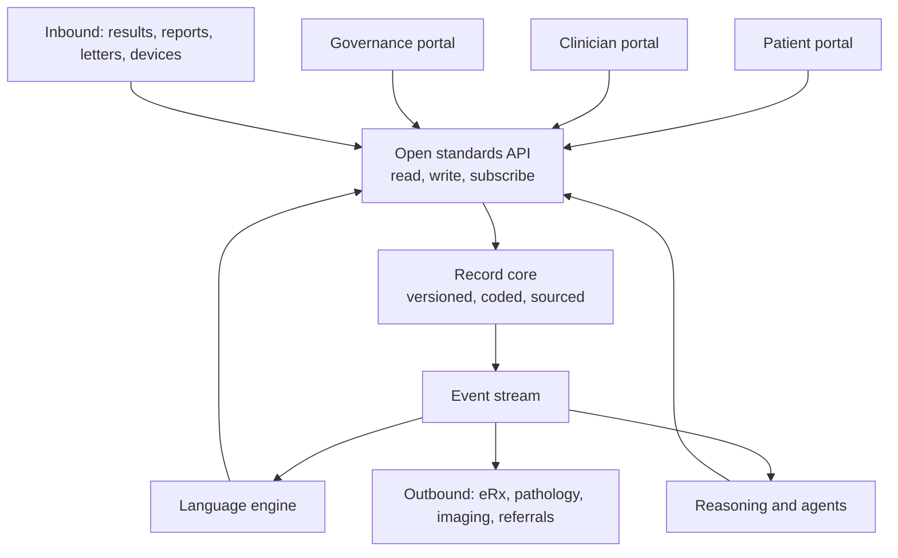
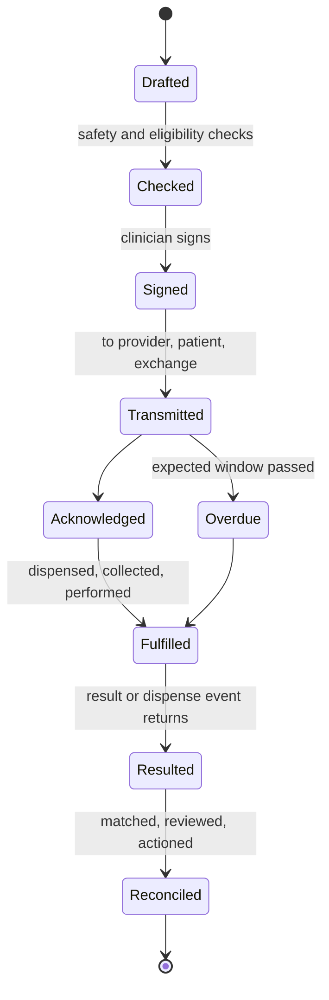
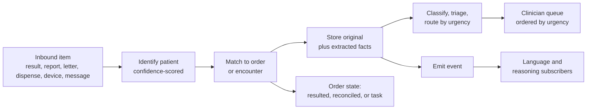
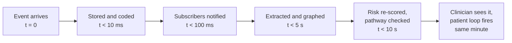

# The Open EHR Spine — AI-Native Record for a Three-Face System

Sep 25, 2026 · @Ken Lee

## What the spine is

The spine is an open, headless, AI-native electronic health record that does everything a conventional EHR does and is built so that every event it records is immediately available to the language engine, the reasoning layer and the three portals. It is the system of record for the patient, the system of action for the clinician, and the system of evidence for governance. Nothing in the platform described in the companion documents works without it, and nothing in it depends on any one of them.

A conventional EHR is a database with a user interface bolted on, where the record is a by-product of billing and the interface is where the workflow lives. The spine inverts this. The record is the product: versioned, append-only, coded at write time, sourced, and emitted as a stream of events the moment it changes. The interfaces are clients of an open API, replaceable, and thin. The intelligence is not an add-on that reads the database overnight; it is a subscriber to the same event stream every other client uses, so it sees a prescription, a result or a note at the same instant the clinician does.

Three design commitments follow. First, standards-native: the record is stored and served in an open clinical data model, mapped to open terminologies, so any conforming system can read it and any conforming model can reason over it. Second, event-first: every write is an event with provenance, and every consumer, human or machine, subscribes rather than polls. Third, correctness by construction: the core is built in a memory-safe systems language with types that make invalid clinical states unrepresentable, so a prescription without a prescriber, a result without an order, or a record change without an author cannot exist.

Read top to bottom: the three portals and every external party talk to one API; the core stores and emits; the intelligence subscribes and writes back through the same door.

## The record

The record is a versioned, append-only history of everything known about a person, organised as coded resources with provenance. Nothing is ever overwritten; a correction is a new version with the reason recorded, and every version remains readable. This is what makes the record an enduring point of record for governance and a trustworthy substrate for models.

**Identity.** One master patient identity per person, with linked local, national and external identifiers; demographic history (names, addresses, contacts) as versioned entries; carers and authorised representatives with the scope of their authority; preferred language, communication preferences and accessibility needs. Identity matching on inbound data is probabilistic with a human-review queue, and a merge or unmerge is itself a recorded event.

**Encounters and episodes.** Every contact (in person, telehealth, message, home visit, phone, agent conversation) is an encounter with a type, a setting, participants, a reason and a period. Encounters group into episodes of care (a pregnancy, a cancer pathway, a hospital-in-the-home admission), so the record can be read as episodes rather than as a flat list of visits.

**Problems and conditions.** A problem list coded to a clinical terminology, with onset, status (active, resolved, remission, recurrence), severity, certainty, body site and the encounter in which each was recorded. Problems carry links to the evidence for them (the note, the result, the letter) and to the treatments addressing them.

**Clinical documents.** Progress notes, letters, discharge summaries, referral letters, care plans, consent forms, scanned documents and images, each stored as the original artefact plus its extracted, coded content, with the link between text span and extracted fact preserved. Notes are structured as sections (history, examination, assessment, plan) so extraction and drafting operate on parts, not blobs.

**Social and personal context.** Occupation, living situation, carers and dependants, cultural and religious considerations, advance care directives and goals of care, and social determinants captured from narrative and patient report, all as coded, dated, sourced entries.

**Family history and risk.** Coded family history with relationship and age at onset, genetic and biomarker results, and calculated risk scores with the inputs and the version of the calculator.

**Provenance on every entry.** Who or what created it (a clinician, the patient, a device, a model version), when, from which source (typed, dictated and transcribed, extracted from a letter, patient-reported, imported), with what confidence, and under which consent. Provenance is a first-class part of the data model, not an audit table on the side.

| Record component | Stored as | Distinctive property |
| --- | --- | --- |
| Identity | Master identity plus linked identifiers and versioned demographics | Match, merge and unmerge are recorded events |
| Encounters and episodes | Typed contacts grouped into episodes | Agent conversations and messages are encounters too |
| Problems | Coded conditions with status, certainty and evidence links | Every problem points to the note or result that supports it |
| Documents | Original artefact plus extracted, coded content with span links | Text and facts stay linked in both directions |
| Social and personal context | Coded, dated, sourced entries | Captured from narrative and patient report, not only forms |
| Family history and risk | Coded relationships, genetics, versioned risk scores | Inputs and calculator version stored with the score |
| Provenance | Author, time, source, method, confidence, consent on every entry | Model outputs are attributed like human entries |

## The store of measurements

Every measurement is an observation: a coded quantity or value, with units, a reference range, a time, a method, a performer and a source. Observations are stored once, in one model, whether they came from a laboratory, a device, a clinician's examination or the patient's own report, so a trend can be drawn across all of them.

**Laboratory results.** Each analyte coded to a laboratory terminology with value, units, reference range, abnormal flags, specimen, collection and reporting times, performing laboratory and the order it fulfils. Panels are stored as groups so a full blood count is both one report and twenty observations. Interpretive comments from the laboratory are stored as text and extracted for facts ("specimen haemolysed", "suggest repeat in 3 months").

**Imaging and diagnostic reports.** The report text, the coded impression, the procedure, the modality, the body region, and a link to the images in the imaging archive. Follow-up recommendations inside the report ("repeat CT in 6 months") are extracted as actionable observations with a due date.

**Vital signs and examination findings.** Blood pressure, pulse, temperature, respiratory rate, oxygen saturation, weight, height, waist, body mass index, pain scores, mental-state and functional assessments, each coded, timed and attributed to a performer and a method (manual, automated cuff, home device).

**Device and remote-monitoring streams.** High-frequency data from wearables, home monitors and hospital-in-the-home equipment is ingested as time series with device identity, calibration status and sampling rate, stored in a time-series store optimised for windows and trends, with clinically significant events (a sustained tachycardia, a weight gain over a threshold) promoted to discrete observations that the reasoning layer can act on.

**Patient-reported measures.** Validated questionnaires (mood, function, symptom burden, quality of life) scored and stored as observations with the instrument and version, plus free-text symptom reports from the patient portal, stored as text and extracted into coded symptoms with severity and duration.

**Derived and calculated values.** Estimated glomerular filtration rate, cardiovascular risk, body surface area, dose calculations, frailty and deterioration scores, each stored with the formula or model version and the input observations it used, so any derived number can be reconstructed.

**Trending, reference ranges and context.** Reference ranges are stored per laboratory, per age, sex and pregnancy state, so a value is interpretable against the right range. Trend queries return a series across sources with gaps and method changes marked. Every abnormal observation carries the context needed to judge it: prior values, current medications that affect it, and the condition it monitors.

| Measurement type | Source | Stored with | Feeds |
| --- | --- | --- | --- |
| Laboratory analytes | Pathology providers | Code, units, range, flags, specimen, order link | Result reconciliation; trend; risk engines |
| Imaging and diagnostic reports | Imaging providers | Report, coded impression, image link, extracted follow-ups | Follow-up tasks; pathway matching |
| Vital signs and examination | Clinicians, devices | Code, method, performer, time | Deterioration scoring; consultation brief |
| Device streams | Wearables, home monitors, HITH equipment | Time series, device identity, promoted events | Continuous risk re-scoring; patient check-ins |
| Patient-reported measures | Patient portal | Instrument, version, score, free text extracted | Engagement loops; outcome measurement |
| Derived values | Reasoning layer | Formula or model version, input observations | Prescribing checks; governance validation |

## The store of treatments and prescriptions

Treatments are stored as a lifecycle, not a list: what was intended, what was prescribed, what was dispensed, what was administered or taken, what was stopped and why. The medication story the pharmacist prescriber, the GP and the language engine all need is reconstructable because every stage is a separate, linked, coded record.

**Medications.** Each medication entry is coded to a national medicines terminology at the level of product, form and strength, with dose, route, frequency, duration, indication (linked to the problem), prescriber, start and stop dates, reason for change, and status (active, completed, ceased, suspended, on hold). The list distinguishes what the practice prescribed, what other prescribers prescribed, what was dispensed, and what the patient reports actually taking, and reconciles them into one current list with discrepancies visible.

**Prescriptions.** A prescription is an order: the medication entry plus quantity, repeats, authority or restriction status, substitution permission, the prescriber's identity and credentials, an electronic signature, and its transmission and dispense status. Repeats and renewals are linked to the original.

**Administration and adherence.** Doses given by a clinician (immunisations, injections, infusions in hospital in the home) are recorded as administrations with batch, site and observer. Doses the patient reports, or a device records, are stored as adherence observations against the prescription.

**Allergies and intolerances.** Substance or class coded, reaction, severity, certainty, source (documented reaction, patient report, extracted from a letter), and status. Allergy entries participate in prescribing checks and are never deleted, only marked inactive with a reason.

**Immunisations.** Vaccine, batch, dose number in schedule, site, route, provider, and reconciliation against the national register, with due and overdue status derived from the schedule.

**Procedures.** Coded procedures with date, performer, site, indication, outcome and complications, including minor procedures in the practice and procedures reported in inbound correspondence.

**Care plans and goals.** Structured plans for chronic disease, mental health, aged care and post-discharge episodes: goals (coded, measurable, dated), planned activities with owners and intervals, review dates, and the team members involved. Care plan activities generate the tasks and the patient-portal loops; their completion is recorded against the plan.

**Referrals and requests for care.** Referrals to specialists, allied health and community services with reason, urgency, attached summary, status (sent, acknowledged, appointment booked, seen, reported) and the returning correspondence linked to it.

**Non-pharmacological treatments and advice.** Lifestyle prescriptions, exercise programmes, dietary advice, psychological therapies, self-management education, each coded and dated so that "advised weight reduction" is as retrievable as a drug.

| Treatment component | Lifecycle stages stored | What it makes possible |
| --- | --- | --- |
| Medications | Intended, prescribed, dispensed, taken, changed, ceased, with reason | One reconciled list with discrepancies visible; safe prescribing checks |
| Prescriptions | Ordered, signed, transmitted, dispensed, repeated, renewed | Electronic prescribing with full status; pharmacist visibility |
| Administration and adherence | Given by clinician; reported by patient or device | Real adherence, not assumed adherence |
| Allergies and intolerances | Recorded, verified, inactivated with reason | Checks that include reactions extracted from letters |
| Immunisations | Given, reconciled with register, due and overdue derived | Gap lists that are correct |
| Procedures | Planned, done, outcome, complication | Complete procedural history from any source |
| Care plans and goals | Set, active, reviewed, achieved | Tasks and patient loops generated from the plan |
| Referrals | Sent, acknowledged, booked, seen, reported | Closed-loop referral tracking |
| Non-pharmacological treatments | Advised, started, reviewed | Whole-of-treatment view, not drug-only |

## Outbound: orders sent straight to the patient

Every prescription, pathology request and imaging request is an order object in the spine with one lifecycle: drafted, checked, signed, transmitted, acknowledged, fulfilled, resulted, reconciled. The clinician signs once; the spine delivers the order to the patient, to the fulfilling provider and to any national exchange in parallel, and tracks it until the result or dispense event closes the loop.

### Electronic prescribing

The clinician selects or dictates the medication; the spine resolves it to the national medicines terminology, runs the prescribing check on the reconciled list, and produces a signed electronic prescription. The prescription is transmitted to the national prescription exchange where one exists, and the token or link is delivered to the patient's portal, phone or email in the same action, with plain-language instructions and what to expect. The patient presents the token at any pharmacy; the dispense event returns to the spine and updates the medication record. Repeats, renewals and cancellations run through the same object. For nurse and pharmacist prescribers, the object enforces scope and formulary at signing time. Controlled and authority-restricted medicines carry their approval workflow inside the order.

### Pathology requests

The clinician selects tests or a panel; the spine checks for existing recent results, guideline intervals and required clinical notes, and assembles the request with the coded tests, clinical details, urgency, fasting and collection instructions, and the patient's identifiers. The request is transmitted electronically to the chosen laboratory and simultaneously delivered to the patient with a collection-centre finder, preparation instructions and the ability to book. The order carries an expected-result window; if no result arrives, a task fires. When the result arrives it is matched to the order line by line.

### Imaging requests

The same object type carries modality, region, clinical question, contrast and safety questions (pregnancy, renal function, implants), urgency and funding category. It is sent to the chosen provider and to the patient with booking, preparation and safety information. The report and image link return against the order, and follow-up recommendations inside the report become tasks.

### Referrals and other outbound requests

Specialist, allied health and community referrals use the same lifecycle: assembled from the record with a generated summary, signed, transmitted by secure messaging, acknowledged, tracked to appointment and report. Patient copies are delivered to the portal. Sick certificates, care-plan documents and letters to third parties travel the same way.

### The order lifecycle

Read as a lifecycle: every order moves through the same states, and any state that stalls generates a task, so no order is silently lost.

| Outbound order | Delivered to | Returns as | Closes when |
| --- | --- | --- | --- |
| Electronic prescription | Prescription exchange; patient token; nominated pharmacy | Dispense event | Dispensed and medication record updated |
| Pathology request | Laboratory; patient with instructions and booking | Result report, line-matched | Every ordered analyte resulted and reviewed |
| Imaging request | Imaging provider; patient with booking and safety info | Report and image link | Report reviewed; follow-ups tasked |
| Referral | Recipient by secure messaging; patient copy | Acknowledgement, then correspondence | Report received and actioned |
| Documents and certificates | Patient portal; third party as directed | Read receipt | Delivered |

## Inbound: receiving, matching and feeding the real-time picture

The spine is the receiving end for everything that comes back: results, reports, dispense events, correspondence, discharge summaries, device data, patient messages and shared-record downloads. Each arrival is identified, matched, stored as both original and extracted content, linked to the order or encounter it answers, and emitted as an event that the language engine and reasoning layer consume within seconds.

**Channels.** Laboratory and imaging result feeds in the messaging standards providers use; secure clinical messaging for letters and discharge summaries; the national prescription exchange for dispense events; the national shared record for external documents; device and wearable gateways for streams; the patient portal for messages, questionnaires and readings; scanned paper and fax through OCR; and email attachments through a quarantined intake. Every channel lands in the same intake pipeline.

**Identification and matching.** Each inbound item is matched to a patient by identifiers and demographics with a confidence score; low-confidence matches go to a review queue rather than the wrong record. It is then matched to the order or referral it fulfils, line by line for pathology, so that partial results, add-on tests and unrequested tests are all visible. Unsolicited results (ordered elsewhere) are stored with their external requester and flagged as such.

**Storage as original plus extraction.** The original artefact (message, PDF, image, audio) is stored immutably. The language engine extracts facts from it: analytes and values, impressions and follow-up recommendations, medication changes in a discharge summary, diagnoses and plans in a specialist letter, actions requested of the practice. Extracted facts are written to the record with span links back to the original and with the extraction model's version and confidence, so a clinician reading the coded fact can see the sentence it came from.

**Routing and triage.** Each item is classified and routed: to the ordering clinician, to the patient's usual clinician if the orderer is absent, to a nurse or pharmacist queue by protocol, to the patient's portal where appropriate. Urgency is derived from content: a critical result, a red-flag symptom in a message, a discharge with a medication change. The receiving clinician's inbox is ordered by that urgency, not arrival time.

**Closing the loop.** An inbound item that answers an order moves the order to resulted; review and action move it to reconciled. An inbound item that contains a request (repeat a test, book a review, start a medication) generates a task with an owner and a due date. An inbound item with no matching order and no obvious owner is escalated, never filed silently.

**Feeding the real-time picture.** The moment an inbound item is stored, its event carries the extracted facts to every subscriber: the risk engines re-score, the pathway matcher re-evaluates, the patient's pre-visit brief is refreshed, the governance signals update. A discharge summary arriving at 14:03 changes the deterioration score by 14:04 and the pharmacist's reconciliation queue in the same minute. This is the difference between an inbox and a nervous system.

Read left to right: identify, match, store, then route to a person and emit to the machines at the same time.

| Inbound type | Matched to | Extracted into | Event consumers |
| --- | --- | --- | --- |
| Pathology result | Order line | Observations with flags and comments | Reconciliation, trend, risk engines, brief |
| Imaging report | Order | Impression, follow-up recommendations | Follow-up tasks, pathway matcher |
| Dispense event | Prescription | Medication record status | Adherence, reconciliation |
| Discharge summary | Episode | Diagnoses, medication changes, actions | Medication reconciliation, tasks, deterioration scoring |
| Specialist letter | Referral | Diagnoses, plan, requests | Problem list, tasks, brief |
| Device stream | Patient, care plan | Time series, promoted events | Continuous risk re-scoring |
| Patient message or questionnaire | Encounter | Symptoms, scores, medication report | Message triage, engagement loops |
| Scanned or faxed document | Patient | Classified type, extracted facts | Same as its native type |

## Standard EHR functions catalogue

The spine does everything a practice or service expects of an EHR, so nothing runs beside it. Each function is listed with the AI-native property that distinguishes it from the conventional version.

| Function | What it does | AI-native difference |
| --- | --- | --- |
| Patient registration and identity | Register, match, merge, manage identifiers, carers and consent | Probabilistic matching with review queue; consent as a gate on every use |
| Appointments and scheduling | Book, reschedule, waitlist, recall, telehealth and home-visit slots, provider rosters | Triage-aware booking; predicted demand and non-attendance |
| Clinical documentation | Structured notes, templates, letters, forms, dictation, ambient capture | Notes drafted from transcript and record; coded at write time |
| Problem, medication, allergy lists | Maintain the core lists | Reconciled from every source with discrepancies visible |
| Ordering | Prescriptions, pathology, imaging, referrals | Checked, signed once, delivered to patient and provider, tracked to closure |
| Results and correspondence management | Receive, match, review, action | Pre-read, extracted, routed by urgency, actions tasked |
| Clinical decision support | Alerts, reminders, guideline prompts | Evidence-linked, fatigue-managed, grounded in the whole record |
| Care planning and chronic disease management | Plans, goals, reviews, team | Plans generate tasks and patient loops; completion measured |
| Preventive care and recalls | Screening, immunisation, review reminders | Registers built from narrative plus codes; correct gap lists |
| Task management and inbox | Assign, track, escalate work | Tasks generated from plans and inbound documents; owners and due dates |
| Secure messaging and communication | Clinician-to-clinician and clinician-to-patient messaging | Patient messages triaged by urgency and tone; agent-mediated engagement |
| Patient portal and engagement | Access, messages, results, bookings, questionnaires | Agentic pre-intake and follow-up loops with measured outcomes |
| Telehealth | Video, phone, asynchronous consultations | Ambient capture over the call; pre-visit brief for unfamiliar patients |
| Clinical coding | Diagnosis, procedure and service coding | Coded from narrative automatically; validated against the record |
| Billing and claims | Fee schedules, claims, patient accounts, funding programmes | Coding complete, so claims reflect activity |
| Reporting and analytics | Registers, quality indicators, activity, finance | Computed from whole record; lineage to every event |
| Document management | Store, classify, search, share originals | Every document extracted and linked to facts |
| Imaging and attachments | View images, link to archives | Report follow-ups extracted; image links in the order |
| Immunisation management | Record, reconcile with register, schedule | Due and overdue derived; register sync |
| Medication management | Prescribing, dispensing status, adherence, reviews | Full lifecycle; pharmacist review surface |
| Consent and privacy | Record consent, sharing preferences, access controls | Consent is a fact in the record that gates every downstream use |
| Audit and security | Access logs, role-based control, break-glass | Every read, inference and action logged; model outputs attributed |
| Configuration and templates | Forms, pathways, protocols, alerts, letters | Pathways as executable, versioned logic with clinical owners |
| Interoperability | Import and export in open standards; national infrastructure | Standards-native storage, no translation layer |
| Multi-site and multi-tenant operation | Shared or separate records across sites and services | One graph per patient, apertures per role and service |
| Offline and resilience | Continue working through outages; sync on reconnect | Edge nodes with local extraction; event replay |

## The AI-native core

AI-native means the intelligence is a peer of the record, not a client of it. Six components inside the spine make that true, and together they are what let the platform pull the advanced levers described in the companion documents: real-time risk, live differentials, agentic engagement, closed-loop governance.

**Event stream.** Every write to the record is an immutable event with the resource, its version, the actor, the time and the reason. Consumers subscribe with filters (this patient, this resource type, this practice, this trigger) and receive events within milliseconds of the commit. Consumers can replay from any point, so a new model can be run over history and a failed consumer can catch up without loss. The stream is the mechanism by which the language engine, risk engines, agents, outbound integrations and portals all see the same change at the same moment.

**Longitudinal fact graph.** A per-patient graph layered over the coded record: entities (conditions, medications, findings, results, procedures, social factors), relations between them (treats, indicates, caused, measured, contraindicates), each anchored in time, with source spans, assertion status and confidence. The graph is materialised from the record and from extraction, kept current by the event stream, and is the object every reasoning component reads. It records disagreement between sources rather than resolving it silently.

**Terminology service.** Clinical, laboratory and medicines terminologies with subsumption, mapping and value-set expansion, served in-process at memory speed so that coding at write time and checking at prescribing time cost nothing perceptible. Local extensions and synonyms (regional abbreviations, brand names, colloquial terms) are managed as versioned overlays.

**Evidence and knowledge index.** Guideline pathways as executable, versioned logic with clinical owners; a drug knowledge base for interactions, dosing and monitoring; and an index over the published literature that is refreshed continuously and searchable by clinical question, population and outcome. Every recommendation cites into this index, which is what makes the platform's outputs referenceable to a clinician or a regulator.

**Model registry and inference runtime.** Extraction models, risk models, drafting and summarisation models and language models registered with purpose, version, training and evaluation population, subgroup performance, limitations and owner. Inference runs as subscribers to the event stream, with inputs, outputs, confidence and evidence written back to the record as attributed entries. Drift and performance are monitored as runtime signals; a degraded model is retired automatically and its consumers fall back.

**Agent runtime.** A sandboxed execution environment for agentic workflows: pre-intake conversations, post-visit follow-up, discharge reconciliation, correspondence triage, prospective study enrolment. Agents act through the same API as humans, under a role with a scope, with every action logged and every write attributed. Long-running agents hold state in the record, not in memory, so they survive restarts and are auditable. Tools exposed to agents are typed and permissioned, so an agent can read a result or draft a message but cannot sign a prescription.

### How the levers get pulled

| Advanced capability | Core components it depends on | Why the spine makes it possible |
| --- | --- | --- |
| Real-time risk re-scoring | Event stream, fact graph, model registry | Every change triggers inference in seconds against the whole record |
| Live differential in the consultation | Fact graph, terminology, evidence index | Transcript facts join record facts and guideline logic without a translation layer |
| Prescribing checks on the true medication list | Treatment lifecycle, terminology, knowledge base | Reconciled list and drug knowledge live in the same process |
| Pre-read correspondence | Inbound pipeline, extraction models, event stream | Extraction runs on arrival, not on open |
| Agentic pre-intake and follow-up | Agent runtime, patient portal API, care plans | Agents read and write the record under scope, with state in the record |
| Registers from narrative | Fact graph, terminology, analytics views | Phenotypes computed over extracted facts, not only codes |
| Sentinel event timelines | Event stream replay, provenance | Every decision reconstructable from the log |
| Prospective studies | Fact graph, event stream, analytics views | Cohorts enrol on match; endpoints collected automatically |
| Explainable AI | Model registry, provenance, evidence index | Every output attributed, versioned and cited |

## Infrastructure: light in code, lightning fast

The spine is a headless, standards-native data layer with a memory-safe systems-language core, so that the record is correct by construction, fast enough to reason over in the consultation, and small enough to run anywhere from a national cloud to a laptop in a remote clinic.

### A memory-safe systems language for the core

The record core, the event stream, the terminology service and the inbound and outbound pipelines are written in Rust. The reasons are specific to healthcare. Memory safety is guaranteed at compile time, which removes the class of defects that dominates safety-critical bug tracking and aligns with the direction regulators and government cyber agencies have set for memory-safe languages. There is no garbage collector, so there are no stop-the-world pauses: a deterioration score computed during a consultation or a device stream promoted to an alert never waits on the runtime. The type system supports type-state design, in which clinical invariants are encoded as types: a prescription value cannot exist in the signed state without a signature, a result cannot be stored without an order or an explicit unsolicited marker, a record write cannot compile without an author and a reason. Compliance rules become compiler errors rather than operational checklists. Throughput and memory footprint are an order of magnitude better than interpreted runtimes, which is what allows a full node to run in a small container or on edge hardware.

Custom logic that clinical teams and integrators need to change often (pathway rules, letter templates, local routing, custom operations) runs in an embedded, sandboxed scripting runtime with typed bindings to the core, so extensibility does not compromise the safety of the core.

### Headless and standards-native

The spine has no user interface of its own. It exposes an open clinical-standards API (read, write, search, subscribe, bulk export) with generated specifications, plus a typed tool interface for AI agents that mirrors the same permissions. The three portals, ambient capture, integrations and analytics are all clients. Storing the record natively in the open clinical data model means there is no translation layer between the wire format and the store, which removes latency and the mapping bugs that translation layers introduce. Analytics views are defined declaratively over the same model, so the governance portal queries the record directly rather than a nightly copy.

### Storage

A relational store holds the current and historical versions of every resource with full-text and structured indexes; a columnar layer materialised from the same events serves analytics and cohort queries; a time-series store holds device streams; an object store holds originals (documents, images, audio) immutably with content addressing; and the fact graph is held in memory per active patient and persisted as resources. All stores are fed from the event stream, so they are consistent by construction and any of them can be rebuilt by replay.

### Event streaming and subscriptions

Commit-to-subscriber latency is measured in milliseconds. Subscriptions are durable, filtered and replayable. Consumers include the language engine, the risk engines, the agent runtime, outbound integrations, the portals' live views and the analytics layer. Back-pressure and priority mean a critical result outruns a routine letter.

### Edge, offline and multi-tenant

The core compiles to native binaries and to WebAssembly, so a practice or a hospital-in-the-home vehicle can run a local node that keeps working through a network outage, performs extraction locally, and reconciles by event replay when connectivity returns. Heavy visualisation (imaging volumes, long time series) renders in the browser from the same compiled code. Multi-tenancy is by project and organisation with attribute-based access control, so one deployment serves many practices and services while each sees only its aperture on the shared patient graph.

### Latency budgets

| Operation | Target | Why it matters clinically |
| --- | --- | --- |
| Record write commit | under 10 ms | Ambient capture writes as the clinician speaks |
| Search over a patient's record | under 50 ms | Record Q&A feels instant in the consultation |
| Event delivery to subscribers | under 100 ms | Risk re-scoring starts before the clinician has moved on |
| Terminology lookup and subsumption | under 1 ms | Coding and checking at write time cost nothing perceptible |
| Prescribing check on the reconciled list | under 200 ms | The check appears as the drug is named |
| Inbound item stored and extracted | under 5 s | Correspondence is pre-read before anyone opens it |
| Full record summary for the pre-visit brief | under 3 s | Generated on booking and refreshed at check-in |
| Cohort query over a practice population | under 2 s | Governance explores rather than waits |
| Memory per core node | under 100 MB | Runs on edge hardware and in small containers |

## Interoperability and standards

The spine speaks the open standards natively, so it can replace an incumbent system, sit beside one, or federate across many without a bespoke integration layer.

**Clinical data model.** The record is stored and served in the current open clinical interoperability resource model, with a national base profile applied. Where a two-level clinical modelling approach (archetypes and templates over a stable reference model) is used by a health service, the spine maps between the two so that structured clinical content authored by clinicians in one is preserved in the other. The point is one open representation on the wire and in the store, not a proprietary schema with an export.

**Terminologies.** A clinical terminology for problems, findings and procedures; a laboratory terminology for analytes; a national medicines terminology for products, forms and strengths; a statistical classification for reporting and funding; and mapped value sets between them. All are served from the in-process terminology service and versioned, so a code's meaning at the time it was recorded is preserved.

**Messaging.** Legacy result and order messaging standards are ingested and emitted for laboratories and imaging providers that still use them; secure clinical messaging for correspondence; the modern resource-based API for everything else. Conversions happen at the edge of the spine, once, and the canonical record is always in the open model.

**Authentication and authorisation.** Standards-based OAuth flows for applications and portals, with launch contexts for embedded clinical apps, so third-party tools can run inside the clinician portal with scoped access. Agent access uses the same tokens and scopes.

**National infrastructure.** Connectors to the national shared health record for upload and download of summaries, discharge documents and dispense records; the national electronic prescription exchange; the national immunisation register; identifier services for patients, providers and organisations; and funding and claims gateways. Each connector is an event consumer and producer like any other.

**Bulk data and analytics.** Bulk export in the open model for research and secondary use, and declarative analytics views over the record that governance, evaluation and external analysts can query without a data warehouse project.

| Standard layer | The spine's position |
| --- | --- |
| Clinical data model | Native storage and API in the open resource model with national profiles; two-level modelling mapped where used |
| Terminologies | Clinical, laboratory, medicines and classification terminologies served in-process, versioned |
| Legacy messaging | Ingested and emitted at the edge; canonical record stays in the open model |
| Secure messaging | Correspondence and referrals in and out |
| Authentication | Standards-based OAuth with app launch contexts; agents use the same scopes |
| National services | Shared record, prescription exchange, immunisation register, identifiers, claims |
| Bulk and analytics | Open-model export; declarative views over the live record |

## Security and compliance by construction

Security is a property of the design rather than a layer added at deployment, and compliance is enforced by the type system and the event log rather than by procedure alone.

**Identity and access.** Every human and agent has an identity with roles and scopes mapped to clinical function. Attribute-based access control evaluates each request against the actor, the patient, the resource, the consent state and the care relationship. Break-glass access exists, is logged loudly and is reviewed. Patients see who accessed their record.

**Consent.** Consent is data in the record: what the patient has agreed to, for which purposes, with which parties, until when. Every read for secondary use, every research export and every agent contact checks it. Withdrawal propagates through the event stream.

**Immutability and audit.** Resources are versioned and never deleted; the event log is append-only and tamper-evident. Every read, write, inference and outbound transmission is logged with actor, purpose and context. The audit log is queryable by the governance portal in the same way as clinical data.

**Compile-time compliance.** Invariants that regulations require are expressed as types in the core: a signed prescription carries a signature by construction; a record write carries an author and a reason; a de-identified export cannot contain a direct identifier field; an agent action cannot occur outside its granted scope. Violations fail to compile, which shifts a class of compliance from operational vigilance to engineering certainty.

**Cryptography and data protection.** Encryption in transit and at rest with managed keys; per-tenant key separation; signed and timestamped clinical documents; content-addressed originals so tampering is detectable. Data residency is a deployment property, so a jurisdiction's records stay within it.

**Safety engineering.** The core is developed under a software-as-a-medical-device quality system where regulation requires it, with hazard analysis, traceability from requirement to test, and a clinical safety case per capability. Memory safety removes the largest class of latent defects before that process starts.

**Resilience.** Replayable events mean any store can be rebuilt; edge nodes keep working offline; backups are event-log based and restorable to a point in time; failover is tested as a routine operation.

## Why the infrastructure is the capability

The advanced methods now available to healthcare, real-time NLP over the whole record, continuous risk scoring, agentic engagement and closed-loop governance, are not limited by models. They are limited by whether the record can be read, written and observed fast enough, completely enough and safely enough for a model's output to arrive while it still matters. The spine is designed around that constraint.

A conventional EHR makes the intelligence wait: extraction runs overnight on a copy, the risk score is a day old, the alert arrives after the consultation, the discharge summary is read three days after the medication changed. The spine makes the intelligence simultaneous: the same event that shows the clinician a result triggers the extraction, the re-score, the pathway check and the patient's follow-up, within the same minute, against the whole record, with every step attributed and reconstructable.

Read as a clock: from arrival to action in under a minute, every step on the same event, every step logged.

| Advanced method | What it needs from the infrastructure | What the spine provides |
| --- | --- | --- |
| Real-time NLP over the whole record | Every document as text plus facts; extraction on arrival; span links | Inbound pipeline stores original and extraction; events trigger extraction in seconds |
| Continuous risk stratification | Complete facts, fast re-computation on change, model versioning | Fact graph in memory per active patient; event-driven inference; model registry |
| Live decision support in the consultation | Sub-second reads, in-process terminology, evidence citations | Millisecond writes and searches; terminology in-process; evidence index |
| Orders straight to the patient with closed loops | One order object, parallel delivery, state tracking, inbound matching | Order lifecycle with tasks on stall; line-level matching |
| Agentic pre-intake and follow-up | Scoped agent access, durable state, attributed writes | Agent runtime with typed tools, state in the record, full audit |
| Registers and quality from narrative | Phenotyping over extracted facts; analytics over live data | Declarative views over the record; columnar layer fed by events |
| Sentinel event reconstruction | Immutable, replayable, attributed history | Append-only event log with provenance on every entry |
| Prospective studies and QA/QI | Cohort match on change; endpoint collection from record and patient | Event subscriptions enrol on match; portal measures feed the record |
| Explainable, auditable AI | Model registry, per-output attribution, citations | Every inference an attributed, versioned, cited record entry |
| Edge and remote operation | Small footprint, offline capability, replay on reconnect | Native and WebAssembly builds; local nodes; event replay |
| Safety and regulatory confidence | Memory safety, invariants enforced, quality system | Memory-safe core; type-state compliance; SaMD quality process |

The spine is therefore not the plumbing beneath the platform. It is the reason the platform can exist: a record that is open enough for anyone to build on, fast enough for intelligence to act in the moment, and trustworthy enough for a regulator to audit the algorithm as readily as the clinician.

## Sources

This document advances the concept from the design notes supplied for it. The one external page opened was an open-source, headless clinical data repository with a memory-safe core, whose published latency and footprint figures inform the latency budgets above: [haste.health](https://haste.health/). The remaining supplied references on memory-safe languages in healthcare and on headless EHR architecture were not opened and are treated as the reader's own notes.
