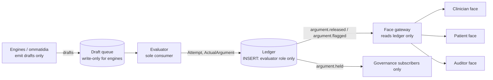

# EVAL-1 — Deterministic Evaluator Engineering Spec

Sep 25, 2026 · @Ken Lee

## 1. Scope and normative sources

Deliverable: the `evaluator` crate in `cdss-spine`: one binary per deployment that consumes `ActualArgumentDraft` (engine\_contract 0.1.0) plus the pinned `GenericArgument`, runs five ordered stages, and is the only writer of `ActualArgument` (ARG-1 spec, companion doc). Ticket of record: MAK-69 (TASK-CEC-002, delivery-map component `fabric-evaluator`, status external-owner-pending). Out of scope: engine internals (OM-1..4), renderer internals (ARG-1 §5), Deviation (CONTRACT-DEV-1).

**State of play.**

| Artefact | Location | Status |
| --- | --- | --- |
| Engine draft contract 0.1.0 | `CDSS_Makoha/packages/spine/engine_contract/` | Shipped; `validation.py`, `records.py` (VersionSet, FitReport), `conformance.py` (two-process purity check for producers) |
| Producer purity harness | `engine_contract/conformance.py`, `producer_worker.py` | Shipped; protocol `MAK-50:OM-2-OM-4:1`; reusable for the evaluator's own purity test |
| Evaluator | none | `fabric-evaluator` component, owner MAK-69, consumers MAK-203, MAK-231; journeys J1, J2, J4 UNVERIFIED |
| Argument-contract reconciliation | `optimus-prime-loops/docs/ARGUMENT_CONTRACT_RECONCILIATION_2026-09-08.md`, `ENGINE_PLANE_REQUIREMENT_RECONCILIATION_2026-09-08.md` | Rulings adopted here: registry content checks are sub-checks inside the five stages, not a parallel gate; an early failure is a terminal verdict with later stages marked not-executed; attempt, verdict and view-authorisation are distinct records; caches of released content are permitted, only bypassing evaluation is prohibited; effective-time and policy inputs are pinned context |

**Normative corpus text.**

| ID | Statement (verbatim) |
| --- | --- |
| SPINE-7 | "ML proposes and tests; only arithmetic releases." Probabilistic and generative components may propose grounds, candidate warrants, and draft arguments; release to any face requires deterministic evaluation of the completed argument tree against its GenericArgument. The releasing evaluator is versioned, testable, and free of learned parameters. |
| OM-5 | No engine has a path to a face: drafts are the plane's only output, the deterministic evaluator's pipeline (RG-1) is the only consumer of drafts, and no engine holds render, notification, or write-to-face capability in any build. Verified by negative tests (RG-8). |
| RG-1 | One deterministic evaluator per deployment executes the five-stage pipeline, in that order, as the sole path by which any draft becomes face-visible content. Versioned, exhaustively unit-tested, free of learned parameters; stage order normative: completeness before thresholds, thresholds before envelope, envelope before conflicts, conflicts before verdict. Negative tests prove no second path exists. |
| RG-2 | Every verdict (released, held, flagged) is ledgered with its complete stage trace: which stage produced the verdict, the evaluated values (typed per OM-3), the pins in force, and, for flagged releases, the recorded human fit-judgment (MS-7). The stage trace is argument content, renderable per register. |
| ME-1 | The evaluator checks every draft's grounds against the warrant's ApplicabilityEnvelope before release. In-envelope drafts follow the normal path; out-of-envelope and envelope-unknown drafts release only through the flagged path with a recorded fit-judgment. A build in which the flagged path can be bypassed silently is non-conformant. |
| MS-5 | Conflicting applicable conclusions become a ConflictRecord (DetectedIssue-bound) carrying both sides' arguments and envelopes. The system MUST NOT resolve, rank, average, or suppress; a human's navigation is recorded (MS-7). |
| FS-8 / FE-3 | Every crisp threshold converting graded applicability into a release decision lives in the pinned GenericArgument template; the evaluator alone converts grades to release decisions and reads thresholds only from the template. |
| HR-1 | Every clinician-facing display element is a projection of evaluator-released argument objects read through the register API. No widget consumes engine output, pre-verdict caches, or side channels. |
| HR-4 | The face renders exactly the evaluator's verdict class: released as content; flagged only through the fit-judgment flow (HA-4); held never, in any preview or digest. |
| RG-8 | Conformance suite: single-gate negative tests (attempts to reach a face bypassing the evaluator must fail structurally), tier-boundary negative tests, replay determinism. Results are conformity-file artefacts. |

**Corpus pipeline text (compound-eyes Part 7), the normative order:**

```
evaluate(draft: ActualArgumentDraft, template: GenericArgument) ->
  1 COMPLETENESS  six elements present; qualifier typed (OM-3); rebuttals reconciled to confirmed findings (AD-2)
  2 THRESHOLDS    graded applicability -> ratified template thresholds (FS-8); method metadata honoured (FE-2)
  3 ENVELOPE      grounds vs warrant envelope; in / out(attrs) / unknown (ME-1)
  4 CONFLICTS     co-applicable conclusions -> ConflictRecords, materialised never resolved (SPINE-6, MS-5)
  5 VERDICT       released | held(reason) | flagged(fit-judgment required); ledgered with full trace (RG-2)
```

## 2. Pipeline definition

### 2.1 Signature

```rust
pub fn evaluate(req: EvaluationRequest) -> Attempt

pub struct EvaluationRequest {
    draft:        ActualArgumentDraft,          // engine_contract 0.1.0, bytes validated
    template:     GenericArgument,              // resolved from draft.binding.template pin; hash-checked
    envelope:     ApplicabilityEnvelope,        // resolved from template.envelope_ref pin
    thresholds:   ThresholdSet,                 // resolved from template.release_thresholds pin
    findings:     FindingsSnapshot,             // corruption-finding index at pinned report
    co_applicable: Vec<ReleasedArgumentRef>,    // same patient, open, from the ledger at effective_time
    context:      EvalContext,                  // effective_time, policy_version, profile, deployment_id
    pins:         VersionSet,                   // draft.pins plus evaluator_version, thresholds, envelope, findings report
}

pub struct Attempt {                            // ALWAYS persisted, even on stage-1 failure
    attempt_id:   Ulid,
    request_hash: Sha256,                       // canonical bytes of EvaluationRequest
    trace:        StageTrace,                   // five entries, fixed order
    verdict:      Verdict,                      // Released(ActualArgument) | Held{stage, code} | Flagged{argument, reasons}
    evaluator:    Pin,                          // {id, version, sha256 of binary}
    pins:         VersionSet,
    created_at:   DateTime<Utc>,                // taken from context.effective_time, never wall clock
}
```

Three records, kept distinct per the reconciliation: **Attempt** (every run, stored), **Verdict** (inside the attempt; only `Released` and `Flagged` produce an `ActualArgument`), **ViewAuthorisation** (a separate grant computed at read time from verdict class and principal role; see §6).

### 2.2 Stage trace record

```json
{
  "trace_version": "1",
  "stages": [
    {"stage": "completeness", "status": "pass|fail|not_executed", "code": "C-00", "checks": [{"id": "C-01", "result": "pass", "observed": {}}], "elapsed_us": 0},
    {"stage": "thresholds",   "status": "...", "code": "T-00", "checks": [], "evaluated": [{"criterion": "...", "signal": {"signal_type": "Membership", "...": "..."}, "threshold_ref": "...", "cut": "...", "outcome": "meets|below|borderline"}]},
    {"stage": "envelope",     "status": "...", "code": "E-00", "fit": {"status": "in|out|unknown", "attributes": []}},
    {"stage": "conflicts",    "status": "...", "code": "K-00", "conflict_records": []},
    {"stage": "verdict",      "status": "...", "code": "V-00", "verdict": "released|held|flagged", "reasons": []}
  ],
  "terminal_stage": "completeness|thresholds|envelope|conflicts|verdict",
  "pins": {"version_stamp": "..."}
}
```

Rules: exactly five entries in the fixed order; a `fail` at stage n sets `terminal_stage = n`, verdict `held`, and stages n+1..5 `not_executed` (never fabricated `pass`); `evaluated[]` values are the typed signal objects verbatim (OM-3), never scalars; the trace is embedded in `ActualArgument.evaluation` for Released and Flagged and stored on the Attempt for all three.

### 2.3 Verdict semantics

| Verdict | Produced when | Persists | Face-visible | Event |
| --- | --- | --- | --- | --- |
| `released` | Stages 1..4 pass; stage 5 finds no flag condition | Attempt + ActualArgument (state Released) | Yes, all registers subject to sign-off rules | `argument.released` |
| `flagged` | Stages 1..4 executed; stage 3 returned `out` or `unknown`, or stage 4 produced one or more ConflictRecords | Attempt + ActualArgument (state Flagged) | Clinician and auditor only, through the fit-judgment or conflict-navigation flow; never patient | `argument.flagged` |
| `held` | Any stage fails | Attempt only (no ActualArgument) | Never, in any preview, digest, cache or notification | `argument.held` (governance subscribers only) |

A `flagged` argument becomes face-renderable as content only after a `FitJudgment` or `ConflictNavigation` record (MS-7) references it; the evaluator does not re-run for that, the ledger links the act to the argument.

## 3. Stage specifications

Every check has an id, a typed failure code, and the fields it observes. A check that cannot run because an input is unavailable fails with the `*-UNAVAILABLE` code; it never passes by default. Registry content checks (Primer D: hash, tier, currency, range, context) are folded in as sub-checks and keep their own ids so both trace identities survive.

### Stage 1: COMPLETENESS (codes C-xx)

| Check | Rule | Fail code |
| --- | --- | --- |
| C-01 | Draft bytes validate against engine\_contract 0.1.0 (`validate()`); strict JSON, no NaN, no duplicate keys | C-SCHEMA |
| C-02 | `binding.template` pin resolves; `sha256` equals stored `GenericArgument.content_hash` | C-TEMPLATE-HASH (registry check: hash) |
| C-03 | `binding.criteria[]` ⊆ `template.criterion_ids[]` | C-CRITERIA |
| C-04 | `warrant.ga_id@ga_version` equals `binding.template` identity; `warrant.warrant_type` allowed for `context.profile` (GPP ⇒ guideline-rule only) | C-WARRANT |
| C-05 | `claim.type` ∈ profile whitelist | C-CLAIM-TYPE |
| C-06 | `claim.verbatim_fragment_refs[]` all resolve in the content registry at pinned snapshot; each fragment's signature verifies and its `effective_to` ≥ `context.effective_time` | C-FRAGMENT-HASH, C-FRAGMENT-CURRENCY (registry checks: hash, currency) |
| C-07 | `grounds[]` non-empty; every `resource_ref` exists at `effective_time` and is readable under the patient's consent scope | C-GROUNDS, C-CONSENT |
| C-08 | `backing[]` non-empty; every row resolves in `pins.library`; `tier` ∈ {E1,E2,E3}; tier ≥ template minimum tier for this claim type | C-BACKING, C-TIER (registry check: tier) |
| C-09 | `qualifier` has ≥ 1 signal; every signal's own pin resolves (model, calibration, linguistic\_variable, element) | C-QUALIFIER, C-SIGNAL-PIN |
| C-10 | Profile-forbidden signal arrays are empty (GPP ⇒ posterior, coverage, membership all `[]`) | C-PROFILE-SIGNAL |
| C-11 | `findings_evidence.status = observed`; `report` pin resolves and equals `request.findings` snapshot; `warrant` pin equals the template pin | C-FINDINGS-UNAVAILABLE, C-FINDINGS-PIN |
| C-12 | Set equality: `{d.finding_ref for d in rebuttals if d.source = corruption}` == `set(findings_evidence.applicable_confirmed_refs)` | C-REBUTTAL-SET |
| C-13 | Every corruption Defeater has `acknowledged_by` resolving to a review record (AD-2) | C-REBUTTAL-UNACKNOWLEDGED |
| C-14 | `pins` roles required for `warrant_type` are `pinned` (ARG-1 §6 table) | C-PINS |
| C-15 | `fit.status = observed` and `fit.envelope` pin equals `template.envelope_ref` | C-FIT-UNAVAILABLE, C-FIT-PIN |

### Stage 2: THRESHOLDS (codes T-xx)

Inputs: `qualifier.membership[]`, `qualifier.posterior[]`, `qualifier.coverage[]`, `template.release_thresholds` (resolved `ThresholdSet`), `template.warrant_content` method metadata (FE-2).

| Check | Rule | Fail code |
| --- | --- | --- |
| T-01 | `ThresholdSet.ratified = true`; every threshold has a `criterion_id` in `binding.criteria[]` | T-UNRATIFIED, T-ORPHAN |
| T-02 | For each criterion with a graded precondition: exactly one Membership signal per (subject, linguistic\_variable pin, term) required by the template; the signal's `linguistic_variable` pin equals the threshold's pinned variable | T-MISSING-GRADE, T-VARIABLE-PIN |
| T-03 | Apply the ratified cut: `degree ≥ alpha_cut` ⇒ `meets`; `degree < alpha_cut` ⇒ `below`; \` | degree - alpha\_cut |
| T-04 | Method metadata honoured: template declares `inference_family` and `defuzzifier`; the draft's `warrant.type_mapping_ref` matches; a Membership produced under a different method is rejected | T-METHOD |
| T-05 | Posterior and Coverage are read for verdict inputs only: if template sets `min_coverage`, `Coverage.coverage ≥ min_coverage` else `T-COVERAGE`; if template sets `abstain_below_posterior`, all `Posterior.probability < abstain_below_posterior` ⇒ outcome `abstain` (DX-6) recorded, claim type must then be `gather-more-information` | T-COVERAGE, T-ABSTAIN-CLAIM |
| T-06 | No cross-signal arithmetic: the stage reads each signal through the typed API only (`minimum_membership`, `contains`, `compare_posteriors`); any other operation is a compile error in Rust and a `ContractError` in the Python reference | (structural) |
| T-07 | Every evaluated (criterion, signal, threshold\_ref, cut, outcome) tuple written to `trace.stages[1].evaluated[]` with the signal object verbatim | (record) |

Stage 2 fails only on structural or mandatory-criterion conditions. A `below` on a non-mandatory criterion and any `borderline` are outcomes carried into stage 5, not failures.

### Stage 3: ENVELOPE (codes E-xx)

Inputs: `grounds[]` (demographic, site, deployment profile, coded findings), `envelope` (MS-1 schema: `population{age_range, sex, pregnancy, comorbidity_codes[]}`, `site_class[]`, `deployment_profile[]`, `exclusions[]`, `known_failure_regions[]`, `commitments{exclusions[], scope_conditions[]}` from ME-3).

| Check | Rule | Outcome |
| --- | --- | --- |
| E-01 | Envelope version pin equals `template.envelope_ref`; envelope `ratified = true` | fail E-ENVELOPE-PIN, E-UNRATIFIED |
| E-02 | Deterministic attribute match: for each envelope attribute with a ground available, compare (ranges inclusive, code sets by SNOMED subsumption at pinned terminology release); collect mismatching attribute names | `in` if no mismatch and no unknown; `out{attributes[]}` if any mismatch |
| E-03 | Any envelope attribute with no ground available ⇒ `unknown{attributes[]}`; unknown does not become `in` by absence | `unknown` |
| E-04 | Any ground matching `exclusions[]` or `commitments.exclusions[]` ⇒ `out` with that exclusion named | `out` |
| E-05 | Draft's own `fit.signals[]` (engine-reported OOD, atypicality, oversized conformal set, ME-7) are merged: any \`Fit.status = out | unknown\` from the engine is carried as a fit signal into the trace; the evaluator's E-02..E-04 result is authoritative for the stage status |
| E-06 | Result written as `trace.stages[2].fit` and copied to `ActualArgument.fit` | (record) |

Stage 3 never fails on `out` or `unknown`; those route to `flagged` at stage 5 (ME-1). It fails only on E-01.

### Stage 4: CONFLICTS (codes K-xx)

Inputs: the draft; `co_applicable[]` = released or flagged arguments for the same patient whose `claim` targets the same decision point (same `claim.type` and overlapping `claim.target_ref`, e.g. the same medication order or same problem) and whose `warrant.ga_id` differs, retrieved from the ledger as of `effective_time`; plus any co-applicable drafts in the same evaluation batch.

| Check | Rule | Outcome |
| --- | --- | --- |
| K-01 | For each co-applicable pair (this draft, other): if `claim.content` or `claim.verbatim_fragment_refs` differ in a way the template's `conflict_predicate` declares as contradictory (e.g. `recommend` vs `contraindicate` on the same target; different first-line agent), materialise a `ConflictRecord{left: arg_ref, right: arg_ref, envelopes: both, predicate_ref, lineage: both ga lineages}` | recorded |
| K-02 | Sibling lineages (SPINE-6, CP-4): if both warrants share `ga_id` root but differ in `lineage.jurisdiction` or `guideline_system`, always a ConflictRecord regardless of content equality (co-residence is materialised, never merged) | recorded |
| K-03 | Fuzzy-versus-crisp disagreement (MS-5): if a Membership `meets` at stage 2 while a `bayesian-likelihood` sibling for the same criterion abstains or vice versa, ConflictRecord with `predicate_ref = wing-disagreement` | recorded |
| K-04 | No ranking, averaging, or suppression: the stage emits records only; the draft's claim is unchanged | (structural: stage has no write access to `claim`) |
| K-05 | Each ConflictRecord is also emitted as a `DetectedIssue` projection with `implicated = [left, right]` (ARG-1 §4.3) | (record) |

Stage 4 fails only if `co_applicable` could not be retrieved (K-LEDGER-UNAVAILABLE); it never fails on the presence of conflicts.

### Stage 5: VERDICT (codes V-xx)

```
if any stage 1..4 status == fail            -> held{terminal_stage, code}
else if stage3.fit.status in {out, unknown} -> flagged{reason: envelope, attributes}
else if stage4.conflict_records non-empty   -> flagged{reason: conflict, records}
else if stage2 has outcome abstain          -> released (claim.type must be gather-more-information, already checked at T-05)
else                                        -> released
```

Additional verdict-time rules: V-01 a `released` verdict with any stage-2 `borderline` outcome carries `borderline: true` in the trace so the clinician face can offer the deviation sheet (FC-2); V-02 hard-stop class: if the template marks the claim `safety_class = deterministic-contraindication` and stage 2 `meets`, the released argument carries `hard_stop: true` (CF-4, HG-2); every other released argument is advisory; V-03 the verdict stage writes the ActualArgument (Released or Flagged) through the ARG-1 constructor, which recomputes the hash chain and pins; V-04 `held` writes the Attempt only.

## 4. Determinism and purity

"Free of learned parameters" and "bit-for-bit replayable" are enforced as build properties, not reviewed as intentions.

| Property | Mechanism | Verified by |
| --- | --- | --- |
| No learned parameters | The `evaluator` crate has no dependency on any ML runtime, model-loading crate, or weights file; `Cargo.toml` allow-list enforced by `cargo deny` with a banned list (`tch`, `ort`, `candle`, `tract`, `onnxruntime`, `llm`, any `*-sys` binding to a model runtime); SBOM (CycloneDX from `cargo cyclonedx`) attached to every release | P-01 dependency test; SBOM diff in CI |
| No network at runtime | All inputs arrive in `EvaluationRequest`; the binary opens no sockets; run under a seccomp profile denying `socket`, `connect`; container `--network=none` | P-02 strace/seccomp test |
| No wall clock | `created_at` and all currency checks use `context.effective_time`; `std::time::SystemTime::now` and `chrono::Utc::now` forbidden by clippy lint (`disallowed_methods`) | P-03 lint in CI |
| No randomness | `rand`, `getrandom`, `uuid::new_v4` banned; ULIDs minted by the ledger on commit, not by the evaluator; the evaluator returns `attempt_id` as `sha256(request_hash \|\| evaluator.sha256)` | P-04 lint + fixture |
| No floating-point comparison | Thresholds, degrees, probabilities and coverage compared as fixed-point `u32` scaled 1e6 after exact decimal parse (`rust_decimal`); `f32`/`f64` banned in `evaluator::stages` | P-05 lint + property test |
| Canonical serialisation | RFC 8785 JCS for `request_hash` and `content_hash` (note: the 0.1.0 Python `canonical_bytes` is sorted-keys compact JSON, explicitly not RFC 8785; the Rust side implements JCS and a parity test pins the Python bytes as a second, separately named digest `draft_bytes_sha256`) | P-06 cross-language digest test |
| Pure function | `evaluate` is `fn(EvaluationRequest) -> Attempt` with no `&mut` globals, no I/O; two fresh processes with different `PYTHONHASHSEED`-equivalent (`RUST_TEST_THREADS`, ASLR on) produce identical bytes | P-07 reuse of `conformance.check_producer` pattern against the evaluator binary |
| Terminology subsumption deterministic | E-02 code-set checks use a pinned, content-addressed terminology snapshot loaded from the request, never a live terminology server | P-08 snapshot pin in `pins.terminology` |
| Versioned | `evaluator.version` semver; `evaluator.sha256` of the release binary; both in every Attempt and ActualArgument; a change to any stage rule is a minor bump minimum and re-runs RG-4 sentinel replay | P-09 release checklist |
| Exhaustively unit-tested | Every check id C/T/E/K/V-xx has at least one pass and one fail fixture; branch coverage of `evaluator::stages` = 100% (`cargo llvm-cov` gate) | P-10 coverage gate |

Reference implementation policy: the Rust crate is the deployment evaluator. A Python reference (`packages/spine/evaluator_ref`, pure functions, no I/O) exists only for differential testing and fixture generation; CI runs both over the fixture set and diffs the traces (P-11).

## 5. Single-gate enforcement

The property to prove structurally (OM-5, RG-8): no path from any engine to any face except through `evaluate`.

### 5.1 Topology



### 5.2 Controls

| Layer | Control | Negative test |
| --- | --- | --- |
| Network | Engines run in a network segment whose egress allow-list is the draft queue only; faces and face gateway have no route to engine hosts; enforced by network policy (Kubernetes `NetworkPolicy` or equivalent) | N-01 engine pod attempts HTTP to gateway and ledger: refused |
| Queue ACL | Draft queue: engines `write`, evaluator `read`; no other principal has any permission | N-02 face-gateway principal attempts `read` on draft queue: denied |
| Database roles | `actual_argument`, `attempt`, `argument_defeater`: INSERT granted to `spine_evaluator` only; SELECT to `spine_gateway`, `spine_governance`; no UPDATE/DELETE to anyone; `attempt` rows with verdict `held` are hidden from `spine_gateway` by row-level security (`verdict <> 'held'`) | N-03 gateway role SELECT on held attempts returns zero rows; engine role INSERT denied |
| Event bus ACL | Topics `argument.released`, `argument.flagged`: subscribe granted to face services; `argument.held`: governance only; engines have no subscribe rights on any `argument.*` topic and no publish rights on any topic but `draft.submitted` | N-04 face service subscribes to `argument.held`: denied at broker |
| Build-time exclusion | Engine crates and the renderer crates are compiled without any dependency on each other or on `spine_gateway`; `cargo deny` bans the renderer and gateway crates from engine `Cargo.toml` and vice versa; symbol scan of engine binaries for gateway client symbols | N-05 symbol scan finds none |
| Code ownership | `evaluator/`, `gateway/`, and the ledger grant migrations are CODEOWNERS-protected; PR requires a named clinical-safety reviewer | process |
| Boundary monitor | A spine-level monitor subscribes to all `argument.*` and gateway access logs; alarms on: any ActualArgument whose `author.kind ≠ evaluator`; any face read of an `arg_id` with no matching \`argument.released | flagged`event; any gateway response containing a`claim`whose`arg\_id\` is not in the ledger |
| Caches | Gateway may cache released and flagged arguments keyed by `content_hash`; cache entries carry `verdict`, `version_stamp`, and `supersedes` state; a cache serves only if the ledger's current head for that `arg_id` is unchanged (ETag on `content_hash`) | N-07 superseded argument is not served from cache |
| Notifications | Notification payloads reference `arg_id` and verdict class only; the notification service resolves content through the gateway at open time; a payload containing claim text is rejected by schema | N-08 payload with `claim.content` rejected |
| Regulatory profile | Per build (J-1, J-2, J-3/GPP): the evaluator binary attests its profile at startup (`profile` signed into the SBOM and logged); the boundary monitor alarms on any `ActualArgument.profile` ≠ deployment profile (GPP-11 generalised per RG-8) | N-09 mismatched profile argument alarmed |

## 6. Face contract

View authorisation is computed at read time by the gateway from `(verdict, principal_role, sign_off_state, fit_judgment_state)`. It is never stored on the argument.

| Verdict | Clinician | Patient | Auditor | Notes |
| --- | --- | --- | --- | --- |
| `released` | Full argument tree, stage trace on demand; Sign-off Bar enabled (CS-5) | Plain register only after `SignOff` record exists for this `arg_id` (HA-1, TR-3, PS-3); patient's own grounds reflect immediately regardless | Argument pair and trace | `hard_stop: true` renders as the deterministic safety class only (HG-2) |
| `flagged` | Rendered through the Fit-Judgment sheet (HA-4) or Conflict Bench (CS-6): mismatch attributes or both conflict sides named; proceeding writes a `FitJudgment` / `ConflictNavigation` record (MS-7); only then may the Sign-off Bar enable | Never; 403 | Visible with flag reason | A flagged argument with a recorded fit-judgment still renders its envelope badge as `out`/`unknown` (CV-3) |
| `held` | Never: no list entry, no preview, no digest, no notification (HR-4) | Never | Attempt visible with terminal stage and code | 404 to any face route |

Gateway rules: G-01 every face read is one `AuditEvent` with `register` and `purposeOfUse`; G-02 the gateway serves only from ledger rows or its `content_hash`-keyed cache of them, never from engine or queue; G-03 the stage-trace peek (CC-5) is served from `ActualArgument.evaluation.trace`, the same bytes the ledger holds; G-04 the plain renderer receives only `Released` arguments with sign-off (type-level: the plain renderer's input type is `ActualArgument<Released>` plus a `SignOffRef`); G-05 `supersedes` chains resolve to the head; a superseded argument renders only in the auditor register with its successor linked.

## 7. Spine integration

### 7.1 Crate layout

```
cdss-spine/
  crates/
    argument/          # ARG-1 types: GenericArgument, ActualArgument<S>, TypedSignals, Pins, JCS hashing
    evaluator/         # this spec
      src/lib.rs       # pub fn evaluate(EvaluationRequest) -> Attempt
      src/request.rs   # EvaluationRequest, EvalContext, resolution of pins from content-addressed store
      src/stages/{completeness,thresholds,envelope,conflicts,verdict}.rs
      src/trace.rs     # StageTrace, check records, not_executed marking
      src/fixed.rs     # u32 fixed-point 1e6 compare helpers; f32/f64 banned here
      tests/           # one file per stage; fixtures under tests/fixtures/{pass,fail}/<check-id>.json
    evaluator-svc/     # thin service: consumes draft queue, builds EvaluationRequest, calls evaluate, commits
    gateway/           # face read API, ViewAuthorisation, cache
    ledger/            # tables, hash-chain trigger, event emission
  deny.toml            # cargo-deny bans (ML runtimes, rand, clock, renderer<->engine)
```

`evaluator` is a library crate with zero I/O; `evaluator-svc` does all resolution and persistence so the pure core is testable in isolation and replay is a call to the same function.

### 7.2 Resolution (evaluator-svc)

| Input | Resolved from | Failure |
| --- | --- | --- |
| `draft` | Draft queue message; bytes validated with the 0.1.0 validator before parse | reject to dead-letter with `C-SCHEMA`; still recorded as an Attempt with stage 1 fail |
| `template` | `generic_argument` table by `(ga_id, ga_version)`; hash compared to `draft.binding.template.sha256` | Attempt with `C-TEMPLATE-HASH` |
| `envelope`, `thresholds`, `findings` report, terminology snapshot, library snapshot | `pin_registry` by sha256 from `draft.pins` and `template` refs; content-addressed object store | Attempt with `*-UNAVAILABLE` |
| `co_applicable` | Ledger query: same `patient_id`, verdict in (released, flagged), open (not superseded), `claim.target_ref` overlap, as of `effective_time` | Attempt with `K-LEDGER-UNAVAILABLE` |
| `context.effective_time` | From the triggering event's commit time (the record event that caused the engine to run), carried in the draft queue message header; never `now()` | reject message |
| `context.policy_version`, `profile`, `deployment_id` | Service configuration, signed and pinned into `pins` | startup failure |

### 7.3 Storage

```sql
CREATE TABLE attempt (
  attempt_id        text PRIMARY KEY,           -- sha256(request_hash || evaluator_sha256)
  patient_id        text NOT NULL,
  request_hash      bytea NOT NULL,
  evaluator_version text NOT NULL,
  evaluator_sha256  bytea NOT NULL,
  verdict           text NOT NULL CHECK (verdict IN ('released','held','flagged')),
  terminal_stage    text NOT NULL,
  terminal_code     text NULL,
  arg_id            text NULL REFERENCES actual_argument(arg_id),   -- NULL iff held
  trace             jsonb NOT NULL,
  request           jsonb NOT NULL,             -- full EvaluationRequest for replay (RG-4); pins inside
  effective_time    timestamptz NOT NULL,
  CHECK ((verdict = 'held') = (arg_id IS NULL))
);
CREATE INDEX ON attempt (patient_id, effective_time DESC);
-- REVOKE UPDATE, DELETE FROM ALL; INSERT to spine_evaluator only.
-- Row-level security for spine_gateway: verdict <> 'held'.

CREATE TABLE conflict_record (
  conflict_id  text PRIMARY KEY,
  left_arg_id  text NOT NULL,
  right_arg_id text NOT NULL,
  predicate_ref text NOT NULL,
  envelopes    jsonb NOT NULL,
  navigation_ref text NULL                     -- MS-7 act, set by the face act, not the evaluator
);
```

### 7.4 Events

| Topic | Producer | Payload | Consumers |
| --- | --- | --- | --- |
| `draft.submitted` | engines | draft bytes, `effective_time`, engine pin | evaluator-svc only |
| `argument.released` | ledger on commit | `arg_id`, `patient_id`, `claim_type`, `content_hash`, `hard_stop`, `borderline` | faces, gateway cache, FHIR projector, governance |
| `argument.flagged` | ledger | plus `flag_reason`, `attributes[]` or `conflict_ids[]` | clinician face, auditor, governance |
| `argument.held` | ledger | `attempt_id`, `terminal_stage`, `terminal_code` | governance only |
| `conflict.recorded` | ledger | `conflict_id`, both arg ids | clinician face (Conflict Bench), auditor |

### 7.5 Replay (RG-4)

`replay(attempt_id)`: load `attempt.request`, resolve every pin from the content-addressed store (never from current heads), call `evaluate` with the same evaluator binary version (or a named candidate version for a lifecycle replay), and diff `trace` and `content_hash`. Output `{match: bool, diverging_checks[]: [{check_id, stored, replayed}]}`. A sentinel set (RG-4) is replayed on every evaluator, template, threshold, envelope, terminology or library version change; divergence report attaches to the change record before ratification (ME-5).

## 8. Existing assets to reuse

| Asset | Path | Reuse | Change |
| --- | --- | --- | --- |
| Draft validator and records | `CDSS_Makoha/packages/spine/engine_contract/validation.py`, `records.py` | Stage 1 C-01 reference behaviour; `VersionSet` and `FitReport` shapes consumed unchanged | None |
| Two-process purity harness | `engine_contract/conformance.py`, `producer_worker.py` (protocol `MAK-50:OM-2-OM-4:1`) | Adapt to run the evaluator binary twice in fresh processes over the same `EvaluationRequest` bytes; assert identical `Attempt` bytes (P-07) | Add an evaluator factory target |
| Non-coercion fixtures | `tests/engine_contract/fixtures/non_coercion.json` | Stage 2 T-06 and stage 1 C-09 fixtures | Extend with threshold-set fixtures |
| Draft fixture | `tests/engine_contract/fixtures/draft.json` | Base for every stage fixture | Add `findings_evidence.observed`, `fit.observed`, template with `release_thresholds` |
| Engine adapter | `engine_contract/engine_adapter.py` (`adapt_engine_inputs`) | Shows how existing `EngineArgumentInputs` become a lossless partial draft; evaluator-svc consumes its output, not the engine directly | None |
| Delivery map | `CDSS_Makoha/docs/architecture/delivery-map.v1.json` component `fabric-evaluator` (owner MAK-69, consumers MAK-203, MAK-231), journeys J1, J2, J4 | Ticket linkage; journeys become integration tests once the evaluator lands | Update `implementation_status` on delivery |
| Reconciliation rulings | `optimus-prime-loops/docs/ARGUMENT_CONTRACT_RECONCILIATION_2026-09-08.md` §3, `ENGINE_PLANE_REQUIREMENT_RECONCILIATION_2026-09-08.md` §§3-11 | Adopted in §1 (registry sub-checks, not-executed semantics, attempt/verdict/authorisation split, caches allowed, effective-time pinned) | None |
| Content registry gate chain | `CDSS-makoha-imago/02_cdss-stack-augmented/primer_D_content_registry.md` (hash, tier, currency, range, context) | Folded as C-02, C-06, C-08 and stage-2 range/context checks with their own ids | None |
| Corruption engine findings index | `primer_G_corruption_engine.md`; `AD-1..5` | `FindingsSnapshot` format and `applicable_confirmed_refs` semantics | Define snapshot schema (ticket 4) |
| Prior-generation verdict schemas | `Defunct_Makoha/mcp/schemas/rule-verdict.schema.json`, `ppp-ttt-verdict.schema.json`, `receipt.schema.json` | Field naming precedent for `Attempt` and receipts | Port names only |

## 9. Conformance suite

Release gate for the `evaluator` crate and its deployment; results are conformity-file artefacts (RG-8). Synthetic fixtures only.

| ID | Test | Asserts |
| --- | --- | --- |
| E-T01 | Check coverage | Every check id in §3 has ≥ 1 pass and ≥ 1 fail fixture; branch coverage of `stages/` = 100% |
| E-T02 | Stage order | Instrumented run records stage entry order `[1,2,3,4,5]` for a passing draft; a fixture failing at stage 2 shows stages 3..5 `not_executed` and stage 1 `pass` |
| E-T03 | No fabricated pass | Fixture failing at stage 1 has no `pass` in stages 2..5; any `pass` after a `fail` is a suite failure |
| E-T04 | Held never persists an argument | Held attempt ⇒ `arg_id IS NULL`, no `actual_argument` row, no \`argument.released |
| E-T05 | Flagged routing | Envelope `out` fixture and conflict fixture both yield `flagged`, with reason recorded; envelope `unknown` yields `flagged` |
| E-T06 | Envelope by absence is unknown | Fixture with an envelope attribute and no matching ground yields `unknown`, never `in` |
| E-T07 | Conflict never resolved | Two co-applicable contradictory fixtures yield two `flagged` arguments and one `conflict_record`; neither claim altered; no ranking field exists |
| E-T08 | Threshold from template only | Fixture whose draft carries a threshold value in any field is rejected at C-01 (field not in schema); changing the template's `release_thresholds` changes the outcome; nothing else does |
| E-T09 | Fixed-point comparison | Degree 0.6999995 vs alpha 0.7 ⇒ `below`; 0.7000000 ⇒ `meets`; property test over 10^5 random pairs compares `u32` result with exact `Decimal` |
| E-T10 | Rebuttal set equality | `applicable_confirmed_refs = [a,b]`, rebuttals `[a]` ⇒ `C-REBUTTAL-SET`; rebuttals `[a,b,c]` where c not confirmed ⇒ `C-REBUTTAL-SET` |
| E-T11 | Unknown findings is not absence | `findings_evidence.unavailable` ⇒ `C-FINDINGS-UNAVAILABLE`, held |
| E-T12 | Profile exclusion | GPP build: draft with a Posterior ⇒ `C-PROFILE-SIGNAL`; `warrant_type = bayesian-likelihood` ⇒ `C-WARRANT`; symbol scan of GPP binary finds no `Posterior` handling code path (cfg-gated) |
| E-T13 | Purity | Two fresh processes, ASLR on, produce byte-identical `Attempt` for 50 fixtures |
| E-T14 | No clock, no random, no network | Lints pass; seccomp test: binary run with `--network=none` and syscall filter completes all fixtures |
| E-T15 | Dependency ban | `cargo deny check` passes with the ML-runtime and randomness ban list; SBOM contains no banned crate |
| E-T16 | Replay determinism | Replay of 200 stored attempts under the same binary: 200 matches; replay under a candidate binary with one changed threshold rule: divergence report lists exactly the affected checks |
| E-T17 | Single-gate negative tests | N-01..N-09 from §5.2 |
| E-T18 | Verdict fidelity at the gateway | Held ⇒ 404 all faces; flagged ⇒ 403 patient, fit-judgment flow clinician; released without sign-off ⇒ 403 patient plain register |
| E-T19 | Trace is argument content | For released and flagged, `ActualArgument.evaluation.trace` byte-equals `attempt.trace` |
| E-T20 | Effective time | Fixture with `effective_time` in the past and a fragment that expired after it: C-06 passes (currency judged at effective time, not now) |
| E-T21 | Cross-language parity | Python reference and Rust crate produce identical traces over the fixture set |
| E-T22 | Hard stop class | Only templates with `safety_class = deterministic-contraindication` produce `hard_stop: true`; a fit warning or borderline never does |

## 10. Build sequence

One Jira MAK ticket per row under MAK-69 (TASK-CEC-002) as the rollup; each cites the Imago IDs in §1. Dependency order. ARG-1 tickets 1, 2, 4 (types, Rust core, tables) are prerequisites.

| # | Ticket | Deliverable | Depends on | Size |
| --- | --- | --- | --- | --- |
| 1 | Request and Attempt types | `EvaluationRequest`, `EvalContext`, `Attempt`, `StageTrace` with `not_executed`; JCS `request_hash` | ARG-1 #2 | S |
| 2 | Fixed-point module | `fixed.rs`: decimal parse to u32 1e6, compare, borderline band; property test E-T09 | none | S |
| 3 | Stage 1 completeness | C-01..C-15 with fixtures | 1 | M |
| 4 | Findings snapshot schema | `FindingsSnapshot{report: Pin, warrant: Pin, confirmed[]: {finding_ref, defeats, severity}}`; loader from content-addressed store | none | S |
| 5 | Threshold set schema | `ThresholdSet{criterion_id, kind: alpha_cut\|min_coverage\|abstain_below_posterior, value: decimal, borderline_band, mandatory, method}` resolved from `template.release_thresholds` | ARG-1 #1 | S |
| 6 | Stage 2 thresholds | T-01..T-07 with fixtures | 2, 5 | M |
| 7 | Envelope schema and matcher | MS-1 `ApplicabilityEnvelope` type; E-01..E-06; subsumption over pinned terminology snapshot | ARG-1 #1 | M |
| 8 | Stage 4 conflicts | K-01..K-05; `conflict_predicate` in template; `conflict_record` table | 7 | M |
| 9 | Stage 5 verdict and ARG-1 constructor call | V-01..V-04; hard-stop and borderline flags | 3, 6, 7, 8 | S |
| 10 | Ledger: attempt table, RLS, events | §7.3, §7.4; `argument.held` governance-only ACL | ARG-1 #4 | S |
| 11 | evaluator-svc | Queue consumer, resolution §7.2, commit, dead-letter | 9, 10 | M |
| 12 | Lints and deny list | clippy `disallowed_methods` (clock, random), `deny.toml` bans, `f32/f64` ban in `stages/`, SBOM generation | none | S |
| 13 | Purity harness | Adapt `conformance.check_producer` to the evaluator binary; E-T13, E-T14 | 11, 12 | S |
| 14 | Gateway view authorisation | §6 table; RLS-backed; 404/403 semantics; cache with `content_hash` ETag | 10 | M |
| 15 | Boundary monitor | §5.2 N-06, N-09 alarms | 10 | S |
| 16 | Replay command | §7.5; sentinel set fixture; divergence report | 11 | S |
| 17 | Python reference evaluator | `packages/spine/evaluator_ref` pure functions; E-T21 parity | 9 | M |
| 18 | Single-gate negative tests | N-01..N-05, N-07, N-08 as integration tests in CI (kind cluster or compose) | 11, 14 | M |
| 19 | Conformance suite complete | E-T01..E-T22 green; results exported as conformity artefacts | all | M |
| 20 | Delivery-map and journey update | `fabric-evaluator` status; J1, J2, J4 integration runs recorded | 19 | S |

Open decisions: `conflict_predicate` vocabulary per claim type (K-01) needs a clinical owner; `abstain_below_posterior` and `min_coverage` are template numbers signed off in the knowledge plane, not authored here; the GPP claim-type whitelist is registry configuration (read, not defined, by ticket 3).

## Sources

Corpus (linked Mac): `CDSS-makoha-imago/03_makoha-butterfly-corpus/corpus-md/compound-eyes-corpus_v1.1.md` (unified engine contract; Part 7 release pipeline; OM-5, RG-1, RG-2, RG-8), `four-faces-corpus_v1.1.md` (SPINE-6, SPINE-7), `right-wing-corpus_v1.1.md` (ME-1, MS-5, MS-7), `head-corpus_v1.0.md` (HR-1, HR-4, HA-4), `left-wing-corpus_v1.1.md` (FS-8, FE-3, FC-2), `labial-palps-corpus_v1.0.md` (CS-5, CS-6, CC-5); `02_cdss-stack-augmented/primer_D_content_registry.md`, `primer_G_corruption_engine.md`. Code: `CDSS_Makoha/packages/spine/engine_contract/` (README, schema.py, conformance.py, validation.py, records.py), `CDSS_Makoha/docs/architecture/delivery-map.v1.json` (component `fabric-evaluator`, MAK-69). Rulings: `optimus-prime-loops/docs/ARGUMENT_CONTRACT_RECONCILIATION_2026-09-08.md`, `ENGINE_PLANE_REQUIREMENT_RECONCILIATION_2026-09-08.md`. Companion: ARG-1 Argument Object Engineering Spec (this session).
