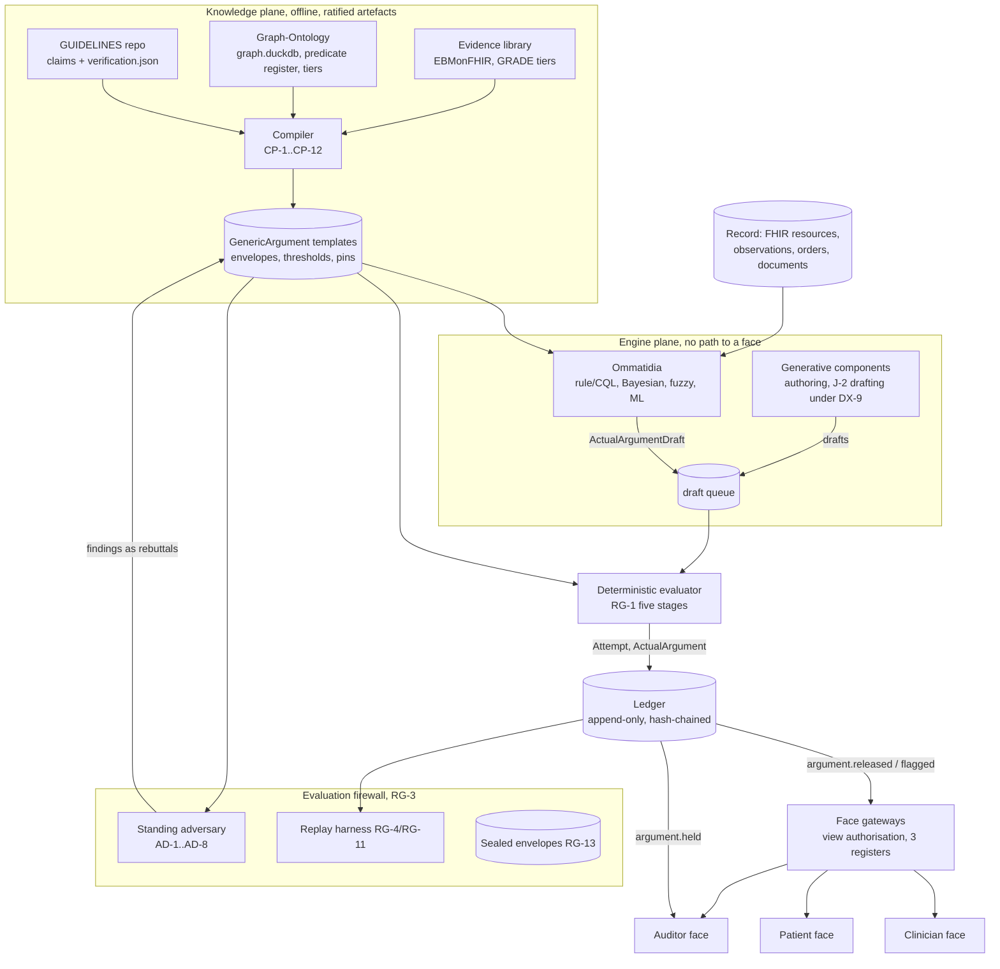

# Mākoha Consolidated Software Engineering Specification v0.1

Sep 25, 2026 · @Ken Lee

## 0. Purpose, precedence, references

This document is the single engineering specification for the Mākoha system: the record and ledger (spine), the knowledge plane compiled from the GUIDELINES and Graph-Ontology repositories, the engine plane, the deterministic evaluator, the three face gateways, the adversary and evaluation firewall, and the regulatory build profiles. It replaces the four session documents (moonshot, three portals, Open EHR Spine, corpus scan) and the two cluster specs (ARG-1, EVAL-1) as the build reference; where those said the same thing in prose, this says it as a contract.

**Precedence.** The design corpus at [CDSS-makoha-imago-V2.0 @ bdd2622](https://github.com/Arepo-Medtech/CDSS-makoha-imago-V2.0/tree/bdd26226f0cb1f1d797a8498dec90f12e20e175c) is host law (MAK-FFC v1.4 governs; subordinate volumes narrow, never relax). Where this spec chooses among options the corpus leaves open, the choice is marked **\[decision\]** and listed in §13. Where this spec disagrees with a corpus requirement it says so once, by link, in §13, and specifies the corpus version.

**How references resolve.** Every requirement citation is a link to the requirement's heading in the corpus file at the pinned commit; GitHub renders the heading `### SPINE-7 (MUST)` at anchor `#spine-7-must`. Every code citation is a link to the file at the pinned commit. No bare IDs are used without a link on first occurrence in each section. Corpus IDs keep their prefixes so that Jira MAK tickets can cite them unchanged.

**Normative words.** MUST, SHOULD, MAY as RFC 2119. "Type-enforced" means the property is unrepresentable in the Rust type system; "schema-enforced" means rejected by the JSON Schema validator; "gate-enforced" means rejected by the evaluator or compiler at runtime; "infra-enforced" means rejected by network policy, database grants or broker ACLs; "CI-enforced" means a failing test blocks merge.

## 1. Source repositories

All repositories are under the [Arepo-Medtech](https://github.com/Arepo-Medtech) organisation. SHAs are the commits read for this specification on 25 Sep 2026.

| Repository @ commit | Role in the system | What this spec takes from it |
| --- | --- | --- |
| [CDSS-makoha-imago-V2.0 @ bdd2622](https://github.com/Arepo-Medtech/CDSS-makoha-imago-V2.0/tree/bdd26226f0cb1f1d797a8498dec90f12e20e175c) | Design corpus, complete set 5 (20 Sep 2026): 19 volumes, 402 conformance IDs (305 MUST, 82 SHOULD, 15 MAY). [README](https://github.com/Arepo-Medtech/CDSS-makoha-imago-V2.0/blob/bdd26226f0cb1f1d797a8498dec90f12e20e175c/README.md), [MANIFEST](https://github.com/Arepo-Medtech/CDSS-makoha-imago-V2.0/blob/bdd26226f0cb1f1d797a8498dec90f12e20e175c/MANIFEST.md), [Wave 2 ledger](https://github.com/Arepo-Medtech/CDSS-makoha-imago-V2.0/blob/bdd26226f0cb1f1d797a8498dec90f12e20e175c/WAVE2-INTEGRATION-LEDGER.md) | Every MUST/SHOULD cited below. Supersedes the v1 corpus at [CDSS-makoha-imago @ d893e4a](https://github.com/Arepo-Medtech/CDSS-makoha-imago/tree/d893e4a42f572ae71084b29f5087a8ad3ef8a986) for requirement text; v1 is still cited for the staged contracts in `05_registers-and-contracts/` |
| [GUIDELINES @ 2e95185](https://github.com/Arepo-Medtech/GUIDELINES/tree/2e9518553ca305a79c3b5ca4a497e238577ed59b) | 404 verified Australian treatment guidelines, 11,326 claims, each tied to a retrieved source ([README](https://github.com/Arepo-Medtech/GUIDELINES/blob/2e9518553ca305a79c3b5ca4a497e238577ed59b/README.md)); one `guidelines/<slug>.md` plus one `verification/<slug>.verification.json` per guideline; verifier class `single_verifier_uncalibrated`, no clinician review yet | The claim-level source layer the compiler reads (§4.1); the verdict vocabulary in [scripts/verify.py](https://github.com/Arepo-Medtech/GUIDELINES/blob/2e9518553ca305a79c3b5ca4a497e238577ed59b/scripts/verify.py); the attestation loop ([docs/attestation-loop.md](https://github.com/Arepo-Medtech/GUIDELINES/blob/2e9518553ca305a79c3b5ca4a497e238577ed59b/docs/attestation-loop.md)); hash anchors ([scripts/anchor.py](https://github.com/Arepo-Medtech/GUIDELINES/blob/2e9518553ca305a79c3b5ca4a497e238577ed59b/scripts/anchor.py)); number guard ([scripts/number\_guard.py](https://github.com/Arepo-Medtech/GUIDELINES/blob/2e9518553ca305a79c3b5ca4a497e238577ed59b/scripts/number_guard.py)) |
| [Graph-Ontology @ 517d7e6](https://github.com/Arepo-Medtech/Graph-Ontology/tree/517d7e666da8e6e126ab76568bd25082b214af94) | The medical multigraph: 1,509,033 nodes, 7,492,883 edges, 204 edge types, 53 vocabularies, every edge validated against a predicate register ([docs/multigraph-build.md](https://github.com/Arepo-Medtech/Graph-Ontology/blob/517d7e666da8e6e126ab76568bd25082b214af94/docs/multigraph-build.md)); AMT transcode compendium; SNOMED CT-AU edition builds; OMOP, RxNorm, LOINC, HPO, MONDO, DrugCentral, PBS, MBS bridges | The terminology service and evidence graph (§4.2): the edge record and rule zero ([docs/weighted-graph-design.md](https://github.com/Arepo-Medtech/Graph-Ontology/blob/517d7e666da8e6e126ab76568bd25082b214af94/docs/weighted-graph-design.md)), the predicate register ([reference/graph\_predicates.json](https://github.com/Arepo-Medtech/Graph-Ontology/blob/517d7e666da8e6e126ab76568bd25082b214af94/reference/graph_predicates.json)), tiers ([reference/graph\_tiers.json](https://github.com/Arepo-Medtech/Graph-Ontology/blob/517d7e666da8e6e126ab76568bd25082b214af94/reference/graph_tiers.json)), condition bindings ([reference/snomed\_bindings.json](https://github.com/Arepo-Medtech/Graph-Ontology/blob/517d7e666da8e6e126ab76568bd25082b214af94/reference/snomed_bindings.json)), edition pins ([docs/snomed-edition-pin.md](https://github.com/Arepo-Medtech/Graph-Ontology/blob/517d7e666da8e6e126ab76568bd25082b214af94/docs/snomed-edition-pin.md)) |
| [CDSS\_Makoha @ a9ba1e1](https://github.com/Arepo-Medtech/CDSS_Makoha/tree/a9ba1e10282b796192364e3a57321bb71cadd087) | Software home. Shipped: engine draft contract 0.1.0 ([packages/spine/engine\_contract/schema.py](https://github.com/Arepo-Medtech/CDSS_Makoha/blob/a9ba1e10282b796192364e3a57321bb71cadd087/packages/spine/engine_contract/schema.py), [README](https://github.com/Arepo-Medtech/CDSS_Makoha/blob/a9ba1e10282b796192364e3a57321bb71cadd087/packages/spine/engine_contract/README.md)), producer purity harness ([conformance.py](https://github.com/Arepo-Medtech/CDSS_Makoha/blob/a9ba1e10282b796192364e3a57321bb71cadd087/packages/spine/engine_contract/conformance.py)), delivery map ([docs/architecture/delivery-map.v1.json](https://github.com/Arepo-Medtech/CDSS_Makoha/blob/a9ba1e10282b796192364e3a57321bb71cadd087/docs/architecture/delivery-map.v1.json)) | The wire contract for drafts (§5.2); ticket keys MAK-50, MAK-69, MAK-203 (§12) |
| [CDSS-makoha-imago @ d893e4a](https://github.com/Arepo-Medtech/CDSS-makoha-imago/tree/d893e4a42f572ae71084b29f5087a8ad3ef8a986) (v1) | Staged contracts: [CONTRACT-ARG-1.schema.json](https://github.com/Arepo-Medtech/CDSS-makoha-imago/blob/d893e4a42f572ae71084b29f5087a8ad3ef8a986/05_registers-and-contracts/CONTRACT-ARG-1.schema.json), [CONTRACT-DEV-1.schema.json](https://github.com/Arepo-Medtech/CDSS-makoha-imago/blob/d893e4a42f572ae71084b29f5087a8ad3ef8a986/05_registers-and-contracts/CONTRACT-DEV-1.schema.json), [CONTRACT-RRI-1 test spec](https://github.com/Arepo-Medtech/CDSS-makoha-imago/blob/d893e4a42f572ae71084b29f5087a8ad3ef8a986/05_registers-and-contracts/CONTRACT-RRI-1_render-invariance_test-spec.md); stack primers B, D, E, G, I | Field names and the render-invariance property (§3, §8) |
| [optimus-prime-loops @ 7c9598a](https://github.com/Arepo-Medtech/optimus-prime-loops/tree/7c9598aba7fe4c541889174efbc4fca646b3d80d) | Delivery pipeline and the 8 Sep 2026 reconciliation rulings: [ARGUMENT\_CONTRACT\_RECONCILIATION](https://github.com/Arepo-Medtech/optimus-prime-loops/blob/7c9598aba7fe4c541889174efbc4fca646b3d80d/docs/ARGUMENT_CONTRACT_RECONCILIATION_2026-09-08.md), [ENGINE\_PLANE\_REQUIREMENT\_RECONCILIATION](https://github.com/Arepo-Medtech/optimus-prime-loops/blob/7c9598aba7fe4c541889174efbc4fca646b3d80d/docs/ENGINE_PLANE_REQUIREMENT_RECONCILIATION_2026-09-08.md) | Rulings adopted in §6 (registry checks as sub-checks; not-executed semantics; attempt/verdict/authorisation split) |
| [au-medicines-compendium @ 44aa239](https://github.com/Arepo-Medtech/au-medicines-compendium/tree/44aa2393df2142c64032bc6200226eb5c3484d91) | Origin of the AMT transcode tables and the guidelines (now moved to GUIDELINES); Graph-Ontology's README is the current form | Historical; cite Graph-Ontology instead |
| [ckm](https://github.com/Arepo-Medtech/ckm), [syn500](https://github.com/Arepo-Medtech/syn500) (public) | openEHR archetype mirror; SynGP500 synthetic GP notes | Archetype source for structured note sections (§7.3); development corpus for extraction (§9.4) |

## 2. System topology



| Component | Trust boundary | Writes | Reads | Enforced by |
| --- | --- | --- | --- | --- |
| Compiler | Knowledge plane; offline; human ratification terminal | GenericArgument versions | GUIDELINES, Graph-Ontology, evidence library | CP-6 gate; [CP-6](https://github.com/Arepo-Medtech/CDSS-makoha-imago-V2.0/blob/bdd26226f0cb1f1d797a8498dec90f12e20e175c/corpus-md/compound-eyes-corpus_v1.4.md#cp-6-must) |
| Ommatidia and generative components | Engine plane; network egress = draft queue only | draft queue | record, templates | [OM-5](https://github.com/Arepo-Medtech/CDSS-makoha-imago-V2.0/blob/bdd26226f0cb1f1d797a8498dec90f12e20e175c/corpus-md/compound-eyes-corpus_v1.4.md#om-5-must) infra-enforced (§6.5) |
| Evaluator | Sole verdict producer; pure library + thin service | ledger (INSERT only) | draft queue, templates, ledger | [RG-1](https://github.com/Arepo-Medtech/CDSS-makoha-imago-V2.0/blob/bdd26226f0cb1f1d797a8498dec90f12e20e175c/corpus-md/compound-eyes-corpus_v1.4.md#rg-1-must) |
| Ledger | Append-only, hash-chained, externally anchored | none (triggers only) | — | [SPINE-4](https://github.com/Arepo-Medtech/CDSS-makoha-imago-V2.0/blob/bdd26226f0cb1f1d797a8498dec90f12e20e175c/corpus-md/four-faces-corpus_v1.4.md#spine-4-must), [L3-2](https://github.com/Arepo-Medtech/CDSS-makoha-imago-V2.0/blob/bdd26226f0cb1f1d797a8498dec90f12e20e175c/corpus-md/legs-corpus_v1.2.md#l3-2-must) |
| Face gateways | Read-only projections; act records only | act records (sign-off, deviation, gap, fit-judgment, conflict navigation) | ledger | [HR-1](https://github.com/Arepo-Medtech/CDSS-makoha-imago-V2.0/blob/bdd26226f0cb1f1d797a8498dec90f12e20e175c/corpus-md/head-corpus_v1.1.md#hr-1-must), [SPINE-9](https://github.com/Arepo-Medtech/CDSS-makoha-imago-V2.0/blob/bdd26226f0cb1f1d797a8498dec90f12e20e175c/corpus-md/four-faces-corpus_v1.4.md#spine-9-should) |
| Evaluation firewall | Separate account/storage; no engine write access | findings, replay reports | ledger (read), templates | [RG-3](https://github.com/Arepo-Medtech/CDSS-makoha-imago-V2.0/blob/bdd26226f0cb1f1d797a8498dec90f12e20e175c/corpus-md/compound-eyes-corpus_v1.4.md#rg-3-must), [L5-3](https://github.com/Arepo-Medtech/CDSS-makoha-imago-V2.0/blob/bdd26226f0cb1f1d797a8498dec90f12e20e175c/corpus-md/legs-corpus_v1.2.md#l5-3-may) |

## 3. Data contracts

All contracts are JSON Schema 2020-12 generated from Rust types (schema parity CI-enforced). Canonical bytes are RFC 8785 JCS; digests are SHA-256. The shipped Python draft contract at [schema.py](https://github.com/Arepo-Medtech/CDSS_Makoha/blob/a9ba1e10282b796192364e3a57321bb71cadd087/packages/spine/engine_contract/schema.py) is the 0.1.0 baseline; additions below are additive.

### 3.1 GenericArgument (template)

Source: [CONTRACT-ARG-1.schema.json (v1 corpus)](https://github.com/Arepo-Medtech/CDSS-makoha-imago/blob/d893e4a42f572ae71084b29f5087a8ad3ef8a986/05_registers-and-contracts/CONTRACT-ARG-1.schema.json) extended per [CP-2](https://github.com/Arepo-Medtech/CDSS-makoha-imago-V2.0/blob/bdd26226f0cb1f1d797a8498dec90f12e20e175c/corpus-md/compound-eyes-corpus_v1.4.md#cp-2-must), [CP-10](https://github.com/Arepo-Medtech/CDSS-makoha-imago-V2.0/blob/bdd26226f0cb1f1d797a8498dec90f12e20e175c/corpus-md/compound-eyes-corpus_v1.4.md#cp-10-must), [CP-11](https://github.com/Arepo-Medtech/CDSS-makoha-imago-V2.0/blob/bdd26226f0cb1f1d797a8498dec90f12e20e175c/corpus-md/compound-eyes-corpus_v1.4.md#cp-11-must), [MS-1](https://github.com/Arepo-Medtech/CDSS-makoha-imago-V2.0/blob/bdd26226f0cb1f1d797a8498dec90f12e20e175c/corpus-md/right-wing-corpus_v1.4.md#ms-1-must), [AX-5](https://github.com/Arepo-Medtech/CDSS-makoha-imago-V2.0/blob/bdd26226f0cb1f1d797a8498dec90f12e20e175c/corpus-md/abdomen-corpus_v1.3.md#ax-5-must).

| Field | Type | Req | Rule |
| --- | --- | --- | --- |
| `ga_id`, `ga_version` | string, semver | yes | Immutable per version; change = new version with `lineage.supersedes` |
| `content_id` | sha256 of canonical body | yes | Content-addressed identifier (AX-5) |
| `criterion_ids[]` | string, min 1 | yes | Ommatidial grain ([OM-1](https://github.com/Arepo-Medtech/CDSS-makoha-imago-V2.0/blob/bdd26226f0cb1f1d797a8498dec90f12e20e175c/corpus-md/compound-eyes-corpus_v1.4.md#om-1-must)) |
| `warrant_type` | enum `guideline-rule`, `bayesian-likelihood`, `ratified-local`, `fuzzy-precondition` | yes | Profile GPP admits `guideline-rule` only |
| `warrant_content` | `{ref_kind: cql-elm-ref \| lr-structure-ref \| fml-rule-ref, ref, sha256}` | yes | Pointer to compiled executable; the warrant is the executable form, its narrative source is Tier B backing (CP-9) |
| `backing_refs[]` | `{citation_id, tier: A\|B\|C, grade: high\|moderate\|low\|very-low, evidence_role: warrant-source \| supporting \| contrasting, resolved_at_snapshot, retraction_status}` | yes, min 1 | Citation pinning per CP-9 (§4.3); GRADE per [CP-8](https://github.com/Arepo-Medtech/CDSS-makoha-imago-V2.0/blob/bdd26226f0cb1f1d797a8498dec90f12e20e175c/corpus-md/compound-eyes-corpus_v1.4.md#cp-8-should) |
| `release_thresholds` | ThresholdSet (§6.2) | yes | Only home for crisp cuts ([FS-8](https://github.com/Arepo-Medtech/CDSS-makoha-imago-V2.0/blob/bdd26226f0cb1f1d797a8498dec90f12e20e175c/corpus-md/left-wing-corpus_v1.3.md#fs-8-must)) |
| `loss_matrix_ref` | Pin | yes | Three-action loss matrix for stage 5 ([RG-9](https://github.com/Arepo-Medtech/CDSS-makoha-imago-V2.0/blob/bdd26226f0cb1f1d797a8498dec90f12e20e175c/corpus-md/compound-eyes-corpus_v1.4.md#rg-9-must)) |
| `conflict_threshold` | decimal | yes | Anti-combiner threshold ([OM-8](https://github.com/Arepo-Medtech/CDSS-makoha-imago-V2.0/blob/bdd26226f0cb1f1d797a8498dec90f12e20e175c/corpus-md/compound-eyes-corpus_v1.4.md#om-8-must)) |
| `envelope` | ApplicabilityEnvelope (§3.5) | yes | `unknown` legal, absence illegal (MS-1) |
| `commitments` | `{exclusions[], scope_conditions[]}` | yes | [ME-3](https://github.com/Arepo-Medtech/CDSS-makoha-imago-V2.0/blob/bdd26226f0cb1f1d797a8498dec90f12e20e175c/corpus-md/right-wing-corpus_v1.4.md#me-3-must) |
| `method` | `{inference_family, defuzzifier}` | when fuzzy | [FE-2](https://github.com/Arepo-Medtech/CDSS-makoha-imago-V2.0/blob/bdd26226f0cb1f1d797a8498dec90f12e20e175c/corpus-md/left-wing-corpus_v1.3.md#fe-2-must) |
| `claim_types[]` | enum per profile | yes | GPP set = guideline-prompt, pathway-recommendation, reminder, information-summary, gather-more-information |
| `safety_class` | `advisory \| deterministic-contraindication` | yes | Only the latter may hard-stop ([CF-4](https://github.com/Arepo-Medtech/CDSS-makoha-imago-V2.0/blob/bdd26226f0cb1f1d797a8498dec90f12e20e175c/corpus-md/four-faces-corpus_v1.4.md#cf-4-must)) |
| `licence_class` | enum `redistributable-open`, `attribution-restricted`, `non-commercial`, `dua-bound`, `unknown` | yes | `unknown` fails compile; NC and DUA never in a supplied artefact (CP-11) |
| `profile` | `default \| GPP` | yes |  |
| `lineage` | `{jurisdiction, guideline_system, source_slug, supersedes[]}` | yes | Sibling lineages co-reside ([CP-4](https://github.com/Arepo-Medtech/CDSS-makoha-imago-V2.0/blob/bdd26226f0cb1f1d797a8498dec90f12e20e175c/corpus-md/compound-eyes-corpus_v1.4.md#cp-4-must)) |
| `archetype_ref` | Pin or null | no | Template family ([CP-12](https://github.com/Arepo-Medtech/CDSS-makoha-imago-V2.0/blob/bdd26226f0cb1f1d797a8498dec90f12e20e175c/corpus-md/compound-eyes-corpus_v1.4.md#cp-12-should)) |
| `pins` | PinSet (§3.4) | yes |  |
| `ratification` | `{ratifier_id, authority, at, record_ref, verifier_stamps[]}` | yes | AX-5 stamps |

### 3.2 ActualArgumentDraft (engine output) and ActualArgument (ledgered)

Draft = the shipped 0.1.0 `ActualArgumentDraft` ([schema.py](https://github.com/Arepo-Medtech/CDSS_Makoha/blob/a9ba1e10282b796192364e3a57321bb71cadd087/packages/spine/engine_contract/schema.py)) with two additive fields: `qualifier.ignorance[]` (§3.3) and `generation` (§5.3, only for generative producers). ActualArgument = Draft plus the fields below, written only by the evaluator.

| Added field | Type | Rule |
| --- | --- | --- |
| `arg_id` | ULID minted by ledger |  |
| `subject_ref`, `encounter_ref` | FHIR references | encounter optional |
| `evaluation` | StageTrace (§6.4) | Includes verdict class of every contributing verdict ([RG-2 note](https://github.com/Arepo-Medtech/CDSS-makoha-imago-V2.0/blob/bdd26226f0cb1f1d797a8498dec90f12e20e175c/corpus-md/compound-eyes-corpus_v1.4.md#rg-2-must)) |
| `verdict` | `released \| flagged` | `held` never becomes an ActualArgument |
| `renders[]` | `{register, template_version (pin U), text_hash, fidelity_check_ref, entailment_check_ref}` | The rendered text actually released, per register (RG-2 note; [TE-5](https://github.com/Arepo-Medtech/CDSS-makoha-imago-V2.0/blob/bdd26226f0cb1f1d797a8498dec90f12e20e175c/corpus-md/thorax-corpus_v1.2.md#te-5-must)) |
| `prev_hash`, `content_hash`, `supersedes` | sha256, sha256, arg\_id | Hash chain per patient stream |
| `deviation_refs[]`, `fit_judgment_ref`, `conflict_navigation_ref`, `sign_off_ref` | act record refs | Set by face acts, never by the evaluator |
| `author` | `{kind: evaluator, id, version, sha256}` |  |

### 3.3 Qualifier: six typed components

The five signals of [OM-3](https://github.com/Arepo-Medtech/CDSS-makoha-imago-V2.0/blob/bdd26226f0cb1f1d797a8498dec90f12e20e175c/corpus-md/compound-eyes-corpus_v1.4.md#om-3-must) as shipped, plus `ignorance` from [QU-6](https://github.com/Arepo-Medtech/CDSS-makoha-imago-V2.0/blob/bdd26226f0cb1f1d797a8498dec90f12e20e175c/corpus-md/compound-eyes-corpus_v1.4.md#qu-6-must). Rust newtypes, no `From`/`Into`, no `Deref<f64>`; the Python C06 test at [test\_contract.py](https://github.com/Arepo-Medtech/CDSS_Makoha/blob/a9ba1e10282b796192364e3a57321bb71cadd087/tests/engine_contract/test_contract.py) is the reference behaviour.

| Component | Fields | Meaning | Never rendered as |
| --- | --- | --- | --- |
| Posterior | `hypothesis`, `probability`, `model: Pin` | belief | degree, confidence |
| Coverage | `prediction_set[]`, `coverage`, `population`, `calibration: Pin` | conformal set + stated coverage | probability of correctness |
| Membership | `subject`, `degree`, `linguistic_variable: Pin`, `term` | graded meaning | probability, confidence, traffic-light |
| Reliability | `report_ref`, `reported_degree`, `source_ref` | source-stated | weight |
| Fit | `element: Pin`, `status: in\|out\|unknown`, `attributes[]`, `evidence_refs[]` | envelope status | confidence |
| Ignorance | `measure: credal-width \| venn-abers-width \| pl-bel-gap`, `value`, `backing: Pin` | epistemic imprecision | confidence; never subtracted from or added to any other component |

### 3.4 PinSet: eight elements

Per [CP-10](https://github.com/Arepo-Medtech/CDSS-makoha-imago-V2.0/blob/bdd26226f0cb1f1d797a8498dec90f12e20e175c/corpus-md/compound-eyes-corpus_v1.4.md#cp-10-must). Every draft, verdict and compiled artefact carries all eight; an unresolved element is a hold. Extends the shipped `VersionSet` (nine roles) by grouping into the named elements.

| Element | Contents | Shipped roles it covers |
| --- | --- | --- |
| S | argument schema version; terminology edition URIs (SNOMED CT-AU edition, AMT, LOINC); codebook editions | `terminology`, `codebook` |
| R | GenericArgument template and rule-set versions | `template` |
| K/I | evidence-library snapshot; retrieval index snapshot id | `library` (new: `index`) |
| W | weights hash of every frozen learned component on the release path or in a tester | `model`, `membership_function` |
| F | ratified feedback overlay / override artefact version | (new) |
| M | generative base model identity, version, decoding params, determinism mode | (new) |
| P | prompt and orchestration policy version, round cap, abstention thresholds | (new) |
| U | rendering template version per register | (new) |
| — | `engine`, `configuration`, `envelope` | kept as shipped |

### 3.5 Verdict classes, envelope, conflict, deviation, acts

| Object | Fields | Source |
| --- | --- | --- |
| VerdictClass | enum `1` (deterministic rule), `2` (frozen model with declared error rate on a fixed benchmark, may hold/flag/feed, never release), `3` (base-model self-judgement, never a control) | [OM-9](https://github.com/Arepo-Medtech/CDSS-makoha-imago-V2.0/blob/bdd26226f0cb1f1d797a8498dec90f12e20e175c/corpus-md/compound-eyes-corpus_v1.4.md#om-9-must) |
| ApplicabilityEnvelope | `{version, ratified, population{age_range, sex, pregnancy, comorbidity_ecl}, site_class[], deployment_profile[], validation_status, evidence_tier, exclusions[], known_failure_regions[], known_gaps[]}`; SNOMED constraints as ECL over a pinned edition | MS-1; [CP-12](https://github.com/Arepo-Medtech/CDSS-makoha-imago-V2.0/blob/bdd26226f0cb1f1d797a8498dec90f12e20e175c/corpus-md/compound-eyes-corpus_v1.4.md#cp-12-should) |
| ConflictRecord | `{conflict_id, left_arg, right_arg, predicate_ref, conflict_measure{kind: dempster\|belnap-both\|evidence-distance, value}, envelopes, lineages, navigation_ref}` | [MS-5](https://github.com/Arepo-Medtech/CDSS-makoha-imago-V2.0/blob/bdd26226f0cb1f1d797a8498dec90f12e20e175c/corpus-md/right-wing-corpus_v1.4.md#ms-5-must), OM-8 |
| Deviation | [CONTRACT-DEV-1](https://github.com/Arepo-Medtech/CDSS-makoha-imago/blob/d893e4a42f572ae71084b29f5087a8ad3ef8a986/05_registers-and-contracts/CONTRACT-DEV-1.schema.json) seven fields; `severity_tier` vocabulary open (§13) | [SPINE-8](https://github.com/Arepo-Medtech/CDSS-makoha-imago-V2.0/blob/bdd26226f0cb1f1d797a8498dec90f12e20e175c/corpus-md/four-faces-corpus_v1.4.md#spine-8-must) |
| FitJudgment, ConflictNavigation, GapReport, SignOff | each `{act_id, arg_id, actor, role, at, structured_basis, free_text, pins}`; append-only; attributed | [MS-7](https://github.com/Arepo-Medtech/CDSS-makoha-imago-V2.0/blob/bdd26226f0cb1f1d797a8498dec90f12e20e175c/corpus-md/right-wing-corpus_v1.4.md#ms-7-must), [HA-1](https://github.com/Arepo-Medtech/CDSS-makoha-imago-V2.0/blob/bdd26226f0cb1f1d797a8498dec90f12e20e175c/corpus-md/head-corpus_v1.1.md#ha-1-must), [MS-2](https://github.com/Arepo-Medtech/CDSS-makoha-imago-V2.0/blob/bdd26226f0cb1f1d797a8498dec90f12e20e175c/corpus-md/right-wing-corpus_v1.4.md#ms-2-must) |

## 4. Knowledge plane

The knowledge plane is built offline from three inputs and produces ratified, pinned `GenericArgument` templates. Only the compiler writes templates ([CP-1](https://github.com/Arepo-Medtech/CDSS-makoha-imago-V2.0/blob/bdd26226f0cb1f1d797a8498dec90f12e20e175c/corpus-md/compound-eyes-corpus_v1.4.md#cp-1-must)); hand-coded runtime rules are prohibited ([L2-2](https://github.com/Arepo-Medtech/CDSS-makoha-imago-V2.0/blob/bdd26226f0cb1f1d797a8498dec90f12e20e175c/corpus-md/legs-corpus_v1.2.md#l2-2-must)).

### 4.1 GUIDELINES repository as the claim source

The repo is already claim-granular: each guideline is a Markdown file with `[S1]`-style source tags and a sibling `verification/<slug>.verification.json` holding one record per claim `{claim, source, verdict, source_text}` plus `{guideline, edition, verified_utc, verifier, verifier_class, method, source_coverage, summary}` (example: [verification/asthma.verification.json](https://github.com/Arepo-Medtech/GUIDELINES/blob/2e9518553ca305a79c3b5ca4a497e238577ed59b/verification/asthma.verification.json), 22 claims, 22 pass). The compiler reads the verification file, not the prose.

**Ingest contract (compiler input adapter `guidelines-adapter`).**

| Verification verdict (from [verify.py](https://github.com/Arepo-Medtech/GUIDELINES/blob/2e9518553ca305a79c3b5ca4a497e238577ed59b/scripts/verify.py) `VERDICTS`) | Admitted as | Backing tier | Extra gate |
| --- | --- | --- | --- |
| `pass` | warrant source or backing | B (narrative guideline) with GRADE from the guideline's own strength where stated, else `low` pending clinician attestation | verbatim `source_text` re-checked against pinned source snapshot at compile (`verify.py --source`) |
| `pass_paraphrase_anchored` | backing only | B | hash anchors re-checked ([anchor.py](https://github.com/Arepo-Medtech/GUIDELINES/blob/2e9518553ca305a79c3b5ca4a497e238577ed59b/scripts/anchor.py)); [number\_guard.py](https://github.com/Arepo-Medtech/GUIDELINES/blob/2e9518553ca305a79c3b5ca4a497e238577ed59b/scripts/number_guard.py) must pass |
| `licensed_source_not_quoted` | backing only; any dose value requires an entry in [reference/attestations.json](https://github.com/Arepo-Medtech/GUIDELINES/blob/2e9518553ca305a79c3b5ca4a497e238577ed59b/reference/attestations.json) with status attested | B | licence\_class = `attribution-restricted` or `non-commercial` per source; NC never enters a supplied artefact ([CP-11](https://github.com/Arepo-Medtech/CDSS-makoha-imago-V2.0/blob/bdd26226f0cb1f1d797a8498dec90f12e20e175c/corpus-md/compound-eyes-corpus_v1.4.md#cp-11-must)) |
| `pass_image_transcription` | backing only; doses flagged `needs-human-recheck` | B | human re-check record required before a dose bound is compiled |
| `attested_not_sourced` | backing, tier C | C | attestation record required |
| `not_quoted`, `not_asserted`, `searched_not_found`, `fail` | rejected | — | compile error naming claim index |

**Verifier class gate.** Every guideline currently carries `verifier_class: single_verifier_uncalibrated`. The compiler admits such a guideline into a template only with `template.validation_status = provisional` and `envelope.evidence_tier = provisional`; the evaluator releases provisional templates only in the GPP profile's `information-summary` claim type or holds them **\[decision\]**. Promotion to `verified` requires the research-plane bench ([ME-9](https://github.com/Arepo-Medtech/CDSS-makoha-imago-V2.0/blob/bdd26226f0cb1f1d797a8498dec90f12e20e175c/corpus-md/right-wing-corpus_v1.4.md#me-9-should)): class-1 floor (schema, identifier resolution, retraction) then two property-specified judges agreeing, then clinician ratification.

**Mapping a guideline file to templates.** One guideline `<slug>.md` yields N `GenericArgument` templates, one per decision point the compiler extracts (a treatment-level recommendation, a dose band, a prescribing caution, a red-flag referral). Each template's `lineage.source_slug = <slug>`, `lineage.guideline_system` = the source organisation (from the file header, e.g. National Asthma Council), `lineage.jurisdiction = AU`. Claim indices from the verification file become `backing_refs[].citation_id = guidelines:<slug>@<edition>#<claim_index>`. Numbers in a claim (dose bands, thresholds) become `release_thresholds` entries with `ratified = false` until clinician sign-off; a template with unratified thresholds compiles but the evaluator's stage 2 holds it (T-01 in §6.2).

**Coverage inputs.** [docs/guideline-status.md](https://github.com/Arepo-Medtech/GUIDELINES/blob/2e9518553ca305a79c3b5ca4a497e238577ed59b/docs/guideline-status.md) (383 completed by source: RCH 216, RACGP 33, AMH 31, others) and [reference/pbs\_condition\_links.json](https://github.com/Arepo-Medtech/GUIDELINES/blob/2e9518553ca305a79c3b5ca4a497e238577ed59b/reference/pbs_condition_links.json) drive the compiler's coverage report and the auditor face's gap list; [reference/no\_guideline\_pbs.json](https://github.com/Arepo-Medtech/GUIDELINES/blob/2e9518553ca305a79c3b5ca4a497e238577ed59b/reference/no_guideline_pbs.json) lists PBS conditions with no guideline and becomes an envelope `known_gaps[]` entry on the nearest template.

### 4.2 Graph-Ontology as terminology service and evidence graph

**Edge record (the contract).** From [docs/weighted-graph-design.md §3](https://github.com/Arepo-Medtech/Graph-Ontology/blob/517d7e666da8e6e126ab76568bd25082b214af94/docs/weighted-graph-design.md) and [multigraph-build.md](https://github.com/Arepo-Medtech/Graph-Ontology/blob/517d7e666da8e6e126ab76568bd25082b214af94/docs/multigraph-build.md): `(subject{vocab, code}, predicate, object{vocab, code}, source, method, tier, state, pin, attributes)`. Rule zero: an edge with no source trace is not written, displayed or traversed. Nodes keyed `(vocabulary, code)`, never merged across vocabularies; identity is an edge. Rejected edges are kept with `state = rejected` and skipped by walks. Every walk has a visited set and depth cap.

**Predicate register.** [reference/graph\_predicates.json](https://github.com/Arepo-Medtech/Graph-Ontology/blob/517d7e666da8e6e126ab76568bd25082b214af94/reference/graph_predicates.json): each predicate has `id, label, subject[], object[], category (identity | structure | classification | relation | evidence | adjective | temporality | rationality | action | commercial), derivation (lookup | gap), strength_kind (exact | ordinal | likelihood_ratio | belief_interval), source, status (built | needs_source | needs_binding | needs_scoring)`. `build_edges.py` refuses unregistered predicates and any `needs_*` predicate; a refusal aborts the build. The spine's terminology service and retrieval graph consume `out/graph.duckdb` as a pinned, content-addressed snapshot (pin element K/I).

**Tiers.** [reference/graph\_tiers.json](https://github.com/Arepo-Medtech/Graph-Ontology/blob/517d7e666da8e6e126ab76568bd25082b214af94/reference/graph_tiers.json): Tier 1 lookup, Wilson 95% lower bound ≥ 0.99 on ≥ 30 fires against an independent second path, may collapse to a single target; Tier 2 measured routes (e.g. MONDO→SNOMED 0.909, DrugCentral→RxNorm 0.979); Tier 3 authored content with author/date/prompt trace. A tier is earned by [scripts/route\_scorer.py](https://github.com/Arepo-Medtech/Graph-Ontology/blob/517d7e666da8e6e126ab76568bd25082b214af94/scripts/route_scorer.py), never declared.

**What the spine uses, by predicate family.**

| Spine function | Graph predicates / tables | Constraint |
| --- | --- | --- |
| Terminology subsumption for envelopes and phenotypes (§6.2 stage 3) | SNOMED CT-AU `is_a` poly-hierarchy (RF2 20260831), `sct:in_refset`, `sct:historical_association`; edition builds in `out/snomed_editions.duckdb` ([docs/snomed-editions.md](https://github.com/Arepo-Medtech/Graph-Ontology/blob/517d7e666da8e6e126ab76568bd25082b214af94/docs/snomed-editions.md)) | ECL evaluated offline against the pinned edition; no live terminology server on the release path |
| Medication identity for prescribing checks | `transcode` (TPUU→brand→MPUU→MP→ingredients→PBS→RxCUI), `omop:maps_to`, `std_ingredient`, `substance_salt_base`, `product_route`, `strength` | Tier-1 routes only for identity; Tier-2 for ATC class; `rejected` mappings never followed |
| Indication and contraindication edges for the retrieval graph (§4.4) | `pbs:lists → pbs:has_restriction → pbs:restricted_to → pbs:indication_is`, `drugcentral:indication`, `drugcentral:contraindication`, `drugcentral:off_label_use` | An edge may back a warrant only if its `source` resolves under CP-9 and its licence class admits it; DrugCentral prodrug quirk (ramipril→ramiprilat) handled by `substance_salt_base` lifting before use |
| Sign→diagnosis likelihood | `hpo:has_phenotype` (ordinal frequency, rare disease only); `sign_suggests` is registered `needs_source` | Not admissible as Bayesian likelihood backing until a Tier-1/2 source is loaded; DX-3 parameters cite the evidence library, not the graph, until then |
| Lab result interpretation | LOINC axes (`loinc:has_component`, `has_scale`, `has_answer`), `loinc_unit_counterparts` | scale axis decides quantitative vs adjectival value slot |
| Condition binding of guidelines | `corpus:binds_to` from [snomed\_bindings.json](https://github.com/Arepo-Medtech/Graph-Ontology/blob/517d7e666da8e6e126ab76568bd25082b214af94/reference/snomed_bindings.json) (265 bound, NCTS Ontoserver SNOMED CT-AU 20260831 pinned) and the review queue ([docs/binding-review-queue.md](https://github.com/Arepo-Medtech/Graph-Ontology/blob/517d7e666da8e6e126ab76568bd25082b214af94/docs/binding-review-queue.md)) | A template whose condition has no binding compiles with `envelope.validation_status = unbound` and is held |

### 4.3 Citation pinning (CP-9) as a compiler stage

For every `backing_refs[]` entry: (1) identifier re-derived from bibliographic fields (title, first author, venue, year) against the pinned index snapshot, never accepted from a generative model; (2) resolves to the claimed work within tolerance; (3) not retracted or corrected at the snapshot. Any failure fails [CP-6](https://github.com/Arepo-Medtech/CDSS-makoha-imago-V2.0/blob/bdd26226f0cb1f1d797a8498dec90f12e20e175c/corpus-md/compound-eyes-corpus_v1.4.md#cp-6-must). Labels are "supporting evidence found", never "the source the model used". Evidence roles are fixed: compiled executable = warrant; narrative source = Tier B backing; a newer or contrasting primary study = `evidence_role: contrasting`, rendered as a flag, never adjudicated by the compiler.

### 4.4 Retrieval graph over the content registry

Per v1 [primer\_E\_graph\_rag.md](https://github.com/Arepo-Medtech/CDSS-makoha-imago/blob/d893e4a42f572ae71084b29f5087a8ad3ef8a986/02_cdss-stack-augmented/primer_E_graph_rag.md) and [primer\_D\_content\_registry.md](https://github.com/Arepo-Medtech/CDSS-makoha-imago/blob/d893e4a42f572ae71084b29f5087a8ad3ef8a986/02_cdss-stack-augmented/primer_D_content_registry.md): nodes are registry-anchored fragments (conditions, AMT products, dose regimens, contraindications, interactions, monitoring, guideline recommendations); an edge exists only if an authoritative fragment asserts it. Implementation: the Graph-Ontology `graph.duckdb` snapshot is the substrate; fragments are `GenericArgument.claim_types` content with `verbatim_fragment_refs`; traversal is deterministic over signed edges with contraindication pruning; embedding search is authoring-time only (CP-5), never on the release path.

### 4.5 Compiler gates (CP-6) in order

| # | Gate | Fails when |
| --- | --- | --- |
| 1 | Schema | any §3.1 field missing or of wrong type |
| 2 | Licence class | `unknown`, or NC/DUA in a redistributable target ([CP-11](https://github.com/Arepo-Medtech/CDSS-makoha-imago-V2.0/blob/bdd26226f0cb1f1d797a8498dec90f12e20e175c/corpus-md/compound-eyes-corpus_v1.4.md#cp-11-must)) |
| 3 | Citation pinning | §4.3 stage 1–3 |
| 4 | Pins resolved | any of S, R, K/I, W, F, M, P, U unresolved ([CP-10](https://github.com/Arepo-Medtech/CDSS-makoha-imago-V2.0/blob/bdd26226f0cb1f1d797a8498dec90f12e20e175c/corpus-md/compound-eyes-corpus_v1.4.md#cp-10-must)) |
| 5 | Envelope and commitments present | absent (not `unknown`) |
| 6 | Thresholds present | any criterion without a ThresholdSet entry; `ratified=false` allowed, recorded |
| 7 | Method metadata | fuzzy warrant without `inference_family`/`defuzzifier` |
| 8 | Tier marking | engine tier not in the build's manifest ([RG-6](https://github.com/Arepo-Medtech/CDSS-makoha-imago-V2.0/blob/bdd26226f0cb1f1d797a8498dec90f12e20e175c/corpus-md/compound-eyes-corpus_v1.4.md#rg-6-must)) |
| 9 | Backing entailment | AD-8 tester (class 2) fails on any numeric claim (§9.2) |
| 10 | Recompile diff and sentinel replay | divergence report missing ([CP-3](https://github.com/Arepo-Medtech/CDSS-makoha-imago-V2.0/blob/bdd26226f0cb1f1d797a8498dec90f12e20e175c/corpus-md/compound-eyes-corpus_v1.4.md#cp-3-must), [ME-5](https://github.com/Arepo-Medtech/CDSS-makoha-imago-V2.0/blob/bdd26226f0cb1f1d797a8498dec90f12e20e175c/corpus-md/right-wing-corpus_v1.4.md#me-5-must)) |
| 11 | Ratification | no ratifier stamp; change not through [MS-4](https://github.com/Arepo-Medtech/CDSS-makoha-imago-V2.0/blob/bdd26226f0cb1f1d797a8498dec90f12e20e175c/corpus-md/right-wing-corpus_v1.4.md#ms-4-must) |

## 5. Engine plane

### 5.1 Ommatidium contract

One engine per guideline criterion or declared criterion cluster ([OM-1](https://github.com/Arepo-Medtech/CDSS-makoha-imago-V2.0/blob/bdd26226f0cb1f1d797a8498dec90f12e20e175c/corpus-md/compound-eyes-corpus_v1.4.md#om-1-must)); the unified contract is the code block under "The unified engine contract" in [compound-eyes-corpus\_v1.4.md](https://github.com/Arepo-Medtech/CDSS-makoha-imago-V2.0/blob/bdd26226f0cb1f1d797a8498dec90f12e20e175c/corpus-md/compound-eyes-corpus_v1.4.md).

```
interface Ommatidium {
  binding: CriterionRef                       // pinned GenericArgument node(s)
  inputs:  Grounds[]                          // FHIR-sourced, provenance-bearing, graded annotations attached
  context: GenericArgument                    // pinned version; method metadata, thresholds, envelope, commitments
  propose(): ActualArgumentDraft              // pure function of (inputs, context, pins): OM-4
}
```

| Rule | Enforcement | Source |
| --- | --- | --- |
| `propose()` is stateless and bit-for-bit reproducible | Two-process purity harness: [conformance.py](https://github.com/Arepo-Medtech/CDSS_Makoha/blob/a9ba1e10282b796192364e3a57321bb71cadd087/packages/spine/engine_contract/conformance.py) protocol `MAK-50:OM-2-OM-4:1`, run per engine version in CI | [OM-4](https://github.com/Arepo-Medtech/CDSS-makoha-imago-V2.0/blob/bdd26226f0cb1f1d797a8498dec90f12e20e175c/corpus-md/compound-eyes-corpus_v1.4.md#om-4-must) |
| Output validates against the 0.1.0 draft schema | `python -m packages.spine.engine_contract` on stdin; strict JSON, no NaN, sorted keys | [OM-2](https://github.com/Arepo-Medtech/CDSS-makoha-imago-V2.0/blob/bdd26226f0cb1f1d797a8498dec90f12e20e175c/corpus-md/compound-eyes-corpus_v1.4.md#om-2-must) |
| No render, notify or write-to-face capability in any build | Engine crates have no dependency on gateway/renderer crates (`cargo deny`); network egress = draft queue only | [OM-5](https://github.com/Arepo-Medtech/CDSS-makoha-imago-V2.0/blob/bdd26226f0cb1f1d797a8498dec90f12e20e175c/corpus-md/compound-eyes-corpus_v1.4.md#om-5-must) |
| Publishes metadata: criterion binding, method family, signal types, envelope, version, pins, campaign coverage | `GET /engines/{id}/metadata` served from the registry, not the engine | [OM-6](https://github.com/Arepo-Medtech/CDSS-makoha-imago-V2.0/blob/bdd26226f0cb1f1d797a8498dec90f12e20e175c/corpus-md/compound-eyes-corpus_v1.4.md#om-6-should) |
| Heterogeneous runtimes allowed (JVM CQL, Python inference, native fuzzy) if they pass the same suites | [LS-3](https://github.com/Arepo-Medtech/CDSS-makoha-imago-V2.0/blob/bdd26226f0cb1f1d797a8498dec90f12e20e175c/corpus-md/legs-corpus_v1.2.md#ls-3-must) bounds the polyglot to JVM + Python + application layer | [OM-7](https://github.com/Arepo-Medtech/CDSS-makoha-imago-V2.0/blob/bdd26226f0cb1f1d797a8498dec90f12e20e175c/corpus-md/compound-eyes-corpus_v1.4.md#om-7-may) |

### 5.2 Engine families and tier placement

| Family | Produces | Tier ([RG-6](https://github.com/Arepo-Medtech/CDSS-makoha-imago-V2.0/blob/bdd26226f0cb1f1d797a8498dec90f12e20e175c/corpus-md/compound-eyes-corpus_v1.4.md#rg-6-must)) | Verdict class it may emit |
| --- | --- | --- | --- |
| Rule / CQL ommatidia (CQL translator + clinical-reasoning, JVM) | drafts with `warrant_type = guideline-rule`; no Posterior/Coverage | J-1, J-2, J-3 | class 1 |
| Fuzzy layer (FML rule bases, native) | Membership annotations on grounds; drafts with `fuzzy-precondition` warrants | J-1, J-2; excluded from J-3 ([FX-2](https://github.com/Arepo-Medtech/CDSS-makoha-imago-V2.0/blob/bdd26226f0cb1f1d797a8498dec90f12e20e175c/corpus-md/left-wing-corpus_v1.3.md#fx-2-must)) | class 1 |
| Bayesian differential (pgmpy-class, Python) | Posterior per hypothesis, decomposed per criterion cluster ([DX-1](https://github.com/Arepo-Medtech/CDSS-makoha-imago-V2.0/blob/bdd26226f0cb1f1d797a8498dec90f12e20e175c/corpus-md/compound-eyes-corpus_v1.4.md#dx-1-must)); abstention with missing-grounds list ([DX-6](https://github.com/Arepo-Medtech/CDSS-makoha-imago-V2.0/blob/bdd26226f0cb1f1d797a8498dec90f12e20e175c/corpus-md/compound-eyes-corpus_v1.4.md#dx-6-should)), ranked by information gain per cost ([DX-8](https://github.com/Arepo-Medtech/CDSS-makoha-imago-V2.0/blob/bdd26226f0cb1f1d797a8498dec90f12e20e175c/corpus-md/compound-eyes-corpus_v1.4.md#dx-8-must)) | J-2 | class 1 arithmetic over ratified structure; parameters backed per [DX-3](https://github.com/Arepo-Medtech/CDSS-makoha-imago-V2.0/blob/bdd26226f0cb1f1d797a8498dec90f12e20e175c/corpus-md/compound-eyes-corpus_v1.4.md#dx-3-must) |
| Conformal wrapper (MAPIE-class) | Coverage sets, group-conditional ([QU-3](https://github.com/Arepo-Medtech/CDSS-makoha-imago-V2.0/blob/bdd26226f0cb1f1d797a8498dec90f12e20e175c/corpus-md/compound-eyes-corpus_v1.4.md#qu-3-must)); Ignorance component (QU-6) | J-2 | class 1 over frozen calibration |
| Frozen encoders (entailment, reranking, guards, claim-need) | class 2 verdicts only: hold, flag, or feed a draft | J-2 (testers also run inside the firewall for J-1 artefacts) | class 2 with declared error rate on a fixed benchmark |
| Generative base models | authoring-time proposals (CP-5) in all tiers; runtime drafting only in J-2 under §5.3 | J-2 runtime; authoring-time anywhere | none; class 3 self-judgement is never a control ([DX-7](https://github.com/Arepo-Medtech/CDSS-makoha-imago-V2.0/blob/bdd26226f0cb1f1d797a8498dec90f12e20e175c/corpus-md/compound-eyes-corpus_v1.4.md#dx-7-must)) |

### 5.3 Generative components: the bounded loop

Per [DX-9](https://github.com/Arepo-Medtech/CDSS-makoha-imago-V2.0/blob/bdd26226f0cb1f1d797a8498dec90f12e20e175c/corpus-md/compound-eyes-corpus_v1.4.md#dx-9-must). A draft from a generative producer carries a `generation` block:

```json
{"generation": {"model": {"id": "...", "version": "...", "decoding": {...}, "determinism_mode": "batch-invariant|none"},
                "policy": {"prompt_version": "...", "round_cap": 3, "abstain_thresholds": {...}},
                "rounds": [{"n": 1, "transcript_ref": "...", "logprobs_ref": "...", "retrieval": {"query_vector_ref": "...", "top_k": [{"id": "...", "score": 0.0}], "index_snapshot": "..."},
                            "verdicts_in": [{"class": 2, "component": "...", "version": "...", "result": "fail", "perception": {...}}],
                            "frozen_fields": ["claim", "grounds[0]"]}],
                "outcome": "converged|abstained_at_cap|suppressed"}}
```

Rules: re-entry only on a class 1 or class 2 verdict returned as a typed perception (never prose); fields that passed are frozen between rounds; at cap the draft abstains (`claim.type = gather-more-information`) or is held; the harness never rewrites; every round is ledgered; convergence, oscillation, abstention-at-cap and error-introduction rates are telemetry ([RG-5](https://github.com/Arepo-Medtech/CDSS-makoha-imago-V2.0/blob/bdd26226f0cb1f1d797a8498dec90f12e20e175c/corpus-md/compound-eyes-corpus_v1.4.md#rg-5-must)). Pins M and P are mandatory on any such draft (§3.4).

## 6. Deterministic evaluator

Ticket of record MAK-69 (delivery-map component `fabric-evaluator`, [delivery-map.v1.json](https://github.com/Arepo-Medtech/CDSS_Makoha/blob/a9ba1e10282b796192364e3a57321bb71cadd087/docs/architecture/delivery-map.v1.json)). Normative pipeline text: the code block under "The release pipeline" in [compound-eyes-corpus\_v1.4.md Part 7](https://github.com/Arepo-Medtech/CDSS-makoha-imago-V2.0/blob/bdd26226f0cb1f1d797a8498dec90f12e20e175c/corpus-md/compound-eyes-corpus_v1.4.md); requirements [RG-1](https://github.com/Arepo-Medtech/CDSS-makoha-imago-V2.0/blob/bdd26226f0cb1f1d797a8498dec90f12e20e175c/corpus-md/compound-eyes-corpus_v1.4.md#rg-1-must), [RG-2](https://github.com/Arepo-Medtech/CDSS-makoha-imago-V2.0/blob/bdd26226f0cb1f1d797a8498dec90f12e20e175c/corpus-md/compound-eyes-corpus_v1.4.md#rg-2-must), [RG-9](https://github.com/Arepo-Medtech/CDSS-makoha-imago-V2.0/blob/bdd26226f0cb1f1d797a8498dec90f12e20e175c/corpus-md/compound-eyes-corpus_v1.4.md#rg-9-must), [OM-8](https://github.com/Arepo-Medtech/CDSS-makoha-imago-V2.0/blob/bdd26226f0cb1f1d797a8498dec90f12e20e175c/corpus-md/compound-eyes-corpus_v1.4.md#om-8-must), [ME-1](https://github.com/Arepo-Medtech/CDSS-makoha-imago-V2.0/blob/bdd26226f0cb1f1d797a8498dec90f12e20e175c/corpus-md/right-wing-corpus_v1.4.md#me-1-must). Rulings from [ARGUMENT\_CONTRACT\_RECONCILIATION §3](https://github.com/Arepo-Medtech/optimus-prime-loops/blob/7c9598aba7fe4c541889174efbc4fca646b3d80d/docs/ARGUMENT_CONTRACT_RECONCILIATION_2026-09-08.md) adopted: registry content checks are sub-checks with their own ids; an early failure is a terminal verdict with later stages `not_executed`; attempt, verdict and view authorisation are distinct records; caches of released content are allowed, bypassing evaluation is not.

### 6.1 Signature and records

```rust
pub fn evaluate(req: EvaluationRequest) -> Attempt;   // pure; no I/O, clock, random, float compare, network

pub struct EvaluationRequest { draft: ActualArgumentDraft, template: GenericArgument, envelope: ApplicabilityEnvelope,
  thresholds: ThresholdSet, loss_matrix: LossMatrix, findings: FindingsSnapshot, co_applicable: Vec<ArgRef>,
  context: EvalContext /* effective_time, policy_version, profile, deployment_id */, pins: PinSet }

pub struct Attempt { attempt_id: Sha256 /* request_hash || evaluator_sha256 */, request_hash: Sha256, trace: StageTrace,
  verdict: Verdict /* Released(ActualArgument) | Held{stage, code} | Flagged{argument, reasons} */, evaluator: Pin, pins: PinSet, created_at: EffectiveTime }
```

### 6.2 Stages and checks

| Stage | Check id | Rule | Fail code |
| --- | --- | --- | --- |
| 1 Completeness | C-01 | Draft bytes validate (0.1.0 validator, strict JSON) | C-SCHEMA |
|  | C-02 | `binding.template.sha256` = stored `GenericArgument.content_id` | C-TEMPLATE-HASH |
|  | C-03 | `binding.criteria[]` ⊆ `template.criterion_ids[]` | C-CRITERIA |
|  | C-04 | warrant identity = template; `warrant_type` allowed for profile | C-WARRANT |
|  | C-05 | `claim.type` ∈ `template.claim_types[]` and profile whitelist | C-CLAIM-TYPE |
|  | C-06 | every `verbatim_fragment_refs[]` resolves in registry at pin K/I; fragment signature valid; `effective_to` ≥ `effective_time` | C-FRAGMENT-HASH, C-FRAGMENT-CURRENCY |
|  | C-07 | `grounds[]` non-empty; each `resource_ref` exists at `effective_time` and is readable under consent scope | C-GROUNDS, C-CONSENT |
|  | C-08 | `backing[]` non-empty; each resolves at pin K/I; CP-9 stages 1–3 re-checked against current snapshot | C-BACKING, C-CITATION |
|  | C-09 | `qualifier` has ≥ 1 component; every component pin resolves | C-QUALIFIER, C-SIGNAL-PIN |
|  | C-10 | Profile-forbidden components empty (GPP: Posterior, Coverage, Membership, Ignorance) | C-PROFILE-SIGNAL |
|  | C-11 | `findings_evidence.status = observed`; report pin = `request.findings`; warrant pin = template | C-FINDINGS-UNAVAILABLE, C-FINDINGS-PIN |
|  | C-12 | `{rebuttals where source=corruption}.finding_ref` == `findings_evidence.applicable_confirmed_refs` (set equality) | C-REBUTTAL-SET |
|  | C-13 | Every corruption defeater `acknowledged_by` resolves to a review record ([AD-2](https://github.com/Arepo-Medtech/CDSS-makoha-imago-V2.0/blob/bdd26226f0cb1f1d797a8498dec90f12e20e175c/corpus-md/compound-eyes-corpus_v1.4.md#ad-2-must)) | C-REBUTTAL-UNACKNOWLEDGED |
|  | C-14 | All eight pin elements resolved; role requirements by warrant type | C-PINS |
|  | C-15 | `fit.status = observed`; envelope pin = template | C-FIT-UNAVAILABLE, C-FIT-PIN |
|  | C-16 | Generative draft: `generation` block present, pins M and P resolved, rounds ≤ cap, every round has verdicts\_in of class 1 or 2 only | C-GENERATION |
|  | C-17 | Every contributing verdict carries `class ∈ {1,2}`; a class-3 verdict anywhere in the draft's inputs | C-VERDICT-CLASS |
| 2 Thresholds | T-01 | `ThresholdSet.ratified = true`; every threshold's criterion in `binding.criteria[]` | T-UNRATIFIED, T-ORPHAN |
|  | T-02 | One Membership per (subject, variable pin, term) the template requires; variable pin matches | T-MISSING-GRADE, T-VARIABLE-PIN |
|  | T-03 | Cut applied in fixed-point u32 (1e6): `meets`, `below`, `borderline` within band ([FC-2](https://github.com/Arepo-Medtech/CDSS-makoha-imago-V2.0/blob/bdd26226f0cb1f1d797a8498dec90f12e20e175c/corpus-md/left-wing-corpus_v1.3.md#fc-2-must)) | T-BELOW (mandatory criteria only) |
|  | T-04 | Method metadata honoured (`inference_family`, `defuzzifier`, `type_mapping_ref`) | T-METHOD |
|  | T-05 | `Coverage.coverage ≥ min_coverage`; all Posterior below `abstain_below_posterior` ⇒ outcome `abstain` and claim type must be gather-more-information | T-COVERAGE, T-ABSTAIN-CLAIM |
|  | T-06 | Ignorance: if `ignorance.value > template.max_ignorance` ⇒ outcome `defer` (feeds stage 5 as a deferral input, never combined with any other signal) | (outcome) |
|  | T-07 | No cross-component arithmetic (type-enforced); every evaluated tuple recorded with the signal object verbatim | (structural) |
| 3 Envelope | E-01 | Envelope pin = template; `ratified = true` | E-ENVELOPE-PIN, E-UNRATIFIED |
|  | E-02 | Attribute match (ranges inclusive; ECL/subsumption over pinned SNOMED CT-AU edition from Graph-Ontology `snomed_editions.duckdb`) ⇒ `in` or `out{attributes[]}` | (outcome) |
|  | E-03 | Attribute with no ground ⇒ `unknown{attributes[]}` | (outcome) |
|  | E-04 | Ground matches `exclusions[]` or `commitments.exclusions[]` ⇒ `out` | (outcome) |
|  | E-05 | Engine `fit.signals[]` (OOD, atypicality, oversized set, [ME-7](https://github.com/Arepo-Medtech/CDSS-makoha-imago-V2.0/blob/bdd26226f0cb1f1d797a8498dec90f12e20e175c/corpus-md/right-wing-corpus_v1.4.md#me-7-should)) merged into trace; evaluator result authoritative | (record) |
| 4 Conflicts | K-00 | Anti-combiner (OM-8): compute `conflict_measure` per template kind between this draft's evidence and each co-applicable source; measure > `template.conflict_threshold` ⇒ ConflictRecord; no normalisation (no Dempster rule, no Bayesian update across sources, no averaging, no weighted vote) | (record) |
|  | K-01 | Contradictory conclusions on the same decision target under `conflict_predicate` ⇒ ConflictRecord | (record) |
|  | K-02 | Sibling lineages (same root, different jurisdiction/system) ⇒ ConflictRecord always | (record) |
|  | K-03 | Fuzzy-vs-crisp disagreement on one criterion ⇒ ConflictRecord `predicate_ref = wing-disagreement` | (record) |
|  | K-04 | Stage has no write access to `claim` (structural) | (structural) |
|  | K-05 | Ledger unavailable | K-LEDGER-UNAVAILABLE |
| 5 Verdict | V-00 | Any stage 1–4 `fail` ⇒ `held{terminal_stage, code}` |  |
|  | V-01 | Three-way decision ([RG-9](https://github.com/Arepo-Medtech/CDSS-makoha-imago-V2.0/blob/bdd26226f0cb1f1d797a8498dec90f12e20e175c/corpus-md/compound-eyes-corpus_v1.4.md#rg-9-must)): actions {release, defer, hold}; expected loss per action computed from the ratified `LossMatrix` over the stage-2 outcomes (meets/below/borderline/abstain/defer), stage-3 fit, and stage-4 conflict presence, in fixed-point; thresholds are derived from the matrix, never hand-set; Fellegi–Sunter fixed-error thresholds are the admissible special case |  |
|  | V-02 | `fit ∈ {out, unknown}` or any ConflictRecord ⇒ action is at least `defer` ⇒ `flagged` (ME-1, MS-5) |  |
|  | V-03 | `released` with any `borderline` ⇒ `borderline: true`; `safety_class = deterministic-contraindication` and `meets` ⇒ `hard_stop: true` ([HG-2](https://github.com/Arepo-Medtech/CDSS-makoha-imago-V2.0/blob/bdd26226f0cb1f1d797a8498dec90f12e20e175c/corpus-md/head-corpus_v1.1.md#hg-2-must)) |  |
|  | V-04 | Write ActualArgument (Released or Flagged) through the §3.2 constructor; `held` writes Attempt only |  |

### 6.3 Determinism (build properties)

| Property | Mechanism |
| --- | --- |
| No learned parameters | `cargo deny` bans ML runtimes (`tch`, `ort`, `candle`, `tract`, any model-runtime `*-sys`); SBOM (CycloneDX) diffed in CI against the tier manifest ([RG-6](https://github.com/Arepo-Medtech/CDSS-makoha-imago-V2.0/blob/bdd26226f0cb1f1d797a8498dec90f12e20e175c/corpus-md/compound-eyes-corpus_v1.4.md#rg-6-must), [L6-2](https://github.com/Arepo-Medtech/CDSS-makoha-imago-V2.0/blob/bdd26226f0cb1f1d797a8498dec90f12e20e175c/corpus-md/legs-corpus_v1.2.md#l6-2-must)) |
| No network, clock, randomness | seccomp deny `socket/connect`; clippy `disallowed_methods` for `SystemTime::now`, `Utc::now`, `rand`, `getrandom`, `uuid::new_v4`; `created_at` from `context.effective_time` |
| No floating-point compare | `f32`/`f64` banned in `evaluator::stages`; `rust_decimal` parse then u32 1e6 fixed-point |
| Canonical bytes | RFC 8785 JCS in Rust; the Python `canonical_bytes` (sorted compact JSON, explicitly not JCS per the [engine\_contract README](https://github.com/Arepo-Medtech/CDSS_Makoha/blob/a9ba1e10282b796192364e3a57321bb71cadd087/packages/spine/engine_contract/README.md)) kept as a second named digest `draft_bytes_sha256` |
| Purity | Two fresh processes, ASLR on, byte-identical `Attempt`; harness adapted from [conformance.py](https://github.com/Arepo-Medtech/CDSS_Makoha/blob/a9ba1e10282b796192364e3a57321bb71cadd087/packages/spine/engine_contract/conformance.py) |
| Coverage | 100% branch coverage of `evaluator::stages` (`cargo llvm-cov`) |
| Versioning | `evaluator.version` semver + binary sha256 in every Attempt; any stage rule change ≥ minor bump + sentinel replay ([RG-4](https://github.com/Arepo-Medtech/CDSS-makoha-imago-V2.0/blob/bdd26226f0cb1f1d797a8498dec90f12e20e175c/corpus-md/compound-eyes-corpus_v1.4.md#rg-4-must)) |

### 6.4 Stage trace

Five entries in fixed order, each `{stage, status: pass|fail|not_executed, code, checks[], evaluated[] (typed signal objects verbatim), elapsed_us}`; `terminal_stage`; `pins` (all eight elements); `verdict_classes[]` of every contributing verdict; for flagged: `fit_judgment_ref` once recorded; for generative drafts: `rounds[]` reference. The trace is stored on the Attempt and copied byte-identical into `ActualArgument.evaluation` (RG-2). It is argument content and renders in each register (§8.2).

### 6.5 Single-gate enforcement

| Layer | Control | Negative test |
| --- | --- | --- |
| Network | Engine segment egress allow-list = draft queue; faces have no route to engines | N-01 |
| Queue ACL | engines write-only; evaluator read-only; nobody else | N-02 |
| DB roles | `actual_argument`, `attempt`, `argument_defeater`, `conflict_record`: INSERT `spine_evaluator` only; no UPDATE/DELETE; RLS hides `verdict='held'` from `spine_gateway` | N-03 |
| Bus ACL | `argument.released`, `argument.flagged` → faces; `argument.held` → governance only; engines cannot subscribe to `argument.*` | N-04 |
| Build | engine crates ↔ gateway/renderer crates mutually banned in `deny.toml`; symbol scan | N-05 |
| Monitor | alarms on `author.kind ≠ evaluator`, face reads without a release event, gateway responses carrying claims not in the ledger, `profile` mismatch ([GPP-11](https://github.com/Arepo-Medtech/CDSS-makoha-imago-V2.0/blob/bdd26226f0cb1f1d797a8498dec90f12e20e175c/corpus-md/addendum-j3-guideline-prompt-profile_v0.9.md#gpp-11-must) generalised) | N-06, N-09 |
| Cache | gateway cache keyed by `content_hash`, ETag on ledger head; never pre-verdict or held content ([L4-2](https://github.com/Arepo-Medtech/CDSS-makoha-imago-V2.0/blob/bdd26226f0cb1f1d797a8498dec90f12e20e175c/corpus-md/legs-corpus_v1.2.md#l4-2-must)) | N-07 |
| Notifications | payload = `arg_id` + verdict class only; schema rejects claim text | N-08 |

## 7. Ledger and fabric

The ledger is the system of record for arguments, attempts, acts and knowledge-plane ratifications. Clinical resources (observations, orders, documents, medications) live in the FHIR data plane fronted by a conformant server ([L2-3](https://github.com/Arepo-Medtech/CDSS-makoha-imago-V2.0/blob/bdd26226f0cb1f1d797a8498dec90f12e20e175c/corpus-md/legs-corpus_v1.2.md#l2-3-must)); the ledger references them and never copies them. Properties: append-only, hash-chained, Merkle-verifiable, externally anchored on a ratified cadence, corrections supersede ([SPINE-4](https://github.com/Arepo-Medtech/CDSS-makoha-imago-V2.0/blob/bdd26226f0cb1f1d797a8498dec90f12e20e175c/corpus-md/four-faces-corpus_v1.4.md#spine-4-must), [L3-2](https://github.com/Arepo-Medtech/CDSS-makoha-imago-V2.0/blob/bdd26226f0cb1f1d797a8498dec90f12e20e175c/corpus-md/legs-corpus_v1.2.md#l3-2-must)).

### 7.1 Tables (PostgreSQL)

```sql
CREATE TABLE generic_argument (ga_id text, ga_version text, content_id bytea NOT NULL UNIQUE, profile text NOT NULL,
  warrant_type text NOT NULL, licence_class text NOT NULL CHECK (licence_class <> 'unknown'), validation_status text NOT NULL,
  body jsonb NOT NULL, ratified_at timestamptz NOT NULL, ratifier_id text NOT NULL,
  PRIMARY KEY (ga_id, ga_version), CHECK (profile <> 'GPP' OR warrant_type = 'guideline-rule'));

CREATE TABLE attempt (attempt_id bytea PRIMARY KEY, patient_id text NOT NULL, request_hash bytea NOT NULL,
  evaluator_version text NOT NULL, evaluator_sha256 bytea NOT NULL, verdict text NOT NULL CHECK (verdict IN ('released','held','flagged')),
  terminal_stage text NOT NULL, terminal_code text, arg_id text NULL, trace jsonb NOT NULL, request jsonb NOT NULL,
  effective_time timestamptz NOT NULL, CHECK ((verdict='held') = (arg_id IS NULL)));

CREATE TABLE actual_argument (arg_id text PRIMARY KEY, patient_id text NOT NULL, encounter_id text, ga_id text NOT NULL, ga_version text NOT NULL,
  verdict text NOT NULL CHECK (verdict IN ('released','flagged')), claim_type text NOT NULL, profile text NOT NULL, hard_stop boolean NOT NULL DEFAULT false,
  prev_hash bytea, content_hash bytea NOT NULL UNIQUE, supersedes text REFERENCES actual_argument(arg_id), version_stamp text NOT NULL,
  body jsonb NOT NULL, created_at timestamptz NOT NULL, FOREIGN KEY (ga_id, ga_version) REFERENCES generic_argument(ga_id, ga_version));

CREATE TABLE argument_defeater (arg_id text REFERENCES actual_argument, finding_ref text, source text NOT NULL, defeats_element text NOT NULL,
  defeats_ref text NOT NULL, acknowledged_by text, PRIMARY KEY (arg_id, finding_ref));
CREATE TABLE conflict_record (conflict_id text PRIMARY KEY, left_arg text NOT NULL, right_arg text NOT NULL, predicate_ref text NOT NULL,
  conflict_measure jsonb NOT NULL, envelopes jsonb NOT NULL, navigation_ref text);
CREATE TABLE act (act_id text PRIMARY KEY, kind text NOT NULL CHECK (kind IN ('sign_off','deviation','gap_report','fit_judgment','conflict_navigation','review')),
  arg_id text REFERENCES actual_argument, actor_id text NOT NULL, role text NOT NULL, at timestamptz NOT NULL, body jsonb NOT NULL, prev_hash bytea, content_hash bytea NOT NULL UNIQUE);
CREATE TABLE pin_registry (sha256 bytea PRIMARY KEY, role text NOT NULL, id text NOT NULL, version text NOT NULL, object_uri text NOT NULL, licence_class text NOT NULL);
CREATE TABLE anchor (anchor_id bigserial PRIMARY KEY, merkle_root bytea NOT NULL, range_start timestamptz, range_end timestamptz, external_ref text NOT NULL, anchored_at timestamptz NOT NULL);
-- All tables: REVOKE UPDATE, DELETE FROM PUBLIC. INSERT grants: generic_argument -> compiler role; attempt/actual_argument/argument_defeater/conflict_record -> spine_evaluator; act -> spine_gateway; pin_registry -> compiler + evaluator-svc; anchor -> anchoring job.
-- Hash-chain trigger on actual_argument and act: prev_hash must equal the previous row's content_hash in the same patient stream (NULL for genesis).
-- RLS: spine_gateway sees attempt rows only where verdict <> 'held'; patient role sees actual_argument only where verdict='released' AND EXISTS act(kind='sign_off').
```

### 7.2 Events

| Topic | Producer | Payload | Consumers |
| --- | --- | --- | --- |
| `draft.submitted` | engines | draft bytes, `effective_time`, engine pin | evaluator-svc |
| `argument.released` / `argument.flagged` | ledger | `arg_id`, `patient_id`, `claim_type`, `content_hash`, `hard_stop`, `borderline`, flag reasons | gateways, FHIR projector, governance, patient-loop scheduler |
| `argument.held` | ledger | `attempt_id`, `terminal_stage`, `terminal_code` | governance only |
| `conflict.recorded` | ledger | `conflict_id`, both args | clinician gateway, auditor |
| `act.recorded` | ledger | `act_id`, `kind`, `arg_id` | gateways (view authorisation refresh), governance |
| `generic_argument.ratified` | compiler | `ga_id`, `ga_version`, `supersedes[]` | engines (reload), evaluator-svc (cache), auditor |

### 7.3 FHIR R4 bindings (derived projections, rebuildable)

Per [SPINE-4](https://github.com/Arepo-Medtech/CDSS-makoha-imago-V2.0/blob/bdd26226f0cb1f1d797a8498dec90f12e20e175c/corpus-md/four-faces-corpus_v1.4.md#spine-4-must) and its v1.3/v1.4 bindings notes (EBMonFHIR; agents as Devices in Provenance with JWS; AuditEvent under IHE BALP; rules as PlanDefinition).

| Ledger object | FHIR resource | Mapping |
| --- | --- | --- |
| ActualArgument (released) | [GuidanceResponse](https://hl7.org/fhir/R4/guidanceresponse.html) | `identifier` = `urn:makoha:arg:{arg_id}`; `moduleCanonical` = `PlanDefinition/{ga_id}\|{ga_version}`; `status` released→`success`, flagged→`data-required`; `reasonReference[]` = grounds; `result` → `RequestGroup.action` per claim; `evaluationMessage` → `OperationOutcome.issue[5]` = stage trace; `extension[makoha-qualifier]` = six-component qualifier verbatim |
| GenericArgument | PlanDefinition (+ Library for CQL/ELM) | one PlanDefinition per template version; `action.condition.expression` references the compiled Library; `relatedArtifact` = backing citations |
| Backing | EBMonFHIR `Evidence`, `EvidenceVariable`, `Citation`, `ArtifactAssessment` | GRADE certainty as tier; `Citation.identifier` = pinned identifier from CP-9 |
| Rebuttal / ConflictRecord | [DetectedIssue](https://hl7.org/fhir/R4/detectedissue.html) | `implicated[]` = both GuidanceResponses or the defeated element; `evidence.detail` = finding; `mitigation` on acknowledgement or navigation |
| Pins, hash chain, supersession, agents | [Provenance](https://hl7.org/fhir/R4/provenance.html) | `target` = GuidanceResponse; `agent.who` = `Device/{evaluator}` and `Device/{engine}` and `Device/{generator}` with `agent.type` verifier/generator; `entity.role` derivation/source/revision/quotation/instantiates; `signature` = JWS over canonical JSON |
| Face reads and acts | AuditEvent (IHE Basic Audit Log Patterns) | `entity.detail` carries component hashes; `purposeOfUse`; `agent.role` = register |
| Consent state | Consent | gates every secondary use and agent contact |
| Pre-intake | QuestionnaireResponse | grounds with `capture_context = patient-reported` |
| Structured note sections | openEHR compositions from [ckm](https://github.com/Arepo-Medtech/ckm) archetypes, projected to DocumentReference + Composition | authoring model for notes, consent, care plans |

### 7.4 Replay

Per [RG-4](https://github.com/Arepo-Medtech/CDSS-makoha-imago-V2.0/blob/bdd26226f0cb1f1d797a8498dec90f12e20e175c/corpus-md/compound-eyes-corpus_v1.4.md#rg-4-must) and [RG-11](https://github.com/Arepo-Medtech/CDSS-makoha-imago-V2.0/blob/bdd26226f0cb1f1d797a8498dec90f12e20e175c/corpus-md/compound-eyes-corpus_v1.4.md#rg-11-must). `replay(attempt_id)` loads `attempt.request`, resolves every pin from `pin_registry` (content-addressed; never current heads), re-runs `evaluate` and every class-2 frozen verdict against the stored transcripts, and diffs traces and `content_hash`. Generative rounds are re-verified from stored transcripts and log-probabilities, not re-generated; exact re-generation is required only where pin M records `determinism_mode = batch-invariant` on a self-hosted dense model. Retrieval rank ties within a ratified tolerance are reported as unstable. Sentinel-set replay runs on every change to any pinned element; its divergence report attaches to the change record before ratification. Replay success rate, transcript completeness and pin coverage are telemetry and conformity artefacts.

## 8. Faces and gateways

One gateway per face (NestJS/TypeScript default, [L2-1](https://github.com/Arepo-Medtech/CDSS-makoha-imago-V2.0/blob/bdd26226f0cb1f1d797a8498dec90f12e20e175c/corpus-md/legs-corpus_v1.2.md#l2-1-should)) over the ledger's read API; no clinical logic in controllers ([L2-2](https://github.com/Arepo-Medtech/CDSS-makoha-imago-V2.0/blob/bdd26226f0cb1f1d797a8498dec90f12e20e175c/corpus-md/legs-corpus_v1.2.md#l2-2-must)). A gateway serves only ledger rows or their `content_hash`-keyed cache ([HR-1](https://github.com/Arepo-Medtech/CDSS-makoha-imago-V2.0/blob/bdd26226f0cb1f1d797a8498dec90f12e20e175c/corpus-md/head-corpus_v1.1.md#hr-1-must)).

### 8.1 View authorisation (computed per read, never stored)

| Verdict | Clinician | Patient | Auditor |
| --- | --- | --- | --- |
| released | Full tree; stage trace on demand; Sign-off Bar ([CS-5](https://github.com/Arepo-Medtech/CDSS-makoha-imago-V2.0/blob/bdd26226f0cb1f1d797a8498dec90f12e20e175c/corpus-md/labial-palps-corpus_v1.1.md#cs-5-must)); `hard_stop` renders as the deterministic safety class only | Plain register only after a `sign_off` act exists ([HA-1](https://github.com/Arepo-Medtech/CDSS-makoha-imago-V2.0/blob/bdd26226f0cb1f1d797a8498dec90f12e20e175c/corpus-md/head-corpus_v1.1.md#ha-1-must), [TR-3](https://github.com/Arepo-Medtech/CDSS-makoha-imago-V2.0/blob/bdd26226f0cb1f1d797a8498dec90f12e20e175c/corpus-md/thorax-corpus_v1.2.md#tr-3-must)); patient's own observations reflect immediately | Argument pair (template at pin vs actual) with departures at warrant grain ([AL-2](https://github.com/Arepo-Medtech/CDSS-makoha-imago-V2.0/blob/bdd26226f0cb1f1d797a8498dec90f12e20e175c/corpus-md/abdomen-corpus_v1.3.md#al-2-must)) |
| flagged | Through Fit-Judgment sheet ([HA-4](https://github.com/Arepo-Medtech/CDSS-makoha-imago-V2.0/blob/bdd26226f0cb1f1d797a8498dec90f12e20e175c/corpus-md/head-corpus_v1.1.md#ha-4-must)) or Conflict Bench ([CS-6](https://github.com/Arepo-Medtech/CDSS-makoha-imago-V2.0/blob/bdd26226f0cb1f1d797a8498dec90f12e20e175c/corpus-md/labial-palps-corpus_v1.1.md#cs-6-should)); Sign-off enabled only after the act is recorded | 403 | Visible with flag reason |
| held | 404 everywhere ([HR-4](https://github.com/Arepo-Medtech/CDSS-makoha-imago-V2.0/blob/bdd26226f0cb1f1d797a8498dec90f12e20e175c/corpus-md/head-corpus_v1.1.md#hr-4-must)) | 404 | Attempt with terminal stage and code |

### 8.2 Registers and render contract

One argument, three renderings; renderers compress or reorder, never add, remove or reweight ([SPINE-3](https://github.com/Arepo-Medtech/CDSS-makoha-imago-V2.0/blob/bdd26226f0cb1f1d797a8498dec90f12e20e175c/corpus-md/four-faces-corpus_v1.4.md#spine-3-must)). Each renderer publishes an element map (output span → argument key) and the [CONTRACT-RRI-1](https://github.com/Arepo-Medtech/CDSS-makoha-imago/blob/d893e4a42f572ae71084b29f5087a8ad3ef8a986/05_registers-and-contracts/CONTRACT-RRI-1_render-invariance_test-spec.md) property runs pairwise over all three faces in CI: `{ADDED, REMOVED, REWEIGHTED}` all empty. Generated phrasing additionally passes register fidelity ([TE-5](https://github.com/Arepo-Medtech/CDSS-makoha-imago-V2.0/blob/bdd26226f0cb1f1d797a8498dec90f12e20e175c/corpus-md/thorax-corpus_v1.2.md#te-5-must), §9.2) and the released text hash is ledgered on the argument (§3.2 `renders[]`). Rendering template version = pin U.

| Register | Hard rules | Source |
| --- | --- | --- |
| clinical | Six qualifier components render as six identities; membership never as probability or traffic-light; envelope badge at claim weight; basis-first framing (grounds, warrant, envelope, rebuttals before the recommendation; guideline id with strength and date first, then verified citations collapsed) | [HR-2](https://github.com/Arepo-Medtech/CDSS-makoha-imago-V2.0/blob/bdd26226f0cb1f1d797a8498dec90f12e20e175c/corpus-md/head-corpus_v1.1.md#hr-2-must), [CV-2](https://github.com/Arepo-Medtech/CDSS-makoha-imago-V2.0/blob/bdd26226f0cb1f1d797a8498dec90f12e20e175c/corpus-md/labial-palps-corpus_v1.1.md#cv-2-must), [CV-3](https://github.com/Arepo-Medtech/CDSS-makoha-imago-V2.0/blob/bdd26226f0cb1f1d797a8498dec90f12e20e175c/corpus-md/labial-palps-corpus_v1.1.md#cv-3-must), [HR-7](https://github.com/Arepo-Medtech/CDSS-makoha-imago-V2.0/blob/bdd26226f0cb1f1d797a8498dec90f12e20e175c/corpus-md/head-corpus_v1.1.md#hr-7-should) |
| plain | No percentages, probabilities, μ values or scores (lint); fit-uncertainty and degree-uncertainty worded and styled distinctly; three content classes visually typed: own observations, clinician-released, certified general information ([TR-6](https://github.com/Arepo-Medtech/CDSS-makoha-imago-V2.0/blob/bdd26226f0cb1f1d797a8498dec90f12e20e175c/corpus-md/thorax-corpus_v1.2.md#tr-6-must)); every released rendering opens with a disposition line from a ratified template and passes an omission check that every action, urgency element and referral in the argument appears ([TR-9](https://github.com/Arepo-Medtech/CDSS-makoha-imago-V2.0/blob/bdd26226f0cb1f1d797a8498dec90f12e20e175c/corpus-md/thorax-corpus_v1.2.md#tr-9-must)); measured reading level ([TR-10](https://github.com/Arepo-Medtech/CDSS-makoha-imago-V2.0/blob/bdd26226f0cb1f1d797a8498dec90f12e20e175c/corpus-md/thorax-corpus_v1.2.md#tr-10-must)) | [PV-1](https://github.com/Arepo-Medtech/CDSS-makoha-imago-V2.0/blob/bdd26226f0cb1f1d797a8498dec90f12e20e175c/corpus-md/proboscis-corpus_v1.2.md#pv-1-must), [PV-2](https://github.com/Arepo-Medtech/CDSS-makoha-imago-V2.0/blob/bdd26226f0cb1f1d797a8498dec90f12e20e175c/corpus-md/proboscis-corpus_v1.2.md#pv-2-must), [PS-4](https://github.com/Arepo-Medtech/CDSS-makoha-imago-V2.0/blob/bdd26226f0cb1f1d797a8498dec90f12e20e175c/corpus-md/proboscis-corpus_v1.2.md#ps-4-must) |
| compliance | Argument pair; compliance states as first-class: guideline-concordant, documented justified deviation, documented deviation under review, undocumented deviation, plus in-envelope / out-of-envelope-with-fit-judgment / out-of-envelope-without ([AR-2](https://github.com/Arepo-Medtech/CDSS-makoha-imago-V2.0/blob/bdd26226f0cb1f1d797a8498dec90f12e20e175c/corpus-md/abdomen-corpus_v1.3.md#ar-2-must), [MA-4](https://github.com/Arepo-Medtech/CDSS-makoha-imago-V2.0/blob/bdd26226f0cb1f1d797a8498dec90f12e20e175c/corpus-md/right-wing-corpus_v1.4.md#ma-4-must)); every fired rule, μ-vector, threshold and pin on demand | [FA-1](https://github.com/Arepo-Medtech/CDSS-makoha-imago-V2.0/blob/bdd26226f0cb1f1d797a8498dec90f12e20e175c/corpus-md/left-wing-corpus_v1.3.md#fa-1-must) |

### 8.3 Clinician gateway endpoints

| Endpoint | Returns | Rule |
| --- | --- | --- |
| `GET /consult-prep/{encounter_id}` | Brief: released claims with qualifier, envelope status, guideline pointer, within ratified reading budget; overflow behind drill-down | [HW-2](https://github.com/Arepo-Medtech/CDSS-makoha-imago-V2.0/blob/bdd26226f0cb1f1d797a8498dec90f12e20e175c/corpus-md/head-corpus_v1.1.md#hw-2-must), [HW-3](https://github.com/Arepo-Medtech/CDSS-makoha-imago-V2.0/blob/bdd26226f0cb1f1d797a8498dec90f12e20e175c/corpus-md/head-corpus_v1.1.md#hw-3-must); deterministic content within its budget, generated narrative streams behind a "verifying" state and abstains at budget ([HW-6](https://github.com/Arepo-Medtech/CDSS-makoha-imago-V2.0/blob/bdd26226f0cb1f1d797a8498dec90f12e20e175c/corpus-md/head-corpus_v1.1.md#hw-6-should)) |
| `GET /argument/{arg_id}` (+`/tree`, `/trace`, `/pair`) | Argument View at criterion grain; stage-trace strip | [CS-3](https://github.com/Arepo-Medtech/CDSS-makoha-imago-V2.0/blob/bdd26226f0cb1f1d797a8498dec90f12e20e175c/corpus-md/labial-palps-corpus_v1.1.md#cs-3-must), [CC-5](https://github.com/Arepo-Medtech/CDSS-makoha-imago-V2.0/blob/bdd26226f0cb1f1d797a8498dec90f12e20e175c/corpus-md/labial-palps-corpus_v1.1.md#cc-5-should) |
| `POST /act/{sign_off\|deviation\|gap_report\|fit_judgment\|conflict_navigation}` | act record | One interaction from the element in focus; structured basis + free text; never blocked except deterministic safety class ([CS-4](https://github.com/Arepo-Medtech/CDSS-makoha-imago-V2.0/blob/bdd26226f0cb1f1d797a8498dec90f12e20e175c/corpus-md/labial-palps-corpus_v1.1.md#cs-4-must), [SPINE-8](https://github.com/Arepo-Medtech/CDSS-makoha-imago-V2.0/blob/bdd26226f0cb1f1d797a8498dec90f12e20e175c/corpus-md/four-faces-corpus_v1.4.md#spine-8-must)) |
| `GET /my-attention` | Interruption budget spend, suppression rules in force | [HG-1](https://github.com/Arepo-Medtech/CDSS-makoha-imago-V2.0/blob/bdd26226f0cb1f1d797a8498dec90f12e20e175c/corpus-md/head-corpus_v1.1.md#hg-1-must), [CA-4](https://github.com/Arepo-Medtech/CDSS-makoha-imago-V2.0/blob/bdd26226f0cb1f1d797a8498dec90f12e20e175c/corpus-md/labial-palps-corpus_v1.1.md#ca-4-should) |
| CDS Hooks card / SMART app launch | Card carries argument link, envelope badge, verdict class | [CA-2](https://github.com/Arepo-Medtech/CDSS-makoha-imago-V2.0/blob/bdd26226f0cb1f1d797a8498dec90f12e20e175c/corpus-md/labial-palps-corpus_v1.1.md#ca-2-must) |

### 8.4 Patient gateway endpoints

| Endpoint | Rule |
| --- | --- |
| `POST /intake/{instrument}` | Linguistic answers first-class (word-chips, ratified hedges, "between X and Y"); reliability dial offered never demanded; resumable, lossless, offline-capable ([TW-1](https://github.com/Arepo-Medtech/CDSS-makoha-imago-V2.0/blob/bdd26226f0cb1f1d797a8498dec90f12e20e175c/corpus-md/thorax-corpus_v1.2.md#tw-1-must), [TW-2](https://github.com/Arepo-Medtech/CDSS-makoha-imago-V2.0/blob/bdd26226f0cb1f1d797a8498dec90f12e20e175c/corpus-md/thorax-corpus_v1.2.md#tw-2-must), [TW-3](https://github.com/Arepo-Medtech/CDSS-makoha-imago-V2.0/blob/bdd26226f0cb1f1d797a8498dec90f12e20e175c/corpus-md/thorax-corpus_v1.2.md#tw-3-must), [PI-1](https://github.com/Arepo-Medtech/CDSS-makoha-imago-V2.0/blob/bdd26226f0cb1f1d797a8498dec90f12e20e175c/corpus-md/proboscis-corpus_v1.2.md#pi-1-must)) |
| `GET /my-results` | Only released + signed-off arguments in plain register; disposition line first |
| `GET /my-data`, `POST /consent` | Access ledger (every read, bound to AuditEvent); consent toggles enforced by the data plane; secondary-use consent separate |
| `POST /gap-report` | "This doesn't describe me" on any item or rendered argument, three steps or fewer |
| Notifications | payload = task prompts and acknowledgements only; never clinical content; patient-set budget |
| Low-resource floor | WCAG 2.2 AA; IVR/SMS parity for intake, reminders, escalation, gap reports; language packs as knowledge-plane artefacts |

### 8.5 Auditor gateway

Read model only; writes limited to review states, dispute records, change proposals ([AL-1](https://github.com/Arepo-Medtech/CDSS-makoha-imago-V2.0/blob/bdd26226f0cb1f1d797a8498dec90f12e20e175c/corpus-md/abdomen-corpus_v1.3.md#al-1-must)). Endpoints: review queues with one grammar ([AR-1](https://github.com/Arepo-Medtech/CDSS-makoha-imago-V2.0/blob/bdd26226f0cb1f1d797a8498dec90f12e20e175c/corpus-md/abdomen-corpus_v1.3.md#ar-1-must)); remodeling ledger ([AL-3](https://github.com/Arepo-Medtech/CDSS-makoha-imago-V2.0/blob/bdd26226f0cb1f1d797a8498dec90f12e20e175c/corpus-md/abdomen-corpus_v1.3.md#al-3-must)); watchfulness streams with prespecified thresholds and an independent clinician sample review queue ([AT-1](https://github.com/Arepo-Medtech/CDSS-makoha-imago-V2.0/blob/bdd26226f0cb1f1d797a8498dec90f12e20e175c/corpus-md/abdomen-corpus_v1.3.md#at-1-must), [AT-2](https://github.com/Arepo-Medtech/CDSS-makoha-imago-V2.0/blob/bdd26226f0cb1f1d797a8498dec90f12e20e175c/corpus-md/abdomen-corpus_v1.3.md#at-2-must), [AT-6](https://github.com/Arepo-Medtech/CDSS-makoha-imago-V2.0/blob/bdd26226f0cb1f1d797a8498dec90f12e20e175c/corpus-md/abdomen-corpus_v1.3.md#at-6-should)); regulator export bundles with pinned versions, replay attestation, deviation states, meta-level bundle, coverage declaration ([AX-1](https://github.com/Arepo-Medtech/CDSS-makoha-imago-V2.0/blob/bdd26226f0cb1f1d797a8498dec90f12e20e175c/corpus-md/abdomen-corpus_v1.3.md#ax-1-must), [MA-5](https://github.com/Arepo-Medtech/CDSS-makoha-imago-V2.0/blob/bdd26226f0cb1f1d797a8498dec90f12e20e175c/corpus-md/right-wing-corpus_v1.4.md#ma-5-should), [RG-12](https://github.com/Arepo-Medtech/CDSS-makoha-imago-V2.0/blob/bdd26226f0cb1f1d797a8498dec90f12e20e175c/corpus-md/compound-eyes-corpus_v1.4.md#rg-12-must)); obligations register evidenced from the fabric ([AX-3](https://github.com/Arepo-Medtech/CDSS-makoha-imago-V2.0/blob/bdd26226f0cb1f1d797a8498dec90f12e20e175c/corpus-md/abdomen-corpus_v1.3.md#ax-3-must)); every query itself ledgered ([AL-4](https://github.com/Arepo-Medtech/CDSS-makoha-imago-V2.0/blob/bdd26226f0cb1f1d797a8498dec90f12e20e175c/corpus-md/abdomen-corpus_v1.3.md#al-4-must)); meta-rational acts never feed individual sanction by default ([MA-6](https://github.com/Arepo-Medtech/CDSS-makoha-imago-V2.0/blob/bdd26226f0cb1f1d797a8498dec90f12e20e175c/corpus-md/right-wing-corpus_v1.4.md#ma-6-must)).

## 9. Adversary, testers and the evaluation firewall

### 9.1 Standing adversary (corruption engine)

One programme, scheduled campaigns, six target maps ([AD-1](https://github.com/Arepo-Medtech/CDSS-makoha-imago-V2.0/blob/bdd26226f0cb1f1d797a8498dec90f12e20e175c/corpus-md/compound-eyes-corpus_v1.4.md#ad-1-must), [AD-6](https://github.com/Arepo-Medtech/CDSS-makoha-imago-V2.0/blob/bdd26226f0cb1f1d797a8498dec90f12e20e175c/corpus-md/compound-eyes-corpus_v1.4.md#ad-6-must), [AD-7](https://github.com/Arepo-Medtech/CDSS-makoha-imago-V2.0/blob/bdd26226f0cb1f1d797a8498dec90f12e20e175c/corpus-md/compound-eyes-corpus_v1.4.md#ad-7-should), [AD-8](https://github.com/Arepo-Medtech/CDSS-makoha-imago-V2.0/blob/bdd26226f0cb1f1d797a8498dec90f12e20e175c/corpus-md/compound-eyes-corpus_v1.4.md#ad-8-must)). Meaning-boundary rulebook per v1 [primer\_G\_corruption\_engine.md](https://github.com/Arepo-Medtech/CDSS-makoha-imago/blob/d893e4a42f572ae71084b29f5087a8ad3ef8a986/02_cdss-stack-augmented/primer_G_corruption_engine.md): labels true by construction (LR flipped across 1, dose across registry bounds, unit/route/population swaps, hash tampering, dropped contraindication edges).

| Map | Target | Finding routes to |
| --- | --- | --- |
| (i) membership geometry | supports, crossovers, threshold neighbourhoods of every ratified MF | curve/threshold review |
| (ii) ontology edges | envelope boundaries, atypical and missing-category constructions, gap-report clusters | remodeling detection (MS-4) |
| (iii) calibration and coverage | posterior calibration, group-conditional coverage | QU-5 / DX-5 owners |
| (iv) register fidelity | generated plain-register text decomposed into atomic claims, each entailment-tested against the argument object (class 2, declared error rate) | AD-3 |
| (v) patient conversation | simulated-patient red-teaming, bright-line probes (attempts to elicit diagnosis through coaching or general-information channels) | AD-3; PS-4 |
| (vi) backing entailment | every claim with a pinned backing reference tested for entailment by the pinned evidence text; numeric claims stricter or human review; failures typed unsupported / contradicted / over-specified / extrapolatory | CP-6 (holds artefact); pre-render with (iv); CI over ratified templates |

Findings publish as rebuttal objects bound to the element they defeat ([AD-2](https://github.com/Arepo-Medtech/CDSS-makoha-imago-V2.0/blob/bdd26226f0cb1f1d797a8498dec90f12e20e175c/corpus-md/compound-eyes-corpus_v1.4.md#ad-2-must)) via the `FindingsSnapshot` consumed at stage 1 (C-11..C-13). Campaign-coverage telemetry per warrant/curve/envelope/engine version: last attacked, by which map, outcome; never-attacked surface on the auditor lens ([AD-5](https://github.com/Arepo-Medtech/CDSS-makoha-imago-V2.0/blob/bdd26226f0cb1f1d797a8498dec90f12e20e175c/corpus-md/compound-eyes-corpus_v1.4.md#ad-5-must)). Harness class Giskard/ART; content is a versioned proprietary asset; no adversary component ships in a product build ([AD-4](https://github.com/Arepo-Medtech/CDSS-makoha-imago-V2.0/blob/bdd26226f0cb1f1d797a8498dec90f12e20e175c/corpus-md/compound-eyes-corpus_v1.4.md#ad-4-should)).

### 9.2 Tester contract (class 2 components)

```
interface Tester {                       // register-fidelity (AD-6), backing-entailment (AD-8), guards, claim-need
  id, version, weights_sha256            // pin element W
  benchmark: {id, snapshot, error_rate: {fp, fn, ci}}   // fixed benchmark re-run on every version change (RG-4)
  test(input) -> {verdict: pass|fail, class: 2, typed_failure?, evidence_refs[]}   // may hold, flag, feed; never release
}
```

Scores are never combined with any signal or vote ([OM-8](https://github.com/Arepo-Medtech/CDSS-makoha-imago-V2.0/blob/bdd26226f0cb1f1d797a8498dec90f12e20e175c/corpus-md/compound-eyes-corpus_v1.4.md#om-8-must)); a passed check never releases content ([OM-5](https://github.com/Arepo-Medtech/CDSS-makoha-imago-V2.0/blob/bdd26226f0cb1f1d797a8498dec90f12e20e175c/corpus-md/compound-eyes-corpus_v1.4.md#om-5-must)); wherever a class-1 floor is expressible beneath a class-2 verdict it runs first ([OM-9](https://github.com/Arepo-Medtech/CDSS-makoha-imago-V2.0/blob/bdd26226f0cb1f1d797a8498dec90f12e20e175c/corpus-md/compound-eyes-corpus_v1.4.md#om-9-must)).

### 9.3 Evaluation firewall

[RG-3](https://github.com/Arepo-Medtech/CDSS-makoha-imago-V2.0/blob/bdd26226f0cb1f1d797a8498dec90f12e20e175c/corpus-md/compound-eyes-corpus_v1.4.md#rg-3-must), [L5-3](https://github.com/Arepo-Medtech/CDSS-makoha-imago-V2.0/blob/bdd26226f0cb1f1d797a8498dec90f12e20e175c/corpus-md/legs-corpus_v1.2.md#l5-3-may): separate account and storage with independent access control; training/tuning corpora disjoint from scoring corpora; evaluation code versioned; every reported figure reproducible by a party with no engine write access. Resident suites: fuzzy harness ([FX-3](https://github.com/Arepo-Medtech/CDSS-makoha-imago-V2.0/blob/bdd26226f0cb1f1d797a8498dec90f12e20e175c/corpus-md/left-wing-corpus_v1.3.md#fx-3-must)), calibration and coverage, replay, the casebundle examination corpus (v1 [primer\_C](https://github.com/Arepo-Medtech/CDSS-makoha-imago/blob/d893e4a42f572ae71084b29f5087a8ad3ef8a986/02_cdss-stack-augmented/primer_C_casebundle_corpus.md), never used for development), living evaluation with metamorphic invariants (v1 [primer\_I](https://github.com/Arepo-Medtech/CDSS-makoha-imago/blob/d893e4a42f572ae71084b29f5087a8ad3ef8a986/02_cdss-stack-augmented/primer_I_living_evaluation.md)), the research-plane verification bench ([ME-9](https://github.com/Arepo-Medtech/CDSS-makoha-imago-V2.0/blob/bdd26226f0cb1f1d797a8498dec90f12e20e175c/corpus-md/right-wing-corpus_v1.4.md#me-9-should)).

**Sealed envelopes** ([RG-13](https://github.com/Arepo-Medtech/CDSS-makoha-imago-V2.0/blob/bdd26226f0cb1f1d797a8498dec90f12e20e175c/corpus-md/compound-eyes-corpus_v1.4.md#rg-13-must)): every research ticket carrying an answer key has a public half (typed grounds, coded archetype, licence class, content-addressed id) and a sealed half (answer key) readable only by verifiers inside the firewall; no generative component ever receives the sealed half; the fixed competency benchmark draws only from envelopes never exposed to any generator under test; leakage probes and near-duplicate detection run in CI.

**Development corpus.** [syn500](https://github.com/Arepo-Medtech/syn500) (SynGP500, 500 synthetic Australian GP notes, SNOMED CT-AU coded) is development-side only: extraction regression, property tests, drafting style; it is never a scoring corpus.

### 9.4 Coverage declaration

[RG-12](https://github.com/Arepo-Medtech/CDSS-makoha-imago-V2.0/blob/bdd26226f0cb1f1d797a8498dec90f12e20e175c/corpus-md/compound-eyes-corpus_v1.4.md#rg-12-must): a ratified, versioned artefact `{hazard_class -> {verdict_class: 1|2|none, component, version, error_rate?}}` per hazard in the risk file; safety claims cite only class-1 coverage and class-2 coverage with error rate; uncovered hazards are recorded "model-judged, clinician-reviewed" and treated as uncontrolled by the harness; diffed on every pinned-element change; gaps render on the auditor lens; exported in AX-1 bundles.

## 10. Regulatory profiles and stack bindings

### 10.1 Profiles (one codebase, build-time exclusion)

| Profile | Runtime content | Excluded by build | Attestation |
| --- | --- | --- | --- |
| J-3 / GPP (exempt-tier reserve) | Evaluator, compiler, rule/CQL ommatidia; claim types guideline-prompt, pathway-recommendation, reminder, information-summary, gather-more-information; recommendations render only to role-verified health professionals; patient face limited to intake, consent, access ledger, certified general information | Bayesian inference, conformal wrapper, fuzzy inference over patient data, LLM runtime, device-signal ingestion, prohibited claim types; schema rejects any warrant type but `guideline-rule` | Binary attests profile at startup; every fabric entry stamped `profile: GPP`; boundary monitor alarms on out-of-profile claim ([GPP-5](https://github.com/Arepo-Medtech/CDSS-makoha-imago-V2.0/blob/bdd26226f0cb1f1d797a8498dec90f12e20e175c/corpus-md/addendum-j3-guideline-prompt-profile_v0.9.md#gpp-5-must), [GPP-8](https://github.com/Arepo-Medtech/CDSS-makoha-imago-V2.0/blob/bdd26226f0cb1f1d797a8498dec90f12e20e175c/corpus-md/addendum-j3-guideline-prompt-profile_v0.9.md#gpp-8-must), [GPP-9](https://github.com/Arepo-Medtech/CDSS-makoha-imago-V2.0/blob/bdd26226f0cb1f1d797a8498dec90f12e20e175c/corpus-md/addendum-j3-guideline-prompt-profile_v0.9.md#gpp-9-must), [GPP-10](https://github.com/Arepo-Medtech/CDSS-makoha-imago-V2.0/blob/bdd26226f0cb1f1d797a8498dec90f12e20e175c/corpus-md/addendum-j3-guideline-prompt-profile_v0.9.md#gpp-10-must), [GPP-11](https://github.com/Arepo-Medtech/CDSS-makoha-imago-V2.0/blob/bdd26226f0cb1f1d797a8498dec90f12e20e175c/corpus-md/addendum-j3-guideline-prompt-profile_v0.9.md#gpp-11-must)) |
| J-1 (lower-class included, deterministic runtime) | GPP set plus fuzzy layer (native) | Bayesian, conformal, LLM runtime | SBOM diffed against tier manifest ([RG-6](https://github.com/Arepo-Medtech/CDSS-makoha-imago-V2.0/blob/bdd26226f0cb1f1d797a8498dec90f12e20e175c/corpus-md/compound-eyes-corpus_v1.4.md#rg-6-must)) |
| J-2 (higher-class included, ML runtime) | J-1 plus Bayesian differential, conformal wrapper, frozen class-2 testers, generative drafting under DX-9 | — | Same; class-2 error rates in the coverage declaration |

Enabling any excluded capability for any deployment is supply of a different device ([GPP-14](https://github.com/Arepo-Medtech/CDSS-makoha-imago-V2.0/blob/bdd26226f0cb1f1d797a8498dec90f12e20e175c/corpus-md/addendum-j3-guideline-prompt-profile_v0.9.md#gpp-14-must)). Regulatory posture (assume inclusion, glass-box design target, gates GATE-000..004, obligations OBL-001..012) is REG-POSTURE v1.0 folded in [antennae-corpus\_v1.2.md](https://github.com/Arepo-Medtech/CDSS-makoha-imago-V2.0/blob/bdd26226f0cb1f1d797a8498dec90f12e20e175c/corpus-md/antennae-corpus_v1.2.md); nothing in this spec closes an ASSUME-REG item.

### 10.2 Stack: defaults are defaults, bindings are law

From [legs-corpus\_v1.2.md](https://github.com/Arepo-Medtech/CDSS-makoha-imago-V2.0/blob/bdd26226f0cb1f1d797a8498dec90f12e20e175c/corpus-md/legs-corpus_v1.2.md). **\[decision\]** This spec substitutes a Rust core for the evaluator, ledger, terminology snapshot service and pin registry (recorded per [LS-1](https://github.com/Arepo-Medtech/CDSS-makoha-imago-V2.0/blob/bdd26226f0cb1f1d797a8498dec90f12e20e175c/corpus-md/legs-corpus_v1.2.md#ls-1-must); rationale: memory safety, no GC pauses, type-state invariants, WASM edge builds); the corpus's JVM (CQL) and Python (engine plane) presences are retained per [LS-3](https://github.com/Arepo-Medtech/CDSS-makoha-imago-V2.0/blob/bdd26226f0cb1f1d797a8498dec90f12e20e175c/corpus-md/legs-corpus_v1.2.md#ls-3-must). Distinct runtime count (Rust, JVM, Python, TypeScript = 4) is a reviewed metric ([LS-4](https://github.com/Arepo-Medtech/CDSS-makoha-imago-V2.0/blob/bdd26226f0cb1f1d797a8498dec90f12e20e175c/corpus-md/legs-corpus_v1.2.md#ls-4-should)).

| Leg | Default | Binding (law) |
| --- | --- | --- |
| L1 frontend | React + Next.js + TypeScript + Tailwind; two governed component libraries; Android-native path (android-fhir SDC) allowed for low-resource patient face | Offline-first lossless capture; one-surface law; bright line structural; WCAG 2.2 AA ([L1-2](https://github.com/Arepo-Medtech/CDSS-makoha-imago-V2.0/blob/bdd26226f0cb1f1d797a8498dec90f12e20e175c/corpus-md/legs-corpus_v1.2.md#l1-2-must)) |
| L2 application | NestJS per-face gateways, REST | No clinical logic outside compiled artefacts; evaluator sole verdict producer; FHIR at the data-plane boundary with SPINE-4 bindings ([L2-2](https://github.com/Arepo-Medtech/CDSS-makoha-imago-V2.0/blob/bdd26226f0cb1f1d797a8498dec90f12e20e175c/corpus-md/legs-corpus_v1.2.md#l2-2-must), [L2-3](https://github.com/Arepo-Medtech/CDSS-makoha-imago-V2.0/blob/bdd26226f0cb1f1d797a8498dec90f12e20e175c/corpus-md/legs-corpus_v1.2.md#l2-3-must)) |
| L3 database | PostgreSQL (Aurora) | Append-only, hash-chained, Merkle-verifiable, externally anchored; bit-for-bit replay; derived projections rebuildable ([L3-2](https://github.com/Arepo-Medtech/CDSS-makoha-imago-V2.0/blob/bdd26226f0cb1f1d797a8498dec90f12e20e175c/corpus-md/legs-corpus_v1.2.md#l3-2-must)) |
| L4 cache/queue | Redis; DB-backed jobs then broker (SQS/RabbitMQ) on need | Caches never hold pre-verdict or held content; at-least-once queues; sync conflicts resolve additively with review flags ([L4-2](https://github.com/Arepo-Medtech/CDSS-makoha-imago-V2.0/blob/bdd26226f0cb1f1d797a8498dec90f12e20e175c/corpus-md/legs-corpus_v1.2.md#l4-2-must), [L4-3](https://github.com/Arepo-Medtech/CDSS-makoha-imago-V2.0/blob/bdd26226f0cb1f1d797a8498dec90f12e20e175c/corpus-md/legs-corpus_v1.2.md#l4-3-may)) |
| L5 storage | S3 versioned buckets, jurisdiction-pinned | Knowledge-plane artefacts immutable per version (object lock), content-addressed where pinned; firewall corpus in separate account ([L5-2](https://github.com/Arepo-Medtech/CDSS-makoha-imago-V2.0/blob/bdd26226f0cb1f1d797a8498dec90f12e20e175c/corpus-md/legs-corpus_v1.2.md#l5-2-must)) |
| L6 infrastructure | AWS managed, ECS/Fargate, IaC; Amplify split path for demo | Reproducible containerised builds; SBOM diffed against tier manifests; gated regulated release pipeline; observability on the unified telemetry schema with the auditor lens as the only clinical-telemetry surface ([L6-2](https://github.com/Arepo-Medtech/CDSS-makoha-imago-V2.0/blob/bdd26226f0cb1f1d797a8498dec90f12e20e175c/corpus-md/legs-corpus_v1.2.md#l6-2-must), [L6-3](https://github.com/Arepo-Medtech/CDSS-makoha-imago-V2.0/blob/bdd26226f0cb1f1d797a8498dec90f12e20e175c/corpus-md/legs-corpus_v1.2.md#l6-3-should)) |

## 11. Consolidated conformance suite

Release gate for the whole system ([RG-8](https://github.com/Arepo-Medtech/CDSS-makoha-imago-V2.0/blob/bdd26226f0cb1f1d797a8498dec90f12e20e175c/corpus-md/compound-eyes-corpus_v1.4.md#rg-8-must)); results are conformity-file artefacts. Synthetic fixtures only (no clinical numbers, fragment text or case content) per [CONTRACT-RRI-1 RRI-4](https://github.com/Arepo-Medtech/CDSS-makoha-imago/blob/d893e4a42f572ae71084b29f5087a8ad3ef8a986/05_registers-and-contracts/CONTRACT-RRI-1_render-invariance_test-spec.md) and CDSS\_Makoha [rule 4](https://github.com/Arepo-Medtech/CDSS_Makoha/blob/a9ba1e10282b796192364e3a57321bb71cadd087/README.md).

| Suite | Tests | Blocks |
| --- | --- | --- |
| S-CONTRACT | Schema round-trip for every §3 object; Rust↔JSON Schema parity; Python 0.1.0 fixtures ([non\_coercion.json](https://github.com/Arepo-Medtech/CDSS_Makoha/blob/a9ba1e10282b796192364e3a57321bb71cadd087/tests/engine_contract/fixtures/non_coercion.json) ≥ 20 accept / ≥ 20 reject) unchanged; empty qualifier unrepresentable; six-component non-coercion (no cross-component arithmetic, no cast) | merge |
| S-COMPILER | Gates 1–11 of §4.5 each with pass and fail fixtures; GUIDELINES adapter verdict mapping (§4.1) per verdict value; `verify.py --source` and `number_guard.py` re-run at compile; CP-9 three stages with a fabricated-identifier fixture rejected; licence-class inheritance (most restrictive wins) | merge |
| S-ENGINE | Per ommatidium version: two-process purity ([conformance.py](https://github.com/Arepo-Medtech/CDSS_Makoha/blob/a9ba1e10282b796192364e3a57321bb71cadd087/packages/spine/engine_contract/conformance.py)); draft schema validity; no gateway/renderer symbols in engine binaries; generative drafts: round cap, frozen fields, class-3 verdict rejected | merge |
| S-EVALUATOR | Every check id in §6.2 with pass and fail fixtures; stage order instrumented; early failure marks later stages `not_executed` (never `pass`); held persists no ActualArgument; envelope absence = unknown; conflicts never resolved (two flagged, one ConflictRecord, claims unaltered); anti-combiner: Dempster/averaging/vote fixtures rejected structurally; loss-matrix thresholds: changing the matrix changes the boundary, nothing else does; fixed-point property test 10^5 pairs; two-process byte-identical Attempt; seccomp/lint/deny passes; 100% branch coverage; Python reference parity | merge |
| S-GATE | N-01..N-09 of §6.5 as integration tests (compose or kind); held → 404 all faces; flagged → 403 patient; released without sign-off → 403 patient plain register; notification payload with claim text rejected; superseded argument not served from cache | merge |
| S-LEDGER | Hash-chain trigger (tampered body breaks verification); UPDATE/DELETE denied for every role; INSERT by non-evaluator denied; RLS hides held from gateway; Merkle root and external anchor verifiable; FHIR projection rebuild byte-identical; scalar columns equal `body` | merge |
| S-RENDER | RRI property over all fixtures and three face pairs (`ADDED`, `REMOVED`, `REWEIGHTED` empty); plain-register lint (no `%`, probability, μ, score tokens); clinical microcopy lint (no confidence vocabulary on membership or fit); disposition-line omission check; reading-level measurement; bright line: no `Held` reachable by any renderer, no `Flagged` by plain renderer | merge |
| S-REPLAY | 200 stored attempts replayed under the same binary: 200 matches; candidate binary with one changed rule: divergence report names exactly the affected checks; generative rounds re-verified from transcripts, never re-generated; retrieval tie instability reported | release |
| S-PROFILE | GPP build: Posterior/Coverage/Membership/Ignorance types absent (symbol scan); prohibited claim types rejected; attempts to invoke Bayesian inference, ingest device-origin Observation, render patient-facing recommendation all fail; startup attestation logged; profile-mismatch alarm fires ([GPP-10](https://github.com/Arepo-Medtech/CDSS-makoha-imago-V2.0/blob/bdd26226f0cb1f1d797a8498dec90f12e20e175c/corpus-md/addendum-j3-guideline-prompt-profile_v0.9.md#gpp-10-must)); SBOM diff against tier manifest for J-1 and J-2 | release |
| S-TESTER | Each class-2 tester: fixed benchmark re-run on version change with error rate within declared CI; scores never appear in any combined value; fidelity tester catches a removed rebuttal and an added claim in generated text; entailment tester types unsupported/contradicted/over-specified/extrapolatory on seeded fixtures | release |
| S-FIREWALL | Sealed-half leakage probes; near-duplicate detection between training and test envelopes; no engine write access to the firewall account; casebundle corpus never referenced from development code paths | release |
| S-FACE | Clinician: one-interaction measurements (argument tree, act sheets), keyboard parity, reading-budget adherence, five/six-signal conflation kit; Patient: tired-thumb, offline resumable capture, IVR/SMS parity for intake and gap report, WCAG 2.2 AA; Auditor: read-model negative tests, workbench-bypass negative tests, reconstruction of a month of decisions from exports alone ([AE-1](https://github.com/Arepo-Medtech/CDSS-makoha-imago-V2.0/blob/bdd26226f0cb1f1d797a8498dec90f12e20e175c/corpus-md/abdomen-corpus_v1.3.md#ae-1-must)) | release |

## 12. Build order

Epics map to existing Jira MAK keys where the [delivery map](https://github.com/Arepo-Medtech/CDSS_Makoha/blob/a9ba1e10282b796192364e3a57321bb71cadd087/docs/architecture/delivery-map.v1.json) already names them (MAK-20 rollup: argument fabric, evaluator, deviation lifecycle; MAK-50 engine draft; MAK-69 evaluator; MAK-70 compiler; MAK-203/231 consumers). Every ticket cites its § here and the linked corpus IDs; PRs are draft-only with a named human merge ([CDSS\_Makoha rules of the road](https://github.com/Arepo-Medtech/CDSS_Makoha/blob/a9ba1e10282b796192364e3a57321bb71cadd087/README.md)).

| # | Epic | Tickets (dependency order) | Exit criterion |
| --- | --- | --- | --- |
| E1 | Contracts (MAK-50 successor) | CONTRACT-ARG-1 v2 (§3.1–3.2, additive to 0.1.0); six-component qualifier with `ignorance`; eight-element PinSet; VerdictClass, Envelope, ConflictRecord, act records; Rust crate `argument` with state types and JCS hashing; schema parity CI | S-CONTRACT green |
| E2 | Ledger | Tables and grants (§7.1); hash-chain triggers; Merkle anchoring job; event topics (§7.2); pin registry backed by object lock; RLS | S-LEDGER green |
| E3 | Knowledge plane (MAK-70) | GUIDELINES adapter (§4.1) reading `verification/*.json`; Graph-Ontology snapshot loader (`graph.duckdb`, `snomed_editions.duckdb`) into the pinned terminology service; citation pinning stage; licence-class gate; template emitter with envelope, thresholds, loss matrix, conflict threshold; compile gates 1–11; recompile diff + sentinel replay hook | First 20 guideline slugs compiled to provisional templates; S-COMPILER green |
| E4 | Engine plane adapters | Rule/CQL ommatidium runner (JVM) producing 0.1.0 drafts; fuzzy annotator (FML) with encoding traces; engine metadata endpoint; draft queue with ACLs | S-ENGINE green for rule engines |
| E5 | Evaluator (MAK-69) | Request/Attempt types; fixed-point module; stages 1–5 (§6.2) including anti-combiner and loss-matrix verdict; evaluator-svc resolution and commit; lints and deny list; purity harness; Python reference; replay command | S-EVALUATOR, S-REPLAY green; delivery map `fabric-evaluator` = implemented |
| E6 | Gateways and renderers | Clinician gateway (§8.3) with view authorisation and acts; three renderers with element maps; RRI harness; plain lint; disposition-line template and omission check; auditor read model (argument pair, queues, export bundle, coverage declaration view); patient gateway (intake, my-results, my-data, gap report) | S-GATE, S-RENDER, S-FACE green |
| E7 | Single-gate infrastructure | Network policy, queue and bus ACLs, DB roles, `deny.toml` crate bans, boundary monitor, cache ETag rules, notification schema | N-01..N-09 green |
| E8 | FHIR projection | GuidanceResponse/PlanDefinition/Provenance/DetectedIssue/AuditEvent/Consent projector with rebuild; EBMonFHIR citation resources | Rebuild byte-identical; FHIR validator clean |
| E9 | Adversary and testers | Corruption engine maps (i)–(iii) over first templates; register-fidelity and backing-entailment testers with fixed benchmarks; findings snapshot format; campaign-coverage telemetry | S-TESTER green; C-11..C-13 exercised with real findings |
| E10 | Firewall | Separate account; sealed envelope format; leakage and near-duplicate CI; sentinel decision set; casebundle corpus intake | S-FIREWALL green |
| E11 | Profiles and release pipeline | GPP feature flag and symbol tests; SBOM generation and tier-manifest diff; startup attestation; gated release pipeline with suite results as artefacts | S-PROFILE green |
| E12 | Journeys | J1 knowledge→consultation, J2 patient→joint care, J4 two-wing interpretation from the delivery map run end-to-end on synthetic data | `integration_result` recorded per journey |

Critical path: E1 → E2 → E5 (with E3 and E4 in parallel from E1) → E6/E7 → E12. E9–E11 start after E5 and gate release, not merge.

## 13. Open decisions and assumptions

| ID | Decision | Owner | Blocks |
| --- | --- | --- | --- |
| D-01 | Rust core substitution for evaluator, ledger, terminology snapshot service (§10.2) versus the corpus default TypeScript application layer; recorded per [LS-1](https://github.com/Arepo-Medtech/CDSS-makoha-imago-V2.0/blob/bdd26226f0cb1f1d797a8498dec90f12e20e175c/corpus-md/legs-corpus_v1.2.md#ls-1-must) | architecture owner | E1, E5 language choice |
| D-02 | Provisional templates from `single_verifier_uncalibrated` guidelines: release only as GPP `information-summary`, or hold until ME-9 bench and clinician ratification (§4.1) | clinical owner | E3 first release |
| D-03 | Qualifier shape: adopt the shipped five-signal `TypedSignals` plus `ignorance` as CONTRACT-ARG-1 v2; supersede the Sept 5 `posterior_set/conformal_set/coverage_stated` block in [CONTRACT-ARG-1.schema.json](https://github.com/Arepo-Medtech/CDSS-makoha-imago/blob/d893e4a42f572ae71084b29f5087a8ad3ef8a986/05_registers-and-contracts/CONTRACT-ARG-1.schema.json) | spine owner (DEC-02) | E1 |
| D-04 | `severity_tier` vocabulary for Deviation ([CONTRACT-DEV-1](https://github.com/Arepo-Medtech/CDSS-makoha-imago/blob/d893e4a42f572ae71084b29f5087a8ad3ef8a986/05_registers-and-contracts/CONTRACT-DEV-1.schema.json) marks it needs definition) | architecture owner (DEC-02) | E6 deviation sheet |
| D-05 | `conflict_predicate` vocabulary per claim type and the `conflict_measure` kind per template (Dempster mass, Belnap Both, evidence distance) | clinical + architecture owners | E5 stage 4 |
| D-06 | Loss matrices per template for RG-9 and cost schedules for DX-8: values are clinical numbers signed off in the knowledge plane, never authored in code | clinical owner | E5 stage 5 |
| D-07 | GPP claim-type whitelist and profile claim types as registry configuration, not schema | spine owner | E11 |
| D-08 | SNOMED CT-AU edition pin for the first release (Graph-Ontology builds 20260831; competition editions also available per [docs/snomed-editions.md](https://github.com/Arepo-Medtech/Graph-Ontology/blob/517d7e666da8e6e126ab76568bd25082b214af94/docs/snomed-editions.md)) and licence terms for redistributing derived edges (SNOMED, AMH, PBS, DrugCentral per [CP-11](https://github.com/Arepo-Medtech/CDSS-makoha-imago-V2.0/blob/bdd26226f0cb1f1d797a8498dec90f12e20e175c/corpus-md/compound-eyes-corpus_v1.4.md#cp-11-must)) | data owner | E3 |
| D-09 | External anchoring mechanism and cadence for the ledger Merkle roots ([L3-2](https://github.com/Arepo-Medtech/CDSS-makoha-imago-V2.0/blob/bdd26226f0cb1f1d797a8498dec90f12e20e175c/corpus-md/legs-corpus_v1.2.md#l3-2-must)) | architecture owner | E2 |
| D-10 | Live differential during consultation: this spec follows the corpus (synthesis before the encounter, in-consultation input confined to recorded acts; [HW-1](https://github.com/Arepo-Medtech/CDSS-makoha-imago-V2.0/blob/bdd26226f0cb1f1d797a8498dec90f12e20e175c/corpus-md/head-corpus_v1.1.md#hw-1-must), [CI-2](https://github.com/Arepo-Medtech/CDSS-makoha-imago-V2.0/blob/bdd26226f0cb1f1d797a8498dec90f12e20e175c/corpus-md/labial-palps-corpus_v1.1.md#ci-2-must)); ambient capture may enrich the record live, but any re-ranking is a new draft through the evaluator | ruled unless overridden | E6 |
| D-11 | Every ASSUME-REG item in [antennae-corpus\_v1.2.md](https://github.com/Arepo-Medtech/CDSS-makoha-imago-V2.0/blob/bdd26226f0cb1f1d797a8498dec90f12e20e175c/corpus-md/antennae-corpus_v1.2.md) remains open; nothing here closes one | counsel | release, not build |

**Assumptions.** GitHub anchors follow GitHub's heading slug rules; if a link 404s, the heading text is the search key in the pinned file. The GUIDELINES and Graph-Ontology repositories are private; the links resolve for organisation members. Commit SHAs are those read on 25 Sep 2026; re-pin on the next corpus revision.
