# Mākoha Design Compendium — Architecture and Engineering Planning

Sep 25, 2026 · @Ken Lee

## How to read this compendium

This compendium is the single architecture and engineering plan for a clinical language platform and AI-native record for primary care. It folds the eight preceding documents into thirteen volumes, numbered in order of emphasis: what is settled first constrains everything after it, so a reader who stops at Volume 5 already holds the invariants that no later volume may break.

Each volume is written to be executed from, not consulted. Where an earlier document leaned on an internal identifier or a repository shortcut, this compendium states the design and the execution directly, so a team with no access to the source repositories can still build the same thing. Where a pinned source is still the authoritative artefact (a schema file, a verification script), it is linked once, by commit, at the point of use.

| Volume | Settles | Folded from |
| --- | --- | --- |
| 1 Thesis and principles | What the platform is and the ten laws every component obeys | Moonshot; Design corpus scan |
| 2 The three faces | Patient, clinician and governance as three authorised views over one ledger | Three portals |
| 3 The record spine | The AI-native record, orders, inbound, identity, events, edge nodes and latency budgets | Open EHR spine |
| 4 The argument object | The unit of decision: six elements, six non-coercible signals, a type-state lifecycle | ARG-1; Thesaurus |
| 5 The deterministic gate | Five fixed stages, three verdicts, three verdict classes, loss-matrix thresholds | EVAL-1; Thesaurus |
| 6 The knowledge plane | The compiler as the only door, guideline verification, terminology graph, evidence, pin set | Consolidated spec; Design corpus scan |
| 7 The engine plane | Engine contract, purity harness, the five engine families, abstention, bounded generation | Consolidated spec; Thesaurus |
| 8 Ledger, replay, provenance | Append-only store, hash chain, supersession, standard projections, replay as re-verification | Consolidated spec; Open EHR spine |
| 9 Rendering and attention | Registers, render invariance, view authorisation, consult-prep brief, attention budget | Three portals; Thesaurus |
| 10 Adversary and governance | Corruption engine, evaluation firewall, sealed envelopes, review queues, regulator bundle | Three portals; Consolidated spec |
| 11 Profiles, stack, delivery | Regulatory tiers, Rust core, security, deployment, build order | Open EHR spine; Consolidated spec |
| 12 Additive services | Patient journey, terminology service, evidence-linked coding and risk register | Thesaurus |
| 13 Decisions and glossary | Open decisions, assumptions, and the working vocabulary | All |

Four build volumes sit beside their parent volumes: Volume 4A converts the design-corpus scan into build instructions (the twenty-one clusters each with what is already built and the delta to build, the ten repository assets as adopted components with integration specs, the five disagreements as rulings with tests, the fold-in list mapped to milestones); Volume 2A converts the three-portals document into functional deliverables (aperture model, pre-intake agent, engagement loop engine, decision aids, consent controls, the eight loops, brief field spec, augmented reasoning, learning surface, decision-event view, nine surveillance signals, sentinel timeline assembler, user audit, study builder, model registry, evaluation register, the discharge episode as E2E-13, the improvement cycle as a pipeline); Volume 1A converts the moonshot concept section by section into functional deliverables (fact contract, eighteen capability services, seventeen runtime operations, five setting profiles, layer-to-crate map, instrumented benefits, gates, milestones); Volume 3A specifies the complete EHR module by module (thirty-eight modules in groups A to K with the Cargo workspace, cross-cutting rules and the twelve-scenario parity suite).

Four conventions hold throughout. First, every number that governs behaviour (a threshold, a latency budget, a coverage level) is a configured, versioned, signed value, never a literal in code; where this compendium quotes one, it is the default the first release ships with. Second, "released", "flagged" and "held" are the only three states a piece of decision support can be in, and only Volume 5 may assign them. Third, anything a learned model produces is a proposal until the deterministic gate has passed it; no exception is granted by any later volume. Fourth, every volume has the same shape: a short statement of why the design is as it is, then the build specification (types, schema, state machines, algorithms, interfaces), then a numbered acceptance-test table; the test ids are the contract between volumes and the delivery milestones in Volume 11.

## Volume 1 — Thesis and governing principles

The platform is a clinical language layer and an AI-native record for primary care, built so that everything a clinician reads, a patient is told, or a regulator inspects can be traced to a structured, replayable argument. The record is the substrate; the argument is the unit of work; the deterministic gate is the only authority that lets a machine-generated recommendation reach a person as advice.

### 1.1 The problem being solved

Primary care produces most of its knowledge as free text: consultation notes, referral letters, discharge summaries, pathology comments, patient messages. Current systems store this text but cannot reason over it, so the clinician re-reads it every visit, safety checks fire on coded fields only, and audit means sampling paper. Meanwhile, learned models can now read that text well, but they do so with unstated error rates and no way to say how sure they are in a form a safety case can use.

The platform closes both gaps at once. Language becomes structured facts with provenance to the span they came from. Structured facts feed engines that propose decisions. Every proposal carries a machine-checkable statement of its own uncertainty, and a fixed arithmetic procedure decides whether it may be shown, must be flagged, or must be withheld. The same procedure runs identically years later against the same pinned inputs, which is what makes the system auditable rather than merely logged.

### 1.2 The ten laws

These laws are restated at the head of every volume they bind. They are not preferences; each has a test in the conformance suite (Volume 10) and a code-level enforcement point named in the volume that owns it.

1. **One record, three faces.** There is a single append-only ledger. The patient, the clinician and the governance portals are authorised views over it, never copies (Volumes 2, 8, 9).
2. **The argument is the unit of decision.** Every recommendation, alert, coding proposal or pre-intake summary is an argument object with a claim, grounds, warrant, backing, a qualifier and rebuttals. Nothing reaches a face that is not an argument (Volume 4).
3. **Uncertainty is typed and non-coercible.** The qualifier carries six distinct signals (posterior, coverage, membership, reliability, fit, ignorance) as fixed-point values in separate types. No code path may convert them to a common scalar, average them, or compare across kinds (Volume 4).
4. **Only arithmetic releases.** A pure, side-effect-free evaluator with five fixed stages assigns one of three verdicts. Learned models propose and test; they never release (Volume 5).
5. **Every input is pinned.** An evaluation names, by content hash, all eight classes of thing it depended on: schema and terminology, templates and rules, knowledge library and index, frozen weights, feedback overlay, base model, prompt and policy, render templates. Replay with the same pins must reproduce the same verdict byte for byte (Volumes 6, 8).
6. **The compiler is the only door for knowledge.** Guidelines, thresholds, codebooks, ontology bindings and evidence enter the runtime only as signed, versioned fragments admitted by a compiler that runs eleven gates. Hand edits to runtime knowledge are impossible by construction (Volume 6).
7. **Engines are pure functions of pinned inputs.** An engine receives typed signals and pinned knowledge and returns a draft argument. It performs no I/O, reads no clock, draws no random number, and its purity is checked by a two-process harness (Volume 7).
8. **Rendering cannot change meaning.** A released argument is rendered into three registers (clinician, patient, regulator) by templates that map elements to positions. A property test asserts that no register omits, adds or reorders a rebuttal or a qualifier signal (Volume 9).
9. **Attention is budgeted, not begged.** The clinician face shows at most a fixed number of interruptive items per encounter, chosen by a governed suppression policy that is itself versioned and auditable. Anything suppressed remains reachable and is counted (Volume 9).
10. **Evaluation is adversarial and firewalled.** The corruption engine attacks the system continuously; the evaluation firewall guarantees that no test case, sealed envelope or feedback signal can leak into training or knowledge without passing the compiler (Volume 10).

### 1.3 What is deliberately outside the design

The platform does not perform autonomous prescribing, does not act on an order without a signing clinician, and does not learn online in production. It does not fuse probabilities from different engines into a single score, because such fusion destroys the ability to audit which engine was wrong. It does not present a base model's opinion of its own output as a control; that class of self-judgement may only feed a queue for human review. It does not rank patients or clinicians by any composite; risk registers list evidence-backed suspects, each with its own argument.

### 1.4 Who the platform serves and what each gains

| Setting | Primary gain | Governed by |
| --- | --- | --- |
| General practice | Consult-prep brief within a reading budget; safety checks on free text as well as codes; coding proposals with span-level evidence | Volumes 9, 12 |
| Nurse and pharmacist prescribers | Scope-of-practice profile applied at evaluation time; every prescribing argument carries the guideline fragment and the version it came from | Volumes 5, 6 |
| Telehealth | Agentic pre-intake produces structured grounds before the call; the pre-intake summary is itself an argument the clinician can reject line by line | Volumes 4, 9 |
| Hospital in the home | Orders sent straight to patients with a state machine that surfaces overdue and unacknowledged items; inbound results reconcile to the originating order | Volume 3 |
| Practice governance and regulators | Sentinel events, prospective studies and audits are queries over the ledger, not projects; a regulator bundle is a signed export of a time window | Volumes 8, 10 |
| Patients | Engagement loops driven by released arguments only; the patient never sees a held or flagged item, and sees a released one only after sign-off | Volumes 2, 9 |

### 1.5 System context (build view)

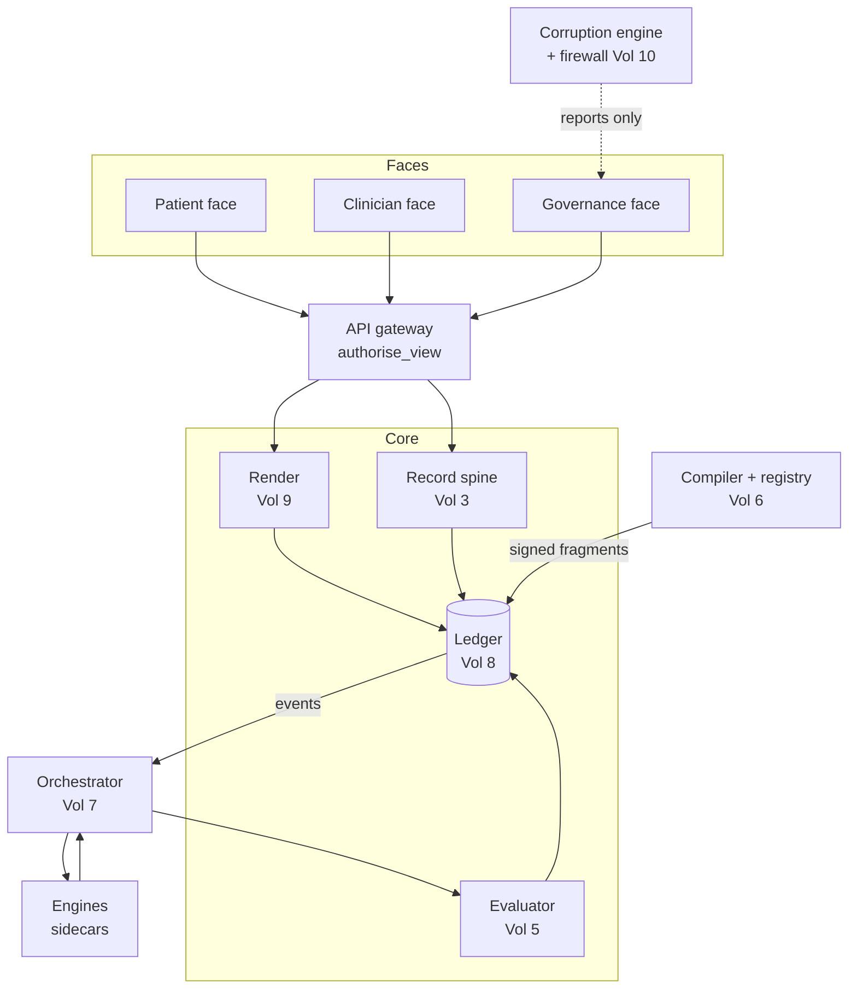

Data flow in one sentence: a write to the spine emits an event; the orchestrator gathers typed signals and pinned knowledge, calls engines for drafts, passes each draft to the evaluator, and appends the attempt and argument to the ledger; faces read arguments only through the gateway's authorisation function and the render layer.

### 1.6 Law to enforcement point

| Law | Enforcement point | Proof |
| --- | --- | --- |
| 1 One record, three faces | Ledger DDL, RLS policies (8.1, 8.3) | LED-03, LED-04 |
| 2 Argument is the unit | Orchestrator accepts only `ArgumentDraft`; faces read only `actual_argument` | ENG-02, single-gate negatives (5.6) |
| 3 Typed, non-coercible uncertainty | `Fixed6` and signal types with no cross-kind ops (4.3, 4.7) | Compile-fail tests ARG-01..03 |
| 4 Only arithmetic releases | Evaluator crate; verdict-class cap (5.4) | Check catalogue V-00..V-04, C-17 |
| 5 Every input pinned | `attempt.pins` NOT NULL; completeness check on pins | LED-06, LED-07 |
| 6 Compiler is the only door | `GRANT INSERT ON pin_registry, generic_argument TO compiler` only | Gate fixtures (6.3) |
| 7 Engines are pure | seccomp profile; two-process harness | PUR-01..06, ENG-03 |
| 8 Rendering cannot change meaning | Render-invariance property (9.3); class-U compiler gate | REN-01, REN-02 |
| 9 Attention is budgeted | Brief algorithm and suppression record (9.5, 9.6) | REN-05, REN-07 |
| 10 Evaluation is firewalled | Zone label on artefacts; compiler gate 1 rejects evaluation-zone provenance | ADV-02 |

## Volume 1A — Moonshot to build: functional deliverables

This volume converts the moonshot concept, section by section, into build instructions. Each of its sections corresponds to one section of that document: the premise becomes a measurable coverage requirement; the capability catalogue becomes eighteen services with one output contract; the runtime operations become seventeen event-driven operations with triggers, engines, verdict classes and budgets; the five settings become profile fragments; the architecture layers become crates; the benefits become instrumented measures; the three gates become build requirements with tests; the horizon becomes verifiable milestones. Where the concept's language predates the gate rules of Volumes 4 and 5, the gate rules govern and the ruling is stated at the item.

### 1A.1 The premise as a requirement: measure the uncoded fraction

The premise is that the decisive facts live in free text. The build turns that into a number the platform reports about itself: for every clinical fact type, the share of facts in the record that exist only in narrative (no coded resource carries them). This is the coverage gap; the language engine's job is to close it, and the governance face publishes it.

```rust
/// The one contract every layer above the fact graph reasons over.
/// A fact without all of these fields cannot be written (type-enforced).
pub struct Fact {
    pub fact_id: Sha256,
    pub patient_id: Uuid,
    pub subject: Code,                 // pinned edition
    pub predicate: Predicate,          // closed register (has_finding, prescribed, measured, treats, indicates, caused, contraindicates, ...)
    pub object: FactValue,             // Code | Quantity | Text | Reference
    pub assertion: Assertion,          // Present | Absent | Possible | Hypothetical | Historical | FamilyMember
    pub effective: TimeAnchor,         // onset, duration, sequence index, recency; each Option but at least one Some
    pub source: SourceSpan,            // document version + byte range
    pub extractor: Pin,                // model or human (author principal as pin)
    pub reliability: Reliability,      // Volume 4 signal; never a bare float
    pub consent: ConsentRef,
}
```

| Measure | Definition | Where published |
| --- | --- | --- |
| Coverage gap (per fact type) | facts with `source` in narrative and no coded resource for the same (subject, predicate, effective) / all facts of that type | Governance face, monthly, MeasureReport |
| Narrative yield | facts extracted per 1,000 words of signed notes, by document type | Same |
| Confirmation rate | extracted facts confirmed by clinician act / extracted facts shown | Same; feeds the feedback overlay (Volume 6.8) |

Tests: PRE-01 a `Fact` literal missing `assertion` does not compile · PRE-02 a fact with `assertion = Absent` is excluded from risk-engine inputs and recall eligibility (query test) · PRE-03 coverage gap computed identically on replay.

### 1A.2 The capability catalogue as services

Each capability is a service crate under `sidecars/language/` (class-2 models) or `crates/` (deterministic), bound by the engine contract of Volume 7.1. Every service emits `Fact` rows or `ArgumentDraft`s and nothing else. The verdict class column fixes what each output may become: a class-2 output reaches a person only as flagged or via a queue; a class-3 output only via a queue.

| # | Capability | Service and class | Input | Output contract | Acceptance test |
| --- | --- | --- | --- | --- | --- |
| 1 | Clinical entity recognition | `lang-ner` (class 2) | Document text with span index | Candidate mentions with span, entity type, reliability | NER-01 F1 ≥ declared on held-out practice notes by document type; per-subgroup report in pin |
| 2 | Assertion status | `lang-assert` (class 2) | Mention + context window | `Assertion` enum per mention with reliability | AST-01 "no chest pain" → Absent; "mother had breast cancer" → FamilyMember; both excluded from present-problem queries |
| 3 | Relation extraction | `lang-rel` (class 2) | Mentions in a document | Typed relations (drug–dose, drug–route, drug–frequency, finding–site, test–value, condition–treatment, symptom–duration) with spans | REL-01 "metformin 500 mg bd" → three relations; structured dose equals parser output |
| 4 | Terminology mapping and entity resolution | `lang-map` (class 2) + `terminology` (class 1) | Mention, candidate codes | `Code` in pinned edition, tier of binding, reliability; same-concept resolution across documents to one subject | MAP-01 tier-3 binding caps downstream draft at flagged; MAP-02 two documents' mentions resolve to one subject id |
| 5 | Temporal extraction | `lang-time` (class 2) | Mention, document date, context | `TimeAnchor` (onset, duration, sequence, recency) | TIME-01 "for the past 3 weeks" on a note dated D → onset D−21d ± declared tolerance |
| 6 | Document classification and routing | `lang-classify` (class 2) + routing rules (class 1) | Document bytes/text | Document type code with reliability; routing target from rule fragment | CLS-01 discharge summary classified and routed to reconciliation queue; low reliability → human classification queue |
| 7 | Clinical phenotyping | `phenotype` (class 1 over facts) | Phenotype definition fragment (codes + fact predicates + temporal constraints) | Cohort membership with the facts that satisfied it | PHE-01 definition using an Absent fact never matches; PHE-02 membership replayable |
| 8 | Risk stratification | `risk-*` engines (class 2, conformal-wrapped) | Fact graph snapshot | `ArgumentDraft` claim type risk with posterior, coverage, ignorance, backing = model pin validation | RISK-01 output never exceeds flagged; RISK-02 evidence list equals facts consumed |
| 9 | Adverse-event and safety-signal detection | `lang-ae` (class 2) | Notes, letters, messages | Facts with predicate `adverse_reaction_to` / `complication_of` + draft argument claim type safety-signal | AE-01 detected reaction becomes flagged ground on next prescribing check of that class |
| 10 | Social determinants extraction | `lang-sdoh` (class 2) | Narrative, patient messages | Facts with SDOH codes, assertion, reliability | SDOH-01 fact shown "from note" until confirmed; excluded from measures below floor |
| 11 | Patient-voice and sentiment | `lang-voice` (class 2) | Patient messages, questionnaires, transcripts | Facts: distress score (membership on pinned codebook), priorities, tone; never a diagnosis | VOICE-01 output routes to triage lane only; cannot create a condition fact |
| 12 | Summarisation | `gen-summary` (class 3, bounded loop) | Fact graph + source documents | Draft Composition with citation to a fact per sentence | SUM-01 sentence without a fact citation fails the fidelity tester; SUM-02 three failures → no draft |
| 13 | Question answering over the record | `gen-qa` (class 3, bounded loop) + `facts` search (class 1) | Question, patient id | Answer text + the fact(s) and source passages; empty answer when no fact matches | QA-01 answer cites facts only; QA-02 "last eGFR" returns the observation version and span |
| 14 | De-identification | `deid` (class 2 for text, class 1 for structured) | Text, tables, FHIR, PDF, DICOM, images | Redacted copy with per-identifier reliability; structured fields by type construction | DEID-01 export type cannot hold identifier fields; DEID-02 residual identifier rate on adjudicated set below declared |
| 15 | Trial and pathway matching | `match` (class 1 over facts against fragment criteria) | Eligibility fragment (compiled), fact graph | Draft argument claim type eligibility with fit signal and rebuttals = unmet criteria | MATCH-01 unknown criterion → Fit Unknown → flagged, never released |
| 16 | Multimodal ingestion | `inbound` OCR/layout (class 2), waveform promotion (class 1 rules) | Scans, faxes, images, device streams | Text with layout blocks and reliability; promoted Observations | MM-01 OCR block below reliability floor excluded from facts; MM-02 promotion rule replayable |
| 17 | Domain packs | Configuration of 1–16 by locale/specialty fragments (class K) | Pack manifest | Swapped vocabularies, abbreviations, codebooks by pin, no retraining | PACK-01 switching pack changes only pins K/I; engine pins unchanged |
| 18 | Workflow embedding | `orchestrator` + faces (Volumes 7, 9) | Released/flagged arguments | Rendered within budget; act recorded | WF-01 every rendered item has an argument id and attempt id in its response headers |

### 1A.3 Runtime operations as event-driven specifications

The concept states that the platform runs continuously: every new document, message, result or transcript is an event; each event triggers extraction, updates the fact graph, re-scores risk and fires the workflow the change warrants. The build implements that as subscriptions on the event stream (Volume 3A.1) feeding the orchestrator (Volume 7), with every output passing the evaluator (Volume 5) before any face shows it.

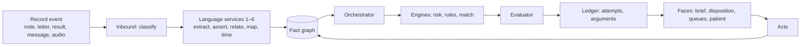

| # | Operation | Trigger (event filter) | Engine(s) and class | Output | Verdict ceiling | Budget | Test |
| --- | --- | --- | --- | --- | --- | --- | --- |
| 1 | Record pre-read and brief | Appointment booked; nightly for next day; arrival | `gen-summary` (3) over facts; brief assembler (1) | Brief of released arguments + summary draft as a queued item | Brief: released only; summary: queue | Under 3 s at arrival | OP-01 brief contains no held/flagged content; summary draft cites a fact per sentence |
| 2 | Ambient transcription and live extraction | Consultation start; audio chunks | ASR (2), services 1–5 (2) | Facts marked `draft-session`, excluded from grounds until note signed | n/a (facts only) | Facts within 2 s of utterance | OP-02 session facts never enter an evaluator request before sign |
| 3 | Working differential and next-best-question | New session fact | Bayesian differential (2, conformal-wrapped); EIG ordering (Volume 7.4) | Draft argument claim type differential + ordered questions | Flagged; shown as "consider" with rebuttals; never plain advice (ruling D-09) | Under 500 ms per update | OP-03 class-2 cap enforced; question list is an argument with an attempt |
| 4 | Prescribing check | Medication mentioned (session fact) or ordered | Rule engine (1) over reconciled list + medicines fragment | Attempt on the order's Checked stage | Released/flagged/held per loss matrix; hard stop on contraindication | Under 200 ms | MED-04, RX-02 |
| 5 | Order rationalisation | Test ordered | Rule engine (1): existing result within interval, guideline interval, cost-aware alternative from fragment | Rebuttals on the order's Checked attempt | Flagged when rebuttal fires | Under 200 ms | ORD-02 |
| 6 | Inline record Q&A | Clinician asks | `facts` search (1) + `gen-qa` (3) | Answer + fact ids + passages; empty when no fact | Queue-class; displayed as answer with citations, no action attached | Under 2 s | QA-01, QA-02 |
| 7 | Note, orders, letters and patient summary drafting | Consultation ends | `gen-summary` (3); order builder (1) from signed facts only | Draft Composition, draft orders, draft letters, patient-register summary; all unsigned | Queue-class; sign-off act required for each | Under 10 s | OP-07 drafts unsigned; patient summary invisible to patient until sign-off |
| 8 | Post-signature re-extraction and coding | Note signed | Services 1–5 (2); coding proposals (Volume 12.3) | Facts replace session facts; coding-proposal arguments | Flagged; coder/clinician act | Under 5 s | OP-08 session facts superseded by signed-note facts; graph diff logged |
| 9 | Follow-up task generation | Signed plan contains future action (fact predicate `planned`) | Rule engine (1) | Task with owner, due date, linked fact | Released (class 1) | Under 1 s | OP-09 each planned fact yields exactly one task; task links span |
| 10 | Inbound document triage | Document arrives | Classify (2), services 1–6, routing rules (1) | Classified, summarised (queue), actions as Task proposals, routed by urgency | Summary queue-class; routing class 1 | Under 5 s | DOC-01, DOC-02 |
| 11 | Result reconciliation | Result arrives | Line matcher (1), trend (1), escalation rules (1) | Order state, cumulative update, escalation on critical lane | Released for matching; escalation argument class 1 | Under 5 s | RES-01, RES-03 |
| 12 | Message triage | Patient message arrives | `lang-voice` (2), red-flag rules (1) | Urgency and distress scores, lane assignment; suggested response as queue draft (3) | Lane by class-1 rule; suggested response queue-only | Under 2 s | COM-03; VOICE-01 |
| 13 | Continuous risk re-scoring | Any fact change for the patient (debounced 30 s) | `risk-*` (2, conformal) | Draft argument per engine with evidence = facts consumed | Flagged; alert content class by severity tier | Under 10 s from fact commit | RISK-01; OP-13 debounce yields one attempt per burst |
| 14 | Eligibility matching | Any fact change | `match` (1) against compiled criteria | Draft argument claim type eligibility | Released only when Fit In and all criteria met; else flagged | Under 10 s | MATCH-01 |
| 15 | Register and recall maintenance | Nightly; on phenotype fragment change | `phenotype` (1), recall rules (1) | Register membership rows; recalls created/closed | Released (class 1) | Full run under 30 min for 10,000 patients | PHE-01; RC-03 |
| 16 | Quality and safety analytics | Nightly; on demand | Views and Measures (1) | MeasureReports; safety-signal aggregates; equity views | n/a (reports) | Under 2 s per query | QM-01; RPT-03 |
| 17 | De-identified export | Scheduled or requested | `deid` (2/1) with consent check (1) | Dataset with manifest | n/a | Batch | DEID-01; QM-03 |

**Lifecycle sequences.** The four phases of the concept map to these operations: before the encounter = 1; during = 2, 3, 4, 5, 6; after = 7, 8, 9; between = 10, 11, 12, 13, 14; population = 15, 16, 17.

```mermaid
sequenceDiagram
  participant P as Patient/portal
  participant S as Spine
  participant O as Orchestrator
  participant E as Evaluator
  participant C as Clinician face
  Note over S,C: Before
  S->>O: appointment booked event
  O->>E: brief items (released only)
  E-->>C: brief within budget
  Note over S,C: During
  C->>S: audio chunks
  S->>O: session facts
  O->>E: differential draft (class 2)
  E-->>C: flagged "consider" + next question
  C->>S: medication mentioned
  S->>O: prescribing check request
  O->>E: attempt
  E-->>C: released / flagged / held
  Note over S,C: After
  C->>S: sign note (act)
  S->>O: signed-note event
  O->>S: facts superseded; coding proposals; tasks
  O->>E: patient summary draft (class 3)
  E-->>C: queue for sign-off
  C->>S: sign-off act
  S-->>P: patient-register summary
```

Rulings applied from the corpus: the "live differential" is delivered as a flagged argument with rebuttals and a next-question list, never as released advice (D-09); "confidence" in the concept is always one of the six typed signals; a large language model contributes only through the bounded loop and only to queue-class outputs; alert thresholds are the attention budget and suppression policy of Volume 9.6, not per-feature settings.

### 1A.4 Workflows by setting as profile fragments

One platform, one graph, five front doors: each setting is a signed profile fragment (class P) that the evaluator context carries. A profile selects which operations run, which claim types the role may receive, the scope and formulary, the attention budget, and the escalation target. Nothing about a setting is code.

```rust
pub struct SettingProfile {
    pub pin: Pin,
    pub setting: Setting,                       // GeneralPractice | NursePrescriber | PharmacistPrescriber | Telehealth | HospitalInHome
    pub operations_enabled: BTreeSet<OperationId>,   // subset of 1A.3 #1..#17
    pub claim_types_receivable: BTreeSet<ClaimType>,
    pub scope: Option<ScopeFragment>,           // formulary, protocols, red-flag rules (prescriber settings)
    pub attention_budget: AttentionBudget,      // Volume 9.6 per content class
    pub escalation: EscalationTarget,           // role + channel + what context travels
    pub loss_matrix_overrides: BTreeMap<ClaimType, Pin>,   // ratified per setting
}
```

| Setting | Operations weighted (1A.3) | Scope fragment contents | Distinctive deliverable (build item) | Escalation | Tests |
| --- | --- | --- | --- | --- | --- |
| General practice | All 17 | none (full scope by registration) | Full lifecycle: brief → session → drafts → coding → tasks; chronic-disease review list = phenotype registers × care-plan due items; correspondence as extracted actions | n/a | SET-GP-01 every operation reachable; review list matches register × due query |
| Nurse prescriber | 1, 2, 4, 5, 9, 10, 11, 13, 15 | Formulary (medicines subset by pin), protocol pathways (titration schedules, wound care, contraceptive initiation) as executable fragments, out-of-scope predicates | Live protocol checklist: pathway fragment rendered with the patient's facts filled; step state machine per protocol; escalation packet = brief + facts + open attempt | GP with full context packet; same graph, no re-telling | SET-NP-01 medication outside formulary → held; SET-NP-02 out-of-scope predicate fires → escalation packet created with argument ids |
| Pharmacist prescriber | 1, 4, 6, 8, 10, 11, 13, 15 | Minor-ailment protocols, repeat-management rules, red-flag routing, formulary | Reconciled medication history across GP notes, discharge, dispense records and patient account (3A.4 C3) with discrepancy rows; medication review draft with recommendations as arguments citing evidence; deprescribing candidates from `lang-ae` signals | GP or emergency by red-flag rule | SET-PP-01 review draft recommendations each carry backing pin; SET-PP-02 red flag routes and blocks prescribing |
| Telehealth | 1, 2, 3, 6, 12, 13 | No-examination rule set: red-flag weights raised; question-first protocol | Brief within 3 s of booking for an unfamiliar patient; message queue ordered by urgency and distress; hand-back packet: what was asked and answered (facts with spans) + open items | Usual provider via hand-back packet | SET-TH-01 brief ready before session join; SET-TH-02 hand-back packet contains every session fact and its answer |
| Hospital in the home | 1, 2, 7, 9, 10, 11, 13, 16 | Deterioration, sepsis, readmission engines enabled; device promotion rules; visit-plan generator | Daily risk trajectory (attempt per re-score, plotted from ledger); next-day visit plan as tasks; daily physician summary draft (queue); "no longer fits home care" argument (flagged, severity tier 1); structured discharge-to-GP handover = episode summary + extracted actions | Supervising physician; GP at discharge | SET-HH-01 re-score after every contact within 10 s; SET-HH-02 handover document cites facts and tasks; SET-HH-03 trajectory replayable from attempts |

The context packet that travels on escalation is the same object in every setting: the consult-prep brief as of now, the session facts, every open attempt with its verdict, and the acts taken; it is a signed bundle with pins, so the receiving clinician reads the argument, not a phone summary.

### 1A.5 Architecture layers as crates and contracts

The concept's layers map one-to-one onto the workspace of Volume 3A.1. The single contract between layers is the `Fact` type of 1A.1; everything above the fact graph reads only facts, and everything reaching a person passes the evaluator.

| Concept layer | Build location | Contract in | Contract out |
| --- | --- | --- | --- |
| Ingestion | `inbound`, `events`, device gateways, ASR sidecar | Bytes, messages, streams with channel provenance | Stored original (content-addressed) + event |
| Language engine | `sidecars/language/*` (services 1–6, 9–12, 14, 16) | Document version + span index | `Fact` rows with reliability; drafts only via bounded loop |
| Longitudinal fact graph | `facts` (per-patient in-memory graph, persisted as `fact` + `fact_disagreement`) | `Fact` | Graph queries (by subject, predicate, time window, assertion); disagreement rows |
| Knowledge | `terminology`, compiler and registry (Volume 6) | Guidelines, thresholds, codebooks, evidence, packs | Signed fragments by pin |
| Reasoning | `orchestrator` + engines (Volume 7) | Facts + pinned knowledge + context | `ArgumentDraft` |
| Workflow | `evaluator` (Volume 5), `render`, attention layer (Volume 9), `recalls`, Task generation | Drafts | Attempts, arguments, tasks, communications |
| Clinician and patient surfaces | `faces/`, `portal-api`, `telehealth` | Authorised reads | Acts |
| Population and research | `deid`, `reporting`, evaluation zone (Volume 10) | Facts + consent | De-identified datasets, MeasureReports, model evaluation reports |
| Cross-cutting audit, identity, consent | `api-gateway` (ABAC, AuditEvent per request), `Consent` resources | Every request | Audit rows; consent gates evaluated per request |

The locale and specialty packs of the concept are pins K and I only: a pack manifest lists vocabulary overlays, abbreviation tables, codebooks and guideline fragments; switching packs changes no engine weights, so the purity harness results for the engines remain valid.

Tests: ARCH-01 a language service that attempts to write a resource other than `fact` fails the scope test · ARCH-02 a workflow-layer component that reads a draft (not an attempt) does not compile (type-state) · ARCH-03 pack switch changes only pins K and I in the next attempt.

### 1A.6 Translatable benefits as instrumented measures

Each benefit in the concept names a mechanism and a measurement. The build ships the measurement as a Measure resource (Volume 3A.10) computed from ledger events, so the benefit is a number on the governance face from day one, with a baseline captured at cut-over.

| Benefit | Mechanism (build items) | Measure definition (numerator / denominator, source events) | Baseline | Cadence |
| --- | --- | --- | --- | --- |
| Less documentation time per consultation | Ambient capture (op 2), drafting (op 7), coding (op 8) | Minutes between encounter finish and note sign act / encounters; after-hours sign acts / all sign acts | Migration month | Weekly |
| Fewer missed follow-ups | Task generation (op 9), result reconciliation (op 11), recalls from narrative (op 15) | Open-loop rate: orders past expected window without result act / orders; median time from result event to action act | Migration month | Weekly |
| Safer prescribing | Prescribing check on reconciled list (op 4) | Held and flagged prescribing attempts with override / all; adverse-reaction facts detected per 1,000 prescriptions | First quarter | Monthly |
| Earlier detection of deterioration | Continuous re-scoring (op 13), HITH engines | Lead time: first flagged deterioration attempt to escalation act; unplanned admissions per episode | First quarter | Monthly |
| Complete registers and quality data | Phenotyping (op 15) | Register completeness: narrative-plus-code members / manual-audit sample members; coverage gap (1A.1) | Audit sample at cut-over | Monthly |
| Better use of advanced-practice prescribers | Setting profiles (1A.4) | Encounters completed within scope / encounters in prescriber settings; escalation packets with full context / escalations | First quarter | Monthly |
| Grounded telehealth and locum care | Brief (op 1), record Q&A (op 6) | Brief delivered before session join / sessions; re-contact within 72 h / sessions; clinician-rated preparedness (questionnaire) | First quarter | Monthly |
| Equity visibility | SDOH extraction (capability 10) | Outcome measures stratified by SDOH fact presence, with imprecise-Dirichlet intervals | First quarter | Quarterly |

Every measure is replayable (same period, same pins → identical MeasureReport hash) and every figure carries lineage to events (RPT-03).

### 1A.7 The three gates as build requirements

The concept states the gates once; the build states them as requirements with owners and tests. They are the same three assets Volumes 5, 6 and 10 already specify, listed here against the concept's wording.

| Gate | Concept requirement | Build requirement | Enforcement | Tests |
| --- | --- | --- | --- | --- |
| Evidence linkage | Every recommendation, score and draft carries its source passage and its guideline clause or study | Every `Fact` has `SourceSpan`; every `ArgumentDraft` has `grounds` with spans and `backing` with citation pins; evidence library pinned (Volume 6.6); compiler gate 7 pins citations | Type system; completeness checks C-07, C-09 | ARG-05; KP-02; SUM-01 |
| Evaluation | Each model measured on the population it serves against clinician-adjudicated truth before go-live and continuously; reported by role, setting, subgroup; drift monitored; degraded engines retired automatically | Class-2 pin carries validation report (dataset hash, n, sensitivity, specificity, calibration, coverage) by subgroup; evaluation zone runs adjudicated sets (Volume 10.3); drift monitor = rolling conformal coverage and calibration per engine; breach → engine pin retired (registry flag) and its claim types fall back to class-1 only | Pin registry `retired`; orchestrator refuses retired pins | ENG-01; ADV-05; EVAL-01 conformal coverage below declared for 7 days → pin retired; EVAL-02 subgroup report missing → registration refused |
| Governance | Clinical ownership of every rule, threshold and pathway with named reviewers and version history; consent gates every use; audit reconstructs any decision; access mirrors scope; alert thresholds tuned per setting with fatigue measured; safety case per capability | Fragments carry owner and ratifier signatures (gate 11); consent evaluated per request; replay (Volume 8.6); ABAC by profile; suppression policy and counts (Volume 9.6); obligations register with safety case artefacts per capability (Volume 10.8) | Compiler; gateway; ledger | KP-07; XC-03; LED-06; REN-05; ADV-06 |

### 1A.8 The horizon as verifiable milestones

The five-year picture becomes a set of states the ledger can prove. Each is a MeasureReport with a threshold; reaching it is a governance act, not a claim.

| Horizon statement | Verifiable state | Measure and threshold |
| --- | --- | --- |
| No clinician opens a consultation unprepared | Brief delivered before every session, every setting | Brief-before-session rate ≥ 99% over a quarter |
| No fact written in prose is lost | Coverage gap closed for core fact types | Coverage gap ≤ 2% for problems, medications, allergies, results-follow-ups |
| Every prescription checked against the whole medication story | Check uses reconciled list with zero unresolved discrepancies at sign | Prescriptions signed with unresolved discrepancy = 0; discrepancy median age < 24 h |
| Every result, letter and message read and actioned before a human sees it, in the right order | Inbound items triaged and routed under budget; queues ordered by urgency | Triage under 5 s p95; unactioned age p95 < configured; zero unrouted items > 24 h |
| Deterioration detected across contacts as one trajectory | Re-score after every fact change; trajectory reconstructable | Re-score latency p95 < 10 s; replay of trajectory identical |
| Advanced-practice prescribers at top of scope with context, not calls | Escalation packets carry full context | Escalations with packet = 100%; within-scope completion rate tracked |
| Hospital in the home supervised like a ward | HITH engines live with daily trajectory and handover | Handover documents with extracted actions = 100% of discharges |
| Patients receive their plan in their own words | Patient-register summary signed and delivered | Delivery within 24 h of sign-off ≥ 95% |
| Primary care as a complete longitudinal dataset | De-identified export complete and consent-respecting | Export fact count / ledger fact count for consented patients ≥ 99%; zero identifier residuals on audit sample |
| Guidelines measured against practice, practice against outcomes, evidence loop closed | Adherence measures per fragment; feedback overlay pinned | Every release-capable fragment has an adherence MeasureReport per quarter; overlay pin present in every attempt |

Build order follows Volume 11.5; the milestones above are the exit criteria for the programme as a whole, checked by the governance face against the ledger, not by narrative.

## Volume 2 — The three faces

The patient, clinician and governance portals are three authorised projections of one ledger, each with its own identity provider, its own register, and its own rule for which argument states it may read. They share no application state; a face is a stateless renderer over authorised reads and a submitter of signed acts.

### 2.1 The authorisation rule

Every read of an argument passes a single function before rendering. The function takes the requesting principal, the argument's current state, and whether a sign-off act exists for it, and returns one of three outcomes: render, refuse with a not-found response, or refuse with a forbidden response. The choice between not-found and forbidden is deliberate. A held argument is invisible to every face (not-found), because acknowledging its existence would itself leak an unreleased inference. A flagged argument is forbidden to the patient face but visible, with its flag reasons, to the clinician and governance faces. A released argument is visible to the clinician and governance faces immediately and to the patient face only after a clinician's sign-off act has been appended to the ledger.

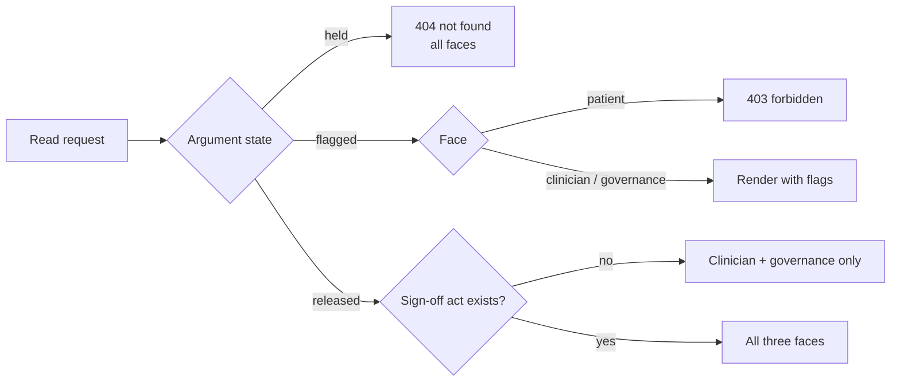

The function is implemented once, in the core, and exposed to faces only through the read API; a face cannot bypass it because the storage layer's row-level policy enforces the same rule a second time (Volume 8).

### 2.2 The patient face

The patient face exists to close loops the evidence says matter: medication adherence, results acknowledgement, pre-visit intake, and post-visit plans. Every item it shows is a released, signed argument rendered in the patient register, so the patient reads the same claim the clinician released, the same qualifier signals in plain words, and the same rebuttals, phrased for a lay reader. The face never generates content of its own; a patient-facing summary is an engine output that has passed the gate like any other.

The face collects three kinds of input and treats each as data with provenance. Pre-intake answers, whether typed or gathered by a conversational agent, are stored as questionnaire responses with the span of dialogue each answer came from; they become grounds for the pre-intake argument and nothing else. Consent decisions are stored as consent resources that later evaluations must respect as inputs. Patient-reported outcomes and measurements from home devices are observations with a device provenance and a reliability signal set from the device's declared accuracy, never assumed to be clinic-grade.

Engagement loops are themselves arguments. A reminder is released only if an argument whose claim is "this patient should be reminded of X" has passed the gate, which means the reminder logic is inspectable, versioned and replayable, and a regulator can ask why a given patient was or was not contacted.

### 2.3 The clinician face

The clinician face has one job: get the right argument in front of the clinician at the right moment within a budget of attention, and record what the clinician did with it as a signed act. Its main surfaces are the consult-prep brief, the in-encounter disposition line, the order and prescribing workspace, the inbound reconciliation queue, and the review queue for flagged items.

The consult-prep brief is assembled before the encounter from released arguments only, within a reading budget expressed in seconds at a declared reading speed. Items compete for the budget by a governed priority that weighs severity tier, time since last review, and whether the item changes an active plan; the suppression policy that decides what falls below the budget is versioned and every suppression is counted (Volume 9).

Every interaction is an act appended to the ledger: accept, reject with reason, defer, sign-off, override with reason, deviation from a released plan. Acts are the ground truth for the feedback overlay (Volume 6) and the outcome measures used in prospective studies (Volume 10). A clinician can always see the argument behind any rendered line, including its rebuttals and the pinned knowledge fragment it relied on, in two clicks.

### 2.4 The governance face

The governance face serves practice managers, clinical governance leads, auditors and regulators. It is read-mostly and query-shaped: its questions are counts, distributions and traces over the ledger for a time window, a cohort, a clinician, a knowledge fragment or a model pin.

Its standing surfaces are the sentinel-event board (every hard stop, every override of a flagged item, every deviation from a released plan, with the argument and its pins attached), the coverage declaration (what fraction of encounters received support, by pathway and by verdict, published on a fixed cadence), the prospective-study workbench (a registered question, a pre-declared analysis, a sealed envelope opened only after the window closes), the audit and quality-improvement register (each cycle a query with a baseline, an intervention pinned to a knowledge or policy version, and a re-measurement), and the obligations register (regulatory and licensing duties with the artefacts that discharge them).

The explainability offer is structural rather than narrative. For any decision the regulator can obtain the argument, its attempt record with the five-stage trace, the eight pins, the knowledge fragment's verification verdicts, and a replay that re-runs the evaluator on the same inputs and shows an identical result. A regulator bundle exports all of that for a window as a signed archive (Volume 10).

### 2.5 What the three faces share and what they do not

| Concern | Patient | Clinician | Governance |
| --- | --- | --- | --- |
| Identity provider | Consumer identity with proofing; delegate support for carers | Professional identity bound to a registration and a scope-of-practice profile | Organisational identity with role assertion; regulator identities federated |
| Readable states | Released and signed off | Released, flagged | Released, flagged, plus held via break-glass with audit |
| Register | Patient register | Clinician register | Regulator register |
| Writes | Questionnaire responses, consent, observations | Acts, orders, notes, sign-offs | Study registrations, audit cycles, obligation evidence |
| Latency budget for a page | Under 1 s from cached released projections | Under 3 s for the brief, under 200 ms for a prescribing check | Under 2 s for a cohort count over one year |

### 2.6 Face API surface

All three faces speak to one gateway; the face is an attribute of the principal's token, and each route lists the faces that may call it.

| Route | Faces | Reads / writes | Rule applied |
| --- | --- | --- | --- |
| `GET /arguments/{id}` | P, C, G | actual\_argument, acts, render | `authorise_view` then `render(register(face))` |
| `GET /patients/{id}/brief` | C | released + permitted flagged | Brief algorithm (9.5) |
| `GET /patients/{id}/summary` | P | released + signed off | Patient register only |
| `POST /arguments/{id}/acts` | C, G | act | Kind restricted by face; `sign_off` C only; `break_glass` G only |
| `POST /patients/{id}/questionnaire` | P | QuestionnaireResponse with span links | Becomes grounds; never rendered as advice |
| `POST /patients/{id}/consent` | P, C | Consent | Input to evaluator context |
| `POST /patients/{id}/observations` | P | Observation with device provenance | Reliability from device declaration |
| `POST /orders` · `POST /orders/{id}/transition` | C | Order + transition act | State machine (3.3); `checked` calls evaluator |
| `GET /queues/{name}` | C, G | View over ledger | Queue definitions (10.5) |
| `GET /sentinel` · `GET /coverage` | G | Ledger queries | 10.6 |
| `POST /studies` · `POST /studies/{id}/open` | G | Sealed envelope | 10.4 |
| `GET /bundle?window=` | G | Signed archive | 10.7 |

Every response carries `X-Pins` (the pin set of what was rendered) and `X-Attempt` where an argument is involved, so a screenshot is traceable.

### 2.7 Act record

```rust
pub struct Act {
    pub act_id: Sha256,                 // sha256(jcs(self without act_id, this_hash))
    pub argument_id: Option<Sha256>,    // None only for order transitions and break-glass
    pub patient_id: Uuid,
    pub principal: PrincipalRef,        // face, identity, registration, profile
    pub kind: ActKind,                  // Accept | Reject | Defer | SignOff | Override | Deviation | BreakGlass | OrderTransition
    pub reason: Option<ReasonCode>,     // required for Reject, Override, Deviation, BreakGlass
    pub payload: Option<serde_json::Value>,
    pub created_at: EffectiveTime,
}
// Invariants: SignOff only on state == Released; Override only on state == Flagged;
// Deviation names the released plan argument; BreakGlass requires reason and G face.
```

### 2.8 Identity binding

| Face | Token claims required | Verified against |
| --- | --- | --- |
| Patient | subject id, proofing level, delegate-of (optional) | Consumer identity provider; delegate link stored as a Consent |
| Clinician | subject id, registration number, profession, scope-of-practice profile id | Professional register lookup at login; profile id must exist in pin registry (class P) |
| Governance | subject id, organisation, role (manager, governance lead, auditor, regulator) | Organisational provider; regulator identities federated with issuer allow-list |

### 2.9 Acceptance tests

| Test | Given | Expect |
| --- | --- | --- |
| FACE-01 | Patient token calls `GET /patients/{id}/brief` | 403 |
| FACE-02 | Clinician posts `break_glass` act | 403; no act written |
| FACE-03 | `sign_off` posted on flagged argument | 409; invariant violation logged |
| FACE-04 | Questionnaire answer submitted | Stored with span links; no argument created until an engine drafts one |
| FACE-05 | Any argument response | `X-Pins` and `X-Attempt` headers present and resolvable |
| FACE-06 | Regulator token from issuer not on allow-list | 401 |

## Volume 2A — Three portals to build: functional deliverables

This volume converts the three-portals document, section by section, into build instructions. Volume 2 fixed the authorisation rule, the face API surface, the act record and identity binding; this volume specifies what each portal must do, function by function, with the resources, engines, state machines, measures and tests each function needs. Where the document's language predates the gate rules of Volumes 4 and 5, the gate rules govern and the ruling is stated at the item.

### 2A.0 One graph, three apertures

An aperture is a signed configuration, not a codebase: the identity provider, the attribute policy, the register, the readable argument states, the write set, and the vocabulary pack. All three portals are thin clients of the same gateway.

```rust
pub struct Aperture {
    pub pin: Pin,
    pub face: Face,                          // Patient | Clinician | Governance
    pub identity_provider: IdpRef,
    pub policy: AbacPolicyRef,               // compiled also to RLS (Volume 8.3)
    pub register: Register,                  // Volume 9.2
    pub readable_states: BTreeSet<State>,    // Volume 2.1 rule
    pub write_set: BTreeSet<ResourceType>,   // what this face may create
    pub act_kinds: BTreeSet<ActKind>,
    pub deidentified_default: bool,          // true for Governance
    pub reidentify_authority: Option<AuthorityRule>,   // Governance only: recorded authority act required
}
```

| Portal | Identity | Write set | Act kinds | Default view |
| --- | --- | --- | --- | --- |
| Patient | Consumer identity with proofing; carer delegation via RelatedPerson scope | QuestionnaireResponse, Observation (patient-reported, device), Consent, Goal, Communication (to practice) | none (patient inputs are resources, not acts) | Own record, released and signed-off arguments, patient register |
| Clinician | Professional identity; registration; scope profile | Composition, Condition, AllergyIntolerance, MedicationRequest, ServiceRequest, CarePlan, Task, Communication, Reflection (2A.2) | accept, reject, defer, sign\_off, override, deviation, order\_transition | One patient's reasoning surface; released and flagged; clinician register |
| Governance | Organisational identity with role; regulator federated | Study registration (sealed envelope), audit cycle, obligation evidence, incident report, authority act | break\_glass, reidentify (with authority), study\_open, action\_close | De-identified aggregates; drill-through re-identifies only under recorded authority |

**The circulation loop as build flows.** The document's circulation (patient feeds the graph, clinician reasons, governance measures, findings flow back) is three concrete flows: patient inputs become `Fact` rows with `source = patient-reported`; clinician decisions become acts on arguments; governance findings become fragments through the compiler (thresholds, pathways, prompts) and engagement-loop definitions (2A.1), never direct edits. Tests: AP-01 a governance user without a recorded authority act sees no direct identifier in any response · AP-02 a threshold change from the governance face produces a compiler submission, not a configuration write · AP-03 a patient-reported fact carries `source = patient-reported` and is rendered with that label in the clinician register.

### 2A.1 The patient portal

**Agentic pre-intake (crate `portal-api`, agent under Volume 7.5 bounded loop)**

```mermaid
stateDiagram-v2
  [*] --> Seeded: appointment booked; record facts loaded
  Seeded --> Asking: next question from EIG ordering (Volume 7.4) filtered by already-documented facts
  Asking --> Answered: patient reply (own words stored + structured extraction)
  Answered --> Asking: follow-up rule (onset, character, severity, modifiers, concern)
  Answered --> Reconciling: medication dialogue reached
  Reconciling --> Screening: reconciled list captured incl. OTC and complementary
  Screening --> Social: validated instruments scored where presentation warrants
  Social --> Summarised: social context captured
  Summarised --> [*]: pre-intake facts written; red flags escalated
  Answered --> Escalated: red-flag rule fires
  Escalated --> Asking: escalation packet sent; intake continues
```

| Item | Specification |
| --- | --- |
| Seeding | Agent context = facts for the patient with `assertion = Present` and recency within pinned window; questions whose answer is already documented are excluded by rule (class 1), so the agent never asks what is known |
| Question source | Presentation template fragment (per reason-for-visit class) provides the question graph; EIG ordering picks the next question; the ordered list is itself an argument (Volume 7.4) |
| Language and reading level | Locale pack pin; patient register grade-8 rule; interpreter need from Patient preferences selects language pack |
| Own words | Every answer stored as QuestionnaireResponse item with the verbatim text and the extraction (`lang-*` services) with span link into the transcript; both retained |
| Medication reconciliation dialogue | Walks the current list line by line ("are you taking X, how"), adds OTC/complementary by free text → `lang-map`; discrepancies written as `fact_disagreement` rows with source = patient-reported |
| Validated instruments | Instrument fragments (items, scoring, cut-offs, licence class) as class K; scoring is class 1 and replayable; score stored as Observation with instrument pin |
| Social context | SDOH items (transport, work, carers, cost pressure, housing) as Observations with SDOH codes; extracted from free text with reliability |
| Red flags | Red-flag rule fragment evaluated on every answer (class 1); fires → critical-lane event + escalation packet to practice queue before the appointment; the agent tells the patient what happens next in plain words |
| Output | Pre-intake summary as facts tagged patient-reported plus a Composition (draft, class 3) citing each fact; the summary is a queued item for the clinician, never advice to the patient |
| Bounds | Agent scope token can write only QuestionnaireResponse and Observation(patient-reported); no tool can read another patient; conversation length and token budget from policy pin |
| Tests | PI-01 question already answered by a documented fact is never asked · PI-02 red-flag answer produces critical-lane event within 100 ms and a packet in the practice queue · PI-03 OTC product named in free text becomes a mapped medication statement with reliability · PI-04 agent token attempting to write a Condition → 403 · PI-05 verbatim text and extraction both retrievable with span link |

**Ongoing engagement between visits (crate `portal-api`, module `loops`)**

```rust
pub struct EngagementLoop {            // compiled fragment (class R); one per loop type per pathway
    pub pin: Pin,
    pub kind: LoopKind,                // PlanDelivery | Comprehension | SymptomCheckIn | DeviceCheckIn | MedicationStart | PostDischarge | Prom | Preferences | Screening
    pub trigger: EventPattern,         // e.g. sign_off of plan; MedicationRequest signed; discharge summary filed
    pub schedule: Schedule,            // intervals from CarePlan or fixed window (e.g. daily × 14 d)
    pub instrument: Option<Pin>,       // questionnaire / PROM fragment
    pub escalation: Vec<ThresholdRule>,// class-1 rules over answers/readings → lane + target
    pub endpoint: MeasureRef,          // what this loop is measured by (2A.1 loops table)
    pub consent_scope: ConsentScope,
}
```

| Function | Specification |
| --- | --- |
| Plan delivery | On sign-off act of a plan/summary: patient-register rendering delivered by consented channel; automated-message label mandatory (2A.1 consent) |
| Comprehension check | Questionnaire fragment (2–4 items) after plan delivery; failure → Task to clinician and a re-explanation draft (class 3, queue) |
| Grounded Q&A | `gen-qa` over the patient's own released facts and the guideline fragment the released argument cited; refuses questions outside that scope with a hand-off to a person |
| Symptom and device check-ins | Schedule from CarePlan activities or loop fragment; readings via device intake (3A.11 J3); answers as Observations; threshold rules escalate on critical lane with the clinician packet |
| Reminders and loop closure | Subscribes to result/referral/recall events: "result is back", "referral booked", "review due" messages generated from released arguments only |
| PROMs and PREMs | Instrument fragments at milestones defined in the pathway fragment; scores stored with instrument pin; feed the governance measures |
| Tests | LP-01 loop instance created on the trigger event with the schedule materialised · LP-02 escalation threshold breach → critical event + same-day booking task under 100 ms · LP-03 Q&A on a topic outside released facts → refusal with hand-off · LP-04 every outbound message carries the automated label |

**Health literacy and shared decision-making**

| Function | Specification |
| --- | --- |
| Recommendation unpack | Patient-register element map (Volume 9.2) renders the released argument as five fixed slots: what it is (claim), why it applies to you (grounds), what the evidence says (backing with grade in plain words), alternatives (co-applicable released arguments of the same claim type), what to watch for (rebuttals) |
| Decision aids | Generated from the patient's own calculator outputs (3A.3 B8) and the argument's coverage/ignorance signals, not population averages; rendered by a pinned template; a decision aid is a class-U render of released arguments, never new content |
| Preferences and goals | Goal resources and preference Observations written by the patient; surfaced in the brief and as grounds in eligibility and plan arguments |
| Tests | SDM-01 patient rendering carries every rebuttal of the argument (REN-02) · SDM-02 decision aid figures equal the patient's own calculator observation versions · SDM-03 a recorded goal appears in the next brief and in the grounds of the next plan argument |

**Consent, transparency and control**

| Function | Specification |
| --- | --- |
| Access report | From AuditEvent (3A.9 H2): who, when, purpose, in plain language, including agents and models |
| Sharing controls | Consent resources per service/organisation scope; evaluated per request by ABAC; withdrawal is an event |
| Research and trial contact opt-in | Consent scopes `secondary-use` and `contact-for-eligibility`; eligibility matching (1A.3 op 14) checks the scope before any contact |
| Automated-message labelling | Every Communication generated by a loop or agent carries `automated = true` and a reach-a-person route; template validation refuses a message without them |
| Tests | CT-01 access report lists a model inference with purpose · CT-02 withdrawal of `secondary-use` excludes the patient from the next extract (QM-03) · CT-03 template without automated label rejected at compile |

**Evidence-driven loops (the eight loops as build items)**

| Loop | Trigger | Patient action → resource | Escalation rule | Measured endpoint (Measure) |
| --- | --- | --- | --- | --- |
| Pre-intake | Appointment booked | Adaptive intake → QuestionnaireResponse, MedicationStatement, Observations | Red-flag fragment | Pre-intake completion rate; consultation minutes on history vs decision (from session facts timing) |
| Post-visit understanding | Plan sign-off | Comprehension check → QuestionnaireResponse | Fail → Task | Comprehension pass rate; re-contact within 7 d |
| Symptom and device check-ins | Plan activity schedule | Answers, readings → Observations | Threshold rules | Escalation lead time; unplanned presentations |
| Medication start and titration | MedicationRequest signed | Effect/side-effect reports at intervals → Observations, adverse-reaction facts | Adverse-reaction rule | Titration to target time; cessation for intolerance |
| Post-discharge | Discharge summary filed | Daily check-ins for window → Observations | Deterioration rule | 28-day readmission; escalation lead time |
| Outcome and experience | Pathway milestones | PROM/PREM → Observations with instrument pin | none | Score by pathway, clinician, cohort |
| Preferences and goals | Any time | Goal, preference Observations | none | Goals recorded / plans; goal-concordant decisions (act reason) |
| Screening and prevention | Eligibility event (3A.6 E2) | Response, booking → Appointment | none | Uptake by cohort and channel |

Each row is one `EngagementLoop` fragment and one Measure; governance reads loop performance by cohort (2A.3). Test LOOPS-01: every loop fragment names a Measure that exists and is replayable.

### 2A.2 The clinician portal

**How the record is enriched: three provenance classes**

The record the clinician opens carries facts from three sources, each with a provenance class the register must show and the evaluator must weigh through the reliability signal.

| Source | Written by | `Fact.extractor` | Reliability origin | Register label |
| --- | --- | --- | --- | --- |
| Language engine over notes, letters, results, discharge summaries | `lang-*` services (class 2) | Model pin | Model validation report (subgroup) | "from note" / "from letter" with span link |
| Agentic pre-intake | Pre-intake agent | Agent policy pin | Patient-reported floor per fact type | "patient-reported before visit" |
| Between-visit engagement | Loops, device intake | Loop pin / device pin | Device accuracy or patient-reported floor | "reported between visits" with date |

Tests: EN-01 the problem list query returns narrative-only problems labelled with their source and span · EN-02 a patient-reported medication discrepancy appears as a `fact_disagreement` row with both sources · EN-03 reliability of a patient-reported fact equals the pinned floor, never the model's.

**The pre-visit brief: field specification** (assembly and budget in Volume 9.5)

| Line type | Query | Source link | Order weight |
| --- | --- | --- | --- |
| Reason for visit in the patient's words | Latest pre-intake QuestionnaireResponse verbatim item | Response item | First, always |
| Active problems with last status and trend | Conditions active + last-status fact + trend of monitoring observation per problem (fragment maps problem → monitor code) | Condition version; observation series | Severity tier |
| Medications reconciled with discrepancies | Reconciled list (3A.4 C3) + open `fact_disagreement` rows | Each source line | Discrepancy first |
| Results since last visit, trended, out-of-range in context | Observations since last encounter with reference range, prior value, affecting medication (fragment) | Observation versions | Abnormal first |
| Open loops | Orders past window, referrals unacknowledged, care-plan items due, screening gaps | Order/referral/Task/recall ids | Overdue first |
| Pre-intake surfaced | Red flags, instrument scores, social context facts | Response items, Observations | Red flags first |
| What matters to the patient | Goal and preference resources | Goal ids | Always shown |

Test BR-01: every brief line resolves to a resource version or span; BR-02 the brief renders released arguments only (REN-05).

**Augmented reasoning in the consultation**

| Function | Engine and class | Output object | Display rule | Test |
| --- | --- | --- | --- | --- |
| Working differential, ranked and revised | Bayesian differential (2, conformal) over session + record facts | Draft argument per candidate: grounds = supporting facts; rebuttals = facts counting against; `absent_but_matters` = unmeasured discriminators (from EIG) | Flagged "consider" panel with discriminators listed explicitly; never a released diagnosis (D-09) | AR-01 each candidate lists supporting, against and absent-but-matters; AR-02 verdict never above flagged |
| Next-best questions or examinations | EIG ordering (Volume 7.4) over candidate unknowns with cost table | Ordered question argument (class 1 over class-2 posteriors; capped flagged) | Two or three items; refresh on new session fact under 500 ms | AR-03 list re-ranks on new fact; AR-04 budget-exhausted → abstain |
| Guideline pathway with patient values filled | Pathway fragment rendered with fact values by element map; fit engine (1) computes envelope attributes | Pathway render + Fit signal with divergence attributes (frailty, multimorbidity, preference) | Divergence attributes shown inline; out-of-envelope pathways flagged | AR-05 divergence attribute list equals fit engine attributes |
| Ask the record | `facts` search (1) + `gen-qa` (3) | Answer with fact ids and passages; empty when no fact | Side channel; no action attached | QA-01, QA-02 |
| Evidence thin or contested | Ignorance signal above ceiling or backing grade below floor or conflicting evidence records | "Evidence is thin/contested" badge with the studies (citation pins) | Shown on the argument, in all registers | AR-06 conflicting evidence records → badge and ConflictRecord |

**Prescribing and ordering support** — built in 3A.4 C1/C2 and 3A.5 D1; the portal surface additionally shows for prescriber settings: formulary-eligible options (filtered by scope fragment), protocol step (from the protocol state machine), monitoring due (rule fragment), and the escalation control that assembles the context packet (1A.4). Tests: RX-03, SET-NP-02.

**Documentation, coding and closing loops** — built as operations 7–10 of Volume 1A.3: drafts with per-statement traceability (each drafted sentence cites a session fact or record span; fidelity tester), coding proposals (Volume 12.3), tasks from planned facts, inbound pre-read into a review queue ordered by urgency. Test DOC-05: a drafted sentence without a citation fails the fidelity tester and the draft is withheld.

**Augmenting the clinician's knowledge over time (crate `faces/clinician`, module `learning`)**

```rust
pub struct Reflection {                 // written as an act kind `reflection`, private to the clinician
    pub encounter_id: Uuid,
    pub leading_differential: Vec<(Code, Fixed6)>,   // clinician's own ranking and stated confidence band
    pub chosen: Code,
    pub recorded_at: EffectiveTime,
}
// Outcome linkage: a later fact (final diagnosis, result, admission) matched by rule to the encounter within a window.
```

| Function | Specification | Privacy rule |
| --- | --- | --- |
| Reflection capture | Optional, one screen at note sign: differential, choice; stored as a private act | Readable only by the clinician; governance sees aggregates only under recorded authority |
| Personal calibration view | Per clinician: stated confidence band vs outcome frequency (fixed-point reliability diagram, imprecise-Dirichlet intervals); deviation acts with reason vs outcome; investigation rates per presentation vs peer-adjusted expectation | Own data only; no ranking against named peers |
| Evidence updates linked to own patients | Evidence library change event → phenotype match over the clinician's active patients → notification listing affected patients with the fragment diff | Consent scope for evidence contact not required (internal) |
| CPD from practice | Export of reflections, calibration summary and evidence reviews as a signed portfolio document (class U template) | Clinician-initiated only |
| Tests | LRN-01 reflection act invisible to other clinicians and to governance without authority · LRN-02 calibration intervals computed with the pinned prior strength · LRN-03 evidence update notification lists only the clinician's own matched patients |  |

**How the enriched record returns to the patient** — released arguments carry grounds, so the patient register can explain them (2A.1); plans are CarePlan resources, so loops can follow them; outcomes are Observations with instrument pins, so the next argument's grounds include them. Test RT-01: a plan signed in the clinician portal produces a loop instance and a patient-register rendering within 100 ms of the sign-off event.

**Clinician need table as build items**

| Clinician need | Build item | Grounding enforced by | Test |
| --- | --- | --- | --- |
| Know the patient before the door opens | Brief (field spec above; assembly Volume 9.5) | Every line resolves to a version or span | BR-01 |
| Reason well under time pressure | Differential + discriminators + next-best question | Grounds/rebuttals are facts; backing is evidence pins | AR-01..04 |
| Prescribe safely | Prescribing check on reconciled list | Medicines fragment + patient observations in request | MED-04, RX-02 |
| Follow the guideline where it fits, deviate where it should | Pathway render + fit attributes; deviation act with reason | Envelope from fragment; reason code required | AR-05, FACE-03 |
| Document without typing | Drafts with per-sentence citation | Fidelity tester | DOC-05 |
| Never lose a follow-up | Tasks from planned facts; inbox by urgency | Planned fact predicate; triage lanes | OP-09, RES-03 |
| Get better at the job | Reflection, calibration, evidence updates, CPD export | Private acts; pinned intervals | LRN-01..03 |

### 2A.3 The governance portal

**Measurement: the enduring point of record**

The document's decision event (who, when, what was shown, on what evidence, what the clinician did, what happened next) is not a new table; it is a join the ledger already supports. The build ships it as one declarative view so every governance function reads the same object.

```sql
CREATE VIEW decision_event AS
SELECT a.argument_id, a.patient_id, a.encounter_id, a.state, a.verdict_class,
       t.attempt_id, t.verdict, t.trace, t.pins, t.effective_time,
       r.rendered_at, r.register, r.principal AS shown_to,          -- from AuditEvent (render)
       act.kind AS clinician_act, act.reason, act.principal AS actor, act.created_at AS acted_at,
       o.outcome_fact_id, o.outcome_code, o.outcome_at                -- outcome linkage rule (window per claim type)
FROM actual_argument a
JOIN attempt t ON t.attempt_id = a.attempt_id
LEFT JOIN audit_render r ON r.argument_id = a.argument_id
LEFT JOIN act ON act.argument_id = a.argument_id
LEFT JOIN outcome_link o ON o.argument_id = a.argument_id;
```

`outcome_link` is materialised by a class-1 rule fragment per claim type (e.g. prescribing → adverse-reaction fact or cessation within 90 d; differential → confirmed diagnosis fact within 180 d; deterioration → admission within 7 d). Quality indicators are Measures over `decision_event` and facts, so the denominator is every patient with a matching fact (narrative included) and the numerator is acts and outcomes. Tests: PR-01 every row of `decision_event` resolves to pins and spans · PR-02 an indicator computed from narrative-only facts labels them and includes them (RPT-02).

**Risk analysis: surveillance signals (crate `reporting`, module `surveillance`)**

Each signal is a declarative view with a drill-through to cases; each case drills to its argument, attempt, pins and spans. Signals are evaluated nightly and on demand; a signal crossing its ratified threshold creates a governance queue item.

| Domain | Signal | Definition (over `decision_event`, facts, acts) | Drill |
| --- | --- | --- | --- |
| Prescribing | Interaction alerts overridden | override acts on prescribing arguments with fired interaction rebuttal / such arguments, by prescriber and class | cases |
| Prescribing | Dose outliers | MedicationRequest dose outside fragment range without override reason | cases |
| Prescribing | Monitoring not done | monitoring-due Task past due without result | cases |
| Prescribing | Unreported adverse events | adverse-reaction facts (from `lang-ae`) with no AdverseEvent resource | cases |
| Diagnostic | Return with different diagnosis | encounter with condition X followed within window by encounter with condition Y of a divergence class (fragment) | pairs |
| Diagnostic | Abnormal not actioned | abnormal result with no action act within configured age | cases |
| Diagnostic | Referral never completed | referral state not reported within window | cases |
| Deterioration | Escalation lag | time from first flagged deterioration attempt to escalation act; distribution by setting | cases |
| Access | Access without care relationship | AuditEvent reads where no PractitionerRole–patient relationship and no break-glass | events |

Tests: SV-01 each signal has a ratified threshold pin; SV-02 drill from signal to a case returns argument, attempt, pins and spans; SV-03 signal replayable for a closed period.

**Sentinel events and incident learning (crate `reporting`, module `incidents`)**

```text
assemble_timeline(patient, window):
    events = union(encounters, arguments+attempts, renders, acts, communications, results, inbound docs, device promotions) in window
    for e in events: e.known_at = facts with effective <= e.time and written <= e.time   -- what was known then
    return ordered timeline with, per event, the facts known at that point

propose_contributing_factors(timeline):        -- class-1 rules; each proposal cites the events it rests on
    missed_result: abnormal result event with no action act before next contact
    unreconciled_medication: open fact_disagreement (medication) at time of prescribing attempt
    unread_letter: inbound doc filed after the decision it bears on
    suppressed_alert: SuppressionRecord containing an argument later linked to the outcome
    out_of_envelope: attempt with Fit Out/Unknown released via override
    return proposals for the panel to confirm or reject (acts)

find_similar(timeline): phenotype = codes + predicates of the index case (fragment); run phenotype over service; return cohort with timelines
```

| Function | Specification |
| --- | --- |
| Incident record | IncidentReport resource: index patient (re-identified under authority act), window, timeline hash, panel members, proposals with confirm/reject acts |
| Pattern search | Similar cases by phenotype (1A.2 #7); side-by-side timelines |
| Actions | Each review action is a Task with type (new rule, threshold change, pathway edit, training) linked to a compiler submission or training record; closure requires an effect measure (a Measure with baseline and re-measurement) |
| Tests | SE-01 timeline for a fixture episode lists every event with known-at facts · SE-02 the four proposal rules fire on their fixtures and cite events · SE-03 an action cannot close without an effect MeasureReport |

**Auditing users and groups**

| Metric family | Definition | Risk adjustment |
| --- | --- | --- |
| Pathway adherence | released pathway arguments accepted / shown; deviation acts with reason class justified vs unjustified (reason code table) | Case-mix index per clinician from facts (comorbidity count, age band, deprivation from SDOH) by a pinned method fragment; peer comparison shown as adjusted rate with imprecise-Dirichlet interval |
| Documentation and coding | notes with required sections / notes; coding proposals accepted / proposed; narrative facts without code / facts | same |
| Responsiveness | median time result → act; referral → ack; message → reply | none |
| Alert behaviour | acceptance and override rates with reason distribution | same |
| Scope compliance | prescribing attempts held for scope / attempts, by prescriber | none |
| Access patterns | reads without care relationship; out-of-hours bulk reads | none |

Every metric drills to cases and every case to source; the same views produce a credentialing/revalidation export (signed, class U template). Tests: UA-01 adjusted rate uses the pinned case-mix method; UA-02 drill-through resolves; UA-03 export reproducible from period pins.

**Patient engagement and feedback** — loop Measures from 2A.1 by pathway and cohort; complaints and compliments classified by `lang-classify` (class 2) into a theme codebook with reliability, human-confirmed before aggregation; equity views stratify every loop measure by SDOH facts. Test PE-01: a loop with completion high and endpoint unchanged is flagged "not improving" by rule.

**Configuring prospective studies and QA/QI cycles (crate `reporting`, module `studies`; sealed envelopes in Volume 10.4)**

```rust
pub struct StudyDefinition {
    pub cohort: PhenotypePin,                       // narrative + codes
    pub intervention: InterventionRef,              // fragment pin (pathway, prompt, threshold) or EngagementLoop pin
    pub comparison: Comparison,                     // MatchedCohort{method pin} | SteppedRollout{schedule} | Period{before, after}
    pub endpoints: Vec<MeasureRef>,                 // clinical, process, patient-reported
    pub enrolment: Enrolment,                       // Prospective{subscription filter} | Fixed{ids}
    pub analysis_plan: Pin,                         // pre-declared; sealed
    pub window: Window,
    pub owner: Principal, pub review_date: Date,
}
```

| Function | Specification |
| --- | --- |
| Prospective enrolment | Event subscription on the phenotype; a patient enrols on first match with consent scope checked; enrolment is a resource with time and pins |
| Endpoint collection | Measures evaluated at window end (and interim, read-only) from the graph and loop responses; lineage retained |
| PDSA | Same object at smaller scale with `comparison = Period` and a short window |
| Measure validation | A Measure enters use only after a validation record: definition review, denominator check against a manual sample, lineage check; revalidation task fires when any pin the Measure depends on changes |
| Tests | ST-01 enrolment occurs on match event and is refused without consent scope · ST-02 interim reads cannot alter the sealed plan · ST-03 pin change on a dependency creates a revalidation task |

**Reporting** — on-demand regulatory, accreditation and funder reports as MeasureReports with lineage (3A.10); plain-language questions over the de-identified graph via `gen-qa` on views (class 3, answers cite view rows); board view = one page with safety, effectiveness, experience, equity and efficiency measures and drill-through. Test RG-01: every figure on the board view drills to a MeasureReport with lineage.

**Transparent, explainable AI: the model registry (extends `pin_registry`)**

```sql
CREATE TABLE model_registry (
  pin BYTEA PRIMARY KEY REFERENCES pin_registry(pin),
  purpose TEXT NOT NULL, claim_types TEXT[] NOT NULL, verdict_class SMALLINT NOT NULL,
  training_population JSONB NOT NULL, evaluation_population JSONB NOT NULL,
  performance_by_subgroup JSONB NOT NULL,        -- sensitivity, specificity, calibration, coverage per subgroup
  known_limitations TEXT NOT NULL, clinical_owner TEXT NOT NULL,
  drift_monitor JSONB NOT NULL,                  -- metric, window, threshold
  retired_at TIMESTAMPTZ, retired_reason TEXT
);
```

Per-output reconstruction is replay (Volume 8.6): inputs (request hash → facts), evidence (backing pins), signals (qualifier), act. Drift monitor: rolling conformal coverage and calibration per engine per subgroup; breach for the configured window → `retired_at` set, orchestrator refuses the pin, claim types fall back to class 1, governance queue item created. Tests: XAI-01 registration without subgroup performance refused (EVAL-02); XAI-02 drift breach retires the pin and the next attempt lacks it (EVAL-01); XAI-03 reconstruction of a sampled output is byte-identical on replay.

**Research and evaluation as a built-in method**

| Item | Specification |
| --- | --- |
| Evaluation register | Every release-capable fragment, prompt pin and EngagementLoop has an entry: owner, hypothesis, endpoint Measure, review date; missing entry blocks compiler admission (gate 11 check) |
| Findings to change | A finding is a MeasureReport + decision act; the change is a compiler submission (new fragment version) or loop fragment; the effect is a new Study or PDSA on the same endpoint |
| External research | De-identified extracts under `secondary-use` consent (3A.10 I2); data-sharing agreements recorded in the obligations register |
| Tests | RE-01 fragment without evaluation-register entry → compiler refuses · RE-02 every ratified change links to a prior MeasureReport and a follow-up Study |

**Governance function table as build items**

| Function | Build item | Test |
| --- | --- | --- |
| Enduring point of record | `decision_event` view; outcome linkage rules | PR-01 |
| Risk surveillance | Nine signal views with thresholds and drill | SV-01..03 |
| Sentinel event review | Timeline assembler, factor proposer, pattern search, action tracking | SE-01..03 |
| User and group audit | Metric views with case-mix adjustment; credentialing export | UA-01..03 |
| Patient engagement and feedback | Loop Measures by cohort; complaint classification; equity stratification | PE-01 |
| Prospective studies and QA/QI | StudyDefinition, prospective enrolment, measure validation | ST-01..03 |
| Reporting | MeasureReports with lineage; board view; plain-language Q&A over views | RG-01 |
| Explainable AI | Model registry; replay; drift retirement | XAI-01..03 |
| Research and evaluation | Evaluation register; findings-to-change flow; consented extracts | RE-01..02 |

### 2A.4 Three scenarios, one episode: the acceptance scenario

The document's discharge episode (type 2 diabetes, chronic kidney disease, heart failure; fluid-overload admission) is the fixture for one end-to-end test that exercises all three portals. It is E2E-13 in the parity suite (Volume 3A.13) and every step names the build item it proves.

| Day | Portal | Step | Build item | Pass criterion |
| --- | --- | --- | --- | --- |
| D+1 | Patient | Agent introduces itself; confirms medication changes in plain language; asks what is in the pill organiser | Post-discharge loop (2A.1); reconciliation dialogue | Loop instance created on discharge-summary filing; automated label present |
| D+1 | Patient → spine | Old diuretic dose still taken vs discharge letter | `fact_disagreement` row (medication) with sources: letter, patient-reported | Row exists before any clinician has opened the letter |
| D+1 | Practice queue | Discrepancy flagged to practice | Critical-lane event; pharmacist call rule (48 h) as Task | Event under 100 ms; Task owner = pharmacist |
| D+1..D+5 | Patient | Daily check-ins: weight, breathlessness, ankle swelling, dizziness; connected scale | Symptom/device loop; device intake | Observations with device pin; series queryable |
| D+5 | Patient | Weight +2 kg, worse night breathlessness → escalation and same-day booking with explanation | Threshold rule; booking API; patient-register message | Escalation argument flagged; appointment booked; message cites released argument |
| D+5 | Patient | Records goals: stay out of hospital, keep independence | Goal resources | Goals appear in brief and as grounds |
| D+1 | Clinician | Discharge summary pre-read: changes extracted, reconciled against practice list and patient report; discrepancy shown with both sources; actions (bloods 1 wk, review 2 wk, cardiology 6 wk) as tasks | Inbound pipeline; reconciliation; Task generation (op 9, 10) | Three tasks with due dates and spans; discrepancy row shown |
| D+5 | Clinician | Brief: weight and symptom trajectory, renal function trended, reconciled list with discrepancy resolved, goals | Brief field spec (2A.2) | Every line resolves to version/span; under 3 s |
| D+5 | Clinician | Differential grounded in whole record; pathway with eGFR and potassium filled; diuretic adjustment checked against renal function and full list | Augmented reasoning; prescribing check | Differential flagged with discriminators; pathway render shows fit attributes; check attempt within 200 ms |
| D+5 | Clinician | Note, coded problems, pathology order, patient message drafted for signature | Ops 7–9 | Drafts unsigned; each sentence cites a fact; patient message invisible until sign-off |
| Later | Clinician | Calibration view records the early escalation avoided readmission; heart-failure-in-CKD evidence update linked to this patient | Reflection + outcome linkage; evidence update notification | Outcome link row; notification lists this patient only for this clinician |
| D+1 | Governance | Discrepancy logged as near-miss, extracted not reported | Surveillance signal (unreconciled medication) | Signal row without any human report |
| Quarter | Governance | Fourth discrepancy from the same ward; four timelines side by side | Pattern search by phenotype; timeline assembler | Four timelines with known-at facts |
| Quarter | Governance | Raise with hospital with evidence; configure prospective study (discrepancy rate before/after template change); add rule: diuretic change on discharge → pharmacist call within 48 h | Regulator-grade export; StudyDefinition (Period comparison); compiler submission of a rule fragment | Study sealed; fragment admitted with owner and evaluation-register entry |
| Quarter | Governance | Post-discharge loop for heart-failure cohort reviewed: completion, escalation lead time, readmissions vs prior period | Loop Measures by cohort | MeasureReports with lineage and intervals |
| Quarter | Governance | Transitions-of-care accreditation report with lineage; deterioration model checked in over-65 CKD subgroup and recorded | Reporting; model registry subgroup performance; drift monitor record | Report drills to cases; subgroup check stored as a record on the pin |

### 2A.5 How the loops close: the improvement cycle as a pipeline

The cycle is six artefacts, each produced by one portal's ordinary use and consumed by the next step; nothing in it depends on retrospective audit.

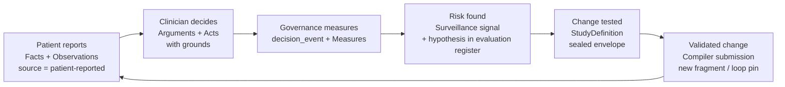

| Step | Producing action (portal) | Artefact | Consumed by | Test |
| --- | --- | --- | --- | --- |
| Patient reports | Answering intake, check-ins, PROMs (patient) | `Fact` rows, Observations, QuestionnaireResponses | Brief, engines, loops | PI-05, LP-01 |
| Clinician decides | Acting on arguments, signing (clinician) | Attempts, arguments, acts with reasons | `decision_event` | FACE-03, PR-01 |
| Governance measures | Reading views (governance) | MeasureReports with lineage | Signals, studies | RPT-03, QM-01 |
| Risk found, hypothesis formed | Signal review; evaluation-register entry (governance) | Governance queue item; register entry with hypothesis and endpoint | Study builder | SV-01, RE-01 |
| Change tested prospectively | Study registration and open (governance) | Sealed envelope; enrolment; endpoint MeasureReport | Ratification | ST-01, ADV-03 |
| Validated change pushed | Compiler submission with ratification (governance) | New fragment pin (threshold, pathway, prompt) or loop pin | Evaluator context; loops | KP-07, AP-02 |

The cycle's own health is a Measure: for every ratified change in a period, the presence of a preceding MeasureReport, a study or PDSA, and a follow-up effect measurement (RE-02). A change without that chain is visible on the governance face as an unevidenced change.

## Volume 3 — The record spine

The record is a headless, API-first, append-only store of versioned clinical resources with provenance on every version, an order state machine that reaches the patient directly, an inbound pipeline that turns received documents into span-linked facts, and an event stream that every other plane subscribes to. It is written in a memory-safe systems language with no garbage collector, and it meets fixed latency budgets on a node that fits in 100 MB of memory so that it can run at the edge of a practice as well as in a region.

### 3.1 Resource model

All clinical content is stored as standard interoperable resources (the FHIR R4 base with the national profile set for the jurisdiction) so that nothing in the record is proprietary. Each resource is immutable once written; a change creates a new version with a monotonically increasing version number, a provenance resource naming the author, the device, the reason and the source span, and a pointer to the version it supersedes. Deletion is a tombstone version. Reads default to the current version; any version is addressable by number or by content hash.

Beyond the standard resource set, the spine adds four record-level constructs. The fact graph holds atomic facts (subject, predicate, object, effective time, source span, extractor pin) with explicit disagreement rows when two sources assert incompatible values, so that a contradiction in the record is a first-class row and not a silent overwrite. Span links tie every extracted fact to the byte range in the source document it came from, so a clinician can click from a fact to the sentence. Consent is stored as data, as consent resources whose scope and validity are inputs to the evaluator rather than a UI gate. Master patient identity is a linkage table produced by a probabilistic matcher (Section 3.4), never by editing identifiers on resources.

### 3.2 Standard functions, each as an API

| Function | What the spine guarantees | Budget |
| --- | --- | --- |
| Demographics and identity | Versioned patient resource; linkage decisions with match weights; merge and unmerge as reversible acts | Write under 10 ms |
| Encounters and notes | Notes stored as documents with structured sections; every sentence addressable by span | Write under 10 ms |
| Problems, allergies, history | Coded to the pinned terminology edition; free-text originals retained with span links | Search under 50 ms |
| Measurements and observations | Device provenance and declared accuracy on each; unit normalisation at write with the original retained | Write under 10 ms |
| Medications and prescribing | Medication list as versioned resources; prescribing check as a synchronous evaluator call | Check under 200 ms |
| Orders | State machine (Section 3.3); direct-to-patient delivery; acknowledgement and overdue tracking | Event under 100 ms |
| Inbound receiving | Documents, results and letters ingested, matched to patient and order, extracted into facts | Extract under 5 s |
| Terminology | Local mirror of the pinned edition with lookup, expand, subsumption and validate-code | Lookup under 1 ms |
| Scheduling and recall | Appointments and recalls as resources; recall rules are compiled knowledge fragments | Search under 50 ms |
| Billing and claims | Encounter-linked items; item eligibility is an evaluator call against compiled rules | Search under 50 ms |
| Messaging | Secure messages as communication resources, span-addressable, linked to encounters | Event under 100 ms |
| Documents and letters | Generated from released arguments only; the template is a pinned render template | Brief under 3 s |

### 3.3 The order object

An order is the one construct that leaves the practice and comes back, so its lifecycle is a strict state machine with no unmodelled transition. The states, in order, are drafted, checked, signed, transmitted, acknowledged, fulfilled, resulted and reconciled. Overdue is an orthogonal flag set by a timer against the expected time for the next state, not a state of its own. Each transition is an act with a principal and a timestamp; the checked transition is a synchronous evaluator call whose attempt record is stored with the order; transmitted requires a signed order and records the channel; acknowledged records the receiving party's identity, which for a direct-to-patient order is the patient's own face.

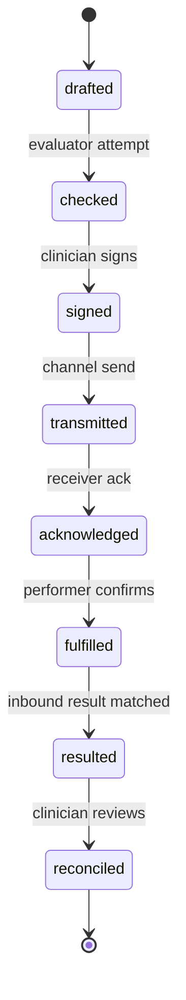

Resulted is reached only when the inbound pipeline matches a received document to this order by identifier or, failing that, by the probabilistic matcher with a match weight above the configured threshold; a match below the threshold goes to the reconciliation queue rather than being guessed.

### 3.4 Identity and matching

Patient and document matching uses the probabilistic record-linkage method in which each comparison field contributes a weight equal to the log-ratio of its agreement probability among true matches to its agreement probability among non-matches. Weights are estimated offline from the practice's own data, published as a pinned parameter set, and applied at runtime as a sum of per-field weights compared against two thresholds: above the upper threshold is a match, below the lower is a non-match, between is a clerical review item. The parameter set and both thresholds are compiled knowledge, so a change is versioned and replayable.

### 3.5 Inbound pipeline

A received document passes through five steps, each recording its own provenance: intake (channel, sender, hash), patient match (Section 3.4), order match, extraction (a pinned extractor produces facts with span links and a per-fact reliability signal), and posting (facts are written to the fact graph; conflicts with existing facts create disagreement rows rather than overwrites). The extractor is an engine under Volume 7 rules: it is pure, pinned and returns typed signals; a fact it is unsure of is posted with a low reliability signal, never dropped.

### 3.6 Event stream and edge nodes

Every write commits to the store and to an outbox table in one transaction; a relay publishes outbox rows as events in commit order. Subscribers (the engine plane, the faces' projection caches, the journey service) consume events with at-least-once delivery and idempotent handlers keyed on the resource version. An edge node is a full spine instance compiled to run on a practice server or in a browser runtime, holding the practice's patients and syncing with the region by an additive merge: because every resource version is immutable and identified by hash, two nodes reconcile by exchanging the versions each lacks, and conflicting concurrent versions become disagreement rows for a person to resolve. No node ever rewrites another node's history.

### 3.7 Latency budgets as tests

The budgets in Section 3.2 are enforced by a performance suite that runs on every build against a synthetic practice of 10,000 patients: write under 10 ms at the 99th percentile, search under 50 ms, event propagation under 100 ms, terminology lookup under 1 ms, prescribing check under 200 ms, inbound extraction under 5 s, brief assembly under 3 s, cohort query over a year under 2 s, and resident memory under 100 MB. A build that misses a budget does not ship.

### 3.8 Storage model (build spec)

```sql
CREATE TABLE resource (
  resource_type TEXT NOT NULL,                  -- FHIR R4 type
  id            UUID NOT NULL,
  version       INTEGER NOT NULL,
  content_hash  BYTEA NOT NULL,                 -- sha256(jcs(body))
  body          JSONB NOT NULL,
  supersedes_version INTEGER,
  tombstone     BOOLEAN NOT NULL DEFAULT FALSE,
  provenance_id UUID NOT NULL,                  -- Provenance resource for this version
  patient_id    UUID,                           -- denormalised for RLS and chain
  written_at    TIMESTAMPTZ NOT NULL DEFAULT now(),
  PRIMARY KEY (resource_type, id, version)
);
CREATE INDEX resource_current ON resource (resource_type, id, version DESC);
CREATE INDEX resource_patient ON resource (patient_id, resource_type);

CREATE TABLE fact (
  fact_id     BYTEA PRIMARY KEY,                -- sha256(subject||predicate||object||effective||span)
  patient_id  UUID NOT NULL,
  subject     TEXT NOT NULL, predicate TEXT NOT NULL, object TEXT NOT NULL,   -- codes in pinned edition
  value_num   NUMERIC, value_unit TEXT, value_text TEXT,
  effective   TSTZRANGE NOT NULL,
  source_doc  UUID NOT NULL, span_start INTEGER NOT NULL, span_end INTEGER NOT NULL,
  extractor_pin BYTEA NOT NULL REFERENCES pin_registry(pin),
  reliability   INTEGER NOT NULL CHECK (reliability BETWEEN 0 AND 1000000)   -- Fixed6
);
CREATE TABLE fact_disagreement (
  left_fact  BYTEA NOT NULL REFERENCES fact(fact_id),
  right_fact BYTEA NOT NULL REFERENCES fact(fact_id),
  predicate  TEXT NOT NULL,                     -- contradicts | duplicates | supersedes
  resolved_by_act BYTEA,
  PRIMARY KEY (left_fact, right_fact)
);

CREATE TABLE outbox (
  seq        BIGSERIAL PRIMARY KEY,
  event_type TEXT NOT NULL, resource_type TEXT, resource_id UUID, version INTEGER,
  payload    JSONB NOT NULL, committed_at TIMESTAMPTZ NOT NULL DEFAULT now()
);
-- every resource insert and its outbox row happen in ONE transaction (trigger AFTER INSERT ON resource)
```

RLS on `resource` and `fact` mirrors Volume 8: patient face sees own patient\_id only; clinician face sees patients with an open care relationship; governance face sees aggregate views unless break-glass.

### 3.9 Inbound pipeline (sequence)

```mermaid
sequenceDiagram
  participant CH as Channel (secure message, fax gateway, HL7 v2, FHIR)
  participant IN as Intake
  participant PM as Patient match
  participant OM as Order match
  participant EX as Extractor engine
  participant FG as Fact graph
  participant RQ as Reconciliation queue
  CH->>IN: document bytes + sender
  IN->>IN: hash, store as DocumentReference v1, provenance(channel)
  IN->>PM: identifiers, name, DOB, sex
  PM-->>IN: match weight W
  alt W >= upper
    IN->>OM: patient_id, document
    OM-->>IN: order_id or none
    IN->>EX: document, extractor pin
    EX-->>FG: facts with spans and reliability
    FG->>FG: insert; conflicts => fact_disagreement rows
    IN->>IN: order.transition(resulted) if order_id
  else lower <= W < upper
    IN->>RQ: enqueue with candidates
  else W < lower
    IN->>RQ: enqueue as unmatched
  end
```

Budget: intake to facts posted under 5 s at the 95th percentile for a 4-page document.

### 3.10 Probabilistic matching (build spec)

```latex
W = \sum_{k} w_k, \qquad w_k = \begin{cases} \log_2 \dfrac{m_k}{u_k} & \text{field } k \text{ agrees} \\[6pt] \log_2 \dfrac{1-m_k}{1-u_k} & \text{field } k \text{ disagrees} \end{cases}
```

| Parameter | Source | Pinned as |
| --- | --- | --- |
| m\_k (agreement probability among true matches), u\_k (among non-matches) per field | Estimated offline by expectation-maximisation on the practice's own records | Class K fragment |
| Fields | Identifier (exact), family name (Jaro–Winkler ≥ 0.92), given name, date of birth (exact, ±transposition), sex, postcode | Class R fragment |
| Upper and lower thresholds | Chosen offline from the weight histogram to hit target false-match rate ≤ 1 in 100,000 and clerical rate ≤ 2% | Class R fragment |

Weights are computed in fixed point at runtime; the offline estimation may use floating point because its output is pinned, not executed.

### 3.11 Order transition (interface)

```rust
pub enum OrderState { Drafted, Checked, Signed, Transmitted, Acknowledged, Fulfilled, Resulted, Reconciled }

pub fn transition(o: &Order, to: OrderState, by: &Principal, evidence: TransitionEvidence)
    -> Result<Order, TransitionError>;
// allowed: exactly the successor state; evidence required per edge:
//   Checked      => AttemptId (evaluator)         Signed      => Signature (clinician key)
//   Transmitted  => ChannelReceipt                Acknowledged => ReceiverIdentity
//   Fulfilled    => PerformerConfirmation         Resulted    => DocumentRef + match weight
//   Reconciled   => ActId (clinician review)
// overdue: timer job sets order.overdue = true when now() > expected_by[state]; cleared on transition
```

### 3.12 Acceptance tests

| Test | Given | Expect |
| --- | --- | --- |
| SPN-01 | Insert resource version 2 without version 1 | Rejected; versions contiguous |
| SPN-02 | Two facts, same subject/predicate, different values, overlapping effective | `fact_disagreement` row created; neither fact overwritten |
| SPN-03 | Order transition Drafted → Signed | Rejected; Checked required |
| SPN-04 | Inbound with W between thresholds | Reconciliation queue entry; no facts posted |
| SPN-05 | Resource insert | Outbox row in same transaction (rollback test: neither persists) |
| SPN-06 | Two edge nodes write concurrently to one patient | Both versions present after sync; disagreement row for conflicting fields |
| SPN-07 | Performance suite, 10,000 patients | All budgets in 3.7 met at p99 |

### 3.13 Module build specs (part 1: record, clinical content, prescribing)

Each module below is one crate in the spine workspace (Volume 11.6), exposes the routes listed through the gateway, stores only `resource` and `fact` rows (no private tables except where stated), and ships the tests listed. Profiles are the FHIR R4 national base profiles for the jurisdiction; local extensions are named per module.

**M-DEM Demographics and identity**

| Item | Specification |
| --- | --- |
| Resources | Patient, RelatedPerson, Practitioner, PractitionerRole, Organization, Location; Linkage (identity links) |
| Private table | `identity_link(patient_a, patient_b, weight Fixed6, decision {match, non_match, clerical}, act_id)` |
| Routes | `POST /patients` · `GET /patients/{id}` · `PUT /patients/{id}` (new version) · `POST /patients/{id}/merge` (act, reversible) · `POST /patients/{id}/unmerge` · `GET /patients/search?name=&dob=&identifier=` |
| Rules | Identifiers are never edited in place; a correction is a new version with provenance reason. Merge creates a Linkage and re-points reads, never rewrites resources. Search runs the matcher (3.10) and returns candidates with weights. |
| Tests | DEM-01 merge then unmerge restores both records byte-identically · DEM-02 search on transposed DOB still returns candidate above lower threshold · DEM-03 `PUT` without provenance reason rejected |

**M-ENC Encounters and notes**

| Item | Specification |
| --- | --- |
| Resources | Encounter, Composition (note) with sections, DocumentReference (attachments), EpisodeOfCare |
| Note model | Composition.section\[\] each with `text.div` and a `span_index` extension: byte offsets of every sentence, so `(composition_id, version, start, end)` addresses a sentence |
| Routes | `POST /encounters` · `POST /encounters/{id}/notes` · `PUT /notes/{id}` (new version) · `GET /notes/{id}/span?start=&end=` · `POST /encounters/{id}/close` (act) |
| Rules | A note version is immutable; "edit" writes a new version and re-indexes spans; facts extracted from the old version keep their span link to that version. Closing an encounter is an act; late entries are new versions with `late_entry = true`. |
| Tests | ENC-01 span lookup on version 1 after version 2 written returns version-1 text · ENC-02 close then note append yields late\_entry · ENC-03 note write under 10 ms p99 including span index |

**M-CLN Problems, allergies, history, immunisations**

| Item | Specification |
| --- | --- |
| Resources | Condition, AllergyIntolerance, Procedure, FamilyMemberHistory, Immunization |
| Coding | Every `code` carries the edition pin; free text original kept in `note` with a span link to its source; uncoded entries allowed with `reliability` 0 until coded |
| Routes | `POST /patients/{id}/conditions` · `PUT /conditions/{id}` · `POST /patients/{id}/allergies` · `GET /patients/{id}/problem-list?as_of=` (current versions at a time) |
| Rules | Allergies with `criticality = high` are hard-stop inputs (5.2 stage 5). Problem list "as of" is a versioned read; resolved problems are new versions with `clinicalStatus = resolved`, never deleted. |
| Tests | CLN-01 allergy added → prescribing check for that substance returns held with hard stop · CLN-02 problem-list as\_of before resolution shows active · CLN-03 uncoded entry excluded from evaluator grounds until coded |

**M-OBS Measurements and observations**

| Item | Specification |
| --- | --- |
| Resources | Observation (vitals, pathology, patient-reported), Device, DeviceMetric |
| Units | UCUM; normalised at write to the canonical unit for the code with original value and unit retained in `valueQuantity` extension `original` |
| Reliability | From `Device.declared_accuracy` (pinned per device model) or from the lab's accreditation record; patient-entered without device: reliability floor for claim types that may use it |
| Routes | `POST /patients/{id}/observations` (single or batch) · `GET /patients/{id}/observations?code=&from=&to=` · `GET /observations/{id}/series` |
| Rules | Out-of-physiological-range values are stored, flagged `questionable = true`, and excluded from grounds; a clinician act can clear the flag. Batch write is one transaction with one outbox row per observation. |
| Tests | OBS-01 mmol/L and mg/dL writes read back as one canonical series · OBS-02 impossible value stored and flagged, not rejected · OBS-03 home BP device without pinned accuracy → reliability floor applied |

**M-MED Medications and prescribing**

| Item | Specification |
| --- | --- |
| Resources | MedicationRequest, MedicationStatement, MedicationDispense (inbound), Medication (from the pinned medicines reference) |
| Prescribing check | `POST /prescribing/check` → builds an `EvaluationRequest` (claim type prescribing) with grounds = current medications, allergies, problem list, latest relevant observations, consent; warrant = medicines-reference fragment; returns `Attempt` synchronously within 200 ms |
| Routes | `POST /prescribing/check` · `POST /medication-requests` (requires `attempt_id` with verdict released or flagged-with-override act) · `POST /medication-requests/{id}/sign` · `GET /patients/{id}/medications?active=true` |
| Rules | A MedicationRequest cannot be created without an attempt; a held attempt blocks creation with the hard-stop reason; a flagged attempt requires an override act with reason before signing. Dose limits and interactions come only from the pinned reference fragment (class K), never from code. |
| Tests | MED-01 create without attempt → 409 · MED-02 held attempt → creation blocked, sentinel entry · MED-03 flagged attempt + override act → signed; act links attempt · MED-04 check p99 under 200 ms on synthetic practice |

## Volume 3A — Complete EHR Build Specification

This volume specifies every module a fully functioning primary-care electronic health record must ship, at parity with commercial systems, as build instructions: resources and tables, routes, state machines, integration standards, rules and tests. It extends Volume 3; the spine's storage model, order state machine, inbound pipeline and matcher are assumed built.

### 3A.0 Scope and parity benchmark

Parity means a practice can switch off its incumbent system on cut-over day and lose no function. The catalogue below is the checklist; each row names the build section and the regulatory profile (Volume 11.2) in which it ships. Tier 1 is the record and workflow product with no diagnostic claim; every row marked T1 must be complete before a Tier 1 release.

| Id | Module | What every commercial primary-care EHR ships | Section | Profile |
| --- | --- | --- | --- | --- |
| A1 | Registration and demographics | Register, search, edit, merge; Medicare/DVA/concession details; carers; preferences | 3A.2 | T1 |
| A2 | National identifiers | Individual, provider and organisation healthcare identifier lookup and validation | 3A.2 | T1 |
| A3 | Eligibility and entitlement | Online patient verification, concession and veteran entitlement checks | 3A.2 | T1 |
| A4 | Appointments | Appointment book, sessions and rosters, types, recurring, waitlist, cancellations, reminders | 3A.2 | T1 |
| A5 | Waiting room and arrivals | Arrive, wait, in-consult, done; queue per provider; walk-ins; telehealth lobby | 3A.2 | T1 |
| B1 | Clinical notes | Structured notes, templates, autotext, dictation, ambient capture, past-note browsing | 3A.3 | T1 |
| B2 | Histories | Past, family, social, obstetric, occupational; alcohol, smoking, substances | 3A.3 | T1 |
| B3 | Problem and diagnosis list | Coded, dated, status, evidence links | 3.13 M-CLN | T1 |
| B4 | Allergies and adverse reactions | Coded substance/class, reaction, severity, verification | 3.13 M-CLN | T1 |
| B5 | Vitals, examination, growth | Vitals with trends; paediatric growth charts; BMI; waist | 3A.3 | T1 |
| B6 | Pregnancy and antenatal record | EDD, visits, results, shared care | 3A.3 | T1 |
| B7 | Care plans and chronic disease | Care plans, team care arrangements, reviews, health assessments, mental health plans | 3A.3 | T1 |
| B8 | Clinical tools and calculators | Risk calculators, scoring instruments, versioned | 3A.3 | T1 |
| C1 | Prescribing | Medicines database, dose, repeats, authority, interaction and allergy checks | 3A.4 | T1 |
| C2 | Electronic prescriptions | Conformant electronic prescription creation, token delivery, active script list, cancellation | 3A.4 | T1 |
| C3 | Medication management | Current list, reconciliation, ceased history, controlled-drug register, medication review | 3A.4 | T1 |
| D1 | Pathology and imaging ordering | Request forms, electronic ordering, favourites and panels, copy-to | 3A.5 | T1 |
| D2 | Results inbox | Receive, match, view, cumulative, abnormal flags, notify, action, file | 3A.5 | T1 |
| E1 | Immunisations | Record, schedule, national register upload and query, catch-up | 3A.6 | T1 |
| E2 | Recalls and reminders | Recall register, reminder runs by letter/SMS, screening programs, outcome tracking | 3A.6 | T1 |
| F1 | Letters and correspondence | Letter writer, templates, merge fields, referrals, certificates | 3A.7 | T1 |
| F2 | Secure messaging | Send and receive clinical documents by secure messaging; acknowledgements | 3A.7 | T1 |
| F3 | Inbound documents | Scanning, fax, email intake, classification, filing, actioning | 3A.7 | T1 |
| F4 | Shared national record | View, upload shared health summary, event summary, prescription records | 3A.7 | T1 |
| G1 | Billing | Fee schedules, item numbers, accounts, invoices, receipts, EFTPOS, GST | 3A.8 | T1 |
| G2 | Claiming | Bulk-bill, patient claims, veteran claims, private health, compensable/third party, batching, reconciliation | 3A.8 | T1 |
| G3 | Debtors and banking | Outstanding, statements, write-off, banking summary, end-of-day | 3A.8 | T1 |
| H1 | Users, roles, providers, locations | Accounts, MFA, roles, provider numbers, locations, sessions | 3A.9 | T1 |
| H2 | Audit and access log | Every read/write/print/export logged; patient access report | 3A.9 | T1 |
| H3 | Configuration | Templates, autotext, fee schedules, reminder rules, letterheads, clinical protocols | 3A.9 | T1 |
| I1 | Reporting | Activity, financial, clinical registers, ad-hoc query, scheduled reports | 3A.10 | T1 |
| I2 | Quality measures and extraction | Incentive-program measures, accreditation reports, de-identified extraction | 3A.10 | T1 |
| J1 | Patient communication | SMS, email, portal messages, consent, templates, two-way | 3A.11 | T1 |
| J2 | Online booking and portal | Book, forms, results release, repeat requests, telehealth join | 3A.11 | T1 |
| J3 | Telehealth | Video and phone consult with record context; remote monitoring intake | 3A.11 | T1 |
| K1 | Images and attachments | Clinical photos, documents, viewer, annotation | 3A.12 | T1 |
| K2 | Migration, import, export | Import from incumbent systems; standards export; bulk export | 3A.12 | T1 |
| K3 | Backup, restore, offline, printing | Point-in-time restore; edge operation; print templates and scripts | 3A.12 | T1 |

The open-source headless clinical data repository that informed the spine's budgets publishes: FHIR R4 headless API; create and update under 10 ms; over 25,000 writes per second on ten threads; typical search under 50 ms; under 100 MB per instance; immutable resource history; per-request audit events; attribute-based policies scoped to compartments; OAuth2 and app-launch support with TOTP multi-factor and memory-hard password hashing; multi-tenant scoping by tenant and project; custom operations as sandboxed scripts stored as operation definitions; declarative flattening views over resources to CSV/JSON/NDJSON; an agent tool interface generated from the server's capability statement; and a single-command local stack ([haste.health](https://haste.health/)). This build adopts every one of those as a requirement (3A.1) and adds the modules above, which a data repository does not ship.

| Property | Reference figure | This build's requirement | Test |
| --- | --- | --- | --- |
| Create/update latency | under 10 ms | under 10 ms p99 | SPN-07 |
| Write throughput | over 25k/s, 10 threads | over 25k/s, 10 threads, synthetic practice | PERF-01 |
| Search | under 50 ms | under 50 ms p99 | SPN-07 |
| Memory per node | under 100 MB | under 100 MB resident | SPN-07 |
| Local stack | one command | one command brings up core, store, sidecars, faces | OPS-01 |

### 3A.1 Cross-cutting build rules

These rules apply to every module in this volume. They implement the three commitments of the spine design: standards-native storage, event-first writes, and correctness by construction.

**Workspace and crates**

```text
spine/
  Cargo.toml                 # workspace; profiles = features: tier1 | tier2 | tier3
  crates/
    core-types/              # Fixed6, Pin, Code, EffectiveTime, Provenance, Consent, type-state markers
    record/                  # resource store, versioning, provenance, tombstones, compartments
    events/                  # transactional outbox, durable filtered subscriptions, replay
    facts/                   # fact graph, span links, disagreement rows, per-patient in-memory graph
    terminology/             # in-process edition mirror + tiered graph; $lookup/$expand/$subsumes/$validate/$translate
    identity/                # master identity, matcher (F–S), merge/unmerge acts, national identifier client
    orders/                  # order object + state machine; eRx, pathology, imaging, referral variants
    inbound/                 # channel adapters (HL7 v2, secure messaging, national record, device, portal, scan/OCR, email)
    scheduling/              # appointments, sessions, waitlist, waiting room
    clinical/                # notes, histories, problems, allergies, vitals, growth, antenatal, care plans, calculators
    medications/             # medication lifecycle, prescribing check request builder, ePrescription conformance, controlled-drug register
    results/                 # results inbox, cumulative view, actioning, notify
    immunisation/            # schedule engine, register sync
    recalls/                 # recall register, reminder runs, screening programs
    correspondence/          # letter writer, templates, merge fields, secure messaging, document management
    national-record/         # shared record connector (view, upload)
    billing/                 # fee schedules, accounts, invoices, receipts, claiming adapters, debtors, banking
    admin/                   # users, roles, MFA, providers, locations, configuration, audit queries
    reporting/               # declarative views (SQL-on-FHIR ViewDefinition), registers, measures, extraction, scheduled reports
    comms/                   # SMS, email, portal messaging, consent for contact, templates
    portal-api/              # patient-facing routes: booking, forms, results release, repeats, telehealth join
    telehealth/              # video/phone session, lobby, record context, remote-monitoring intake
    media/                   # object store client, content addressing, image/attachment metadata, viewer API
    migration/               # importers (incumbent formats), exporters (bulk FHIR, CSV/NDJSON), validation
    ops/                     # backup/restore (event-log based, point in time), offline edge sync, print rendering
    scripting/               # embedded sandboxed script runtime (typed bindings; custom operations as OperationDefinition)
    api-gateway/             # FHIR R4 REST + subscribe + bulk export; OAuth2/SMART; ABAC; audit per request; agent tool interface generated from CapabilityStatement
  sidecars/                  # rule engine (JVM), extractor, Bayesian/conformal, generative — Volume 7
  faces/                     # patient, clinician, governance web clients (thin; API-only)
  deploy/compose.yml         # one command: `docker compose up` brings up core, store, sidecars, faces
```

Dependency rule: `core-types` ← `record` ← `events` ← everything else; no module crate depends on another module crate except through `events` (subscribe) or `record` (read/write). `cargo deny` enforces the graph.

**Resource envelope.** Every module stores FHIR R4 resources with the national base profile applied, in the `resource` table of Volume 3.8. Every write carries a Provenance (author or model pin, time, source method: typed, dictated, extracted, patient-reported, imported, device; confidence; consent reference). A write without author and reason does not compile:

```rust
pub struct Write<R: Resource> { pub body: R, pub author: Principal, pub reason: ReasonCode, pub source: SourceMethod, pub consent: Option<ConsentRef> }
pub fn commit<R: Resource>(w: Write<R>) -> Result<Version, WriteError>;   // also inserts outbox row in the same transaction
```

**Events and subscriptions**

| Property | Specification |
| --- | --- |
| Emission | One event per committed resource version, from the outbox, in commit order |
| Subscription | Durable; filters on patient, resource type, practice, trigger code; cursor per consumer; replay from any cursor |
| Priority | Two lanes: critical (abnormal result, red-flag message, medication change on discharge) and routine; critical lane drains first |
| Delivery | At-least-once; consumer handlers idempotent on (resource id, version) |
| Budget | Commit-to-subscriber under 100 ms p99 |

**Access control and audit**

| Control | Specification |
| --- | --- |
| Identity | OAuth2 provider with app-launch context for embedded clinical apps; agents receive scoped client tokens |
| Multi-factor | TOTP required for clinician and governance faces; memory-hard password hashing (argon2id) |
| Authorisation | Attribute-based: actor, patient compartment, resource type, consent state, care relationship, purpose; evaluated per request; same policy compiled to row-level security |
| Consent | Consent resources gate secondary use, research export and agent contact; withdrawal propagates as an event |
| Audit | One AuditEvent per request (read, write, search, print, export, transmit) with actor, purpose, patient; queryable through the governance face; patient access report from the same table |
| Break-glass | Reason required; act written; loud sentinel entry; reviewed |
| Multi-tenancy | Tenant and project scoping on every resource; one deployment serves many practices; a tenant sees only its aperture on the shared patient graph |

**Scripting, custom operations, analytics views**

| Item | Specification |
| --- | --- |
| Custom operations | Sandboxed script runtime embedded in the core with typed bindings; each operation stored as an OperationDefinition resource, versioned, signed; no file, network or clock access beyond bindings |
| Analytics views | Declarative view definitions over resources (SQL-on-FHIR ViewDefinition) flattening to CSV, JSON, NDJSON; materialised into the columnar layer by the event stream; editable in the governance face |
| Agent tools | Tool schemas generated from the server CapabilityStatement: search, read, write, schema discovery; each tool carries the caller's scope; cannot sign or transmit |

**Storage layers**

| Layer | Holds | Rebuilt by |
| --- | --- | --- |
| Relational (PostgreSQL 16) | Current and historical resource versions, ledger, indexes (structured + full text) | Source of truth |
| Columnar | Analytics views, registers, cohort queries | Replay of events |
| Time-series | Device and remote-monitoring streams | Replay of events |
| Object store (content-addressed) | Originals: documents, images, audio | Immutable; hash in resource |
| In-memory fact graph | Per active patient | Materialised from record + facts on open |

**Printing and templates.** All printed output (scripts, request forms, letters, invoices, receipts, certificates, labels) renders from pinned templates (class U) through one render service; the rendered PDF is stored as a DocumentReference with the template pin, so any printed page is reproducible. Script and request-form layouts conform to the applicable national conformance profiles.

**Cross-cutting tests**

| Test | Given | Expect |
| --- | --- | --- |
| XC-01 | Write without `reason` | Does not compile |
| XC-02 | Any request | AuditEvent row exists with actor and purpose |
| XC-03 | Consent withdrawn | Next secondary-use read refused; event delivered to subscribers under 100 ms |
| XC-04 | Tenant A token reads tenant B patient | 404 |
| XC-05 | Custom operation script calls network | Sandbox denies; operation fails closed |
| XC-06 | Drop the columnar layer; replay events | Views rebuilt identically (hash of NDJSON export equal) |
| PERF-01 | 10 writer threads on synthetic practice | over 25,000 writes/s sustained 60 s |
| OPS-01 | Fresh machine, one command | Core, store, sidecars, faces up; smoke suite passes |

### 3A.2 Group A — Registration, identifiers, eligibility, appointments, waiting room

**A1 Registration and demographics (crate `identity`)**

| Item | Specification |
| --- | --- |
| Resources | Patient (national profile), RelatedPerson (carers, representatives with scope of authority), Coverage (Medicare, veteran, concession, private fund, compensable), Consent (communication preferences, sharing), Linkage |
| Versioned demographics | Names, addresses, contacts as dated entries; a change is a new Patient version with provenance reason; history readable |
| Preferences | Preferred language, interpreter need, accessibility needs, communication channel and consent per channel, cultural considerations |
| Routes | `POST /patients` · `GET /patients/{id}` · `PUT /patients/{id}` · `GET /patients?name=&birthdate=&identifier=&phone=` · `POST /patients/{id}/merge` · `POST /patients/{id}/unmerge` · `POST /patients/{id}/coverage` · `POST /patients/{id}/related` |
| Duplicate control | Every create runs the matcher (Volume 3.10) against existing patients; a candidate above the lower threshold blocks silent creation and offers link or confirm-new (act recorded) |
| Merge | Writes Linkage; reads re-point; no resource rewritten; unmerge reverses by a new Linkage version |
| Tests | REG-01 create with near-duplicate → candidate offered, act required · REG-02 merge/unmerge round trip byte-identical · REG-03 address change keeps prior address readable at prior date |

**A2 National identifiers (crate `identity`, client module)**

| Item | Specification |
| --- | --- |
| Identifiers | Individual healthcare identifier on Patient; provider identifier on Practitioner; organisation identifier on Organization; stored with status (active, retired, resolved) and last-validated time |
| Operations | `lookup_individual(demographics)` · `validate_individual(ihi)` · `lookup_provider(registration)` · `validate_org(hpio)`; adapter behind a trait so the national identifier service client is replaceable |
| Rules | Lookup at registration and before any national-record or e-prescription transaction; an unresolved or retired identifier blocks those transactions with a task, never blocks local care; every lookup logged as an AuditEvent with purpose |
| Tests | NID-01 unresolved identifier → national upload refused, local encounter proceeds · NID-02 identifier revalidated when demographics change · NID-03 lookup audited |

**A3 Eligibility and entitlement (crate `billing`, verification module)**

| Item | Specification |
| --- | --- |
| Operations | Online patient verification (medicare/veteran/concession) via the national claiming gateway; result stored on Coverage with checked-at time and status |
| Trigger | On booking, on arrival, and nightly for tomorrow's appointments |
| Tests | ELG-01 expired card → arrival screen shows warning; billing defaults to private · ELG-02 nightly run marks tomorrow's list |

**A4 Appointments (crate `scheduling`)**

| Item | Specification |
| --- | --- |
| Resources | Schedule (per practitioner-location), Slot (generated from session templates), Appointment (type, reason, participants, status, telehealth flag, home-visit address), AppointmentResponse |
| Private tables | `session_template(practitioner, location, weekday, start, end, slot_minutes, appointment_types[], valid_from, valid_to)` · `waitlist(patient, practitioner?, earliest, latest, priority, created)` |
| Appointment types | Configurable: duration, billing default, colour, online-bookable, telehealth-capable, required forms |
| Routes | `GET /schedules?practitioner=&date=` · `GET /slots?schedule=&start=&end=&status=free` · `POST /appointments` · `PATCH /appointments/{id}` (reschedule/cancel with reason) · `POST /waitlist` · `POST /appointments/{id}/remind` · `GET /appointments?patient=&date=&practitioner=` |
| Recurring | Series stored as one Appointment with `recurrenceTemplate`; instances materialised 90 days ahead; edit-one vs edit-series explicit |
| Reminders | SMS/email at configured lead times through `comms`; reply-to-confirm and reply-to-cancel parsed; non-attendance recorded as Appointment.status `noshow` with act |
| Predicted demand and non-attendance | Class-2 model outputs shown only as capacity hints to the roster view; never books or cancels (Volume 5 class rule) |
| Tests | APP-01 double-booking a slot without override role → 409 · APP-02 session template change regenerates future free slots only · APP-03 reply "C" cancels and frees slot within 60 s · APP-04 recurring edit-one leaves series intact |

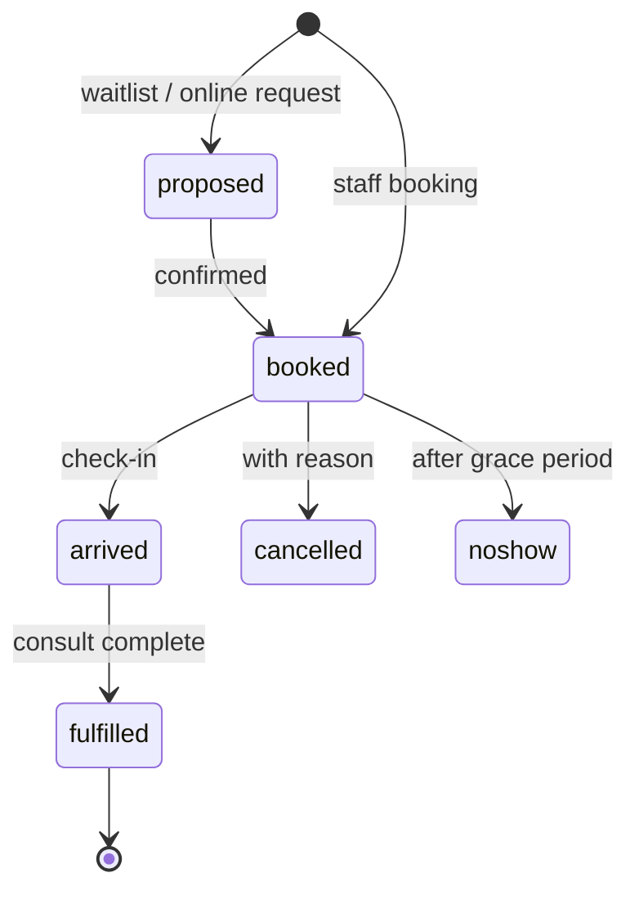

**A5 Waiting room and arrivals (crate `scheduling`)**

| Item | Specification |
| --- | --- |
| Model | Encounter created at arrival with status `arrived`; queue view = arrived encounters per practitioner ordered by appointment time, with wait duration; walk-ins create Appointment + Encounter in one call |
| Routes | `POST /appointments/{id}/arrive` · `POST /walk-in` · `GET /waiting-room?location=` · `POST /encounters/{id}/call` (status in-progress) · `POST /encounters/{id}/finish` |
| Telehealth lobby | Same queue; patient joins via portal link; provider sees "waiting online" with connection state |
| Arrival tasks | Forms due, consent renewals, eligibility warnings, overdue recalls shown at arrival and pushed to the patient's device for completion while waiting |
| Tests | WR-01 arrival creates Encounter and outbox event under 100 ms · WR-02 queue order by appointment time, not arrival time · WR-03 telehealth join updates lobby within 2 s |

### 3A.3 Group B — Clinical encounter, histories, care plans, growth, antenatal, calculators

M-ENC, M-CLN and M-OBS (Volume 3.13) cover encounters and notes, problems and allergies, and observations; this group adds what a clinician expects around them.

**B1 Clinical notes: templates, autotext, dictation, ambient capture (crate `clinical`)**

| Item | Specification |
| --- | --- |
| Note structure | Composition with sections (reason, history, examination, assessment, plan, actions) and free sections; each section a `text.div` with span index; coded entries created from sections write facts with span links |
| Templates | Questionnaire resources compiled to note sections (fields typed: coded, quantity, text, choice); rendered inline; answers stored as QuestionnaireResponse and projected into the Composition |
| Autotext | `autotext(trigger, expansion, scope: user \| practice)` table; expansion inserted at cursor; merge fields resolved from record (`{{patient.age}}`, `{{last.bp}}`) |
| Dictation and ambient capture | Audio stored as original in object store; transcript stored as DocumentReference with timestamps; a class-2 extractor drafts the note sections as a Composition version marked `draft`, attributed to the model pin; clinician edits and signs; signing is an act; unsigned drafts are excluded from grounds |
| Past-note browsing | `GET /patients/{id}/notes?section=&from=&to=&q=` with full-text search under 50 ms |
| Routes | `POST /encounters/{id}/notes` · `PUT /notes/{id}` · `POST /notes/{id}/sign` · `POST /notes/{id}/from-transcript` · `GET /templates` · `POST /autotext` |
| Tests | NOTE-01 ambient draft is `draft`, excluded from evaluator grounds until signed · NOTE-02 template answer of type quantity creates Observation with span link to the note · NOTE-03 merge field resolves to versioned value at note time |

**B2 Histories (crate `clinical`)**

| History | Resources | Fields |
| --- | --- | --- |
| Past medical and surgical | Condition (past), Procedure | Coded, date/approximate, performer, outcome, source |
| Family | FamilyMemberHistory | Relationship, condition coded, age at onset, deceased, source |
| Social | Observation (social history codes) | Occupation, living situation, carers/dependants, cultural and religious considerations, advance care directive, goals of care |
| Alcohol, smoking, substances | Observation with structured value sets | Status, quantity, frequency, quit date; history of changes |
| Obstetric | Observation + Condition | Gravida, para, outcomes per pregnancy |
| Occupational | Observation | Exposures, compensable status |

All histories are versioned entries with source method; social determinants extracted from narrative by the class-2 extractor are written as facts with reliability and shown as "from note" until confirmed.

**B5 Vitals, examination and growth (crate `clinical` over M-OBS)**

| Item | Specification |
| --- | --- |
| Vitals set | BP (with cuff/method/position), pulse, temperature, respiratory rate, SpO2, weight, height, waist, BMI (derived, formula pinned), pain score, head circumference |
| Growth charts | Percentile computation against pinned reference tables (class K) by age, sex; corrected age for prematurity; chart series endpoint `GET /patients/{id}/growth?measure=` returns points + percentile bands |
| Examination findings | Coded findings per body system as Observations with `bodySite`; templated exam panels |
| Trend | `GET /patients/{id}/observations/{code}/trend` across sources with method-change markers and reference ranges per lab, age, sex, pregnancy state |
| Tests | VIT-01 BMI recomputed only on new weight/height, formula pin stored · VIT-02 growth percentile for 6-month corrected age uses corrected table · VIT-03 trend marks lab change |

**B6 Pregnancy and antenatal record (crate `clinical`)**

| Item | Specification |
| --- | --- |
| Model | EpisodeOfCare (type antenatal) with Condition (pregnancy), EDD as Observation (method: LMP, ultrasound, IVF; versioned), planned visit schedule generated from a pinned pathway fragment; each visit an Encounter linked to the episode |
| Antenatal visit template | Gestation (derived), BP, weight, fundal height, fetal heart, urinalysis, presentation, results due |
| Shared care | Referral to obstetric service with episode summary; inbound reports linked to episode; postnatal close-out |
| Tests | ANC-01 EDD revision by ultrasound supersedes LMP with reason · ANC-02 gestation derived from current EDD version · ANC-03 visit schedule regenerates on EDD change |

**B7 Care plans, chronic disease management, health assessments (crate `clinical`)**

| Item | Specification |
| --- | --- |
| Resources | CarePlan (goals, activities with owner and interval, review date, team), Goal, CareTeam, Task (generated from activities), Questionnaire/Response for assessments |
| Plan types | Chronic disease management plan, team care arrangement, mental health treatment plan, aged-care assessment, health assessment by age band, post-discharge plan; each a pinned template with required sections and billing linkage |
| Lifecycle | draft → active → under review → revised (new version) → completed; review dates create recalls (3A.6) |
| Task generation | Each CarePlan.activity with a schedule creates Task rows owned by a team member; completion recorded against the plan; patient-portal loops created for patient-owned activities |
| Billing linkage | Plan completion emits an event that proposes the corresponding service item to billing (3A.8) as a coding-proposal argument, never auto-billed |
| Tests | CP-01 activating a plan creates one Task per scheduled activity · CP-02 review due creates recall · CP-03 plan completion proposes item; invoice not created until act |

**B8 Clinical tools and calculators (crate `clinical`)**

| Item | Specification |
| --- | --- |
| Calculators | Cardiovascular risk, renal function estimate, body surface area, frailty, deterioration scores, depression/anxiety instruments, developmental screens, alcohol/smoking instruments; each a pinned fragment (formula or table + version + citation) |
| Execution | `POST /calculate/{id}` with explicit inputs or `auto=true` to pull latest observations; output stored as Observation with `derivedFrom` inputs and calculator pin |
| Rules | A calculator output used in a draft argument carries the fragment pin as backing; a calculator with a validation population declares it as an envelope |
| Tests | CALC-01 output stores input observation versions · CALC-02 recompute with same inputs is byte-identical · CALC-03 input outside envelope → fit Out on any draft using it |

### 3A.4 Group C — Prescribing, electronic prescriptions, medication management

Treatments are a lifecycle, not a list: intended, prescribed, dispensed, administered or taken, changed, ceased, each a linked coded record. M-MED (Volume 3.13) defines the prescribing check; this group builds the rest.

**C1 Prescribing (crate `medications`)**

| Item | Specification |
| --- | --- |
| Medicines terminology | National medicines terminology at product, form and strength level, served in-process from `terminology`; brand/generic, substitution permission, schedule, subsidy listing and restriction codes from the pinned medicines reference (class K fragment) |
| Resources | MedicationRequest (dose, route, frequency, duration, quantity, repeats, indication → Condition, substitution, authority status, prescriber, signature), Medication (from terminology) |
| Dose entry | Structured dose (`doseQuantity`, `timing`, `route`) with a parser for shorthand ("1 bd pc") that writes structured fields and keeps the original text |
| Checks | `POST /prescribing/check` per M-MED: allergy/class, interaction (drug–drug, drug–condition, drug–pregnancy/lactation, drug–renal/hepatic using latest observations), dose range by age/weight/renal function, duplicate therapy, schedule restrictions; all from pinned fragments; result is an Attempt within 200 ms |
| Authority and restrictions | Restriction code resolution from the subsidy listing; streamlined authority codes captured; phone/online authority workflow as a Task with approval number stored on the MedicationRequest |
| Scope of practice | Nurse and pharmacist prescribers: formulary and scope fragment (class P profile) applied in the evaluator context; out-of-scope → held with reason |
| Repeats and renewals | Repeat count on the original; renewal creates a new MedicationRequest with `priorPrescription`; cancellation is a state transition, never a delete |
| Tests | RX-01 shorthand parse round-trips to structured dose · RX-02 renal-dosing check uses latest eGFR observation version · RX-03 nurse prescriber outside formulary → held · RX-04 authority number required before sign when restriction demands it |

**C2 Electronic prescriptions (crate `medications`, module `eprescribe`)**

```mermaid
stateDiagram-v2
  [*] --> Drafted
  Drafted --> Checked: attempt released or flagged+override
  Checked --> Signed: prescriber signature (key in HSM)
  Signed --> Transmitted: sent to prescription exchange; token issued
  Transmitted --> Acknowledged: exchange receipt
  Acknowledged --> Fulfilled: dispense event
  Fulfilled --> Reconciled: medication list updated, reviewed
  Transmitted --> Cancelled: prescriber cancel accepted by exchange
  Transmitted --> Overdue: no dispense in expected window
  Overdue --> Fulfilled
```

| Item | Specification |
| --- | --- |
| Conformance | Electronic prescription message built to the national e-prescribing conformance profile; validated against the profile's schema and business rules before transmission; conformance test suite run in CI |
| Token delivery | Token (QR/link) delivered to patient by SMS, email or portal in the same action as transmission; delivery receipt stored; re-send route; paper fallback prints the conformant script layout |
| Active script list | Registration and consent for the patient's active script list where the exchange provides one; list retrieved on medication reconciliation |
| Dispense events | Inbound dispense record from the exchange matched to the MedicationRequest (inbound pipeline); updates MedicationDispense and adherence observations |
| Cancellation | Prescriber cancel → exchange; on acceptance the request moves to Cancelled; patient notified |
| Controlled medicines | Schedule 8 and 4D: real-time prescription monitoring check called at Checked with result stored; approval/permit numbers required where the jurisdiction demands; recorded in the controlled-drug register (C3) |
| Routes | `POST /prescriptions` · `POST /prescriptions/{id}/sign` · `POST /prescriptions/{id}/transmit` · `POST /prescriptions/{id}/cancel` · `POST /prescriptions/{id}/resend-token` · `GET /patients/{id}/active-scripts` |
| Tests | EP-01 message fails profile validation → not transmitted, task raised · EP-02 token delivered and receipt stored in same transaction as Transmitted · EP-03 dispense event moves state to Fulfilled and writes MedicationDispense · EP-04 S8 script without monitoring check result cannot reach Signed · EP-05 cancel after dispense refused with reason |

**C3 Medication management (crate `medications`)**

| Item | Specification |
| --- | --- |
| Current list | Reconciled view over MedicationRequest (ours and external), MedicationDispense, MedicationStatement (patient-reported, extracted from letters); discrepancies shown as rows (source A says X, source B says Y) from `fact_disagreement`; one current list with `source` per line |
| Reconciliation workflow | Triggered by discharge summary, specialist letter, active script list retrieval, or patient report; pharmacist/clinician resolves each discrepancy by act (accept, cease, amend); unresolved discrepancies are visible on the prescribing check as flagged grounds |
| Ceased history | Cease is a new version with reason code (adverse effect, ineffective, completed, changed, patient choice); never deleted |
| Administration | MedicationAdministration for in-practice and hospital-in-the-home doses: batch, site, route, observer, adverse event link |
| Adherence | Patient-reported and device-recorded doses as Observations against the request; adherence ratio derived with formula pin |
| Controlled-drug register | Append-only `controlled_drug_register(item, batch, received, administered/dispensed, balance, witness, act)`; balance recomputed from entries; discrepancies raise a sentinel entry |
| Medication review | Structured review template (indication, effectiveness, adverse effects, adherence, monitoring due) producing a Composition and proposed changes as drafts |
| Routes | `GET /patients/{id}/medications/current` · `GET /patients/{id}/medications/discrepancies` · `POST /medications/{id}/cease` · `POST /administrations` · `POST /cdr/entries` · `GET /cdr/balance?item=` |
| Tests | MM-01 discharge summary with dose change creates discrepancy row, not overwrite · MM-02 cease requires reason · MM-03 register balance equals sum of entries; tampering detected by chain · MM-04 unresolved discrepancy appears as flagged ground on next prescribing check |

### 3A.5 Group D — Pathology and imaging ordering, results inbox

Orders use the single order object and state machine of Volume 3.3; results arrive through the inbound pipeline of Volume 3.5/3.9. This group builds the request side, the results side, and line-level matching between them.

**D1 Ordering (crate `orders`)**

| Item | Specification |
| --- | --- |
| Resources | ServiceRequest (one per order line, grouped by `requisition`), Specimen (pathology), Coverage reference (funding category), DocumentReference for the rendered request form |
| Catalogue | Test and imaging catalogues per provider as pinned fragments: code (laboratory terminology / procedure code), specimen and preparation requirements, turnaround, fasting, safety questions (contrast, pregnancy, renal function, implants) |
| Favourites and panels | Per-user and per-practice panels (`panel(name, lines[], owner)`); a panel expands to lines at order time |
| Pre-order checks | Existing recent result for the same code within the guideline interval (from fragment) → shown as a rebuttal on the order's Checked attempt; required clinical details enforced per catalogue line |
| Request assembly | Coded lines, clinical notes, urgency, fasting/collection instructions, funding category, copy-to practitioners, patient identifiers and eligibility; rendered request form from pinned template (conformant layout) |
| Transmission | Electronic order to provider (HL7 v2 ORM or provider API through an adapter trait) and, in the same action, patient delivery: instructions, collection-centre finder, booking link, safety questionnaire for imaging |
| Expected-result window | Per catalogue line; timer sets `overdue` and creates a Task for the orderer when passed |
| Routes | `POST /orders` (lines\[\]) · `POST /orders/{id}/check` · `POST /orders/{id}/sign` · `POST /orders/{id}/transmit` · `GET /orders?patient=&state=` · `GET /catalogue?provider=&q=` · `POST /panels` |
| Tests | ORD-01 panel expands to N ServiceRequests under one requisition · ORD-02 recent duplicate test appears as rebuttal; ordering proceeds only with act · ORD-03 imaging line with contrast requires renal-function answer before Signed · ORD-04 overdue timer creates Task at window end |

**D2 Results inbox (crate `results`)**

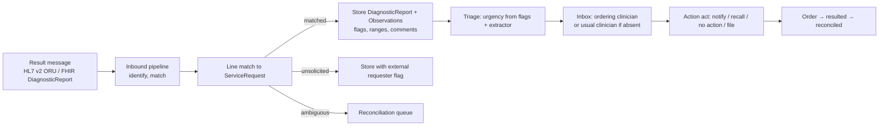

| Item | Specification |
| --- | --- |
| Ingest | HL7 v2 ORU^R01 (national pathology messaging profile) and FHIR DiagnosticReport; acknowledgement returned; original message stored content-addressed |
| Line matching | Each result observation matched to a ServiceRequest by placer/filler order numbers, then by code and specimen; partial results, add-on tests and unrequested tests each visible with their status; unsolicited results stored with external requester and flagged |
| Storage | DiagnosticReport with Observations: value, units (UCUM), reference range (per lab/age/sex/pregnancy), abnormal flags, specimen, collection and reporting times, performing lab; laboratory comments stored as text and extracted into facts ("haemolysed", "repeat in 3 months" → follow-up task proposal) |
| Cumulative view | `GET /patients/{id}/results/cumulative?codes=&from=` returns a grid across reports with lab/method changes marked |
| Triage | Urgency = max(abnormal flag severity, extractor-derived critical terms, order urgency); critical lane event; inbox ordered by urgency then time |
| Routing | Ordering clinician; usual clinician if orderer absent (roster-aware); nurse/pharmacist queue by protocol fragment; copy-to recipients |
| Actioning | Acts: `notify` (creates patient communication with content class: normal/abnormal-non-urgent/urgent), `recall` (creates recall), `no_action`, `discuss_at_visit`, `file`; a result cannot be filed without an act; unactioned results older than the configured age escalate to a supervisor queue |
| Patient release | Results released to the portal per practice policy and per-result act; abnormal results release only after clinician act |
| Imaging reports | Report text, coded impression, procedure, modality, region, image link (external archive URL or DICOM study reference); follow-up recommendations extracted to Task proposals with due dates |
| Routes | `GET /inbox/results?assignee=&urgency=` · `POST /results/{id}/act` · `GET /results/{id}` · `GET /patients/{id}/results/cumulative` · `POST /results/{id}/release` |
| Tests | RES-01 ORU with two placer numbers matches two orders line by line · RES-02 add-on test appears as unrequested line on the same report · RES-03 critical flag delivered on critical lane under 100 ms · RES-04 file without act → 409 · RES-05 unsolicited result stored, flagged, routed to usual clinician · RES-06 "repeat in 3 months" comment creates a Task proposal with due date · RES-07 abnormal result not visible on portal before act |

### 3A.6 Group E — Immunisations, recalls and reminders, screening programs

**E1 Immunisations (crate `immunisation`)**

| Item | Specification |
| --- | --- |
| Resources | Immunization (vaccine code, batch, expiry, dose number, site, route, provider, funding, reaction link), ImmunizationRecommendation (derived), ImmunizationEvaluation |
| Schedule engine | National schedule and catch-up rules as a pinned fragment (age bands, intervals, minimum ages, contraindications); `evaluate(patient) -> {due[], overdue[], not_indicated[]}` pure, replayable; risk-group additions from problem list codes |
| Register sync | Adapter to the national immunisation register: upload each administered dose (queued, retried, acknowledged); query history on registration and before evaluation; register entries stored as Immunization with source = register; disagreements between local and register become `fact_disagreement` rows |
| Recording workflow | Batch scanning; cold-chain breach flag on batch blocks use; consent captured; post-vaccination observation window task |
| Routes | `POST /immunisations` · `GET /patients/{id}/immunisations/status` · `POST /patients/{id}/immunisations/sync` · `GET /immunisations/queue` (unsent uploads) |
| Tests | IMM-01 dose recorded → upload queued in same transaction; ack stored · IMM-02 register history differing from local → disagreement row, gap list uses reconciled view · IMM-03 catch-up for a 4-year-old with no doses lists correct sequence per fragment · IMM-04 batch past expiry → record refused |

**E2 Recalls and reminders (crate `recalls`)**

| Item | Specification |
| --- | --- |
| Model | `recall(patient, reason_code, due, source: {clinician act \| care plan review \| result action \| screening program \| immunisation due}, priority, owner, status)`; status machine: open → contacted (attempt n) → booked → completed \| declined \| unable-to-contact \| cancelled |
| Reminder runs | Scheduled job selects open recalls due within a window, groups by patient, sends by the patient's consented channel (SMS, email, portal, letter print batch) using pinned templates; each contact is a Communication resource; maximum attempts and escalation to phone list per rule fragment |
| Screening programs | Program fragments (age/sex eligibility, interval, exclusion codes, test code that satisfies): cervical, bowel, breast, diabetes, cardiovascular, chronic-kidney, cancer surveillance, health assessments by age; the engine computes eligible-and-overdue lists from codes and from extracted facts (registers from narrative) |
| Outcome tracking | A recall completes when the satisfying event occurs (result received, immunisation recorded, encounter of type X) — detected by event subscription, not manual close |
| Reports | Recall performance: sent, contacted, booked, completed by reason and month (3A.10) |
| Routes | `POST /recalls` · `GET /recalls?status=&due_before=&reason=` · `POST /recalls/run` · `POST /recalls/{id}/contact` · `GET /screening/{program}/eligible` |
| Tests | RC-01 result action "recall in 3 months" creates recall with due date · RC-02 reminder run respects channel consent; no SMS to opted-out patient · RC-03 satisfying result auto-completes recall within 100 ms of event · RC-04 screening eligibility excludes patient with exclusion code from extracted fact (reliability above floor) · RC-05 max attempts reached → escalation list entry |

### 3A.7 Group F — Correspondence, referrals, secure messaging, inbound documents, shared national record

**F1 Letters and correspondence (crate `correspondence`)**

| Item | Specification |
| --- | --- |
| Letter writer | Composition of type letter; pinned templates with merge fields (patient, practice, provider, addressee, problem list, current medications, allergies, recent results selectable, care plan summary); sections editable; a class-2 drafting engine may pre-fill narrative from the record as a `draft` version, attributed |
| Referrals | ServiceRequest (referral) + Composition (referral letter) + attachments; reason, urgency, addressee (directory lookup), status machine: drafted → sent → acknowledged → appointment booked → seen → reported → closed; returning correspondence linked by referral id; overdue timers per stage |
| Certificates and forms | Medical certificates, fitness/capacity certificates, compensable-scheme forms, statutory forms as pinned templates; each stored as DocumentReference with template pin; patient copy to portal |
| Addressee directory | Practitioner/Organization directory with secure-messaging endpoints, fax, postal; synced from national provider directory where available |
| Routes | `POST /letters` · `PUT /letters/{id}` · `POST /letters/{id}/sign` · `POST /letters/{id}/send` (channel: secure messaging \| print \| portal \| fax) · `POST /referrals` · `PATCH /referrals/{id}/status` · `GET /directory?q=` |
| Tests | LET-01 merge field pulls versioned value at letter time · LET-02 unsigned letter cannot be sent · LET-03 referral overdue at acknowledged stage creates Task · LET-04 patient copy visible on portal after send |

**F2 Secure messaging (crate `correspondence`, module `smd`)**

| Item | Specification |
| --- | --- |
| Standard | Secure message delivery per the national secure-messaging specification: payload is a signed and encrypted clinical document (letter, referral, discharge summary, report) with sender/receiver identifiers; transport acknowledgement and application acknowledgement both stored |
| Outbound | Sign (provider certificate in HSM), encrypt to recipient certificate (directory), submit; states: queued → sent → transport-acked → app-acked \| rejected; retry with backoff; rejection creates Task |
| Inbound | Poll/receive; decrypt; verify signature; store original content-addressed; hand to inbound pipeline (identify patient, match referral/order, extract, route); send acknowledgements |
| Interoperability | Adapter trait per messaging vendor/network; payload formats: CDA-based documents and PDF with structured header; FHIR document bundle where supported |
| Routes | `POST /messages/send` · `GET /messages/outbox?state=` · `GET /messages/inbox?state=` · `POST /messages/{id}/ack` |
| Tests | SMD-01 signature verification failure → quarantined, not filed, task raised · SMD-02 app-ack timeout → retry then Task · SMD-03 inbound letter matched to open referral moves it to reported |

**F3 Inbound documents: scanning, fax, email (crate `inbound`)**

| Item | Specification |
| --- | --- |
| Channels | Scanner/upload (PDF, images), fax gateway, quarantined email intake (attachments only, sender allow-list, malware scan), portal uploads |
| Pipeline | Store original → OCR (class-2 extractor produces text with per-block confidence) → classify document type (discharge summary, specialist letter, result, form, certificate, other; class 2, flagged) → identify patient (matcher) → match referral/order → extract facts with spans → route to clinician queue by urgency |
| Filing | A document is filed only by an act (clinician or trained staff per role); filing writes DocumentReference with type, patient, encounter/episode link and the extracted-facts batch id; unfiled items older than the configured age escalate |
| Actioning | Same act set as results (notify, recall, task, no action); requests inside the document ("please repeat test", "review in 4 weeks") become Task proposals |
| Routes | `POST /inbound/upload` · `GET /inbound/queue?assignee=&state=` · `POST /inbound/{id}/file` · `POST /inbound/{id}/act` · `GET /inbound/{id}/original` |
| Tests | DOC-01 low-confidence patient match → reconciliation queue, never auto-filed · DOC-02 discharge summary medication change → reconciliation trigger (3A.4 C3) · DOC-03 original bytes retrievable and hash-verified after filing · DOC-04 email from non-allow-listed sender quarantined |

**F4 Shared national record (crate `national-record`)**

| Item | Specification |
| --- | --- |
| View | Retrieve document list and documents (shared health summaries, discharge summaries, event summaries, prescription and dispense records, pathology and imaging reports) for the patient by national identifier; cached as DocumentReference with source = national record; access reason recorded; patient access controls respected |
| Upload | Shared health summary (problem list, medications, allergies, immunisations) generated from the reconciled record as a CDA document from a pinned template; event summary after significant encounters; upload states queued → uploaded → acknowledged \| rejected; supersede on re-upload |
| Consent and opt-out | Patient's national-record standing and per-upload consent checked; withdrawal prevents upload; every view logged with purpose and shown on the patient's access report |
| Ingestion | Downloaded documents pass through the inbound pipeline; extracted facts are marked source = national record with the document's own provenance |
| Routes | `GET /patients/{id}/national-record/documents` · `GET /national-record/documents/{id}` · `POST /patients/{id}/national-record/shared-health-summary` · `POST /patients/{id}/national-record/event-summary` |
| Tests | NR-01 upload without patient consent flag → refused · NR-02 uploaded summary content equals reconciled list at upload time (pinned) · NR-03 view logged with purpose and visible on patient access report · NR-04 downloaded discharge summary drives medication reconciliation trigger |

### 3A.8 Group G — Billing, claiming, debtors and banking

Billing is downstream of the record: an encounter's coded activity proposes items; a person confirms; claims and payments are state machines with reconciliation against gateway responses. Money tables are append-only like everything else: a correction is a reversing entry.

**G1 Billing (crate `billing`)**

| Item | Specification |
| --- | --- |
| Resources | ChargeItem (item number, provider, patient, encounter, quantity, fee, funding category), Invoice (lines, totals, GST, payer: patient \| government \| veteran \| fund \| third party), Account (patient or payer), PaymentReconciliation |
| Fee schedules | National benefits schedule items with fee, benefit, rules (frequency limits, co-claiming restrictions, time thresholds, location/telehealth eligibility) as pinned fragments updated per schedule release; practice private fee schedules (multiple: standard, concession, workers-compensation, etc.) versioned |
| Item proposal | On encounter finish, a class-1 rule fragment proposes eligible items from encounter duration, type, care-plan completions, procedures recorded; shown as a coding-proposal list; staff/clinician act confirms; no invoice without act |
| Item validation | Frequency and co-claim rules checked at act time against the patient's claim history; violations block with reason (override role and reason recorded) |
| Accounts | Per patient and per payer; family/head-of-account grouping; credits and deposits |
| Receipting | Payments by cash, card (integrated terminal adapter trait), online; receipt rendered from pinned template; part payments; refunds as reversing entries |
| GST | Item-level GST flag from schedule; tax invoice rendering |
| Routes | `GET /encounters/{id}/billing-proposals` · `POST /invoices` · `POST /invoices/{id}/payments` · `POST /invoices/{id}/reverse` · `GET /accounts/{id}` · `GET /fee-schedules?date=` |
| Tests | BIL-01 invoice creation without confirming act → 409 · BIL-02 item exceeding frequency limit blocked with rule id · BIL-03 reversal leaves original and reversing rows; account balance correct · BIL-04 fee schedule at service date, not invoice date, is applied |

**G2 Claiming (crate `billing`, module `claims`)**

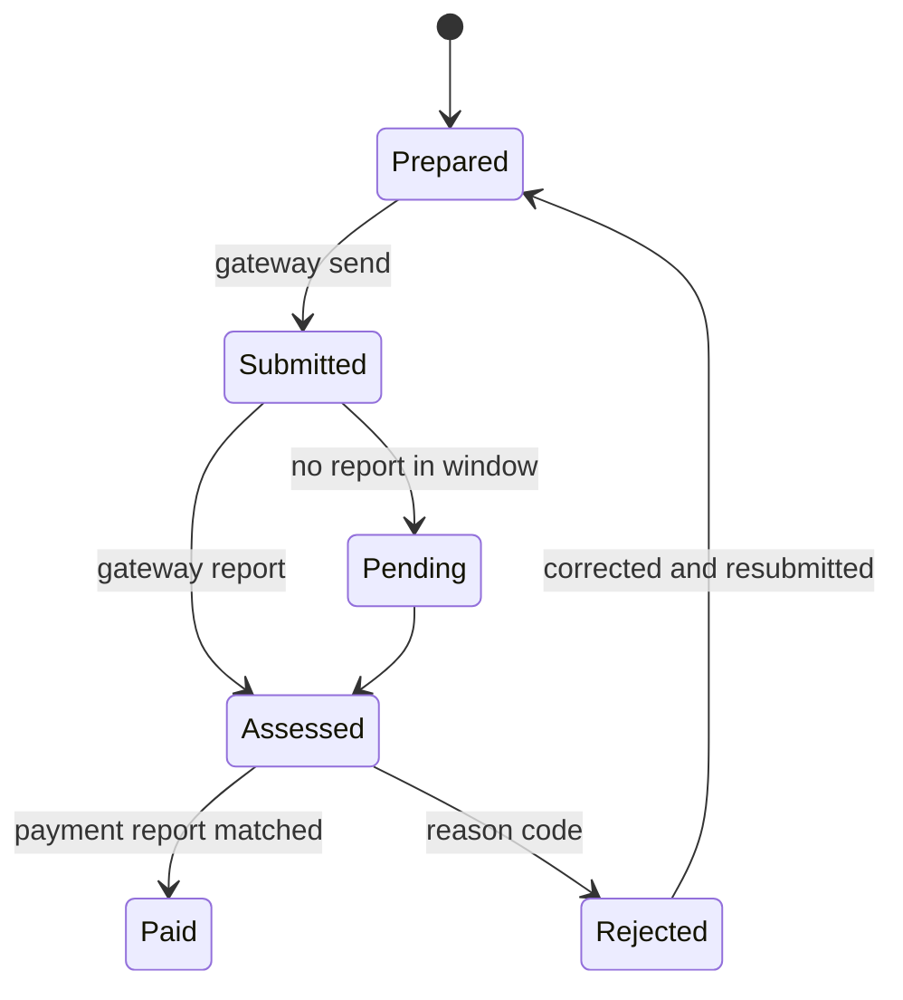

| Claim type | Path | Specifics |
| --- | --- | --- |
| Bulk-billed | Batched to the national claiming gateway; assignment of benefit captured (signature/electronic consent) | Batch header, sequence, provider, location; processing and payment reports reconciled per line |
| Patient claim | Paid in full or in part by patient; claim lodged on their behalf; benefit paid to patient | Real-time claim response stored |
| Veteran | Veteran claiming channel with card type and accepted-condition rules | Treatment cycle rules from fragment |
| Private health fund (procedures/in-hospital) | Electronic fund claiming channel | Fund, membership, item rules |
| Compensable / third party | Workers-compensation, motor-accident, other insurers; invoice to insurer with claim number; scheme fee schedule | Overdue and dispute states |

| Item | Specification |
| --- | --- |
| Gateway adapter | Trait `ClaimsGateway { submit(batch) -> receipt; fetch_reports(since) -> [ProcessingReport, PaymentReport]; verify(patient) -> Eligibility }` with the national gateway implementation; every call audited; certificates in HSM |
| Reconciliation | Payment reports matched to claims by transaction id; unmatched amounts to a suspense list; discrepancies (benefit differs from expected) flagged with reason code table |
| Routes | `POST /claims/batches` · `GET /claims?state=&provider=` · `POST /claims/{id}/resubmit` · `POST /claims/reports/fetch` · `GET /claims/suspense` |
| Tests | CLM-01 batch submit stores receipt; each line Submitted · CLM-02 processing report with rejection code moves line to Rejected with reason; task created · CLM-03 payment report matches lines and closes them; unmatched cents to suspense · CLM-04 assignment of benefit missing → bulk-bill batch refuses that line |

**G3 Debtors and banking (crate `billing`)**

| Item | Specification |
| --- | --- |
| Debtors | Aged debtors by account and payer (0–30, 31–60, 61–90, 90+); statement runs by template and channel; write-off as reversing entry with reason and approval role |
| Banking | End-of-day: takings by method and provider; terminal settlement matched; banking summary report; discrepancies flagged |
| Provider payments | Provider share calculation from configurable percentage per provider/item class; period statements |
| Exports | Accounting export (CSV/journal format configurable) per period |
| Routes | `GET /debtors?aged=` · `POST /statements/run` · `POST /write-offs` · `GET /banking/eod?date=` · `GET /providers/{id}/statement?period=` |
| Tests | DEB-01 aged buckets sum to outstanding · DEB-02 write-off requires approval role · DEB-03 EOD totals equal sum of receipts by method; terminal mismatch flagged |

### 3A.9 Group H — Practice administration, audit, configuration

**H1 Users, roles, providers, locations (crate `admin`)**

| Item | Specification |
| --- | --- |
| Accounts | User (identity provider subject, MFA enrolment, status), Practitioner (registration number, profession, prescriber number, provider numbers per location, certificates for messaging/claiming/e-prescribing, scope-of-practice profile pin), Organization (practice, tenant), Location (sites, rooms), PractitionerRole (practitioner × location × role × period) |
| Roles | Closed set with attribute policies: clinician (prescriber \| non-prescriber), nurse, pharmacist, receptionist, practice manager, billing, governance lead, auditor, regulator (federated), agent (scoped); custom roles compose permissions from a permission catalogue, versioned |
| Sessions | Short-lived tokens; idle timeout; device binding for clinician face; concurrent-session policy |
| Onboarding | Provider setup checklist: identifiers validated, certificates installed, messaging endpoint tested, claiming test transaction, e-prescribing conformance self-test |
| Routes | `POST /users` · `PATCH /users/{id}` · `POST /practitioners` · `POST /practitioner-roles` · `POST /locations` · `GET /permissions/catalogue` · `POST /roles` |
| Tests | ADM-01 clinician face login without MFA → refused · ADM-02 provider without prescriber number cannot reach prescription Signed · ADM-03 role change takes effect on next request; audited · ADM-04 retired PractitionerRole cannot be booked |

**H2 Audit and access log (crate `admin`, over the gateway's AuditEvent stream)**

| Item | Specification |
| --- | --- |
| Coverage | Every read, search, write, print, export, transmit, login, permission change, break-glass, agent action, model inference (with pin) as AuditEvent; stored in the ledger schema (insert-only, chained) |
| Queries | By patient (who accessed my record), by user (what did X do), by resource, by purpose, by time window; anomaly views (out-of-hours bulk reads, reads without care relationship) as declarative views |
| Patient access report | Generated from the same table for the patient face; includes agent and model accesses in plain language |
| Retention | Never deleted; archived by window with Merkle anchor (Volume 8) |
| Routes | `GET /audit?patient=&user=&from=&to=&purpose=` · `GET /patients/{id}/access-report` · `GET /audit/anomalies` |
| Tests | AUD-01 read of a patient outside care relationship without break-glass → refused and logged · AUD-02 print action appears in audit within 100 ms · AUD-03 patient access report lists model inference with plain-language purpose |

**H3 Configuration (crate `admin`)**

| Configuration item | Stored as | Change control |
| --- | --- | --- |
| Note templates, autotext, letter templates, letterheads, print layouts | Class U fragments | Compiler gate; render-invariance where clinical content is rendered |
| Fee schedules, private fees, billing rules | Class R/K fragments | Compiler gate; effective dates |
| Reminder rules, recall reasons, screening programs | Class R fragments | Compiler gate |
| Clinical protocols and pathways, alert thresholds, suppression policy | Class R fragments | Compiler gate + ratification |
| Appointment types, session templates, locations, rooms | Admin resources | Versioned; audited |
| Messaging endpoints, gateway credentials, certificates | Secrets store references | Rotation logged; never in fragments |
| Practice-level toggles (portal features, result release policy, telehealth) | Signed configuration document | Versioned; audited; no clinical logic in toggles |

Rule: nothing that changes clinical behaviour is a toggle; it is a fragment through the compiler (Volume 6). Tests: CFG-01 editing a letter template produces a new class-U pin; old letters still render from their pin · CFG-02 toggle document change audited with diff · CFG-03 attempt to store a threshold in a toggle → schema refuses

### 3A.10 Group I — Reporting, quality measures, data extraction

Reporting reads the columnar layer, which is materialised from events through declarative views; nothing is computed from a nightly copy, and every figure carries lineage to the events that produced it.

**I1 Reporting (crate `reporting`)**

| Item | Specification |
| --- | --- |
| View definitions | SQL-on-FHIR ViewDefinition resources (versioned, class K) flatten resources into columns; materialised by an event subscriber into the columnar store; each materialised row keeps `(resource_id, version)` lineage |
| Standard reports | Activity (encounters by type/provider/period), appointments (utilisation, no-shows, wait times), clinical registers (by condition, from codes and extracted facts), results turnaround and unactioned age, recalls performance, prescribing volumes by class, immunisation coverage, billing and claims (by item, provider, payer, aged), debtors, provider statements |
| Ad-hoc query | Governance face query builder over views with saved queries; row-level policy applies (governance sees aggregates unless break-glass) |
| Scheduled reports | Cron-style schedule fragment; output to portal/email as PDF/CSV; run log |
| Lineage | `GET /reports/{run}/lineage?row=` returns the resource versions behind a figure |
| Routes | `GET /views` · `POST /views` · `POST /query` · `GET /reports/standard/{name}?from=&to=` · `POST /reports/schedule` |
| Tests | RPT-01 view materialisation lags commit by under 5 s p95 · RPT-02 register from extracted fact includes patient with no code but fact above reliability floor, labelled · RPT-03 lineage resolves every row to resource versions · RPT-04 governance ad-hoc query returns aggregates only without break-glass |

**I2 Quality measures, accreditation and extraction (crate `reporting`)**

| Item | Specification |
| --- | --- |
| Measure definitions | Incentive-program and quality measures as Measure resources (population criteria, numerator, denominator, exclusions, period) compiled from fragments; evaluated by a class-1 engine over views; results as MeasureReport with lineage |
| Accreditation reports | Standard set: record completeness (allergies, smoking, medications recorded), recall system evidence, results follow-up timeliness, access log samples, privacy audit; each a saved query with a pinned definition |
| Coverage declaration | The governance coverage declaration (Volume 10.6) is a MeasureReport produced here |
| De-identified extraction | Extraction profiles (fields, de-identification rules: direct identifiers removed, dates shifted per patient, free text excluded unless redacted by extractor with reliability check) as fragments; a de-identified export type cannot contain a direct-identifier field by type construction; consent for secondary use checked per patient; export logged with purpose and recipient |
| Bulk export | FHIR bulk data export (NDJSON per resource type) for the tenant, scoped by policy; also CSV from views |
| Routes | `GET /measures` · `POST /measures/{id}/evaluate?period=` · `GET /measure-reports` · `POST /extracts` (profile, cohort) · `GET /extracts/{id}` · `POST /$export` |
| Tests | QM-01 measure evaluation is replayable: same period, same pins → identical MeasureReport hash · QM-02 extract profile including a name field does not compile/validate · QM-03 patient with secondary-use consent withdrawn excluded from extract · QM-04 bulk export respects tenant scope and logs purpose |

### 3A.11 Group J — Patient communication, portal and online booking, telehealth and remote monitoring

**J1 Patient communication (crate `comms`)**

| Item | Specification |
| --- | --- |
| Channels | SMS (gateway adapter trait, two-way with short-code parsing), email (transactional provider adapter), portal message, letter print batch, phone log |
| Consent | Per-channel consent on the Patient's Consent resources; every send checks consent and quiet hours; opt-out keywords honoured automatically |
| Content classes | Appointment, recall, result-notify (normal / abnormal-non-urgent / urgent), token delivery, care-plan loop, general; each class has pinned templates and a policy for what may be included (no clinical detail in SMS beyond class allows) |
| Two-way | Inbound replies parsed (confirm/cancel/opt-out/free text); free text becomes a patient message routed by urgency through the inbound pipeline's triage (red-flag terms → critical lane) |
| Record | Every message is a Communication resource with delivery status and provider receipt; failures create Tasks |
| Routes | `POST /communications` · `GET /communications?patient=&status=` · `POST /communications/inbound` (gateway webhook) · `GET /templates/comms` |
| Tests | COM-01 send to opted-out channel → refused, reason logged · COM-02 urgent result class cannot be sent by SMS template (policy) · COM-03 inbound free text with red-flag term delivered on critical lane · COM-04 delivery failure creates Task |

**J2 Portal and online booking (crate `portal-api`)**

| Item | Specification |
| --- | --- |
| Booking | Online-bookable slots per appointment type; new-patient registration with duplicate control; triage questions per type (class 1 rules) that may redirect to phone/urgent care; confirmation and reminders |
| Forms | Questionnaires assigned by appointment type, care plan or recall; answers stored as QuestionnaireResponse with span links; pre-intake conversational agent runs under the bounded loop (Volume 7.5) and writes only QuestionnaireResponse |
| Results release | Released per 3A.5 policy and act; patient sees the patient-register rendering of the released argument for explained results |
| Repeat requests | Patient requests repeat → Task to clinician → prescribing flow; status visible to patient |
| Telehealth join | Secure join link per appointment; lobby state (3A.2 A5) |
| Access | Consumer identity with proofing level; delegate access for carers via RelatedPerson scope; every portal read is an AuditEvent visible on the patient's own access report |
| Routes | `GET /portal/slots` · `POST /portal/appointments` · `GET /portal/forms` · `POST /portal/forms/{id}` · `GET /portal/results` · `POST /portal/repeat-requests` · `GET /portal/messages` · `GET /portal/telehealth/{appointment}/join` |
| Tests | POR-01 triage rule redirects chest-pain booking to urgent pathway; no slot booked · POR-02 delegate sees only scoped sections · POR-03 pre-intake agent cannot write anything but QuestionnaireResponse (scope test) · POR-04 results not released without act are 403 |

**J3 Telehealth and remote monitoring (crate `telehealth`)**

| Item | Specification |
| --- | --- |
| Sessions | Video/phone session bound to Encounter; provider adapter trait (WebRTC service); join tokens short-lived; recording only with consent, stored as original with transcript pipeline (3A.3 B1) |
| Record context | Consult-prep brief (Volume 9.5) shown in-session; ambient capture over the call produces a draft note |
| Remote monitoring intake | Device gateways (home BP, glucose, SpO2, weight, wearables, hospital-in-the-home equipment) as inbound channel; time-series store; promotion rules (pinned fragments) turn sustained threshold breaches into discrete Observations with a critical-lane event; device identity, calibration status and sampling rate stored per stream |
| Hospital in the home | EpisodeOfCare (HITH) with care plan, scheduled visits/administrations, device streams, escalation rules; orders and results loop identical to practice |
| Routes | `POST /telehealth/sessions` · `POST /telehealth/{id}/end` · `POST /devices/streams` (gateway ingest) · `GET /patients/{id}/streams?code=&window=` · `GET /episodes/{id}/hith` |
| Tests | TH-01 join with expired token refused · TH-02 recording without consent resource refused · TH-03 sustained SpO2 below threshold for configured window promotes Observation and emits critical event under 100 ms of promotion · TH-04 device with unknown calibration status → reliability floor on promoted observation |

### 3A.12 Group K — Images and attachments, migration, backup and restore, offline, printing

**K1 Clinical images and attachments (crate `media`)**

| Item | Specification |
| --- | --- |
| Storage | Content-addressed object store; Media/DocumentReference resource with hash, MIME type, capture device, body site, encounter, consent for image use; originals immutable; derived thumbnails and de-identified versions stored as separate objects with lineage |
| Viewer API | Range requests; image series (dermatology follow-up) as a comparison set; annotations as separate resources (never burned into the original) |
| External imaging | Link to imaging archive study (accession, study reference); viewer launch via the archive's URL with app-launch context |
| Routes | `POST /media` (multipart) · `GET /media/{id}` · `GET /media/{id}/thumbnail` · `POST /media/{id}/annotations` · `GET /patients/{id}/media?bodySite=` |
| Tests | IMG-01 original hash verified on every read · IMG-02 annotation stored separately; original bytes unchanged · IMG-03 image without consent flag excluded from any export |

**K2 Migration, import and export (crate `migration`)**

| Item | Specification |
| --- | --- |
| Importers | Adapters for incumbent-system exports: demographics, appointments, clinical notes, problems, allergies, medications (current and past), immunisations, results (HL7 v2 archives), documents and scans, recalls, accounts and outstanding balances; each adapter maps to resources with `source = imported` provenance and the source record id retained |
| Validation | Dry-run produces a reconciliation report: counts per entity, unmapped codes (with proposed bindings queued to the binding review, Volume 6.4), duplicates flagged, orphaned results; cut-over proceeds only on sign-off act |
| Coding | Free-text legacy diagnoses and medications coded by the class-2 extractor with reliability; shown as "imported, uncoded" until confirmed where reliability is below floor |
| Exporters | FHIR bulk export (NDJSON); per-patient document bundle (portability request); CSV from views; full tenant export for exit (all resources, all versions, all originals, ledger, audit) |
| Routes | `POST /import/jobs` · `GET /import/jobs/{id}/report` · `POST /import/jobs/{id}/commit` · `POST /export/patient/{id}` · `POST /export/tenant` |
| Tests | MIG-01 dry-run report counts equal source counts · MIG-02 legacy allergy imported as free text is coded with reliability and participates in prescribing check as flagged ground · MIG-03 tenant export re-imports into a fresh node with identical ledger hashes · MIG-04 commit without sign-off act → refused |

**K3 Backup, restore, offline, printing (crate `ops`)**

| Item | Specification |
| --- | --- |
| Backup | Event-log based: continuous shipping of the outbox/ledger and object store to a second region with per-tenant keys; point-in-time restore to any commit; restore drill automated weekly on a scratch node with hash comparison |
| Restore | `restore(tenant, to: commit \| timestamp)` rebuilds relational, columnar, time-series stores by replay; ledger chain verified end to end after restore |
| Offline and edge | Edge node (native or WASM) holds the practice's patients; works through outage: notes, prescribing check (local pins), printing paper scripts, local extraction; on reconnect, additive sync exchanges versions by hash; conflicts become disagreement rows; national transactions (claims, e-prescriptions, register uploads) queue and flush in order |
| Printing | Render service from pinned templates: scripts (conformant layout), request forms, letters, invoices, receipts, certificates, labels; every print is an AuditEvent and a stored DocumentReference; printer routing per location |
| Resilience | Failover tested as routine; subscribers resume from cursors; health endpoints per crate |
| Routes | `POST /ops/backup/verify` · `POST /ops/restore` · `GET /ops/sync/status` · `POST /print` · `GET /ops/health` |
| Tests | OPS-02 restore to a timestamp reproduces ledger hashes up to that point · OPS-03 edge node offline for 8 h: prescriptions printed, queued e-prescriptions transmitted in order on reconnect · OPS-04 print job audited and stored; reprint from stored DocumentReference is byte-identical · OPS-05 weekly restore drill report generated |

### 3A.13 Parity acceptance suite

These are the end-to-end scenarios a practice runs on cut-over day. Each is automated against the synthetic practice and run against a real gateway test environment where one exists. A Tier 1 release requires every scenario green.

| Id | Scenario | Steps | Pass criteria |
| --- | --- | --- | --- |
| E2E-01 | New patient, first visit | Online booking with triage → registration with identifier lookup → eligibility check → arrival → forms on device → consult note from template → problem coded → prescription (e-prescription token) → pathology order → bulk-bill claim | All artefacts present with provenance; token delivered; order transmitted; claim Submitted; clinician-face latency budgets met |
| E2E-02 | Result to action | ORU arrives → line-matched → abnormal flag → critical lane → inbox ordered → clinician act notify + recall → SMS by consent → patient books → recall auto-completes on encounter | Under 5 s arrival-to-inbox; recall closes on event; audit chain complete |
| E2E-03 | Discharge summary | Secure message received → signature verified → matched to episode → medication changes extracted → discrepancy rows → pharmacist reconciliation acts → shared health summary re-uploaded | Discrepancies visible before resolution; upload supersedes prior; every step attributed |
| E2E-04 | Chronic disease cycle | Care plan created from template → tasks generated → patient loop on portal → review due creates recall → review completed → item proposed → confirmed → claimed → measure report updated | Plan lifecycle versions correct; no invoice without act; measure lineage resolves |
| E2E-05 | Immunisation clinic | 50 patients arrive → batches scanned → doses recorded → register uploads acknowledged → catch-up lists regenerated → reminder run for overdue | Zero unacknowledged uploads after retry window; gap list matches fragment rules |
| E2E-06 | Controlled medicine | S8 request → monitoring check → approval number → sign → transmit → dispense event → register entry → balance | Cannot sign without check; register balance reconciles; sentinel entry on discrepancy |
| E2E-07 | Referral loop | Referral letter drafted (class-2 pre-fill) → signed → secure message → ack → specialist letter returns → matched → problem list updated by act → referral closed | Overdue timers fire when acks missing; letter facts carry spans |
| E2E-08 | Billing day | Mixed bulk-bill, patient claim, veteran, compensable → batch → processing and payment reports → reconciliation → EOD banking → aged debtors → provider statement | All lines reach Paid/Rejected with reasons; suspense zero or explained; EOD equals receipts |
| E2E-09 | Outage | Network down 4 h → consults continue on edge node → paper scripts printed → results queue upstream → reconnect → sync → queued national transactions flush in order | No lost writes; conflicts as disagreement rows; ledger chain intact |
| E2E-10 | Migration cut-over | Incumbent export → dry run report → binding review → commit → first day operates on migrated data → spot-check 100 records against source | Counts equal; uncoded legacy items labelled; spot-check 100% traceable to source ids |
| E2E-11 | Privacy request | Patient requests access report and portability bundle; consent withdrawn for secondary use; extract re-run | Report lists every access incl. models; bundle complete; patient absent from new extract |
| E2E-12 | Regulator inspection | Regulator bundle for the month (Volume 10.7) → offline verifier → replay 1% attempts → corruption campaign coverage | Manifest verifies; replays identical; coverage cells ≥ 20 |

Parity sign-off is an act in the ledger by the practice's clinical governance lead and practice manager, recorded against the build hash, after E2E-01 to E2E-12 pass on that build. The module catalogue in 3A.0 is re-published with the build hash as the parity declaration for that release.

## Volume 4 — The argument object

Every piece of decision support is an argument: a claim, the grounds it rests on, the warrant that licenses the step from grounds to claim, the backing that justifies the warrant, a qualifier stating how far the claim holds, and the rebuttals under which it fails. The structure follows the classical model of practical argument because it forces the machine to state, in separate fields, what a clinician would ask in sequence: what are you saying, on what evidence, by what rule, who says so, how sure, and when would you be wrong.

### 4.1 Three kinds of argument record

A generic argument is a template: a claim type, the grounds it requires (as typed slots), the warrant expressed as a reference to a compiled knowledge fragment, the backing as evidence references with grades, the qualifier signals it must carry, and the rebuttal patterns it must check. Templates are compiled knowledge (Volume 6); an engine cannot invent one at runtime.

An argument draft is what an engine produces for one encounter: a template reference, filled grounds with span links, computed qualifier signals, the rebuttals it found, and the engine's own pin. A draft has no verdict and no authority; it exists only as the input to the evaluator.

An actual argument is a draft plus its attempt record (Volume 5). It is immutable and append-only: an argument is never edited, it is superseded by a new argument that names it. Its state (held, flagged, released) is fixed at creation by the verdict; a change of state is a new argument.

### 4.2 The six elements, as types

| Element | Shape | Rule |
| --- | --- | --- |
| Claim | Claim type (from a closed vocabulary: diagnosis, prescribing, referral, recall, coding proposal, pre-intake summary, patient message) plus a coded subject and a proposed action | Exactly one claim per argument; compound advice is several arguments |
| Grounds | Non-empty list of fact references, each with resource version, span link and the reliability signal of its source | Every ground must resolve in the ledger at evaluation time |
| Warrant | A reference to one compiled knowledge fragment by content hash, with the rule or pathway element inside it | Must be admitted by the compiler and in force at the effective time |
| Backing | Evidence references with a grade from a fixed scale and a citation pinned to a stable locator | At least one; a warrant whose fragment declares required backing must supply it |
| Qualifier | Non-empty set of typed signals (Section 4.3) | Non-coercible; missing required signal is a completeness failure |
| Rebuttals | List of defeater records: a condition, whether it was checked, whether it fired, the fact it fired on | The template's rebuttal patterns must all appear as checked; an unchecked pattern is a completeness failure |

### 4.3 The six-signal qualifier

The qualifier is the design's centre of gravity. It carries six signals of different kinds, and the type system prevents them from being mixed.

| Signal | Meaning | Produced by | Failure it guards |
| --- | --- | --- | --- |
| Posterior | Probability of a hypothesis under a named model | Bayesian or discriminative engine | Confusing a probability with a score |
| Coverage | A prediction set and the guaranteed coverage rate for a named population | Conformal wrapper | Reporting a point when only a set is justified |
| Membership | Degree of membership of a subject in a linguistic term from a named codebook | Fuzzy layer | Treating "borderline" as a number without saying whose scale |
| Reliability | Reported reliability of a source, with the report it comes from | Extractor, device, guideline verification | Trusting a fact more than its source warrants |
| Fit | Whether the case is inside, outside or of unknown relation to the applicability envelope of the knowledge used | Fit engine | Applying a rule to a patient it was not written for |
| Ignorance | Width of what is not known: the gap between belief and plausibility, or between conformal bounds, or the width of a credal interval | Any engine that can report it | Mistaking absence of evidence for evidence of absence |

All numeric values are fixed-point integers in the range 0 to 1,000,000 representing six decimal places. The fixed-point type exposes no conversion to or from floating point, no arithmetic between different signal types, and no ordering across kinds. Two posteriors may be compared; a posterior and a membership may not. This is enforced at compile time in the core language and by a schema validator at the API boundary, and a conformance test asserts that an attempt to coerce fails to build.

```latex
\text{Ignorance}_{\text{credal}} = \overline{P}(H) - \underline{P}(H), \qquad \text{Ignorance}_{\text{PlBel}} = \mathrm{Pl}(H) - \mathrm{Bel}(H)
```

The ignorance signal is what allows the gate to defer rather than decide when the honest answer is "the evidence does not reach". A posterior of 0.5 with narrow ignorance means a coin flip; a posterior of 0.5 with wide ignorance means nobody knows, and the two must be treated differently.

### 4.4 Lifecycle as type states

The argument's state is encoded in its type. A draft can only be passed to the evaluator; the evaluator returns exactly one of held, flagged or released, each a distinct type with distinct permitted operations. A held argument can be read only by break-glass and can only be superseded. A flagged argument can be rendered to clinician and governance faces, can receive acts, and can be superseded. A released argument can additionally be signed off and, once signed off, rendered to the patient face. There is no operation that changes one state type into another; there is only supersession, which creates a new argument with a new attempt.

```mermaid
stateDiagram-v2
  [*] --> Draft: engine output
  Draft --> Held: evaluator verdict
  Draft --> Flagged: evaluator verdict
  Draft --> Released: evaluator verdict
  Held --> [*]: superseded only
  Flagged --> [*]: acts, then superseded
  Released --> SignedOff: sign-off act
  SignedOff --> [*]: patient-visible; superseded
```

### 4.5 Identity and hashing

An argument's identifier is the hash of its canonical serialisation (a deterministic JSON canonical form with sorted keys and fixed number formatting, hashed with a 256-bit digest). Two engines producing the same draft from the same inputs therefore produce the same identifier, which is the property replay depends on. The attempt record's identifier is the hash of the request hash concatenated with the evaluator's own build hash, so that the same request evaluated by a different evaluator build yields a different, comparable attempt.

### 4.6 Execution notes

Build the argument crate first and freeze its serialisation before any engine is written; every other plane depends on it. Generate the JSON schema from the types, publish it at a stable versioned locator, and validate every draft at the engine boundary against it. Write the non-coercion tests before the fixed-point type is used anywhere: a test that a float-to-signal conversion does not compile, a test that adding two different signal kinds does not compile, a test that a canonical serialisation round-trips byte-identically, and a test that a draft with a missing required signal is rejected by the schema. The prior engineering specification for this object, with the field-level schema and its conformance fixtures, is retained as the source artefact at [the argument specification](https://claude.ai/code/artifact/4e5eb57b-f675-4162-ae93-bb7c0a2a694f).

### 4.7 Type definitions (build spec)

```rust
#![forbid(unsafe_code)]

/// 0..=1_000_000, six decimal places. No From<f64>, no Into<f64>, no Deref, no Add/Mul across kinds.
#[derive(Clone, Copy, PartialEq, Eq, PartialOrd, Ord, Hash, Serialize, Deserialize)]
#[serde(try_from = "u32", into = "u32")]
pub struct Fixed6(u32);
impl TryFrom<u32> for Fixed6 { /* Err if > 1_000_000 */ }

pub struct Pin(pub [u8; 32]);
pub struct Code { pub system: Uri, pub code: String, pub edition: Pin }

pub struct Posterior   { pub hypothesis: Code, pub probability: Fixed6, pub model: Pin }
pub struct Coverage    { pub prediction_set: BTreeSet<Code>, pub coverage: Fixed6, pub population: String, pub calibration: Pin }
pub struct Membership  { pub subject: Code, pub degree: Fixed6, pub linguistic_variable: Pin, pub term: String }
pub struct Reliability { pub report_ref: Uri, pub reported_degree: Fixed6, pub source_ref: Uri }
pub struct Fit         { pub element: Pin, pub status: FitStatus, pub attributes: Vec<String>, pub evidence_refs: Vec<Uri> }
pub enum   FitStatus   { In, Out, Unknown }
pub struct Ignorance   { pub measure: IgnoranceKind, pub value: Fixed6, pub backing: Pin }
pub enum   IgnoranceKind { CredalWidth, VennAbersWidth, PlBelGap }

/// Each variant is a distinct type; there is deliberately no `fn value(&self) -> Fixed6` on Signal.
pub enum Signal { Posterior(Posterior), Coverage(Coverage), Membership(Membership),
                  Reliability(Reliability), Fit(Fit), Ignorance(Ignorance) }
pub struct Qualifier(NonEmpty<Signal>);

pub struct Ground   { pub fact_id: Sha256, pub resource_version: (Uuid, u32), pub span: Span, pub reliability: Reliability }
pub struct Warrant  { pub fragment: Pin, pub element_path: String }
pub struct Backing  { pub evidence_id: Uri, pub grade: Grade, pub citation_pin: Pin }
pub struct Rebuttal { pub pattern_id: String, pub checked: bool, pub fired: bool, pub fact_ref: Option<Sha256> }
pub struct Claim    { pub claim_type: ClaimType, pub subject: Code, pub action: Option<Code> }

pub struct GenerationBlock { pub prompt: Pin, pub model: Pin, pub policy: Pin, pub iterations: u8 }

pub struct ArgumentDraft {
    pub schema_version: &'static str,            // "0.2.0" (six-signal shape, decision D-03)
    pub template: Pin,
    pub claim: Claim, pub grounds: NonEmpty<Ground>, pub warrant: Warrant,
    pub backing: NonEmpty<Backing>, pub qualifier: Qualifier, pub rebuttals: Vec<Rebuttal>,
    pub verdict_class: VerdictClass,
    pub generation: Option<GenerationBlock>,      // mandatory when verdict_class == SelfJudgement
    pub engine: Pin,
    pub effective_time: EffectiveTime,
}

pub struct Draft; pub struct Held; pub struct Flagged; pub struct Released;
pub struct ActualArgument<S> { pub id: Sha256, pub draft: ArgumentDraft, pub attempt: AttemptId, _s: PhantomData<S> }
impl ActualArgument<Released> { pub fn sign_off(&self, by: &Principal) -> Act { /* only impl with this fn */ } }
impl ActualArgument<Flagged>  { pub fn act(&self, a: ActKind, by: &Principal) -> Act { /* no sign_off */ } }
// ActualArgument<Held> exposes no methods beyond supersede().
```

### 4.8 Draft schema (JSON, excerpt)

```text
$id: https://<registry>/schema/argument-draft/0.2.0
type: object; additionalProperties: false
required: [schema_version, template, claim, grounds, warrant, backing, qualifier, rebuttals, verdict_class, engine, effective_time]
properties:
  qualifier: { type: array, minItems: 1, items: { oneOf: [Posterior, Coverage, Membership, Reliability, Fit, Ignorance] } }
  Posterior.probability, Coverage.coverage, Membership.degree, Reliability.reported_degree, Ignorance.value:
      { type: integer, minimum: 0, maximum: 1000000 }        # never "number"
  verdict_class: { enum: [1, 2, 3] }
  generation: required if verdict_class == 3 (if/then)
  every Pin: { type: string, pattern: "^[0-9a-f]{64}$" }
```

Canonical form for hashing: RFC 8785 JSON canonicalisation of the draft with `schema_version` included; `id = sha256(jcs(draft))`.

### 4.9 Acceptance tests

| Test | Given | Expect |
| --- | --- | --- |
| ARG-01 | `let x: f64 = posterior.probability.into();` | Compile error |
| ARG-02 | `posterior.probability + membership.degree` | Compile error (no Add across kinds; kinds are distinct structs) |
| ARG-03 | `Fixed6::try_from(1_000_001)` | Err |
| ARG-04 | Draft JSON with `"probability": 0.73` | Schema validation fails |
| ARG-05 | Draft with empty qualifier array | Schema fails (minItems 1) |
| ARG-06 | Draft `verdict_class: 3` without `generation` | Schema fails |
| ARG-07 | Serialise → deserialise → serialise | Byte-identical; hash stable |
| ARG-08 | `ActualArgument<Flagged>::sign_off` | Does not compile |
| ARG-09 | Same draft from two engine runs | Same `id` |

## Volume 4A — Design corpus scan to build: twenty-one clusters, repo assets, rulings

This volume converts the design-corpus scan, section by section, into build instructions. For each of the twenty-one clusters it states what the compendium already builds (by volume and section), then the delta: the objects, rules, endpoints and tests that are not yet specified anywhere else. The repository assets become adopted components with integration specs; the five disagreements become recorded rulings with tests; the prioritised fold-in list becomes milestone placement.

### 4A.1 Clusters 1–3: argument object, single gate, pins and replay

| Cluster | Already built | Delta to build | Tests |
| --- | --- | --- | --- |
| 1 Argument object as unit of decision | Volume 4 (types, lifecycle, hashing); Volume 8 (ledger tables); Volume 9 (three registers, render invariance) | The argument as a first-class spine resource beside Observation and MedicationRequest: FHIR projection `GuidanceResponse` (Volume 8.5) plus a native `Argument` resource type in the `resource` table so it is searchable with the record (`GET /patients/{id}/arguments?claim_type=&state=`); the Argument View in every face renders the six elements from one element map, and renderers may compress but never add, remove or reweight (CONTRACT-RRI property in 9.3) | ARG-10 search by claim type returns arguments with versions; REN-02 |
| 2 ML proposes, arithmetic releases | Volume 5 (five stages, verdict classes, anti-combiner, single-gate negatives); Volume 7 (engine contract) | Faces render exactly the verdict class: released as content; flagged only through the fit-judgment flow (a FitJudgment act must be recorded before a flagged item can be accepted); held never | GATE-01 accept act on flagged argument without a prior FitJudgment act → 409 |
| 3 Pins and replay | Volume 6.7 (eight-element pin set); Volume 8.6 (replay) | One lifecycle replay harness for every change class: a change to a model, curve, template, ontology or terminology edition replays the sentinel decision set (a pinned set of ≥ 500 attempts covering every claim type and every setting) and produces a divergence report (attempt id, old verdict, new verdict, stage that diverged) before ratification; ratification is blocked while the report is unacknowledged | RPL-01 curve change without sentinel replay → compiler gate 11 refuses; RPL-02 divergence report lists every changed verdict |

```rust
pub struct SentinelSet { pub pin: Pin, pub attempts: Vec<AttemptId>, pub coverage: BTreeMap<(ClaimType, Setting), u32> }
pub struct DivergenceReport { pub change: Pin, pub replayed: u32, pub diverged: Vec<(AttemptId, Verdict, Verdict, Stage)>, pub acknowledged_by: Option<Principal> }
pub fn replay_sentinels(change: &Pin, set: &SentinelSet) -> DivergenceReport;   // runs evaluate() with the changed pin substituted
```

### 4A.2 Cluster 4: deviation as a first-class, non-punitive act

Volume 2.7 has `ActKind::Deviation` with a reason; the corpus specifies the object, the one-interaction friction law, the compliance vocabulary and the non-punitive default.

```rust
pub struct Deviation {
    pub act_id: Sha256,
    pub argument_id: Sha256,                 // the GenericArgument instance departed from
    pub reason: DeviationReason,             // closed taxonomy (class R fragment): patient_preference, comorbidity, frailty, access, evidence_disagreement, out_of_envelope, resource, other
    pub free_text: Option<String>,
    pub severity_tier: SeverityTier,         // 1..4 (D-10)
    pub author: Principal,
    pub envelope_state: FitStatus,           // In | Out | Unknown at the time
    pub preview_shown: bool,                 // the auditor-view preview was displayed before submit (required true)
}
pub enum ComplianceState { Concordant, DocumentedJustifiedDeviation, DocumentedDeviationUnderReview, UndocumentedDeviation }
// extended by release state: InEnvelope | OutOfEnvelope
```

| Rule | Specification |
| --- | --- |
| Friction law | The deviation sheet opens from any rendered argument in one interaction; the sheet shows exactly how the deviation will appear to the auditor (the regulator-register render) before submit |
| Compliance vocabulary | `ComplianceState` is computed by rule: reason present and severity tier acknowledged → DocumentedJustifiedDeviation (a compliant state); reason present, review queue open → UnderReview; act absent after a released argument was not followed (detected by outcome-link rule) → Undocumented |
| Non-punitive default | ABAC policy: deviation and reflection acts are excluded from any per-clinician view unless a governance authority act names the purpose (credentialing review, incident review); aggregate views only by default |
| Payer acceptance | The obligations register carries an item to test institutional acceptance of DocumentedJustifiedDeviation with a real payer (cluster 15); until then, exports label the state and its definition |
| Tests | DEV-01 sheet opens in one interaction from every register · DEV-02 submit without preview\_shown → refused · DEV-03 per-clinician deviation list without authority act → 403 · DEV-04 compliance state recomputed identically on replay |

### 4A.3 Cluster 5: the five-signal registry and the vocabulary lint

Volume 4.3 builds the six typed signals (the corpus's five plus ignorance, decision D-03). Delta: the rendering law and the lint.

| Rule | Specification |
| --- | --- |
| Rendering law | Membership renders as chip + term label + glanceable graphic (a bar over the universe of discourse), never traffic-light; posterior renders as a band with the model pin; coverage as the set and its coverage; reliability as source + degree; fit as In/Out/Unknown with attributes; ignorance as a width; no composite score anywhere |
| Vocabulary lint | A CI lint over every render template (class U), microcopy file and face string table rejects the words confidence, score, certainty, probability when applied to membership, fit or reliability, and rejects any template that places two signal kinds in one numeric slot |
| Tests | SIG-01 template with a composite slot fails lint · SIG-02 string "confidence" in a membership chip fails lint · SIG-03 render of each signal kind matches its fixed presentation |

### 4A.4 Cluster 6: the linguistic layer as governed artefacts

Not built elsewhere beyond the codebook mention in Volume 6.5. Full spec.

```rust
pub struct LinguisticVariable {            // class K fragment; serialised as IEEE 1855 FML
    pub pin: Pin, pub name: String,
    pub universe: (Fixed6, Fixed6, Unit),  // universe of discourse
    pub terms: Vec<Term>,                  // each: label, membership function (triangular | trapezoidal | gaussian | piecewise) with parameters
    pub hedges: Vec<Hedge>,                // permitted: very, somewhat, slightly (operators on membership)
    pub authorship: Vec<Principal>, pub evidence: Vec<CitationRef>,
    pub borderline_bands: Vec<(Term, Fixed6, Fixed6)>,   // ratified proximity bands per threshold
}
pub struct Codebook { pub pin: Pin, pub register: Register, pub entries: BTreeMap<(VariablePin, Term), Phrase> }   // one per register; plain register: words and pictures
pub struct ZGround { pub value: FactValue, pub reliability: Option<ZReliability> }   // patient-reported; reliability from a small ratified vocabulary, offered not demanded
pub enum ZReliability { Sure, FairlySure, Unsure, Guess }
pub struct PisProfile { pub patient_id: Uuid, pub variable: VariablePin, pub personal_anchor: Vec<(Term, Fixed6)>, pub visible: bool, pub revocable: bool }   // patient scale calibration
```

| Function | Specification |
| --- | --- |
| Membership on grounds | Every ground over a vague term carries a membership vector pinned to the curve version; computed in fixed point by the fuzzy layer (Volume 7.3) |
| Register codebooks | Ratified per register; the plain register speaks codebook words and pictures, never numbers; render templates resolve `(variable, term)` through the codebook of the register |
| Reliability dial | Patient face offers the Z-reliability choice on every reported value; absence is allowed; the value is the reliability signal source for patient-reported grounds |
| PIS profile | Patient may calibrate their own scale usage ("my 7 is most people's 5"); stored patient-custodied (cluster 21); applied as a personal anchor when computing membership of that patient's reports; visible and revocable |
| Boundary proximity event | A value inside a ratified borderline band emits an event: the argument is flagged with reason `borderline`, the render shows distance to threshold in the codebook's words, and the deviation sheet is offered |
| Curve workbench | Curve change only through the workbench: human-readable FML diff, sentinel replay (4A.1) and divergence report, then compiler submission; no other write path to a LinguisticVariable |
| Tests | LV-01 FML round-trips byte-identically · LV-02 membership computed in fixed point equals reference to six decimals · LV-03 value inside borderline band → flagged with distance shown · LV-04 PIS anchor shifts the patient's membership and is revocable (recomputation on revoke) · LV-05 curve write outside the workbench → refused |

### 4A.5 Cluster 7: meta-rationality — envelopes, gap reports, remodeling, conflict navigation, self-description

Volume 5.2 checks the envelope; Volume 5 stage 4 writes ConflictRecords. Delta: the render rule, the GapReport loop, circumrational load, the remodeling lifecycle, conflict navigation as an act, and self-description.

```rust
pub struct GapReport {                       // filed by any actor in one interaction on any instrument item or rendered argument
    pub id: Uuid, pub target: GapTarget,     // InstrumentItem(pin, item) | Argument(id) | Envelope(pin)
    pub kind: GapKind,                       // DoesNotFit | DoesNotDescribeMe | MissingOption | WrongMeaning
    pub text: Option<String>, pub author: Principal, pub face: Face, pub at: EffectiveTime,
}
pub enum RemodelStage { Detected, Proposed, Deliberating, Ratified, Versioned, Replayed }
pub struct RemodelCase { pub id: Uuid, pub trigger: Vec<GapReportId>, pub proposal: FragmentDiff, pub stage: RemodelStage, pub trading_zone: CharterRef, pub patient_council_stage: Option<Act>, pub replay: Option<DivergenceReport> }
```

| Function | Specification |
| --- | --- |
| Envelope status render | Every rendered recommendation shows In / Out (with named attributes) / Unknown at the same visual weight as the recommendation; tested by the render-invariance property (fit slot mandatory) |
| GapReport loop | One interaction from any face; report carries authorship into the ledger; clustered nightly by target and kind; clusters over a ratified size open a RemodelCase; an equity lens stratifies gap clusters by SDOH facts |
| Circumrational load | Measures: override rate, free-text supplement volume per form, "none of these" selections per instrument item, abandoned forms per instrument; published per instrument and per fragment on the governance face |
| Remodeling lifecycle | State machine Detected → Proposed → Deliberating (in a chartered trading zone with named parties; patient-council stage mandatory for patient-affecting changes, cluster 21) → Ratified → Versioned (compiler) → Replayed (sentinel replay); every transition an act |
| Conflict navigation | Co-resident fragments that conflict render side by side from the ConflictRecord; the system never pre-ranks the sides; the clinician's choice is an act `conflict_navigation` naming the side and reason |
| Self-description | `GET /system/self-description?as_of=` answers, from fabric data at pinned versions: what the system is validated for (envelopes in force), what it is bad at (gap clusters, retired pins, known limitations from the model registry), what changed recently (fragment and pin diffs in the window) |
| Tests | MR-01 rendered argument missing the fit slot fails render invariance · MR-02 GapReport filed from patient face appears in the governance cluster view with author face · MR-03 RemodelCase cannot reach Ratified without a Deliberating act and, when patient-affecting, a council act · MR-04 conflict render shows both sides with no ordering field · MR-05 self-description at a past date equals the pins in force then |

### 4A.6 Cluster 8: the standing adversary

Volume 10.2 builds the corruption engine with six argument-element target maps. Delta: the three corpus target maps, findings as rebuttal objects, release blocking, and never-attacked telemetry.

| Item | Specification |
| --- | --- |
| Guaranteed-wrong material | Mutations break known-good content along clinically meaningful boundaries so the label is true by construction: tenfold dose, swapped unit, likelihood ratio flipped across 1, dropped contraindication edge, membership curve shifted past a borderline band, coverage claim raised above realised |
| Three campaign target maps (added to 10.2) | Membership geometry (curves, hedges, borderline bands); ontology edges (retrieval graph: first-line-for, contraindicated-in, interacts-with, monitor-with); calibration and coverage (posterior calibration, conformal coverage by subgroup) |
| Findings as rebuttals | A confirmed finding publishes as a `Rebuttal` object bound to the warrant(s) it defeats (`argument_defeater` pattern with `source = adversary`), face-visible wherever those warrants fire; a fragment version with unacknowledged findings cannot release (compiler gate 11 checks the findings register) |
| Campaign-coverage telemetry | `last_attacked(warrant \| curve \| envelope \| engine_pin) -> timestamp`; never-attacked surface rendered on the governance lens; coverage cells (Volume 10.2) extended to these object classes |
| Tests | ADV-07 tenfold-dose mutation → evaluator held (threshold or hard stop) on every fixture · ADV-08 LR flipped across 1 → evidence-library validator rejects · ADV-09 unacknowledged finding on a warrant → fragment release refused · ADV-10 never-attacked list non-empty → governance queue item |

### 4A.7 Cluster 9: evaluation firewall and living evaluation

Volume 10.3 builds the zone firewall. Delta: disjointness proof, the casebundle checkpoint rule, the three metamorphic invariants, library self-consistency, and the linkage pathway.

| Item | Specification |
| --- | --- |
| Disjoint corpora | Training/tuning corpora and scoring corpora carry zone labels; a hash-set intersection check runs at every model registration and every evaluation run; any overlap fails both |
| Reproducible figures | Evaluation code is a pinned artefact; every reported figure carries `(eval_code_pin, corpus_pin, engine_pin)` and is re-runnable by a principal with no engine write access (role `evaluator_ro`) |
| Casebundle checkpoints | The casebundle corpus is spent only at formal checkpoints (release candidates); each spend is an act with the build hash; no engine registration may cite casebundle results as training evidence |
| Metamorphic invariants (asserted over freshly generated cases every run) | adding a red-flag finding never lowers acuity (verdict or severity tier); removing evidence widens, never narrows, the conformal set; paraphrase never changes the differential's candidate set |
| Library self-consistency | Test presentations regenerate from the current evidence library each release; the differential engine must recover the generating condition within the coverage set |
| Linkage validation pathway | Staged: (1) internal outcome linkage; (2) de-identified linkage to hospital outcomes under governance custody; (3) national data-linkage under an approved protocol; data never leaves governance; calibration claims cite the stage reached |
| Tests | FW-01 overlapping hash between training and scoring corpora → registration refused · FW-02 `evaluator_ro` reproduces a published figure byte-identically · FW-03 each invariant has a generator and fails on a seeded violation · FW-04 self-consistency run blocks release on any missed generating condition |

### 4A.8 Cluster 10: conformal qualifiers, subgroup coverage, abstention, deferral

Volume 4.3 (coverage signal), Volume 7.3 (conformal wrapper), Volume 7.4 (abstention and EIG). Delta: the subgroup schema, group-conditional monitoring, abstention rendering, the deferral policy, and telemetry.

```rust
pub struct SubgroupSchema { pub pin: Pin, pub axes: Vec<SubgroupAxis> }   // ratified: age band, sex, setting, remoteness class, SDOH presence, language pack
pub struct CoverageTelemetry { pub engine: Pin, pub window: Window, pub by_subgroup: BTreeMap<SubgroupKey, (Fixed6 /*realised*/, Fixed6 /*declared*/, u32 /*n*/, Fixed6 /*mean set size*/)>, pub abstention_rate: Fixed6, pub deferral_rate: Fixed6 }
pub enum ActionPolicy { Release, Defer(DeferTarget), Abstain(MissingGrounds) }   // cost-aware: chosen by loss matrix + deferral cost fragment
```

| Item | Specification |
| --- | --- |
| Wrapper validation | Conformal wrapper validated per engine version on the firewalled corpus; declared coverage and subgroup coverage recorded in the model registry |
| Group-conditional monitoring | Realised coverage per subgroup from outcome-linked attempts; sustained shortfall (configured window) → governance event with owner and pin retirement per Volume 10 |
| Abstention render | "Insufficient grounds to rank" with the missing-grounds list rendered as gather-more-information recommendations (released claim type `gather_information`, class 1) |
| Deferral policy | Selective prediction: on low posterior, wide ignorance or Fit Out/Unknown, the action is Defer to a named target (clinician review, specialist, repeat measurement) chosen by a cost fragment; deferral is a flagged argument |
| Tests | CQ-01 subgroup with realised coverage below declared for the window → event and retirement · CQ-02 abstention renders missing grounds as released gather-information items · CQ-03 deferral target chosen by cost fragment is replayable |

### 4A.9 Cluster 11: three governed content stores

Volume 6 names the evidence library, content registry and retrieval graph; this is their schema and write discipline.

```sql
-- Evidence library (diagnosis side); every number backed by an evidence_row
CREATE TABLE condition_prior (condition_code TEXT, setting TEXT, prior INTEGER /*Fixed6*/, evidence_row BIGINT NOT NULL, PRIMARY KEY (condition_code, setting));
CREATE TABLE presentation_variant (condition_code TEXT, variant_id TEXT, description TEXT, evidence_row BIGINT NOT NULL, PRIMARY KEY (condition_code, variant_id));
CREATE TABLE discriminating_finding (condition_code TEXT, finding_code TEXT, sensitivity INTEGER, specificity INTEGER, lr_pos INTEGER, lr_neg INTEGER, kind TEXT CHECK (kind IN ('discriminating','pathognomonic','rule_out')), evidence_row BIGINT NOT NULL, PRIMARY KEY (condition_code, finding_code));
CREATE TABLE patient_question (finding_code TEXT, register TEXT, phrase TEXT, codebook_pin BYTEA, PRIMARY KEY (finding_code, register));
CREATE TABLE evidence_row (id BIGSERIAL PRIMARY KEY, citation_pin BYTEA NOT NULL, extract TEXT NOT NULL, grade TEXT NOT NULL, licence TEXT NOT NULL);
-- Validator (CI + compiler gate): lr_pos == sens/(1-spec) and lr_neg == (1-sens)/spec within Fixed6 rounding; pathognomonic requires spec >= threshold; rule_out requires sens >= threshold.
```

| Store | Content and fields | Write discipline |
| --- | --- | --- |
| Evidence library | Tables above | Content-as-code repository; LR validator in CI; compiler gate 6/7 on import |
| Content registry (treatment side) | Signed fragments: content hash, source identity, version, effective and review dates, evidence tier, jurisdiction, machine-readable dose bounds per agent × route × age band, medicines codes at the national terminology level for every medication | Content-as-code repository with pharmacist and clinician code-owners (`CODEOWNERS`), signed commits, CI release gates (schema, dose-bound sanity, terminology resolution), compiler gates 1–11 |
| Retrieval graph | Edges `first_line_for`, `contraindicated_in`, `interacts_with`, `monitor_with`; an edge may exist only if an authoritative fragment asserts it (edge row carries `fragment_pin`) | Built from the registry, never edited; hybrid graph-plus-embedding retrieval with contraindication pruning at query time; embeddings are an index (pin I), never a source of edges |
| Tests | KS-01 LR arithmetic violation fails validator · KS-02 edge without fragment\_pin cannot be inserted (FK) · KS-03 retrieval prunes any candidate with a `contraindicated_in` edge to a patient fact · KS-04 commit without code-owner approval blocked in CI |  |

### 4A.10 Cluster 12: the guideline compiler and plural lineages

Volume 6.3 builds the eleven gates. Delta: the compilation path, criterion-granularity recompilation, sibling lineages and recorded ontological commitments.

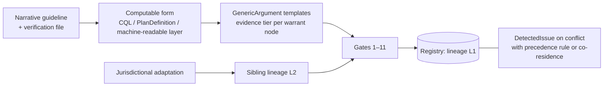

| Item | Specification |
| --- | --- |
| Single path | Every clinical rule enters as narrative → computable form → template; hand-coded rules outside the compiler are prohibited (a rule engine fragment without a compiler signature is refused at load) |
| Criterion granularity | Templates are composed of criteria with ids; recompilation of one criterion produces a diff and an impact preview (which templates, which sentinel attempts diverge) before ratification |
| Plural lineages | Jurisdictional adaptations compile as sibling lineages with their own ratification trails and co-reside; conflicts materialise as DetectedIssue with either a precedence rule or explicit co-residence (rendered side by side, cluster 7) |
| Ontological commitments | The compiler records each guideline's scope and exclusions as machine-readable envelope content; the envelope pin is bound to the lineage |
| Tests | GC-01 rule fragment without compiler signature refused at runtime load · GC-02 single-criterion recompilation reports impact set · GC-03 two lineages with overlapping envelopes and no precedence → DetectedIssue and side-by-side render |

### 4A.11 Cluster 13: attention governance

Volume 9.6 builds the budget and content classes. Delta: class weights, fabric-grounded triggers, governed suppression as arguments, and the My Attention view.

| Item | Specification |
| --- | --- |
| One budget | Per encounter and per clinician; ratified class weights (fragment) for alerts, borderline flags, meta-prompts, fit warnings; spend recorded per render as a ledger row |
| Hard stops | Reserved for the deterministic safety class (arithmetic contraindication with ratified backing); everything else advisory and dismissible |
| Governed suppression | A suppression rule is itself a GenericArgument (claim type suppression): proposed, argued, ratified, versioned; every firing logged; silent suppression impossible (no code path renders less than the budget without a SuppressionRecord) |
| Triggers | Interruptions fire only on fabric-grounded triggers (a fact or attempt event); never on schedule or engagement metrics |
| My Attention | Clinician view of own budget spend and the suppression rules affecting them, computed from the same rows governance reads |
| Tests | AT-01 suppression without a SuppressionRecord → conformance failure · AT-02 interruption emitted by a scheduler → refused (source check) · AT-03 My Attention totals equal governance totals for the same window |

### 4A.12 Cluster 14: watchfulness — theatre detection, argued metrics, anytime-valid monitoring

| Item | Specification |
| --- | --- |
| Theatre detectors | Run over the justification ledger (deviation free text, reflection text, override reasons): boilerplate similarity (near-duplicate ratio per author), duplication clusters, temporal anomalies (bursts at sign-off deadlines), taxonomy-versus-free-text divergence (reason code vs extracted meaning); outputs are flags to human review only; no automatic sanction path exists |
| Argued metrics | Every governance metric is a versioned artefact: purpose, definition, known failure modes, owner; stored as a Measure with these fields mandatory; changed only through the compiler lifecycle |
| Anytime-valid monitoring | Continuous streams (coverage, drift, override rate) monitored with conformal test martingales so that alarm rates are controlled under continuous observation; alarm thresholds in the Measure |
| Detector performance | Precision measured from review outcomes (confirm/reject acts); published per detector |
| Tests | WT-01 detector output cannot write any act other than a review-queue item · WT-02 Measure without failure-modes field refused · WT-03 martingale alarm rate on null-stream fixtures within bound |

### 4A.13 Cluster 15: regulator export, obligations register, reconstruction validation, dispute mode

Volume 10.7 builds the bundle and 10.8 the obligations register. Delta: the meta-level bundle, projection flattenings, standing evidence queries, reconstruction validation, and dispute mode.

| Item | Specification |
| --- | --- |
| Conformity bundle (extends 10.7) | Adds the meta-level bundle: remodeling ledger extract (RemodelCases in window), gap analytics (clusters by target and kind, equity lens), envelope-compliance states (attempts by Fit status), self-description at pinned versions; plus deviation states and adverse-event linkage per decision |
| Projection flattenings | Every export projection ships its flattening: the mapping from fabric states (verdicts, compliance states, fit states) to the external vocabulary used (payer codes, accreditation terms), as a versioned table in the bundle |
| Obligations register (extends 10.8) | Each obligation carries a named owner and a standing evidence query (a saved view or Measure) whose latest result is the evidence; the register page shows freshness per obligation |
| Reconstruction validation | Founding validation: an external reviewer, from exports alone, reconstructs one month of decisions (verdicts, deviation states, outcomes) and the reconstruction is diffed against the ledger; the diff report is a governance artefact; repeated annually |
| Payer acceptance study | Registered as a Study (Volume 2A.3) with a real payer: whether DocumentedJustifiedDeviation is accepted as compliant; result recorded in the obligations register |
| Dispute mode | Structured online-dispute-resolution workflow: `Dispute { kind: PayerDispute \| PatientRecordChallenge \| InterClinicianEscalation, subject: argument or resource ids, parties, evidence bundle (pinned), stages: opened → evidence exchanged → mediated → resolved \| escalated, acts per stage }`; patient-initiated entry from the patient face on any released item |
| Tests | RX-05 bundle contains meta-level sections and flattening tables · RX-06 reconstruction diff on the synthetic practice is empty · RX-07 dispute opened from patient face creates a case with the argument's evidence bundle · RX-08 obligation with stale evidence query (> refresh period) flagged |

### 4A.14 Cluster 16: the low-resource floor as a release gate

Not built elsewhere. Full spec; every item is a release-blocking test.

| Requirement | Specification | Test |
| --- | --- | --- |
| Accessibility | WCAG 2.2 AA on every face; automated checks plus a manual audit per release | LR-01 automated suite zero critical; audit record attached to release |
| Offline with deferred sync | Patient and clinician faces operate offline (edge node, Volume 3A.12 K3); captures queue and sync; conflicts to disagreement rows | OPS-03 |
| Bandwidth and device floors | Stated floors (e.g. 2G-class throughput, 5-year-old low-end device class, 320 px width) tested per release under network shaping | LR-02 all core tasks complete under the floor within budget |
| Linguistic intake as primary modality | Word-chips over keypads for every codebook term; IVR menus that speak codebook terms; SMS parity for intake, reminders, escalation and gap reporting (every loop has an SMS and an IVR transport) | LR-03 each EngagementLoop declares SMS and IVR transports; parity suite runs each loop on each transport |
| Tired-thumb test | One primary action reachable one-handed on the smallest supported device on every screen; measured by a layout rule (primary control inside the reachable zone) | LR-04 layout lint on every screen |
| Resumable, lossless capture | Every form and conversation persists each answer on entry; resumes after interruption or app death at the same item | LR-05 kill the app mid-form; resume shows the same item with prior answers |
| Notification payload law | Notifications carry task prompts and acknowledgements only; no clinical content crosses the bright line; budget set by the patient | LR-06 template with clinical content in a notification channel fails compile; LR-07 patient budget respected |
| Helper mode | Assisted entry by a family member or community health worker recorded as `helper` on the QuestionnaireResponse with the helper's relationship; visible to the clinician | LR-08 helper-entered answers carry the helper tag |
| Language packs | Installed per jurisdiction under lineage rules (class K); codebooks per language ratified | PACK-01 |

### 4A.15 Cluster 17: regulatory profiles enforced at build time

Volume 11.2 builds three profiles by feature exclusion. Delta: the J-3 exclusion list as a conformance suite, startup attestation, boundary monitor, and the claims boundary.

| Item | Specification |
| --- | --- |
| J-3 exclusion by construction | Absent from the compiled artefact: Bayesian inference, conformal wrapping, LLM runtime, device-signal ingestion, prohibited claim types; the schema in that build rejects any warrant type other than guideline-rule (enum variant absent) |
| Conformance suite | For each excluded capability, a test attempts to invoke it (crate absent → link failure; route absent → 404; schema variant absent → parse failure); every attempt must fail |
| Startup attestation | The artefact signs `{build_hash, profile, feature set, SBOM hash}` at startup with the deployment key; the attestation is written to the ledger and exposed at `GET /system/attestation` |
| Boundary monitor | Spine-level monitor alarms (sentinel entry) on any attempt or argument whose claim type or verdict class is out of profile |
| Supply of a different device | Enabling an excluded capability is only possible by building a different profile; there is no runtime switch; SBOM evidence per engine tier is in the manifest (11.2) |
| Claims boundary | A single citation surface lists permitted claims per profile; marketing and in-product copy are linted against it (string tables carry claim ids) |
| Tests | PRF-01 J-3 build linking the Bayesian crate fails · PRF-02 J-3 request with a non-guideline warrant → parse failure · PRF-03 attestation present in ledger at startup and matches manifest · PRF-04 out-of-profile claim type → sentinel alarm · PRF-05 in-product string with a claim id not permitted for the profile fails lint |

### 4A.16 Clusters 18–19: workflow placement and fail-closed sign-off

Volume 9.5 builds the brief within a reading budget; Volume 2.1 the authorisation rule. Delta: the placement law as constraints, the Consult-Prep Composer, the in-consultation act set, the Sign-off Bar and the enumerated bright-line surfaces.

| Item | Specification |
| --- | --- |
| Placement law | Capture before (patient face, point-of-entry validation); synthesise before (Consult-Prep Composer runs on booking and at check-in and produces the released projection); decide during (in-consultation input confined to acts) |
| Consult-Prep Composer | Service that assembles the brief (2A.2 field spec) from released arguments under the 90-second core-read budget; overflow collapses behind drill-down; adding a new signal class never grows the core surface (budget is the invariant, not the item count) |
| In-consultation act set | Exactly: confirm, sign\_off, deviate, report\_gap, judge\_fit, navigate\_conflict, annotate; any other write during an open encounter is a resource write (note, order) that goes through its own module, never a face-level free write |
| Sign-off Bar | The only release control: states exactly what will be released (argument ids and versions), to whom (patient, third party), in which register, at which version; the sign-off act records that statement's hash |
| Bright line surfaces | No patient-reachable surface carries pre-release clinical content: screen, preview, notification, widget, share card, email digest, IVR prompt, SMS; each surface has a conformance test that attempts to render an unreleased or unsigned item |
| Tests | WP-01 brief core surface word count within budget on the 40-item fixture · WP-02 act outside the in-consultation set during an open encounter → refused · WP-03 sign-off act hash equals the Sign-off Bar statement · WP-04 each bright-line surface fixture returns nothing for a flagged item and for a released-unsigned item (eight surfaces, eight tests) |

### 4A.17 Cluster 20: team modes and disagreement held, not averaged

```rust
pub struct MultiAuthorArgument {        // extends ActualArgument: grounds and warrants carry contributor attribution
    pub base: ActualArgument<Flagged | Released>,
    pub contributions: Vec<Contribution>,           // (principal, element path, stance: Supports | Dissents | Abstains, text)
    pub dissent_open: bool,                         // true while any Dissents stance is unresolved
    pub mode: TeamMode,                             // MultidisciplinaryMeeting | WardRound | AsyncSpecialist | LowResourceTeleconsult
}
```

| Rule | Specification |
| --- | --- |
| Attribution | Every ground and warrant in a team argument names who contributed it; dissent is a stance on an element, never overwritten |
| Rendering | The face never renders a team output as unanimous while `dissent_open`; the regulator and clinician registers show contributions and dissent; the patient register shows "your care team" and the released claim only after dissent is closed by acts |
| Community bands | Where a ratified meaning carries community bands (a LinguisticVariable with per-community terms), team views render the spread (band range), not a point |
| Async input | Specialist input is a contribution act with its own pins; the argument version increments |
| Tests | TM-01 render with dissent\_open shows dissent in clinician register (property test) · TM-02 patient release blocked while dissent\_open · TM-03 spread render carries both band edges |

### 4A.18 Cluster 21: patient custody, patient council, separated secondary-use consent

| Item | Specification |
| --- | --- |
| Patient-authored values | Goal and preference resources (2A.1) are patient-authored; their mapping to clinical weightings (a fragment) takes effect only after the remodeling lifecycle (4A.5) with the patient as a party who can see, contest and revoke at each stage |
| Patient-custodied metadata | PIS profiles, Z-reliability components, GapReports, values structures: visible in the patient data view, included in the portability export (3A.12 K2), revocable where granted (revocation is a version with effect on recomputation) |
| Repository routing | Where data lives and under which jurisdiction is a policy fragment; explained in plain language on the patient face; every routing decision ledgered |
| Secondary-use consent | Separate Consent resource with specific scopes; never bundled with care consent in any form or flow; declining changes nothing about care (tested: identical care-path behaviour with and without) |
| Patient council | A chartered party in the trading zone; patient-affecting RemodelCases require a council-stage act before Ratified |
| Tests | PC-01 export contains PIS profile and GapReports authored by the patient · PC-02 revoking a PIS profile recomputes affected memberships · PC-03 care consent form contains no secondary-use scope (schema) · PC-04 identical evaluator outputs for a patient with and without secondary-use consent · MR-03 |

### 4A.19 Repository assets adopted as components

Each asset is adopted by name with an integration spec: what it becomes, the interface it must present, the pin class it enters under, and the test that proves adoption. Sources are the organisation's repositories at the commits recorded in the design corpus scan; public ones are linked.

| Asset | Becomes | Integration spec | Pin class | Adoption test |
| --- | --- | --- | --- | --- |
| openEHR archetype and template mirror ([ckm](https://github.com/Arepo-Medtech/ckm)) | Native two-level authoring model beside the FHIR wire model | `crates/openehr`: load archetypes and templates as the schema source for structured notes, consent requests, care plans, prescriptions, imaging exams, triage; a `Composition` authored against a template is stored as its openEHR canonical JSON (original) and projected to FHIR resources by a generated mapper per template; mapper output round-trips (openEHR → FHIR → openEHR) losslessly for the fields the template declares | S (with the terminology edition) | OE-01 each shipped template has a mapper and a round-trip fixture; OE-02 a structured note authored against the progress-note template yields facts with spans |
| AU medicines transcode compendium (au-medicines-compendium) | Medicines terminology service backing and content-registry dose/pregnancy evidence | Import the compendium's tables (every terminology level → brand, generic, ingredient, subsidy item, therapeutic class, pregnancy-safety and therapeutic-role evidence, cross-system identity) with the method recorded on every link into `terminology` as tier-1 edges (official maps) and into the content registry as evidence rows; nothing fuzzy-matched enters above tier 3 | K (evidence), S (maps) | MC-01 every imported edge carries its method; MC-02 prescribing check resolves brand ↔ generic ↔ pack through tier-1 edges only |
| SynGP500 synthetic note corpus ([syn500](https://github.com/Arepo-Medtech/syn500)) | Development-side corpus for the language engine | Zone label `development`; used for extraction regression and property tests and as the drafting model's style reference; excluded by hash from any scoring corpus (4A.7) | corpus pin (development zone) | FW-01 covers it; SG-01 NER regression suite runs on every language-service build |
| Weak-supervision grounding (design corpus primer) | The assertion and grounding stage contract | `lang-assert` + `lang-map` produce concept-space facts with negation and uncertainty as evidence (assertion enum), not discarded; the differential engine consumes only concept-space facts | engine pins | AST-01; GR-01 a negated finding reaches the differential as an Absent fact with reliability |
| Deterministic coder (det-coder) | The J-1/Tier-1 coding path and the fallback when the ML coder is excluded | `crates/detcoder`: compiled dictionary artefact (pin K) → findings; same input, same output; every output displayable with the matching dictionary entry ("logic displayed to enable verification") | K | DC-01 two-process harness byte-identical; DC-02 each coded finding links its dictionary entry |
| SNOMED CT-AU rule algebra and terminology bridges (data-golf-2026) | Terminology-service test suite and phenotyping rule library | Subsumption and rule-algebra fixtures become `terminology` conformance tests; edition hypotheses and coverage/discrepancy registers become the binding-review queue's seed; the synthetic-encounter bridge becomes a test-data generator | R (rules), test assets | TS-01 subsumption fixtures pass on the pinned edition; PHE-02 |
| Medical knowledge multigraph pipeline (1shot-pipeline) | Authoring-time proposer of candidate edges | Runs only in the authoring environment; proposals enter the binding-review queue as tier-3 candidates with provenance; never a runtime path | none at runtime | KG-01 proposal appears as tier 3; KG-02 no runtime crate depends on it (cargo deny) |
| Ingestion pipeline (prior generation) | Inbound scanned-document path and first de-identification implementation | OCR, section parser and JSON-to-FHIR structuring wrapped as `inbound` adapters under the engine contract (class 2 where learned); de-identification as `deid` first implementation with the residual-identifier audit | W/M for learned parts | MM-01; DEID-02 |
| Portal identity and gate machinery (prior generation) | Clinician identity verification and immutable release records | Practitioner registration lookup, identity federation and verification gate as `admin` onboarding steps (3A.9 H1); attestation eligibility and gate record store as the sign-off preconditions; WORM release bundle as the regulator bundle's storage format | none | ADM-02; RX-06 |
| Engine contract tests and register topology (software home) | The conformance suites and the research protocol | Engine-contract test suite becomes the purity harness fixtures (Volume 7.2); coverage ledger and register become the conformance coverage report; hardening catalogue items become tests in Volumes 5, 8, 10; clinician and patient study protocols become StudyDefinitions (2A.3) | test assets | PUR-03; ST-01 |
| Agentic delivery pipeline (design repo → workpacks → receipts) | Build-side traceability, not runtime | Every requirement in this compendium carries a stable id (the test ids); the pipeline maps id → workpack → commit → execution receipt; the regulatory profile's traceability evidence is the receipt set | none | TR-01 every test id in the compendium has a receipt before release |

### 4A.20 The five disagreements as recorded rulings

| Ruling | Position adopted | Enforced where | Test |
| --- | --- | --- | --- |
| Live differential vs synthesis before | Synthesis before (Consult-Prep Composer); ambient extraction may run live and enrich the record; any in-consultation re-ranking is a new draft through the evaluator under the reading budget; next-best question survives as released gather-information items | 1A.3 op 3; 4A.16; 4A.8 | OP-03; WP-01; CQ-02 |
| Engines to workflow directly vs one gate | Evaluator between reasoning and workflow; every alert, task and draft is an argument | Volume 5; 1A.3 table | N-01..N-09 |
| LLM in the differential | No LLM in posterior computation, ranking or release in any tier; authoring-time proposer under ratification; runtime LLM only in the Tier-3 profile for the named capabilities as derived content marked as such | Volume 5.4; 7.5; 11.2; 4A.15 | ENG-05; PRF-01 |
| "Confidence" as a single number | Six typed signals; lint forbids the word for membership, fit and reliability | Volume 4.3; 4A.3 | SIG-02 |
| Alerts as interruptions vs attention budget | One budget with ratified class weights; hard stops for arithmetic contraindication only; suppression as ratified arguments | Volume 9.6; 4A.11 | AT-01..03 |

### 4A.21 Prioritised fold-in mapped to milestones

| Priority | Fold-in | Built in | Milestone (Volume 11.5) |
| --- | --- | --- | --- |
| 1 | Argument object as spine resource and unit of render | Volume 4; 4A.1 | M1 |
| 2 | Deterministic evaluator as single gate with ledgered traces | Volume 5 | M2 |
| 3 | Full pin set and replay as a release gate; sentinel replay harness | Volume 6.7; 8.6; 4A.1 | M3, M4 |
| 4 | Envelopes, gap reports, conflict records, self-description | Volume 5.2; 4A.5 | M4, M7 |
| 5 | Six-signal registry and vocabulary lint | Volume 4.3; 4A.3 | M1, M7 |
| 6 | Deviation object, compliance vocabulary, non-punitive default | 4A.2 | M7 |
| 7 | Profiles by build-time exclusion with attestation and boundary monitor | Volume 11.2; 4A.15 | M9 |
| 8 | Standing adversary with coverage telemetry | Volume 10.2; 4A.6 | M8 |
| 9 | Evaluation firewall, casebundle, living evaluation, linkage pathway | Volume 10.3; 4A.7 | M8 |
| 10 | Three governed content stores | 4A.9 | M4 |
| 11 | Compiler as only door; plural lineages | Volume 6.3; 4A.10 | M4 |
| 12 | Attention budget and governed suppression | Volume 9.6; 4A.11 | M7 |
| 13 | Linguistic layer | 4A.4 | M4 (artefacts), M7 (render) |
| 14 | Conformal by subgroup, abstention, deferral | 4A.8 | M9 |
| 15 | Low-resource floor as release gate | 4A.14 | M7 |
| 16 | Conformity bundles, obligations queries, reconstruction, dispute mode | 4A.13 | M8 |
| 17 | Fail-closed sign-off and bright line surfaces | 4A.16 | M7 |
| 18 | Placement law and reading budget | Volume 9.5; 4A.16 | M7 |
| 19 | Theatre detection, argued metrics, anytime-valid monitoring | 4A.12 | M8 |
| 20 | Team modes with dissent preserved | 4A.17 | M7 |
| 21 | Patient custody, council, separated consent | 4A.18 | M7 |
| 22 | Repository assets adopted as components | 4A.19 | M4–M9 per asset |

## Volume 5 — The deterministic gate

The evaluator is a pure function from an evaluation request to an attempt record. It runs five stages in a fixed order, stops at the first failing stage, and returns one of three verdicts: released, flagged or held. It performs no I/O, reads no clock, draws no random number, compares no floating-point values and calls no network; everything it needs is inside the request, and the request is hashed before evaluation so that the same request always yields the same attempt.

### 5.1 The request and the attempt

The request carries the draft argument, its template, the applicability envelope of the knowledge fragment the warrant cites, the threshold set in force, the loss matrix in force, the findings snapshot (the facts about the patient the engines saw, as of an effective time), the set of other arguments co-applicable to this encounter, an evaluation context (effective time, policy version, scope-of-practice profile, deployment identifier), and the eight pins. The attempt carries the request hash, the stage trace, the verdict, the evaluator's build pin, and a copy of the eight pins. The attempt is appended to the ledger even when the verdict is held; a held verdict is evidence, not an absence.

### 5.2 The five stages

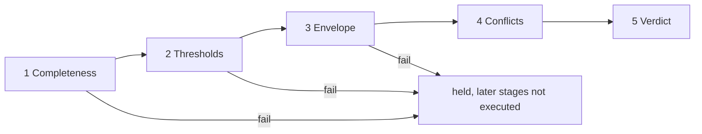

Completeness checks that the draft is structurally whole: all six elements present, every ground resolvable, the warrant fragment admitted and in force at the effective time, every rebuttal pattern from the template checked, every required qualifier signal present, every pin present, and the draft carrying a verdict-class declaration (Section 5.4) and, for generative content, a generation block naming prompt, model and policy pins. A completeness failure is terminal: the verdict is held and stages two to five record not-executed, which is distinct from pass or fail in the trace.

Thresholds compare each qualifier signal against the threshold set in force, kind by kind, using only fixed-point integer comparison. A posterior below its release floor, a coverage set larger than its permitted size, a membership below its term's cut, a reliability below the floor for the claim type, or an ignorance width above the defer ceiling each records a threshold fail; the stage as a whole passes only if every signal passes. The threshold set is compiled knowledge with a version and a signature.

Envelope checks the fit signal against the applicability envelope: the population, age range, setting, comorbidity exclusions and evidence conditions under which the warrant's fragment was written. A fit of in passes. A fit of out or unknown does not fail the stage but marks the attempt as at least flagged; a rule applied outside its envelope may be shown to a clinician with the caveat, but never released as plain advice.

Conflicts examines the co-applicable arguments and the findings snapshot for contradictions. A conflict record is written when two arguments make incompatible claims, when an argument's claim contradicts a fact in the snapshot, or when a rebuttal in one argument fires on the grounds of another. Each conflict record has a four-valued state (true, false, both, neither) so that "two sources disagree" and "no source speaks" are distinguishable. The stage itself never resolves a conflict; it records it and marks the attempt as at least flagged.

Verdict applies the rules in Section 5.3 to the trace so far and produces released, flagged or held. It also applies the single hard-stop rule: an argument whose rebuttal fired on a deterministic contraindication (a coded allergy, a coded absolute contraindication in the pinned medicines reference, an age or pregnancy exclusion coded in the record) is held regardless of every other signal, and the hard stop is written to the sentinel board.

### 5.3 Verdict rules and the loss matrix

The verdict rules are, in order: any stage fail yields held; fit out or unknown, or any conflict record, yields at least flagged; otherwise the decision is three-way by two thresholds derived from a ratified loss matrix. The loss matrix states, for the claim type, the cost of releasing a wrong claim, of flagging a right one, of holding a right one, and so on; the two thresholds are derived from those costs rather than chosen by hand, so that changing the practice's risk appetite is a change to a signed matrix and not to code.

```latex
\alpha = \frac{\lambda_{PN} - \lambda_{BN}}{(\lambda_{PN} - \lambda_{BN}) + (\lambda_{BP} - \lambda_{PP})}, \qquad \beta = \frac{\lambda_{BN} - \lambda_{NN}}{(\lambda_{BN} - \lambda_{NN}) + (\lambda_{NP} - \lambda_{BP})}
```

Here P, B and N are the release, flag and hold actions, and the second subscript is whether the claim is in fact right (P) or wrong (N); a loss is written as the cost of the action given the truth. A posterior at or above alpha releases, below beta holds, and between the two flags. The matrix is ratified by the clinical governance role, versioned, signed and pinned; the evaluator computes alpha and beta in fixed point from the matrix inside the request and never reads them from configuration.

### 5.4 Three verdict classes

Every draft declares which class of thing produced its decisive signals, and the class bounds what the verdict may be.

| Class | What it is | May yield |
| --- | --- | --- |
| 1 Deterministic | Rule evaluation, arithmetic over coded facts, compiled pathway logic | Released, flagged or held |
| 2 Frozen model with declared error rate | A pinned learned model whose validation error rate is published in its pin | Flagged or held; may feed a queue; never released as plain advice |
| 3 Base-model self-judgement | A generative model's assessment of its own or another output | Never a control; may only feed a review queue |

The class is checked at completeness (a draft claiming class 1 while its decisive signal came from a class 2 engine fails) and again at verdict (a class 2 attempt that would otherwise release is capped at flagged). This is the rule that keeps learned models proposing and testing while arithmetic alone releases.

### 5.5 The anti-combiner

No code in the evaluator, and no engine, may combine signals across kinds or across engines into one number. Specifically prohibited are: evidential combination rules that merge belief masses, Bayesian updating of one engine's posterior by another's, averaging, weighted sums, and majority votes. The conformance suite includes a static check that the evaluator crate imports no numeric library beyond fixed-point comparison, and a runtime test that a request with two conflicting posteriors yields a conflict record rather than a merged value. The reason is auditability: a fused number cannot tell a regulator which engine was wrong.

### 5.6 Verification of the evaluator itself

The evaluator is a small crate with a published build hash. Its correctness is established by a check catalogue covering completeness (seventeen checks), thresholds (seven), envelope (five), conflicts (six including the anti-combiner), and verdict (five), each with a positive and a negative fixture; by single-gate negative tests proving that a draft cannot reach a face by any path other than the evaluator; by a two-process purity harness (Volume 7) that runs the same request in two isolated processes and asserts byte-identical attempts; and by property tests that mutate one field of a passing request at a time and assert that the verdict either stays or degrades, never improves. The prior engineering specification of the gate, with each check enumerated, is retained as the source artefact at [the evaluator specification](https://claude.ai/code/artifact/e5c78c7f-1920-4d0c-8e48-46b337343e2f).

### 5.7 Types (build spec)

```rust
#![forbid(unsafe_code)]
// cargo deny: bans on any crate exposing f32/f64 math; no std::time, rand, net in this crate.

pub struct EvaluationRequest {
    pub draft: ArgumentDraft,
    pub template: GenericArgument,
    pub envelope: ApplicabilityEnvelope,
    pub thresholds: ThresholdSet,          // pinned, per claim_type and profile
    pub loss_matrix: LossMatrix,           // pinned, ratified
    pub findings: FindingsSnapshot,        // facts as of effective_time, with hashes
    pub co_applicable: Vec<ArgumentHeader>,
    pub context: EvalContext,              // effective_time, policy_version, profile, deployment_id
    pub pins: PinSet,                      // S,R,K,I,W,F,M,P,U
}

pub struct LossMatrix { pub l_pp: Fixed6, pub l_pn: Fixed6, pub l_bp: Fixed6, pub l_bn: Fixed6, pub l_np: Fixed6, pub l_nn: Fixed6, pub ratified_by: Pin }
pub struct ThresholdSet { pub posterior_floor: Fixed6, pub coverage_max_set: u16, pub membership_cut: Fixed6,
                          pub reliability_floor: Fixed6, pub ignorance_ceiling: Fixed6, pub hard_stop_patterns: Vec<String>, pub pin: Pin }

pub enum StageResult { Pass, Fail(Vec<CheckId>), NotExecuted }
pub struct StageTrace { pub completeness: StageResult, pub thresholds: StageResult, pub envelope: StageResult,
                        pub conflicts: StageResult, pub verdict: StageResult, pub flags: Vec<FlagReason> }
pub enum Verdict { Released, Flagged, Held }

pub struct Attempt { pub attempt_id: Sha256, pub request_hash: Sha256, pub trace: StageTrace, pub verdict: Verdict,
                     pub evaluator: Pin, pub pins: PinSet, pub effective_time: EffectiveTime,
                     pub conflicts: Vec<ConflictRecord>, pub hard_stop: Option<String> }

/// Pure. Total. Never panics on a schema-valid request.
pub fn evaluate(req: &EvaluationRequest) -> Attempt;
```

### 5.8 Check catalogue

| Id | Stage | Check | On fail |
| --- | --- | --- | --- |
| C-01..C-06 | 1 | Each of the six elements present and non-empty where required | held |
| C-07 | 1 | Every ground's resource version exists in the findings snapshot | held |
| C-08 | 1 | Warrant fragment in pin R and in force at effective\_time | held |
| C-09 | 1 | Every backing citation pin resolves | held |
| C-10 | 1 | Every template rebuttal pattern appears with checked = true | held |
| C-11 | 1 | Every required signal kind (per template) present exactly once | held |
| C-12 | 1 | All eight pins present and registered | held |
| C-13 | 1 | Template hash equals draft.template | held |
| C-14 | 1 | Claim type in template's claim types | held |
| C-15 | 1 | Threshold set and loss matrix match claim type and profile | held |
| C-16 | 1 | Generation block present when verdict\_class = 3 | held |
| C-17 | 1 | Declared verdict\_class consistent with engine pin's registered class | held |
| T-01 | 2 | Posterior ≥ posterior\_floor | fail |
| T-02 | 2 | Coverage set size ≤ coverage\_max\_set | fail |
| T-03 | 2 | Membership ≥ membership\_cut for the term the claim relies on | fail |
| T-04 | 2 | Every ground reliability ≥ reliability\_floor | fail |
| T-05 | 2 | Fit signal present when template requires envelope check | fail |
| T-06 | 2 | Ignorance ≤ ignorance\_ceiling, else flag reason `ignorance_defer` | flag |
| T-07 | 2 | Comparisons are same-kind only (static assertion) | build fail |
| E-01 | 3 | Fit = In → pass | — |
| E-02 | 3 | Fit = Out → flag `out_of_envelope` with attributes | flag |
| E-03 | 3 | Fit = Unknown → flag `envelope_unknown` | flag |
| E-04 | 3 | Envelope pin equals warrant fragment's declared envelope | held |
| E-05 | 3 | Effective\_time within envelope's validity | held |
| K-00 | 4 | Anti-combiner: no cross-kind or cross-engine merge (static + runtime) | build fail / held |
| K-01 | 4 | Co-applicable claim contradicts this claim → ConflictRecord(both) | flag |
| K-02 | 4 | Snapshot fact contradicts claim → ConflictRecord | flag |
| K-03 | 4 | Rebuttal fired on another argument's grounds → ConflictRecord | flag |
| K-04 | 4 | Duplicate claim already released and current → ConflictRecord(duplicates) | flag |
| K-05 | 4 | No evidence either way → ConflictRecord(neither) recorded, no flag | — |
| V-00 | 5 | Hard stop: any fired rebuttal in hard\_stop\_patterns | held + sentinel |
| V-01 | 5 | Any stage Fail → held | held |
| V-02 | 5 | Any flag reason → at least flagged | flagged |
| V-03 | 5 | Verdict-class cap: class 2 → max flagged; class 3 → flagged, queue only | flagged |
| V-04 | 5 | Three-way decision by alpha/beta from loss matrix | released / flagged / held |

### 5.9 Stage 5 (algorithm)

```text
function stage5(trace, draft, lm, hard_stop):
    if hard_stop:                       return Held      -- V-00 (also writes sentinel via attempt.hard_stop)
    if any stage in trace is Fail:      return Held      -- V-01
    cap = match draft.verdict_class { 1 => Released, 2 => Flagged, 3 => Flagged }   -- V-03
    if trace.flags non-empty:           return min(Flagged, cap)                     -- V-02
    alpha = fx_div(lm.l_pn - lm.l_bn, (lm.l_pn - lm.l_bn) + (lm.l_bp - lm.l_pp))     -- Fixed6 arithmetic, checked
    beta  = fx_div(lm.l_bn - lm.l_nn, (lm.l_bn - lm.l_nn) + (lm.l_np - lm.l_bp))
    p = decisive_posterior(draft)       -- the posterior the template names as decisive; absent => Flagged
    if p >= alpha: return min(Released, cap)
    if p <  beta:  return Held
    return Flagged
```

Early termination: a Fail at stage 1 sets stages 2–5 to NotExecuted and returns Held; stages 3 and 4 never Fail, they only add flags or held-class errors listed above.

### 5.10 Single-gate negative tests

| Test | Attempted path | Expect |
| --- | --- | --- |
| N-01 | Engine writes directly to `actual_argument` | Permission denied (role has INSERT only via evaluator) |
| N-02 | Face reads a draft from the orchestrator queue | No route exists; queue not exposed |
| N-03 | Attempt row inserted with verdict = released and trace containing a Fail | CHECK constraint on trace/verdict consistency rejects |
| N-04 | Argument inserted whose attempt\_id does not exist | FK violation |
| N-05 | Render called on `ActualArgument<Held>` | Does not compile |
| N-06 | Evaluator invoked with request lacking pins | Schema rejects before `evaluate` |
| N-07 | Cached released projection served after supersession | Cache key includes argument id; superseded id no longer current, projection dropped |
| N-08 | Two evaluator builds, same request | Different attempt\_id, identical verdict and trace |
| N-09 | Loss matrix without ratified\_by pin | C-15 fails; held |

## Volume 6 — The knowledge plane

All clinical knowledge the runtime uses (guideline logic, thresholds, codebooks, applicability envelopes, terminology bindings, evidence, templates) exists at runtime only as signed, content-addressed fragments in a content registry, and the only way a fragment enters the registry is through a compiler that runs eleven gates. There is no administrative edit path, no hot patch and no environment variable that changes clinical behaviour.

### 6.1 Sources and their admission

| Source class | What it contributes | Admission evidence required |
| --- | --- | --- |
| Guideline text | Pathway logic, recommendations, thresholds, envelopes | A verification file per guideline in which every extracted claim carries a verdict against its quoted source text |
| Medicines reference | Contraindications, interactions, dose limits, subsidy conditions | Licence class recorded; edition pinned; contraindications flagged as deterministic |
| Terminology edition | Concept identifiers, hierarchy, maps between code systems | Edition pinned by release date; binding review queue cleared for any new binding |
| Evidence library | Citations, study grades, effect sizes | Stable citation locator; grade from the fixed scale; licence class |
| Codebooks | Linguistic variables and membership functions for fuzzy terms | Published in a standard fuzzy-markup form with author and review |
| Threshold sets and loss matrices | Release floors, defer ceilings, cost matrices per claim type | Ratification act by the governance role |
| Templates and render templates | Generic arguments; register templates | Render-invariance property test passed |

### 6.2 Guideline verification

A guideline enters as a structured file listing each claim the compiler will rely on, the source location the claim was taken from, the verbatim source text, and a verdict. The verdict vocabulary is closed: pass (the claim is quoted and asserted in the source), fail (the source contradicts it), not quoted (the claim has no verbatim anchor), not asserted (the text exists but does not assert the claim), searched and not found, attested but not sourced (a clinician vouches without a document), pass by image transcription, licensed source not quoted (the source may not be reproduced but the anchor is recorded), and pass by anchored paraphrase. Only pass, pass by image transcription and pass by anchored paraphrase admit a claim to release-capable fragments; attested but not sourced admits it to flag-only fragments; every other verdict blocks the claim. Numbers in claims are checked by a guard that compares every numeral in the claim against the numerals in the source text and blocks on mismatch. The verifier's own class (whether a single reviewer, two reviewers, or a calibrated panel) is recorded on the file and becomes the reliability signal on every warrant drawn from it.

### 6.3 The eleven compiler gates

1. Schema: the fragment validates against the fragment schema for its class.
2. Terminology: every code resolves in the pinned edition and is active at the edition date.
3. Verification: every claim the fragment relies on has an admitting verdict (Section 6.2).
4. Numbers: the number guard passes for every numeral.
5. Envelope: the fragment declares an applicability envelope with population, age, setting and exclusions.
6. Backing: every warrant names at least one evidence reference with a grade.
7. Citation pinning: every citation resolves to a stable locator and its hash is recorded.
8. Licence: the fragment's licence class permits its intended use and rendering register.
9. Conflict scan: the fragment is checked against fragments already in force for contradictory recommendations under overlapping envelopes; a contradiction is admitted only with an explicit precedence rule.
10. Determinism: the fragment's logic compiles to the rule engine's intermediate form with no non-deterministic construct.
11. Signature: the fragment is signed by the compiler key and by the ratifying role; the content hash becomes its identifier.

A fragment that fails any gate is rejected with the gate's report; there is no override. A passing fragment is written to the content registry with an effective-from date and, optionally, an effective-to date; the evaluator's completeness stage checks in-force status against the request's effective time.

### 6.4 The terminology graph

The terminology layer is a graph over the pinned edition plus the practice's own bindings. Nodes are concepts; edges carry a predicate from a closed register (is-a, has finding site, has causative agent, maps-to across systems, subsumes-in-pathway, and so on) and a tier. Tiers separate edges that come from the edition itself (tier 0), from an official map (tier 1), from a reviewed local binding (tier 2), and from a proposed binding awaiting review (tier 3). The rule that governs use is simple: the evaluator may rely on tiers 0 to 2 for release-capable arguments and on tier 3 only for flagged ones. A binding review queue holds tier 3 edges with the evidence for each; approval moves an edge to tier 2 as a compiled fragment, so terminology changes are as auditable as guideline changes. The graph is materialised as an embedded analytical database on each node, rebuilt from the registry on every pin change and queried for lookup, expansion, subsumption and route scoring within the 1 ms budget.

### 6.5 Codebooks and thresholds

Fuzzy terms used in grounds and claims ("elevated", "long-standing", "borderline") are defined in codebooks as linguistic variables with membership functions over a named measurement, expressed in a standard fuzzy-markup form. A membership signal in a qualifier always names the codebook and the term, so "borderline" is never a bare word. Threshold sets are per claim type and per profile; they carry the release floor for each signal kind, the coverage set size limit, the ignorance defer ceiling and the hard-stop list. Both codebooks and threshold sets are fragments under Section 6.3 and are pinned in every attempt.

### 6.6 The evidence library

Evidence is stored as structured citations following the evidence-based-medicine resource profiles for interoperable records: the study, its design, the outcome measured, the effect with its interval, and the grade under the fixed scale. A warrant's backing references evidence by identifier; the compiler pins the hash of the evidence record at admission so that a later correction to the evidence creates a new record and a visible supersession, never a silent change under an existing warrant.

### 6.7 The eight-element pin set

Every attempt records the content hashes of the eight things it depended on: (S) the schema and terminology edition, (R) the template and rule fragments, (K, I) the knowledge library and its index, (W) frozen model weights, (F) the feedback overlay in force, (M) the base model identity, (P) the prompt and policy set, (U) the render templates. The pin registry is a table mapping each hash to its artefact location, class, effective dates and signature. A replay resolves the eight pins, reconstructs the request and re-runs the evaluator; a replay that cannot resolve a pin is a governance incident, which is why artefacts under a pin are never deleted, only retired.

### 6.8 The feedback overlay

Clinician acts (accept, reject with reason, override, deviation) are aggregated offline into a feedback overlay: per fragment, per claim type and per profile, the observed acceptance and override rates with their imprecise-Dirichlet intervals. The overlay is compiled like any other fragment and pinned as F. It may raise a flag rate (a fragment with high override becomes flag-only) but may never lower a threshold; loosening requires a new ratified threshold set. This keeps learning from production one-directional toward caution until a human ratifies otherwise.

```latex
\left[ \frac{n_i}{N + s},\ \frac{n_i + s}{N + s} \right]
```

The interval above is the imprecise-Dirichlet estimate for the rate of outcome i after N observations with prior strength s; its width is the ignorance signal the overlay reports.

### 6.9 Fragment and compiler (build spec)

```rust
pub enum FragmentClass { Template, Rule, Envelope, ThresholdSet, LossMatrix, Codebook, Binding, Evidence, RenderTemplate, FeedbackOverlay }

pub struct Fragment {
    pub class: FragmentClass,
    pub body: serde_json::Value,           // class-specific schema
    pub envelope: Option<ApplicabilityEnvelope>,
    pub claims: Vec<ClaimRef>,             // (verification_file, claim_index) this fragment relies on
    pub citations: Vec<CitationRef>,
    pub licence: LicenceClass,             // Open | Licensed | LicensedNoQuote | Internal
    pub provenance: Provenance,            // must not include an evaluation-zone artefact (gate 1)
    pub effective_from: Date, pub effective_to: Option<Date>,
}

pub struct Admitted { pub pin: Pin, pub class: PinClass, pub compiler_sig: Signature, pub ratifier_sig: Signature }

pub fn compile(f: &Fragment, registry: &Registry, edition: &Edition) -> Result<Admitted, GateReport>;
// GateReport { gate: u8 (1..=11), failures: Vec<String> }  -- first failing gate stops; no override path
```

Command-line surface: `compile <fragment.json> --edition <pin> --registry <url> --ratifier-key <kms-ref>`; exit 0 writes the pin and the two signatures; exit 1 prints the gate report.

### 6.10 Verification file format

```text
<guideline-slug>.verification.json
{
  "guideline": "<slug>", "source_locator": "<stable URL or DOI>", "source_hash": "<sha256>",
  "verifier_class": "single_uncalibrated | dual | calibrated_panel",
  "claims": [
    { "index": 0,
      "claim": "Start at 25 mg daily and titrate at 2-week intervals",
      "source": "section 4.2 para 3",
      "source_text": "<verbatim>",
      "verdict": "pass | fail | not_quoted | not_asserted | searched_not_found | attested_not_sourced | pass_image_transcription | licensed_source_not_quoted | pass_paraphrase_anchored",
      "numbers_checked": true }
  ]
}
```

| Verdict | Admits to | Reliability on warrant |
| --- | --- | --- |
| pass, pass\_image\_transcription, pass\_paraphrase\_anchored | Release-capable fragments | From verifier\_class table (single 0.80, dual 0.90, panel 0.95 as shipped defaults) |
| attested\_not\_sourced | Flag-only fragments | 0.60 |
| licensed\_source\_not\_quoted | Release-capable if source\_hash verified; body not rendered in patient register | As verifier\_class |
| fail, not\_quoted, not\_asserted, searched\_not\_found | Blocked | — |

Number guard: every numeral token in `claim` must appear in `source_text` (after unit normalisation); a mismatch sets `numbers_checked: false` and the compiler treats the verdict as fail.

### 6.11 Terminology graph (build spec)

```sql
-- embedded analytical database, rebuilt per pin change; read-only at runtime
CREATE TABLE concept (id BIGINT PRIMARY KEY, fsn TEXT, active BOOLEAN, edition_pin BLOB);
CREATE TABLE edge (
  src BIGINT, dst BIGINT, predicate TEXT,        -- closed register: is_a, finding_site, causative_agent, maps_to, pathway_subsumes, ...
  tier SMALLINT CHECK (tier BETWEEN 0 AND 3),    -- 0 edition, 1 official map, 2 reviewed local, 3 proposed
  weight INTEGER,                                 -- Fixed6; used by route_score
  fragment_pin BLOB,                              -- for tiers 2-3
  PRIMARY KEY (src, dst, predicate)
);
CREATE INDEX edge_src ON edge(src, predicate); CREATE INDEX edge_dst ON edge(dst, predicate);
```

```text
route_score(a, b, max_depth = 6):
    Dijkstra over edge with cost = (1 - weight) + tier_penalty[tier]   -- penalties {0:0, 1:0.05, 2:0.15, 3:0.50}, Fixed6
    return { path, cost, max_tier_on_path }   -- max_tier drives the reliability signal of any code drawn from it
```

Rule zero of the graph: an edge with tier 3 on the path caps any argument that used the path at flagged.

### 6.12 Acceptance tests

| Test | Given | Expect |
| --- | --- | --- |
| KP-01 | Fragment with one code inactive at edition date | Gate 2 report; not admitted |
| KP-02 | Fragment relying on a claim with verdict not\_quoted | Gate 3 report |
| KP-03 | Claim "25 mg" with source text "20 mg" | numbers\_checked false; gate 4 report |
| KP-04 | Fragment without envelope | Gate 5 report |
| KP-05 | Two fragments with contradictory recommendations, overlapping envelopes, no precedence | Gate 9 report |
| KP-06 | Rule using `now()` | Gate 10 report |
| KP-07 | Admitted fragment | Pin in registry; both signatures verify; effective dates set |
| KP-08 | `route_score` path includes a tier-3 edge | max\_tier 3 returned; downstream draft flagged (SVC-02) |
| KP-09 | Feedback overlay attempts to lower posterior\_floor | Compiler rejects: overlay may only raise flag rates |

## Volume 7 — The engine plane

An engine is a pure function `(TypedSignals, PinnedKnowledge, EvalContext) -> ArgumentDraft`. It runs in its own process behind one contract, has no I/O, and is proven pure by a two-process harness before it may be registered.

### 7.1 Engine contract (interface)

```rust
/// Implemented by every engine. Invoked only by the orchestrator, never by a face.
pub trait Engine {
    /// Stable identity; must equal the pin (W or M) recorded in every draft it emits.
    fn pin(&self) -> Pin;
    /// Verdict class the engine's decisive signals belong to (Volume 5 §5.4).
    fn verdict_class(&self) -> VerdictClass;   // Deterministic | FrozenModel | SelfJudgement
    /// Claim types this engine may draft. Orchestrator rejects drafts outside this set.
    fn claim_types(&self) -> &'static [ClaimType];
    /// Pure. Same inputs => byte-identical output.
    fn draft(&self, input: EngineInput) -> Result<ArgumentDraft, EngineError>;
}

pub struct EngineInput {
    pub signals:   TypedSignals,        // facts + span links + source reliability, as of effective_time
    pub knowledge: PinnedKnowledge,     // fragments resolved from pins R,K,I; read-only
    pub context:   EvalContext,         // effective_time, policy_version, profile, deployment_id
    pub versions:  VersionSet,          // the 8 pins the orchestrator resolved
}

pub enum EngineError { OutOfEnvelope(FitJudgment), MissingSignal(SignalKind), Abstain(AbstainReason) }
```

| Contract clause | Enforcement | Test id |
| --- | --- | --- |
| No I/O, clock, RNG, network | seccomp profile on the engine process: allow read/write on inherited pipes only; `clock_gettime`, `getrandom`, `socket`, `open` denied | PUR-01 |
| No float in emitted signals | Draft schema forbids JSON numbers with fraction; all signals are `Fixed6` integers | PUR-02 |
| Determinism | Two-process harness (§7.2) byte-compares outputs | PUR-03 |
| Draft validates | JSON Schema for `ArgumentDraft` at the process boundary; invalid = engine fault, not a held argument | PUR-04 |
| Claim type in declared set | Orchestrator check before evaluator | PUR-05 |
| Verdict class declared | Draft carries `verdict_class`; must equal `Engine::verdict_class()` | PUR-06 |

### 7.2 Purity harness (procedure)

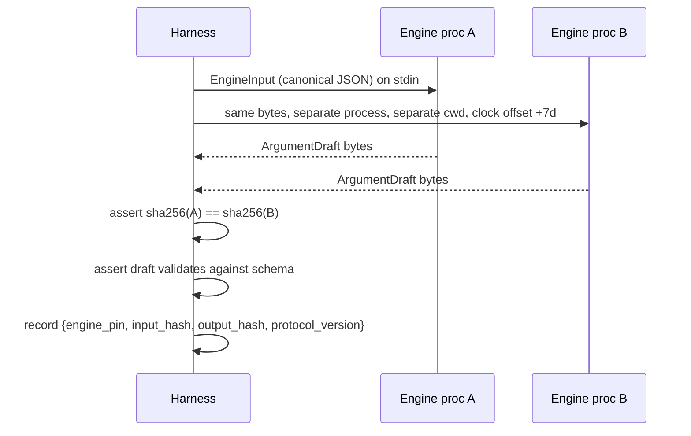

Run on every fixture in the engine's conformance set (minimum 50 fixtures per claim type) and on 1,000 randomly generated inputs from the corruption engine (Volume 10). Any mismatch fails registration. The harness protocol version is pinned alongside the engine.

### 7.3 Engine families

| Family | Input | Output signals | Verdict class | Reference implementation | Runtime |
| --- | --- | --- | --- | --- | --- |
| Rule / pathway | Coded facts; compiled pathway logic in a clinical-quality-language intermediate form | Fit; Reliability (from fragment) | 1 | CQL engine executing compiled ELM | JVM sidecar, seccomp-wrapped |
| Fuzzy layer | Measurements; codebook (fuzzy markup) | Membership | 1 | Native fixed-point membership evaluation | Core |
| Bayesian differential | Coded findings; pinned network structure and CPTs | Posterior; Ignorance (credal width when CPTs carry intervals) | 2 | Discrete BN inference (variable elimination) | Python sidecar or native port |
| Conformal / Venn–Abers wrapper | Any point-scoring model plus calibration set | Coverage; Ignorance (Venn–Abers width) | 2 | Split-conformal and Venn–Abers calibration | Wraps any class-2 model |
| Extractor | Document bytes; pinned extractor model | Reliability per fact; span links | 2 | Frozen NER/relation model | Sidecar, seccomp-wrapped |
| Fit engine | Patient facts; fragment envelope | Fit (In / Out / Unknown) with attribute list | 1 | Envelope predicate evaluation | Core |
| Register-fidelity tester | Rendered text; source argument | Pass/fail per element | 2 | Frozen NLI model | Test-only, never in request path |
| Backing-entailment tester | Warrant text; cited evidence text | Entailment score | 2 | Frozen NLI model | Compiler gate 6 support, flag-only |
| Generative assistant | Prompt; policy; grounded facts | None (drafts text under §7.5) | 3 | Base model behind policy | Never a control |

Class-2 engines must ship with a validation report in their pin: dataset hash, n, sensitivity, specificity, calibration slope and intercept, and the conformal coverage achieved at the declared level.

### 7.4 Abstention and question ordering

When a draft cannot reach the release floor, the engine returns `Abstain` with the single next fact that would most reduce ignorance. Selection is by expected information gain over the candidate unknown facts, computed in fixed point from the pinned model:

```latex
\mathrm{EIG}(f) = H(C) - \sum_{v \in \mathrm{vals}(f)} P(f = v)\, H(C \mid f = v)
```

```text
function next_question(model, known_facts, candidate_facts, budget):
    best = null
    for f in candidate_facts where cost(f) <= budget:
        g = EIG(f) computed with fixed-point entropy tables
        if g > best.gain: best = (f, g)
    return best  // null => abstain outright: claim cannot be advanced within budget
```

The ordered list of questions is itself an argument (claim type: pre-intake question) and passes the evaluator; cost is a compiled table (seconds for the patient, invasiveness class, price).

### 7.5 Bounded generative loop

A generative model may draft text only inside this loop, and its output is never a control.

```mermaid
sequenceDiagram
  participant O as Orchestrator
  participant G as Generative engine (class 3)
  participant T as Class-2 testers
  participant E as Evaluator
  O->>G: prompt pin P, grounded facts, policy
  G-->>O: candidate text + generation block {P, M, policy}
  O->>T: register fidelity, backing entailment, claim extraction
  T-->>O: pass/fail per element
  alt any fail and iterations < 3
    O->>G: retry with failure list (same P)
  else pass
    O->>E: draft with generation block
    E-->>O: flagged (class 3 cap) => review queue
  else 3 failures
    O->>O: abandon; log attempt; no draft emitted
  end
```

Bounds: maximum 3 iterations; total token budget per encounter from policy; no tool calls from the model; grounded facts are the only patient data in the prompt; the generation block is mandatory for completeness (Volume 5 check C-16).

### 7.6 Acceptance tests

| Test | Given | Expect |
| --- | --- | --- |
| ENG-01 | Engine binary registered without harness record | Registration refused |
| ENG-02 | Engine emits posterior 0.73 as float | Schema fault at boundary; draft discarded |
| ENG-03 | Same input, two processes, clocks 7 days apart | Identical draft hash |
| ENG-04 | Class-2 engine draft declares class 1 | Completeness fail C-17 |
| ENG-05 | Generative loop fails testers 3 times | No draft; attempt log entry only |
| ENG-06 | `next_question` with empty affordable candidates | Abstain; argument not drafted |
| ENG-07 | Engine attempts `socket()` | Process killed by seccomp; orchestrator records fault |

## Volume 8 — Ledger, replay and provenance

The ledger is a set of insert-only tables with UPDATE and DELETE revoked from every role, a per-patient hash chain maintained by trigger, a periodic Merkle root anchored outside the system, and read policies that enforce Volume 2's authorisation rule at the row level.

### 8.1 Schema (PostgreSQL 16)

```sql
CREATE TABLE pin_registry (
  pin           BYTEA PRIMARY KEY,            -- sha256 of artefact
  class         TEXT NOT NULL CHECK (class IN ('S','R','K','I','W','F','M','P','U')),
  locator       TEXT NOT NULL,                -- content-addressed store path
  effective_from TIMESTAMPTZ NOT NULL,
  effective_to   TIMESTAMPTZ,
  signature     BYTEA NOT NULL,
  retired       BOOLEAN NOT NULL DEFAULT FALSE -- never deleted
);

CREATE TABLE generic_argument (
  template_hash BYTEA PRIMARY KEY,
  claim_type    TEXT NOT NULL,
  body          JSONB NOT NULL,
  pin_r         BYTEA NOT NULL REFERENCES pin_registry(pin)
);

CREATE TABLE attempt (
  attempt_id    BYTEA PRIMARY KEY,            -- sha256(request_hash || evaluator_pin)
  request_hash  BYTEA NOT NULL,
  evaluator_pin BYTEA NOT NULL REFERENCES pin_registry(pin),
  verdict       TEXT NOT NULL CHECK (verdict IN ('released','flagged','held')),
  trace         JSONB NOT NULL,               -- 5 stages: pass|fail|not_executed + check ids
  pins          JSONB NOT NULL,               -- {S,R,K,I,W,F,M,P,U}
  effective_time TIMESTAMPTZ NOT NULL,
  created_at    TIMESTAMPTZ NOT NULL DEFAULT now()
);

CREATE TABLE actual_argument (
  argument_id   BYTEA PRIMARY KEY,            -- sha256(canonical draft)
  patient_id    UUID NOT NULL,
  encounter_id  UUID,
  template_hash BYTEA NOT NULL REFERENCES generic_argument(template_hash),
  attempt_id    BYTEA NOT NULL REFERENCES attempt(attempt_id),
  state         TEXT NOT NULL CHECK (state IN ('held','flagged','released')),
  verdict_class SMALLINT NOT NULL CHECK (verdict_class IN (1,2,3)),
  body          JSONB NOT NULL,               -- claim, grounds, warrant, backing, qualifier, rebuttals
  supersedes    BYTEA REFERENCES actual_argument(argument_id),
  seq           BIGINT NOT NULL,              -- per-patient sequence
  prev_hash     BYTEA NOT NULL,
  this_hash     BYTEA NOT NULL,
  UNIQUE (patient_id, seq)
);

CREATE TABLE argument_defeater (
  argument_id BYTEA NOT NULL REFERENCES actual_argument(argument_id),
  pattern_id  TEXT NOT NULL,
  checked     BOOLEAN NOT NULL,
  fired       BOOLEAN NOT NULL,
  fact_ref    TEXT,
  PRIMARY KEY (argument_id, pattern_id)
);

CREATE TABLE conflict_record (
  conflict_id BYTEA PRIMARY KEY,
  attempt_id  BYTEA NOT NULL REFERENCES attempt(attempt_id),
  left_ref    TEXT NOT NULL, right_ref TEXT NOT NULL,
  predicate   TEXT NOT NULL,                  -- closed vocabulary, decision D-04
  belnap      TEXT NOT NULL CHECK (belnap IN ('true','false','both','neither'))
);

CREATE TABLE act (
  act_id      BYTEA PRIMARY KEY,
  argument_id BYTEA REFERENCES actual_argument(argument_id),
  patient_id  UUID NOT NULL,
  principal   TEXT NOT NULL,
  kind        TEXT NOT NULL CHECK (kind IN ('accept','reject','defer','sign_off','override','deviation','break_glass','order_transition')),
  reason      TEXT,
  payload     JSONB,
  seq         BIGINT NOT NULL,
  prev_hash   BYTEA NOT NULL, this_hash BYTEA NOT NULL,
  created_at  TIMESTAMPTZ NOT NULL DEFAULT now(),
  UNIQUE (patient_id, seq)
);

CREATE TABLE anchor (
  anchor_id   BIGSERIAL PRIMARY KEY,
  window_end  TIMESTAMPTZ NOT NULL,
  merkle_root BYTEA NOT NULL,
  external_ref TEXT NOT NULL,                 -- receipt from the external anchor (D-08)
  created_at  TIMESTAMPTZ NOT NULL DEFAULT now()
);

REVOKE UPDATE, DELETE, TRUNCATE ON ALL TABLES IN SCHEMA ledger FROM PUBLIC, spine_gateway, evaluator, face_patient, face_clinician, face_governance;
GRANT INSERT ON attempt, actual_argument, argument_defeater, conflict_record TO evaluator;
GRANT INSERT ON act TO face_clinician, face_governance;
GRANT INSERT ON pin_registry, generic_argument TO compiler;
```

### 8.2 Hash chain (trigger)

```sql
CREATE FUNCTION ledger.chain() RETURNS trigger LANGUAGE plpgsql AS $$
DECLARE prev BYTEA; nxt BIGINT;
BEGIN
  SELECT this_hash, seq INTO prev, nxt FROM actual_argument
   WHERE patient_id = NEW.patient_id ORDER BY seq DESC LIMIT 1 FOR UPDATE;
  NEW.seq       := COALESCE(nxt, 0) + 1;
  NEW.prev_hash := COALESCE(prev, '\x00'::bytea);
  NEW.this_hash := sha256(NEW.prev_hash || NEW.argument_id || ledger.jcs(NEW.body));
  RETURN NEW;
END $$;
CREATE TRIGGER chain BEFORE INSERT ON actual_argument FOR EACH ROW EXECUTE FUNCTION ledger.chain();
-- identical trigger on act, chained on (patient_id, seq)
```

`ledger.jcs` is the JSON canonicalisation (RFC 8785) implemented in the core and exposed as a trusted extension so the database and the core hash identically. Every 10 minutes a job computes the Merkle root over all `this_hash` values written since the last anchor and inserts an `anchor` row with the external receipt.

### 8.3 Row-level policies (authorisation rule, second enforcement)

```sql
ALTER TABLE actual_argument ENABLE ROW LEVEL SECURITY;
CREATE POLICY p_gateway ON actual_argument FOR SELECT TO spine_gateway
  USING (state <> 'held');
CREATE POLICY p_patient ON actual_argument FOR SELECT TO face_patient
  USING (state = 'released' AND EXISTS (
    SELECT 1 FROM act a WHERE a.argument_id = actual_argument.argument_id AND a.kind = 'sign_off'));
CREATE POLICY p_clinician ON actual_argument FOR SELECT TO face_clinician
  USING (state IN ('released','flagged'));
CREATE POLICY p_governance ON actual_argument FOR SELECT TO face_governance
  USING (state IN ('released','flagged') OR current_setting('app.break_glass', true) = 'on');
```

Break-glass sets the session variable only after inserting a `break_glass` act with a reason; the act is on the sentinel board.

### 8.4 Supersession

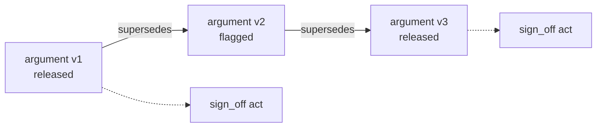

Rules: a superseding argument names exactly one predecessor; the current argument for a (patient, claim subject) is the one no other argument supersedes; a sign-off act on a superseded argument does not carry forward; faces render the current argument and show "superseded" history on demand.

### 8.5 Standard projections

| Ledger object | Interoperable projection | Notes |
| --- | --- | --- |
| Released or flagged argument | GuidanceResponse referencing a PlanDefinition | Qualifier signals as extensions; rebuttals as DetectedIssue references |
| Template | PlanDefinition | Version = template hash |
| Attempt | Provenance with a detached JSON web signature | Pins as Provenance.entity, one per class |
| Conflict record | DetectedIssue | Belnap state as code |
| Act | AuditEvent (basic audit log profile) | Principal, kind, reason |
| Patient consent | Consent | Input to evaluator, not a UI gate |
| Pre-intake answers | QuestionnaireResponse | Span links as extensions |
| Evidence | EBM-on-FHIR Evidence, EvidenceVariable, Citation | Hash pinned at admission |

Projections are generated on read from the ledger and cached; the cache holds released content only.

### 8.6 Replay as re-verification

```text
function replay(attempt_id):
    a      = ledger.attempt[attempt_id]
    pins   = resolve_all(a.pins)                     -- any unresolved pin => INCIDENT
    req    = reconstruct_request(a.request_hash, pins) -- from content store by hash
    assert sha256(jcs(req)) == a.request_hash
    ev     = load_evaluator(a.evaluator_pin)
    a2     = ev.evaluate(req)
    assert a2.trace == a.trace and a2.verdict == a.verdict
    return ReplayReport{ attempt_id, identical: true, evaluator_pin }
```

Replay runs nightly on a 1% sample and on demand for any attempt in a regulator bundle. A non-identical replay is a sentinel event.

### 8.7 Acceptance tests

| Test | Given | Expect |
| --- | --- | --- |
| LED-01 | `UPDATE actual_argument` as any role | Permission denied |
| LED-02 | Insert two arguments for one patient | `seq` 1,2 and `this_hash(2)` includes `this_hash(1)` |
| LED-03 | Held argument read as spine\_gateway | Zero rows |
| LED-04 | Released argument without sign-off read as face\_patient | Zero rows |
| LED-05 | Tamper one body byte via superuser, run chain verifier | Verifier reports break at that seq |
| LED-06 | Replay attempt with retired but present pin | Identical trace |
| LED-07 | Replay attempt with missing pin artefact | INCIDENT raised; no verdict emitted |

## Volume 9 — Rendering and attention

Rendering turns a released or flagged argument into text for one of three registers without changing its meaning, and the attention layer decides which arguments a clinician sees inside a fixed budget. Both are governed: templates are pinned (U), suppression policy is a versioned fragment, and every suppression is counted.

### 9.1 Why registers and a budget

The same argument must read differently to a patient, a clinician and a regulator, but it must not say different things. Separating register (who is reading) from content (what is claimed) lets the platform prove, by test, that the patient never receives a softened claim or a dropped rebuttal. The attention budget exists because alert fatigue is a documented cause of harm; a system that shows everything is a system in which nothing is read.

### 9.2 Register templates and element maps

```rust
pub enum Register { Clinician, Patient, Regulator }

/// Pinned (class U). One per (claim_type, register, locale).
pub struct RenderTemplate {
    pub pin: Pin,
    pub claim_type: ClaimType,
    pub register: Register,
    pub element_map: ElementMap,     // every argument element -> a slot; no element unmapped
    pub body: String,                // template with {{slot}} placeholders only; no logic
}

pub struct ElementMap {
    pub claim: Slot, pub grounds: Slot, pub warrant: Slot, pub backing: Slot,
    pub qualifier: [Slot; 6],        // one slot per signal kind, in fixed order
    pub rebuttals: Slot,             // list slot; count must equal argument.rebuttals.len()
    pub disposition: Slot,           // verdict + flag reasons
}

pub fn render(arg: &ActualArgument<Released | Flagged>, t: &RenderTemplate) -> Rendered;
```

| Register | Reading level | Qualifier presentation | Rebuttals |
| --- | --- | --- | --- |
| Clinician | Professional | Six signals as labelled values with kind name | Full list, fired ones first |
| Patient | Plain language, grade 8 | Each signal as one fixed phrase from a locale table keyed by signal band | Full list, phrased as "this may not apply if" |
| Regulator | Technical | Raw fixed-point values plus pins | Full list plus pattern ids and checked flags |

### 9.3 Render-invariance property

```text
for each fixture argument A, for each register R:
    out = render(A, template[A.claim_type, R])
    parsed = inverse_map(out, template.element_map)      -- recover elements from slots
    assert parsed.claim        == A.claim.canonical()
    assert parsed.rebuttals    == A.rebuttals (same count, same order, same fired flags)
    assert parsed.qualifier    == band(A.qualifier)      -- every signal present, band preserved
    assert parsed.disposition  == A.state
    assert out contains no token outside template.body ∪ slot values   -- no hallucinated text
```

Run on 1,000 fixtures per claim type at every template change; a template that fails is not admitted to the pin registry (compiler gate 1 for class U).

### 9.4 View authorisation (single function)

```rust
pub enum ViewDecision { Render, NotFound, Forbidden }

pub fn authorise_view(p: &Principal, a: &ArgumentHeader, signed_off: bool) -> ViewDecision {
    match (a.state, p.face) {
        (State::Held, Face::Governance) if p.break_glass_active => ViewDecision::Render,
        (State::Held, _)                                   => ViewDecision::NotFound,
        (State::Flagged, Face::Patient)                    => ViewDecision::Forbidden,
        (State::Flagged, _)                                => ViewDecision::Render,
        (State::Released, Face::Patient) if !signed_off    => ViewDecision::Forbidden,
        (State::Released, _)                               => ViewDecision::Render,
    }
}
```

Called by the read API before every render; the row policies in Volume 8 enforce the same table independently.

### 9.5 Consult-prep brief

```text
input:  patient_id, encounter_time, profile, reading_speed_wpm (default 200), budget_seconds (default 90)
1. C = current released arguments for patient (Volume 8 §8.4), plus flagged ones the profile permits
2. for a in C: a.priority = severity_tier_weight[a.severity]
                         + recency_weight(days since last act on a)
                         + plan_change_weight(a changes an active order or medication)
3. sort C by priority desc, tie-break by argument_id
4. words = 0; brief = []
   for a in C:
       w = word_count(render(a, Clinician))
       if words + w <= budget_seconds * reading_speed_wpm / 60: brief.push(a); words += w
       else: suppressed.push(a)          -- reachable via "show all", counted
5. emit brief with a footer "{n} further items" and record SuppressionRecord{policy_pin, suppressed ids}
```

Budget: brief assembled in under 3 s from cached projections. Weights live in a suppression-policy fragment (pinned).

### 9.6 Attention budget and disposition line

| Content class | Interruptive | Max per encounter | Where shown |
| --- | --- | --- | --- |
| Hard stop (deterministic contraindication) | Yes, modal | Unlimited (never suppressed) | At the action it blocks |
| Flagged with fired rebuttal on active plan | Yes, inline | 3 | Disposition line |
| Released, plan-changing | No, inline | 5 | Disposition line |
| Released, informational | No | Budget-limited | Brief only |
| Coding proposal | No | Unlimited, batched | Coding pane |

The disposition line is one line per argument: claim, verdict badge, top fired rebuttal, and a link to the full argument. The bright line: nothing interruptive may be generated by a class-3 engine, and nothing interruptive may bypass the evaluator; both are asserted by test.

### 9.7 Acceptance tests

| Test | Given | Expect |
| --- | --- | --- |
| REN-01 | Template with an unmapped element | Compiler rejects (class U) |
| REN-02 | Patient register render of argument with 3 rebuttals | 3 rebuttal phrases present, same order |
| REN-03 | Flagged argument requested by patient face | 403; body empty |
| REN-04 | Held argument requested by clinician face | 404; no header leak |
| REN-05 | 40 released items, budget 90 s | Brief within budget; suppression record with the remainder |
| REN-06 | Class-3 draft marked interruptive | Rejected at orchestrator; sentinel entry |
| REN-07 | Hard stop present, budget exhausted | Hard stop still shown |

## Volume 10 — Adversary, evaluation and governance

The platform is attacked continuously by its own corruption engine, evaluated behind a firewall that no training or knowledge path can cross, and governed through queues, boards and bundles that are queries over the ledger rather than separate systems.

### 10.1 Why an adversary is part of the build

A safety case that rests on "we tested it once" decays with every knowledge, model or template change. The corruption engine makes every change re-prove itself against a growing, versioned attack corpus, and the firewall makes sure the attacks themselves never become training data, which would silently overfit the system to its own tests.

### 10.2 Corruption engine

```rust
pub enum TargetMap { Grounds, Warrant, Backing, Qualifier, Rebuttals, Pins }

pub struct Corruption {
    pub id: Uuid,
    pub target: TargetMap,
    pub mutation: Mutation,     // e.g. DropGround, SwapCode(from,to), InflatePosterior(+delta), UnpinArtefact(class), RemoveRebuttal(pattern)
    pub expected: Expectation,  // VerdictDegrades | CompletenessFail(check_id) | ConflictRecord | NoChange
}

pub fn run(campaign: &Campaign, corpus: &CaseBundle) -> CampaignReport;
```

| Target map | Example mutations | Required response |
| --- | --- | --- |
| Grounds | Drop one ground; point a ground at a deleted version; alter a span | Completeness fail or reliability threshold fail |
| Warrant | Cite a retired fragment; cite one outside effective dates | Completeness fail |
| Backing | Remove evidence; downgrade grade below floor | Completeness or threshold fail |
| Qualifier | Inflate posterior; shrink ignorance; remove one signal | Threshold fail; missing-signal completeness fail |
| Rebuttals | Mark a fired rebuttal unfired; drop a required pattern | Completeness fail; hard stop still held |
| Pins | Replace one pin with an unknown hash | Completeness fail; replay INCIDENT |

Metamorphic invariants (must hold for every case): adding an irrelevant fact never changes the verdict; removing a ground never improves it; widening ignorance never releases; re-ordering co-applicable arguments never changes any verdict.

Campaign coverage: every (claim type, target map) cell has at least 20 corruptions; coverage is reported per build and a cell below 20 blocks release of that claim type.

### 10.3 Evaluation firewall

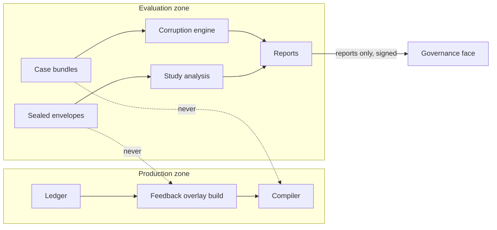

Rules: the evaluation zone has read access to the ledger and no write path to the pin registry, compiler input or any model training set; case bundles and sealed envelopes carry a zone label checked by the compiler (gate 1 rejects any fragment whose provenance includes an evaluation-zone artefact); reports crossing to production are signed and contain aggregates only.

### 10.4 Sealed envelopes and prospective studies

```text
register_study(question, cohort_query, outcome_query, analysis_plan, window):
    env = SealedEnvelope{ hash(question||cohort_query||outcome_query||analysis_plan), window, registered_at }
    ledger.append(env)                       -- public hash, sealed content
open_study(env_id):
    require now() > env.window.end
    verify hash matches sealed content
    run cohort_query and outcome_query at window.end with pins as of window.start
    run analysis_plan; produce report with the envelope hash on its cover
```

A study whose plan is changed after registration is a new envelope; the old one remains and is reported as abandoned.

### 10.5 Review queues

| Queue | Enqueue condition | Dequeue act | Service target |
| --- | --- | --- | --- |
| Flagged arguments | Verdict flagged with fired rebuttal on active plan | accept / reject / defer | Same encounter |
| Class-3 outputs | Any generative draft | accept into record as a note / discard | 24 h |
| Coding proposals | Argument of claim type coding-proposal | accept / reject with reason | Before claim submission |
| Binding review | Tier-3 terminology edge proposed | approve to tier 2 / reject | 14 days |
| Reconciliation | Inbound match weight between thresholds | link / new patient / discard | 24 h |
| Replay mismatches | Replay not identical | investigate; outcome recorded | 72 h |

Queues are views over the ledger filtered by state and absence of a dequeue act; there is no separate queue table.

### 10.6 Sentinel board and coverage declaration

Sentinel events (each a ledger query, each with its argument, attempt and pins attached): hard stops; overrides of flagged items; deviations from released plans; break-glass acts; replay mismatches; non-identical purity harness results; unresolved pins. Coverage declaration (published monthly, signed): encounters with at least one attempt / all encounters, by pathway; attempts by verdict; suppression counts by content class; queue service-target attainment.

### 10.7 Regulator bundle

```text
bundle(window, scope):
  1. arguments, attempts, acts, conflicts, defeaters in window (scope-filtered)
  2. every pin referenced, with artefact bytes or a signed locator
  3. replay report for every attempt in the bundle (§8.6)
  4. corruption campaign report for the builds in force during the window
  5. coverage declarations covering the window
  6. obligations register extract with evidence links
  7. manifest: sha256 of every file; bundle signature by the governance key
```

Output is a signed archive; verification tooling is published so the regulator can check the manifest and re-run replay offline.

### 10.8 Obligations register

| Obligation | Evidence artefact | Refresh |
| --- | --- | --- |
| Software-as-a-medical-device risk file | Corruption campaign report, sentinel summary | Each release |
| Terminology licence | Edition pin and licence record | Each edition |
| Medicines reference licence | Licence class on fragments | Each edition |
| Privacy impact | Consent handling tests, row-policy tests | Annually and on schema change |
| Clinical governance review | Coverage declaration, queue attainment | Monthly |

### 10.9 Acceptance tests

| Test | Given | Expect |
| --- | --- | --- |
| ADV-01 | Corruption InflatePosterior on a released fixture | Verdict unchanged only if still above alpha; otherwise flagged; never improved |
| ADV-02 | Fragment with evaluation-zone provenance submitted to compiler | Rejected at gate 1 |
| ADV-03 | Open study before window end | Refused |
| ADV-04 | Study plan edited after registration | New envelope; old marked abandoned |
| ADV-05 | Coverage cell with 19 corruptions | Release of that claim type blocked |
| ADV-06 | Regulator bundle manifest with one altered file | Verification tool reports mismatch |

## Volume 11 — Regulatory profiles, stack and delivery

One codebase produces three regulatory profiles by build-time exclusion, runs on a Rust core with sandboxed sidecars, and is delivered in nine milestones each gated by the acceptance tests of the volumes it completes.

### 11.1 Why profiles are build-time, not runtime

A feature that is present but switched off is still a feature a regulator must assess. Excluding it at build time, with a signed manifest listing what the binary contains, keeps each profile's assessment scope exact and makes "which build was this" a hash rather than a configuration question.

### 11.2 Tier manifests

| Profile | Contents | Excluded at build | Regulatory posture |
| --- | --- | --- | --- |
| Tier 1 — Record and workflow | Spine, ledger, faces, terminology, orders, inbound, deterministic rule engine (class 1 only) | All class-2 and class-3 engines; conformal wrapper; generative loop | Clinical information system; no diagnostic claim |
| Tier 2 — Decision support | Tier 1 plus class-2 engines under conformal wrapper, fit engine, attention layer, corruption engine, regulator bundle | Generative loop | Software as a medical device, decision-support class; flagged-only for class 2 |
| Tier 3 — General-purpose assistant | Tier 2 plus bounded generative loop and class-3 queues | Nothing; whitelist of permitted prompts is configuration (decision D-06) | Highest class; class-3 never a control |

```text
manifest.json (signed):
  build_hash, profile, cargo features enabled, crate list with versions and hashes,
  sidecar images with digests, SBOM (SPDX), seccomp profiles by process, pin classes present
```

### 11.3 Process and trust topology

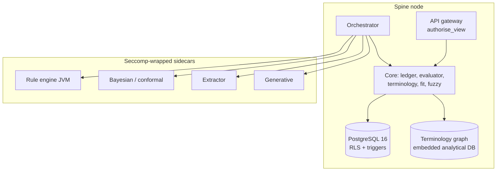

| Component | Language / runtime | Isolation | Notes |
| --- | --- | --- | --- |
| Core (ledger, evaluator, argument types, terminology, fit, fuzzy, render) | Rust, `#![forbid(unsafe_code)]` in evaluator and argument crates | Single process | `cargo deny` bans float-math crates from the evaluator crate |
| API gateway | Rust | Same process or separate | Only entry for faces; mTLS to faces |
| Sidecars | JVM, Python, model runtime | Separate processes; seccomp; no network namespace; stdin/stdout only | Killed on any denied syscall |
| Store | PostgreSQL 16 | RLS per role; roles per face and per plane | Ledger schema is insert-only |
| Edge node | Rust core compiled to WASM plus embedded store | Browser or practice server | Additive sync (Volume 3 §3.6) |

### 11.4 Security controls

| Control | Specification |
| --- | --- |
| Identity | Per-face identity provider; professional face binds registration number and scope-of-practice profile into the token |
| Authorisation | `authorise_view` plus row-level policy; attribute-based rules for scope of practice evaluated in the evaluator context |
| Break-glass | Requires reason; writes act; sets session variable for one transaction; sentinel entry |
| Transport | mTLS between faces and gateway; signed events on the outbox relay |
| Supply chain | SBOM per build; crate and image digests in manifest; reproducible build check on CI |
| Secrets | No clinical behaviour depends on any secret; secrets only for transport and signing keys, held in a hardware-backed store |
| Data at rest | Store-level encryption; per-patient chain and Merkle anchor detect tampering independent of encryption |

### 11.5 Delivery plan

| # | Milestone | Delivers | Exit gate |
| --- | --- | --- | --- |
| M1 | Argument and fixed-point crates | Types, canonical serialisation, JSON schema, non-coercion tests | Volume 4 tests green; schema published |
| M2 | Evaluator | Five stages, check catalogue, loss-matrix derivation, purity harness | Volume 5 catalogue and negative tests green |
| M3 | Ledger | DDL, triggers, RLS, replay | Volume 8 LED-01..07 green |
| M4 | Compiler and registry | Eleven gates, pin registry, guideline verification ingest, terminology graph build | Volume 6 gates each with a rejecting fixture |
| M5 | Spine functions | Resources, orders state machine, inbound pipeline, identity matcher, outbox | Volume 3 budgets met on the 10,000-patient synthetic practice |
| M6 | Engines Tier 1 | Rule engine sidecar, fuzzy layer, fit engine | ENG-01..07 for those engines |
| M7 | Faces and rendering | Three faces, templates, render invariance, brief, attention budget | Volume 9 REN-01..07 green; Volume 2 latency budgets met |
| M8 | Governance | Corruption engine, firewall, queues, sentinel board, bundle | Volume 10 ADV-01..06 green; first coverage declaration published |
| M9 | Tier 2 and Tier 3 engines | Bayesian, conformal wrapper, extractor, generative loop | Validation reports in pins; class caps proven by test |

Dependencies: M2 needs M1; M3 needs M1; M4 needs M3; M5 needs M3; M6 needs M2 and M4; M7 needs M5 and M6; M8 needs M7; M9 needs M8. Additive services (Volume 12) begin after M5 and ship after M8. M5 is complete only when every module in Volume 3A (groups A to K) ships and the parity suite E2E-01 to E2E-12 passes; the Cargo workspace and crate map for M1 to M5 are in Volume 3A.1.

## Volume 12 — Additive services

Three services fall out of the build once the spine, ledger and gate exist: a patient journey service over the event stream, a terminology service over the pinned graph, and an evidence-linked coding and risk-register service in which every proposal is an argument. None adds a new trust path; each is a consumer of released data and a producer of drafts.

### 12.1 Patient journey service

Every ledger write is already an event; the journey service normalises events into a typed timeline per patient, defines pathways as expected event sequences, and answers cohort questions in under 2 s.

```rust
pub struct JourneyEvent {
    pub patient_id: Uuid, pub at: EffectiveTime,
    pub kind: JourneyKind,          // Encounter, Order(state), Result, Argument(state), Act(kind), Message, Consent
    pub ref_id: Bytes,              // ledger id
    pub codes: Vec<Code>,           // pinned edition
}
pub struct Pathway { pub id: Uuid, pub steps: Vec<PathwayStep>, pub fragment_pin: Pin }  // compiled knowledge
pub struct PathwayStep { pub expect: EventPattern, pub within: Duration, pub on_miss: MissAction }
pub struct CohortQuery { pub include: Vec<Predicate>, pub exclude: Vec<Predicate>, pub window: Window, pub as_of_pins: PinSet }
```

| Endpoint | Input | Output | Budget |
| --- | --- | --- | --- |
| `GET /journey/{patient}` | window | ordered JourneyEvent list | 200 ms |
| `POST /cohort` | CohortQuery | patient ids, counts, pins used | 2 s over 1 year |
| `GET /pathway/{id}/adherence` | window | per-step attainment with imprecise-Dirichlet intervals | 2 s |
| `GET /export/omop` | window | analytical model tables (person, visit, condition, drug, measurement) | batch |

Pathway misses produce a draft argument (claim type recall) that goes through the evaluator; the service never contacts a patient directly.

### 12.2 Terminology service

A standard terminology API over the pinned edition and the tiered graph (Volume 6 §6.4), plus a tool interface for agents.

| Operation | Semantics | Tier rule | Budget |
| --- | --- | --- | --- |
| `$lookup` | Concept, designations, edition, active flag | Tier 0 | 1 ms |
| `$expand` | Expression-constraint expansion over the edition | Tier 0 | 50 ms for 10,000 members |
| `$subsumes` | A subsumes B in the edition hierarchy | Tier 0 | 1 ms |
| `$validate-code` | Code active in edition at date | Tier 0 | 1 ms |
| `$translate` | Map across code systems; response carries tier of each map | Tiers 0–2 for release use; tier 3 labelled | 5 ms |
| `route_score(a, b)` | Weighted shortest path in the graph with tier penalties | All tiers, labelled | 10 ms |

Agent tool interface: the same operations exposed as typed tools with a fixed schema; every tool result carries the edition pin and tier so that an engine placing a code in a draft inherits the correct reliability signal. A code from a tier-3 map caps the draft at flagged (Volume 6 rule).

### 12.3 Evidence-linked coding and risk register

Coding proposals are arguments with claim type coding-proposal: claim = the code; grounds = the span-linked facts; warrant = the coding rule fragment; backing = the guideline or classification rule; qualifier = reliability of the extractor plus membership where the rule uses fuzzy terms; rebuttals = exclusion criteria checked.

```mermaid
flowchart LR
  N[Note / document] --> X[Extractor engine<br/>class 2]
  X --> D[CodingProposal draft]
  D --> E[Evaluator]
  E -->|flagged| Q[Coder review queue]
  Q -->|accept act| C[Condition / claim item<br/>with argument link]
  Q -->|reject act| F[Feedback overlay]
  E -->|held| S[(Ledger only)]
```

Because the extractor is class 2, a coding proposal is at most flagged and always passes a coder; acceptance is an act, and the accepted code carries the argument id so an auditor can walk from claim item to sentence.

Risk register: a suspect is a coding proposal for a condition not yet on the problem list. The register is a query: current flagged coding-proposal arguments with no dequeue act, grouped by condition, each row showing the evidence spans. No composite score is computed; ordering is by severity tier then reliability.

| Endpoint | Output |
| --- | --- |
| `GET /coding/queue` | Flagged proposals awaiting act, with rendered clinician register |
| `POST /coding/{argument}/act` | accept or reject with reason; appends act |
| `GET /risk-register` | Suspects grouped by condition with spans and reliability |
| `GET /coding/audit/{claim_item}` | Chain: claim item → act → argument → attempt → pins → spans |

### 12.4 Acceptance tests

| Test | Given | Expect |
| --- | --- | --- |
| SVC-01 | Cohort query over 1 year, 10,000 patients | Under 2 s; pins reported |
| SVC-02 | `$translate` returns tier-3 map used in a draft | Draft capped at flagged |
| SVC-03 | Coding proposal accepted | Claim item carries argument id; audit chain resolves to spans |
| SVC-04 | Pathway step missed | Recall draft created; goes through evaluator; no direct contact |
| SVC-05 | Risk register requested | No composite score field present |

## Volume 13 — Decision register, open items and glossary

Eleven decisions are open or provisional; each names its owner role, the default the build proceeds on, and the volume it affects. The glossary fixes the working vocabulary used in every volume.

### 13.1 Decision register

| Id | Decision | Default in this compendium | Owner | Affects |
| --- | --- | --- | --- | --- |
| D-01 | Core language: Rust for ledger, evaluator, argument types, terminology, render | Adopted | Architecture | 4, 5, 8, 11 |
| D-02 | Provisional templates (not yet ratified) may reach flagged but never released | Adopted | Clinical governance | 5, 6 |
| D-03 | Qualifier shape: six typed signals including ignorance | Adopted; supersedes any earlier five-signal or set-based shape | Architecture | 4 |
| D-04 | Conflict predicate vocabulary (contradicts, excludes, supersedes, duplicates, interacts) | Provisional list; closed once ratified | Clinical governance | 5, 8 |
| D-05 | Loss matrices per claim type | Placeholder matrices ship; ratification required before Tier 2 | Clinical governance | 5 |
| D-06 | Tier 3 prompt whitelist as signed configuration, not build feature | Adopted | Architecture | 7, 11 |
| D-07 | Terminology edition pin and licence for the jurisdiction | Pin the current national edition; licence recorded in obligations | Compliance | 6, 12 |
| D-08 | External Merkle anchoring mechanism | Publish root to an independent append-only log with a receipt; exact provider open | Architecture | 8 |
| D-09 | Live differential during encounter versus synthesis before | Synthesis before; live differential only as pre-intake question ordering | Clinical governance | 7, 9 |
| D-10 | Severity tier vocabulary (four tiers) | Provisional | Clinical governance | 9 |
| D-11 | Regulatory assumptions requiring confirmation (device classification per tier) | Tier 1 not a device; Tier 2 decision-support class; Tier 3 highest | Compliance | 11 |

### 13.2 Open items

- [ ] Ratify loss matrices for the first five claim types (D-05)
- [ ] Close the conflict predicate vocabulary (D-04)
- [ ] Select the external anchor provider and record its receipt format (D-08)
- [ ] Confirm device classification per tier with the regulator (D-11)
- [ ] Publish the first threshold set and codebooks through the compiler before M6
- [ ] Produce the 10,000-patient synthetic practice for the performance suite before M5

### 13.3 Glossary

| Term | Meaning in this compendium |
| --- | --- |
| Argument | Claim, grounds, warrant, backing, qualifier, rebuttals; the unit of decision |
| Draft | An engine's argument before evaluation; no authority |
| Attempt | The evaluator's record of one evaluation: request hash, trace, verdict, pins |
| Verdict | released, flagged or held; assigned only by the evaluator |
| Verdict class | 1 deterministic, 2 frozen model with declared error, 3 self-judgement |
| Qualifier signal | One of posterior, coverage, membership, reliability, fit, ignorance; fixed-point; non-coercible |
| Fixed6 | Unsigned integer 0..=1,000,000 representing a value with six decimal places |
| Pin | A 256-bit content hash of an artefact, registered with class, dates and signature |
| Pin set | The eight pins S, R, K, I, W, F, M, P, U recorded on every attempt |
| Fragment | A compiled, signed unit of knowledge admitted through the eleven gates |
| Envelope | The applicability conditions a fragment declares |
| Fit | In, Out or Unknown relation of a case to an envelope |
| Conflict record | Evaluator's record of a contradiction with a four-valued state |
| Act | A signed, append-only record of a human decision on an argument or order |
| Supersession | Replacing an argument by a new one that names it; the only way state changes |
| Register | Clinician, patient or regulator rendering of the same argument |
| Suppression | Withholding an item from a brief under a pinned policy; counted and reachable |
| Sealed envelope | Hash-committed study registration opened only after its window |
| Case bundle | Versioned corpus of evaluation cases held in the evaluation zone |
| Tier (profile) | Build-time regulatory profile 1, 2 or 3 |
| Tier (terminology) | Provenance level 0–3 of a graph edge |

### 13.4 Source artefacts

The compendium supersedes the eight documents it folds in; they remain as source artefacts. Where a field-level schema or check catalogue is needed beyond what a volume prints, use [the argument specification](https://claude.ai/code/artifact/4e5eb57b-f675-4162-ae93-bb7c0a2a694f), [the evaluator specification](https://claude.ai/code/artifact/e5c78c7f-1920-4d0c-8e48-46b337343e2f), [the consolidated specification](https://claude.ai/code/artifact/de5b6dd4-2423-4b13-b31c-ca446dd28d25) and [the engineering thesaurus](https://claude.ai/code/artifact/33c8ed2c-9642-4517-8f1e-e68cddbc3e42). Repository sources cited in those documents are pinned by commit there and are not repeated here.
