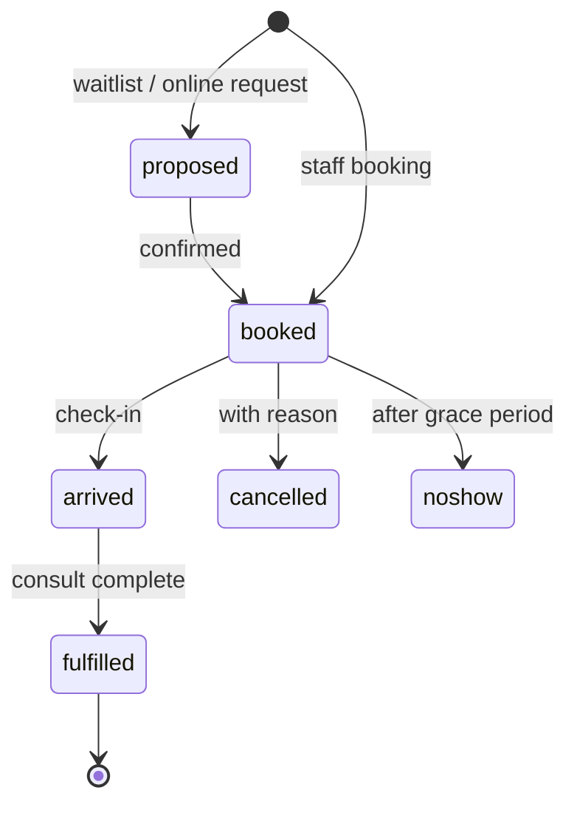
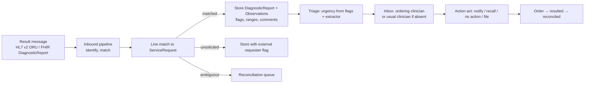
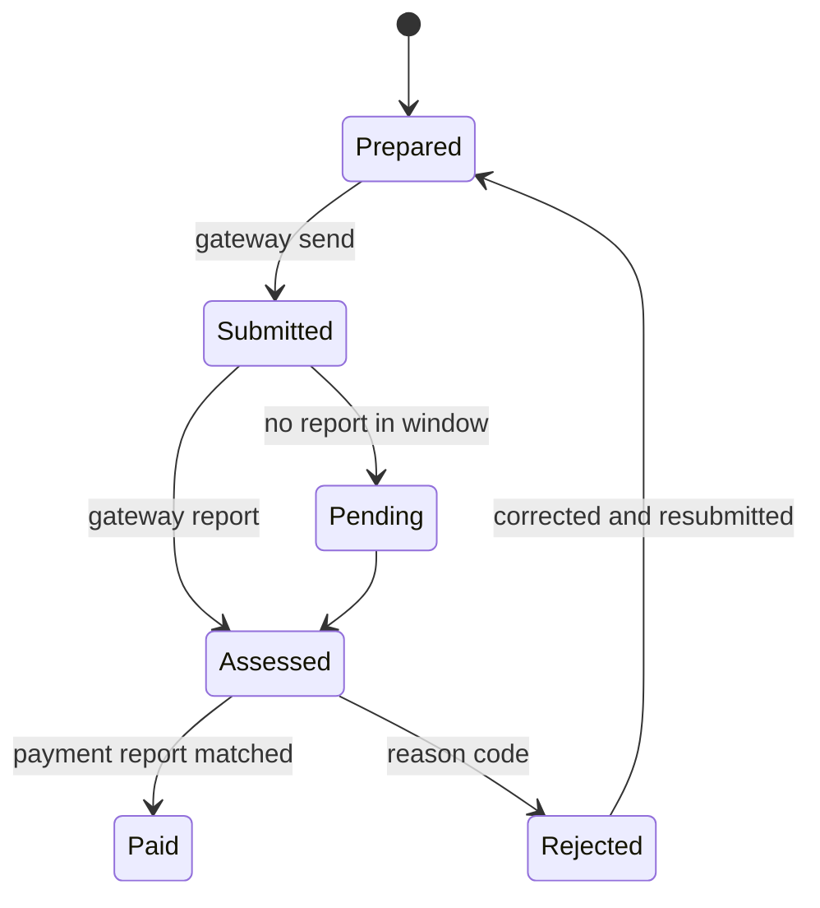

# Volume 3A — Complete EHR Build Specification

Sep 25, 2026 · @Ken Lee

This tab specifies every module a fully functioning primary-care electronic health record must ship, at parity with commercial systems, as build instructions: resources and tables, routes, state machines, integration standards, rules and tests. It extends Volume 3 of the main tab; the spine's storage model, order state machine, inbound pipeline and matcher are assumed built.

## 3A.0 Scope and parity benchmark

Parity means a practice can switch off its incumbent system on cut-over day and lose no function. The catalogue below is the checklist; each row names the build section and the regulatory profile (Volume 11.2) in which it ships. Tier 1 is the record and workflow product with no diagnostic claim; every row marked T1 must be complete before a Tier 1 release.

| Id | Module | What every commercial primary-care EHR ships | Section | Profile |
| --- | --- | --- | --- | --- |
| A1 | Registration and demographics | Register, search, edit, merge; Medicare/DVA/concession details; carers; preferences | 3A.2 | T1 |
| A2 | National identifiers | Individual, provider and organisation healthcare identifier lookup and validation | 3A.2 | T1 |
| A3 | Eligibility and entitlement | Online patient verification, concession and veteran entitlement checks | 3A.2 | T1 |
| A4 | Appointments | Appointment book, sessions and rosters, types, recurring, waitlist, cancellations, reminders | 3A.2 | T1 |
| A5 | Waiting room and arrivals | Arrive, wait, in-consult, done; queue per provider; walk-ins; telehealth lobby | 3A.2 | T1 |
| B1 | Clinical notes | Structured notes, templates, autotext, dictation, ambient capture, past-note browsing | 3A.3 | T1 |
| B2 | Histories | Past, family, social, obstetric, occupational; alcohol, smoking, substances | 3A.3 | T1 |
| B3 | Problem and diagnosis list | Coded, dated, status, evidence links | 3A.3 (M-CLN) | T1 |
| B4 | Allergies and adverse reactions | Coded substance/class, reaction, severity, verification | 3A.3 (M-CLN) | T1 |
| B5 | Vitals, examination, growth | Vitals with trends; paediatric growth charts; BMI; waist | 3A.3 | T1 |
| B6 | Pregnancy and antenatal record | EDD, visits, results, shared care | 3A.3 | T1 |
| B7 | Care plans and chronic disease | Care plans, team care arrangements, reviews, health assessments, mental health plans | 3A.3 | T1 |
| B8 | Clinical tools and calculators | Risk calculators, scoring instruments, versioned | 3A.3 | T1 |
| C1 | Prescribing | Medicines database, dose, repeats, authority, interaction and allergy checks | 3A.4 | T1 |
| C2 | Electronic prescriptions | Conformant electronic prescription creation, token delivery, active script list, cancellation | 3A.4 | T1 |
| C3 | Medication management | Current list, reconciliation, ceased history, controlled-drug register, medication review | 3A.4 | T1 |
| D1 | Pathology and imaging ordering | Request forms, electronic ordering, favourites and panels, copy-to | 3A.5 | T1 |
| D2 | Results inbox | Receive, match, view, cumulative, abnormal flags, notify, action, file | 3A.5 | T1 |
| E1 | Immunisations | Record, schedule, national register upload and query, catch-up | 3A.6 | T1 |
| E2 | Recalls and reminders | Recall register, reminder runs by letter/SMS, screening programs, outcome tracking | 3A.6 | T1 |
| F1 | Letters and correspondence | Letter writer, templates, merge fields, referrals, certificates | 3A.7 | T1 |
| F2 | Secure messaging | Send and receive clinical documents by secure messaging; acknowledgements | 3A.7 | T1 |
| F3 | Inbound documents | Scanning, fax, email intake, classification, filing, actioning | 3A.7 | T1 |
| F4 | Shared national record | View, upload shared health summary, event summary, prescription records | 3A.7 | T1 |
| G1 | Billing | Fee schedules, item numbers, accounts, invoices, receipts, EFTPOS, GST | 3A.8 | T1 |
| G2 | Claiming | Bulk-bill, patient claims, veteran claims, private health, compensable/third party, batching, reconciliation | 3A.8 | T1 |
| G3 | Debtors and banking | Outstanding, statements, write-off, banking summary, end-of-day | 3A.8 | T1 |
| H1 | Users, roles, providers, locations | Accounts, MFA, roles, provider numbers, locations, sessions | 3A.9 | T1 |
| H2 | Audit and access log | Every read/write/print/export logged; patient access report | 3A.9 | T1 |
| H3 | Configuration | Templates, autotext, fee schedules, reminder rules, letterheads, clinical protocols | 3A.9 | T1 |
| I1 | Reporting | Activity, financial, clinical registers, ad-hoc query, scheduled reports | 3A.10 | T1 |
| I2 | Quality measures and extraction | Incentive-program measures, accreditation reports, de-identified extraction | 3A.10 | T1 |
| J1 | Patient communication | SMS, email, portal messages, consent, templates, two-way | 3A.11 | T1 |
| J2 | Online booking and portal | Book, forms, results release, repeat requests, telehealth join | 3A.11 | T1 |
| J3 | Telehealth | Video and phone consult with record context; remote monitoring intake | 3A.11 | T1 |
| K1 | Images and attachments | Clinical photos, documents, viewer, annotation | 3A.12 | T1 |
| K2 | Migration, import, export | Import from incumbent systems; standards export; bulk export | 3A.12 | T1 |
| K3 | Backup, restore, offline, printing | Point-in-time restore; edge operation; print templates and scripts | 3A.12 | T1 |

### Reference benchmark

The open-source headless clinical data repository that informed the spine's budgets publishes: FHIR R4 headless API; create and update under 10 ms; over 25,000 writes per second on ten threads; typical search under 50 ms; under 100 MB per instance; immutable resource history; per-request audit events; attribute-based policies scoped to compartments; OAuth2 and app-launch support with TOTP multi-factor and memory-hard password hashing; multi-tenant scoping by tenant and project; custom operations as sandboxed scripts stored as operation definitions; declarative flattening views over resources to CSV/JSON/NDJSON for analytics; an agent tool interface generated from the server's capability statement; and a single-command local stack ([haste.health](https://haste.health/)). This build adopts every one of those as a requirement (3A.1) and adds the modules above, which a data repository does not ship.

| Property | Reference figure | This build's requirement | Test |
| --- | --- | --- | --- |
| Create/update latency | under 10 ms | under 10 ms p99 | SPN-07 |
| Write throughput | over 25k/s, 10 threads | over 25k/s, 10 threads, synthetic practice | PERF-01 |
| Search | under 50 ms | under 50 ms p99 | SPN-07 |
| Memory per node | under 100 MB | under 100 MB resident | SPN-07 |
| Local stack | one command | one command brings up core, store, sidecars, faces | OPS-01 |

## 3A.1 Cross-cutting build rules

These rules apply to every module in this tab. They implement the three commitments of the spine design: standards-native storage, event-first writes, and correctness by construction.

### Workspace and crates

```text
spine/
  Cargo.toml                 # workspace; profiles = features: tier1 | tier2 | tier3
  crates/
    core-types/              # Fixed6, Pin, Code, EffectiveTime, Provenance, Consent, type-state markers
    record/                  # resource store, versioning, provenance, tombstones, compartments
    events/                  # transactional outbox, durable filtered subscriptions, replay
    facts/                   # fact graph, span links, disagreement rows, per-patient in-memory graph
    terminology/             # in-process edition mirror + tiered graph; $lookup/$expand/$subsumes/$validate/$translate
    identity/                # master identity, matcher (F–S), merge/unmerge acts, national identifier client
    orders/                  # order object + state machine; eRx, pathology, imaging, referral variants
    inbound/                 # channel adapters (HL7 v2, secure messaging, national record, device, portal, scan/OCR, email)
    scheduling/              # appointments, sessions, waitlist, waiting room
    clinical/                # notes, histories, problems, allergies, vitals, growth, antenatal, care plans, calculators
    medications/             # medication lifecycle, prescribing check request builder, ePrescription conformance, controlled-drug register
    results/                 # results inbox, cumulative view, actioning, notify
    immunisation/            # schedule engine, register sync
    recalls/                 # recall register, reminder runs, screening programs
    correspondence/          # letter writer, templates, merge fields, secure messaging, document management
    national-record/         # shared record connector (view, upload)
    billing/                 # fee schedules, accounts, invoices, receipts, claiming adapters, debtors, banking
    admin/                   # users, roles, MFA, providers, locations, configuration, audit queries
    reporting/               # declarative views (SQL-on-FHIR ViewDefinition), registers, measures, extraction, scheduled reports
    comms/                   # SMS, email, portal messaging, consent for contact, templates
    portal-api/              # patient-facing routes: booking, forms, results release, repeats, telehealth join
    telehealth/              # video/phone session, lobby, record context, remote-monitoring intake
    media/                   # object store client, content addressing, image/attachment metadata, viewer API
    migration/               # importers (incumbent formats), exporters (bulk FHIR, CSV/NDJSON), validation
    ops/                     # backup/restore (event-log based, point in time), offline edge sync, print rendering
    scripting/               # embedded sandboxed script runtime (typed bindings; custom operations as OperationDefinition)
    api-gateway/             # FHIR R4 REST + subscribe + bulk export; OAuth2/SMART; ABAC; audit per request; agent tool interface generated from CapabilityStatement
  sidecars/                  # rule engine (JVM), extractor, Bayesian/conformal, generative — Volume 7
  faces/                     # patient, clinician, governance web clients (thin; API-only)
  deploy/compose.yml         # one command: `docker compose up` brings up core, store, sidecars, faces
```

Dependency rule: `core-types` ← `record` ← `events` ← everything else; no module crate depends on another module crate except through `events` (subscribe) or `record` (read/write). `cargo deny` enforces the graph.

### Resource envelope

Every module stores FHIR R4 resources with the national base profile applied, in the `resource` table of Volume 3.8. Every write carries a Provenance (author or model pin, time, source method: typed, dictated, extracted, patient-reported, imported, device; confidence; consent reference). A write without author and reason does not compile:

```rust
pub struct Write<R: Resource> { pub body: R, pub author: Principal, pub reason: ReasonCode, pub source: SourceMethod, pub consent: Option<ConsentRef> }
pub fn commit<R: Resource>(w: Write<R>) -> Result<Version, WriteError>;   // also inserts outbox row in the same transaction
```

### Events and subscriptions

| Property | Specification |
| --- | --- |
| Emission | One event per committed resource version, from the outbox, in commit order |
| Subscription | Durable; filters on patient, resource type, practice, trigger code; cursor per consumer; replay from any cursor |
| Priority | Two lanes: critical (abnormal result, red-flag message, medication change on discharge) and routine; critical lane drains first |
| Delivery | At-least-once; consumer handlers idempotent on (resource id, version) |
| Budget | Commit-to-subscriber under 100 ms p99 |

### Access control and audit

| Control | Specification |
| --- | --- |
| Identity | OAuth2 provider with app-launch context for embedded clinical apps; agents receive scoped client tokens |
| Multi-factor | TOTP required for clinician and governance faces; memory-hard password hashing (argon2id) |
| Authorisation | Attribute-based: actor, patient compartment, resource type, consent state, care relationship, purpose; evaluated per request; same policy compiled to row-level security |
| Consent | Consent resources gate secondary use, research export and agent contact; withdrawal propagates as an event |
| Audit | One AuditEvent per request (read, write, search, print, export, transmit) with actor, purpose, patient; queryable through the governance face; patient access report from the same table |
| Break-glass | Reason required; act written; loud sentinel entry; reviewed |
| Multi-tenancy | Tenant and project scoping on every resource; one deployment serves many practices; a tenant sees only its aperture on the shared patient graph |

### Scripting, custom operations, analytics views

| Item | Specification |
| --- | --- |
| Custom operations | Sandboxed script runtime embedded in the core with typed bindings; each operation stored as an OperationDefinition resource, versioned, signed; no file, network or clock access beyond bindings |
| Analytics views | Declarative view definitions over resources (SQL-on-FHIR ViewDefinition) flattening to CSV, JSON, NDJSON; materialised into the columnar layer by the event stream; editable in the governance face |
| Agent tools | Tool schemas generated from the server CapabilityStatement: search, read, write, schema discovery; each tool carries the caller's scope; cannot sign or transmit |

### Storage layers

| Layer | Holds | Rebuilt by |
| --- | --- | --- |
| Relational (PostgreSQL 16) | Current and historical resource versions, ledger, indexes (structured + full text) | Source of truth |
| Columnar | Analytics views, registers, cohort queries | Replay of events |
| Time-series | Device and remote-monitoring streams | Replay of events |
| Object store (content-addressed) | Originals: documents, images, audio | Immutable; hash in resource |
| In-memory fact graph | Per active patient | Materialised from record + facts on open |

### Printing and templates

All printed output (scripts, request forms, letters, invoices, receipts, certificates, labels) renders from pinned templates (class U) through one render service; the rendered PDF is stored as a DocumentReference with the template pin, so any printed page is reproducible. Script and request-form layouts conform to the applicable national conformance profiles.

### Latency budgets (inherited from Volume 3.7) and cross-cutting tests

| Test | Given | Expect |
| --- | --- | --- |
| XC-01 | Write without `reason` | Does not compile |
| XC-02 | Any request | AuditEvent row exists with actor and purpose |
| XC-03 | Consent withdrawn | Next secondary-use read refused; event delivered to subscribers under 100 ms |
| XC-04 | Tenant A token reads tenant B patient | 404 |
| XC-05 | Custom operation script calls network | Sandbox denies; operation fails closed |
| XC-06 | Drop the columnar layer; replay events | Views rebuilt identically (hash of NDJSON export equal) |
| PERF-01 | 10 writer threads on synthetic practice | over 25,000 writes/s sustained 60 s |
| OPS-01 | Fresh machine, one command | Core, store, sidecars, faces up; smoke suite passes |

## 3A.2 Group A — Registration, identifiers, eligibility, appointments, waiting room

### A1 Registration and demographics (crate `identity`)

| Item | Specification |
| --- | --- |
| Resources | Patient (national profile), RelatedPerson (carers, representatives with scope of authority), Coverage (Medicare, veteran, concession, private fund, compensable), Consent (communication preferences, sharing), Linkage |
| Versioned demographics | Names, addresses, contacts as dated entries; a change is a new Patient version with provenance reason; history readable |
| Preferences | Preferred language, interpreter need, accessibility needs, communication channel and consent per channel, cultural considerations |
| Routes | `POST /patients` · `GET /patients/{id}` · `PUT /patients/{id}` · `GET /patients?name=&birthdate=&identifier=&phone=` · `POST /patients/{id}/merge` · `POST /patients/{id}/unmerge` · `POST /patients/{id}/coverage` · `POST /patients/{id}/related` |
| Duplicate control | Every create runs the matcher (Volume 3.10) against existing patients; a candidate above the lower threshold blocks silent creation and offers link or confirm-new (act recorded) |
| Merge | Writes Linkage; reads re-point; no resource rewritten; unmerge reverses by a new Linkage version |
| Tests | REG-01 create with near-duplicate → candidate offered, act required · REG-02 merge/unmerge round trip byte-identical · REG-03 address change keeps prior address readable at prior date |

### A2 National identifiers (crate `identity`, client module)

| Item | Specification |
| --- | --- |
| Identifiers | Individual healthcare identifier on Patient; provider identifier on Practitioner; organisation identifier on Organization; stored with status (active, retired, resolved) and last-validated time |
| Operations | `lookup_individual(demographics)` · `validate_individual(ihi)` · `lookup_provider(registration)` · `validate_org(hpio)`; adapter behind a trait so the national identifier service client is replaceable |
| Rules | Lookup at registration and before any national-record or e-prescription transaction; an unresolved or retired identifier blocks those transactions with a task, never blocks local care; every lookup logged as an AuditEvent with purpose |
| Tests | NID-01 unresolved identifier → national upload refused, local encounter proceeds · NID-02 identifier revalidated when demographics change · NID-03 lookup audited |

### A3 Eligibility and entitlement (crate `billing`, verification module)

| Item | Specification |
| --- | --- |
| Operations | Online patient verification (medicare/veteran/concession) via the national claiming gateway; result stored on Coverage with checked-at time and status |
| Trigger | On booking, on arrival, and nightly for tomorrow's appointments |
| Tests | ELG-01 expired card → arrival screen shows warning; billing defaults to private · ELG-02 nightly run marks tomorrow's list |

### A4 Appointments (crate `scheduling`)

| Item | Specification |
| --- | --- |
| Resources | Schedule (per practitioner-location), Slot (generated from session templates), Appointment (type, reason, participants, status, telehealth flag, home-visit address), AppointmentResponse |
| Private tables | `session_template(practitioner, location, weekday, start, end, slot_minutes, appointment_types[], valid_from, valid_to)` · `waitlist(patient, practitioner?, earliest, latest, priority, created)` |
| Appointment types | Configurable: duration, billing default, colour, online-bookable, telehealth-capable, required forms |
| Routes | `GET /schedules?practitioner=&date=` · `GET /slots?schedule=&start=&end=&status=free` · `POST /appointments` · `PATCH /appointments/{id}` (reschedule/cancel with reason) · `POST /waitlist` · `POST /appointments/{id}/remind` · `GET /appointments?patient=&date=&practitioner=` |
| Recurring | Series stored as one Appointment with `recurrenceTemplate`; instances materialised 90 days ahead; edit-one vs edit-series explicit |
| Reminders | SMS/email at configured lead times through `comms`; reply-to-confirm and reply-to-cancel parsed; non-attendance recorded as Appointment.status `noshow` with act |
| Predicted demand and non-attendance | Class-2 model outputs shown only as capacity hints to the roster view; never books or cancels (Volume 5 class rule) |
| Tests | APP-01 double-booking a slot without override role → 409 · APP-02 session template change regenerates future free slots only · APP-03 reply "C" cancels and frees slot within 60 s · APP-04 recurring edit-one leaves series intact |



### A5 Waiting room and arrivals (crate `scheduling`)

| Item | Specification |
| --- | --- |
| Model | Encounter created at arrival with status `arrived`; queue view = arrived encounters per practitioner ordered by appointment time, with wait duration; walk-ins create Appointment + Encounter in one call |
| Routes | `POST /appointments/{id}/arrive` · `POST /walk-in` · `GET /waiting-room?location=` · `POST /encounters/{id}/call` (status in-progress) · `POST /encounters/{id}/finish` |
| Telehealth lobby | Same queue; patient joins via portal link; provider sees "waiting online" with connection state |
| Arrival tasks | Forms due, consent renewals, eligibility warnings, overdue recalls shown at arrival and pushed to the patient's device for completion while waiting |
| Tests | WR-01 arrival creates Encounter and outbox event under 100 ms · WR-02 queue order by appointment time, not arrival time · WR-03 telehealth join updates lobby within 2 s |

## 3A.3 Group B — Clinical encounter, histories, care plans, growth, antenatal, calculators

M-ENC, M-CLN and M-OBS in the main tab (Volume 3.13) cover encounters and notes, problems and allergies, and observations; this group adds what a clinician expects around them.

### B1 Clinical notes: templates, autotext, dictation, ambient capture (crate `clinical`)

| Item | Specification |
| --- | --- |
| Note structure | Composition with sections (reason, history, examination, assessment, plan, actions) and free sections; each section a `text.div` with span index; coded entries created from sections write facts with span links |
| Templates | Questionnaire resources compiled to note sections (fields typed: coded, quantity, text, choice); rendered inline; answers stored as QuestionnaireResponse and projected into the Composition |
| Autotext | `autotext(trigger, expansion, scope: user \| practice)` table; expansion inserted at cursor; merge fields resolved from record (`{{patient.age}}`, `{{last.bp}}`) |
| Dictation and ambient capture | Audio stored as original in object store; transcript stored as DocumentReference with timestamps; a class-2 extractor drafts the note sections as a Composition version marked `draft`, attributed to the model pin; clinician edits and signs; signing is an act; unsigned drafts are excluded from grounds |
| Past-note browsing | `GET /patients/{id}/notes?section=&from=&to=&q=` with full-text search under 50 ms |
| Routes | `POST /encounters/{id}/notes` · `PUT /notes/{id}` · `POST /notes/{id}/sign` · `POST /notes/{id}/from-transcript` · `GET /templates` · `POST /autotext` |
| Tests | NOTE-01 ambient draft is `draft`, excluded from evaluator grounds until signed · NOTE-02 template answer of type quantity creates Observation with span link to the note · NOTE-03 merge field resolves to versioned value at note time |

### B2 Histories (crate `clinical`)

| History | Resources | Fields |
| --- | --- | --- |
| Past medical and surgical | Condition (past), Procedure | Coded, date/approximate, performer, outcome, source |
| Family | FamilyMemberHistory | Relationship, condition coded, age at onset, deceased, source |
| Social | Observation (social history codes) | Occupation, living situation, carers/dependants, cultural and religious considerations, advance care directive, goals of care |
| Alcohol, smoking, substances | Observation with structured value sets | Status, quantity, frequency, quit date; history of changes |
| Obstetric | Observation + Condition | Gravida, para, outcomes per pregnancy |
| Occupational | Observation | Exposures, compensable status |

All histories are versioned entries with source method; social determinants extracted from narrative by the class-2 extractor are written as facts with reliability and shown as "from note" until confirmed.

### B5 Vitals, examination and growth (crate `clinical` over M-OBS)

| Item | Specification |
| --- | --- |
| Vitals set | BP (with cuff/method/position), pulse, temperature, respiratory rate, SpO2, weight, height, waist, BMI (derived, formula pinned), pain score, head circumference |
| Growth charts | Percentile computation against pinned reference tables (class K) by age, sex; corrected age for prematurity; chart series endpoint `GET /patients/{id}/growth?measure=` returns points + percentile bands |
| Examination findings | Coded findings per body system as Observations with `bodySite`; templated exam panels |
| Trend | `GET /patients/{id}/observations/{code}/trend` across sources with method-change markers and reference ranges per lab, age, sex, pregnancy state |
| Tests | VIT-01 BMI recomputed only on new weight/height, formula pin stored · VIT-02 growth percentile for 6-month corrected age uses corrected table · VIT-03 trend marks lab change |

### B6 Pregnancy and antenatal record (crate `clinical`)

| Item | Specification |
| --- | --- |
| Model | EpisodeOfCare (type antenatal) with Condition (pregnancy), EDD as Observation (method: LMP, ultrasound, IVF; versioned), planned visit schedule generated from a pinned pathway fragment; each visit an Encounter linked to the episode |
| Antenatal visit template | Gestation (derived), BP, weight, fundal height, fetal heart, urinalysis, presentation, results due |
| Shared care | Referral to obstetric service with episode summary; inbound reports linked to episode; postnatal close-out |
| Tests | ANC-01 EDD revision by ultrasound supersedes LMP with reason · ANC-02 gestation derived from current EDD version · ANC-03 visit schedule regenerates on EDD change |

### B7 Care plans, chronic disease management, health assessments (crate `clinical`)

| Item | Specification |
| --- | --- |
| Resources | CarePlan (goals, activities with owner and interval, review date, team), Goal, CareTeam, Task (generated from activities), Questionnaire/Response for assessments |
| Plan types | Chronic disease management plan, team care arrangement, mental health treatment plan, aged-care assessment, health assessment by age band, post-discharge plan; each a pinned template with required sections and billing linkage |
| Lifecycle | draft → active → under review → revised (new version) → completed; review dates create recalls (3A.6) |
| Task generation | Each CarePlan.activity with a schedule creates Task rows owned by a team member; completion recorded against the plan; patient-portal loops created for patient-owned activities |
| Billing linkage | Plan completion emits an event that proposes the corresponding service item to billing (3A.8) as a coding-proposal argument, never auto-billed |
| Tests | CP-01 activating a plan creates one Task per scheduled activity · CP-02 review due creates recall · CP-03 plan completion proposes item; invoice not created until act |

### B8 Clinical tools and calculators (crate `clinical`)

| Item | Specification |
| --- | --- |
| Calculators | Cardiovascular risk, renal function estimate, body surface area, frailty, deterioration scores, depression/anxiety instruments, developmental screens, alcohol/smoking instruments; each a pinned fragment (formula or table + version + citation) |
| Execution | `POST /calculate/{id}` with explicit inputs or `auto=true` to pull latest observations; output stored as Observation with `derivedFrom` inputs and calculator pin |
| Rules | A calculator output used in a draft argument carries the fragment pin as backing; a calculator with a validation population declares it as an envelope |
| Tests | CALC-01 output stores input observation versions · CALC-02 recompute with same inputs is byte-identical · CALC-03 input outside envelope → fit Out on any draft using it |

## 3A.4 Group C — Prescribing, electronic prescriptions, medication management

Treatments are a lifecycle, not a list: intended, prescribed, dispensed, administered or taken, changed, ceased, each a linked coded record. M-MED (main tab, Volume 3.13) defines the prescribing check; this group builds the rest.

### C1 Prescribing (crate `medications`)

| Item | Specification |
| --- | --- |
| Medicines terminology | National medicines terminology at product, form and strength level, served in-process from `terminology`; brand/generic, substitution permission, schedule, subsidy listing and restriction codes from the pinned medicines reference (class K fragment) |
| Resources | MedicationRequest (dose, route, frequency, duration, quantity, repeats, indication → Condition, substitution, authority status, prescriber, signature), Medication (from terminology) |
| Dose entry | Structured dose (`doseQuantity`, `timing`, `route`) with a parser for shorthand ("1 bd pc") that writes structured fields and keeps the original text |
| Checks | `POST /prescribing/check` per M-MED: allergy/class, interaction (drug–drug, drug–condition, drug–pregnancy/lactation, drug–renal/hepatic using latest observations), dose range by age/weight/renal function, duplicate therapy, schedule restrictions; all from pinned fragments; result is an Attempt within 200 ms |
| Authority and restrictions | Restriction code resolution from the subsidy listing; streamlined authority codes captured; phone/online authority workflow as a Task with approval number stored on the MedicationRequest |
| Scope of practice | Nurse and pharmacist prescribers: formulary and scope fragment (class P profile) applied in the evaluator context; out-of-scope → held with reason |
| Repeats and renewals | Repeat count on the original; renewal creates a new MedicationRequest with `priorPrescription`; cancellation is a state transition, never a delete |
| Tests | RX-01 shorthand parse round-trips to structured dose · RX-02 renal-dosing check uses latest eGFR observation version · RX-03 nurse prescriber outside formulary → held · RX-04 authority number required before sign when restriction demands it |

### C2 Electronic prescriptions (crate `medications`, module `eprescribe`)

```mermaid
stateDiagram-v2
  [*] --> Drafted
  Drafted --> Checked: attempt released or flagged+override
  Checked --> Signed: prescriber signature (key in HSM)
  Signed --> Transmitted: sent to prescription exchange; token issued
  Transmitted --> Acknowledged: exchange receipt
  Acknowledged --> Fulfilled: dispense event
  Fulfilled --> Reconciled: medication list updated, reviewed
  Transmitted --> Cancelled: prescriber cancel accepted by exchange
  Transmitted --> Overdue: no dispense in expected window
  Overdue --> Fulfilled
```



| Item | Specification |
| --- | --- |
| Conformance | Electronic prescription message built to the national e-prescribing conformance profile; validated against the profile's schema and business rules before transmission; conformance test suite run in CI |
| Token delivery | Token (QR/link) delivered to patient by SMS, email or portal in the same action as transmission; delivery receipt stored; re-send route; paper fallback prints the conformant script layout |
| Active script list | Registration and consent for the patient's active script list where the exchange provides one; list retrieved on medication reconciliation |
| Dispense events | Inbound dispense record from the exchange matched to the MedicationRequest (inbound pipeline); updates MedicationDispense and adherence observations |
| Cancellation | Prescriber cancel → exchange; on acceptance the request moves to Cancelled; patient notified |
| Controlled medicines | Schedule 8 and 4D: real-time prescription monitoring check called at Checked with result stored; approval/permit numbers required where the jurisdiction demands; recorded in the controlled-drug register (C3) |
| Routes | `POST /prescriptions` · `POST /prescriptions/{id}/sign` · `POST /prescriptions/{id}/transmit` · `POST /prescriptions/{id}/cancel` · `POST /prescriptions/{id}/resend-token` · `GET /patients/{id}/active-scripts` |
| Tests | EP-01 message fails profile validation → not transmitted, task raised · EP-02 token delivered and receipt stored in same transaction as Transmitted · EP-03 dispense event moves state to Fulfilled and writes MedicationDispense · EP-04 S8 script without monitoring check result cannot reach Signed · EP-05 cancel after dispense refused with reason |

### C3 Medication management (crate `medications`)

| Item | Specification |
| --- | --- |
| Current list | Reconciled view over MedicationRequest (ours and external), MedicationDispense, MedicationStatement (patient-reported, extracted from letters); discrepancies shown as rows (source A says X, source B says Y) from `fact_disagreement`; one current list with `source` per line |
| Reconciliation workflow | Triggered by discharge summary, specialist letter, active script list retrieval, or patient report; pharmacist/clinician resolves each discrepancy by act (accept, cease, amend); unresolved discrepancies are visible on the prescribing check as flagged grounds |
| Ceased history | Cease is a new version with reason code (adverse effect, ineffective, completed, changed, patient choice); never deleted |
| Administration | MedicationAdministration for in-practice and hospital-in-the-home doses: batch, site, route, observer, adverse event link |
| Adherence | Patient-reported and device-recorded doses as Observations against the request; adherence ratio derived with formula pin |
| Controlled-drug register | Append-only `controlled_drug_register(item, batch, received, administered/dispensed, balance, witness, act)`; balance recomputed from entries; discrepancies raise a sentinel entry |
| Medication review | Structured review template (indication, effectiveness, adverse effects, adherence, monitoring due) producing a Composition and proposed changes as drafts |
| Routes | `GET /patients/{id}/medications/current` · `GET /patients/{id}/medications/discrepancies` · `POST /medications/{id}/cease` · `POST /administrations` · `POST /cdr/entries` · `GET /cdr/balance?item=` |
| Tests | MM-01 discharge summary with dose change creates discrepancy row, not overwrite · MM-02 cease requires reason · MM-03 register balance equals sum of entries; tampering detected by chain · MM-04 unresolved discrepancy appears as flagged ground on next prescribing check |

## 3A.5 Group D — Pathology and imaging ordering, results inbox

Orders use the single order object and state machine of Volume 3.3; results arrive through the inbound pipeline of Volume 3.5/3.9. This group builds the request side, the results side, and line-level matching between them.

### D1 Ordering (crate `orders`)

| Item | Specification |
| --- | --- |
| Resources | ServiceRequest (one per order line, grouped by `requisition`), Specimen (pathology), Coverage reference (funding category), DocumentReference for the rendered request form |
| Catalogue | Test and imaging catalogues per provider as pinned fragments: code (laboratory terminology / procedure code), specimen and preparation requirements, turnaround, fasting, safety questions (contrast, pregnancy, renal function, implants) |
| Favourites and panels | Per-user and per-practice panels (`panel(name, lines[], owner)`); a panel expands to lines at order time |
| Pre-order checks | Existing recent result for the same code within the guideline interval (from fragment) → shown as a rebuttal on the order's Checked attempt; required clinical details enforced per catalogue line |
| Request assembly | Coded lines, clinical notes, urgency, fasting/collection instructions, funding category, copy-to practitioners, patient identifiers and eligibility; rendered request form from pinned template (conformant layout) |
| Transmission | Electronic order to provider (HL7 v2 ORM or provider API through an adapter trait) and, in the same action, patient delivery: instructions, collection-centre finder, booking link, safety questionnaire for imaging |
| Expected-result window | Per catalogue line; timer sets `overdue` and creates a Task for the orderer when passed |
| Routes | `POST /orders` (lines\[\]) · `POST /orders/{id}/check` · `POST /orders/{id}/sign` · `POST /orders/{id}/transmit` · `GET /orders?patient=&state=` · `GET /catalogue?provider=&q=` · `POST /panels` |
| Tests | ORD-01 panel expands to N ServiceRequests under one requisition · ORD-02 recent duplicate test appears as rebuttal; ordering proceeds only with act · ORD-03 imaging line with contrast requires renal-function answer before Signed · ORD-04 overdue timer creates Task at window end |

### D2 Results inbox (crate `results`)



| Item | Specification |
| --- | --- |
| Ingest | HL7 v2 ORU^R01 (national pathology messaging profile) and FHIR DiagnosticReport; acknowledgement returned; original message stored content-addressed |
| Line matching | Each result observation matched to a ServiceRequest by placer/filler order numbers, then by code and specimen; partial results, add-on tests and unrequested tests each visible with their status; unsolicited results stored with external requester and flagged |
| Storage | DiagnosticReport with Observations: value, units (UCUM), reference range (per lab/age/sex/pregnancy), abnormal flags, specimen, collection and reporting times, performing lab; laboratory comments stored as text and extracted into facts ("haemolysed", "repeat in 3 months" → follow-up task proposal) |
| Cumulative view | `GET /patients/{id}/results/cumulative?codes=&from=` returns a grid across reports with lab/method changes marked |
| Triage | Urgency = max(abnormal flag severity, extractor-derived critical terms, order urgency); critical lane event; inbox ordered by urgency then time |
| Routing | Ordering clinician; usual clinician if orderer absent (roster-aware); nurse/pharmacist queue by protocol fragment; copy-to recipients |
| Actioning | Acts: `notify` (creates patient communication with content class: normal/abnormal-non-urgent/urgent), `recall` (creates recall), `no_action`, `discuss_at_visit`, `file`; a result cannot be filed without an act; unactioned results older than the configured age escalate to a supervisor queue |
| Patient release | Results released to the portal per practice policy and per-result act; abnormal results release only after clinician act |
| Imaging reports | Report text, coded impression, procedure, modality, region, image link (external archive URL or DICOM study reference); follow-up recommendations extracted to Task proposals with due dates |
| Routes | `GET /inbox/results?assignee=&urgency=` · `POST /results/{id}/act` · `GET /results/{id}` · `GET /patients/{id}/results/cumulative` · `POST /results/{id}/release` |
| Tests | RES-01 ORU with two placer numbers matches two orders line by line · RES-02 add-on test appears as unrequested line on the same report · RES-03 critical flag delivered on critical lane under 100 ms · RES-04 file without act → 409 · RES-05 unsolicited result stored, flagged, routed to usual clinician · RES-06 "repeat in 3 months" comment creates a Task proposal with due date · RES-07 abnormal result not visible on portal before act |

## 3A.6 Group E — Immunisations, recalls and reminders, screening programs

### E1 Immunisations (crate `immunisation`)

| Item | Specification |
| --- | --- |
| Resources | Immunization (vaccine code, batch, expiry, dose number, site, route, provider, funding, reaction link), ImmunizationRecommendation (derived), ImmunizationEvaluation |
| Schedule engine | National schedule and catch-up rules as a pinned fragment (age bands, intervals, minimum ages, contraindications); `evaluate(patient) -> {due[], overdue[], not_indicated[]}` pure, replayable; risk-group additions from problem list codes |
| Register sync | Adapter to the national immunisation register: upload each administered dose (queued, retried, acknowledged); query history on registration and before evaluation; register entries stored as Immunization with source = register; disagreements between local and register become `fact_disagreement` rows |
| Recording workflow | Batch scanning; cold-chain breach flag on batch blocks use; consent captured; post-vaccination observation window task |
| Routes | `POST /immunisations` · `GET /patients/{id}/immunisations/status` · `POST /patients/{id}/immunisations/sync` · `GET /immunisations/queue` (unsent uploads) |
| Tests | IMM-01 dose recorded → upload queued in same transaction; ack stored · IMM-02 register history differing from local → disagreement row, gap list uses reconciled view · IMM-03 catch-up for a 4-year-old with no doses lists correct sequence per fragment · IMM-04 batch past expiry → record refused |

### E2 Recalls and reminders (crate `recalls`)

| Item | Specification |
| --- | --- |
| Model | `recall(patient, reason_code, due, source: {clinician act \| care plan review \| result action \| screening program \| immunisation due}, priority, owner, status)`; status machine: open → contacted (attempt n) → booked → completed \| declined \| unable-to-contact \| cancelled |
| Reminder runs | Scheduled job selects open recalls due within a window, groups by patient, sends by the patient's consented channel (SMS, email, portal, letter print batch) using pinned templates; each contact is a Communication resource; maximum attempts and escalation to phone list per rule fragment |
| Screening programs | Program fragments (age/sex eligibility, interval, exclusion codes, test code that satisfies): cervical, bowel, breast, diabetes, cardiovascular, chronic-kidney, cancer surveillance, health assessments by age; the engine computes eligible-and-overdue lists from codes and from extracted facts (registers from narrative) |
| Outcome tracking | A recall completes when the satisfying event occurs (result received, immunisation recorded, encounter of type X) — detected by event subscription, not manual close |
| Reports | Recall performance: sent, contacted, booked, completed by reason and month (3A.10) |
| Routes | `POST /recalls` · `GET /recalls?status=&due_before=&reason=` · `POST /recalls/run` · `POST /recalls/{id}/contact` · `GET /screening/{program}/eligible` |
| Tests | RC-01 result action "recall in 3 months" creates recall with due date · RC-02 reminder run respects channel consent; no SMS to opted-out patient · RC-03 satisfying result auto-completes recall within 100 ms of event · RC-04 screening eligibility excludes patient with exclusion code from extracted fact (reliability above floor) · RC-05 max attempts reached → escalation list entry |

## 3A.7 Group F — Correspondence, referrals, secure messaging, inbound documents, shared national record

### F1 Letters and correspondence (crate `correspondence`)

| Item | Specification |
| --- | --- |
| Letter writer | Composition of type letter; pinned templates with merge fields (patient, practice, provider, addressee, problem list, current medications, allergies, recent results selectable, care plan summary); sections editable; a class-2 drafting engine may pre-fill narrative from the record as a `draft` version, attributed |
| Referrals | ServiceRequest (referral) + Composition (referral letter) + attachments; reason, urgency, addressee (directory lookup), status machine: drafted → sent → acknowledged → appointment booked → seen → reported → closed; returning correspondence linked by referral id; overdue timers per stage |
| Certificates and forms | Medical certificates, fitness/capacity certificates, compensable-scheme forms, statutory forms as pinned templates; each stored as DocumentReference with template pin; patient copy to portal |
| Addressee directory | Practitioner/Organization directory with secure-messaging endpoints, fax, postal; synced from national provider directory where available |
| Routes | `POST /letters` · `PUT /letters/{id}` · `POST /letters/{id}/sign` · `POST /letters/{id}/send` (channel: secure messaging \| print \| portal \| fax) · `POST /referrals` · `PATCH /referrals/{id}/status` · `GET /directory?q=` |
| Tests | LET-01 merge field pulls versioned value at letter time · LET-02 unsigned letter cannot be sent · LET-03 referral overdue at acknowledged stage creates Task · LET-04 patient copy visible on portal after send |

### F2 Secure messaging (crate `correspondence`, module `smd`)

| Item | Specification |
| --- | --- |
| Standard | Secure message delivery per the national secure-messaging specification: payload is a signed and encrypted clinical document (letter, referral, discharge summary, report) with sender/receiver identifiers; transport acknowledgement and application acknowledgement both stored |
| Outbound | Sign (provider certificate in HSM), encrypt to recipient certificate (directory), submit; states: queued → sent → transport-acked → app-acked \| rejected; retry with backoff; rejection creates Task |
| Inbound | Poll/receive; decrypt; verify signature; store original content-addressed; hand to inbound pipeline (identify patient, match referral/order, extract, route); send acknowledgements |
| Interoperability | Adapter trait per messaging vendor/network; payload formats: CDA-based documents and PDF with structured header; FHIR document bundle where supported |
| Routes | `POST /messages/send` · `GET /messages/outbox?state=` · `GET /messages/inbox?state=` · `POST /messages/{id}/ack` |
| Tests | SMD-01 signature verification failure → quarantined, not filed, task raised · SMD-02 app-ack timeout → retry then Task · SMD-03 inbound letter matched to open referral moves it to reported |

### F3 Inbound documents: scanning, fax, email (crate `inbound`)

| Item | Specification |
| --- | --- |
| Channels | Scanner/upload (PDF, images), fax gateway, quarantined email intake (attachments only, sender allow-list, malware scan), portal uploads |
| Pipeline | Store original → OCR (class-2 extractor produces text with per-block confidence) → classify document type (discharge summary, specialist letter, result, form, certificate, other; class 2, flagged) → identify patient (matcher) → match referral/order → extract facts with spans → route to clinician queue by urgency |
| Filing | A document is filed only by an act (clinician or trained staff per role); filing writes DocumentReference with type, patient, encounter/episode link and the extracted-facts batch id; unfiled items older than the configured age escalate |
| Actioning | Same act set as results (notify, recall, task, no action); requests inside the document ("please repeat test", "review in 4 weeks") become Task proposals |
| Routes | `POST /inbound/upload` · `GET /inbound/queue?assignee=&state=` · `POST /inbound/{id}/file` · `POST /inbound/{id}/act` · `GET /inbound/{id}/original` |
| Tests | DOC-01 low-confidence patient match → reconciliation queue, never auto-filed · DOC-02 discharge summary medication change → reconciliation trigger (3A.4 C3) · DOC-03 original bytes retrievable and hash-verified after filing · DOC-04 email from non-allow-listed sender quarantined |

### F4 Shared national record (crate `national-record`)

| Item | Specification |
| --- | --- |
| View | Retrieve document list and documents (shared health summaries, discharge summaries, event summaries, prescription and dispense records, pathology and imaging reports) for the patient by national identifier; cached as DocumentReference with source = national record; access reason recorded; patient access controls respected |
| Upload | Shared health summary (problem list, medications, allergies, immunisations) generated from the reconciled record as a CDA document from a pinned template; event summary after significant encounters; upload states queued → uploaded → acknowledged \| rejected; supersede on re-upload |
| Consent and opt-out | Patient's national-record standing and per-upload consent checked; withdrawal prevents upload; every view logged with purpose and shown on the patient's access report |
| Ingestion | Downloaded documents pass through the inbound pipeline; extracted facts are marked source = national record with the document's own provenance |
| Routes | `GET /patients/{id}/national-record/documents` · `GET /national-record/documents/{id}` · `POST /patients/{id}/national-record/shared-health-summary` · `POST /patients/{id}/national-record/event-summary` |
| Tests | NR-01 upload without patient consent flag → refused · NR-02 uploaded summary content equals reconciled list at upload time (pinned) · NR-03 view logged with purpose and visible on patient access report · NR-04 downloaded discharge summary drives medication reconciliation trigger |

## 3A.8 Group G — Billing, claiming, debtors and banking

Billing is downstream of the record: an encounter's coded activity proposes items; a person confirms; claims and payments are state machines with reconciliation against gateway responses. Money tables are append-only like everything else: a correction is a reversing entry.

### G1 Billing (crate `billing`)

| Item | Specification |
| --- | --- |
| Resources | ChargeItem (item number, provider, patient, encounter, quantity, fee, funding category), Invoice (lines, totals, GST, payer: patient \| government \| veteran \| fund \| third party), Account (patient or payer), PaymentReconciliation |
| Fee schedules | National benefits schedule items with fee, benefit, rules (frequency limits, co-claiming restrictions, time thresholds, location/telehealth eligibility) as pinned fragments updated per schedule release; practice private fee schedules (multiple: standard, concession, workers-compensation, etc.) versioned |
| Item proposal | On encounter finish, a class-1 rule fragment proposes eligible items from encounter duration, type, care-plan completions, procedures recorded; shown as a coding-proposal list; staff/clinician act confirms; no invoice without act |
| Item validation | Frequency and co-claim rules checked at act time against the patient's claim history; violations block with reason (override role and reason recorded) |
| Accounts | Per patient and per payer; family/head-of-account grouping; credits and deposits |
| Receipting | Payments by cash, card (integrated terminal adapter trait), online; receipt rendered from pinned template; part payments; refunds as reversing entries |
| GST | Item-level GST flag from schedule; tax invoice rendering |
| Routes | `GET /encounters/{id}/billing-proposals` · `POST /invoices` · `POST /invoices/{id}/payments` · `POST /invoices/{id}/reverse` · `GET /accounts/{id}` · `GET /fee-schedules?date=` |
| Tests | BIL-01 invoice creation without confirming act → 409 · BIL-02 item exceeding frequency limit blocked with rule id · BIL-03 reversal leaves original and reversing rows; account balance correct · BIL-04 fee schedule at service date, not invoice date, is applied |

### G2 Claiming (crate `billing`, module `claims`)



| Claim type | Path | Specifics |
| --- | --- | --- |
| Bulk-billed | Batched to the national claiming gateway; assignment of benefit captured (signature/electronic consent) | Batch header, sequence, provider, location; processing and payment reports reconciled per line |
| Patient claim | Paid in full or in part by patient; claim lodged on their behalf; benefit paid to patient | Real-time claim response stored |
| Veteran | Veteran claiming channel with card type and accepted-condition rules | Treatment cycle rules from fragment |
| Private health fund (procedures/in-hospital) | Electronic fund claiming channel | Fund, membership, item rules |
| Compensable / third party | Workers-compensation, motor-accident, other insurers; invoice to insurer with claim number; scheme fee schedule | Overdue and dispute states |

| Item | Specification |
| --- | --- |
| Gateway adapter | Trait `ClaimsGateway { submit(batch) -> receipt; fetch_reports(since) -> [ProcessingReport, PaymentReport]; verify(patient) -> Eligibility }` with the national gateway implementation; every call audited; certificates in HSM |
| Reconciliation | Payment reports matched to claims by transaction id; unmatched amounts to a suspense list; discrepancies (benefit differs from expected) flagged with reason code table |
| Routes | `POST /claims/batches` · `GET /claims?state=&provider=` · `POST /claims/{id}/resubmit` · `POST /claims/reports/fetch` · `GET /claims/suspense` |
| Tests | CLM-01 batch submit stores receipt; each line Submitted · CLM-02 processing report with rejection code moves line to Rejected with reason; task created · CLM-03 payment report matches lines and closes them; unmatched cents to suspense · CLM-04 assignment of benefit missing → bulk-bill batch refuses that line |

### G3 Debtors and banking (crate `billing`)

| Item | Specification |
| --- | --- |
| Debtors | Aged debtors by account and payer (0–30, 31–60, 61–90, 90+); statement runs by template and channel; write-off as reversing entry with reason and approval role |
| Banking | End-of-day: takings by method and provider; terminal settlement matched; banking summary report; discrepancies flagged |
| Provider payments | Provider share calculation from configurable percentage per provider/item class; period statements |
| Exports | Accounting export (CSV/journal format configurable) per period |
| Routes | `GET /debtors?aged=` · `POST /statements/run` · `POST /write-offs` · `GET /banking/eod?date=` · `GET /providers/{id}/statement?period=` |
| Tests | DEB-01 aged buckets sum to outstanding · DEB-02 write-off requires approval role · DEB-03 EOD totals equal sum of receipts by method; terminal mismatch flagged |

## 3A.9 Group H — Practice administration, audit, configuration

### H1 Users, roles, providers, locations (crate `admin`)

| Item | Specification |
| --- | --- |
| Accounts | User (identity provider subject, MFA enrolment, status), Practitioner (registration number, profession, prescriber number, provider numbers per location, certificates for messaging/claiming/e-prescribing, scope-of-practice profile pin), Organization (practice, tenant), Location (sites, rooms), PractitionerRole (practitioner × location × role × period) |
| Roles | Closed set with attribute policies: clinician (prescriber \| non-prescriber), nurse, pharmacist, receptionist, practice manager, billing, governance lead, auditor, regulator (federated), agent (scoped); custom roles compose permissions from a permission catalogue, versioned |
| Sessions | Short-lived tokens; idle timeout; device binding for clinician face; concurrent-session policy |
| Onboarding | Provider setup checklist: identifiers validated, certificates installed, messaging endpoint tested, claiming test transaction, e-prescribing conformance self-test |
| Routes | `POST /users` · `PATCH /users/{id}` · `POST /practitioners` · `POST /practitioner-roles` · `POST /locations` · `GET /permissions/catalogue` · `POST /roles` |
| Tests | ADM-01 clinician face login without MFA → refused · ADM-02 provider without prescriber number cannot reach prescription Signed · ADM-03 role change takes effect on next request; audited · ADM-04 retired PractitionerRole cannot be booked |

### H2 Audit and access log (crate `admin`, over the gateway's AuditEvent stream)

| Item | Specification |
| --- | --- |
| Coverage | Every read, search, write, print, export, transmit, login, permission change, break-glass, agent action, model inference (with pin) as AuditEvent; stored in the ledger schema (insert-only, chained) |
| Queries | By patient (who accessed my record), by user (what did X do), by resource, by purpose, by time window; anomaly views (out-of-hours bulk reads, reads without care relationship) as declarative views |
| Patient access report | Generated from the same table for the patient face; includes agent and model accesses in plain language |
| Retention | Never deleted; archived by window with Merkle anchor (Volume 8) |
| Routes | `GET /audit?patient=&user=&from=&to=&purpose=` · `GET /patients/{id}/access-report` · `GET /audit/anomalies` |
| Tests | AUD-01 read of a patient outside care relationship without break-glass → refused and logged · AUD-02 print action appears in audit within 100 ms · AUD-03 patient access report lists model inference with plain-language purpose |

### H3 Configuration (crate `admin`)

| Configuration item | Stored as | Change control |
| --- | --- | --- |
| Note templates, autotext, letter templates, letterheads, print layouts | Class U fragments | Compiler gate; render-invariance where clinical content is rendered |
| Fee schedules, private fees, billing rules | Class R/K fragments | Compiler gate; effective dates |
| Reminder rules, recall reasons, screening programs | Class R fragments | Compiler gate |
| Clinical protocols and pathways, alert thresholds, suppression policy | Class R fragments | Compiler gate + ratification |
| Appointment types, session templates, locations, rooms | Admin resources | Versioned; audited |
| Messaging endpoints, gateway credentials, certificates | Secrets store references | Rotation logged; never in fragments |
| Practice-level toggles (portal features, result release policy, telehealth) | Signed configuration document | Versioned; audited; no clinical logic in toggles |

Rule: nothing that changes clinical behaviour is a toggle; it is a fragment through the compiler (Volume 6). Tests: CFG-01 editing a letter template produces a new class-U pin; old letters still render from their pin · CFG-02 toggle document change audited with diff · CFG-03 attempt to store a threshold in a toggle → schema refuses

## 3A.10 Group I — Reporting, quality measures, data extraction

Reporting reads the columnar layer, which is materialised from events through declarative views; nothing is computed from a nightly copy, and every figure carries lineage to the events that produced it.

### I1 Reporting (crate `reporting`)

| Item | Specification |
| --- | --- |
| View definitions | SQL-on-FHIR ViewDefinition resources (versioned, class K) flatten resources into columns; materialised by an event subscriber into the columnar store; each materialised row keeps `(resource_id, version)` lineage |
| Standard reports | Activity (encounters by type/provider/period), appointments (utilisation, no-shows, wait times), clinical registers (by condition, from codes and extracted facts), results turnaround and unactioned age, recalls performance, prescribing volumes by class, immunisation coverage, billing and claims (by item, provider, payer, aged), debtors, provider statements |
| Ad-hoc query | Governance face query builder over views with saved queries; row-level policy applies (governance sees aggregates unless break-glass) |
| Scheduled reports | Cron-style schedule fragment; output to portal/email as PDF/CSV; run log |
| Lineage | `GET /reports/{run}/lineage?row=` returns the resource versions behind a figure |
| Routes | `GET /views` · `POST /views` · `POST /query` · `GET /reports/standard/{name}?from=&to=` · `POST /reports/schedule` |
| Tests | RPT-01 view materialisation lags commit by under 5 s p95 · RPT-02 register from extracted fact includes patient with no code but fact above reliability floor, labelled · RPT-03 lineage resolves every row to resource versions · RPT-04 governance ad-hoc query returns aggregates only without break-glass |

### I2 Quality measures, accreditation and extraction (crate `reporting`)

| Item | Specification |
| --- | --- |
| Measure definitions | Incentive-program and quality measures as Measure resources (population criteria, numerator, denominator, exclusions, period) compiled from fragments; evaluated by a class-1 engine over views; results as MeasureReport with lineage |
| Accreditation reports | Standard set: record completeness (allergies, smoking, medications recorded), recall system evidence, results follow-up timeliness, access log samples, privacy audit; each a saved query with a pinned definition |
| Coverage declaration | The governance coverage declaration (Volume 10.6) is a MeasureReport produced here |
| De-identified extraction | Extraction profiles (fields, de-identification rules: direct identifiers removed, dates shifted per patient, free text excluded unless redacted by extractor with reliability check) as fragments; a de-identified export type cannot contain a direct-identifier field by type construction; consent for secondary use checked per patient; export logged with purpose and recipient |
| Bulk export | FHIR bulk data export (NDJSON per resource type) for the tenant, scoped by policy; also CSV from views |
| Routes | `GET /measures` · `POST /measures/{id}/evaluate?period=` · `GET /measure-reports` · `POST /extracts` (profile, cohort) · `GET /extracts/{id}` · `POST /$export` |
| Tests | QM-01 measure evaluation is replayable: same period, same pins → identical MeasureReport hash · QM-02 extract profile including a name field does not compile/validate · QM-03 patient with secondary-use consent withdrawn excluded from extract · QM-04 bulk export respects tenant scope and logs purpose |

## 3A.11 Group J — Patient communication, portal and online booking, telehealth and remote monitoring

### J1 Patient communication (crate `comms`)

| Item | Specification |
| --- | --- |
| Channels | SMS (gateway adapter trait, two-way with short-code parsing), email (transactional provider adapter), portal message, letter print batch, phone log |
| Consent | Per-channel consent on the Patient's Consent resources; every send checks consent and quiet hours; opt-out keywords honoured automatically |
| Content classes | Appointment, recall, result-notify (normal / abnormal-non-urgent / urgent), token delivery, care-plan loop, general; each class has pinned templates and a policy for what may be included (no clinical detail in SMS beyond class allows) |
| Two-way | Inbound replies parsed (confirm/cancel/opt-out/free text); free text becomes a patient message routed by urgency through the inbound pipeline's triage (red-flag terms → critical lane) |
| Record | Every message is a Communication resource with delivery status and provider receipt; failures create Tasks |
| Routes | `POST /communications` · `GET /communications?patient=&status=` · `POST /communications/inbound` (gateway webhook) · `GET /templates/comms` |
| Tests | COM-01 send to opted-out channel → refused, reason logged · COM-02 urgent result class cannot be sent by SMS template (policy) · COM-03 inbound free text with red-flag term delivered on critical lane · COM-04 delivery failure creates Task |

### J2 Portal and online booking (crate `portal-api`)

| Item | Specification |
| --- | --- |
| Booking | Online-bookable slots per appointment type; new-patient registration with duplicate control; triage questions per type (class 1 rules) that may redirect to phone/urgent care; confirmation and reminders |
| Forms | Questionnaires assigned by appointment type, care plan or recall; answers stored as QuestionnaireResponse with span links; pre-intake conversational agent runs under the bounded loop (Volume 7.5) and writes only QuestionnaireResponse |
| Results release | Released per 3A.5 policy and act; patient sees the patient-register rendering of the released argument for explained results |
| Repeat requests | Patient requests repeat → Task to clinician → prescribing flow; status visible to patient |
| Telehealth join | Secure join link per appointment; lobby state (3A.2 A5) |
| Access | Consumer identity with proofing level; delegate access for carers via RelatedPerson scope; every portal read is an AuditEvent visible on the patient's own access report |
| Routes | `GET /portal/slots` · `POST /portal/appointments` · `GET /portal/forms` · `POST /portal/forms/{id}` · `GET /portal/results` · `POST /portal/repeat-requests` · `GET /portal/messages` · `GET /portal/telehealth/{appointment}/join` |
| Tests | POR-01 triage rule redirects chest-pain booking to urgent pathway; no slot booked · POR-02 delegate sees only scoped sections · POR-03 pre-intake agent cannot write anything but QuestionnaireResponse (scope test) · POR-04 results not released without act are 403 |

### J3 Telehealth and remote monitoring (crate `telehealth`)

| Item | Specification |
| --- | --- |
| Sessions | Video/phone session bound to Encounter; provider adapter trait (WebRTC service); join tokens short-lived; recording only with consent, stored as original with transcript pipeline (3A.3 B1) |
| Record context | Consult-prep brief (Volume 9.5) shown in-session; ambient capture over the call produces a draft note |
| Remote monitoring intake | Device gateways (home BP, glucose, SpO2, weight, wearables, hospital-in-the-home equipment) as inbound channel; time-series store; promotion rules (pinned fragments) turn sustained threshold breaches into discrete Observations with a critical-lane event; device identity, calibration status and sampling rate stored per stream |
| Hospital in the home | EpisodeOfCare (HITH) with care plan, scheduled visits/administrations, device streams, escalation rules; orders and results loop identical to practice |
| Routes | `POST /telehealth/sessions` · `POST /telehealth/{id}/end` · `POST /devices/streams` (gateway ingest) · `GET /patients/{id}/streams?code=&window=` · `GET /episodes/{id}/hith` |
| Tests | TH-01 join with expired token refused · TH-02 recording without consent resource refused · TH-03 sustained SpO2 below threshold for configured window promotes Observation and emits critical event under 100 ms of promotion · TH-04 device with unknown calibration status → reliability floor on promoted observation |

## 3A.12 Group K — Images and attachments, migration, backup and restore, offline, printing

### K1 Clinical images and attachments (crate `media`)

| Item | Specification |
| --- | --- |
| Storage | Content-addressed object store; Media/DocumentReference resource with hash, MIME type, capture device, body site, encounter, consent for image use; originals immutable; derived thumbnails and de-identified versions stored as separate objects with lineage |
| Viewer API | Range requests; image series (dermatology follow-up) as a comparison set; annotations as separate resources (never burned into the original) |
| External imaging | Link to imaging archive study (accession, study reference); viewer launch via the archive's URL with app-launch context |
| Routes | `POST /media` (multipart) · `GET /media/{id}` · `GET /media/{id}/thumbnail` · `POST /media/{id}/annotations` · `GET /patients/{id}/media?bodySite=` |
| Tests | MED-IMG-01 original hash verified on every read · MED-IMG-02 annotation stored separately; original bytes unchanged · MED-IMG-03 image without consent flag excluded from any export |

### K2 Migration, import and export (crate `migration`)

| Item | Specification |
| --- | --- |
| Importers | Adapters for incumbent-system exports: demographics, appointments, clinical notes, problems, allergies, medications (current and past), immunisations, results (HL7 v2 archives), documents and scans, recalls, accounts and outstanding balances; each adapter maps to resources with `source = imported` provenance and the source record id retained |
| Validation | Dry-run produces a reconciliation report: counts per entity, unmapped codes (with proposed bindings queued to the binding review, Volume 6.4), duplicates flagged, orphaned results; cut-over proceeds only on sign-off act |
| Coding | Free-text legacy diagnoses and medications coded by the class-2 extractor with reliability; shown as "imported, uncoded" until confirmed where reliability is below floor |
| Exporters | FHIR bulk export (NDJSON); per-patient document bundle (portability request); CSV from views; full tenant export for exit (all resources, all versions, all originals, ledger, audit) |
| Routes | `POST /import/jobs` · `GET /import/jobs/{id}/report` · `POST /import/jobs/{id}/commit` · `POST /export/patient/{id}` · `POST /export/tenant` |
| Tests | MIG-01 dry-run report counts equal source counts · MIG-02 legacy allergy imported as free text is coded with reliability and participates in prescribing check as flagged ground · MIG-03 tenant export re-imports into a fresh node with identical ledger hashes · MIG-04 commit without sign-off act → refused |

### K3 Backup, restore, offline, printing (crate `ops`)

| Item | Specification |
| --- | --- |
| Backup | Event-log based: continuous shipping of the outbox/ledger and object store to a second region with per-tenant keys; point-in-time restore to any commit; restore drill automated weekly on a scratch node with hash comparison |
| Restore | `restore(tenant, to: commit \| timestamp)` rebuilds relational, columnar, time-series stores by replay; ledger chain verified end to end after restore |
| Offline and edge | Edge node (native or WASM) holds the practice's patients; works through outage: notes, prescribing check (local pins), printing paper scripts, local extraction; on reconnect, additive sync exchanges versions by hash; conflicts become disagreement rows; national transactions (claims, e-prescriptions, register uploads) queue and flush in order |
| Printing | Render service from pinned templates: scripts (conformant layout), request forms, letters, invoices, receipts, certificates, labels; every print is an AuditEvent and a stored DocumentReference; printer routing per location |
| Resilience | Failover tested as routine; subscribers resume from cursors; health endpoints per crate |
| Routes | `POST /ops/backup/verify` · `POST /ops/restore` · `GET /ops/sync/status` · `POST /print` · `GET /ops/health` |
| Tests | OPS-02 restore to a timestamp reproduces ledger hashes up to that point · OPS-03 edge node offline for 8 h: prescriptions printed, queued e-prescriptions transmitted in order on reconnect · OPS-04 print job audited and stored; reprint from stored DocumentReference is byte-identical · OPS-05 weekly restore drill report generated |

## 3A.13 Parity acceptance suite

These are the end-to-end scenarios a practice runs on cut-over day. Each is automated against the synthetic practice and run against a real gateway test environment where one exists. A Tier 1 release requires every scenario green.

| Id | Scenario | Steps | Pass criteria |
| --- | --- | --- | --- |
| E2E-01 | New patient, first visit | Online booking with triage → registration with identifier lookup → eligibility check → arrival → forms on device → consult note from template → problem coded → prescription (e-prescription token) → pathology order → bulk-bill claim | All artefacts present with provenance; token delivered; order transmitted; claim Submitted; total clinician-face latency budgets met |
| E2E-02 | Result to action | ORU arrives → line-matched → abnormal flag → critical lane → inbox ordered → clinician act notify + recall → SMS by consent → patient books → recall auto-completes on encounter | Under 5 s arrival-to-inbox; recall closes on event; audit chain complete |
| E2E-03 | Discharge summary | Secure message received → signature verified → matched to episode → medication changes extracted → discrepancy rows → pharmacist reconciliation acts → shared health summary re-uploaded | Discrepancies visible before resolution; upload supersedes prior; every step attributed |
| E2E-04 | Chronic disease cycle | Care plan created from template → tasks generated → patient loop on portal → review due creates recall → review completed → item proposed → confirmed → claimed → measure report updated | Plan lifecycle versions correct; no invoice without act; measure lineage resolves |
| E2E-05 | Immunisation clinic | 50 patients arrive → batches scanned → doses recorded → register uploads acknowledged → catch-up lists regenerated → reminder run for overdue | Zero unacknowledged uploads after retry window; gap list matches fragment rules |
| E2E-06 | Controlled medicine | S8 request → monitoring check → approval number → sign → transmit → dispense event → register entry → balance | Cannot sign without check; register balance reconciles; sentinel entry on discrepancy |
| E2E-07 | Referral loop | Referral letter drafted (class-2 pre-fill) → signed → secure message → ack → specialist letter returns → matched → problem list updated by act → referral closed | Overdue timers fire when acks missing; letter facts carry spans |
| E2E-08 | Billing day | Mixed bulk-bill, patient claim, veteran, compensable → batch → processing and payment reports → reconciliation → EOD banking → aged debtors → provider statement | All lines reach Paid/Rejected with reasons; suspense zero or explained; EOD equals receipts |
| E2E-09 | Outage | Network down 4 h → consults continue on edge node → paper scripts printed → results queue upstream → reconnect → sync → queued national transactions flush in order | No lost writes; conflicts as disagreement rows; ledger chain intact |
| E2E-10 | Migration cut-over | Incumbent export → dry run report → binding review → commit → first day operates on migrated data → spot-check 100 records against source | Counts equal; uncoded legacy items labelled; spot-check 100% traceable to source ids |
| E2E-11 | Privacy request | Patient requests access report and portability bundle; consent withdrawn for secondary use; extract re-run | Report lists every access incl. models; bundle complete; patient absent from new extract |
| E2E-12 | Regulator inspection | Regulator bundle for the month (Volume 10.7) → offline verifier → replay 1% attempts → corruption campaign coverage | Manifest verifies; replays identical; coverage cells ≥ 20 |

### Parity sign-off

Parity sign-off is an act in the ledger by the practice's clinical governance lead and practice manager, recorded against the build hash, after E2E-01 to E2E-12 pass on that build. The module catalogue in 3A.0 is re-published with the build hash as the parity declaration for that release.
