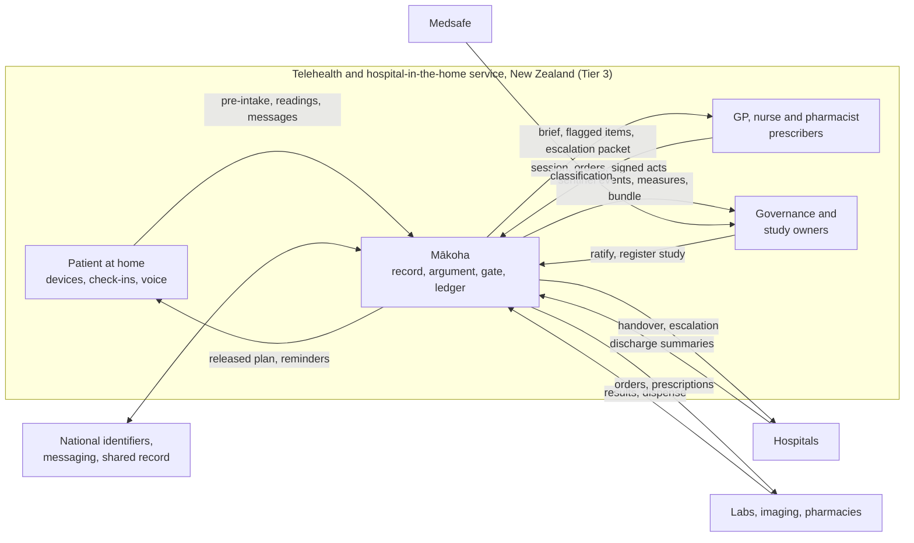
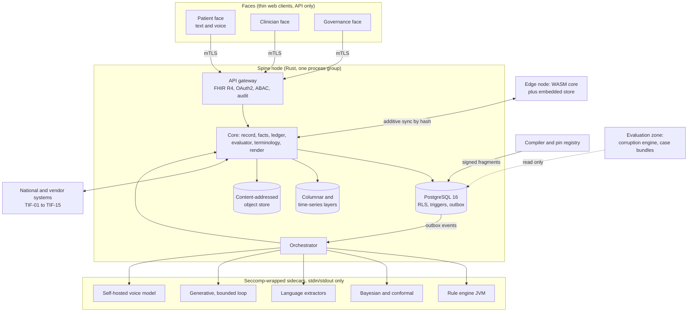

# Mākoha — Product Specification Document

Intended purpose: A build-ready specification set that a delivery team or coding agents with no access to the source repositories can build Mākoha from, tier by tier, and that can be exported as the regulator bundle for each tier.

Compiled by docpipe from `docs/spec`. Edit the phase documents, not this file.

## Document register

| # | Document | Status | Version | Finalised | Hash |
|---|---|---|---|---|---|
| 1 | Product Requirements Document | final | 1.0 | 2026-09-25 | 945319a42d20e0ce |
| 2 | Concept of Operations | final | 1.0 | 2026-09-25 | 978e178898dc37f9 |
| 3 | Operations Concept | final | 1.0 | 2026-09-25 | 2566aaa0e9b9bf55 |
| 4 | Technical Specifications | final | 1.0 | 2026-09-25 | a3e788961563417d |
| 5 | Specific Requirements | final | 1.0 | 2026-09-25 | 182f72a000933d5b |
| 6 | Validation Activities | final | 1.0 | 2026-09-25 | 5f7ecdaa17a52a10 |
| 7 | Completion and Approvals | final | 1.0 | 2026-09-25 | 8ab64da5329ef3d8 |

# 0. Idea

# Idea

Mākoha is a clinical language layer and an AI-native record for primary care, built so that everything a clinician reads, a patient is told, or a regulator inspects can be traced to a structured, replayable argument. Primary care produces most of its knowledge as free text (consultation notes, referrals, discharge summaries, pathology comments, patient messages); current systems store that text but cannot reason over it, so clinicians re-read it every visit, safety checks fire on coded fields only, and audit means sampling paper. Learned models can now read that text well but with unstated error rates and no usable statement of confidence. Mākoha closes both gaps: language becomes structured facts with span-level provenance; facts feed engines that propose decisions as argument objects (claim, grounds, warrant, backing, qualifier, rebuttals) carrying six typed, non-coercible uncertainty signals; and a pure, deterministic five-stage evaluator is the only authority that assigns one of three verdicts (released, flagged, held). Every evaluation pins all its inputs by content hash so replay years later reproduces the same verdict byte for byte. One append-only ledger serves three authorised faces: patient, clinician and governance. Knowledge enters the runtime only through a signed compiler; engines are pure functions; rendering cannot change meaning; clinician attention is budgeted; evaluation is adversarial and firewalled. It serves general practice, nurse and pharmacist prescribers, telehealth, hospital in the home, practice governance and regulators, and patients. Already decided: Rust core for ledger, evaluator, argument types, terminology and render (D-01); three build-time regulatory tiers; no autonomous prescribing, no online learning in production, no fusion of probabilities across engines, no composite ranking of patients or clinicians. The full architecture and engineering plan is the Mākoha Design Compendium (thirteen volumes plus four build volumes, 25 Sep 2026, Ken Lee), kept at `docs/ref/makoha-design-compendium.md`; the decision register there holds eleven entries (D-01, D-02, D-03, D-04, D-05, D-06, D-07, D-08, D-09, D-10, D-11), several open or provisional.

# 1. Product Requirements Document

_status: final · version 1.0_

# Product Requirements Document

Revised 25 Sep 2026 after finalisation on approval of change requests CCR-01 to CCR-04 raised in 02-conops.md and OCR-01 to OCR-03 raised in 03-opscon.md (FDA as possible third regulator; Ketryx and billing questions closed): first release moved to Tier 3, pre-intake agent placed in Tier 3, New Zealand regulatory wording corrected, voice capability added. Structure unchanged.

Source of record for every derived statement below: the Mākoha Design Compendium (25 Sep 2026, Ken Lee), `docs/ref/makoha-design-compendium.md`, cited by volume and section. Identifiers minted here: G- (goals), NG- (non-goals), CAP- (capabilities), MET- (success metrics), CST- (constraints). Identifiers of the form D-nn and the acceptance-test ids (for example NER-01, LED-03) are the compendium's own and are carried unchanged.

## 1. Intended purpose and conventions of this set

Confirmed 25 Sep 2026 and recorded in `docpipe.json`.

| Convention | Value |
| --- | --- |
| Intended purpose | A build-ready specification set that a delivery team or coding agents with no access to the source repositories can build Mākoha from, tier by tier, and that can be exported as the regulator bundle for each tier. (Confirmed unchanged 25 Sep 2026; the launch strategy in section 8.1 is detail under this intent, not a change to it.) |
| Project name / system name | Mākoha / Mākoha platform |
| Identifier pattern | `\b[A-Z][A-Z0-9]{0,4}-\d{2,3}\b`; compendium families (D-, E2E-, LED-, ARG-, REN-, ADV-, ENG-, KP-, PUR-, and the capability and operation test ids) adopted unchanged; PRD families listed above |
| Requirement syntax (phase 5) | EARS: keyword start (The / When / While / If / Where), exactly one "shall" per requirement |

Identifiers are minted once and never renumbered; a withdrawn item is kept with a reason.

## 2. Problem statement

Derived from Volume 1.1.

Primary care produces most of its knowledge as free text: consultation notes, referral letters, discharge summaries, pathology comments, patient messages. Current systems store this text but cannot reason over it, so the clinician re-reads it every visit, safety checks fire on coded fields only, and audit means sampling paper. Learned models can now read that text well, but with unstated error rates and no way to state their certainty in a form a safety case can use.

Two gaps, closed together: (a) language becomes structured facts with provenance to the span they came from; (b) every machine proposal carries a machine-checkable statement of its own uncertainty, and a fixed arithmetic procedure decides whether it may be shown, must be flagged, or must be withheld. The same procedure runs identically years later against the same pinned inputs, which is what makes the system auditable rather than merely logged.

## 3. Users and settings

Derived from Volume 1.4 and Volume 1A.4. Each row becomes a role and a setting profile in phase 3.

| Setting / user | Primary gain | What they do today instead | Governed by |
| --- | --- | --- | --- |
| General practice (GP) | Consult-prep brief within a reading budget; safety checks on free text as well as codes; coding proposals with span-level evidence | Re-read the record each visit; coded-field-only alerts; manual coding | Volumes 9, 12 |
| Nurse and pharmacist prescribers | Scope-of-practice profile applied at evaluation time; every prescribing argument carries the guideline fragment and its version | Phone the GP; paper protocols | Volumes 5, 6 |
| Telehealth clinicians and locums | Agentic pre-intake (typed, or by voice for patients slow at or unable to text) produces structured grounds before the call; the pre-intake summary is itself an argument, rejectable line by line | Unprepared sessions with unfamiliar patients | Volumes 4, 9 |
| Hospital in the home (HITH) teams | Orders sent straight to patients with a state machine surfacing overdue and unacknowledged items; inbound results reconcile to the originating order | Ward-style supervision without ward tooling | Volume 3 |
| Practice governance and regulators | Sentinel events, prospective studies and audits are queries over the ledger; a regulator bundle is a signed export of a time window | Audit by sampling paper; studies as projects | Volumes 8, 10 |
| Patients | Engagement loops driven by released arguments only; never sees a held or flagged item; sees a released one only after sign-off | Plan communicated verbally or not at all | Volumes 2, 9 |
| Study owners and clinical researchers (through the governance face) | Prospective studies registered as sealed envelopes, cohorts by phenotype, enrolment on match with consent scope, endpoints as validated Measures, consented de-identified extracts | Studies as separate projects outside the record | Volumes 2A, 3A.10, 10.4 |

First adopters (stated 25 Sep 2026): telehealth and hospital-in-the-home services whose workforce is general practitioners together with nurse and pharmacist prescribers, on the Tier 3 general-purpose-assistant profile so that real-time voice interaction ships from day one (CCR-02). General practice as a standalone setting, and patients as a face, follow after the first release. See section 8.

## 4. Goals and non-goals

Goals derived from Volume 1.1 and the horizon statements of Volume 1A.8; non-goals verbatim from Volume 1.3.

| Id | Goal | Horizon statement (1A.8) |
| --- | --- | --- |
| G-01 | Structured, span-provenanced facts from all free text in the record | No fact written in prose is lost |
| G-02 | Every recommendation reaches a person only as a gated argument with typed uncertainty | Only arithmetic releases (Law 4) |
| G-03 | Every decision replayable byte for byte from pinned inputs | Deterioration detected as one reconstructable trajectory; evidence loop closed |
| G-04 | Clinician prepared before every session within an attention budget | No clinician opens a consultation unprepared |
| G-05 | Every prescription checked against the whole reconciled medication story | Every prescription checked against the whole medication story |
| G-06 | Inbound results, letters and messages triaged and routed before a human sees them | Every result, letter and message read and actioned before a human sees it |
| G-07 | Advanced-practice prescribers at top of scope with a full-context escalation packet | Context, not calls |
| G-08 | Patients receive their signed plan in their own words | Patients receive their plan in their own words |
| G-09 | Primary care as a complete, consent-respecting, de-identified longitudinal dataset | Primary care as a complete longitudinal dataset |
| G-10 | Prospective clinical studies run concurrently with operations from the first launch: they validate the system, support iterative development cycles and allow user-group feedback, so safety and efficacy evidence accrues in the ledger alongside use (stated 25 Sep 2026) | Guidelines measured against practice, practice against outcomes, evidence loop closed |

| Id | Non-goal (Volume 1.3) |
| --- | --- |
| NG-01 | Autonomous prescribing, or acting on an order without a signing clinician |
| NG-02 | Online learning in production |
| NG-03 | Fusing probabilities from different engines into a single score |
| NG-04 | Presenting a base model's opinion of its own output as a control (it may only feed a human-review queue) |
| NG-05 | Ranking patients or clinicians by any composite; risk registers list evidence-backed suspects, each with its own argument |

## 5. Governing principles

Derived from Volume 1.2 and 1.6. These ten laws bind every downstream document; each has a conformance test (Volume 10) and a code-level enforcement point.

| Law | Statement | Enforcement point | Proof |
| --- | --- | --- | --- |
| 1 | One record, three faces: a single append-only ledger; patient, clinician and governance portals are authorised views, never copies | Ledger DDL, RLS policies (8.1, 8.3) | LED-03, LED-04 |
| 2 | The argument is the unit of decision: claim, grounds, warrant, backing, qualifier, rebuttals; nothing reaches a face that is not an argument | Orchestrator accepts only `ArgumentDraft`; faces read only `actual_argument` | ENG-02, single-gate negatives (5.6) |
| 3 | Uncertainty is typed and non-coercible: six signals (posterior, coverage, membership, reliability, fit, ignorance) as fixed-point values in separate types; no averaging or cross-kind comparison | `Fixed6` and signal types (4.3, 4.7) | ARG-01..03 compile-fail |
| 4 | Only arithmetic releases: a pure evaluator with five fixed stages assigns one of three verdicts (released, flagged, held); models propose, never release | Evaluator crate; verdict-class cap (5.4) | V-00..V-04, C-17 |
| 5 | Every input is pinned: eight pin classes by content hash on every attempt; replay reproduces the verdict byte for byte | `attempt.pins` NOT NULL; completeness check | LED-06, LED-07 |
| 6 | The compiler is the only door for knowledge: signed, versioned fragments admitted through eleven gates; hand edits impossible by construction | `GRANT INSERT ON pin_registry, generic_argument TO compiler` only | Gate fixtures (6.3) |
| 7 | Engines are pure functions of pinned inputs: no I/O, clock, or randomness; two-process purity harness | seccomp profile; harness | PUR-01..06, ENG-03 |
| 8 | Rendering cannot change meaning: three registers (clinician, patient, regulator); no register omits, adds or reorders a rebuttal or qualifier signal | Render-invariance property (9.3); class-U compiler gate | REN-01, REN-02 |
| 9 | Attention is budgeted, not begged: fixed number of interruptive items per encounter under a versioned suppression policy; suppressed items remain reachable and counted | Brief algorithm and suppression record (9.5, 9.6) | REN-05, REN-07 |
| 10 | Evaluation is adversarial and firewalled: continuous corruption engine; no test case, sealed envelope or feedback signal reaches training or knowledge except through the compiler | Zone label; compiler gate 1 | ADV-02 |

Four set-wide conventions also hold (compendium, "How to read"): every behaviour-governing number is a configured, versioned, signed value, never a code literal; released, flagged and held are the only states of decision support and only the evaluator assigns them; every learned-model output is a proposal until gated; every volume ends in a numbered acceptance-test table that is the contract with the delivery milestones.

## 6. Success metrics

Derived from Volume 1A.6 (instrumented benefits) and 1A.8 (horizon thresholds). Each is a Measure resource computed from ledger events, replayable (same period, same pins → identical MeasureReport hash, RPT-03). The compendium fixes how each baseline is captured but no baseline values exist yet; they are captured at cut-over.

| Id | Metric | Definition (numerator / denominator, source events) | Target (1A.8) | Baseline | Cadence |
| --- | --- | --- | --- | --- | --- |
| MET-01 | Coverage gap | Facts existing only in narrative / all facts, per fact type (1A.1) | ≤ 2% for problems, medications, allergies, results-follow-ups | Audit sample at cut-over {{TBD: baseline, captured at cut-over at the first site (deferred 25 Sep 2026)}} | Monthly |
| MET-02 | Documentation time | Minutes from encounter finish to note-sign act / encounters; after-hours sign acts / all sign acts | Derived and captured through the Ketryx integration (the Ketryx interface in 03-opscon.md; OCR-02) {{TBD: value, set in Ketryx}} | Migration month {{TBD: baseline, captured at cut-over at the first site (deferred 25 Sep 2026)}} | Weekly |
| MET-03 | Missed follow-ups | Open-loop rate: orders past expected window without result act / orders; median time from result event to action act | Zero unrouted items > 24 h; unactioned age p95 < configured | Migration month {{TBD: baseline, captured at cut-over at the first site (deferred 25 Sep 2026)}} | Weekly |
| MET-04 | Prescribing safety | Held and flagged prescribing attempts with override / all; adverse-reaction facts detected per 1,000 prescriptions; prescriptions signed with unresolved discrepancy | Unresolved-discrepancy signs = 0; discrepancy median age < 24 h | First quarter {{TBD: baseline, captured at cut-over at the first site (deferred 25 Sep 2026)}} | Monthly |
| MET-05 | Deterioration lead time | First flagged deterioration attempt to escalation act; unplanned admissions per episode | Re-score latency p95 < 10 s; trajectory replay identical | First quarter {{TBD: baseline, captured at cut-over at the first site (deferred 25 Sep 2026)}} | Monthly |
| MET-06 | Register completeness | Narrative-plus-code members / manual-audit sample members | Derived and captured through the Ketryx integration (the Ketryx interface in 03-opscon.md; OCR-02) {{TBD: value, set in Ketryx}} | Audit sample at cut-over {{TBD: baseline, captured at cut-over at the first site (deferred 25 Sep 2026)}} | Monthly |
| MET-07 | Advanced-practice scope use | Encounters completed within scope / encounters in prescriber settings; escalation packets with full context / escalations | Escalations with packet = 100% | First quarter {{TBD: baseline, captured at cut-over at the first site (deferred 25 Sep 2026)}} | Monthly |
| MET-08 | Grounded telehealth | Brief delivered before session join / sessions; re-contact within 72 h / sessions; clinician-rated preparedness | Brief-before-session ≥ 99% over a quarter | First quarter {{TBD: baseline, captured at cut-over at the first site (deferred 25 Sep 2026)}} | Monthly |
| MET-09 | Patient plan delivery | Patient-register summaries delivered within 24 h of sign-off / signed | ≥ 95% | {{TBD: baseline, captured at cut-over at the first site (deferred 25 Sep 2026)}} | Monthly |
| MET-10 | Dataset completeness | Exported fact count / ledger fact count for consented patients; identifier residuals on audit sample | ≥ 99%; zero residuals | {{TBD: baseline, captured at cut-over at the first site (deferred 25 Sep 2026)}} | Quarterly |
| MET-11 | Inbound triage | Triage latency; queue order by urgency | p95 under 5 s | {{TBD: baseline, captured at cut-over at the first site (deferred 25 Sep 2026)}} | Weekly |
| MET-12 | Equity visibility | Outcome measures stratified by SDOH fact presence, with imprecise-Dirichlet intervals | Published per quarter | First quarter | Quarterly |
| MET-13 | Evidence loop | Release-capable fragments with an adherence MeasureReport per quarter / all; attempts carrying the feedback-overlay pin / all | 100%; 100% | n/a | Quarterly |

## 7. Capabilities, prioritised

Derived from Volume 1A.2 (eighteen capability services) and 1A.8 / 11.5 (milestones). Verdict class fixes the ceiling of each output: class 1 deterministic may be released; class 2 (frozen model with declared error) reaches a person only as flagged or via a queue; class 3 (self-judgement, bounded generative loop) only via a queue. Pass/fail is the compendium's acceptance test. Priority: the first release is the Tier 3 profile (section 8.1), so class-1, class-2 and class-3 capabilities are all in scope for it; class-3 outputs reach a person only through a review queue. Build order remains M1 to M9 (11.5).

| Id | Capability | Service / class | Tier | Pass/fail (acceptance test) | Serves |
| --- | --- | --- | --- | --- | --- |
| CAP-01 | Clinical entity recognition | `lang-ner` (2) | 2 | NER-01 F1 ≥ declared on held-out practice notes by document type; per-subgroup report in pin | G-01 |
| CAP-02 | Assertion status | `lang-assert` (2) | 2 | AST-01 "no chest pain" → Absent; "mother had breast cancer" → FamilyMember; both excluded from present-problem queries | G-01 |
| CAP-03 | Relation extraction | `lang-rel` (2) | 2 | REL-01 "metformin 500 mg bd" → three relations; structured dose equals parser output | G-01 |
| CAP-04 | Terminology mapping and entity resolution | `lang-map` (2) + `terminology` (1) | 1 (terminology), 2 (mapping) | MAP-01 tier-3 binding caps draft at flagged; MAP-02 two documents' mentions resolve to one subject id | G-01 |
| CAP-05 | Temporal extraction | `lang-time` (2) | 2 | TIME-01 "for the past 3 weeks" on a note dated D → onset D−21d ± declared tolerance | G-01 |
| CAP-06 | Document classification and routing | `lang-classify` (2) + routing rules (1) | 1 (rules), 2 (classifier) | CLS-01 discharge summary classified and routed to reconciliation queue; low reliability → human classification queue | G-06 |
| CAP-07 | Clinical phenotyping | `phenotype` (1) | 1 | PHE-01 definition using an Absent fact never matches; PHE-02 membership replayable | G-03, G-09 |
| CAP-08 | Risk stratification | `risk-*` (2, conformal-wrapped) | 2 | RISK-01 output never exceeds flagged; RISK-02 evidence list equals facts consumed | G-02 |
| CAP-09 | Adverse-event and safety-signal detection | `lang-ae` (2) | 2 | AE-01 detected reaction becomes flagged ground on next prescribing check of that class | G-05 |
| CAP-10 | Social determinants extraction | `lang-sdoh` (2) | 2 | SDOH-01 fact shown "from note" until confirmed; excluded from measures below floor | MET-12 |
| CAP-11 | Patient-voice and sentiment | `lang-voice` (2) | 2 | VOICE-01 output routes to triage lane only; cannot create a condition fact | G-06 |
| CAP-12 | Summarisation | `gen-summary` (3, bounded loop) | 3 | SUM-01 sentence without a fact citation fails the fidelity tester; SUM-02 three failures → no draft | G-04 |
| CAP-13 | Question answering over the record | `gen-qa` (3) + `facts` search (1) | 3 | QA-01 answer cites facts only; QA-02 "last eGFR" returns the observation version and span | G-04 |
| CAP-14 | De-identification | `deid` (2 text, 1 structured) | 1 (structured), 2 (text) | DEID-01 export type cannot hold identifier fields; DEID-02 residual identifier rate on adjudicated set below declared | G-09 |
| CAP-15 | Trial and pathway matching | `match` (1) | 1 | MATCH-01 unknown criterion → Fit Unknown → flagged, never released | G-02 |
| CAP-16 | Multimodal ingestion | `inbound` OCR/layout (2), waveform promotion (1) | 1 (rules), 2 (OCR) | MM-01 OCR block below reliability floor excluded from facts; MM-02 promotion rule replayable | G-01, G-06 |
| CAP-17 | Domain packs | Configuration of CAP-01..16 by locale/specialty fragments | 1 | PACK-01 switching pack changes only pins K/I; engine pins unchanged | G-03 |
| CAP-18 | Workflow embedding | `orchestrator` + faces | 1 | WF-01 every rendered item has an argument id and attempt id in its response headers | G-02, G-04 |
| CAP-20 | Real-time voice-to-voice patient interaction for pre-intake, check-ins and messages, using a self-hosted voice model whose weights are content-hash pinned (examples stated: Fish Audio); runs under the Volume 7.5 bounded loop and writes only questionnaire responses and communications with dialogue spans (minted here, stated 25 Sep 2026; CCR-02) | `voice` sidecar (3) | 3 | Scope test as for the typed pre-intake agent (Volume 3A.11): cannot write anything but QuestionnaireResponse; no recording without a consent resource (Volume 3A.11 telehealth tests); {{TBD: acceptance test for turn latency and transcript fidelity, phase 4}} | G-04, G-08; risk 9 in 02-conops.md |
| CAP-19 | Prospective study machinery: StudyDefinition, prospective enrolment on phenotype match with consent scope, sealed envelopes, evaluation register, measure validation, findings-to-change flow (minted here from Volumes 2A, 3A.10 and 10.4) | `reporting::studies` (1), sealed envelopes (1) | 1 | ST-01 enrolment occurs on match event and is refused without consent scope; ST-02 interim reads cannot alter the sealed plan; ST-03 pin change creates a revalidation task; RE-01 fragment without evaluation-register entry refused; RE-02 every ratified change links to a prior MeasureReport and a follow-up study; ADV-03 | G-10 |

The seventeen runtime operations (Volume 1A.3), the five setting profiles (1A.4) and the layer-to-crate map (1A.5) are the phase-3 and phase-4 derivations of this table and are not restated here.

## 8. Release boundary

Derived from Volume 11.2 (tier manifests) and 11.5 (delivery plan). The compendium fixes the build order and the tier contents but does not name the first version a real user adopts.

| Tier | Contents | Excluded at build | Regulatory posture |
| --- | --- | --- | --- |
| Tier 1 — Record and workflow | Spine, ledger, faces, terminology, orders, inbound, deterministic rule engine (class 1 only) | All class-2 and class-3 engines; conformal wrapper; generative loop | Clinical information system; no diagnostic claim |
| Tier 2 — Decision support | Tier 1 plus class-2 engines under conformal wrapper, fit engine, attention layer, corruption engine, regulator bundle | Generative loop | Software as a medical device, decision-support class; flagged-only for class 2 |
| Tier 3 — General-purpose assistant | Tier 2 plus bounded generative loop and class-3 queues | Nothing; permitted-prompt whitelist is signed configuration (D-06) | Highest class; class-3 never a control |

Build order: M1 argument and fixed-point crates → M2 evaluator → M3 ledger → M4 compiler and registry → M5 spine functions → M6 Tier 1 engines → M7 faces and rendering → M8 governance → M9 Tier 2 and 3 engines. M5 is complete only when every Volume 3A module ships and parity suite E2E-01 to E2E-12 passes.

### 8.1 First adoptable version (stated 25 Sep 2026)

| Item | Decision |
| --- | --- |
| Settings | Telehealth and hospital in the home |
| Workforce | General practitioners, nurse prescribers and pharmacist prescribers operating those two settings, each under their scope-of-practice profile (1A.4) |
| Tier | Tier 3 — general-purpose assistant (ruled 25 Sep 2026 on CCR-02, superseding the earlier Tier 2 and Tier 1 options, so that voice interaction ships from day one; the loss-matrix ratification of D-05 and the New Zealand sponsor and WAND obligations of CST-03 are first-release gates; the D-06 permitted-prompt whitelist is first-release signed configuration) |
| Site | Site agnostic; no reference site named |
| Jurisdictions | New Zealand (Medsafe) first, Australia (TGA) second, possibly the United States (FDA) third (OCR-01, 25 Sep 2026) |
| Launch shape (strategy, stated 25 Sep 2026) | Small launch. Prospective studies (CAP-19) run concurrently with operations from day one. Reasoning: a prospective study validates the system, supports iterative development cycles, and allows user-group feedback, so a body of research evolves alongside the demonstration of safety and efficacy (G-10) |
| Jurisdiction order | New Zealand under Medsafe first, as a first approval before new legislation closes the current regulatory window (CST-12); Australia under the TGA second |
| Explicit exclusions | None stated; the Tier 3 manifest excludes nothing at build (11.2) |

### 8.2 What Tier 3 leaves in for those settings (derived)

Derived by applying the Tier 3 manifest (11.2), which excludes nothing at build, to the operations each setting weights (1A.4) and the engine class of each operation (1A.3). Class-1 outputs may be released; class-2 outputs reach a person only as flagged, under the conformal wrapper, with a validation report in the engine pin; class-3 outputs (bounded generative loop, Volume 7.5) reach a person only through a review queue and are never a control. The pre-intake conversational agent and the voice agent (CAP-20) are class 3 (CCR-01, CCR-02).

| Operation (1A.3) | Telehealth | HITH | In the first release | Class ceiling |
| --- | --- | --- | --- | --- |
| 1 Record pre-read and brief | yes | yes | Brief assembler; `gen-summary` summary draft as a queued item | Brief released; summary queue |
| 2 Ambient transcription and live extraction | yes | yes | ASR and language services 1 to 5; session facts excluded from grounds until note signed | Facts only |
| 3 Working differential and next-best-question | yes | no | Bayesian differential and EIG question ordering, flagged "consider" with rebuttals (D-09) | Flagged |
| 6 Inline record Q&A | yes | no | `facts` search and `gen-qa` answers citing facts | Queue |
| 7 Note, orders, letters, patient summary drafting | no | yes | Order builder from signed facts; `gen-summary` drafts, unsigned | Queue; sign-off act per item |
| 9 Follow-up task generation | no | yes | Whole operation | Released |
| 10 Inbound document triage | no | yes | Classifier, routing rules, summary | Summary queue; routing released |
| 12 Message triage | yes | no | `lang-voice` urgency and distress, red-flag rules, suggested response draft | Lane released; response queue |
| 13 Continuous risk re-scoring | yes | yes | `risk-*` engines under conformal wrapper; HITH deterioration, sepsis and readmission engines; daily trajectory | Flagged |
| 16 Quality and safety analytics | no | yes | Whole operation | Reports |
| Pre-intake (Volume 2A.1) | yes | yes | Conversational agent, typed or by voice (CAP-20), writing questionnaire responses with dialogue spans; pre-intake summary as a queued argument | Queue |

Consequence: the first release carries the whole platform for the two settings, including the generative loop and class-3 queues, with the permitted-prompt whitelist as signed configuration (D-06). Every class-2 engine needs a validation report in its pin (1A.7) and every class-3 output passes the class-2 testers of the bounded loop before it is queued.

Capabilities in scope for this release: CAP-01 to CAP-20. The research path through CAP-07 (cohorts), CAP-15 (enrolment), CAP-14 (extracts) and CAP-19 is a first-launch item because of G-10.

### 8.3 Claim types in the first release (stated 25 Sep 2026)

The closed vocabulary for the set is the union of Volume 4.2 (diagnosis, prescribing, referral, recall, coding proposal, pre-intake summary, patient message) and the types used in Volumes 1A, 7, 7.4 and 10 (risk, safety-signal, differential, eligibility, suppression, gather_information, pre-intake question); see change request CR-01 as amended by CCR-04. The first release ships these ten, each needing a ratified loss matrix (D-05, CST-10) and a compiled template before go-live:

| Claim type | Drafted by (1A.2, 1A.3) | Settings |
| --- | --- | --- |
| prescribing | Rule engine, operation 4 | Telehealth, HITH |
| differential | Bayesian differential, operation 3 | Telehealth |
| risk (deterioration, sepsis, readmission) | `risk-*` engines, operation 13 | HITH, telehealth |
| safety-signal | `lang-ae`, CAP-09 | Both |
| pre-intake summary | Pre-intake agent (Volume 2A) | Telehealth |
| recall | Recall rules, operation 15 | HITH |
| gather_information | Abstention render (Volume 4A), class 1 | Both |
| suppression | Governed suppression rule (Volume 9.6) | Both |
| patient message (confirmed 25 Sep 2026) | `lang-voice` triage and the class-3 suggested-response draft, operation 12; patient-facing engagement-loop messages (Volume 2.2); class 3 for drafted content, class 1 for rule-driven reminders | Telehealth, HITH |
| eligibility (confirmed 25 Sep 2026) | `match` engine, CAP-15, operation 14; class 1; released only when Fit In and all criteria met, else flagged | Both; drives prospective enrolment (CAP-19) and pathway matching |

Out of the first release: diagnosis, referral, coding proposal.

Order of priority if further claim types are added, judged by G-10 and the release settings:

| Order | Claim type | Why here | Class |
| --- | --- | --- | --- |
| 1 | eligibility | Prospective enrolment on phenotype match is the recruitment mechanism for every study; without it studies use fixed id lists only | 1 |
| 2 | referral | Telehealth hand-back packet and HITH discharge-to-GP handover are referral-shaped acts; rule-driven | 1 |
| 3 | coding proposal | Closes the coverage gap (MET-01) and register completeness (MET-06), which are study endpoints | 2 |
| 4 | diagnosis | Highest regulatory weight; nothing in the first-launch settings needs a released diagnosis claim | 2 |

Milestones: the first release requires M1 to M9 complete, with M9 delivering the Bayesian, conformal-wrapper and extractor engines, the bounded generative loop and the voice sidecar (CAP-20) in the Tier 3 build.

## 9. Constraints and their sources

Derived from Volume 13.1 and 11.3, 11.4.

| Id | Constraint | Source |
| --- | --- | --- |
| CST-01 | Core language is Rust for ledger, evaluator, argument types, terminology and render; `#![forbid(unsafe_code)]` in evaluator and argument crates; `cargo deny` bans float-math crates from the evaluator | D-01; Volume 11.3 |
| CST-02 | Regulatory profiles are build-time exclusions with a signed manifest (build hash, features, crate hashes, sidecar digests, SBOM, seccomp profiles, pin classes) | Volume 11.1, 11.2 |
| CST-03 | New Zealand (first): under the Medicines Act 1981 there is no pre-market approval or classification to confirm; a New Zealand sponsor is appointed, the device is notified in Medsafe's WAND database within 30 days, evidence of safety for intended purpose is held, and post-market obligations (complaints, adverse events, recalls, changes) are met. These gate the first release. Australia (second): device classification per tier as D-11 states, confirmed with the TGA; Tier 3 is the highest class. United States (possible third, stated 25 Sep 2026): FDA classification as a compliance item, captured through the Ketryx integration. The Medical Products Bill, once commenced, will regulate software as a medical device including AI for a therapeutic purpose in New Zealand | D-11 as amended by CCR-03; section 8.1; 02-conops.md section 5 |
| CST-04 | Terminology edition pinned to the current national edition for the jurisdiction in force: New Zealand first, then Australia; licence recorded in the obligations register | D-07; stated 25 Sep 2026 |
| CST-05 | Sidecars (JVM rule engine, Bayesian/conformal, extractor, generative) run as separate seccomp-wrapped processes, no network namespace, stdin/stdout only, killed on any denied syscall | Volume 11.3 |
| CST-06 | Store is PostgreSQL 16 with row-level security per role; ledger schema insert-only; store-level encryption plus per-patient hash chain and Merkle anchor | Volume 11.3, 11.4 |
| CST-07 | Identity per face; professional tokens bind registration number and scope-of-practice profile; mTLS between faces and gateway; break-glass requires reason, writes an act, sentinel entry | Volume 11.4 |
| CST-08 | No clinical behaviour depends on any secret; secrets only for transport and signing keys in a hardware-backed store | Volume 11.4 |
| CST-09 | Provisional (unratified) templates may reach flagged but never released | D-02 |
| CST-10 | Loss matrices per claim type must be ratified by clinical governance before Tier 2; the first release is Tier 3, which contains Tier 2, so ratification for every claim type it ships gates it | D-05; section 8.1 |
| CST-11 | Edge node is the Rust core compiled to WASM with an embedded store, additive sync | Volume 11.3, Volume 3.6 |
| CST-13 | Voice interaction uses a self-hosted voice model whose weights are content-hash pinned (pin class W), so that Laws 5 and 7 hold; a vendor-hosted voice API is not acceptable. Examples stated: Fish Audio | Stated 25 Sep 2026; 02-conops.md open questions |
| CST-12 | Timeline: as fast as possible, driven by a closing window of regulatory opportunity in New Zealand: the Medical Products Bill (replacing the Medicines Act 1981) will regulate software as a medical device including AI for a therapeutic purpose; the Government intends to introduce it in 2026 with commencement around 2030 and a longer transition for many devices (Cabinet decisions to 7 April 2026). The window closes at commencement. No fixed date, budget or partner commitment stated. Commercial constraints: none stated | Ken Lee, 25 Sep 2026 |

## 10. Decisions already taken

Carried verbatim from Volume 13.1.

| Id | Decision | Default in the compendium | Owner | Affects volumes |
| --- | --- | --- | --- | --- |
| D-01 | Core language: Rust for ledger, evaluator, argument types, terminology, render | Adopted | Architecture | 4, 5, 8, 11 |
| D-02 | Provisional templates (not yet ratified) may reach flagged but never released | Adopted | Clinical governance | 5, 6 |
| D-03 | Qualifier shape: six typed signals including ignorance | Adopted; supersedes any earlier five-signal or set-based shape | Architecture | 4 |
| D-04 | Conflict predicate vocabulary (contradicts, excludes, supersedes, duplicates, interacts) | Provisional list; closed once ratified | Clinical governance | 5, 8 |
| D-05 | Loss matrices per claim type | Placeholder matrices ship; ratification required before Tier 2 | Clinical governance | 5 |
| D-06 | Tier 3 prompt whitelist as signed configuration, not build feature | Adopted | Architecture | 7, 11 |
| D-07 | Terminology edition pin and licence for the jurisdiction | Pin the current national edition; licence recorded in obligations | Compliance | 6, 12 |
| D-08 | External Merkle anchoring mechanism | Publish root to an independent append-only log with a receipt; exact provider open | Architecture | 8 |
| D-09 | Live differential during encounter versus synthesis before | Synthesis before; live differential only as pre-intake question ordering | Clinical governance | 7, 9 |
| D-10 | Severity tier vocabulary (four tiers) | Provisional | Clinical governance | 9 |
| D-11 | Regulatory assumptions requiring confirmation (device classification per tier) | Tier 1 not a device; Tier 2 decision-support class; Tier 3 highest | Compliance | 11 |

## 11. Change requests to upstream

| Id | Target document | Target item | Change |
| --- | --- | --- | --- |
| CR-01 | Mākoha Design Compendium | Volume 4.2, Claim row (closed vocabulary) | The closed vocabulary lists diagnosis, prescribing, referral, recall, coding proposal, pre-intake summary, patient message, while Volumes 1A, 7, 4A and 9 also use risk, safety-signal, differential, eligibility, gather_information, suppression and (7.4) pre-intake question. Close the vocabulary as the union of the two lists, or state which list governs. This PRD builds to the union. Amended 25 Sep 2026 by CCR-04. |

## 12. Assumptions

Seeded from the provisional rows of Volume 13.1 and the compendium's own conventions.

| Assumption | Confidence | How it would be checked |
| --- | --- | --- |
| Device classification per tier as stated in D-11 holds in the target jurisdiction | Low | Regulator confirmation (13.2 open item) |
| The national terminology edition can be licensed and pinned for the jurisdiction (D-07) | Medium | Licence obtained and recorded in the obligations register |
| Loss matrices for every first-release claim type can be ratified by clinical governance before go-live (D-05), given the first release is Tier 3 | Low | Ratification acts recorded as signed fragments through the compiler (gate 11) before the Tier 2 build is cut |
| A 10,000-patient synthetic practice is representative enough for Volume 3 latency budgets | Medium | Parity suite E2E-01..12 and budget tests on the synthetic set, then re-run on first live data |
| An independent append-only log with a receipt format exists for Merkle anchoring (D-08) | Medium | Provider selected and receipt format recorded |
| Baselines for MET-01..11 can be captured at cut-over from the incumbent system | Medium; depends on the incumbent system at the first site, which is unknown (site agnostic) | Audit sample and migration-month measures |
| The first launch can be notified in WAND and operating before the Medical Products Bill commences (around 2030) | Medium; introduction intended 2026, commencement stated as around 2030, transition period expected | Bill progress tracked against the M1 to M9 plan; reviewed at every milestone exit |
| Targets for MET-02 and MET-06 can be derived and captured through the Ketryx integration | Medium (scope confirmed 25 Sep 2026) | Targets recorded in Ketryx and quoted back here |

## 13. Open questions

Seeded from Volume 13.2; PRD questions added.

- [ ] Ratify loss matrices for the first five claim types (D-05)
- [ ] Close the conflict predicate vocabulary (D-04)
- [ ] Select the external anchor provider and record its receipt format (D-08)
- [ ] Confirm device classification per tier with the regulator (D-11)
- [ ] Publish the first threshold set and codebooks through the compiler before M6
- [ ] Produce the 10,000-patient synthetic practice for the performance suite before M5
- [x] First adoptable version: telehealth and HITH, GP plus nurse and pharmacist prescriber workforce, Tier 3, site agnostic (section 8.1; revised from Tier 2 on 25 Sep 2026)
- [x] Patient message included as the tenth first-release claim type (section 8.3, 25 Sep 2026)
- [ ] Whether the chosen self-hosted voice model is a native full-duplex speech-to-speech model or the capability is composed from speech recognition, a text engine and speech synthesis; decided in phase 4 (CST-13)
- [x] Claim types for the first release: the ten in section 8.3
- [x] Jurisdiction and regulator: New Zealand and Medsafe first, then Australia and the TGA (CST-03)
- [x] New Zealand billing scope: private billing, no claiming gateway in the first release (OCR-03)
- [ ] Baseline values for MET-01 to MET-11: deferred until the first site; captured at cut-over (section 6)
- [x] Commercial and timeline constraints: as fast as possible, none other (CST-12)
- [x] The New Zealand regulatory window closes at commencement of the Medical Products Bill, around 2030 (CST-12, revised 25 Sep 2026)
- [ ] Track the bill's progress so the launch date can be set against it; owner {{TBD: who tracks the bill (deferred)}}
- [x] Eligibility confirmed as the ninth first-release claim type (section 8.3)
- [x] Intended purpose confirmed unchanged; launch strategy recorded as detail in section 8.1
- [x] Ketryx integration: greenfield capture of applicable standards for TGA and possibly FDA applications; MET-02 and MET-06 targets captured there (OCR-02)

# 2. Concept of Operations

_status: final · version 1.0_

# Concept of Operations

Organisation-level view of how a telehealth and hospital-in-the-home service operates once Mākoha exists. Derived from the PRD (01-prd.md, final v1.0) and, where cited, the Mākoha Design Compendium (`docs/ref/makoha-design-compendium.md`). System-level behaviour belongs to phase 3. Identifiers minted here: SIT- (operational situations), STK- (stakeholders), POL- (policies), RSK- (operational risks), EXT- (external systems), CCR- (change requests raised by this document; CR- remains the PRD's family).

## 1. Mission and need

Derived from PRD section 2 and G-01 to G-10.

A telehealth and hospital-in-the-home service run by general practitioners with nurse and pharmacist prescribers needs to see a patient it may never have met in person, prepared, with the whole record reasoned over rather than re-read; to supervise patients at home as closely as a ward would; and to accrue evidence of its own safety and efficacy while it operates. Today's systems store the free text that holds most of the record's meaning but cannot reason over it, so preparation is re-reading, safety checks fire on coded fields only, deterioration is spotted per contact rather than as a trajectory, and audit or research means a separate project over sampled paper.

The need is a record that turns language into provenanced facts, lets machines propose decisions only as gated arguments with typed uncertainty, and makes every decision replayable, so that operations and prospective study are the same activity over the same ledger (PRD G-10, section 8.1).

## 2. How the job is done today

Stated 25 Sep 2026: the job is done today as a standard encounter or episode of care. Mākoha augments that encounter and episode; it does not replace the clinical process, the roles or the sequence. The walk-through is therefore the ordinary one: booking, pre-consultation history, consultation, orders and prescriptions, follow-up, inbound results and correspondence, and for HITH the admission to the episode, scheduled visits and monitoring, escalation and discharge.

Where it hurts, as stated: some patients are slow at, or less able to, text. Typed pre-intake, check-ins and messages exclude them. The stated solution is real-time voice-to-voice interaction for the patient face. OpenAI's GPT-Live-1 (API released 10 September 2026: full-duplex, listens and speaks at once, handles interruptions and backchannels, delegates reasoning and tool calls to a backend text model) was the first example named; on 25 Sep 2026 it was ruled that the voice model is self-hosted with content-hash-pinned weights so Laws 5 and 7 hold, examples including Fish Audio (PRD CST-13, CAP-20). The capability is class 3, which is why the first release is the Tier 3 profile (CCR-02, approved).

## 3. What changes: the desired operation as a delta

Derived from Volume 1A.3 (lifecycle: before, during, after, between, population), 1A.4 (setting profiles) and PRD section 8.2. Only what changes is named.

| Moment | Today (per PRD section 2) | With Mākoha |
| --- | --- | --- |
| Before the session | Clinician re-reads the record | A consult-prep brief of released arguments is ready before the session joins, within a reading budget; for telehealth, a pre-intake agent has already gathered structured grounds from the patient as a rejectable argument |
| During the session | Notes typed after; checks on coded fields | Ambient capture produces session facts; a flagged "consider" differential with next-best questions; prescribing checked against the reconciled medication story before signing |
| After the session | Follow-ups remembered or lost | Signed plan yields tasks with owners and due dates; coding proposals with span evidence; patient-register summary delivered after sign-off |
| Between contacts (HITH) | Deterioration noticed per visit | Device streams and check-ins re-score risk after every fact change; one trajectory; escalation packet carries the argument, not a phone summary |
| Inbound | Letters, results and messages read in arrival order | Classified, matched to the originating order, routed by urgency; discrepancies surfaced before a clinician opens the letter |
| Scope of practice | Nurse and pharmacist prescribers phone the GP | Profile applied at evaluation time; out-of-scope predicate creates an escalation packet with full context |
| Governance and research | Audit by sampling; studies as projects | Sentinel events, audits and prospective studies are queries over the ledger; a study is a sealed envelope with enrolment on phenotype match |

## 4. Stakeholders

Users derived from PRD section 3; non-users derived from PRD sections 9, 10 and 13 and Volume 2A.3. Rows marked proposed are not in upstream.

| Id | Stakeholder | Stake | User? |
| --- | --- | --- | --- |
| STK-01 | General practitioners operating telehealth and HITH | Prepared sessions; safe prescribing; supervising physician for HITH episodes | Yes |
| STK-02 | Nurse prescribers | Protocol pathways within formulary; escalation with context | Yes |
| STK-03 | Pharmacist prescribers | Reconciled medication history; medication review; red-flag routing | Yes |
| STK-04 | Patients and carers | Pre-intake, check-ins, device readings, results and plan in their own words; consent | Yes |
| STK-05 | Practice governance (clinical governance role) | Ratifies loss matrices, templates, thresholds; reviews sentinel events; owns the evaluation register | Yes |
| STK-06 | Study owners and clinical researchers | Register studies, enrol on match, read endpoints, receive consented extracts | Yes |
| STK-07 | Medsafe (New Zealand), then the TGA (Australia), possibly the FDA (United States) (OCR-01) | New Zealand: WAND notification by the sponsor and post-market obligations; Australia: device classification for the Tier 3 profile (D-11); United States: classification as a compliance item; regulator bundle for each | No |
| STK-08 | Compliance role | Terminology licence (D-07); obligations register; device confirmation | No |
| STK-09 | Architecture role | Owns D-01, D-03, D-06, D-08 | No |
| STK-10 | Hospitals discharging into HITH and receiving escalations | Send discharge summaries; receive handover and escalation packets | No |
| STK-11 | Laboratories, imaging providers, pharmacies | Receive orders; return results and dispense records | No |
| STK-12 | Health and Disability Ethics Committees (HDEC) and, for out-of-scope studies, an institutional ethics committee | Confirmed 25 Sep 2026 as low-friction. Mandated, not merely good practice, when a study is health and disability research within HDEC scope: intervention studies, and observational studies that use identifiable information without consent or carry other elevated risk. Audits and quality-improvement studies evaluating current or slightly changed practice are out of HDEC scope but still require ethics review by an institutional or independent committee under the NEAC National Ethical Standards (2019). Each study in SIT-07 is classified at registration | No |
| STK-13 | {{TBD: payer or funder of the service (deferred)}} | | No |

## 5. Operational environment

Derived from PRD sections 8.1 and 9, Volume 3A groups F, J and 3.2. External system names are as the compendium gives them; New Zealand instances are not yet named.

| Aspect | Description |
| --- | --- |
| Settings | Telehealth (video and phone sessions bound to encounters) and hospital in the home (episodes of care with scheduled visits, device streams, escalation rules) |
| Organisational unit | Deferred 25 Sep 2026 |
| Jurisdiction | New Zealand first (Medsafe), Australia second (TGA); site agnostic |
| Regulatory posture | Tier 3 profile (general-purpose assistant): class-2 outputs flagged only; class-3 outputs through review queues only, never a control; permitted-prompt whitelist as signed configuration (D-06). In New Zealand today there is no pre-market approval for medical devices under the Medicines Act 1981: a New Zealand sponsor notifies the device in Medsafe's WAND database within 30 days, holds evidence that it is safe for its intended purpose, and meets post-market obligations (complaints, adverse events, recalls, changes). The Medical Products Bill, to replace the Medicines Act, will regulate software as a medical device including AI used for a therapeutic purpose, with an internationally aligned definition that excludes general clinical software and general-use AI; Cabinet agreed further policy on 7 April 2026; the Government intends to introduce the bill in 2026 with commencement around 2030 and a longer transition for many devices. This is the closing window in CST-12. See CCR-03 |
| Physical | Clinicians remote; patients at home with connected devices (BP, glucose, SpO2, weight, wearables, HITH equipment); edge node possible on a practice server or in a browser |

| Id | External system (Volume 3A) | Direction | New Zealand instance |
| --- | --- | --- | --- |
| EXT-01 | National patient and provider identifiers | Lookup | National Health Index (NHI; new AAA11A# format issued from 1 July 2026) and Health Provider Index (HPI: Practitioner, Organisation, Facility, PractitionerRole), Health New Zealand \| Te Whatu Ora |
| EXT-02 | Secure clinical messaging network | Both | HealthLink (results, referrals, clinical documents, discharge summaries). GP2GP record transfer runs over it and is being stabilised then replaced by API-based transfer |
| EXT-03 | Shared national record | Both | Hira, Health New Zealand's national health information platform and API marketplace; NZ International Patient Summary (HISO 10099) as the exchange standard; regional clinical data repositories such as TestSafe (Northern region, on Sysmex Éclair) |
| EXT-04 | Electronic prescribing and dispense records | Both | New Zealand ePrescription Service (NZePS), via the Connected Health programme |
| EXT-05 | Laboratory and imaging result feeds | Inbound | Community and hospital laboratories and radiology via HealthLink; regional repositories (TestSafe) where available |
| EXT-06 | Hospital discharge summaries | Inbound | via EXT-02 or EXT-03 |
| EXT-07 | Terminology edition (national SNOMED CT edition) | Pinned | New Zealand edition (D-07); {{TBD: confirm release cadence and licence holder (deferred)}} |
| EXT-08 | Video session provider (WebRTC), SMS and email gateways | Both | Vendors deferred 25 Sep 2026. The voice agent is not an external system: it is a self-hosted sidecar (PRD CAP-20, CST-13) |
| EXT-09 | Home device gateways | Inbound | Vendors deferred 25 Sep 2026 |
| EXT-10 | Identity providers per face (professional registration, consumer identity) | Auth | Professional: HPI-bound registration (Medical Council, Nursing Council, Pharmacy Council). Consumer: {{TBD: national consumer health identity, unconfirmed by search (deferred)}} |
| EXT-11 | Billing | Both | Private billing in New Zealand: invoices, payments, receipts; no claiming gateway in the first release (OCR-03); Australian claiming channels return with the TGA release |
| EXT-12 | Independent append-only log for Merkle anchoring (D-08) | Outbound | Provider open |

## 6. Operational situations

Derived from Volume 1A.3 operations, the discharge acceptance episode in Volume 2A.4 and PRD section 8.2. Each has a trigger, actors and outcome so phase 3 can refine it into scenarios.

| Id | Situation | Kind | Trigger | Actors | Outcome |
| --- | --- | --- | --- | --- | --- |
| SIT-01 | Telehealth consultation with an unfamiliar patient | Routine | Appointment booked | Patient, pre-intake agent, GP or prescriber | Pre-intake argument and brief ready before join; session facts captured; flagged differential considered; prescriptions checked; tasks and patient summary signed |
| SIT-02 | HITH daily supervision | Routine | Episode active; scheduled check-in or device reading | Patient, devices, HITH nurse, supervising GP | Facts posted; risk re-scored after every change; next-day visit plan as tasks; daily summary queued for sign |
| SIT-03 | Deterioration at home | Urgent | Sustained device threshold breach or symptom check-in | Patient, HITH team, supervising GP, hospital | Critical-lane event; flagged deterioration argument; escalation packet with brief, facts, open attempts and acts; same-day action or "no longer fits home care" argument |
| SIT-04 | Post-discharge medication discrepancy | Exception | Discharge summary filed; patient reports a different dose | Inbound pipeline, pharmacist prescriber, patient | Disagreement row exists before any clinician opens the letter; pharmacist call task within 48 h; reconciled list before next prescribing check |
| SIT-05 | Inbound item that cannot be matched | Exception | Result or letter with low patient or order match weight | Inbound pipeline, reconciliation queue, staff | Never auto-filed; reconciliation queue; unfiled items past configured age escalate |
| SIT-06 | Prescriber reaches the edge of scope | Exception | Out-of-scope predicate fires or medication outside formulary | Nurse or pharmacist prescriber, GP | Order held; escalation packet created with argument ids; GP acts on the same graph without re-telling |
| SIT-07 | Prospective study alongside operations | Routine (governance) | Governance registers a study; cohort phenotype matches | Study owner, governance, patients (consent), evaluator | Sealed envelope; enrolment on match with consent scope; endpoints as validated Measures at window end |
| SIT-08 | Onboarding a service or site | Onboarding | New organisation, prescriber or patient cohort joins | Compliance, governance, architecture, staff | Profiles and scope fragments compiled; identities bound; baselines for MET-01 to MET-11 captured at cut-over |
| SIT-09 | Engine drift or retirement | Exception | Drift monitor breach on a class-2 engine | Governance, architecture | Engine pin retired; its claim types fall back to class 1; sentinel entry; no silent degradation |

## 7. Policies and constraints

Derived from PRD sections 5, 9 and 10 and Volume 2.1, 11.4. These bound how the service may be operated; phase 5 turns them into requirements.

| Id | Policy | Source |
| --- | --- | --- |
| POL-01 | No autonomous prescribing; no order acted on without a signing clinician | NG-01 |
| POL-02 | Only the evaluator assigns released, flagged or held; machine outputs are proposals until gated | PRD section 5, Law 4 |
| POL-03 | A held argument is invisible to every face; a flagged one is visible to clinician and governance only; a patient sees a released argument only after sign-off | Volume 2.1 |
| POL-04 | Scope of practice is a signed profile fragment applied at evaluation time; escalation carries the full context packet | PRD section 3; Volume 1A.4 |
| POL-05 | Consent gates secondary use, research export and contact for eligibility; withdrawal propagates as an event | Volume 2A.1; 3A.10 |
| POL-06 | Break-glass access requires a reason, writes an act and a sentinel entry | CST-07 |
| POL-07 | Loss matrices, templates and thresholds are ratified by clinical governance before use; provisional templates may reach flagged but never released | CST-09, CST-10 |
| POL-08 | Studies are registered as sealed envelopes before their window; a changed plan is a new envelope | Volume 10.4 |
| POL-09 | A New Zealand sponsor is appointed and the device notified in WAND, with safety evidence held, before the Tier 3 profile operates in New Zealand; TGA classification confirmed before Australia | CST-03 |
| POL-10 | No online learning in production; no fusion of probabilities across engines; no composite ranking of patients or clinicians | NG-02, NG-03, NG-05 |
| POL-11 | Privacy: Privacy Act 2020 and Health Information Privacy Code 2020; Telecommunications Information Privacy Code 2020 for telehealth traffic | Search 25 Sep 2026 |
| POL-12 | Practice: Health Practitioners Competence Assurance Act 2003; Health and Disability Commissioner's Code of Health and Disability Services Consumers' Rights; Medical Council of New Zealand Statement on Telehealth (same standard of care as in person, within the modality's limits; registration, examination and prescribing expectations); RNZCGP position statement on telehealth in primary care | Search 25 Sep 2026 |
| POL-13 | Prescribing: Medicines Act 1981 and Medicines Regulations 1984 (regulations 40 and 41 on prescriptions, with a current waiver on 41); Misuse of Drugs Regulations 1977; Medicines (Designated Prescriber: Registered Nurses) Regulations 2016 with the gazetted specified-medicines list and Nursing Council guidance (August 2024); pharmacist prescriber regulations {{TBD: exact instrument not confirmed by search (deferred)}} | Search 25 Sep 2026 |
| POL-14 | Devices: Medicines (Database of Medical Devices) Regulations 2003 (WAND notification by a New Zealand sponsor); the Medical Products Bill once enacted | Search 25 Sep 2026 |
| POL-15 | Research: NEAC National Ethical Standards for Health and Disability Research and Quality Improvement (2019); HDEC standard operating procedures for scope | Search 25 Sep 2026 |

## 8. Operational risks and mitigation concepts

Derived from the ten laws (PRD section 5), Volume 9.6, 3.4, 10 and PRD section 12.

| Id | Risk | For whom | Mitigation concept | Source |
| --- | --- | --- | --- | --- |
| RSK-01 | Alert fatigue: clinicians ignore flagged items | Clinicians, patients | Attention budget per encounter under a governed suppression policy; suppressed items reachable and counted | Law 9 |
| RSK-02 | Wrong-patient or wrong-order match on inbound | Patients | Probabilistic matcher with pinned weights; below threshold goes to reconciliation queue, never guessed | Volume 3.4 |
| RSK-03 | A class-2 engine degrades unnoticed | Patients | Drift monitor per engine per subgroup; breach retires the pin; claim types fall back to class 1 | Volume 1A.7 |
| RSK-04 | Home device miscalibrated or unknown | HITH patients | Device identity and calibration status stored; unknown calibration imposes a reliability floor | TH-04 |
| RSK-05 | Escalation loses context between prescriber and GP | Patients, prescribers | Escalation packet is a signed bundle of brief, facts, open attempts and acts | Volume 1A.4 |
| RSK-06 | Legislation receives royal assent before launch | The programme | Bill tracked against milestone exits; launch scope kept small | CST-12 |
| RSK-07 | Loss matrices not ratified in time for the first-release claim types | The programme | Ratification is an M9 exit gate; placeholders never reach a Tier 3 release build | CST-10 |
| RSK-08 | Study evidence contaminates training or knowledge | Research integrity, patients | Evaluation firewall; zone labels; compiler gate 1 rejects evaluation-zone provenance | Law 10 |
| RSK-09 | Patients slow at or unable to text are excluded from pre-intake, check-ins and messaging | Patients | Real-time voice-to-voice patient interaction (PRD CAP-20); voice answers stored as questionnaire responses with dialogue spans, as typed ones are; no recording without consent | Stated 25 Sep 2026 |
| RSK-11 | A class-3 voice or text output reaches a patient as advice | Patients | Bounded loop: class-3 outputs go to a review queue only and are never a control; the patient face renders released, signed arguments only | Law 4; Volume 7.5; POL-03 |
| RSK-10 | Organisation-specific operational risks (staffing, home connectivity, digital access) | Deferred 25 Sep 2026 | To be added when stated | |

## 9. Operational Concept Graphic

Mermaid is the source of truth. Actors, the capability as one node, external systems, the environment as the enclosing subgraph, principal flows labelled.

## 10. Change requests to upstream

The PRD is final. All four were approved and applied to 01-prd.md on 25 Sep 2026; `docpipe update` run afterwards.

| Id | Target | Item | Change |
| --- | --- | --- | --- |
| CCR-01 | 01-prd.md | Section 8.2, operation 1 row and the consequence paragraph; section 3 telehealth row | The pre-intake conversational agent runs under the Volume 7.5 bounded generative loop (Volume 2A.1, 3A.11 J2, POR-03), which is class 3 and excluded from the Tier 2 build. The PRD places "the telehealth pre-intake summary as a rejectable argument" in the Tier 2 first release. Correct to: typed or form-based pre-intake questionnaires (class 1) in Tier 2; the conversational pre-intake agent in Tier 3 |
| CCR-02 | 01-prd.md | Section 7 (CAP-20), section 8.1, 8.2, CST-13, RSK-09 here | Add real-time voice-to-voice patient interaction for pre-intake, check-ins and messages for patients slow at or unable to text. A generative voice model is class 3 under Law 4 and Volume 7.5, so the capability belongs to the Tier 3 profile. Ruled: first release is Tier 3 so voice ships from day one; the voice model is self-hosted with pinned weights, not a vendor API (examples: Fish Audio) |
| CCR-03 | 01-prd.md | CST-03, CST-12, section 12 | In New Zealand today there is no device classification or pre-market approval to confirm (Medicines Act 1981): the obligation is WAND notification by a New Zealand sponsor with evidence of safety for intended purpose and post-market duties. Reword CST-03 for New Zealand to "sponsor appointed, WAND notification lodged, safety evidence held", keeping the decision-support classification for the TGA and for the Medical Products Bill once enacted. Reword CST-12: the window closes at commencement of the Medical Products Bill, planned around 2030 after introduction in 2026, with a transition period |
| CCR-04 | Compendium (via CR-01) | Volume 7.4 | "pre-intake question" is used as a claim type and is in neither vocabulary list; add to the union |

## 11. Assumptions

| Assumption | Confidence | How it would be checked |
| --- | --- | --- |
| The operating organisation can staff HITH with a nurse-led team under GP supervision across the launch cohort | Deferred 25 Sep 2026 | Staffing plan at SIT-08 |
| Patients in the launch cohort have connectivity and devices adequate for daily check-ins | Deferred 25 Sep 2026 | Digital-access screening at enrolment |
| New Zealand national systems (EXT-01 to EXT-05) expose interfaces the compendium's adapters can implement | Medium | Named in section 5 from public sources, not yet from integration documentation; confirmed in phase 4 |
| The Medical Products Bill commences around 2030, so a Tier 3 launch under the current WAND-notification regime is achievable | Medium | Bill progress tracked at every milestone exit (RSK-06) |

## 12. Open questions

- [x] Current-operations walk-through: standard encounter and episode of care, augmented (section 2)
- [ ] Operating organisation and structure (section 5) {{TBD: operating organisation (deferred)}}
- [x] New Zealand names for EXT-01 to EXT-05 from public sources; EXT-08, EXT-09 vendors and consumer identity deferred
- [x] HDEC confirmed and its mandate stated (STK-12); payer or funder deferred (STK-13)
- [x] New Zealand law and standards (POL-11 to POL-15); pharmacist prescriber instrument unconfirmed
- [ ] Organisation-seen operational risks deferred (RSK-10)
- [x] CCR-01 to CCR-04 approved and applied; first release is Tier 3
- [x] Voice engine: self-hosted, weights content-hash pinned; examples include Fish Audio (PRD CST-13)

# 3. Operations Concept

_status: final · version 1.0_

# Operations Concept

System-level view of what Mākoha does for the telehealth and hospital-in-the-home service described in 02-conops.md (final v1.0), for which roles, in which modes, through which scenarios, across which interfaces, to what user-facing performance, and what it does when things fail. What, not how. Derived from the PRD (01-prd.md, final v1.0), the ConOps and, where cited, the Mākoha Design Compendium (`docs/ref/makoha-design-compendium.md`). Identifiers minted here: ROL- (roles), MOD- (modes), SCN- (scenarios; steps are SCN-nn.k), IF- (interfaces), DAT- (data objects), PERF- (user-facing performance expectations), MN- (must-nevers), OCR- (change requests raised by this document).

## 1. System overview and boundary

Derived from PRD section 5 (Law 1, Law 2), Volume 1.5 and 1A.5.

Mākoha is one append-only ledger with three authorised faces (patient, clinician, governance), a record spine that stores every fact with span provenance, an engine plane that drafts arguments, a deterministic evaluator that assigns released, flagged or held, a compiler that is the only door for knowledge, and a render layer that shows the same argument in three registers. The first release is the Tier 3 profile for telehealth and HITH (PRD section 8.1).

| Inside the system | Outside the system (people or other systems) |
| --- | --- |
| Patient record, encounters, notes, problems, medications, allergies, observations, orders, tasks, communications, consent | The clinical decision itself: every order, prescription, plan and message is signed by a clinician (NG-01) |
| Fact extraction from text, audio transcripts, scans and device streams | Video and phone transport (IF-09); device firmware and calibration (IF-10) |
| Argument drafting, evaluation, rendering, attention budget, suppression | Hospital, laboratory, pharmacy and imaging systems on the far side of each interface |
| Pre-intake agent (typed and voice), engagement loops, patient messaging | National identifiers, messaging network, shared record, e-prescribing service (IF-01 to IF-05) |
| Compiler, pin registry, evaluation register, sealed envelopes, study enrolment, measures, regulator bundle | Ethics review (STK-12), regulator decisions (STK-07), clinical governance judgement (STK-05) |
| Edge node for offline operation; backup and restore | Nothing: Mākoha is the system of record for the service, including scheduling and billing (stated 25 Sep 2026). New Zealand billing is private billing: invoices, payments and receipts, no national claiming gateway in the first release (IF-14) |

## 2. Roles and permissions

Derived from PRD section 3, ConOps section 4, Volume 2 (identity binding, act record), 1A.4 and 2A.1. One line of permission each; a user may hold several roles. Non-human principals are roles too, because every write is attributed.

| Id | Role | Face | Permission in one line |
| --- | --- | --- | --- |
| ROL-01 | Patient | Patient | Reads released, signed arguments about self in the patient register; answers pre-intake and check-ins by text or voice; records goals, preferences, device readings; sets consent scopes; sees own access report |
| ROL-02 | Carer or delegate | Patient | As ROL-01 for the scoped sections a RelatedPerson grant allows; nothing else |
| ROL-03 | General practitioner (supervising physician for HITH) | Clinician | Full scope by registration; signs notes, orders, prescriptions, plans, summaries; acts on flagged items; receives escalation packets; supervises HITH episodes |
| ROL-04 | Nurse prescriber | Clinician | Prescribes within the formulary and protocol pathways of the signed scope fragment; runs HITH visits and check-ins; out-of-scope predicate creates an escalation packet |
| ROL-05 | Pharmacist prescriber | Clinician | Medication reconciliation and review; prescribes within minor-ailment and repeat-management protocols; red-flag routing blocks and escalates |
| ROL-06 | Practice or service staff | Clinician (restricted) | Scheduling; inbound queue triage and filing where the role allows; reconciliation queue; cannot sign clinical acts |
| ROL-07 | Clinical governance | Governance | Ratifies loss matrices, templates, thresholds and suppression policy; reviews sentinel events and review queues; owns the evaluation register; approves study registration |
| ROL-08 | Study owner | Governance | Registers studies as sealed envelopes; reads enrolment and endpoints; receives consented de-identified extracts |
| ROL-09 | Compliance | Governance | Sponsor and WAND obligations; terminology licence; obligations register; regulator bundle export |
| ROL-10 | Platform operator (architecture role) | None (operations) | Deploys signed builds; manages pins and sidecars; backup, restore, sync; cannot read clinical content except through break-glass |
| ROL-11 | Regulator or auditor | Governance (federated) | Reads the regulator bundle and replays attempts with the offline verifier; no write |
| ROL-12 | Pre-intake and voice agent (non-human) | Patient (scope token) | Writes only QuestionnaireResponse and patient-reported Observation for the one patient in session; cannot read another patient; token, prompt and policy pinned |
| ROL-13 | Engines and compiler (non-human) | None | Engines draft arguments from pinned inputs only; the compiler alone inserts into the pin registry and generic-argument tables |

| ROL-14 | HITH nurse, non-prescribing (stated 25 Sep 2026) | Clinician | Runs HITH visits, check-ins and administrations under the care plan; records observations and notes; cannot prescribe; escalates to ROL-04 or ROL-03 by the profile's escalation target |
| ROL-15 | Identity administrator (stated 25 Sep 2026) | Governance (administration) | Manages user accounts and OAuth account lifecycle for every face: creates, binds to HPI and registration, assigns profiles, suspends, revokes; every change is an audited act; cannot read clinical content |

Roles stated as not needed or deferred: HITH coordinator and interpreter service were not named; day-to-day administration sits with ROL-15.

## 3. Modes of operation

Derived from Volume 1A.7 (drift retirement), 3.6 and 3A.12 (edge node), 3A.12 (backup and restore), 10 (evaluation zone). Entry and exit conditions are stated so phase 5 can write requirements against them.

| Id | Mode | Entry | Behaviour | Exit |
| --- | --- | --- | --- | --- |
| MOD-01 | Normal | Signed build attested at start-up; all pins present; connectivity to the store | All operations in PRD section 8.2; class ceilings enforced | Any entry condition of MOD-02 to MOD-04 |
| MOD-02 | Degraded, engine retired | Drift monitor breach on a class-2 engine for the configured window, or a manual retirement act | The engine's pin is marked retired; its claim types fall back to class-1 rules only; a sentinel entry is written; the governance face shows the retirement | A new validated engine pin is registered and admitted |
| MOD-03 | Offline, edge node | Loss of connectivity from a practice server or browser edge node to the spine | Notes, prescribing check with local pins, local extraction and paper scripts continue; national transactions (e-prescriptions, register uploads) queue; class-2 and class-3 engines that are not local are unavailable and their outputs absent, not guessed | Reconnect; additive sync exchanges versions by hash; conflicts become disagreement rows; queued transactions flush in order |
| MOD-04 | Maintenance and restore (proposed; confirmation deferred 25 Sep 2026) | Operator starts a point-in-time restore or a signed-build upgrade | Faces read-only; no new attempts; restore replays the event log to the chosen commit; the ledger chain is verified end to end before writes resume | Chain verified; build attestation matches manifest |
| MOD-05 | Onboarding and cut-over (proposed; confirmation deferred 25 Sep 2026) | A new organisation, site or cohort joins (ConOps SIT-08) | Profiles and scope fragments compiled; identities bound; incumbent data migrated with lineage; baselines for MET-01 to MET-11 captured before engines act for that cohort | Baseline MeasureReports published; governance act opens normal mode for the cohort |

Explicitly not modes: the evaluation zone (Volume 10) runs continuously beside normal mode with read access to the ledger and no write path to pins; regulator inspection is an export, not a mode; there is no training mode, because there is no online learning (NG-02).

## 4. Scenarios

Each ConOps situation is refined by at least one scenario. Every step has one actor and one observable action or response. Preconditions, trigger, outcome, variations and exceptions are stated. Class ceilings from PRD section 8.2 apply throughout. Derived from Volume 1A.3, 1A.4, 2A.1, 2A.2, 2A.4, 3.3, 3.5, 3A.11 and 9.5 to 9.6.

### SCN-01 Telehealth consultation with an unfamiliar patient (refines SIT-01)

Preconditions: patient registered with NHI matched; consent for portal contact; telehealth profile in force for the clinician. Trigger: appointment booked.

| Step | Actor | Action or response |
| --- | --- | --- |
| SCN-01.1 | System | On the booking event, seeds the pre-intake agent with the patient's present facts within the pinned recency window and opens a pre-intake session by the patient's chosen channel: typed in the portal, or voice |
| SCN-01.2 | Patient (ROL-01) | Answers questions in own words; by voice, speaks and is spoken to in real time; may interrupt |
| SCN-01.3 | System | Stores each answer verbatim with its dialogue span and the extraction; never asks a question a documented fact already answers; walks the medication list line by line and records discrepancies as disagreement rows; scores validated instruments where the presentation warrants |
| SCN-01.4 | System | On a red-flag answer, emits a critical-lane event and an escalation packet to the practice queue before the appointment and tells the patient in plain words what happens next |
| SCN-01.5 | System | Writes the pre-intake summary as patient-reported facts plus a queued draft composition citing each fact; the patient sees no advice |
| SCN-01.6 | System | Before the session join, assembles the consult-prep brief: released arguments and profile-permitted flagged ones, priority ordered, within the reading budget; records what was suppressed; ready under 3 s |
| SCN-01.7 | Clinician (ROL-03/04/05) | Joins the session; reads the brief; opens the pre-intake summary and accepts or rejects it line by line as an act |
| SCN-01.8 | System | Streams ambient audio through transcription and language services; session facts appear within 2 s of utterance, marked draft-session, excluded from grounds until the note is signed |
| SCN-01.9 | System | On each new session fact, updates a flagged "consider" differential with discriminators and an ordered next-best-question list, within 500 ms |
| SCN-01.10 | Clinician | Mentions or orders a medication |
| SCN-01.11 | System | Runs the prescribing check against the reconciled list, allergies, problems and observations under the clinician's scope fragment; returns released, flagged or held within 200 ms; a deterministic contraindication is a modal hard stop |
| SCN-01.12 | Clinician | Ends the session |
| SCN-01.13 | System | Drafts the note, orders, letters and patient-register summary from signed facts and the bounded loop, every sentence citing a fact; all unsigned; under 10 s |
| SCN-01.14 | Clinician | Signs the note and each draft, or edits and signs, or rejects with reason |
| SCN-01.15 | System | Supersedes session facts with signed-note facts; issues coding proposals; creates one task per planned action with owner, due date and span; delivers the patient-register summary by the consented channel only after the sign-off act |
| SCN-01.16 | Patient | Reads the summary in own words; a comprehension check follows; a failed check creates a task for the clinician |

Outcome: a prepared session on a patient the clinician had not met, a signed record with span provenance, tasks in flight, the patient holding the signed plan. Variations: patient declines pre-intake (brief still assembled from the record); interpreter language pack selected from preferences; carer answers under delegate scope. Exceptions: pre-intake red flag (SCN-01.4); voice sidecar unavailable (agent falls back to typed channel and records the fallback); connectivity lost mid-session (MOD-03 if an edge node exists, otherwise the session continues on the video platform and facts are captured on reconnect from the recording only with consent).

### SCN-02 HITH daily supervision (refines SIT-02)

Preconditions: HITH episode of care open with care plan, scheduled visits and administrations, device streams registered with identity and calibration status. Trigger: scheduled check-in, visit, or device reading.

| Step | Actor | Action or response |
| --- | --- | --- |
| SCN-02.1 | Patient or device | Submits a check-in answer or a reading (weight, SpO2, BP, glucose) |
| SCN-02.2 | System | Stores the reading with device pin, calibration status and declared accuracy; an unknown calibration status imposes the reliability floor; sustained threshold breaches are promoted to discrete Observations by pinned rules with a critical-lane event within 100 ms of promotion |
| SCN-02.3 | System | Re-scores deterioration, sepsis and readmission risk after every fact change, debounced 30 s, one attempt per burst, within 10 s of fact commit; each draft is flagged at most and lists exactly the facts consumed |
| SCN-02.4 | Nurse prescriber (ROL-04) | Opens the episode view: risk trajectory plotted from attempts, reconciled medications, today's administrations, open tasks |
| SCN-02.5 | Nurse prescriber | Records the visit: observations, administrations, notes by ambient capture or typing |
| SCN-02.6 | System | Generates next-day visit tasks from the care plan and signed facts; queues a daily physician summary draft citing facts |
| SCN-02.7 | Supervising GP (ROL-03) | Reviews the trajectory and the queued summary; signs or rejects with reason |
| SCN-02.8 | System | Runs nightly register and recall maintenance and quality analytics for the episode cohort |

Outcome: one reconstructable trajectory per patient, a signed daily summary, tomorrow's plan as tasks. Variations: device stream interrupted (gap shown, no imputation); patient-entered reading without device (reliability floor). Exceptions: deterioration (SCN-03); nurse acts outside formulary (SCN-06).

### SCN-03 Deterioration at home (refines SIT-03)

Preconditions: as SCN-02. Trigger: promoted threshold breach or symptom check-in meeting a deterioration rule.

| Step | Actor | Action or response |
| --- | --- | --- |
| SCN-03.1 | System | Emits a critical-lane event; the deterioration argument is evaluated and, being class 2, is flagged with severity tier and rebuttals |
| SCN-03.2 | System | Assembles the escalation packet: brief as of now, session and device facts, every open attempt with verdict, acts taken; signs it with pins |
| SCN-03.3 | System | Notifies the HITH nurse and supervising GP by the profile's escalation target; books a same-day contact task; messages the patient citing only the released explanation of what happens next |
| SCN-03.4 | Nurse prescriber | Contacts or visits the patient; records findings |
| SCN-03.5 | Supervising GP | Reads the packet, not a phone summary; decides: adjust plan, arrange review, or accept the flagged "no longer fits home care" argument |
| SCN-03.6 | System | If the episode ends, builds the structured discharge-to-GP or transfer handover: episode summary plus extracted actions, every line citing facts and tasks; sends it by secure messaging to the receiving service once signed |
| SCN-03.7 | Governance (ROL-07) | Sees the escalation in the sentinel and signal views with lead time from first flagged attempt to escalation act |

Outcome: escalation with full context inside the re-score budget; readmission decision recorded as acts. Variations: patient unreachable (task escalates by rule after the configured interval). Exceptions: engine retired (MOD-02: deterioration falls back to class-1 threshold rules, shown as such); notification channel failure creates a task and tries the next channel.

### SCN-04 Post-discharge medication discrepancy (refines SIT-04)

Preconditions: patient enrolled; discharge summary arrives by secure messaging or shared record. Trigger: discharge summary filed, or patient reports a different dose in a post-discharge check-in.

| Step | Actor | Action or response |
| --- | --- | --- |
| SCN-04.1 | System | Receives the document; verifies signature; stores the original content-addressed; matches patient and any open referral or order; classifies it (class 2, flagged if low reliability); extracts medication changes and follow-up requests with spans; routes it by urgency |
| SCN-04.2 | System | Compares extracted medications with the reconciled list and patient-reported facts; writes a disagreement row for each conflict before any clinician opens the letter; opens the post-discharge engagement loop |
| SCN-04.3 | Pre-intake or loop agent (ROL-12) | Confirms medication changes with the patient in plain language by text or voice; records what is actually taken as patient-reported facts |
| SCN-04.4 | System | Emits a critical-lane event for the discrepancy; creates a pharmacist call task due within 48 h |
| SCN-04.5 | Pharmacist prescriber (ROL-05) | Calls the patient; resolves the discrepancy; records the reconciled list as an act |
| SCN-04.6 | System | The next prescribing check for that class uses the reconciled list; follow-up requests in the letter (bloods, review, specialist) are tasks with due dates |
| SCN-04.7 | Governance | Sees the discrepancy as a surveillance signal without any human report; a repeat from the same ward is found by pattern search |

Outcome: no prescription signed against an unresolved discrepancy; near-miss visible to governance. Variations: discrepancy arrives from a dispense record rather than the patient. Exceptions: low-reliability patient match (SCN-05); patient cannot be reached (task escalates).

### SCN-05 Inbound item that cannot be matched (refines SIT-05)

Preconditions: inbound channels configured. Trigger: a result, letter or document whose patient or order match weight is below threshold, or whose signature fails.

| Step | Actor | Action or response |
| --- | --- | --- |
| SCN-05.1 | System | Never auto-files; places the item in the reconciliation queue with the candidate matches and their weights; quarantines a document whose signature fails and raises a task |
| SCN-05.2 | Staff (ROL-06) | Reviews candidates; confirms the patient and order, or marks unmatched |
| SCN-05.3 | System | On confirmation, resumes extraction and routing; the order moves to resulted; on unmatched, returns or holds per rule |
| SCN-05.4 | System | Escalates any unfiled item older than the configured age to the clinician queue |

Outcome: nothing filed to the wrong patient. Exceptions: order already reconciled (duplicate detection creates a disagreement row, not a second result).

### SCN-06 Prescriber reaches the edge of scope (refines SIT-06)

Preconditions: scope fragment for the prescriber's profile in force. Trigger: medication outside the formulary, or an out-of-scope predicate fires during a check or protocol step.

| Step | Actor | Action or response |
| --- | --- | --- |
| SCN-06.1 | Nurse or pharmacist prescriber | Drafts an order or reaches a protocol step |
| SCN-06.2 | System | Evaluates under the profile; a formulary breach is held; an out-of-scope predicate creates an escalation packet with argument ids and the open attempt |
| SCN-06.3 | System | Routes the packet to the GP named in the profile's escalation target |
| SCN-06.4 | Supervising GP | Reads the packet; signs the order, changes it, or declines with reason; all as acts on the same graph |
| SCN-06.5 | System | Continues the protocol step machine from the GP's act; counts the escalation and its completeness for MET-07 |

Outcome: no re-telling, no phone summary, within-scope completion tracked. Exceptions: GP unavailable (escalation target chain by rule).

### SCN-07 Prospective study alongside operations (refines SIT-07)

Preconditions: evaluation register entry exists for the fragment or loop under study (else the compiler refuses); ethics classification recorded (HDEC or institutional). Trigger: governance registers a study.

| Step | Actor | Action or response |
| --- | --- | --- |
| SCN-07.1 | Study owner (ROL-08) | Defines cohort (phenotype pin), intervention (fragment or loop pin), comparison, endpoints (validated Measures), enrolment rule, sealed analysis plan, window |
| SCN-07.2 | System | Registers the sealed envelope: public hash, sealed content; refuses a Measure without a validation record |
| SCN-07.3 | System | On each phenotype match event, checks the consent scope for secondary use or contact for eligibility; enrols on first match with time and pins, or refuses without the scope |
| SCN-07.4 | Patient | Where contact is permitted, receives an eligibility message citing the released argument, and may opt in or out |
| SCN-07.5 | System | Collects endpoints at window end (interim reads are read-only and cannot alter the plan); a pin change on any dependency creates a revalidation task |
| SCN-07.6 | System | At window end, verifies the envelope hash, runs the queries with pins as of window start, runs the analysis plan, produces the report with the hash on its cover |
| SCN-07.7 | Governance | Records the finding as a MeasureReport plus decision act; a change becomes a compiler submission and a follow-up study |

Outcome: research evidence accrues in the ledger alongside use (G-10). Variations: quality-improvement study with period comparison and a short window. Exceptions: plan changed after registration (new envelope; old reported as abandoned); consent withdrawn (patient excluded from the next extract).

### SCN-08 Onboarding a service or site (refines SIT-08; MOD-05)

Preconditions: sponsor and WAND notification lodged; organisation identity established. Trigger: new organisation, prescriber group or cohort.

| Step | Actor | Action or response |
| --- | --- | --- |
| SCN-08.1 | Compliance (ROL-09) | Records obligations: terminology licence, sponsor, consent templates |
| SCN-08.2 | Governance | Ratifies setting profiles, scope fragments, loss matrices and suppression policy for the site as signed fragments |
| SCN-08.3 | Platform operator (ROL-10) | Deploys the attested Tier 3 build; binds identity providers; registers device gateways and messaging endpoints |
| SCN-08.4 | System | Migrates incumbent data with lineage; every migrated fact carries source and span or is marked unstructured |
| SCN-08.5 | System | Captures cut-over baselines for MET-01 to MET-11 as MeasureReports before engines act for the cohort |
| SCN-08.6 | Governance | Opens normal mode for the cohort by act |

Outcome: a site operating with ratified knowledge and recorded baselines. Exceptions: migration conflicts become disagreement rows, never overwrites.

### SCN-09 Engine drift and retirement (refines SIT-09; MOD-02)

Preconditions: class-2 engine registered with validation report. Trigger: rolling conformal coverage or calibration breach per subgroup for the configured window.

| Step | Actor | Action or response |
| --- | --- | --- |
| SCN-09.1 | System | Marks the engine pin retired; writes a sentinel entry; falls its claim types back to class-1 rules; shows the change on the governance face and on affected disposition lines |
| SCN-09.2 | Governance | Reviews the drift record by subgroup; decides on revalidation |
| SCN-09.3 | Architecture (ROL-10) | Submits a new engine pin with validation report through the compiler |
| SCN-09.4 | System | Admits it through the gates; the sentinel decision set is replayed against the new pin before it may draft |

Outcome: no silent degradation. Exceptions: no replacement available (fallback persists and is counted).

### SCN-10 Outage and offline operation (refines RSK and MOD-03; no ConOps situation)

Trigger: connectivity loss at a site with an edge node.

| Step | Actor | Action or response |
| --- | --- | --- |
| SCN-10.1 | System | Edge node continues notes, prescribing check on local pins, local extraction, paper scripts; queues e-prescriptions and uploads; marks class-2 and class-3 outputs unavailable |
| SCN-10.2 | Clinician | Continues consulting; prints paper scripts where needed |
| SCN-10.3 | System | On reconnect, syncs additively by hash; conflicting fields become disagreement rows; queued national transactions flush in order |

Exceptions: two edge nodes wrote to one patient (both versions kept; disagreement rows).

## 5. External interfaces

Derived from ConOps EXT-01 to EXT-12 and Volume 3A groups F, J, K. Owner is the party on the far side.

| Id | Interface | Direction | Crosses | Owner of the far side |
| --- | --- | --- | --- | --- |
| IF-01 | NHI and HPI (EXT-01) | Lookup, update of demographics | Patient identity and demographics; practitioner and facility identity | Health New Zealand \| Te Whatu Ora |
| IF-02 | HealthLink secure messaging (EXT-02) | Both | Referrals, letters, discharge summaries, results, handover; transport and application acknowledgements | HealthLink; sending and receiving organisations |
| IF-03 | Hira and NZIPS (EXT-03) | Both | Shared health summary and event summary upload; document retrieval | Health New Zealand |
| IF-04 | NZePS (EXT-04) | Both | Electronic prescriptions; dispense records | Health New Zealand; pharmacies |
| IF-05 | Laboratory and imaging results (EXT-05) | Inbound | Result messages matched to orders; TestSafe retrieval where available | Laboratories, radiology providers, regional repositories |
| IF-06 | Hospital systems (EXT-06) | Both | Discharge summaries in; escalation and handover out | Hospitals |
| IF-07 | Terminology edition (EXT-07) | Pinned import | SNOMED CT New Zealand edition releases | Health New Zealand as national release centre (to confirm in phase 4) |
| IF-08 | Patient channels: portal, SMS, email, print | Both | Consented communications with automated label; inbound replies parsed and triaged | Gateway vendors (deferred) |
| IF-09 | Video and phone sessions | Both | Session media bound to the encounter; recording only with consent | WebRTC provider (deferred) |
| IF-10 | Home device gateways (EXT-09) | Inbound | Time series with device identity, calibration status, sampling rate | Device and gateway vendors (deferred) |
| IF-11 | Identity providers (EXT-10) | Auth | Professional tokens binding registration and scope; consumer identity with proofing level; delegate grants | Councils and HPI; consumer identity provider (deferred) |
| IF-12 | Regulator bundle and offline verifier | Outbound | Signed archive of a time window with manifest and replay tooling | Medsafe, later TGA |
| IF-13 | Merkle anchor log (EXT-12) | Outbound | Ledger root hash with receipt | Provider open (D-08) |
| IF-14 | Private billing (EXT-11, resolved 25 Sep 2026) | Both | Invoices, payments and receipts for privately billed services; no claiming gateway in New Zealand for the first release; Australian claiming channels return with the TGA release | Payment provider (vendor deferred) |
| IF-15 | Ketryx (resolved 25 Sep 2026) | Both | Greenfield capture of every applicable standard for the planned regulatory applications: TGA, and possibly the FDA. Requirements, risks, verification evidence and the acceptance-test ids of this set trace into Ketryx; MET-02 and MET-06 targets are derived and captured there (PRD section 6). Standards proposed, pending confirmation: ISO 13485, IEC 62304, ISO 14971, IEC 62366-1, ISO 27001, IEC 81001-5-1 | Ketryx |

## 6. Data concept

Principal objects, where born, where persisted, retention. Derived from Volume 1A.1, 4.1, 5, 8, 3.3, 3A.9 and 2A.1.

| Id | Object | Born | Persisted | Retention |
| --- | --- | --- | --- | --- |
| DAT-01 | Fact (subject, predicate, object, assertion, time anchor, source span, extractor pin, reliability, consent) | Extraction from a document version, transcript, form or device stream | Fact graph tables; disagreement rows for conflicts | Never deleted; superseded |
| DAT-02 | Argument draft, attempt, actual argument | Engine, evaluator | Ledger, append-only, hash-chained | Never deleted; superseded by a new argument that names the old |
| DAT-03 | Act (accept, reject with reason, sign, override, deviation, break-glass) | A human principal | Ledger | Never deleted |
| DAT-04 | Order (drafted, checked, signed, transmitted, acknowledged, fulfilled, resulted, reconciled; overdue flag) | Clinician draft | Spine resources with transition acts | Never deleted |
| DAT-05 | Task, Communication (with automated label and reach-a-person route), Appointment | Rules, loops, staff | Spine resources | Never deleted |
| DAT-06 | QuestionnaireResponse with dialogue spans; patient-reported and device Observations | Pre-intake and loop agents, patient, devices | Spine resources with transcript or stream reference | Never deleted; recordings only with consent |
| DAT-07 | Consent resources and scopes | Patient | Spine; evaluated per request | Never deleted; withdrawal is an event |
| DAT-08 | Pin, fragment, template, threshold set, loss matrix, suppression policy, profile | Compiler | Pin registry, signed | Never deleted; superseded |
| DAT-09 | StudyDefinition, sealed envelope, enrolment, MeasureReport, evaluation-register entry | Governance and study owner | Ledger and reporting store | Never deleted; abandoned envelopes reported |
| DAT-10 | AuditEvent, SuppressionRecord, sentinel entry, drift record | Every request, brief, breach | Ledger | Never deleted |

Retention policy (stated 25 Sep 2026): retention is the statutory minimum, which in New Zealand is the Health (Retention of Health Information) Regulations 1996, ten years from the last day of treatment, with the exact text confirmed in phase 4 sources. The ledger's never-delete rule exceeds the minimum; whether any destruction duty (Privacy Act 2020 principle 9) conflicts with never-delete is an assumption below.

## 7. User-facing performance expectations

Derived from Volume 3.2, 3.7, 1A.3 budgets and PRD metrics. Stated as the user would experience them; each applies to the scenario named.

| Id | Expectation | Scenario | Source |
| --- | --- | --- | --- |
| PERF-01 | The brief is ready before the session join and assembled in under 3 s | SCN-01, SCN-02 | 3.7; MET-08 |
| PERF-02 | A spoken or typed pre-intake answer is acknowledged in real time; a red flag reaches the practice queue within 100 ms of the answer | SCN-01 | 2A.1 |
| PERF-03 | Session facts appear within 2 s of utterance; differential updates within 500 ms | SCN-01 | 1A.3 |
| PERF-04 | A prescribing check returns in under 200 ms | SCN-01, SCN-06 | 3.2 |
| PERF-05 | Drafts of note, orders, letters and summary appear within 10 s of session end | SCN-01 | 1A.3 |
| PERF-06 | A promoted device breach raises a critical event within 100 ms; risk re-score completes within 10 s of fact commit | SCN-02, SCN-03 | 3A.11; 1A.3 |
| PERF-07 | An inbound document is classified, extracted and routed within 5 s; nothing unrouted for more than 24 h | SCN-04, SCN-05 | 3.2; MET-11 |
| PERF-08 | A follow-up task exists within 1 s of the plan being signed | SCN-01 | 1A.3 |
| PERF-09 | Nightly register and recall run completes within 30 min for 10,000 patients; a cohort query over a year in under 2 s | SCN-02, SCN-07 | 1A.3; 3.7 |
| PERF-10 | Writes under 10 ms, searches under 50 ms, terminology lookup under 1 ms at the 99th percentile | All | 3.7 |
| PERF-11 | Offline: an edge node sustains consulting for at least 8 h and flushes queued transactions in order on reconnect | SCN-10 | 3A.12 |
| PERF-12 | Availability and accuracy as the service would state them: deferred 25 Sep 2026 | All | |

## 8. Failure, degraded and recovery behaviour

Derived from Volume 1A.7, 3A.12, 7.5, 9.6 and ConOps section 8.

| Failure | Behaviour | Recovery |
| --- | --- | --- |
| Class-2 engine drift | MOD-02: retire pin, class-1 fallback, sentinel entry, visible on disposition lines | New validated pin admitted; sentinel set replayed |
| Class-3 output fails the fidelity or entailment testers | Retry within the bounded loop; three failures yield no draft and a queue note | Clinician writes the item by hand |
| Voice sidecar unavailable | Agent offers the typed channel; fallback recorded | Sidecar restart; no loss of answers already stored |
| Connectivity loss | MOD-03 on an edge node; otherwise faces show stale-as-of time and refuse new attempts | Additive sync; queued transactions flush in order |
| Inbound signature or match failure | Quarantine or reconciliation queue; task raised; never filed | Staff act |
| Notification channel failure | Task created; next channel in the profile's escalation target | Channel restored |
| Store failure | Failover to the second region from continuous event-log shipping; subscribers resume from cursors | Point-in-time restore verified by ledger hash comparison; weekly drill |
| Suspected tampering | Per-patient hash chain and Merkle anchor detect it independent of encryption; sentinel entry | Restore to last verified commit; regulator informed per obligations |
| Attestation mismatch at start-up | The node refuses to serve | Redeploy the signed build |

## 9. What the system must never do

Derived from PRD non-goals, the ten laws, ConOps policies and Volume 2.1, 9.6, 2A.1. Each names the consequence it prevents.

| Id | Must never | Prevents |
| --- | --- | --- |
| MN-01 | Act on an order, prescription or plan without a signing clinician's act | Autonomous treatment (NG-01) |
| MN-02 | Show a held argument to any face, or a flagged one to a patient, or a released one to a patient before sign-off | Leaking an unreleased inference; patient acting on unreviewed advice |
| MN-03 | Present a class-2 or class-3 output as released advice, or generate an interruptive item from a class-3 engine | Model opinion masquerading as a control (Law 4, NG-04) |
| MN-04 | Convert, average or compare uncertainty signals across kinds, or fuse probabilities across engines | Un-auditable composite scores (Law 3, NG-03) |
| MN-05 | Evaluate an attempt without all eight pins, or admit knowledge except through the compiler | Irreproducible decisions; hand-edited rules (Laws 5, 6) |
| MN-06 | File an inbound item to a patient or order below the match threshold | Wrong-patient results |
| MN-07 | Ask a patient a question a documented fact already answers, or let the agent read another patient | Wasted intake; privacy breach |
| MN-08 | Send an automated message without the automated label and a reach-a-person route, or to a channel without consent, or urgent clinical detail by SMS | Patient deception; consent breach |
| MN-09 | Contact a patient for eligibility, or include them in an extract, without the consent scope | Research without consent |
| MN-10 | Suppress an interruptive item silently, or render fewer items than the budget without a suppression record | Hidden alerts (Law 9) |
| MN-11 | Delete or edit a ledger row, argument or act | Loss of audit; broken replay |
| MN-12 | Learn online in production, or let evaluation-zone artefacts reach training or knowledge except through the compiler | Drift without validation; contaminated evidence (NG-02, Law 10) |
| MN-13 | Rank patients or clinicians by a composite | Unaccountable league tables (NG-05) |

## 10. Support, maintenance and operations concept

Derived from Volume 3A.12 and 11; the operating organisation is deferred in the ConOps.

| Aspect | Concept |
| --- | --- |
| Who runs it | Platform operator role (ROL-10) under the architecture owner; clinical governance (ROL-07) owns knowledge and policy; compliance (ROL-09) owns regulatory obligations. Which organisation staffs these roles, support hours and on-call: deferred 25 Sep 2026 |
| Release and change | Signed build with manifest and SBOM; profile is build-time; any pin change replays the sentinel decision set before admission; knowledge changes are compiler submissions with owner and ratifier signatures |
| Backup and restore | Continuous event-log shipping to a second region; point-in-time restore; weekly automated restore drill with hash comparison |
| Monitoring | Health endpoints per crate; drift monitor per engine per subgroup; sentinel board; latency suite on every build against the 10,000-patient synthetic practice |
| Incident handling | Sentinel entries and review queues on the governance face; break-glass with reason and act; obligations register drives regulator notification |
| Training and onboarding | MOD-05; role-based profiles; no training mode exists in the system |

## 11. Change requests to upstream

| Id | Target | Item | Change |
| --- | --- | --- | --- |
| OCR-01 | 01-prd.md; 02-conops.md | PRD CST-03, section 8.1 jurisdiction order; ConOps STK-07 | The FDA is a possible third regulator after Medsafe and the TGA (stated 25 Sep 2026 with the Ketryx scope). Add "possibly the FDA" to the jurisdiction order and to the regulator stakeholder row; device classification for the United States becomes a compliance item |
| OCR-02 | 01-prd.md | Section 6 MET-02, MET-06; section 13 | Ketryx scope resolved: standards capture and traceability for TGA and possibly FDA applications; targets for MET-02 and MET-06 captured there. Close the two Ketryx open questions |
| OCR-03 | 02-conops.md | EXT-11; PRD open question on billing | New Zealand billing scope resolved: private billing, no claiming gateway in the first release. Close the open question |

## 12. Assumptions

| Assumption | Confidence | How it would be checked |
| --- | --- | --- |
| A single edge node per site suffices for MOD-03 in HITH, where clinicians are mobile | Low | Phase 4 decides whether HITH mobile devices are edge nodes or thin clients |
| Voice pre-intake can meet PERF-02 on self-hosted hardware | Medium | Phase 4 turn-latency test on the chosen model |
| The Tier 3 build's class-3 review queues can be staffed by the launch workforce without adding a role | Medium | Queue volume measured in MOD-05 pilot |
| Never-delete does not conflict with Privacy Act 2020 principle 9 for health information held under the retention regulations | Medium | Compliance review in phase 4 |
| The proposed standards list for Ketryx is the right set for a Tier 3 SaMD application to the TGA and FDA | Low; proposed, not stated | Compliance confirms against the TGA essential principles and FDA guidance |

## 13. Open questions

- [x] Boundary: Mākoha is the system of record including scheduling and billing (section 1)
- [x] Roles: non-prescribing HITH nurse and identity administrator added (ROL-14, ROL-15)
- [ ] Confirm or rule out the proposed modes MOD-04 and MOD-05 (deferred)
- [ ] Availability and accuracy expectations as the service states them (PERF-12, deferred)
- [x] Retention: statutory minimum (section 6)
- [ ] Support organisation, hours and on-call (deferred)
- [x] IF-14 private billing and IF-15 Ketryx scope resolved; OCR-01 to OCR-03 raised
- [x] OCR-01 to OCR-03 approved and applied upstream 25 Sep 2026
- [ ] Confirm the proposed standards list for IF-15 {{TBD: standards list confirmation (deferred to compliance)}}

# 4. Technical Specifications

_status: final · version 1.0_

# Technical Specifications

How Mākoha is built to deliver the Operations Concept (03-opscon.md, final v1.0) within the PRD (01-prd.md, final v1.0). The Mākoha Design Compendium (`docs/ref/makoha-design-compendium.md`) is the authoritative build specification for types, schema, state machines, algorithms and tests; this document maps it to the OpsCon and fixes what the compendium leaves open. Where the compendium gives a number, it is the default the first release ships with, and every behaviour-governing number is a signed, versioned configuration value, never a code literal. Identifiers minted here: COMP- (components), TIF- (technical interfaces), TECH- (stack rows), TGT- (engineering targets), STD- (standards mapping), DEC- (design decisions), TCR- (change requests raised by this document).

## 1. Architecture overview

Derived from Volume 1.5, 11.3 and 3A.1. The OpsCon boundary (section 1 there) is the architecture boundary: one spine node per deployment, sidecars in separate sandboxed processes, three thin faces, an evaluation zone with read-only access to the ledger, and optional edge nodes.

Three regulatory profiles are produced from one workspace by Cargo features (`tier1`, `tier2`, `tier3`) with a signed manifest per build; the first release is `tier3` (PRD section 8.1).

## 2. Components

Derived from Volume 3A.1 (workspace), 7.3 (engine families), 9, 10 and the OpsCon scenarios. Every OpsCon scenario step is served by at least one component; the last column names the scenarios.

| Id | Component | Responsibility | Technology | Serves |
| --- | --- | --- | --- | --- |
| COMP-01 | `core-types` | Fixed6, Pin, Code, effective time, provenance, consent, type-state markers; non-coercible signal types | Rust crate, `#![forbid(unsafe_code)]` | All |
| COMP-02 | `record`, `events` | FHIR R4 resource store with versions, provenance, compartments; transactional outbox; durable filtered subscriptions with two lanes | Rust; PostgreSQL 16 | All |
| COMP-03 | `facts` | Fact graph with span links, disagreement rows, per-patient in-memory graph | Rust | SCN-01 to SCN-05 |
| COMP-04 | `terminology` | In-process mirror of the pinned SNOMED CT New Zealand edition; lookup, expand, subsumes, validate, translate; tiered graph | Rust; embedded analytical DB rebuilt per pin, read-only at runtime | SCN-01, SCN-04 |
| COMP-05 | `identity` | Master identity, probabilistic matcher with pinned weights, merge and unmerge acts, NHI and HPI client | Rust | SCN-01, SCN-05, SCN-08 |
| COMP-06 | `orders`, `medications`, `results` | Order state machine (drafted to reconciled, overdue flag), prescribing-check request builder, e-prescription conformance, results inbox and actioning | Rust | SCN-01, SCN-04, SCN-05, SCN-06 |
| COMP-07 | `inbound`, `correspondence`, `national-record` | Channel adapters (HL7 v2, secure messaging, national record, device, portal, scan and OCR, email); five-step inbound pipeline; letters, referrals, secure message delivery; shared record view and upload | Rust; OCR extractor sidecar | SCN-03 to SCN-05 |
| COMP-08 | `scheduling`, `billing`, `admin` | Appointments, sessions, waiting room; private billing (fee schedules, invoices, receipts, debtors); users, roles, MFA, providers, configuration, audit queries | Rust | SCN-01, SCN-08; ROL-15 |
| COMP-09 | `clinical`, `recalls`, `immunisation`, `reporting` | Notes, histories, problems, care plans, calculators; recall register and reminder runs; declarative views, registers, measures, extraction, studies module with sealed envelopes | Rust; columnar layer | SCN-02, SCN-07 |
| COMP-10 | `comms`, `portal-api`, `telehealth` | Consented communications with automated label; portal routes, forms, results release, pre-intake agent host, engagement loops; video and phone sessions, remote-monitoring intake, HITH episodes | Rust; WebRTC provider adapter; device gateway adapters | SCN-01 to SCN-04 |
| COMP-11 | `evaluator` | Five fixed stages, check catalogue, loss-matrix thresholds, three verdict classes, anti-combiner; pure; fixed-point only; `cargo deny` bans float-math crates | Rust | Every attempt |
| COMP-12 | `orchestrator` | Resolves the eight pins, gathers typed signals, calls engines, enforces claim-type and verdict-class declarations, passes drafts to the evaluator, appends attempts; bounded generative loop with class-2 testers | Rust | SCN-01 to SCN-04, SCN-09 |
| COMP-13 | Compiler and pin registry | Eleven gates; content registry; effective dates; retirement flag; only principal that may insert into `pin_registry` and `generic_argument` | Rust; PostgreSQL grants | SCN-07 to SCN-09 |
| COMP-14 | `render` and attention layer | Three register templates and element maps; render-invariance property; view-authorisation function; consult-prep brief within reading budget; suppression records; disposition line | Rust | SCN-01 to SCN-03 |
| COMP-15 | Rule engine sidecar | Class-1 evaluation of compiled fragments (prescribing checks, red flags, routing, recalls, phenotypes, eligibility) | JVM in seccomp sandbox rule language and runtime deferred 25 Sep 2026 | SCN-01 to SCN-07 |
| COMP-16 | Bayesian and conformal sidecar | Class-2 differential and risk engines wrapped in conformal prediction; validation report in pin | Python or model runtime in seccomp sandbox | SCN-01 to SCN-03 |
| COMP-17 | Language extractor sidecars | NER, assertion, relation, mapping, temporal, classification, adverse-event, SDOH, patient-voice, OCR, de-identification (CAP-01 to CAP-06, CAP-09 to CAP-11, CAP-14, CAP-16) | Model runtime in seccomp sandbox; frozen weights pinned (class W) | SCN-01, SCN-04, SCN-05 |
| COMP-18 | Generative sidecar | `gen-summary`, `gen-qa`, suggested responses, pre-intake dialogue text; class 3; only inside the bounded loop | Model runtime in seccomp sandbox; base model pinned (class M); prompts and policy pinned (class P) | SCN-01, SCN-04 |
| COMP-19 | Voice sidecar (CAP-20) | Full-duplex speech-to-speech for the patient face; self-hosted; weights pinned; writes nothing itself; transcript with spans handed to COMP-10 | Self-hosted model in seccomp sandbox, GPU model selection deferred to M9 | SCN-01, SCN-04 |
| COMP-20 | Evaluation zone | Corruption engine, case bundles, sealed-envelope analysis, drift monitor; read-only on the ledger; no write path to pins or training | Separate process and database role | SCN-07, SCN-09 |
| COMP-21 | `api-gateway` | FHIR R4 REST, subscribe, bulk export; OAuth2 and SMART launch; ABAC per request; one AuditEvent per request; agent tool interface from CapabilityStatement; mTLS to faces | Rust | All |
| COMP-22 | `ops`, `migration`, `media` | Event-log backup to a second region, point-in-time restore, edge sync, print rendering; importers and exporters; content-addressed object store client | Rust; object store | SCN-08, SCN-10 |
| COMP-23 | Edge node | Core compiled to WASM plus embedded store; local pins; additive sync | Rust to WASM; browser or practice server | SCN-10 |
| COMP-24 | Faces | Patient (text and voice), clinician, governance web clients; stateless renderers over authorised reads; submitters of signed acts | Web interfaces (stated 25 Sep 2026): browser clients over the gateway API; web framework {{TBD: chosen at M7 (deferred)}} | All |

## 3. Technical interfaces

Each OpsCon interface IF-01 to IF-15 is realised here. Derived from Volume 3A.1 (gateway), 3A.7, 3A.11, 3.6, 10.7.

| Id | Realises | Protocol and contract | Auth | Versioning |
| --- | --- | --- | --- | --- |
| TIF-01 | IF-01 NHI and HPI | Health New Zealand identity APIs through the Hira marketplace, reached by API (stated 25 Sep 2026); endpoint and conformance detail from onboarding; new NHI format AAA11A# accepted from 1 July 2026 | OAuth2 client credentials issued by Health New Zealand | Per Health NZ API version; adapter trait per version |
| TIF-02 | IF-02 HealthLink | National secure-messaging specification: signed and encrypted clinical documents (CDA-based and PDF with structured header; FHIR document bundle where supported); transport and application acknowledgements stored | Provider certificate in HSM; recipient certificate from directory | Adapter trait per network version |
| TIF-03 | IF-03 Hira and NZIPS | FHIR R4 document retrieval and upload; NZ International Patient Summary (HISO 10099) for shared health summary and event summary; NZ base profiles applied | OAuth2 via Hira | Per Hira API version |
| TIF-04 | IF-04 NZePS | New Zealand ePrescription Service conformance; prescription submit, dispense record retrieval | Per NZePS onboarding | Per NZePS version |
| TIF-05 | IF-05 results | HL7 v2 ORU over HealthLink and direct feeds; matched to orders by identifier then probabilistic matcher | As TIF-02 | HL7 v2.x profile per sender |
| TIF-06 | IF-06 hospitals | Discharge summaries inbound via TIF-02 or TIF-03; handover and escalation outbound via TIF-02 | As TIF-02 | As TIF-02 |
| TIF-07 | IF-07 terminology | SNOMED CT New Zealand edition release files imported by the compiler as pin class S; FHIR terminology operations exposed internally | Licence recorded in obligations register | Edition date is the pin |
| TIF-08 | IF-08 patient channels | SMS and email gateway adapter traits (two-way, short-code parsing, webhooks); portal messaging over TIF-13; print batch | Gateway API keys in hardware-backed store | Adapter per vendor |
| TIF-09 | IF-09 video and phone | WebRTC provider adapter trait; short-lived join tokens; recording only with a consent resource; audio chunks to the transcription pipeline | Join token bound to encounter and principal | Adapter per vendor |
| TIF-10 | IF-10 devices | Device gateway ingest (`POST /devices/streams`): device identity, calibration status, sampling rate; time-series store; promotion rules as pinned fragments | Device credentials per gateway | Per gateway vendor |
| TIF-11 | IF-11 identity | OAuth2 and OpenID Connect per face; SMART app launch for embedded apps; professional tokens carry HPI, registration and scope profile; TOTP MFA for clinician and governance faces; argon2id password hashing; consumer identity with proofing level (provider deferred 25 Sep 2026) | OIDC | Per provider |
| TIF-12 | IF-12 regulator bundle | Signed archive: arguments, attempts, acts, conflicts in window; every pin with bytes or signed locator; replay report; corruption campaign report; coverage declarations; obligations extract; manifest with sha256 per file; governance-key signature; published offline verifier | Governance signing key | Bundle format version in manifest |
| TIF-13 | Faces to gateway | FHIR R4 REST plus subscribe and bulk export; view-authorisation function on every argument read (404 for held, 403 for flagged to patient) | mTLS plus OAuth2 bearer | API version in path; CapabilityStatement published |
| TIF-14 | IF-13 Merkle anchor | Periodic ledger root published to an independent append-only log; receipt stored | Provider credentials | Per provider (D-08 open) |
| TIF-15 | IF-14 private billing | Invoice, receipt and payment records; payment provider adapter trait | Provider API keys | Adapter per vendor |
| TIF-16 | IF-15 Ketryx | Export of requirements (phase 5 ids), risks, verification evidence and acceptance-test results with lineage; import of standards clauses and controlled targets (MET-02, MET-06); exchange by the Ketryx API and its Model Context Protocol (MCP) server (stated 25 Sep 2026), so that this document set and its agents read and write Ketryx items directly | Ketryx credentials; MCP server authorisation | Per Ketryx API version |
| TIF-17 | Sidecar boundary | stdin and stdout only; JSON Schema for `ArgumentDraft` and for each extractor output validated at the process boundary; no network namespace | Process identity; seccomp profile per sidecar | Harness protocol version pinned |
| TIF-18 | Edge sync | Additive sync of resource versions by hash; conflicts to disagreement rows; queued national transactions flush in order | mTLS with node certificate | Sync protocol version |

## 4. Data model, storage, retention and migration

Derived from Volume 1A.1 (Fact), 4 (argument types), 5.7, 8.1 (ledger DDL), 3A.1 (storage layers), 3A.12 and OpsCon section 6.

| Entity (OpsCon DAT-) | Model | Storage | Retention |
| --- | --- | --- | --- |
| Fact (DAT-01) | `Fact` struct: fact id (sha256), patient, subject code (pinned edition), predicate from a closed register, object, assertion, time anchor, source span (document version plus byte range), extractor pin, reliability (Fixed6 signal), consent | `fact` and `fact_disagreement` tables; in-memory per-patient graph | Never deleted; superseded |
| Argument draft, attempt, actual argument (DAT-02) | Six elements as types; six-signal qualifier in Fixed6 with no cross-kind operations; type-state lifecycle draft to actual; canonical serialisation and JSON Schema; attempt id = sha256(request hash plus evaluator pin) | `attempt`, `argument`, `conflict_record` in the ledger schema; per-patient hash chain by trigger; RLS as second enforcement of the view rule | Never deleted |
| Act (DAT-03), Order (DAT-04), Task, Communication, Appointment (DAT-05), QuestionnaireResponse and Observation (DAT-06), Consent (DAT-07) | FHIR R4 resources with the New Zealand base profile; every write carries provenance (author or model pin, source method, reason) | `resource` table, versioned; outbox row in the same transaction | Never deleted; tombstones only |
| Pin, fragment, template, threshold set, loss matrix, profile (DAT-08) | `pin_registry` (pin, class S R K I W F M P U, locator, effective dates, signature, retired flag); `generic_argument` | Ledger; content-addressed store for artefact bytes | Never deleted; retired flag |
| StudyDefinition, sealed envelope, enrolment, MeasureReport, evaluation register (DAT-09) | As Volume 3A.10 and 10.4 | Ledger and reporting store | Never deleted |
| AuditEvent, SuppressionRecord, sentinel entry, drift record (DAT-10) | One AuditEvent per request | Ledger | Never deleted |

Storage layers: relational (PostgreSQL 16) as source of truth for resources, ledger and indexes; columnar layer for views, registers and cohort queries rebuilt by event replay; time-series layer for device streams; content-addressed object store for originals (documents, images, audio); in-memory fact graph per active patient. Retention: statutory minimum of ten years from last treatment (OpsCon section 6) is exceeded by never-delete; archival by window with Merkle anchor. Migration: importers for incumbent formats with lineage on every migrated resource; unstructured legacy content stored as originals and extracted through the inbound pipeline; exporters as bulk FHIR, CSV and NDJSON. Multi-tenancy: tenant and project scoping on every resource; one deployment may serve many services.

## 5. Stack

Every row carries a pin or an explicit TBD. Reasons from Volume 11.3 and D-01 unless stated.

| Id | Item | Pin | Reason |
| --- | --- | --- | --- |
| TECH-01 | Rust toolchain for core, gateway, compiler, render, edge and build tooling | Stable channel, exact version pinned in `rust-toolchain.toml` at M1 (Rust as the tooling, stated 25 Sep 2026; version deferred) | Memory safety without a runtime; `forbid(unsafe_code)` in evaluator and argument crates; compiles to WASM for the edge node (D-01) |
| TECH-02 | PostgreSQL | 16 | Row-level security, triggers for the hash chain, transactional outbox; insert-only ledger schema |
| TECH-03 | Columnar analytics engine and time-series store | engines deferred 25 Sep 2026 | Rebuilt from events; not sources of truth |
| TECH-04 | Object store | provider deferred 25 Sep 2026; content addressed by sha256 | Immutable originals; hash recorded in the resource |
| TECH-05 | Rule engine runtime | JVM rule language and runtime deferred 25 Sep 2026 | Compiled fragments execute deterministically in an intermediate form (gate 10) |
| TECH-06 | Model runtime for extractors, Bayesian and conformal, generative | runtime deferred 25 Sep 2026 | Frozen weights pinned as class W; base model as class M |
| TECH-07 | Voice model | Self-hosted; candidate Fish Audio model and version deferred to M9 | CST-13: weights content-hash pinned; no vendor API |
| TECH-08 | Sandbox | seccomp profiles per sidecar; no network namespace; stdin and stdout only | Law 7; PUR-01 |
| TECH-09 | Identity | OAuth2 and OpenID Connect; SMART app launch; TOTP; argon2id | Volume 3A.1 access control |
| TECH-10 | Interoperability | FHIR R4 with New Zealand base profiles; HL7 v2 for results; CDA and PDF for secure messaging; NZIPS | National systems (TIF-01 to TIF-05) |
| TECH-11 | Terminology | SNOMED CT New Zealand edition, date-pinned | D-07 |
| TECH-12 | Cryptography | sha256 content addressing; signatures by compiler, ratifier and governance keys in a hardware-backed store; mTLS; store-level encryption | Laws 5 and 6; CST-06, CST-08 |
| TECH-13 | Faces | Web interfaces; framework {{TBD: web framework, chosen at M7 (deferred)}} | Stated 25 Sep 2026; thin, API-only, stateless; the edge node alone uses the Rust core compiled to WASM |
| TECH-14 | Packaging and orchestration | Container images with digests; `docker compose` for single-node bring-up; production orchestrator deferred 25 Sep 2026 | One-command bring-up (Volume 3A.1); signed manifest lists images |
| TECH-15 | Hosting and data residency | cloud or on-premises, region and New Zealand data residency deferred 25 Sep 2026 | Health information sovereignty |

## 6. Security and privacy

Derived from Volume 11.4, 3A.1, 2.1, 8.3, PRD CST-06 to CST-08, ConOps POL-03, POL-06, POL-11.

| Item | Specification |
| --- | --- |
| Identity | Per-face identity provider; professional tokens bind HPI number, registration and scope-of-practice profile; consumer identity with proofing level; delegate scope via RelatedPerson; agents receive scoped client tokens that can write only QuestionnaireResponse and patient-reported Observation |
| Authorisation | Attribute-based per request (actor, patient compartment, resource type, consent state, care relationship, purpose) compiled also to row-level security; the single view-authorisation function for arguments (held 404 to all; flagged 403 to patients; released to patients only after sign-off) implemented once in the core and enforced a second time by RLS |
| Classification | Zone labels on artefacts (production, evaluation); compiler gate 1 rejects evaluation-zone provenance; tenant scoping on every resource |
| Encryption | mTLS between faces and gateway; signed events on the outbox relay; store-level encryption at rest; per-patient hash chain and Merkle anchor detect tampering independently of encryption; secure messages signed and encrypted per the national specification |
| Audit | One AuditEvent per request including model inferences with purpose; patient access report from the same table; every print, export and transmit audited; break-glass requires reason, writes an act, raises a sentinel entry |
| Secrets | No clinical behaviour depends on any secret; only transport and signing keys, held in a hardware-backed store; gateway API keys likewise |
| Supply chain | SBOM (SPDX) per build; crate and image digests in the signed manifest; reproducible build check on CI; `cargo deny` for dependency and float-math policy |
| Sandboxing | Sidecars killed on any denied syscall; custom operation scripts sandboxed with no file, network or clock access |
| Privacy | Consent scopes gate secondary use, research export, agent contact and each communication channel; withdrawal is an event honoured within 100 ms by subscribers; de-identification with type-level exclusion of identifier fields from export types; quiet hours and opt-out keywords for messaging |

## 7. Engineering targets

Each OpsCon expectation PERF-01 to PERF-12 has a number and a measurement method. Derived from Volume 3.7, 1A.3, 3A.1 and 3A.12. All run on every build against the 10,000-patient synthetic practice unless stated.

| Id | Target | Number | Measurement |
| --- | --- | --- | --- |
| TGT-01 | Brief assembly (PERF-01) | Under 3 s from cached projections, p95 | Performance suite; brief-before-session rate from ledger events (MET-08) |
| TGT-02 | Red-flag propagation (PERF-02) | Critical-lane event within 100 ms of the answer, p99 | Event timestamps: answer commit to event delivery |
| TGT-03 | Voice turn latency (PERF-02) | end-of-utterance to first audio out, p95, on the chosen model and hardware; number deferred to M9 | Sidecar timing log on a scripted dialogue set |
| TGT-04 | Session facts and differential (PERF-03) | Facts within 2 s of utterance p95; differential update under 500 ms p95 | Transcript timestamps to fact commit; attempt timing |
| TGT-05 | Prescribing check (PERF-04) | Under 200 ms p95 | Synchronous evaluator call timing |
| TGT-06 | Post-session drafts (PERF-05) | Under 10 s p95 | Session end event to draft commit |
| TGT-07 | Device promotion and re-score (PERF-06) | Critical event within 100 ms of promotion p99; re-score within 10 s of fact commit p95; one attempt per 30 s burst | Event timestamps; attempt count per burst |
| TGT-08 | Inbound extraction and routing (PERF-07) | Under 5 s p95; unrouted items older than 24 h = 0 | Intake to route timestamps; nightly queue age report |
| TGT-09 | Task creation (PERF-08) | Under 1 s of sign act p95 | Act to task commit |
| TGT-10 | Nightly runs and cohort queries (PERF-09) | Register and recall run under 30 min for 10,000 patients; cohort query over a year under 2 s | Job duration; query timing |
| TGT-11 | Store and event budgets (PERF-10) | Write under 10 ms p99; search under 50 ms; terminology lookup under 1 ms; commit-to-subscriber under 100 ms p99; over 25,000 writes/s sustained 60 s with 10 writers | Performance suite |
| TGT-12 | Offline endurance and sync (PERF-11) | Edge node operates 8 h offline; queued transactions flush in order on reconnect | Outage drill |
| TGT-13 | Availability, RPO, RTO (PERF-12) | deferred with PERF-12; RPO 0 for the ledger is implied by synchronous outbox commit and continuous shipping; RTO deferred | Failover drill; weekly restore drill report |
| TGT-14 | Replay fidelity | Every replayed attempt reproduces its verdict byte for byte; regulator bundle replays 1% of attempts identically | Replay report per bundle |
| TGT-15 | Purity | Two-process harness byte-compares engine outputs on at least 50 fixtures per claim type and 1,000 corruption-engine inputs | Registration gate |
| TGT-16 | Render invariance | No register omits, adds or reorders a rebuttal or qualifier signal | Property test |

## 8. Deployment, environments, CI/CD and rollback

Derived from Volume 11.1, 11.5, 3A.1 and 3A.12.

| Aspect | Specification |
| --- | --- |
| Profiles | Build-time Cargo features `tier1`, `tier2`, `tier3`; signed `manifest.json` with build hash, profile, features, crate list with hashes, sidecar image digests, SBOM, seccomp profiles, pin classes present; the node attests its manifest at start-up and refuses to serve on mismatch |
| Environments | development, evaluation zone, staging with the synthetic practice, production; count and separation deferred 25 Sep 2026 |
| CI | On every build: unit and compile-fail tests, purity harness, performance suite on the synthetic practice, render-invariance property, compiler gate fixtures, reproducible-build check, SBOM; CI provider deferred 25 Sep 2026 |
| Delivery order | M1 argument and fixed-point crates, M2 evaluator, M3 ledger, M4 compiler and registry, M5 spine functions (all Volume 3A modules; parity suite), M6 Tier 1 engines, M7 faces and rendering, M8 governance, M9 Tier 2 and Tier 3 engines including the generative loop and the voice sidecar; each gated by the acceptance tests of the volumes it completes |
| Knowledge changes | Compiler submissions only; any pin change replays the sentinel decision set before admission; effective-from dates |
| Rollback | Builds: redeploy the previous signed manifest; ledger unaffected. Knowledge: retire the pin and reinstate the prior fragment version with a new effective-from; no deletion. Data: point-in-time restore from the event log with ledger chain verification |
| Backup | Continuous event-log and object-store shipping to a second region with per-tenant keys; weekly automated restore drill with hash comparison |
| Edge | Same core compiled to WASM with an embedded store; local pins refreshed on sync |

## 9. Standards and compliance mapping

Every regulatory constraint from the PRD and every ConOps policy appears here. Rows marked proposed are the Ketryx standards list from the OpsCon, pending compliance confirmation.

| Id | Standard, regulation or constraint | Where addressed |
| --- | --- | --- |
| STD-01 | Medicines Act 1981; Medicines (Database of Medical Devices) Regulations 2003: New Zealand sponsor, WAND notification, safety evidence, post-market obligations (CST-03, POL-14) | Obligations register (COMP-09 reporting, Volume 10.8); regulator bundle TIF-12; manifest attestation |
| STD-02 | Medical Products Bill, software as a medical device including AI (CST-12) | Tier profiles and manifest (section 8); Ketryx standards capture TIF-16 |
| STD-03 | TGA classification per tier (D-11, CST-03) and possibly FDA (OCR-01) | Ketryx TIF-16; profile manifests |
| STD-04 | Privacy Act 2020; Health Information Privacy Code 2020; Telecommunications Information Privacy Code 2020 (POL-11) | Section 6: consent scopes, audit, access report, encryption, tenant scoping; retention section 4 |
| STD-05 | Health (Retention of Health Information) Regulations 1996 | Section 4 retention |
| STD-06 | Health Practitioners Competence Assurance Act 2003; HDC Code of Rights; Medical Council telehealth statement; RNZCGP telehealth position (POL-12) | Professional identity binding TIF-11; scope profiles; consent for recording TIF-09 |
| STD-07 | Medicines Regulations 1984 (regulations 40 and 41); Misuse of Drugs Regulations 1977; Medicines (Designated Prescriber: Registered Nurses) Regulations 2016; pharmacist prescriber regulations (POL-13) | Scope fragments and formulary as signed profiles (COMP-13, COMP-15); e-prescription conformance COMP-06; controlled-drug register |
| STD-08 | NEAC National Ethical Standards 2019; HDEC scope (POL-15) | Study registration with ethics classification (COMP-09; OpsCon SCN-07) |
| STD-09 | SNOMED CT New Zealand edition licence (D-07, CST-04) | Obligations register; TIF-07 |
| STD-10 | National secure-messaging specification; HL7 v2; FHIR R4 New Zealand base; NZIPS HISO 10099; NZePS conformance | TIF-02 to TIF-05, TIF-10 |
| STD-11 | IEC 62304 software life-cycle (proposed) | Ketryx TIF-16; CI section 8; delivery order |
| STD-12 | ISO 14971 risk management (proposed) | ConOps risks, OpsCon must-nevers, Volume 10 corruption engine; Ketryx |
| STD-13 | ISO 13485 quality management (proposed) | Ketryx; obligations register |
| STD-14 | IEC 62366-1 usability engineering (proposed) | Faces, attention budget, patient register grade-8 rule; Ketryx |
| STD-15 | ISO 27001 information security and IEC 81001-5-1 health software security (proposed) | Section 6; supply chain |
| STD-16 | Rust core, forbid unsafe, float ban (CST-01); build-time profiles with signed manifest (CST-02); sandboxed sidecars (CST-05); PostgreSQL 16 with RLS and insert-only ledger (CST-06); identity, mTLS, break-glass (CST-07); no clinical behaviour on secrets (CST-08); provisional templates flagged only (CST-09); loss-matrix ratification (CST-10); WASM edge (CST-11); self-hosted pinned voice (CST-13) | Sections 2, 5, 6, 8; DEC-01 to DEC-05 |

## 10. Design decisions

Compendium decisions D-01 to D-11 are carried as given (PRD section 10). Decisions taken in this set are listed with alternatives, reason and reversibility.

| Id | Decision | Alternatives considered | Reason | Reversible? |
| --- | --- | --- | --- | --- |
| DEC-01 | First release is the Tier 3 profile (PRD 8.1) | Tier 1; Tier 2 with typed pre-intake only | Voice interaction for patients who cannot text must ship from day one; voice is class 3 | Yes: profiles are build-time features; a Tier 2 build is the same workspace |
| DEC-02 | Voice model self-hosted with content-hash-pinned weights (CST-13) | Vendor API (GPT-Live-1) with model id as pin | Laws 5 and 7: a hosted model cannot be pinned or purity-tested; replay would not reproduce | Yes at the sidecar boundary; the transcript contract is the same |
| DEC-03 | Mākoha is the system of record including scheduling and private billing (OpsCon section 1) | Beside an incumbent PMS | One ledger, one audit; billing items are encounter-linked | Costly to reverse once migrated |
| DEC-04 | New Zealand first under the WAND-notification regime, before the Medical Products Bill commences | Australia first under TGA classification | Closing regulatory window; small launch alongside prospective studies (G-10) | Yes: jurisdiction is configuration and obligations, not code |
| DEC-05 | Edge node capability retained in the first release for outage operation (MOD-03) | Cloud-only with degraded read-only mode | HITH and telehealth continue through outages; prescriptions on paper | Yes; feature is a build of the same core |
| DEC-06 | Ketryx as the regulatory traceability system (TIF-16) | Traceability kept in this document set only | Greenfield standards capture for TGA and possibly FDA applications | Yes; exchange is export and import |
| DEC-07 | Rule engine language and runtime | Deferred 25 Sep 2026 | | |

## 11. Change requests to upstream

None yet.

## 12. Assumptions

| Assumption | Confidence | How it would be checked |
| --- | --- | --- |
| Health New Zealand exposes NHI, HPI, Hira and NZePS APIs that a Rust adapter can implement without a vendor intermediary | Medium | Hira marketplace onboarding in M5 |
| A self-hosted speech-to-speech model can meet a conversational turn latency on affordable GPU hardware with pinned weights | Low | TGT-03 measured on the candidate in M9 |
| The JVM rule engine can be made deterministic and sandboxed as Volume 7.1 requires | Medium | Purity harness in M6 |
| The Ketryx proposed standards list is complete for a Tier 3 SaMD | Low | Compliance review |

## 13. Open questions

- [x] Rust as the tooling for core, edge and build; version pinned at M1. Faces are web interfaces; framework chosen at M7 (deferred)
- [ ] Columnar and time-series engines, object store, model runtime, production orchestrator, CI provider (deferred)
- [ ] Rule engine language and runtime (COMP-15, DEC-07; deferred)
- [ ] Voice model selection and turn-latency target (COMP-19, TGT-03; deferred to M9)
- [ ] Hosting and New Zealand data residency (TECH-15; deferred)
- [ ] Environments count and separation (section 8; deferred)
- [x] NHI and HPI by Hira API; Ketryx by API and MCP; consumer identity provider deferred
- [ ] Availability, RPO and RTO numbers (TGT-13; deferred with PERF-12)

# 5. Specific Requirements

_status: final · version 1.0_

# Specific Requirements

The deterministic, atomic, testable requirement set for the Mākoha platform, derived mechanically from the PRD (01-prd.md), the Operations Concept (03-opscon.md) and the Technical Specifications (04-techspec.md), all final v1.0, by the seven derivation rules of this phase. Convention: EARS, one obligation per sentence, system name "Mākoha platform". Identifier family minted here: REQ-nnn, minted once, never renumbered; a removed requirement is moved to section 15 with a reason. Columns: requirement; upward trace; verification method (Test, Inspection, Analysis, Demonstration); acceptance criterion a tester applies without asking anyone. Numbers are quoted from the TechSpec targets and are signed configuration defaults, not code literals.

## 1. Argument, gate and ledger invariants

Derived from PRD section 5 (the ten laws), OpsCon MN-01 to MN-05, MN-10 to MN-13, TechSpec COMP-11 to COMP-13.

| Id | Requirement | Trace | Verification | Acceptance criterion |
| --- | --- | --- | --- | --- |
| REQ-001 | The Mākoha platform shall store every clinical record entry in one append-only ledger from which the patient, clinician and governance faces read as authorised views. | Law 1; MN-11 | Test | An attempt to update or delete a ledger row is rejected by the database and no second copy of ledger data exists in any face store. |
| REQ-002 | The Mākoha platform shall deliver every recommendation, alert, coding proposal, reminder and pre-intake summary to a face only as an argument object with claim, grounds, warrant, backing, qualifier and rebuttals. | Law 2; MN-03 | Test | A face request for an item that is not an argument returns no content; every rendered item carries an argument id and an attempt id in its response headers. |
| REQ-003 | The Mākoha platform shall represent the six qualifier signals (posterior, coverage, membership, reliability, fit, ignorance) as separate fixed-point types with no conversion, averaging or comparison across kinds. | Law 3; MN-04 | Test | Code that adds, averages or compares two signal kinds fails to compile; the draft schema rejects JSON numbers with a fraction. |
| REQ-004 | The Mākoha platform shall assign one of the three verdicts released, flagged or held to every argument only through the evaluator's five fixed stages. | Law 4; MN-03 | Test | No code path outside the evaluator crate writes a verdict; an argument reaching a face without an attempt is absent from every face. |
| REQ-005 | When the evaluator evaluates a draft, the Mākoha platform shall record on the attempt the content hashes of all eight pin classes S, R, K, I, W, F, M, P and U. | Law 5; MN-05 | Test | An attempt insert with any pin absent is rejected by the NOT NULL and completeness check. |
| REQ-006 | When an attempt is replayed with the same pins, the Mākoha platform shall reproduce the same verdict and trace byte for byte. | Law 5; TGT-14 | Test | Replay of every attempt in a regulator bundle yields an identical attempt hash. |
| REQ-007 | The Mākoha platform shall admit guidelines, thresholds, codebooks, templates, ontology bindings and evidence into the runtime only as signed fragments that have passed the eleven compiler gates. | Law 6; MN-05 | Test | Only the compiler role holds INSERT on the pin registry and generic-argument tables; a fragment failing any gate is rejected with the gate's report and no override exists. |
| REQ-008 | The Mākoha platform shall run every engine as a pure function of typed signals and pinned knowledge with no input, output, clock or random access. | Law 7 | Test | The seccomp profile denies clock, random, socket and open calls; the two-process harness byte-compares outputs on at least 50 fixtures per claim type. |
| REQ-009 | When a released argument is rendered into the clinician, patient or regulator register, the Mākoha platform shall include every rebuttal and every qualifier signal of that argument in the same order. | Law 8; TGT-16 | Test | The render-invariance property test passes for every register template in force. |
| REQ-011 | The Mākoha platform shall show at most three flagged items with a fired rebuttal and at most five released plan-changing items on the disposition line per encounter, with deterministic hard stops never suppressed. | Law 9; Volume 9.6 | Test | A synthetic encounter with ten flagged items renders three inline and lists seven as suppressed with a suppression record. |
| REQ-012 | If an item is withheld from a brief or disposition line by the suppression policy, then the Mākoha platform shall write a suppression record naming the policy pin and the suppressed argument ids and keep the item reachable through "show all". | MN-10 | Test | Every brief with a footer count has a matching suppression record; "show all" returns the suppressed items. |
| REQ-013 | The Mākoha platform shall reject any test case, sealed envelope or feedback signal that reaches the compiler with evaluation-zone provenance. | Law 10; MN-12 | Test | Compiler gate 1 rejects a fragment carrying an evaluation-zone label. |
| REQ-014 | The Mākoha platform shall not learn online in production. | NG-02; MN-12 | Inspection | No code path updates engine weights at runtime; every weight file is a pinned artefact with a registered hash. |
| REQ-015 | The Mākoha platform shall not fuse probabilities from different engines into a single score. | NG-03; MN-04 | Inspection | No function accepts two engines' signals and returns one scalar. |
| REQ-016 | The Mākoha platform shall not rank patients or clinicians by a composite score. | NG-05; MN-13 | Inspection | Risk registers list each suspect with its own argument; no view sorts principals by a composite. |
| REQ-017 | The Mākoha platform shall not present a base model's judgement of its own output as a control. | NG-04; MN-03 | Test | Every class-3 output is queued and never assigned released or flagged by its own class-3 tester. |
| REQ-018 | When a clinician or patient reads an argument, the Mākoha platform shall apply the single view-authorisation function, returning not-found for a held argument to every face, forbidden for a flagged argument to the patient face, and the argument to the patient face only when a sign-off act exists. | MN-02; POL-03 | Test | The four cases return 404, 403, 200 and 200 in the documented combinations; row-level security returns the same outcome when the function is bypassed. |
| REQ-020 | When an argument's state changes, the Mākoha platform shall record the change as a new argument naming the superseded argument id, leaving the original row unchanged. | Volume 8.4; MN-11 | Test | After supersession both rows exist, the original hash is unchanged and the new row references it. |

## 2. Telehealth consultation (SCN-01)

| Id | Requirement | Trace | Verification | Acceptance criterion |
| --- | --- | --- | --- | --- |
| REQ-021 | When an appointment is booked, the Mākoha platform shall seed a pre-intake session with the patient's facts asserted Present within the pinned recency window and open it by the patient's chosen channel. | SCN-01.1 | Test | A booking event yields a pre-intake session whose context equals the Present facts within the window; channel matches the patient preference. |
| REQ-022 | While a pre-intake session is open, the Mākoha platform shall not ask a question whose answer a documented fact already provides. | SCN-01.3; MN-07 | Test | A patient with a documented smoking status is not asked about smoking. |
| REQ-023 | When the patient answers a pre-intake question, the Mākoha platform shall store the answer verbatim as a questionnaire response item with the dialogue span and the structured extraction. | SCN-01.3; DAT-06 | Test | The stored item contains the verbatim text, a span into the transcript and the extraction with its extractor pin. |
| REQ-024 | When the pre-intake dialogue reaches the medication reconciliation step, the Mākoha platform shall walk the current medication list line by line and record each conflict between the list and the patient's report as a disagreement row with source patient-reported. | SCN-01.3 | Test | A patient reporting a different dose yields a disagreement row before the session ends. |
| REQ-025 | If a pre-intake answer fires a red-flag rule, then the Mākoha platform shall emit a critical-lane event within 100 ms, send an escalation packet to the practice queue and tell the patient in plain words what happens next. | SCN-01.4; TGT-02 | Test | The event timestamp minus the answer commit is under 100 ms at p99; the packet exists in the queue; the patient message contains no clinical advice. |
| REQ-027 | When a pre-intake session completes, the Mākoha platform shall write the pre-intake summary as patient-reported facts plus a queued draft composition in which every sentence cites a fact. | SCN-01.5 | Test | Every sentence of the queued composition resolves to a fact id. |
| REQ-028 | The Mākoha platform shall not render a pre-intake summary or any class-3 draft to the patient face. | SCN-01.5; MN-03 | Test | A patient-face request for the summary returns 404. |
| REQ-029 | When a session join is imminent, the Mākoha platform shall assemble the consult-prep brief from released arguments and profile-permitted flagged arguments, ordered by priority, within the reading budget, in under 3 s at p95. | SCN-01.6; TGT-01 | Test | Brief assembly timing on the synthetic practice is under 3 s at p95; the brief contains no held argument. |
| REQ-030 | When a clinician accepts or rejects a pre-intake summary line, the Mākoha platform shall record the decision as a signed act naming the argument. | SCN-01.7 | Test | An act row with the clinician principal and the argument id exists for each decision. |
| REQ-031 | While a consultation session is in progress, the Mākoha platform shall produce session facts from ambient audio within 2 s of the utterance at p95, marked draft-session. | SCN-01.8; TGT-04 | Test | Transcript timestamp to fact commit is under 2 s at p95; each fact carries the draft-session marker. |
| REQ-032 | While a note is unsigned, the Mākoha platform shall exclude draft-session facts from the grounds of any evaluation request. | SCN-01.8; Volume 1A.3 | Test | An evaluation request built during an unsigned session contains no draft-session fact id. |
| REQ-033 | When a new session fact is committed, the Mākoha platform shall update the flagged "consider" differential with discriminators and an ordered next-best-question list within 500 ms at p95. | SCN-01.9; TGT-04 | Test | Attempt timing is under 500 ms at p95; the differential verdict is flagged and never released. |
| REQ-034 | When a medication is mentioned in a session or an order is drafted, the Mākoha platform shall run the prescribing check against the reconciled medication list, allergies, problems and latest observations under the clinician's scope fragment and return a verdict within 200 ms at p95. | SCN-01.11; TGT-05 | Test | Synchronous check timing under 200 ms at p95; the request grounds include the reconciled list. |
| REQ-035 | If a prescribing check rebuttal fires on a deterministic contraindication, then the Mākoha platform shall present a modal hard stop at the action it blocks. | SCN-01.11; Volume 9.6 | Test | A coded allergy to the ordered drug produces a modal at the order action that cannot be dismissed without an override act with reason. |
| REQ-036 | When a consultation session ends, the Mākoha platform shall draft the note, orders, letters and patient-register summary from signed facts within 10 s at p95, with every sentence citing a fact and every draft unsigned. | SCN-01.13; TGT-06 | Test | Draft commit within 10 s at p95; no draft carries a signature; every sentence resolves to a fact. |
| REQ-037 | If a class-3 draft sentence lacks a fact citation, then the Mākoha platform shall reject the draft through the fidelity tester and retry within the bounded loop. | SCN-01 exceptions; Volume 7.5 | Test | A draft with an uncited sentence is not queued; the loop log shows the retry. |
| REQ-039 | If three consecutive class-3 drafts fail the bounded-loop testers, then the Mākoha platform shall queue a no-draft note for the clinician in place of a draft. | Volume 7.5 | Test | After three logged failures the queue holds a no-draft note and no composition. |
| REQ-040 | When a clinician signs a note, the Mākoha platform shall supersede draft-session facts with signed-note facts and log the graph difference. | SCN-01.15 | Test | Session facts show superseded-by references; a diff record exists. |
| REQ-041 | When a signed plan contains a planned action, the Mākoha platform shall create exactly one task per planned fact with owner, due date and span link within 1 s of the sign act at p95. | SCN-01.15; TGT-09 | Test | Task count equals planned-fact count; each task links a span; timing under 1 s at p95. |
| REQ-042 | When a sign-off act exists for a patient-register summary, the Mākoha platform shall deliver the summary by a consented channel with the automated-message label. | SCN-01.15; MN-08 | Test | Delivery occurs only after the act; the communication carries the label and a reach-a-person route. |
| REQ-043 | When a patient-register summary is delivered, the Mākoha platform shall follow it with a comprehension check of two to four items and create a clinician task on a failed check. | SCN-01.16; Volume 2A.1 | Test | A failed check yields a task; a passed check yields none. |
| REQ-044 | If the patient declines pre-intake, then the Mākoha platform shall assemble the brief from the record alone. | SCN-01 variations | Test | A declined session still yields a brief before the join. |
| REQ-045 | If the patient's preferences record an interpreter language, then the Mākoha platform shall run the pre-intake dialogue in the matching locale pack. | SCN-01 variations | Test | The session's locale pin equals the pack for the recorded language. |

## 3. HITH supervision and deterioration (SCN-02, SCN-03)

| Id | Requirement | Trace | Verification | Acceptance criterion |
| --- | --- | --- | --- | --- |
| REQ-046 | When a device reading arrives, the Mākoha platform shall store it with the device identity, calibration status, sampling rate and declared accuracy. | SCN-02.2; TIF-10 | Test | The stored observation carries all four attributes and the device pin. |
| REQ-047 | If a device's calibration status is unknown, then the Mākoha platform shall apply the reliability floor to every observation promoted from that device. | SCN-02.2; RSK-04 | Test | A promoted observation from an uncalibrated device has reliability equal to the floor. |
| REQ-048 | When a device stream breaches a threshold for the configured window, the Mākoha platform shall promote a discrete observation by the pinned rule and emit a critical-lane event within 100 ms of promotion at p99. | SCN-02.2; TGT-07 | Test | Sustained SpO2 below threshold yields an observation and an event within 100 ms at p99. |
| REQ-049 | When any fact for a patient changes, the Mākoha platform shall re-score each enabled risk engine once per 30 s burst and complete within 10 s of the fact commit at p95. | SCN-02.3; TGT-07 | Test | A burst of five fact commits within 30 s yields one attempt per engine within 10 s of the last commit. |
| REQ-051 | When a risk engine drafts an argument, the Mākoha platform shall list as its evidence exactly the facts the engine consumed. | SCN-02.3; CAP-08 | Test | The evidence list equals the engine input fact set. |
| REQ-052 | The Mākoha platform shall cap the verdict of every class-2 engine output at flagged. | PRD section 8.2; Volume 5.4 | Test | No attempt with a class-2 decisive signal carries the verdict released. |
| REQ-053 | When a HITH visit is recorded, the Mākoha platform shall generate next-day visit tasks from the care plan and signed facts and queue a daily physician summary draft citing facts. | SCN-02.6 | Test | Tasks for the next day exist; the summary is queued, unsigned and fully cited. |
| REQ-054 | The Mākoha platform shall plot a HITH patient's risk trajectory from the attempts in the ledger so that replay reproduces the trajectory identically. | SCN-02.4; MET-05 | Test | Trajectory rendered from replayed attempts equals the live trajectory. |
| REQ-056 | If a device stream is interrupted, then the Mākoha platform shall render the interval as a gap with no imputed value. | SCN-02 variations | Test | The trajectory view shows a gap and the series contains no observation for the interval. |
| REQ-057 | When a deterioration rule fires, the Mākoha platform shall evaluate the deterioration argument as flagged with severity tier and rebuttals and emit a critical-lane event. | SCN-03.1 | Test | The attempt verdict is flagged; the argument carries a severity tier; an event exists. |
| REQ-058 | When a deterioration argument is flagged, the Mākoha platform shall assemble a signed escalation packet containing the current brief, session and device facts, every open attempt with its verdict, and the acts taken. | SCN-03.2; RSK-05 | Test | The packet manifest lists the four parts and a signature over their hashes. |
| REQ-059 | When an escalation packet is assembled, the Mākoha platform shall notify the profile's escalation target, create a same-day contact task, and message the patient citing only released content. | SCN-03.3 | Test | Notification, task and message exist; the patient message references only released argument ids. |
| REQ-060 | If a notification channel fails, then the Mākoha platform shall create a task and send by the next channel in the escalation target. | SCN-03 exceptions | Test | A forced SMS failure yields a task and an email attempt. |
| REQ-061 | When a HITH episode ends, the Mākoha platform shall build a handover document containing the episode summary and extracted actions in which every line cites a fact or a task. | SCN-03.6 | Test | Every line of the handover resolves to a fact id or task id. |
| REQ-062 | When a handover document is signed, the Mākoha platform shall send it to the receiving service by secure messaging and store the transport and application acknowledgements. | SCN-03.6; TIF-02 | Test | Both acknowledgement records exist for the sent document. |

## 4. Inbound documents and reconciliation (SCN-04, SCN-05)

| Id | Requirement | Trace | Verification | Acceptance criterion |
| --- | --- | --- | --- | --- |
| REQ-063 | When a secure message arrives, the Mākoha platform shall verify its signature, store the original content-addressed by hash, and pass it to the inbound pipeline. | SCN-04.1; TIF-02 | Test | The original is retrievable by hash and byte-identical after filing. |
| REQ-064 | If a secure message signature fails verification, then the Mākoha platform shall quarantine the message unfiled and raise a task. | SCN-05.1 | Test | A tampered message is absent from every patient record and a task names it. |
| REQ-065 | When an inbound document is received, the Mākoha platform shall match it to a patient and to any open order or referral, classify its type, extract facts with spans and reliability, and route it by urgency within 5 s at p95. | SCN-04.1; TGT-08 | Test | Intake to route timing under 5 s at p95 on the synthetic set; each extracted fact has a span. |
| REQ-066 | If a document's patient or order match weight is below the configured threshold, then the Mākoha platform shall place it in the reconciliation queue with the candidate matches and their weights. | SCN-05.1; MN-06 | Test | A low-weight document is in the queue with candidates and is absent from every record. |
| REQ-067 | The Mākoha platform shall not file an inbound item to a patient or order whose match weight is below the threshold. | MN-06 | Test | No filing act exists for any item below threshold. |
| REQ-068 | When a discharge summary is filed, the Mākoha platform shall compare its extracted medications with the reconciled list and patient-reported facts and write a disagreement row for each conflict before any clinician opens the document. | SCN-04.2 | Test | The disagreement row timestamp precedes the first clinician read audit event. |
| REQ-069 | When a discharge summary is filed, the Mākoha platform shall open the post-discharge engagement loop with its schedule materialised. | SCN-04.2; Volume 2A.1 | Test | A loop instance with daily check-ins for the window exists after filing. |
| REQ-070 | When a medication disagreement row is written, the Mākoha platform shall emit a critical-lane event and create a pharmacist call task due within 48 h. | SCN-04.4 | Test | The task owner role is pharmacist prescriber and the due date is filing time plus 48 h. |
| REQ-071 | When a pharmacist records the reconciled list as an act, the Mākoha platform shall use that list as grounds for the next prescribing check of the affected class. | SCN-04.6 | Test | The next check request's grounds contain the reconciled list version. |
| REQ-072 | When an inbound document contains a follow-up request, the Mākoha platform shall create a task proposal with the request's span and due date. | SCN-04.6; SCN-01.15 | Test | "Bloods in one week" yields a task proposal with a span and a due date seven days out. |
| REQ-073 | When a result message matches an order, the Mākoha platform shall move the order to resulted and update the cumulative view. | SCN-05.3; Volume 3.3 | Test | The order state machine shows the resulted transition with the result id. |
| REQ-074 | If a result matches an order already reconciled, then the Mākoha platform shall write a disagreement row instead of a second result. | SCN-05 exceptions | Test | A duplicate result yields one disagreement row and no new result resource. |
| REQ-075 | If an inbound item remains unfiled beyond the configured age, then the Mākoha platform shall escalate it to the clinician queue. | SCN-05.4 | Test | An item aged past the configured value appears in the clinician queue. |
| REQ-076 | The Mākoha platform shall hold no inbound item unrouted for more than 24 h. | TGT-08; MET-11 | Test | The nightly queue-age report shows zero items unrouted over 24 h. |

## 5. Scope of practice and escalation (SCN-06)

| Id | Requirement | Trace | Verification | Acceptance criterion |
| --- | --- | --- | --- | --- |
| REQ-077 | When a prescriber drafts an order, the Mākoha platform shall evaluate it under the prescriber's signed scope fragment. | SCN-06.2; POL-04 | Test | The attempt pins include the profile pin of the prescriber. |
| REQ-078 | If an ordered medication is outside the prescriber's formulary, then the Mākoha platform shall hold the order. | SCN-06.2; Volume 1A.4 | Test | The attempt verdict is held and the order cannot be signed. |
| REQ-079 | If an out-of-scope predicate fires, then the Mākoha platform shall create an escalation packet containing the argument ids and the open attempt and route it to the escalation target named in the profile. | SCN-06.2 | Test | The packet exists in the target's queue with the ids. |
| REQ-080 | When the escalation target acts on a packet, the Mākoha platform shall continue the protocol step machine from that act on the same graph. | SCN-06.4 | Test | The protocol state advances after the GP act with no re-entry of data. |
| REQ-081 | If the escalation target does not act within the configured interval, then the Mākoha platform shall route the packet to the next target in the chain. | SCN-06 exceptions | Test | After the interval the packet appears in the second target's queue. |
| REQ-082 | The Mākoha platform shall count every escalation and whether its packet carried the full context, for the advanced-practice scope measure. | SCN-06.5; MET-07 | Test | The MeasureReport numerator and denominator equal the packet counts in the ledger. |

## 6. Prospective studies and research (SCN-07)

| Id | Requirement | Trace | Verification | Acceptance criterion |
| --- | --- | --- | --- | --- |
| REQ-083 | When a study owner registers a study, the Mākoha platform shall append a sealed envelope holding the public hash of the question, cohort query, outcome query and analysis plan with the window and registration time. | SCN-07.2; POL-08 | Test | The envelope row exists with the hash and sealed content; the content is unreadable before the window end. |
| REQ-084 | If a study names a Measure without a validation record, then the Mākoha platform shall refuse the registration. | SCN-07.2 | Test | Registration with an unvalidated Measure returns a refusal naming the Measure. |
| REQ-085 | When a phenotype match event occurs for a registered study, the Mākoha platform shall enrol the patient on first match with time and pins only when the consent scope for secondary use is present. | SCN-07.3; MN-09 | Test | A matching patient without the scope is not enrolled; with it, an enrolment resource exists. |
| REQ-086 | The Mākoha platform shall not contact a patient for eligibility without the contact-for-eligibility consent scope. | MN-09; POL-05 | Test | An eligibility message is refused for a patient lacking the scope. |
| REQ-087 | While a study window is open, the Mākoha platform shall permit interim endpoint reads that cannot alter the sealed plan. | SCN-07.5 | Test | An interim read returns values and the envelope hash is unchanged afterwards. |
| REQ-088 | If a pin that a study depends on changes, then the Mākoha platform shall create a revalidation task for the study. | SCN-07.5 | Test | A dependency pin change yields a task naming the study. |
| REQ-089 | When a study window ends, the Mākoha platform shall verify the envelope hash, run the cohort and outcome queries with the pins as of the window start, run the analysis plan, and produce a report bearing the envelope hash. | SCN-07.6 | Test | The report cover hash equals the envelope hash; the queries used the window-start pins. |
| REQ-090 | If a study plan is changed after registration, then the Mākoha platform shall register a new envelope and report the original as abandoned. | SCN-07 exceptions | Test | Two envelopes exist; the first carries the abandoned status. |
| REQ-091 | If a patient withdraws the secondary-use consent scope, then the Mākoha platform shall exclude the patient from the next de-identified extract. | SCN-07 exceptions; POL-05 | Test | The next extract manifest lacks the withdrawn patient. |
| REQ-092 | If a release-capable fragment lacks an evaluation-register entry, then the Mākoha platform shall refuse its admission at the compiler. | SCN-07 preconditions; Volume 2A.3 | Test | Compiler gate 11 rejects the fragment naming the missing entry. |

## 7. Onboarding, drift and outage (SCN-08, SCN-09, SCN-10)

| Id | Requirement | Trace | Verification | Acceptance criterion |
| --- | --- | --- | --- | --- |
| REQ-093 | When incumbent data is migrated, the Mākoha platform shall attach lineage to every migrated resource and mark unstructured content as an original for extraction. | SCN-08.4 | Test | Every migrated resource carries a source and a migration batch id. |
| REQ-095 | If migrated data conflicts with an existing fact, then the Mākoha platform shall record the conflict as a disagreement row leaving the existing fact unchanged. | SCN-08 exceptions | Test | The existing fact hash is unchanged and a disagreement row references both sources. |
| REQ-096 | While a cohort is in onboarding mode, the Mākoha platform shall capture cut-over baselines for MET-01 to MET-11 as MeasureReports before any engine drafts an argument for that cohort. | SCN-08.5; MOD-05 | Test | Baseline reports are timestamped before the first attempt for any cohort patient. |
| REQ-097 | When a class-2 engine's rolling conformal coverage or calibration breaches its bound for the configured window in any subgroup, the Mākoha platform shall mark the engine pin retired, write a sentinel entry and fall its claim types back to class-1 rules. | SCN-09.1; MOD-02 | Test | After a forced breach the pin shows retired, a sentinel entry exists and the next attempt for the claim type has a class-1 decisive signal. |
| REQ-098 | While an engine pin is retired, the Mākoha platform shall display the retirement on the governance face and on every affected disposition line. | MOD-02 | Test | The disposition line for an affected claim type carries the retirement marker. |
| REQ-099 | When a replacement engine pin is submitted, the Mākoha platform shall replay the sentinel decision set against it before it may draft. | SCN-09.4 | Test | The pin's admission record references a completed sentinel replay. |
| REQ-100 | While an edge node is offline, the Mākoha platform shall continue notes, prescribing checks with local pins, local extraction and paper script printing for at least 8 h. | SCN-10.1; TGT-12; MOD-03 | Demonstration | An 8 h outage drill completes with all four functions exercised. |
| REQ-101 | While an edge node is offline, the Mākoha platform shall queue e-prescriptions and register uploads and mark class-2 and class-3 outputs unavailable rather than substituting values. | SCN-10.1 | Test | The queue holds the transactions; affected outputs show unavailable. |
| REQ-102 | When an edge node reconnects, the Mākoha platform shall sync resource versions additively by hash, record conflicting fields as disagreement rows, and flush queued national transactions in commit order. | SCN-10.3; TIF-18 | Test | After reconnect both versions of a concurrently edited patient exist, a disagreement row exists, and transaction transmit order equals commit order. |
| REQ-103 | When a print job is rendered, the Mākoha platform shall render from a pinned template, store the PDF as a document reference with the template pin, and write an audit event. | Volume 3A.12 | Test | Reprint from the stored reference is byte-identical; an audit event names the job. |
| REQ-104 | The Mākoha platform shall ship the event log and object store continuously to a second region with per-tenant keys. | TechSpec section 8 | Inspection | Replication lag and key scoping are shown in the operations dashboard. |
| REQ-105 | When an operator restores to a commit or timestamp, the Mākoha platform shall rebuild the relational, columnar and time-series stores by replay and verify the ledger chain end to end before serving writes. | MOD-04; TechSpec section 8 | Test | Restore to a timestamp reproduces the ledger hashes up to that point and writes resume only after verification. |
| REQ-106 | The Mākoha platform shall run an automated restore drill weekly on a scratch node with hash comparison and produce a report. | TechSpec section 8 | Inspection | A weekly drill report exists for every week of operation. |
| REQ-107 | If a node's start-up attestation does not match its signed manifest, then the Mākoha platform shall refuse to serve. | TechSpec section 8 | Test | A node with an altered binary exits without opening its listener. |
| REQ-108 | If the per-patient hash chain or the Merkle anchor detects a mismatch, then the Mākoha platform shall write a sentinel entry naming the affected range. | TechSpec section 6 | Test | A mutated ledger row is detected by the chain check and a sentinel entry names its position. |

## 8. Modes of operation

| Id | Requirement | Trace | Verification | Acceptance criterion |
| --- | --- | --- | --- | --- |
| REQ-109 | While in normal mode, the Mākoha platform shall enforce the class ceilings released for class 1, flagged for class 2 and queue only for class 3 on every attempt. | MOD-01; PRD section 8.2 | Test | No attempt carries a verdict above its decisive signal's ceiling. |
| REQ-110 | When a signed build starts, the Mākoha platform shall attest its manifest and enter normal mode only when every pin class the manifest lists is present in the registry. | MOD-01 | Test | A node missing a listed pin class does not enter normal mode. |
| REQ-111 | While in maintenance and restore mode, the Mākoha platform shall serve faces read-only and create no new attempts. | MOD-04 | Test | A write during restore returns a read-only error; the attempt count is unchanged. |
| REQ-112 | When a governance act opens normal mode for an onboarded cohort, the Mākoha platform shall begin drafting arguments for that cohort's patients. | MOD-05 | Test | No attempt for a cohort patient predates the opening act. |
| REQ-113 | The Mākoha platform shall give the evaluation zone read access to the ledger and no write path to the pin registry, compiler input or any training set. | TechSpec COMP-20 | Test | The evaluation-zone database role holds SELECT only; a write attempt is denied. |
| REQ-114 | The Mākoha platform shall provide no training mode. | MOD-05 note; NG-02 | Inspection | No mode, flag or endpoint enables weight updates. |

## 9. Technical interfaces

| Id | Requirement | Trace | Verification | Acceptance criterion |
| --- | --- | --- | --- | --- |
| REQ-115 | When a patient is registered, the Mākoha platform shall resolve the NHI through the Hira API and accept both the AAA111# and the AAA11A# formats. | TIF-01 | Test | Both formats validate; the lookup returns the national demographics. |
| REQ-116 | When a practitioner account is created, the Mākoha platform shall bind the HPI practitioner identifier, registration and scope profile into the professional token. | TIF-01; TIF-11 | Test | The token claims contain HPI, registration and profile pin. |
| REQ-118 | When a clinical document is sent by secure messaging, the Mākoha platform shall sign it with the provider certificate from the hardware-backed store and encrypt it to the recipient certificate from the directory. | TIF-02 | Test | The sent payload verifies against the provider certificate and decrypts only with the recipient key. |
| REQ-119 | When a secure message acknowledgement arrives, the Mākoha platform shall store it against the message and retry with backoff until application acknowledgement or the configured limit. | TIF-02 | Test | Timeout yields retries then a task at the limit. |
| REQ-121 | When a shared health summary is uploaded, the Mākoha platform shall generate it from the reconciled record as an NZIPS document from a pinned template. | TIF-03 | Test | The uploaded content equals the reconciled list at upload time and names the template pin. |
| REQ-122 | If a patient's national-record consent is absent or withdrawn, then the Mākoha platform shall refuse the upload. | TIF-03; POL-05 | Test | Upload without the flag returns a refusal and no upload record. |
| REQ-123 | When a national-record document is downloaded, the Mākoha platform shall pass it through the inbound pipeline with source national record and log the view with its purpose on the patient's access report. | TIF-03 | Test | The extracted facts carry the source; the access report lists the view with purpose. |
| REQ-124 | When a prescription is signed, the Mākoha platform shall transmit it through the New Zealand ePrescription Service in conformance with its specification and record the dispense records it returns. | TIF-04 | Test | Conformance suite passes; dispense records attach to the order. |
| REQ-125 | When an HL7 v2 result message arrives, the Mākoha platform shall parse it by the sender's profile and match it to the order by identifier before the probabilistic matcher. | TIF-05 | Test | A result with a matching order identifier is matched without invoking the matcher. |
| REQ-126 | When a terminology edition is imported, the Mākoha platform shall register the edition date as pin class S and rebuild the terminology graph read-only. | TIF-07 | Test | The registry holds the edition pin; lookups return the edition's concepts. |
| REQ-127 | When an SMS or email is sent, the Mākoha platform shall check per-channel consent and quiet hours and honour opt-out keywords automatically. | TIF-08; MN-08 | Test | A send to an opted-out channel is refused with a logged reason. |
| REQ-128 | The Mākoha platform shall not send an urgent result notification by an SMS template. | TIF-08; Volume 3A.11 | Test | The urgent result class has no SMS template and a send attempt is refused. |
| REQ-129 | When a telehealth session is created, the Mākoha platform shall issue a short-lived join token bound to the encounter and the principal. | TIF-09 | Test | A join with an expired token is refused. |
| REQ-130 | The Mākoha platform shall record a telehealth session only when a consent resource for recording exists. | TIF-09; POL-05 | Test | Recording without the resource is refused. |
| REQ-131 | When a face calls the gateway, the Mākoha platform shall require mutual TLS and an OAuth2 bearer token and apply attribute-based authorisation per request. | TIF-13; CST-07 | Test | A call without a client certificate or token is refused; a tenant A token reading tenant B returns 404. |
| REQ-132 | When a sidecar returns a draft, the Mākoha platform shall validate it against the ArgumentDraft JSON Schema at the process boundary and treat an invalid draft as an engine fault. | TIF-17 | Test | An invalid draft produces an engine fault record and no held argument. |
| REQ-133 | When the ledger root is published, the Mākoha platform shall write it to the independent append-only log and store the receipt. | TIF-14; D-08 | Test | A receipt exists for every published root. |
| REQ-134 | When a requirement, risk or verification result changes, the Mākoha platform shall export it to Ketryx through the Ketryx API or MCP server with lineage to its identifier in this set. | TIF-16 | Demonstration | A changed requirement appears in Ketryx with its REQ identifier within the export cycle. |

## 10. Performance and capacity

| Id | Requirement | Trace | Verification | Acceptance criterion |
| --- | --- | --- | --- | --- |
| REQ-135 | The Mākoha platform shall commit a resource write in under 10 ms at p99 on the 10,000-patient synthetic practice. | TGT-11 | Test | Performance suite result at p99 under 10 ms. |
| REQ-136 | The Mākoha platform shall return a search in under 50 ms on the synthetic practice. | TGT-11 | Test | Performance suite result under 50 ms. |
| REQ-137 | The Mākoha platform shall return a terminology lookup in under 1 ms. | TGT-11 | Test | Performance suite result under 1 ms. |
| REQ-138 | The Mākoha platform shall deliver a committed event to subscribers in under 100 ms at p99. | TGT-11 | Test | Commit-to-subscriber timing at p99 under 100 ms. |
| REQ-139 | The Mākoha platform shall sustain over 25,000 writes per second for 60 s with 10 writer threads on the synthetic practice. | TGT-11 | Test | Performance suite throughput result over 25,000 writes per second. |
| REQ-140 | The Mākoha platform shall complete the nightly register and recall run in under 30 min for 10,000 patients. | TGT-10 | Test | Job duration under 30 min. |
| REQ-141 | The Mākoha platform shall answer a cohort query over one year in under 2 s. | TGT-10 | Test | Query timing under 2 s. |
| REQ-142 | The Mākoha platform shall replay 1% of the attempts in every regulator bundle with identical results. | TGT-14 | Test | The bundle replay report shows zero mismatches. |
| REQ-143 | When an engine is registered, the Mākoha platform shall pass the two-process purity harness on at least 50 fixtures per claim type and 1,000 corruption-engine inputs with byte-identical outputs. | TGT-15 | Test | The registration record cites a passed harness run with the fixture counts. |
| REQ-144 | The Mākoha platform shall run the performance suite, purity harness, render-invariance property and compiler gate fixtures on every build. | TechSpec section 8 | Inspection | The CI log for every build shows the four suites. |
| REQ-145 | The Mākoha platform shall meet availability, recovery point and recovery time values of {{TBD: deferred with PERF-12 and TGT-13}}. | TGT-13 | Analysis | Deferred. |
| REQ-146 | When a voice turn ends, the Mākoha platform shall begin the spoken response within {{TBD: turn latency, set at M9}} at p95. | TGT-03 | Test | Sidecar timing log on the scripted dialogue set. |
| REQ-147 | The Mākoha platform shall reproduce a MeasureReport with an identical hash when computed again for the same period and pins. | Volume 1A.6 | Test | Two computations of one report yield one hash. |
| REQ-148 | The Mākoha platform shall rebuild the columnar layer from event replay to an identical NDJSON export hash. | Volume 3A.1 | Test | Drop and replay yields the same export hash. |
| REQ-149 | The Mākoha platform shall render a brief within a reading budget of 90 s at 200 words per minute by default. | Volume 9.5 | Test | Brief word count does not exceed 300 words at the default budget. |
| REQ-150 | The Mākoha platform shall reach a brief-before-session rate of at least 99% over a quarter. | MET-08 | Analysis | Quarterly MeasureReport at or above 99%. |
| REQ-151 | The Mākoha platform shall deliver a signed patient-register summary within 24 h of sign-off for at least 95% of summaries. | MET-09 | Analysis | Monthly MeasureReport at or above 95%. |
| REQ-152 | The Mākoha platform shall report the coverage gap per fact type on the governance face monthly. | MET-01 | Test | A monthly coverage-gap MeasureReport exists per fact type. |

## 11. Security and privacy

| Id | Requirement | Trace | Verification | Acceptance criterion |
| --- | --- | --- | --- | --- |
| REQ-153 | The Mākoha platform shall require a second factor by time-based one-time password for every clinician and governance face login. | TechSpec section 6 | Test | Login without the second factor is refused. |
| REQ-154 | The Mākoha platform shall hash passwords with argon2id. | TechSpec section 6 | Inspection | The credential store holds argon2id hashes only. |
| REQ-155 | When any request is served, the Mākoha platform shall write one audit event with actor, purpose and patient, including model inferences. | TechSpec section 6; MN-11 | Test | Every request in a test run has exactly one audit event; an inference request names the model pin. |
| REQ-156 | When a patient requests their access report, the Mākoha platform shall list every read of their record with who, when and purpose in plain language, including agents and models. | Volume 2A.1 | Test | A model inference appears on the report with its purpose. |
| REQ-157 | When a break-glass access is requested, the Mākoha platform shall require a reason, write an act, set the session variable for one transaction and write a sentinel entry. | POL-06; CST-07 | Test | Break-glass without a reason is refused; with one, all three records exist and the access expires after one transaction. |
| REQ-158 | The Mākoha platform shall evaluate consent scopes per request for secondary use, research export, agent contact and each communication channel. | POL-05 | Test | A request lacking the scope is refused for each of the four uses. |
| REQ-159 | When a consent scope is withdrawn, the Mākoha platform shall deliver the withdrawal event to subscribers within 100 ms and refuse the next secondary-use read. | POL-05; TechSpec section 6 | Test | Event delivery under 100 ms; the next read returns a refusal. |
| REQ-160 | The Mākoha platform shall scope every resource to a tenant and return not-found for a request from another tenant. | TechSpec section 4 | Test | A cross-tenant read returns 404. |
| REQ-161 | The Mākoha platform shall run every sidecar in a separate process under a seccomp profile with no network namespace and stdin and stdout as its only channels. | CST-05; TECH-08 | Test | A sidecar attempting a socket call is killed and the kill is logged. |
| REQ-162 | The Mākoha platform shall depend on no secret for any clinical behaviour, holding secrets only for transport and signing keys in a hardware-backed store. | CST-08 | Inspection | Secret inventory lists transport and signing keys only. |
| REQ-163 | When a build is produced, the Mākoha platform shall emit a signed manifest with build hash, profile, features, crate hashes, sidecar image digests, SBOM, seccomp profiles and pin classes present. | CST-02 | Inspection | The manifest contains the eight fields and verifies against the build. |
| REQ-164 | The Mākoha platform shall encrypt data at rest at the store level and maintain a per-patient hash chain and Merkle anchor independent of that encryption. | CST-06 | Test | Encryption is enabled; the chain verifies after a restore. |
| REQ-166 | When a de-identified export is produced, the Mākoha platform shall use an export type whose schema has no identifier field. | CAP-14 | Test | The export type fails to compile with an identifier field. |
| REQ-167 | The Mākoha platform shall keep the residual identifier rate of de-identified text on the adjudicated set below the declared value in the de-identifier's pin. | CAP-14 | Test | The adjudicated-set run reports a rate below the declared value. |
| REQ-168 | The Mākoha platform shall grant the pre-intake and voice agent a scope token that can write only QuestionnaireResponse and patient-reported Observation for the patient in session. | ROL-12; MN-07 | Test | An agent write of any other resource type, or for another patient, is refused. |
| REQ-169 | When an identity administrator creates, suspends or revokes an account, the Mākoha platform shall record the change as an audited act. | ROL-15 | Test | Each account change has an act row with the administrator principal. |
| REQ-170 | The Mākoha platform shall bind every custom operation script to a sandbox with no file, network or clock access beyond typed bindings. | Volume 3A.1 | Test | A script calling the network fails closed. |

## 12. Regulatory, knowledge and data

| Id | Requirement | Trace | Verification | Acceptance criterion |
| --- | --- | --- | --- | --- |
| REQ-171 | The Mākoha platform shall produce a regulator bundle for a time window containing the arguments, attempts, acts and conflicts, every referenced pin with bytes or a signed locator, a replay report, the corruption campaign report, coverage declarations, an obligations extract and a manifest with a sha256 per file signed by the governance key. | TIF-12; STD-01 | Test | The published offline verifier validates the manifest and re-runs replay on a sample bundle. |
| REQ-172 | The Mākoha platform shall keep an obligations register with the New Zealand sponsor, WAND notification, safety evidence and post-market records and, when in force, the TGA and FDA classification records. | STD-01; STD-03; CST-03 | Inspection | The register lists the obligations with evidence links. |
| REQ-173 | Where a template is provisional, the Mākoha platform shall cap arguments drafted from it at flagged. | CST-09; D-02 | Test | An attempt on a provisional template never carries released. |
| REQ-174 | The Mākoha platform shall include a loss matrix in a Tier 3 release build only when it carries a ratification signature from the clinical governance role. | CST-10; D-05 | Test | A build containing an unratified matrix for a shipped claim type fails the manifest check. |
| REQ-175 | When a fragment is submitted, the Mākoha platform shall require the signatures of the compiler key and the ratifying role and derive its identifier from its content hash. | Volume 6.3 gate 11 | Test | An unsigned fragment is rejected; the identifier equals the sha256 of the content. |
| REQ-176 | When a pin changes, the Mākoha platform shall replay the sentinel decision set against the new pin before admitting it. | TechSpec section 8 | Test | Admission records cite a completed sentinel replay. |
| REQ-178 | The Mākoha platform shall retain every ledger row, resource version and original indefinitely, archived by window with a Merkle anchor, exceeding the ten-year statutory minimum. | OpsCon section 6; STD-05 | Inspection | No deletion path exists; archive windows carry anchors. |
| REQ-179 | The Mākoha platform shall pin the SNOMED CT New Zealand edition by edition date and record its licence in the obligations register. | CST-04; STD-09 | Inspection | The registry holds the edition pin; the register holds the licence. |
| REQ-180 | The Mākoha platform shall store every behaviour-governing number as a signed, versioned configuration value and not as a code literal. | PRD section 5 conventions | Inspection | Threshold sets, budgets and coverage levels resolve to pinned fragments; no literal appears in the evaluator source. |

## 13. Voice interaction (CAP-20)

| Id | Requirement | Trace | Verification | Acceptance criterion |
| --- | --- | --- | --- | --- |
| REQ-181 | Where the patient selects the voice channel, the Mākoha platform shall conduct pre-intake, check-ins and messaging as a full-duplex spoken dialogue in which the patient may interrupt. | CAP-20; SCN-01.2 | Demonstration | A scripted interruption is handled without loss of the prior answer. |
| REQ-182 | The Mākoha platform shall run the voice model as a self-hosted sidecar whose weights are content-hash pinned as class W. | CST-13; DEC-02 | Inspection | The sidecar image contains the weights; the registry holds their hash; no outbound network path exists. |
| REQ-183 | When a spoken answer is captured, the Mākoha platform shall store the transcript with spans and treat it exactly as a typed answer under REQ-023. | CAP-20; RSK-09 | Test | The questionnaire response item carries a transcript span. |
| REQ-184 | If the voice sidecar is unavailable, then the Mākoha platform shall offer the typed channel and record the fallback. | SCN-01 exceptions | Test | With the sidecar stopped, the session continues typed and a fallback record exists. |
| REQ-185 | The Mākoha platform shall not record voice audio without a consent resource for recording. | POL-05; TIF-09 | Test | Recording without the resource is refused. |
| REQ-186 | The Mākoha platform shall pass every voice-generated text through the bounded loop's class-2 testers before it reaches a person. | Law 4; RSK-11 | Test | A voice utterance to the patient with a claim outside released facts is refused with a hand-off. |

## 14. Coverage of upstream

Every TechSpec target TGT-01 to TGT-16 is quoted: TGT-01 REQ-029; TGT-02 REQ-025; TGT-03 REQ-146; TGT-04 REQ-031, REQ-033; TGT-05 REQ-034; TGT-06 REQ-036; TGT-07 REQ-048, REQ-049; TGT-08 REQ-065, REQ-076; TGT-09 REQ-041; TGT-10 REQ-140, REQ-141; TGT-11 REQ-135 to REQ-139; TGT-12 REQ-100; TGT-13 REQ-145; TGT-14 REQ-006, REQ-142; TGT-15 REQ-143; TGT-16 REQ-009. Every OpsCon must-never MN-01 to MN-13 has a requirement: MN-01 REQ-187; MN-02 REQ-018; MN-03 REQ-017, REQ-028; MN-04 REQ-003, REQ-015; MN-05 REQ-005, REQ-007; MN-06 REQ-067; MN-07 REQ-022, REQ-168; MN-08 REQ-042, REQ-127; MN-09 REQ-086; MN-10 REQ-012; MN-11 REQ-001; MN-12 REQ-013, REQ-014; MN-13 REQ-016.

| Id | Requirement | Trace | Verification | Acceptance criterion |
| --- | --- | --- | --- | --- |
| REQ-187 | The Mākoha platform shall not transmit, dispense or act on an order, prescription or plan without a signing clinician's act. | MN-01; NG-01; POL-01 | Test | An order without a sign act cannot reach the transmitted state. |

## 15. Withdrawn

Withdrawn identifiers are kept here with their original text and reason and are never reused. Each was split because it carried more than one obligation.

| Id | Original text | Trace | Verification | Reason |
| --- | --- | --- | --- | --- |
| REQ-010 | The Mākoha platform shall limit interruptive items per encounter to the counts of the attention budget in force and shall not exceed them. | Law 9; MN-10 | Test | Withdrawn: replaced by REQ-011 and REQ-012 because it carried two obligations. |
| REQ-019 | When an argument is superseded, the Mākoha platform shall create a new argument that names the superseded one and shall leave the original unchanged. | Volume 8.4 | Test | Withdrawn: two obligations; replaced by REQ-020. |
| REQ-026 | When a pre-intake session completes, the Mākoha platform shall write the pre-intake summary as patient-reported facts plus a queued draft composition citing a fact per sentence, and shall not show the summary to the patient. | SCN-01.5 | Test | Withdrawn: two obligations; replaced by REQ-027 and REQ-028. |
| REQ-038 | If three consecutive class-3 drafts fail the bounded-loop testers, then the Mākoha platform shall produce no draft and shall place a note in the clinician queue. | Volume 7.5; TechSpec section 8 | Test | Withdrawn: two obligations; replaced by REQ-039. |
| REQ-050 | When a risk engine drafts an argument, the Mākoha platform shall list as its evidence exactly the facts the engine consumed and shall cap its verdict at flagged. | SCN-02.3 | Test | Withdrawn: two obligations; replaced by REQ-051 and REQ-052. |
| REQ-055 | If a device stream is interrupted, then the Mākoha platform shall display the gap and shall not impute values. | SCN-02 variations | Test | Withdrawn: two obligations; replaced by REQ-056. |
| REQ-094 | If migrated data conflicts with existing facts, then the Mākoha platform shall write disagreement rows and shall not overwrite. | SCN-08 exceptions | Test | Withdrawn: two obligations; replaced by REQ-095. |
| REQ-117 | When a clinical document is sent by secure messaging, the Mākoha platform shall sign it with the provider certificate held in the hardware-backed store, encrypt it to the recipient's certificate from the directory, and store transport and application acknowledgements. | TIF-02 | Test | Withdrawn: three obligations; replaced by REQ-118 and REQ-119. |
| REQ-120 | When a patient's shared health summary is uploaded to Hira, the Mākoha platform shall generate it from the reconciled record as an NZIPS document from a pinned template and shall refuse the upload without the patient's consent flag. | TIF-03 | Test | Withdrawn: two obligations; replaced by REQ-121 and REQ-122. |
| REQ-165 | When a de-identified export is produced, the Mākoha platform shall use an export type that cannot hold identifier fields and shall keep the residual identifier rate on the adjudicated set below the declared value. | CAP-14 | Test | Withdrawn: two obligations; replaced by REQ-166 and REQ-167. |
| REQ-177 | The Mākoha platform shall retain every ledger row, resource version and original for at least ten years from the patient's last treatment and shall not delete them. | OpsCon section 6; STD-05 | Test | Withdrawn: two obligations; replaced by REQ-178. |

## 16. Change requests to upstream

None.

## 17. Assumptions

| Assumption | Confidence | How it would be checked |
| --- | --- | --- |
| The configured values named "configured threshold", "configured window" and "configured interval" are each a pinned fragment by go-live | High | Compiler registry lists them |
| The synthetic practice of 10,000 patients is available before M5 for every performance requirement | Medium | PRD open item |

## 18. Open questions

- [ ] Availability, RPO and RTO values (REQ-145, deferred with PERF-12)
- [ ] Voice turn latency (REQ-146, set at M9)
- [x] All thirteen sections confirmed 25 Sep 2026; verification methods accepted

# 6. Validation Activities

_status: final · version 1.0_

# Validation Activities

Plan and record of validating every requirement in 05-requirements.md (final v1.0). Cycle 1 (25 Sep 2026) is the planning cycle: every requirement has one entry inheriting its verification method and acceptance criterion, grouped into activities; complete = no throughout; modification required = no unless stated. Later cycles record outcomes and raise change requests. Identifiers minted here: VAL-nnn (one entry per requirement, same number as the requirement), ACT- (grouped activities), VCR- (change requests raised by validation). Every REQ identifier of phase 5 appears below, including the withdrawn ones, which are listed as not validated.

## 1. Activities

Each activity covers many entries; each entry references exactly one requirement. Evidence location follows the convention in section 5, confirmed 25 Sep 2026.

| Id | Activity | Milestone gate | Environment | Blocker |
| --- | --- | --- | --- | --- |

| ACT-01 | Argument, evaluator and ledger suites (M1 to M3): compile-fail tests, evaluator check catalogue and single-gate negatives, ledger triggers, RLS and replay | M1, M2, M3 | CI | none |
| ACT-02 | Telehealth end-to-end scenario suite on the synthetic practice (M7, M9): pre-intake, brief, session, checks, drafting, delivery | M7, M9 | Staging with synthetic practice | synthetic practice; voice model (M9 items) |
| ACT-03 | HITH end-to-end scenario suite with simulated device streams (M7, M9): promotion, re-score, escalation, handover | M7, M9 | Staging with simulated devices | device simulators; risk engines validated |
| ACT-04 | Inbound pipeline and reconciliation suite (M5): secure messaging fixtures, matcher thresholds, discharge discrepancy episode | M5 | Staging with messaging fixtures | HealthLink test fixtures |
| ACT-05 | Scope-of-practice suite (M6): profile fragments, formulary holds, escalation chain | M6 | Staging | ratified scope fragments |
| ACT-06 | Governance and research suite (M8): sealed envelopes, enrolment with consent, revalidation, evaluation register | M8 | Staging | ethics classification process |
| ACT-07 | Operations drills (M5, M8): migration fixtures, drift retirement, 8 h outage drill, restore drill, attestation | M5, M8 | Staging and scratch restore node | second region; edge hardware |
| ACT-08 | Mode transition tests (M8): attestation, read-only restore, cohort opening, evaluation-zone role | M8 | Staging | none |
| ACT-09 | Interface conformance (M5, M7): Hira, HealthLink, NZePS and HL7 v2 sandboxes, gateway auth, sidecar schema, anchor, Ketryx export | M5, M7 | National sandboxes and vendor test endpoints | Hira, HealthLink, NZePS sandbox access; Ketryx credentials and MCP authorisation |
| ACT-10 | Performance suite on the 10,000-patient synthetic practice, every build (M5 onward); quarterly and monthly MeasureReports for the analysis items | M5 onward | CI performance rig; production for measures | synthetic practice before M5; production data for measures |
| ACT-11 | Security test and inspection (M8): MFA, audit, break-glass, consent, tenancy, seccomp, secrets, manifest, de-identification | M8 | CI and review session | hardware-backed key store |
| ACT-12 | Regulatory and knowledge inspection (M8): bundle verifier, obligations register, ratification gates, retention, terminology pin, configuration audit | M8 | Review session | sponsor appointed; standards list confirmed |
| ACT-13 | Voice sidecar demonstration and tests (M9): interruption, pinned weights, transcript spans, fallback, consent, bounded loop | M9 | Staging with GPU node | voice model selected; GPU hardware |

## 2. Validation register

Columns: entry; requirement; activity; method (inherited); evidence location; complete; modification required; change request.

### Argument, gate and ledger invariants

| Entry | Requirement | Activity | Method | Evidence | Complete | Modification | Change request |
| --- | --- | --- | --- | --- | --- | --- | --- |
| VAL-001 | REQ-001 | ACT-01 | Test | `evidence/ACT-01/REQ-001/` under the build hash; mirrored to Ketryx | no | no | none |
| VAL-002 | REQ-002 | ACT-01 | Test | `evidence/ACT-01/REQ-002/` under the build hash; mirrored to Ketryx | no | no | none |
| VAL-003 | REQ-003 | ACT-01 | Test | `evidence/ACT-01/REQ-003/` under the build hash; mirrored to Ketryx | no | no | none |
| VAL-004 | REQ-004 | ACT-01 | Test | `evidence/ACT-01/REQ-004/` under the build hash; mirrored to Ketryx | no | no | none |
| VAL-005 | REQ-005 | ACT-01 | Test | `evidence/ACT-01/REQ-005/` under the build hash; mirrored to Ketryx | no | no | none |
| VAL-006 | REQ-006 | ACT-01 | Test | `evidence/ACT-01/REQ-006/` under the build hash; mirrored to Ketryx | no | no | none |
| VAL-007 | REQ-007 | ACT-01 | Test | `evidence/ACT-01/REQ-007/` under the build hash; mirrored to Ketryx | no | no | none |
| VAL-008 | REQ-008 | ACT-01 | Test | `evidence/ACT-01/REQ-008/` under the build hash; mirrored to Ketryx | no | no | none |
| VAL-009 | REQ-009 | ACT-01 | Test | `evidence/ACT-01/REQ-009/` under the build hash; mirrored to Ketryx | no | no | none |
| VAL-011 | REQ-011 | ACT-01 | Test | `evidence/ACT-01/REQ-011/` under the build hash; mirrored to Ketryx | no | no | none |
| VAL-012 | REQ-012 | ACT-01 | Test | `evidence/ACT-01/REQ-012/` under the build hash; mirrored to Ketryx | no | no | none |
| VAL-013 | REQ-013 | ACT-01 | Test | `evidence/ACT-01/REQ-013/` under the build hash; mirrored to Ketryx | no | no | none |
| VAL-014 | REQ-014 | ACT-01 | Inspection | Inspection record `evidence/ACT-01/REQ-014/` signed by the reviewer | no | no | none |
| VAL-015 | REQ-015 | ACT-01 | Inspection | Inspection record `evidence/ACT-01/REQ-015/` signed by the reviewer | no | no | none |
| VAL-016 | REQ-016 | ACT-01 | Inspection | Inspection record `evidence/ACT-01/REQ-016/` signed by the reviewer | no | no | none |
| VAL-017 | REQ-017 | ACT-01 | Test | `evidence/ACT-01/REQ-017/` under the build hash; mirrored to Ketryx | no | no | none |
| VAL-018 | REQ-018 | ACT-01 | Test | `evidence/ACT-01/REQ-018/` under the build hash; mirrored to Ketryx | no | no | none |
| VAL-020 | REQ-020 | ACT-01 | Test | `evidence/ACT-01/REQ-020/` under the build hash; mirrored to Ketryx | no | no | none |

### Telehealth consultation (SCN-01)

| Entry | Requirement | Activity | Method | Evidence | Complete | Modification | Change request |
| --- | --- | --- | --- | --- | --- | --- | --- |
| VAL-021 | REQ-021 | ACT-02 | Test | `evidence/ACT-02/REQ-021/` under the build hash; mirrored to Ketryx | no | no | none |
| VAL-022 | REQ-022 | ACT-02 | Test | `evidence/ACT-02/REQ-022/` under the build hash; mirrored to Ketryx | no | no | none |
| VAL-023 | REQ-023 | ACT-02 | Test | `evidence/ACT-02/REQ-023/` under the build hash; mirrored to Ketryx | no | no | none |
| VAL-024 | REQ-024 | ACT-02 | Test | `evidence/ACT-02/REQ-024/` under the build hash; mirrored to Ketryx | no | no | none |
| VAL-025 | REQ-025 | ACT-02 | Test | `evidence/ACT-02/REQ-025/` under the build hash; mirrored to Ketryx | no | no | none |
| VAL-027 | REQ-027 | ACT-02 | Test | `evidence/ACT-02/REQ-027/` under the build hash; mirrored to Ketryx | no | no | none |
| VAL-028 | REQ-028 | ACT-02 | Test | `evidence/ACT-02/REQ-028/` under the build hash; mirrored to Ketryx | no | no | none |
| VAL-029 | REQ-029 | ACT-02 | Test | `evidence/ACT-02/REQ-029/` under the build hash; mirrored to Ketryx | no | no | none |
| VAL-030 | REQ-030 | ACT-02 | Test | `evidence/ACT-02/REQ-030/` under the build hash; mirrored to Ketryx | no | no | none |
| VAL-031 | REQ-031 | ACT-02 | Test | `evidence/ACT-02/REQ-031/` under the build hash; mirrored to Ketryx | no | no | none |
| VAL-032 | REQ-032 | ACT-02 | Test | `evidence/ACT-02/REQ-032/` under the build hash; mirrored to Ketryx | no | no | none |
| VAL-033 | REQ-033 | ACT-02 | Test | `evidence/ACT-02/REQ-033/` under the build hash; mirrored to Ketryx | no | no | none |
| VAL-034 | REQ-034 | ACT-02 | Test | `evidence/ACT-02/REQ-034/` under the build hash; mirrored to Ketryx | no | no | none |
| VAL-035 | REQ-035 | ACT-02 | Test | `evidence/ACT-02/REQ-035/` under the build hash; mirrored to Ketryx | no | no | none |
| VAL-036 | REQ-036 | ACT-02 | Test | `evidence/ACT-02/REQ-036/` under the build hash; mirrored to Ketryx | no | no | none |
| VAL-037 | REQ-037 | ACT-02 | Test | `evidence/ACT-02/REQ-037/` under the build hash; mirrored to Ketryx | no | no | none |
| VAL-039 | REQ-039 | ACT-02 | Test | `evidence/ACT-02/REQ-039/` under the build hash; mirrored to Ketryx | no | no | none |
| VAL-040 | REQ-040 | ACT-02 | Test | `evidence/ACT-02/REQ-040/` under the build hash; mirrored to Ketryx | no | no | none |
| VAL-041 | REQ-041 | ACT-02 | Test | `evidence/ACT-02/REQ-041/` under the build hash; mirrored to Ketryx | no | no | none |
| VAL-042 | REQ-042 | ACT-02 | Test | `evidence/ACT-02/REQ-042/` under the build hash; mirrored to Ketryx | no | no | none |
| VAL-043 | REQ-043 | ACT-02 | Test | `evidence/ACT-02/REQ-043/` under the build hash; mirrored to Ketryx | no | no | none |
| VAL-044 | REQ-044 | ACT-02 | Test | `evidence/ACT-02/REQ-044/` under the build hash; mirrored to Ketryx | no | no | none |
| VAL-045 | REQ-045 | ACT-02 | Test | `evidence/ACT-02/REQ-045/` under the build hash; mirrored to Ketryx | no | no | none |

### HITH supervision and deterioration (SCN-02, SCN-03)

| Entry | Requirement | Activity | Method | Evidence | Complete | Modification | Change request |
| --- | --- | --- | --- | --- | --- | --- | --- |
| VAL-046 | REQ-046 | ACT-03 | Test | `evidence/ACT-03/REQ-046/` under the build hash; mirrored to Ketryx | no | no | none |
| VAL-047 | REQ-047 | ACT-03 | Test | `evidence/ACT-03/REQ-047/` under the build hash; mirrored to Ketryx | no | no | none |
| VAL-048 | REQ-048 | ACT-03 | Test | `evidence/ACT-03/REQ-048/` under the build hash; mirrored to Ketryx | no | no | none |
| VAL-049 | REQ-049 | ACT-03 | Test | `evidence/ACT-03/REQ-049/` under the build hash; mirrored to Ketryx | no | no | none |
| VAL-051 | REQ-051 | ACT-03 | Test | `evidence/ACT-03/REQ-051/` under the build hash; mirrored to Ketryx | no | no | none |
| VAL-052 | REQ-052 | ACT-03 | Test | `evidence/ACT-03/REQ-052/` under the build hash; mirrored to Ketryx | no | no | none |
| VAL-053 | REQ-053 | ACT-03 | Test | `evidence/ACT-03/REQ-053/` under the build hash; mirrored to Ketryx | no | no | none |
| VAL-054 | REQ-054 | ACT-03 | Test | `evidence/ACT-03/REQ-054/` under the build hash; mirrored to Ketryx | no | no | none |
| VAL-056 | REQ-056 | ACT-03 | Test | `evidence/ACT-03/REQ-056/` under the build hash; mirrored to Ketryx | no | no | none |
| VAL-057 | REQ-057 | ACT-03 | Test | `evidence/ACT-03/REQ-057/` under the build hash; mirrored to Ketryx | no | no | none |
| VAL-058 | REQ-058 | ACT-03 | Test | `evidence/ACT-03/REQ-058/` under the build hash; mirrored to Ketryx | no | no | none |
| VAL-059 | REQ-059 | ACT-03 | Test | `evidence/ACT-03/REQ-059/` under the build hash; mirrored to Ketryx | no | no | none |
| VAL-060 | REQ-060 | ACT-03 | Test | `evidence/ACT-03/REQ-060/` under the build hash; mirrored to Ketryx | no | no | none |
| VAL-061 | REQ-061 | ACT-03 | Test | `evidence/ACT-03/REQ-061/` under the build hash; mirrored to Ketryx | no | no | none |
| VAL-062 | REQ-062 | ACT-03 | Test | `evidence/ACT-03/REQ-062/` under the build hash; mirrored to Ketryx | no | no | none |

### Inbound documents and reconciliation (SCN-04, SCN-05)

| Entry | Requirement | Activity | Method | Evidence | Complete | Modification | Change request |
| --- | --- | --- | --- | --- | --- | --- | --- |
| VAL-063 | REQ-063 | ACT-04 | Test | `evidence/ACT-04/REQ-063/` under the build hash; mirrored to Ketryx | no | no | none |
| VAL-064 | REQ-064 | ACT-04 | Test | `evidence/ACT-04/REQ-064/` under the build hash; mirrored to Ketryx | no | no | none |
| VAL-065 | REQ-065 | ACT-04 | Test | `evidence/ACT-04/REQ-065/` under the build hash; mirrored to Ketryx | no | no | none |
| VAL-066 | REQ-066 | ACT-04 | Test | `evidence/ACT-04/REQ-066/` under the build hash; mirrored to Ketryx | no | no | none |
| VAL-067 | REQ-067 | ACT-04 | Test | `evidence/ACT-04/REQ-067/` under the build hash; mirrored to Ketryx | no | no | none |
| VAL-068 | REQ-068 | ACT-04 | Test | `evidence/ACT-04/REQ-068/` under the build hash; mirrored to Ketryx | no | no | none |
| VAL-069 | REQ-069 | ACT-04 | Test | `evidence/ACT-04/REQ-069/` under the build hash; mirrored to Ketryx | no | no | none |
| VAL-070 | REQ-070 | ACT-04 | Test | `evidence/ACT-04/REQ-070/` under the build hash; mirrored to Ketryx | no | no | none |
| VAL-071 | REQ-071 | ACT-04 | Test | `evidence/ACT-04/REQ-071/` under the build hash; mirrored to Ketryx | no | no | none |
| VAL-072 | REQ-072 | ACT-04 | Test | `evidence/ACT-04/REQ-072/` under the build hash; mirrored to Ketryx | no | no | none |
| VAL-073 | REQ-073 | ACT-04 | Test | `evidence/ACT-04/REQ-073/` under the build hash; mirrored to Ketryx | no | no | none |
| VAL-074 | REQ-074 | ACT-04 | Test | `evidence/ACT-04/REQ-074/` under the build hash; mirrored to Ketryx | no | no | none |
| VAL-075 | REQ-075 | ACT-04 | Test | `evidence/ACT-04/REQ-075/` under the build hash; mirrored to Ketryx | no | no | none |
| VAL-076 | REQ-076 | ACT-04 | Test | `evidence/ACT-04/REQ-076/` under the build hash; mirrored to Ketryx | no | no | none |

### Scope of practice and escalation (SCN-06)

| Entry | Requirement | Activity | Method | Evidence | Complete | Modification | Change request |
| --- | --- | --- | --- | --- | --- | --- | --- |
| VAL-077 | REQ-077 | ACT-05 | Test | `evidence/ACT-05/REQ-077/` under the build hash; mirrored to Ketryx | no | no | none |
| VAL-078 | REQ-078 | ACT-05 | Test | `evidence/ACT-05/REQ-078/` under the build hash; mirrored to Ketryx | no | no | none |
| VAL-079 | REQ-079 | ACT-05 | Test | `evidence/ACT-05/REQ-079/` under the build hash; mirrored to Ketryx | no | no | none |
| VAL-080 | REQ-080 | ACT-05 | Test | `evidence/ACT-05/REQ-080/` under the build hash; mirrored to Ketryx | no | no | none |
| VAL-081 | REQ-081 | ACT-05 | Test | `evidence/ACT-05/REQ-081/` under the build hash; mirrored to Ketryx | no | no | none |
| VAL-082 | REQ-082 | ACT-05 | Test | `evidence/ACT-05/REQ-082/` under the build hash; mirrored to Ketryx | no | no | none |

### Prospective studies and research (SCN-07)

| Entry | Requirement | Activity | Method | Evidence | Complete | Modification | Change request |
| --- | --- | --- | --- | --- | --- | --- | --- |
| VAL-083 | REQ-083 | ACT-06 | Test | `evidence/ACT-06/REQ-083/` under the build hash; mirrored to Ketryx | no | no | none |
| VAL-084 | REQ-084 | ACT-06 | Test | `evidence/ACT-06/REQ-084/` under the build hash; mirrored to Ketryx | no | no | none |
| VAL-085 | REQ-085 | ACT-06 | Test | `evidence/ACT-06/REQ-085/` under the build hash; mirrored to Ketryx | no | no | none |
| VAL-086 | REQ-086 | ACT-06 | Test | `evidence/ACT-06/REQ-086/` under the build hash; mirrored to Ketryx | no | no | none |
| VAL-087 | REQ-087 | ACT-06 | Test | `evidence/ACT-06/REQ-087/` under the build hash; mirrored to Ketryx | no | no | none |
| VAL-088 | REQ-088 | ACT-06 | Test | `evidence/ACT-06/REQ-088/` under the build hash; mirrored to Ketryx | no | no | none |
| VAL-089 | REQ-089 | ACT-06 | Test | `evidence/ACT-06/REQ-089/` under the build hash; mirrored to Ketryx | no | no | none |
| VAL-090 | REQ-090 | ACT-06 | Test | `evidence/ACT-06/REQ-090/` under the build hash; mirrored to Ketryx | no | no | none |
| VAL-091 | REQ-091 | ACT-06 | Test | `evidence/ACT-06/REQ-091/` under the build hash; mirrored to Ketryx | no | no | none |
| VAL-092 | REQ-092 | ACT-06 | Test | `evidence/ACT-06/REQ-092/` under the build hash; mirrored to Ketryx | no | no | none |

### Onboarding, drift and outage (SCN-08, SCN-09, SCN-10)

| Entry | Requirement | Activity | Method | Evidence | Complete | Modification | Change request |
| --- | --- | --- | --- | --- | --- | --- | --- |
| VAL-093 | REQ-093 | ACT-07 | Test | `evidence/ACT-07/REQ-093/` under the build hash; mirrored to Ketryx | no | no | none |
| VAL-095 | REQ-095 | ACT-07 | Test | `evidence/ACT-07/REQ-095/` under the build hash; mirrored to Ketryx | no | no | none |
| VAL-096 | REQ-096 | ACT-07 | Test | `evidence/ACT-07/REQ-096/` under the build hash; mirrored to Ketryx | no | no | none |
| VAL-097 | REQ-097 | ACT-07 | Test | `evidence/ACT-07/REQ-097/` under the build hash; mirrored to Ketryx | no | no | none |
| VAL-098 | REQ-098 | ACT-07 | Test | `evidence/ACT-07/REQ-098/` under the build hash; mirrored to Ketryx | no | no | none |
| VAL-099 | REQ-099 | ACT-07 | Test | `evidence/ACT-07/REQ-099/` under the build hash; mirrored to Ketryx | no | no | none |
| VAL-100 | REQ-100 | ACT-07 | Demonstration | Demonstration record and recording `evidence/ACT-07/REQ-100/` | no | no | none |
| VAL-101 | REQ-101 | ACT-07 | Test | `evidence/ACT-07/REQ-101/` under the build hash; mirrored to Ketryx | no | no | none |
| VAL-102 | REQ-102 | ACT-07 | Test | `evidence/ACT-07/REQ-102/` under the build hash; mirrored to Ketryx | no | no | none |
| VAL-103 | REQ-103 | ACT-07 | Test | `evidence/ACT-07/REQ-103/` under the build hash; mirrored to Ketryx | no | no | none |
| VAL-104 | REQ-104 | ACT-07 | Inspection | Inspection record `evidence/ACT-07/REQ-104/` signed by the reviewer | no | no | none |
| VAL-105 | REQ-105 | ACT-07 | Test | `evidence/ACT-07/REQ-105/` under the build hash; mirrored to Ketryx | no | no | none |
| VAL-106 | REQ-106 | ACT-07 | Inspection | Inspection record `evidence/ACT-07/REQ-106/` signed by the reviewer | no | no | none |
| VAL-107 | REQ-107 | ACT-07 | Test | `evidence/ACT-07/REQ-107/` under the build hash; mirrored to Ketryx | no | no | none |
| VAL-108 | REQ-108 | ACT-07 | Test | `evidence/ACT-07/REQ-108/` under the build hash; mirrored to Ketryx | no | no | none |

### Modes of operation

| Entry | Requirement | Activity | Method | Evidence | Complete | Modification | Change request |
| --- | --- | --- | --- | --- | --- | --- | --- |
| VAL-109 | REQ-109 | ACT-08 | Test | `evidence/ACT-08/REQ-109/` under the build hash; mirrored to Ketryx | no | no | none |
| VAL-110 | REQ-110 | ACT-08 | Test | `evidence/ACT-08/REQ-110/` under the build hash; mirrored to Ketryx | no | no | none |
| VAL-111 | REQ-111 | ACT-08 | Test | `evidence/ACT-08/REQ-111/` under the build hash; mirrored to Ketryx | no | no | none |
| VAL-112 | REQ-112 | ACT-08 | Test | `evidence/ACT-08/REQ-112/` under the build hash; mirrored to Ketryx | no | no | none |
| VAL-113 | REQ-113 | ACT-08 | Test | `evidence/ACT-08/REQ-113/` under the build hash; mirrored to Ketryx | no | no | none |
| VAL-114 | REQ-114 | ACT-08 | Inspection | Inspection record `evidence/ACT-08/REQ-114/` signed by the reviewer | no | no | none |

### Technical interfaces

| Entry | Requirement | Activity | Method | Evidence | Complete | Modification | Change request |
| --- | --- | --- | --- | --- | --- | --- | --- |
| VAL-115 | REQ-115 | ACT-09 | Test | `evidence/ACT-09/REQ-115/` under the build hash; mirrored to Ketryx | no | no | none |
| VAL-116 | REQ-116 | ACT-09 | Test | `evidence/ACT-09/REQ-116/` under the build hash; mirrored to Ketryx | no | no | none |
| VAL-118 | REQ-118 | ACT-09 | Test | `evidence/ACT-09/REQ-118/` under the build hash; mirrored to Ketryx | no | no | none |
| VAL-119 | REQ-119 | ACT-09 | Test | `evidence/ACT-09/REQ-119/` under the build hash; mirrored to Ketryx | no | no | none |
| VAL-121 | REQ-121 | ACT-09 | Test | `evidence/ACT-09/REQ-121/` under the build hash; mirrored to Ketryx | no | no | none |
| VAL-122 | REQ-122 | ACT-09 | Test | `evidence/ACT-09/REQ-122/` under the build hash; mirrored to Ketryx | no | no | none |
| VAL-123 | REQ-123 | ACT-09 | Test | `evidence/ACT-09/REQ-123/` under the build hash; mirrored to Ketryx | no | no | none |
| VAL-124 | REQ-124 | ACT-09 | Test | `evidence/ACT-09/REQ-124/` under the build hash; mirrored to Ketryx | no | no | none |
| VAL-125 | REQ-125 | ACT-09 | Test | `evidence/ACT-09/REQ-125/` under the build hash; mirrored to Ketryx | no | no | none |
| VAL-126 | REQ-126 | ACT-09 | Test | `evidence/ACT-09/REQ-126/` under the build hash; mirrored to Ketryx | no | no | none |
| VAL-127 | REQ-127 | ACT-09 | Test | `evidence/ACT-09/REQ-127/` under the build hash; mirrored to Ketryx | no | no | none |
| VAL-128 | REQ-128 | ACT-09 | Test | `evidence/ACT-09/REQ-128/` under the build hash; mirrored to Ketryx | no | no | none |
| VAL-129 | REQ-129 | ACT-09 | Test | `evidence/ACT-09/REQ-129/` under the build hash; mirrored to Ketryx | no | no | none |
| VAL-130 | REQ-130 | ACT-09 | Test | `evidence/ACT-09/REQ-130/` under the build hash; mirrored to Ketryx | no | no | none |
| VAL-131 | REQ-131 | ACT-09 | Test | `evidence/ACT-09/REQ-131/` under the build hash; mirrored to Ketryx | no | no | none |
| VAL-132 | REQ-132 | ACT-09 | Test | `evidence/ACT-09/REQ-132/` under the build hash; mirrored to Ketryx | no | no | none |
| VAL-133 | REQ-133 | ACT-09 | Test | `evidence/ACT-09/REQ-133/` under the build hash; mirrored to Ketryx | no | no | none |
| VAL-134 | REQ-134 | ACT-09 | Demonstration | Demonstration record and recording `evidence/ACT-09/REQ-134/` | no | no | none |

### Performance and capacity

| Entry | Requirement | Activity | Method | Evidence | Complete | Modification | Change request |
| --- | --- | --- | --- | --- | --- | --- | --- |
| VAL-135 | REQ-135 | ACT-10 | Test | `evidence/ACT-10/REQ-135/` under the build hash; mirrored to Ketryx | no | no | none |
| VAL-136 | REQ-136 | ACT-10 | Test | `evidence/ACT-10/REQ-136/` under the build hash; mirrored to Ketryx | no | no | none |
| VAL-137 | REQ-137 | ACT-10 | Test | `evidence/ACT-10/REQ-137/` under the build hash; mirrored to Ketryx | no | no | none |
| VAL-138 | REQ-138 | ACT-10 | Test | `evidence/ACT-10/REQ-138/` under the build hash; mirrored to Ketryx | no | no | none |
| VAL-139 | REQ-139 | ACT-10 | Test | `evidence/ACT-10/REQ-139/` under the build hash; mirrored to Ketryx | no | no | none |
| VAL-140 | REQ-140 | ACT-10 | Test | `evidence/ACT-10/REQ-140/` under the build hash; mirrored to Ketryx | no | no | none |
| VAL-141 | REQ-141 | ACT-10 | Test | `evidence/ACT-10/REQ-141/` under the build hash; mirrored to Ketryx | no | no | none |
| VAL-142 | REQ-142 | ACT-10 | Test | `evidence/ACT-10/REQ-142/` under the build hash; mirrored to Ketryx | no | no | none |
| VAL-143 | REQ-143 | ACT-10 | Test | `evidence/ACT-10/REQ-143/` under the build hash; mirrored to Ketryx | no | no | none |
| VAL-144 | REQ-144 | ACT-10 | Inspection | Inspection record `evidence/ACT-10/REQ-144/` signed by the reviewer | no | no | none |
| VAL-145 | REQ-145 | ACT-10 | Analysis | MeasureReport lineage in the ledger; `evidence/ACT-10/REQ-145/` | no | no | none |
| VAL-146 | REQ-146 | ACT-10 | Test | `evidence/ACT-10/REQ-146/` under the build hash; mirrored to Ketryx | no | no | none |
| VAL-147 | REQ-147 | ACT-10 | Test | `evidence/ACT-10/REQ-147/` under the build hash; mirrored to Ketryx | no | no | none |
| VAL-148 | REQ-148 | ACT-10 | Test | `evidence/ACT-10/REQ-148/` under the build hash; mirrored to Ketryx | no | no | none |
| VAL-149 | REQ-149 | ACT-10 | Test | `evidence/ACT-10/REQ-149/` under the build hash; mirrored to Ketryx | no | no | none |
| VAL-150 | REQ-150 | ACT-10 | Analysis | MeasureReport lineage in the ledger; `evidence/ACT-10/REQ-150/` | no | no | none |
| VAL-151 | REQ-151 | ACT-10 | Analysis | MeasureReport lineage in the ledger; `evidence/ACT-10/REQ-151/` | no | no | none |
| VAL-152 | REQ-152 | ACT-10 | Test | `evidence/ACT-10/REQ-152/` under the build hash; mirrored to Ketryx | no | no | none |

### Security and privacy

| Entry | Requirement | Activity | Method | Evidence | Complete | Modification | Change request |
| --- | --- | --- | --- | --- | --- | --- | --- |
| VAL-153 | REQ-153 | ACT-11 | Test | `evidence/ACT-11/REQ-153/` under the build hash; mirrored to Ketryx | no | no | none |
| VAL-154 | REQ-154 | ACT-11 | Inspection | Inspection record `evidence/ACT-11/REQ-154/` signed by the reviewer | no | no | none |
| VAL-155 | REQ-155 | ACT-11 | Test | `evidence/ACT-11/REQ-155/` under the build hash; mirrored to Ketryx | no | no | none |
| VAL-156 | REQ-156 | ACT-11 | Test | `evidence/ACT-11/REQ-156/` under the build hash; mirrored to Ketryx | no | no | none |
| VAL-157 | REQ-157 | ACT-11 | Test | `evidence/ACT-11/REQ-157/` under the build hash; mirrored to Ketryx | no | no | none |
| VAL-158 | REQ-158 | ACT-11 | Test | `evidence/ACT-11/REQ-158/` under the build hash; mirrored to Ketryx | no | no | none |
| VAL-159 | REQ-159 | ACT-11 | Test | `evidence/ACT-11/REQ-159/` under the build hash; mirrored to Ketryx | no | no | none |
| VAL-160 | REQ-160 | ACT-11 | Test | `evidence/ACT-11/REQ-160/` under the build hash; mirrored to Ketryx | no | no | none |
| VAL-161 | REQ-161 | ACT-11 | Test | `evidence/ACT-11/REQ-161/` under the build hash; mirrored to Ketryx | no | no | none |
| VAL-162 | REQ-162 | ACT-11 | Inspection | Inspection record `evidence/ACT-11/REQ-162/` signed by the reviewer | no | no | none |
| VAL-163 | REQ-163 | ACT-11 | Inspection | Inspection record `evidence/ACT-11/REQ-163/` signed by the reviewer | no | no | none |
| VAL-164 | REQ-164 | ACT-11 | Test | `evidence/ACT-11/REQ-164/` under the build hash; mirrored to Ketryx | no | no | none |
| VAL-166 | REQ-166 | ACT-11 | Test | `evidence/ACT-11/REQ-166/` under the build hash; mirrored to Ketryx | no | no | none |
| VAL-167 | REQ-167 | ACT-11 | Test | `evidence/ACT-11/REQ-167/` under the build hash; mirrored to Ketryx | no | no | none |
| VAL-168 | REQ-168 | ACT-11 | Test | `evidence/ACT-11/REQ-168/` under the build hash; mirrored to Ketryx | no | no | none |
| VAL-169 | REQ-169 | ACT-11 | Test | `evidence/ACT-11/REQ-169/` under the build hash; mirrored to Ketryx | no | no | none |
| VAL-170 | REQ-170 | ACT-11 | Test | `evidence/ACT-11/REQ-170/` under the build hash; mirrored to Ketryx | no | no | none |

### Regulatory, knowledge and data

| Entry | Requirement | Activity | Method | Evidence | Complete | Modification | Change request |
| --- | --- | --- | --- | --- | --- | --- | --- |
| VAL-171 | REQ-171 | ACT-12 | Test | `evidence/ACT-12/REQ-171/` under the build hash; mirrored to Ketryx | no | no | none |
| VAL-172 | REQ-172 | ACT-12 | Inspection | Inspection record `evidence/ACT-12/REQ-172/` signed by the reviewer | no | no | none |
| VAL-173 | REQ-173 | ACT-12 | Test | `evidence/ACT-12/REQ-173/` under the build hash; mirrored to Ketryx | no | no | none |
| VAL-174 | REQ-174 | ACT-12 | Test | `evidence/ACT-12/REQ-174/` under the build hash; mirrored to Ketryx | no | no | none |
| VAL-175 | REQ-175 | ACT-12 | Test | `evidence/ACT-12/REQ-175/` under the build hash; mirrored to Ketryx | no | no | none |
| VAL-176 | REQ-176 | ACT-12 | Test | `evidence/ACT-12/REQ-176/` under the build hash; mirrored to Ketryx | no | no | none |
| VAL-178 | REQ-178 | ACT-12 | Inspection | Inspection record `evidence/ACT-12/REQ-178/` signed by the reviewer | no | no | none |
| VAL-179 | REQ-179 | ACT-12 | Inspection | Inspection record `evidence/ACT-12/REQ-179/` signed by the reviewer | no | no | none |
| VAL-180 | REQ-180 | ACT-12 | Inspection | Inspection record `evidence/ACT-12/REQ-180/` signed by the reviewer | no | no | none |

### Voice interaction (CAP-20)

| Entry | Requirement | Activity | Method | Evidence | Complete | Modification | Change request |
| --- | --- | --- | --- | --- | --- | --- | --- |
| VAL-181 | REQ-181 | ACT-13 | Demonstration | Demonstration record and recording `evidence/ACT-13/REQ-181/` | no | no | none |
| VAL-182 | REQ-182 | ACT-13 | Inspection | Inspection record `evidence/ACT-13/REQ-182/` signed by the reviewer | no | no | none |
| VAL-183 | REQ-183 | ACT-13 | Test | `evidence/ACT-13/REQ-183/` under the build hash; mirrored to Ketryx | no | no | none |
| VAL-184 | REQ-184 | ACT-13 | Test | `evidence/ACT-13/REQ-184/` under the build hash; mirrored to Ketryx | no | no | none |
| VAL-185 | REQ-185 | ACT-13 | Test | `evidence/ACT-13/REQ-185/` under the build hash; mirrored to Ketryx | no | no | none |
| VAL-186 | REQ-186 | ACT-13 | Test | `evidence/ACT-13/REQ-186/` under the build hash; mirrored to Ketryx | no | no | none |

### Coverage of upstream

| Entry | Requirement | Activity | Method | Evidence | Complete | Modification | Change request |
| --- | --- | --- | --- | --- | --- | --- | --- |
| VAL-187 | REQ-187 | ACT-01 | Test | `evidence/ACT-01/REQ-187/` under the build hash; mirrored to Ketryx | no | no | none |

### Withdrawn requirements (not validated)

| Entry | Requirement | Status |
| --- | --- | --- |
| VAL-010 | REQ-010 | Withdrawn in phase 5; no activity |
| VAL-019 | REQ-019 | Withdrawn in phase 5; no activity |
| VAL-026 | REQ-026 | Withdrawn in phase 5; no activity |
| VAL-038 | REQ-038 | Withdrawn in phase 5; no activity |
| VAL-050 | REQ-050 | Withdrawn in phase 5; no activity |
| VAL-055 | REQ-055 | Withdrawn in phase 5; no activity |
| VAL-094 | REQ-094 | Withdrawn in phase 5; no activity |
| VAL-117 | REQ-117 | Withdrawn in phase 5; no activity |
| VAL-120 | REQ-120 | Withdrawn in phase 5; no activity |
| VAL-165 | REQ-165 | Withdrawn in phase 5; no activity |
| VAL-177 | REQ-177 | Withdrawn in phase 5; no activity |

## 3. Summary counts (cycle 1, counted)

| Count | Value |
| --- | --- |
| Requirements with an entry | 176 |
| Withdrawn identifiers listed | 11 |
| Entries complete | 0 |
| Entries with modification required | 0 |
| Open change requests | 0 |
| Entries by method | Test 155, Inspection 15, Analysis 3, Demonstration 3 |
| Activities | 13 |

## 4. Change requests

None raised in cycle 1.

| Id | Raised by | Target document | Target item | Change | Status |
| --- | --- | --- | --- | --- | --- |

## 5. Evidence convention (confirmed)

Every activity writes its evidence under `evidence/<activity>/<requirement>/` keyed by the build hash of the manifest it ran against, and every record is mirrored into Ketryx through TIF-16 with the REQ identifier as the trace key. Test evidence is the CI artefact (log, result file, timing table). Inspection evidence is a signed inspection record naming the reviewer and the artefact inspected. Analysis evidence is the MeasureReport with lineage. Demonstration evidence is a written record plus a recording where consent allows. Confirmed 25 Sep 2026.

## 6. Residual risks and known limitations

| Risk or limitation | Bearing on validation |
| --- | --- |
| Fifteen requirements are validated by inspection, three by analysis and three by demonstration rather than test | Acceptable for structural and measure-based items; each names its artefact; to be reconfirmed with compliance for the regulatory application |
| REQ-145 (availability, RPO, RTO) and REQ-146 (voice turn latency) carry deferred numbers | Their entries cannot pass until the numbers are set |
| National sandbox access (Hira, HealthLink, NZePS) is not yet arranged | ACT-09 is blocked until onboarding |
| The voice model is not yet selected | ACT-13 and the voice items in ACT-02 are blocked until M9 |
| The synthetic practice is not yet produced | ACT-10 and every scenario suite are blocked until it exists (PRD open item) |

## 7. Assumptions

| Assumption | Confidence | How it would be checked |
| --- | --- | --- |
| One activity per section is the right grouping; a milestone may split it | Medium | Revisited at each milestone exit |
| Ketryx MCP authorisation is available before M5 so evidence mirroring starts with the first suites | Medium | Connector authorised |

## 8. Open questions

- [x] Evidence convention confirmed (section 5)
- [ ] Blocker owners: deferred 25 Sep 2026

# 7. Completion and Approvals

_status: final · version 1.0_

# Completion and Approvals

Record that the Mākoha specification set is complete, consistent and approved for its intended purpose, with the approved versions pinned. Completion evidence is tool output from `docpipe status` and `docpipe build` on 25 Sep 2026. Identifiers minted here: APR- (approvals), CND- (conditions and follow-up actions).

## 1. Scope of approval (confirmed 25 Sep 2026)

What is approved: the seven phase documents at version 1.0 with the hashes in section 3, compiled as `docs/spec/PSD.md`, together with `docpipe.json` conventions and the Mākoha Design Compendium (25 Sep 2026) as the authoritative build specification they map to.

For what use: the build baseline for milestones M1 to M9 of the Tier 3 first release for telehealth and hospital in the home in New Zealand (PRD section 8.1), and the source of requirements, risks and verification evidence captured into Ketryx for the planned regulatory applications. This approval is not a regulatory submission, a clinical governance ratification of any fragment, or an ethics approval of any study; each of those remains with its named role.

## 2. Completion checklist (answered from tool output)

| Item | Result | Evidence |
| --- | --- | --- |
| All phases 1 to 6 final and none stale | Met | `docpipe status` 25 Sep 2026: six rows final v1.0, stale = no |
| Zero open markers | Not met; carried as condition CND-01 | 25 markers remain across phases 1 to 5, every one recorded as deferred with its reason: 11 metric baselines captured at cut-over; 2 metric targets set in Ketryx; voice turn latency at M9; availability, RPO and RTO; web framework at M7; operating organisation; payer or funder; bill tracker; standards list; consumer identity provider; pharmacist-prescriber instrument; terminology release cadence; voice acceptance test |
| Every requirement covered by validation | Met | `docpipe check 6` clean: all 187 identifiers referenced; 176 entries, 11 withdrawn listed |
| All change requests closed | Not met; carried as condition CND-02 | CCR-01 to CCR-04 and OCR-01 to OCR-03 applied upstream; CR-01 (claim-type vocabulary, target the compendium Volume 4.2, amended by CCR-04) remains open because the compendium is outside this set |
| Residual risks accepted | Pending approver | Five residual risks in 06-validation.md section 6: inspection and analysis in place of test for 21 requirements; two deferred numbers; national sandbox access; voice model selection; synthetic practice |
| Requirement syntax and identifier checks | Met | `docpipe check 5` clean apart from the two deferred numbers |
| Traceability export | Met | `docs/spec/traceability.csv` built 25 Sep 2026 |

## 3. Document register at approval

Pasted from `docs/spec/PSD.md`, built 25 Sep 2026.

| # | Document | Status | Version | Finalised | Hash |
|---|---|---|---|---|---|
| 1 | Product Requirements Document | final | 1.0 | 2026-09-25 | 945319a42d20e0ce |
| 2 | Concept of Operations | final | 1.0 | 2026-09-25 | 978e178898dc37f9 |
| 3 | Operations Concept | final | 1.0 | 2026-09-25 | 2566aaa0e9b9bf55 |
| 4 | Technical Specifications | final | 1.0 | 2026-09-25 | a3e788961563417d |
| 5 | Specific Requirements | final | 1.0 | 2026-09-25 | 182f72a000933d5b |
| 6 | Validation Activities | final | 1.0 | 2026-09-25 | 5f7ecdaa17a52a10 |

Conventions: intended purpose as recorded in `docpipe.json`; identifier pattern `\b[A-Z][A-Z0-9]{0,4}-\d{2,3}\b`; requirement syntax EARS.

## 4. Approvals

The product owner is the sole approver for this cycle (stated 25 Sep 2026). Clinical governance, compliance and architecture roles have no named holder yet; their acceptance of residual risks, standards list and deferred stack choices is carried as conditions CND-09 to CND-11.

| Id | Role | Name | Decision | Conditions | Date |
| --- | --- | --- | --- | --- | --- |
| APR-01 | Product owner | Ken Lee | Approve with conditions | CND-01 to CND-11 | 2026-09-25 |

## 5. Release decision

Go: the set is approved with conditions as the build baseline for the Tier 3 New Zealand first release, authorising M1 to M4 to start immediately and M5 onward subject to CND-03 and CND-04 (decided by the product owner, 25 Sep 2026).

## 6. Conditions and follow-up actions

| Id | Condition or action | Owner | Due |
| --- | --- | --- | --- |
| CND-01 | Resolve the 25 deferred markers at the milestone each names (cut-over, M7, M9) or by decision of the named role; none blocks M1 to M4 | Deferred owner | Per marker |
| CND-02 | Close CR-01 by closing the claim-type vocabulary in the compendium Volume 4.2 as the union list | Product owner | Before M4 (compiler templates need the closed list) |
| CND-03 | Arrange national sandbox access (Hira, HealthLink, NZePS) and Ketryx MCP authorisation before ACT-09 | Deferred owner | Before M5 |
| CND-04 | Produce the 10,000-patient synthetic practice before M5 | Deferred owner | Before M5 |
| CND-05 | Select the voice model and GPU node, set REQ-146, before M9 | Deferred owner | Before M9 |
| CND-06 | Appoint the New Zealand sponsor and lodge the WAND notification before the first cohort opens | Compliance | Before MOD-05 for the first site |
| CND-07 | Ratify loss matrices for the ten first-release claim types before the Tier 3 release build | Clinical governance | Before M9 exit |
| CND-08 | Track the Medical Products Bill at every milestone exit | Deferred owner | Each milestone |
| CND-09 | Name a clinical governance holder who accepts or rejects the five residual risks in 06-validation.md section 6 and ratifies fragments | Product owner | Before M4 |
| CND-10 | Name a compliance holder who confirms the standards list, appoints the sponsor and lodges the WAND notification | Product owner | Before M5 |
| CND-11 | Name an architecture holder who takes the deferred stack choices (TechSpec section 5) | Product owner | Before M1 exit |

## 7. Assumptions

| Assumption | Confidence | How it would be checked |
| --- | --- | --- |
| A sole product-owner approval is sufficient for the build baseline; role approvals are needed before the regulatory application | Medium | Reviewed when CND-09 to CND-11 are filled |

## 8. Open questions

- [x] Scope of approval confirmed
- [x] Sole approver: product owner, approve with conditions, 2026-09-25
- [x] Release decision: go
- [ ] Owners for CND-01, CND-03 to CND-05, CND-08: deferred 25 Sep 2026
